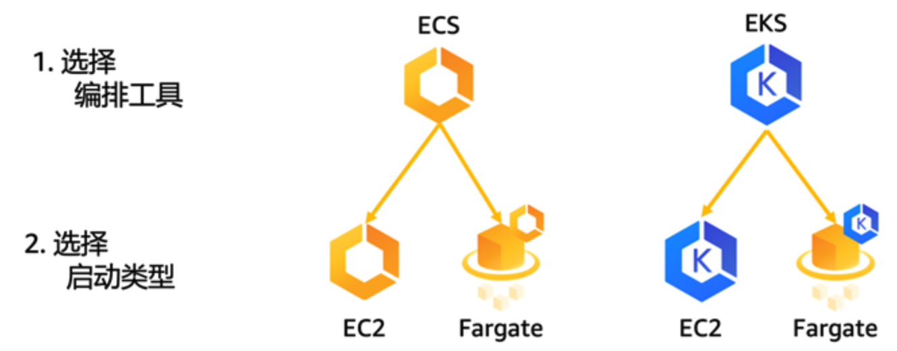
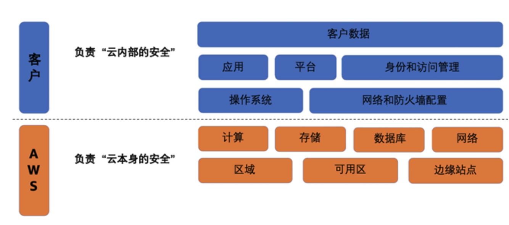
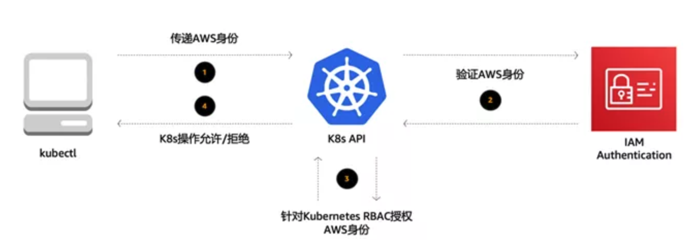
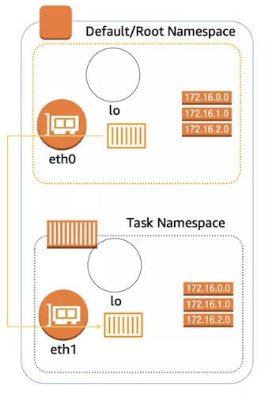
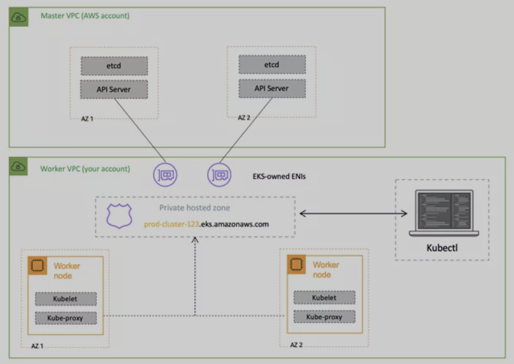
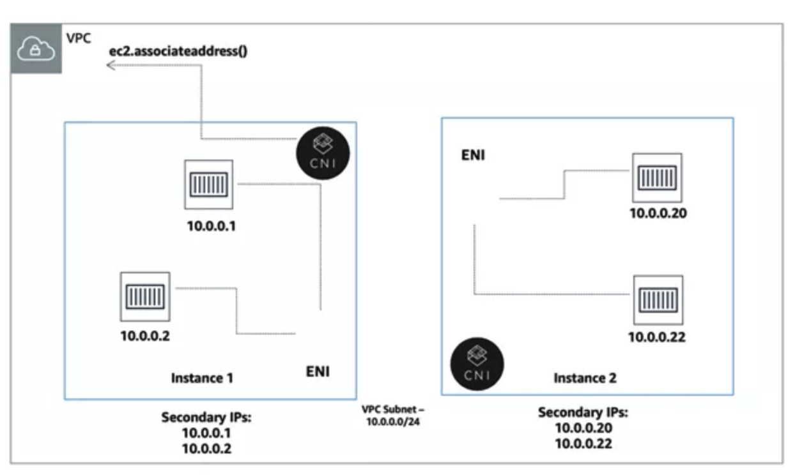
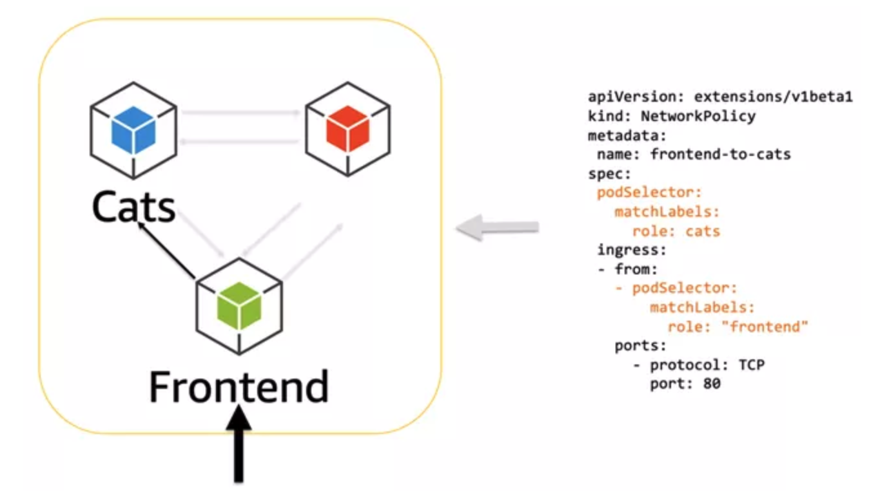
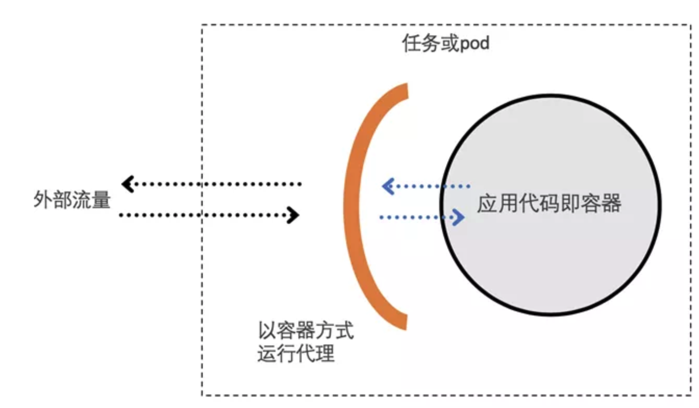

# **AWS 容器服务的安全实践**

随着微服务的设计模式得到越来越多开发者的实践，容器和微服务已经在生产环境中开始了规模化的部署。在这一过程中，也面临着越来越多的挑战。比如说，很多的微服务之间是相互依赖的，我们需要有更多的手段和方式来进行微服务的计划，扩展和资源管理，另外微服务之间的隔离更少，它们通常会共享内核或者网络，也对安全性提出了更高的要求。

**AWS是运行容器工作负载的首选平台。**

有第三方数据显示，云中80%的容器工作负载，和82%的Kubernetes工作负载构建在AWS云平台之上。在AWS上运行容器时，我们提供了更多的选择。

首先，您可以选择编排工具，您可以选择AWS原生的Amazon ECS或者支持Kubernetes的Amazon EKS。

其次，您可以选择启动类型，就是您是否要管理服务器。

如果您想要进行容器的无服务器计算，您可以选择AWS Fargate模式，如果您想要控制计算环境的安装，配置和管理，您可以选择Amazon EC2模式。我们提供更多的选择，也是希望能够以更灵活的方式帮助您把容器工作负载更快更好更安全的迁移到云端。

安全性和合规性是AWS和客户共同的责任，基于此，AWS提出了云安全的责任共担模式。这种责任区分为云本身的安全和云内部的安全。AWS负责云本身的安全，包括保护所有运行AWS云服务的基础设施，包括区域，可用区，边缘站点，计算存储网络，数据库等等。客户负责云内部的安全。客户的责任由客户使用的AWS服务确定，通常来讲，客户会负责操作系统的安全，网络和防火墙的配置，身份和访问管理，应用，平台和客户数据的安全。同时，对于客户负责的云内部安全，AWS提供了大量的工具帮助用户提升安全性。

首先，我们看一下身份和访问管理。谈到身份和访问管理，我们很容易就会想到AWS IAM服务，它能够安全的管理对AWS服务和资源的访问。

您可以使用IAM创建和管理AWS用户和组，并使用各种权限来允许或者拒绝这些用户和组对AWS资源的访问。对于ECS来说，由于它是AWS原生的容器解决方案。

**使用IAM就可以完全管理身份和访问控制。而对于EKS则需要同时了解和配置IAM和Kubernetes RBAC，就是基于角色的访问控制。IAM负责将权限分配到AWS服务，而RBAC负责控制资源的权限**。

下面我们看一下Kubernetes的管理工具kubectl的执行过程是如何在EKS上进行身份认证的。

比如说启动命令`kubectl get pods`，在这里我们通过kubectl访问`Kubernetes`的`API`，在其中我们会传递`AWS`相关的身份信息，`Kubernetes`会向`IAM`验证身份信息，这里我们会用到IAM认证的一个插件，**`aws-iam-authenticator`，它是AWS官方用于连接验证身份信息的一个工具，验证返回之后，`Kubernetes API`针对RBAC来授权AWS身份的资源访问权限，最后向kubectl返回执行结果是允许还是拒绝**。

对于Kubernetes来说，RBAC很重要，在这里我们不详细展开，大家有需要可以参阅Kubernetes的相关文档。这里我们只做一些基本介绍。

在RBAC中，一个角色，role，它包含一组相关权限的规则。

在RBAC中，权限是纯粹累加的，并不存在拒绝某操作的规则。角色可以用Role定义到某个命名空间上，或者用ClusterRole定义到整个集群。

**在RBAC中，可以定义描述资源，比如pod和node；允许对资源使用动词，比如get，update和delete。同时，RBAC上内置了一系列默认的ClusterRoles，包括cluster-admin，admin，edit，view，赋予不同的用户对不同的资源进行不同的操作的权限。**

另外，通过 Amazon EKS 集群上服务账户 (service account)的 IAM 角色，您可以将 IAM 角色与 Kubernetes 服务账户关联。然后，此服务账户就能够为使用它的任何一个 Pod 中的容器提供 AWS 权限。您可以将 IAM 权限范围限定到服务账户，并且只有使用该服务账户的 Pod 可以访问这些权限。 

其次，我们看一下平台安全。在这里，我们考虑的是记录和审核控制平面的安全。控制平面的日志记录，特别是围绕API动作的审核记录，是平台安全的重要部分。对于ECS来讲，由于它是AWS原生的容器服务，所以和其它AWS产品一下，控制平面的日志会进入AWS CloudTrail中，进行云资源调用的记录。

**CloudTrail 是一项支持对AWS 账户进行监管、合规性检查、操作审核和风险审核的服务**。

借助 CloudTrail，您可以记录日志、持续监控并保留与整个 AWS 基础设施中的操作相关的账户活动。对于Kubernetes来讲，它的控制平面包括审计跟踪，但这些日志在默认情况下不会公开。EKS有一个功能可以启用这些日志，我们建议启用并且将它们发送到Amazon CloudWatch进行进一步的处理并发现洞察。

**第三，我们看一下网络和防火墙的配置，这也是容器安全实践中最重要的部分。对于ECS来讲，由于它是AWS的原生服务，您只需要了解和配置Amazon VPC和AWS安全组即可。而对于EKS，除了管理VPC和安全组之外，还需要安装和配置Kubernetes的网络插件和网络策略等。**

**我们先来看一下ECS的网络配置。当我们将ECS与VPC结合使用的时候，每个任务都会有自己专用的弹性网络接口 (ENI)。由于每个任务和每个ENI是一一对应的，而每个ENI和安全组也是一一对应的，因此每个任务进出的任何通信都会通过安全组来进行，从而简单便捷的实现网络的安全性。**

对于EKS来讲，在创建新的Kubernetes集群的时候，EKS会为与集群通信的托管Kubernetes API服务器创建一个终端节点。

默认情况下，这个API终端节点对于Internet是公有的，对API终端节点的访问，我们使用AWS IAM和Kubernetes RBAC的组合加以保护。

**但是我们建议您启动Kubernetes API终端节点的私有访问，以使得工作节点和API终端节点之间的所有通信都在VPC之内。**

**您可以限制从Internet访问API终端节点的IP地址，或者完全禁用对API终端节点的Internet访问**。

**Amazon VPC CNI目前是Amazon EKS集群默认的网络插件。**

在Amazon VPC CNI中，对于每个Kubernetes节点，我们创建多个ENI并且分配辅助IP地址，对于每个Pod，我们选择空闲的辅助IP地址进行分配。

**这样通过Amazon VPC CNI，可以使得EKS得到原生的Amazon VPC网络支持，使得Pod和Pod直接互联互通，包括单一主机内的Pod通信，不同主机内的Pod通信，甚至是Pod和其他AWS服务，Pod和On-Premise，Pod和Internet的通信，并提供了更快的网络延迟。Amazon VPC CNI是一个开源项目，在GitHub上进行维护**。

对于Kubernetes来讲，网络策略是一种关于 Pod 间及Pod与其他网络间所允许的通信规则的规范。如果在EKS上进行网络策略管理，**首先需要将网络策略提供程序添加到EKS中**。

Calico是EKS官方文档中介绍的一种主流的方式。

一种既可以分配EC2实例级IAM角色，又可以完全信任基于安全组的方式，是为不同的Pod使用不同的工作节点集群，甚至是完全独立的集群。

**EKS有NodeGroup的概念，它是一个独立的自动伸缩的工作节点组，可以对其进行标记，这样您就可以限制哪些Pod/服务可以在其上运行。**

另外，服务网格也是可以对网络进行配置和管理的一种方法。您可以使用服务网格来对所有服务进行加密和身份验证，而不是强加AWS安全组或Kubernetes网络策略之类的网络级限制，从而在保持安全的同时允许更扁平的底层未分级网络。

服务网格通常是通过一组轻量级的网络代理，与应用代码部署在一起来实现的。网络代理包含在每一个微服务之中，主要处理微服务之间的通信，监控，以及一些安全相关的工作。我们可以使用服务网格增强安全性。以传输身份认证举例，传输身份验证可以理解为服务到服务的身份验证，服务网格提供双向TLS功能来实现。

**当开启了双向TLS后，服务间的流量为加密流量，并且相互根据证书以及密钥进行访问从而保障服务间的通信安全。**

**AWS App Mesh是AWS推出服务网格，App Mesh 能够与 AWS 服务集成以进行监控和跟踪，还可以与很多常用的第三方工具结合使用。**

App Mesh 可以与在 AWS 上运行的各种容器，包括ECS，EKS，Fargate，以及自建Kubernetes集群结合使用。**另外，Istio也已经支持在EKS上很好的部署**。

**第四，我们看一下操作系统的安全。**

在容器的EC2模式中，客户的安全责任更多一些。

比如要选择的实例类型和数量，CPU与RAM的比率是多少，扩展能力和可用性是多少；还有选择哪个操作系统，何时进行操作系统加固，何时给OS，Docker，ECS代理或kubelet打补丁等等，这些都是客户的责任。

在Fargate的模式下，对于安全责任，AWS做得更多，客户做得更少。AWS负责扩展、修补、保护和管理服务器，为OS，Docker， ECS代理等进行打补丁的操作。

**Fargate需要运行在VPC网络中，在Fargate中也没有容器的特权模式，各个 ECS 任务或 EKS Pod 各自在其自己的专用内核运行时环境中运行，并且不与其他任务和 Pod 共享 CPU、内存、存储或网络资源。这样可以确保针对每个任务或 Pod 进行工作负载隔离并提高安全性**。

对于EKS来讲，Kubernetes的更新也是一个很重要的话题。

通常，Kubernetes每个季度都有一个新的主要版本，同时也会定期发布新的次要版本，有时Kubernetes更新与安全性相关。

EKS具有用于触发控制平面更新的API，在触发之后您需要更新工作节点，例如，Kubernetes以及Docker和OS。通常工作节点在一个自动扩展组中，因此我们需要重新构建或者更新AMI。AWS为工作节点提供定期自动更新的的AMI和手动更新的脚本。

第五，我们看一下容器中客户数据的安全。

**AWS同时具有Parameter Store和Secrets Manager来存储您的机密。**

它们已集成到ECS中，但对于EKS，需要通过CLI或SDK在Kubernetes的Pod中调用它们。Kubernetes的内置Secrets功能将机密存储在其控制平面中，并通过环境变量或文件系统中的文件将其放入正在运行的Pod中，但是不能在Kubernetes集群之外使用它们。

我们在最近发布了一个新的功能。您可以使用 AWS Key Management Service (KMS) 生成的密钥，对EKS中存储的 Kubernetes Secrets进行信封加密；

或者，您也可以将其他地方生成的密钥导入KMS，并在EKS集群中使用。实施信封加密被视为存储敏感数据的一种最佳安全实践。

我们使用开源的AWS Encryption Provider在EKS中为您提供KMS机密的信封加密。这个项目得到了Kubernetes社区和Kubernetes兴趣小组的支持。

**最后，我们看一下容器镜像的安全。**

容器镜像安全的最佳实践包括：不在容器镜像内部存储机密；

让一个容器对应一个服务，在任务/Pod内使用Sidecar代理；

最小化容器体积，只包括运行时需要的内容等等。

同时，我们要使用已知且受信任的基本镜像，包括使用Docker Hub上的官方镜像，仔细阅读Dockerfiles，扫描镜像以获取CVE。

我们需要在Dockerfile中指定USER和最小权限，以及为容器镜像建立独特且内容丰富的标签，来快速分辨出容器镜像的版本。容器镜像的扫描包括注册表中的镜像扫描，构建管道中的镜像，和运行时的容器镜像扫描。

注册表中的镜像扫描由Docker Hub和Amazon ECR提供。

另外还有一些第三方的开源或商业软件可以对构建管道中的镜像或者运行时的镜像进行扫描。还有，我们也要保证运行时的容器安全。我们可以通过规则引擎限制可以在容器中执行的操作，例如，“请勿运行容器中未包含的内容”或 “请勿运行不在此白名单中的内容”来确保只能在集群中部署/运行受信任的镜像，我们需要随时了解整个环境的运行时行为，一旦遇到CVE公开，立即检测运行中的易受攻击的容器。

## 总结

在AWS中安全运行容器时，客户应承担许多责任，运行EKS相比ECS更是如此。需要深入研究的关键领域包括：身份和访问管理，网络拓扑和防火墙，记录和审核，任务/Pod之间的加密和相互认证，容器镜像，容器主机和Kubernetes控制平面的补丁操作，机密管理，容器镜像的运行时安全等等。

