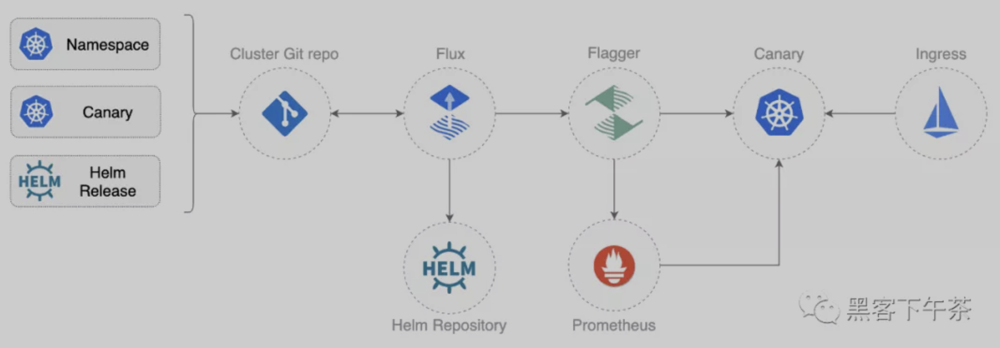
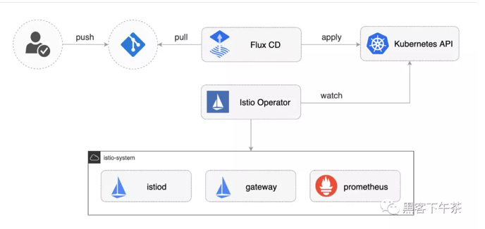
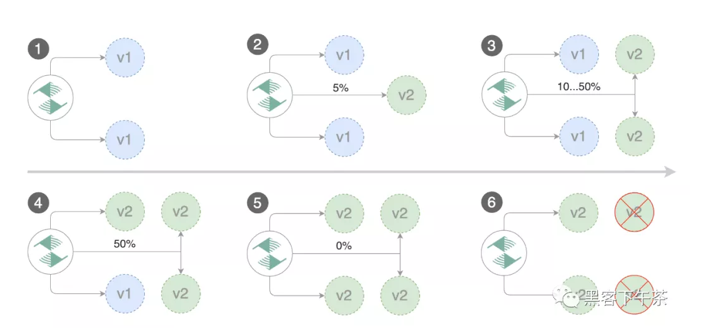
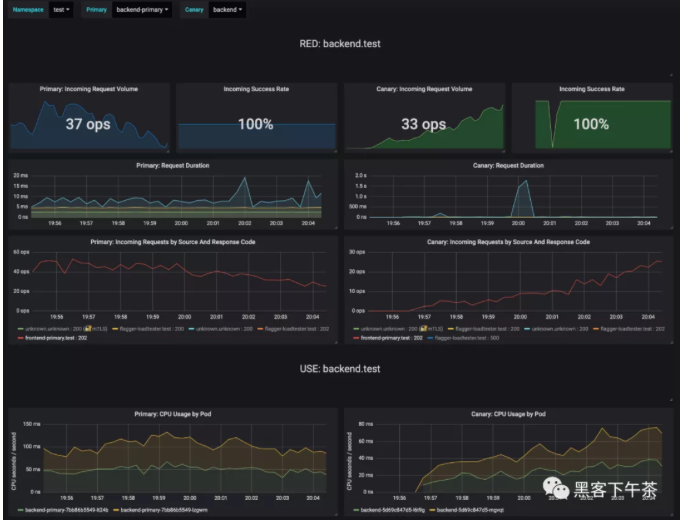

# 使用 Flux+Flagger+Istio+Kubernetes 实战 GitOps 云原生渐进式(金丝雀)交付

使用 Kubernetes 和 Istio 使用 GitOps 进行渐进式交付(Progressive Delivery)的实际经验。

## 1、介绍

Demo: https://github.com/stefanprodan/gitops-istio

### **1-1 GitOps 是什么？**

**GitOps 是一种进行持续交付的方式，它使用 Git 作为声明性(declarative)基础设施和工作负载(workloads)的真实来源。**

对于 Kubernetes，这意味着使用 git push 而不是 `kubectl apply/delete` 或 `helm install/upgrade`。


在这个 workshop 中，您将使用 GitHub 来托管配置存储库，**并将 Flux 作为 GitOps 交付解决方案。**

### **1-2 什么是渐进式交付？**

渐进交付是高级部署模式（如金丝雀canaries、功能标志feature flags和A/B测试A/B testing）的总称。

渐进交付技术通过让应用程序开发人员和 SRE 团队对爆炸半径blast radius进行细粒度控制，从而降低在生产中引入新软件版本的风险。


**在这个 workshop 中，您将使用 `Flagger `和 `Prometheus` 为您的应用程序自动执行 Canary 发布和 A/B Testing**。




## 2、准备工作

您将需要具有 LoadBalancer 支持的 Kubernetes 集群 v1.16 或更高版本。出于测试目的，您可以使用带有 2 个 CPU 和 4GB 内存的 Minikube。

使用 Homebrew 安装 flux CLI：

```
brew install fluxcd/tap/flux
```

macOS AMD64/ARM64、Linux AMD64/ARM 和 Windows 的二进制文件可在 `flux2 release page` 下载。


验证您的集群是否满足前提条件：

```
flux check --pre
```

使用 Homebrew 安装 jq 和 yq：

```
brew install jq yq
```

Fork 这个仓库并克隆它：

```
git clone https://github.com/<YOUR-USERNAME>/gitops-istio
cd gitops-istio
```

## Cluster bootstrap


使用 `flux bootstrap` 命令，您可以在 `Kubernetes` 集群上安装 Flux 并将其配置为从 Git 存储库管理自身。如果集群上存在 Flux 组件，则 `bootstrap` 命令将在需要时执行升级。

通过指定您的 GitHub 存储库 fork URL 来引导 Flux：

```
flux bootstrap git \
  --author-email=<YOUR-EMAIL> \
  --url=ssh://git@github.com/<YOUR-USERNAME>/gitops-istio \
  --branch=main \
  --path=clusters/my-cluster
```


上面的命令需要 ssh-agent，如果您使用的是 Windows，请参阅 flux bootstrap github 文档。


在引导时，Flux 生成一个 `SSH key` 并打印 `public key`。为了用 git 同步你的集群状态，你需要复制 public key 并使用 write 创建一个 `deploy key` 访问你的 GitHub 仓库。在 `GitHub `上转到 `Settings > Deploy keys `点击 `Add deploy key`， 勾选☑️ Allow write access，粘贴 Flux public key 并单击 Add key。

当 Flux 访问你的存储库时，它会做以下事情：


* 安装 Istio operator
* 等待 Istio 控制平面准备好
* 安装 Flagger、Prometheus 和 Grafana
* 创建 Istio 公共网关
* 创建 prod 命名空间namespace
* 创建负载测试器(load tester) deployment
* 创建前端(frontend) deployment 和金丝雀canary
* 创建后端(backend) deployment 和金丝雀canary

使用 Istio 引导集群时，定义 apply 顺序很重要。对于要使用 Istio sidecar 注入的应用程序 pod，Istio 控制平面必须在应用程序之前启动并运行。

在 `Flux v2` 中，你可以通过定义对象之间的依赖关系来指定执行顺序。例如，在 `clusters/my-cluster/apps.yaml` 中我们告诉 `Flux`，`apps` 的协调取决于一个 `istio-system` ：

```
apiVersion: kustomize.toolkit.fluxcd.io/v1beta1
kind: Kustomization
metadata:
  name: apps
  namespace: flux-system
spec:
  interval: 30m0s
  dependsOn:
    - name: istio-system
  sourceRef:
    kind: GitRepository
    name: flux-system
  path: ./apps
```

首先观测 Flux 安装 Istio，然后观测 demo apps：

```
watch flux get kustomizations
```

您可以使用以下命令跟踪 `Flux reconciliation` 日志：

```
flux logs --all-namespaces --follow --tail=10
```

## Istio 定制和升级



您可以使用位于 `istio/system/profile.yaml `的 IstioOperator 资源自定义 Istio 安装：

```
apiVersion: install.istio.io/v1alpha1
kind: IstioOperator
metadata:
  name: istio-default
  namespace: istio-system
spec:
  profile: demo
  components:
    pilot:
      k8s:
        resources:
          requests:
            cpu: 10m
            memory: 100Mi
```

修改 Istio 设置后，您可以将更改推送到 git，Flux 将在集群上应用它。Istio operator 将根据您的更改重新配置 Istio 控制平面。


当新的 Istio 版本可用时，`update-istio GitHub Action workflow` 工作流将打开一个`pull request`，其中包含升级 `Istio Operator` 所需的清单更新。新的 Istio 版本通过 `e2e workflow` 在 `Kubernetes Kind` 上进行测试，当 PR 合并到主分支时，Flux 将在集群内升级 Istio。


## 应用程序引导


**当 Flux 将 Git 存储库与您的集群同步时，它将创建前端/后端部署(frontend/backend deployment)、HPA 和一个金丝雀对象canary object。**

Flagger 使用 canary 定义创建了一系列对象：Kubernetes deployments、ClusterIP services、Istio 目标规则(destination rules)和虚拟服务(virtual services)。

这些对象在网格(mesh)上公开(expose)应用程序，并推动金丝雀分析(canary analysis)和推广(promotion)。

```
# applied by Flux
deployment.apps/frontend
horizontalpodautoscaler.autoscaling/frontend
canary.flagger.app/frontend

# generated by Flagger
deployment.apps/frontend-primary
horizontalpodautoscaler.autoscaling/frontend-primary
service/frontend
service/frontend-canary
service/frontend-primary
destinationrule.networking.istio.io/frontend-canary
destinationrule.networking.istio.io/frontend-primary
virtualservice.networking.istio.io/frontend
```

检查 Flagger 是否成功初始化了金丝雀：

```
kubectl -n prod get canaries

NAME       STATUS        WEIGHT
backend    Initialized   0
frontend   Initialized   0
```

当 `frontend-primary` 部署上线时，`Flager` 会将所有流量路由到主 `Pod`，并将 frontend 部署 scale 到零。

使用以下命令查找 Istio 入口网关(ingress gateway)地址：

```
kubectl -n istio-system get svc istio-ingressgateway -ojson | jq .status.loadBalancer.ingress
```

打开浏览器并导航到入口地址，您将看到前端 UI。

## 金丝雀发布

Flagger 实现了一个控制循环，该控制循环在测量关键性能指标（如 HTTP 请求成功率、请求平均持续时间和 pod 运行状况）的同时，逐步将流量转移到金丝雀。在分析 KPI 的基础上，将金丝雀升级或中止，并将分析结果发布到 Slack。

金丝雀分析由以下任何对象的更改触发：

* 部署 PodSpec（容器镜像、命令、端口、环境等）
* ConfigMaps 和 Secrets 作为卷(volumes)挂载或映射到环境变量

对于不接收恒定流量的工作负载，**Flagger 可以配置一个 webhook，当它被调用时，将启动一个目标工作负载的负载测试。canary 配置可以在 apps/backend/canary.yaml 上找到**。


从 GitHub 拉取更改：

```
git pull origin main
```

要触发后端应用程序的金丝雀部署，请碰撞容器镜像：

```
yq e '.images[0].newTag="5.0.1"' -i ./apps/backend/kustomization.yaml
```



提交和推送更改：

```
git add -A && \
git commit -m "backend 5.0.1" && \
git push origin main
```

告诉 Flux 拉取更改或等待一分钟让 Flux 自行检测更改：

```
flux reconcile source git flux-system
```
观测 Flux 将您的集群与最新提交进行协调：

```
watch flux get kustomizations
```

几秒钟后，Flager 检测到部署修订(deployment revision)已更改并开始新的 rollout：

```
$ kubectl -n prod describe canary backend

Events:

New revision detected! Scaling up backend.prod
Starting canary analysis for backend.prod
Pre-rollout check conformance-test passed
Advance backend.prod canary weight 5
...
Advance backend.prod canary weight 50
Copying backend.prod template spec to backend-primary.prod
Promotion completed! Scaling down backend.prod
```

在分析过程中，Grafana 可以监控金丝雀的进程。您可以通过端口转发访问仪表板：

```
kubectl -n istio-system port-forward svc/flagger-grafana 3000:80
```

Istio 仪表板的 URL 是 `http://localhost:3000/d/flagger-istio/istio-canary?refresh=10s&orgId=1&var-namespace=prod&var-primary=backend-primary&var-canary=backend`


请注意，如果在金丝雀分析(canary analysis)期间对部署应用了新的更改，Flagger 将重新启动分析阶段。





## **A/B 测试**

除了加权路由(weighted routing)，Flagger 还可以配置为根据 HTTP 匹配条件将流量路由到金丝雀。在 A/B 测试场景中，您将使用 HTTP headers 或 cookie 来定位用户的特定部分。这对于需要会话(session)关联的前端应用程序特别有用。

您可以通过指定 HTTP 匹配条件和迭代次数来启用 A/B 测试：

```
  analysis:
    # schedule interval (default 60s)
    interval: 10s
    # max number of failed metric checks before rollback
    threshold: 10
    # total number of iterations
    iterations: 12
    # canary match condition
    match:
      - headers:
          user-agent:
            regex: ".*Firefox.*"
      - headers:
          cookie:
            regex: "^(.*?;)?(type=insider)(;.*)?$"
```

上述配置将针对 Firefox 用户和拥有内部 cookie 的用户运行两分钟的分析。前端配置可以在 `apps/frontend/canary.yaml` 中找到。

通过更新前端容器镜像触发部署：

```
yq e '.images[0].newTag="5.0.1"' -i ./apps/frontend/kustomization.yaml

git add -A && \
git commit -m "frontend 5.0.1" && \
git push origin main

flux reconcile source git flux-system
```

Flager 检测到部署修订已更改并开始 A/B 测试：

```
$ kubectl -n istio-system logs deploy/flagger -f | jq .msg

New revision detected! Scaling up frontend.prod
Waiting for frontend.prod rollout to finish: 0 of 1 updated replicas are available
Pre-rollout check conformance-test passed
Advance frontend.prod canary iteration 1/10
...
Advance frontend.prod canary iteration 10/10
Copying frontend.prod template spec to frontend-primary.prod
Waiting for frontend-primary.prod rollout to finish: 1 of 2 updated replicas are available
Promotion completed! Scaling down frontend.prod
```

您可以通过以下方式监控所有金丝雀：

```
$ watch kubectl get canaries --all-namespaces

NAMESPACE   NAME      STATUS        WEIGHT
prod        frontend  Progressing   100
prod        backend   Succeeded     0
```

## 基于 Istio 指标的回滚

Flagger 使用 Istio 遥测提供的指标来验证金丝雀工作负载。前端应用 analysis 定义了两个指标检查：

```
    metrics:
      - name: error-rate
        templateRef:
          name: error-rate
          namespace: istio-system
        thresholdRange:
          max: 1
        interval: 30s
      - name: latency
        templateRef:
          name: latency
          namespace: istio-system
        thresholdRange:
          max: 500
        interval: 30s
```
 
 用于检查错误率(error rate)和延迟的 Prometheus 查询，位于 flagger-metrics.yaml

在金丝雀分析期间，您可以生成 HTTP 500 errors 和高延迟(high latency)来测试 Flagger 的回滚。

生成 HTTP 500 errors：

```
watch curl -b 'type=insider' http://<INGRESS-IP>/status/500
```

生成延迟：

```
watch curl -b 'type=insider' http://<INGRESS-IP>/delay/1
```

当失败的检查次数达到金丝雀分析阈值(threshold)时，流量将路由回主服务器，金丝雀缩放为零，并将推出(rollout)标记为失败。

```
$ kubectl -n istio-system logs deploy/flagger -f | jq .msg

New revision detected! Scaling up frontend.prod
Pre-rollout check conformance-test passed
Advance frontend.prod canary iteration 1/10
Halt frontend.prod advancement error-rate 31 > 1
Halt frontend.prod advancement latency 2000 > 500
...
Rolling back frontend.prod failed checks threshold reached 10
Canary failed! Scaling down frontend.prod
```

您可以使用针对 Prometheus、Datadog 和 Amazon CloudWatch 的自定义指标检查来扩展分析。


