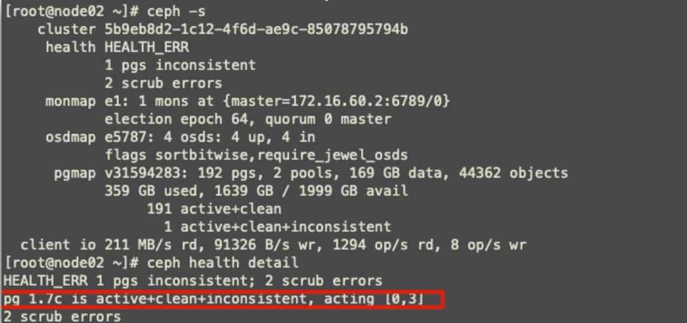
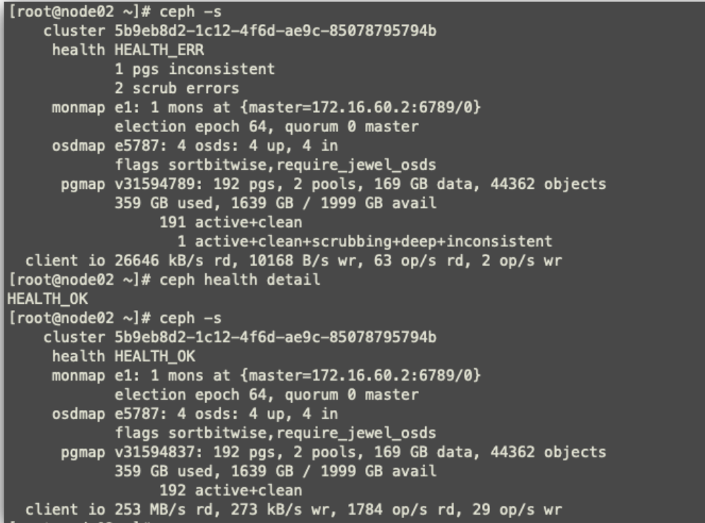
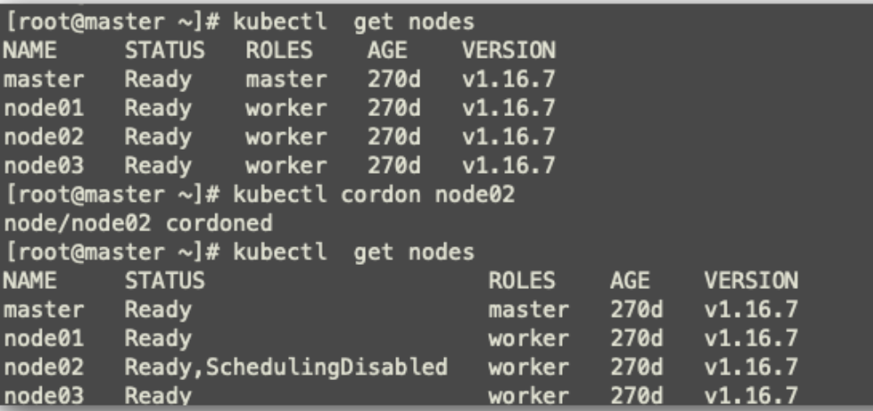
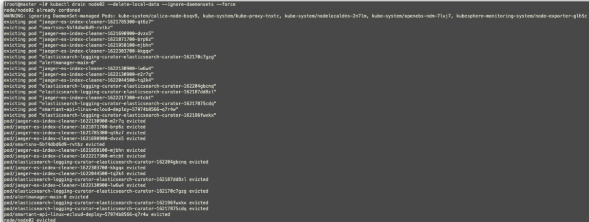
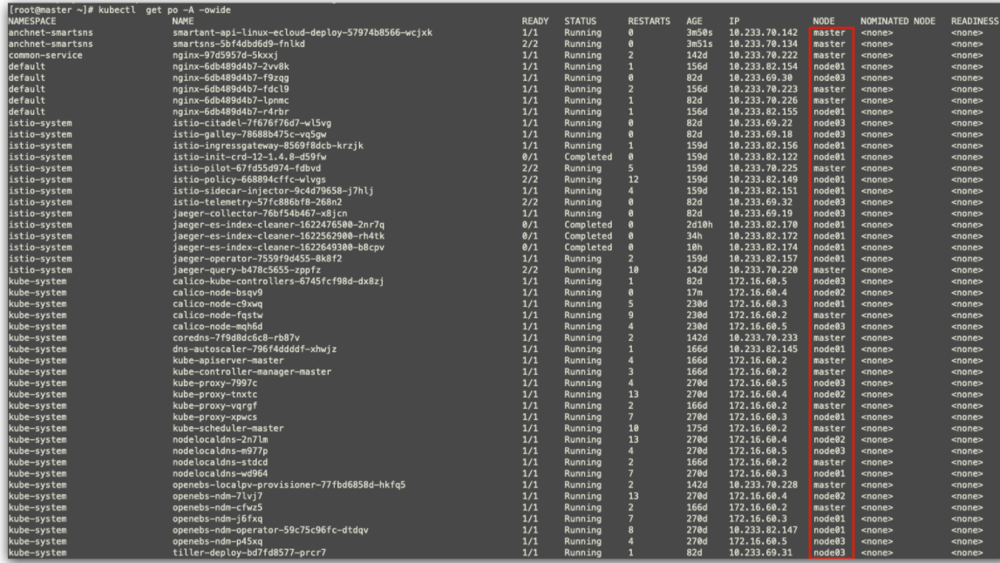
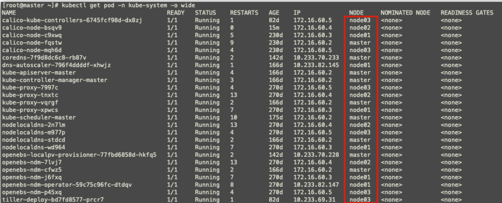
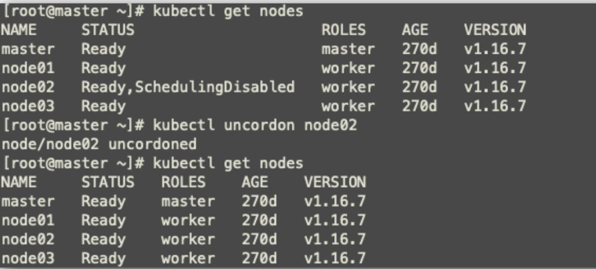

# 一次K8s排错实战

## 一 背景

收到测试环境集群告警，登陆K8s集群进行排查。

## 二 故障定位

### 2.1 查看pod

查看`kube-system node2`节点calico pod异常


**查看详细信息,查看node2节点没有存储空间，cgroup泄露**


### 2.2 查看存储

* 登陆node2查看服务器存储信息，目前空间还很充足


* 集群使用到的分布式存储为ceph，因此查看ceph集群状态



## 三 操作

### 3.1 ceph修复

目前查看到ceph集群异常，可能导致node2节点cgroup泄露异常，进行手动修复ceph集群。

> 数据的不一致性（inconsistent）指对象的大小不正确、恢复结束后某副本出现了对象丢失的情况。数据的不一致性会导致清理失败（scrub error）。
> 
> CEPH在存储的过程中，由于特殊原因，可能遇到对象信息大小和物理磁盘上实际大小数据不一致的情况，这也会导致清理失败。


由图可知，pg编号1.7c 存在问题，进行修复。

* pg修复

```
ceph pg repair 1.7c
```


* 进行修复后，稍等一会，再次进行查看，ceph集群已经修复





### 3.2 进行pod修复

对异常pod进行删除，由于有控制器，会重新拉起最新的pod


查看pod还是和之前一样，分析可能由于ceph异常，导致node2节点cgroup泄露，网上检索重新编译

* Kubelet 宿主机的 Linux 内核过低 - `Linux version 3.10.0-862.el7.x86_64`
* 可以通过禁用kmem解决

查看系统内核却是低版本


### 3.3 故障再次定位


最后，因为在启动容器的时候runc的逻辑会默认打开容器的kmem accounting，导致3.10内核可能的泄漏问题
**在此需要对no space left的服务器进行 reboot重启，即可解决问题，出现问题的可能为段时间内删除大量的pod所致。**


初步思路，可以在今后的集群管理汇总，对服务器进行维修，通过删除节点，并对节点进行reboot处理

### 3.4 对node2节点进行维护

**标记node2为不可调度**

```
kubectl cordon node02
```


 
**驱逐node2节点上的pod**

```
kubectl drain node02 --delete-local-data --ignore-daemonsets --force
```

* `--delete-local-data`  删除本地数据，即使emptyDir也将删除；
* `--ignore-daemonsets`  忽略DeamonSet，否则DeamonSet被删除后，仍会自动重建；
* `--force`  不加force参数只会删除该node节点上的ReplicationController, ReplicaSet, DaemonSet,StatefulSet or Job，加上后所有pod都将删除；



目前查看基本node2的pod均已剔除完毕






此时与默认迁移不同的是，**pod会先重建再终止**，**此时的服务中断时间=重建时间+服务启动时间+readiness探针检测正常时间，必须等到`1/1 Running`服务才会正常。因此在单副本时迁移时，服务终端是不可避免的**。

**对node02进行重启**

重启后node02已经修复完成。

对node02进行恢复

恢复node02可以正常调度

```
kubectl uncordon node02
```



## 四 反思

* 后期可以对部署k8s 集群内核进行升级。
* 集群内可能pod的异常，由于底层存储或者其他原因导致，需要具体定位到问题进行针对性修复。