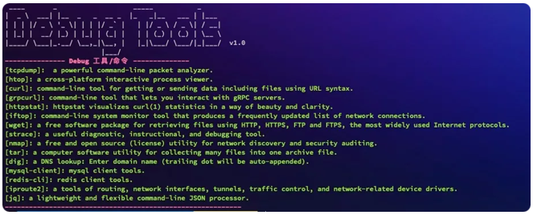

# **如何用 K8S 临时容器来调试 Pods**

曾几何时，我们将自己的应用运行在Kubernetes上，每当出现容器异常崩溃时，我们往往都是一边重启容器，一边面对崩溃的容器无从下手。


通常在业务研发自己build的镜像内包含了shell，我们还能通过在command中嵌入一个`["sleep", "3600"]`命令来阻塞容器内服务启动，不过也有时候会出现不知道从哪里冒出来一个`distroless`镜像，这时可能最先崩溃的就是运维了。

那是一种运维这个职业自诞生以来，第一次感受到手足无措并脱离掌控的无助感。于是在k8s环境下无法debug容器的梗开始在坊间广为吐槽。


第一个打破魔咒的是`kubectl-debug`，它包含了`agent`和`debug-tools`两个部分。

也是目前全网内搜到文档最全的解决方案。不过目前它的开发似乎已经停止，上一次提交还是在8个月之前，而最近一次Release版本也停留在两年前。

更难以接受的是，当前它无法被集成在容器运行时为Containerd的k8s集群。

尽管`kubectl-debug`曾经确实是一款非常好用的容器调试工具，但如今Kubernetes已经有了更好的容器调试解决方案，**Ephemeral Containers**


## Ephemeral Containers

**Ephemeral Containers字如其名，它就是一个临时容器。这是一个自Kubernetes v1.16中作为alpha引入的新功能**，虽然当前它还没有GA，不过自从在Kubernetes v1.18之后，在kubectl内已经集成了debug客户端，我们几乎可以完整的使用并体验它的新特性。

临时容器的目标是为Kubernetes用户提供一个故障诊断工具，同时具备满足以下需求：

* 作为一个开箱即用的平台化工具
* 不依赖于已经包含在容器镜像中的工具
* 不需要直接登陆计算节点(可以通过Kubernetes API的管理访问Node)

不过也有东西是临时容器不计划支持的，比如对windows上启用临时容器就不太友好。


启用临时容器的特性也非常简单，在kubernetes v1.16之后的版本中将启动参数`--feature-gates=EphemeralContainers=true`配置到`kube-api`和`kubelet`服务上重启即可。

> 在1.20之前，kubectl debug工具被放在alpha中，注意不同版本的命令操作差别 这里推荐使用客户端为1.20+的版本体验会更好

那么我们有了Ephemeral Containers能做哪些事情呢？

### 1. POD Troubleshooting

如上文所说，我们可以直接通过kubectl debug命令进行容器调试。最直接简单的对一个pod进行调试命令如下：

```
kubectl debug mypod -it --image=busybox
```

默认情况下用户不指定临时容器名称的话，debug容器名称就由kubectl自动生成一个唯一id的名称。如果用户需要自己指定容器名称则使用

```
kubectl debug mypod -c debugger --image=busybox
```

有了临时容器除了日常debug功能外，我们可以扩展出很多新花样的玩法。比如批量跑某个命名空间下的安全扫描的脚本而不用干扰原容器。

```
for pod in $(kubectl get -o name pod); 
do
    kubectl debug --image security/pod_scanner -p $pod /sanner.sh
done
```

### 2. POD Troubleshooting by Copy

**对于没有开启Ephemeral Containers特性的集群，我们就只能通过复制模式来调试容器。它的原理是复制一个指定pod的新容器，并将debug作为sidecar跟随新容器一起启动**。

通过这种方式也能达到曲线救国的目的。此种方式的几个参数还是挺有意思：

```
--copy-to   指定新pod的名称
--replace=true   是否删除原容器
--same-node=true  是否调度到和原容器一样的node上
--share-processes=true  是否共享容器pid空间
```

例如我们就可以启动一个跟需要调试pod一样配置的debug容器如下：

```
kubectl debug mypod -it \
--container=debug \
--image=busybox \
--copy-to=my-debugger \
--same-node=true \
--share-processes=true 
```

### 3. Node Troubleshooting

对！你没看错！利用Ephemeral Containers还能对Worker节点进行调试。


当以节点为目标调用时，kubectl debug 将创建一个带有node名称的pod，并且调度到该节点。

同时该容器还具备了hostIPC、hostNetwork和hostPID这些特权模式。

不可思议的是`Worker`节点的根文件系统还被`mount`到了`debug`容器下的`/host`目录下。

直接执行这个命令就能debug主机。

```
kubectl debug node/mynode -it --image=busybox
```

## Debug镜像

工欲善其事，必先利其器。不管怎样我们都需要一套工具完善的debug镜像，在处理问题时能够得心应手。虽然网上也有不少debug镜像，不过都还是不如自己构建来的畅快。

这里小白分享一个Debug镜像的Dockerfile，大家可以根据自己条件修改即可。

```
FROM golang:alpine as grpcurl
RUN apk update \
  && apk add --virtual build-dependencies git \
  && apk add bash curl jq \
  && go get -u github.com/fullstorydev/grpcurl \
  && go install github.com/fullstorydev/grpcurl/cmd/grpcurl@latest

FROM alpine:latest
RUN sed -i 's/dl-cdn.alpinelinux.org/mirrors.tuna.tsinghua.edu.cn/g' /etc/apk/repositories && \
    apk update && \
    apk add --no-cache vim bash tcpdump curl wget strace mysql-client iproute2 redis jq iftop tzdata tar nmap bind-tools htop && \
    ln -sf /usr/share/zoneinfo/Asia/Shanghai /etc/localtime
RUN wget -O /usr/bin/httpstat https://github.com/davecheney/httpstat/releases/download/v1.0.0/httpstat-linux-amd64-v1.0.0 && \
    chmod +x /usr/bin/httpstat
COPY --from=grpcurl  /go/bin/grpcurl /usr/bin/grpcurl
ENV TZ=Asia/Shanghai LC_ALL=C.UTF-8 LANG=C.UTF-8 LANGUAGE=C.UTF-8
ENTRYPOINT [ "/bin/bash" ]
```

debug镜像内支持的工具包如下图



## 总结

本文主要讲述了kubernetes在v1.18版本之后被提上alpha的Ephemeral Containers特性，通过临时容器我们可以debug容器，甚至还可以debug主机。它确实是一个非常方便和足以替代kubectl-debug的解决方案。不过，目前临时容器对于用户权限这块并没有特别的说明，特别是用特权模式调试主机的时候，希望后面能够借助PSP（Pod Security Policy）做一个额外的补充。