# **Kubernetes 常见问题排查与解决方案大全**

### **1、`CRD spec.versions: Invalid value`**

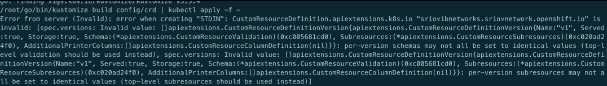

**原因**: CRD yaml 文件中 apiVersion 与 versions 中的版本不对应

参考: https://kubernetes.io/docs/tasks/extend-kubernetes/custom-resources/custom-resource-definition-versioning/


### **2、删除 namespaces 时 Terminating，无法强制删除且无法在该 ns 下创建对象**


**原因:** ns 处于 terminating 时 hang 住了，使用 `--grace-period=0 --force` 强制删除也无效

解决:

```
# 导出K8s访问密钥
echo $(kubectl config view --raw -oyaml | grep client-cert  |cut -d ' ' -f 6) |base64 -d > /tmp/client.pem
echo $(kubectl config view --raw -oyaml | grep client-key-data  |cut -d ' ' -f 6 ) |base64 -d > /tmp/client-key.pem
echo $(kubectl config view --raw -oyaml | grep certificate-authority-data  |cut -d ' ' -f 6  ) |base64 -d > /tmp/ca.pem

# 解决namespace Terminating，根据实际情况修改<namespaces>
curl --cert /tmp/client.pem --key /tmp/client-key.pem --cacert /tmp/ca.pem -H "Content-Type: application/json" -X PUT --data-binary @/tmp/temp.json https://xxx.xxx.xxx.xxx:6443/api/v1/namespaces/<namespaces>/finalize
```

### **3、Docker 启动时提示 no sockets found via socket activation**


**解决**: 在启动 Docker 前先执行 `systemctl unmask Docker.socket` 即可

### **4、Prometheus opening storage failed: invalid block sequence**

**原因**: 这个需要排查 Prometheus 持久化目录中是否存在时间超出设置阈值的时间段的文件，删掉后重启即可


### **5、PKubelet 提示: The node was low on resource: ephemeral-storage**

**原因**: 节点上 Kubelet 的配置路径超过阈值会触发驱逐，默认情况下阈值是 85%

**解决**: 或者清理磁盘释放资源，或者通过可修改 Kubelet 的配置参数`imagefs.available`来提高阈值,然后重启 Kubelet.

参考: https://cloud.tencent.com/developer/article/1456389

### **6、kubectl 查看日志时提示: `Error from server: Get https://xxx:10250/containerLogs/spring-prod/xxx-0/xxx: dial tcp xxx:10250: i/o timeout`**

**原因**: 目地机器的 iptables 对 10250 这个端口进行了 drop，如下图

```
iptables-save -L INPUT –-line-numbers
```

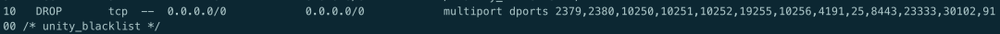

**解决**: 删除对应的规则

```
iptables -D INPUT 10
```

### **7、Service 解析提示 Temporary failure in name resolution**

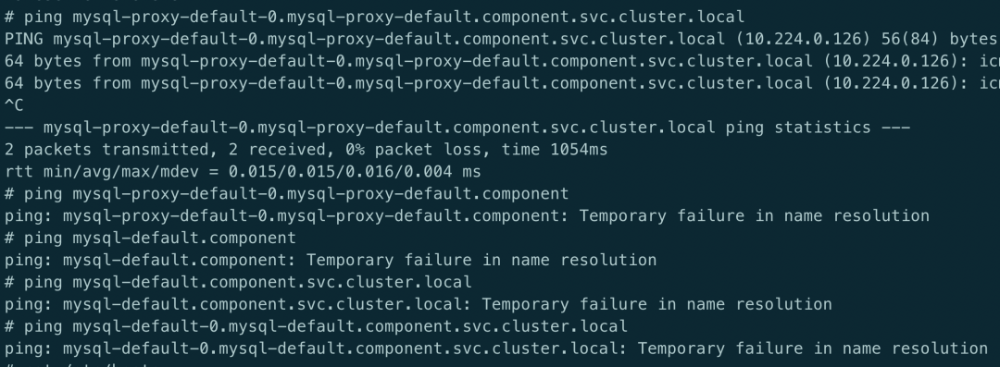


**原因**: 出现这种情况很奇怪，现象显示就是域名无法解析，全格式的域名能够解析是因为在 pod 的`/etc/hosts` 中有全域名的记录,那么问题就出在于 CoreDNS 解析上，CoreDNS 从日志来看，没有任何报错，但是从 pod 的状态来看，虽然处于 Running 状态，但是 `0/1` 可以看出 CoreDNS 并未处于 `ready` 状态.

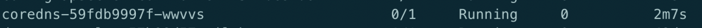


可以查看 ep 记录，会发现 Endpoint 那一栏是空的，这也就证实了 K8s 把 `CoreDNS` 的状态分为了 `notready` 状态，所以 `ep` 才没有记录，经过与其它环境比较后发现跟配置有关，最终定位在 `CoreDNS` 的配置文件上,在插件上需要加上 ready

解决: 在 cm 的配置上添加 read 插件，如下图

```
# ... 省略
data:
  Corefile: |
    .:53 {
        errors
        health
        ready  # 加上该行后问题解决
        kubernetes cluster.local in-addr.arpa ip6.arpa {
          pods insecure
          upstream /etc/resolv.conf
          fallthrough in-addr.arpa ip6.arpa
        }
       # ... 省略
```

关于 CoreDNS 的 ready 插件的使用,可以参考👉这里

总结起来就是使用 ready 来表明当前已准备好可以接收请求，从 codedns 的 yaml 文件也可以看到有`livenessProbe`

### **8、使用 Kubectl 命令行时提示: `Unable to connect to the server: x509: certificate relies on legacy Common Name field, use SANs or temporarily enable Common Name matching with GODEBUG=x509ignoreCN=0`**

**原因**: 这个跟本地的 go 环境有关


**解决**: 在使用 kubectl 前使用命令export GODEBUG=x509ignoreCN=0即可


### **9、namespaces "kube-system" is forbidden: this namespace may not be deleted**


**原因**: kube-system 是集群中受保护的 ns, 被禁止删除，主要是防止误操作，如果需要删除的话，可以使用 `--force`

参考: https://github.com/kubernetes/kubernetes/pull/62167/files


### **10、`unknown field volumeClaimTemplates`**

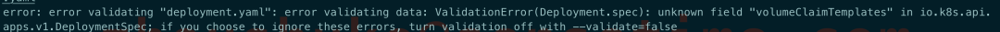

原因: 提示这个错误的原因是资源对象是 Deployment, 而 Deployment 本就是无状态的， 所以也就没有使用 pv 这一说法了，可以参考 api

### **11、CoreDNS 提示 `Loop (127.0.0.1:38827 -> :53) detected for zone "."`**

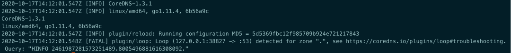

**原因**: CoreDNS 所在的宿主机上 `/etc/resolv.conf` 中存在有 127.0.xx 的 nameserver，这样会造成解析死循环。

**解决**: 修改宿主机 `/etc/resolv.conf` 或者将 `CoreDNS` 的 `ConfigMap` 中的 forward 修改为一个可用的地址, 如 `8.8.8.8`。

### **12、hostPath volumes are not allowed to be used**


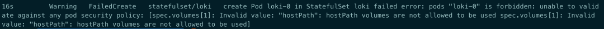

**原因**: 集群中存在 psp 禁止 pod 直接挂载 hostpath.

**解决**: 通过添加以下的 psp 规则来允许或者删除存在的 psp 都可

```
apiVersion: extensions/v1beta1
kind: PodSecurityPolicy
metadata:
  name: auth-privilege-psp
spec:
  allowPrivilegeEscalation: true
  allowedHostPaths:
  - pathPrefix: /
  fsGroup:
    ranges:
    - max: 65535
      min: 1
    rule: RunAsAny
  hostNetwork: true
  hostPID: true
  hostPorts:
  - max: 9796
    min: 9796
  privileged: true
  requiredDropCapabilities:
  - ALL
  runAsUser:
    rule: RunAsAny
  seLinux:
    rule: RunAsAny
  supplementalGroups:
    ranges:
    - max: 65535
      min: 1
    rule: RunAsAny
  volumes:
  - configMap
  - emptyDir
  - projected
  - secret
  - downwardAPI
  - persistentVolumeClaim
  - hostPath
```

### **13、container has runAsNonRoot and image has non-numeric user (grafana), cannot verify user is non-root**

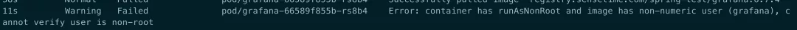

**原因**: 这是由于在 deploy 中设置了 `securityContext: runAsNonRoot: true`，在这种情况下，当 pod 启动时，使用的默认用户。比如上面的 grafana，K8s 无法确定他是不是 root 用户

**解决**: 指定 `securityContext:runAsUser: 1000`，随便一个 id 号即可，只要不是 0(0 代表 root)。

### **14、OCI runtime create failed: no such file or directory**

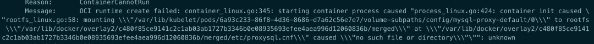


**原因**: `/var/lib/Kubelet/pod` 下的数据目录已经损坏.

**解决**: 删除对应的目录即可

### **15、镜像拉取时出现 ImageInspectError**

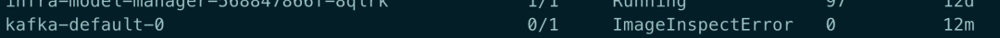

原因: 这种情况下一般都是镜像损坏了

解决: 把相关的镜像删除后重新拉取


### **16、Kubelet 日志提示: node not found**

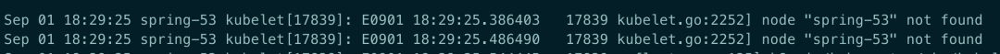

原因: 这个报错只是中间过程，真正的原因在于 apiserver 没有启动成功，导致会一直出现这个错误

解决: 排查 Kubelet 与 apiserver 的连通是否正常

### **17、OCI runtime create failed: executable file not found in PATH**

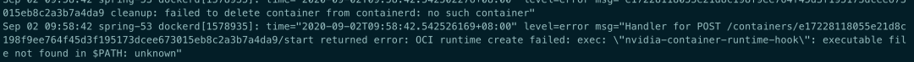

**原因**: 在 path 中没有 `nvidia-container-runtime-hook` 这个二进制文件，可能跟本人删除 nvidia 显卡驱动有关.

**解决**: `nvidia-container-runtime-hook` 是 Docker nvidia 的 runtime 文件，重新安装即可.

### **18、Nginx Ingress Empty address**

```
# kubectl get ingress
NAME         HOSTS                                       ADDRESS   PORTS   AGE
Prometheus   Prometheus.1box.com                                   80      31d
```

会发现 address 中的 ip 是空的，而查看生产环境时却是有 ip 列表的.

**原因**: 这个其实不是一个错误，也不影响使用，原因在于测试环境中是不存在 LoadBalancer 类型的 svc, 如果需要 address 中显示 ip 的话需要做些额外的设置

解决:

1. 在 nginx controller 的容器中指定启动参数`-report-ingress-status`
2. 在 nginx controller 引用的 ConfigMap 中添加`external-status-address: "10.164.15.220"`

这样的话,在 address 中变会显示 `10.164.15.220` 了


### **19、Kubelet: but volume paths are still present on disk**

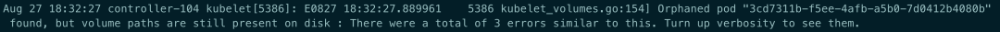

**原因**: 这种 pod 已经被删除了，但是 volume 还存在于 disk 中

**解决**: 删除对应的目录`/var/lib/Kubelet/pods/3cd73...`

参考: https://github.com/longhorn/longhorn/issues/485

### **20、PLEG is not healthy**

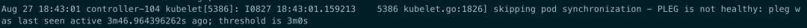

**原因**: 宿主机上面跑的容器太多，导致 pod 无法在 3m 钟内完成生命周期检查

解决: PLEG(Pod Lifecycle Event Generator) 用于 kublet 同步 pod 生命周期，本想着如果是因为时间短导致的超时，那是不是可以直接调整这个时间呢? 查看 Kubelet 的源码发现不太行，3m 时间是写在代码里的因此无法修改，当然修改再编译肯定没问题，但成本太大，所以只得优化容器的调度情况.

参考: https://developers.redhat.com/blog/2019/11/13/pod-lifecycle-event-generator-understanding-the-pleg-is-not-healthy-issue-in-kubernetes/

### **21、metrics-server: 10255 connection refused**

```
unable to fully collect metrics: [unable to fully scrape metrics from source Kubelet_summary:K8s-node-49: unable to fetch metrics from Kubelet K8s-node-49 (xxx.xxx.xxx.49): Get http://xxx.xxx.xxx.49:10255/stats/summary?only_cpu_and_memory=true: dial tcp xxx.xxx.xxx.49:10255: connect: connection refused
```

**原因**: 现在的 K8s 都默认禁用了 Kubelet 的 10255 端口，出现这个错误是因此在 Kubelet 启动命令中启用了该端口

**解决**: 将 `- --Kubelet-port=10255` 注释

### **22、metrics-server: no such host**

```
unable to fetch metrics from Kubelet K8s-node-234 (K8s-node-234): Get https://K8s-node-234:10250/stats/summary?only_cpu_and_memory=true: dial tcp: lookup K8s-node-234 on 10.96.0.10:53: no such host
```

**解决**: 使用 `Kubelet-preferred-address-types=InternalIP,Hostname,InternalDNS,ExternalDNS,ExternalIP` 参数

> 参考: https://github.com/kubernetes-sigs/metrics-server/blob/master/README.md

### **23、pod 无法解析域名**

集群中新增了几台机器用于部署 clickhouse 用于做大数据分析，为了不让这类占用大量资源的 Pod 影响其它 Pod，因此选择给机器打 taint 的形式控制该类 Pod 的调度, 创建 Pod 后发现这些 Pod 都会出现 DNS 解析异常,

原因；要注意容器网络，比如这里使用的是 flannel 是否容忍了这些机器的 taint，不然的话，flannel 是无法被调度到这些机器的,因此容器间的通信会出现问题，**可以将类似 flannel 这些的基础 POD 容忍所有的 NoScheule 与 NoExecute**

**解决**: flannel 的 ds yaml 中添加以下 toleration，这样适用任何的场景

```
      tolerations:
      - effect: NoSchedule
        operator: Exists
      - effect: NoExecute
        operator: Exists
```

### **24、Are you tring to mount a directory on to a file**


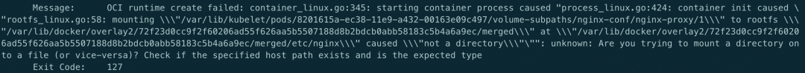


* 原因: Yaml 文件中使用了 subPath, 但是 mountPath 指向了一个目录
* 解决: mountPath 需要加上文件名

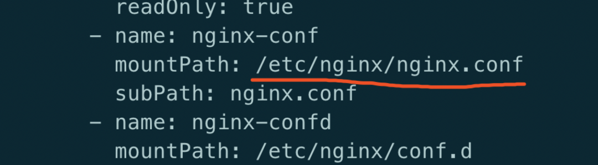

### **25、Kubernetes 启动后提示 slice: no such file ro directory**

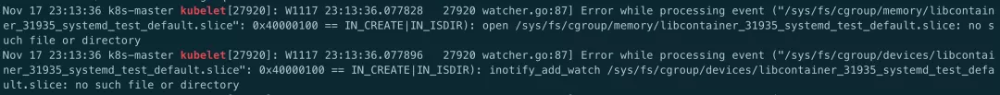

原因: yum 安装的 Kubelet 默认的是 cgroupfs，而 Docker 一般默认的是 systemd。但是 kubernetes 安装的时候建议使用 systemd, Kubelet 跟 Docker 的不一致, 要么修改 Kubelet 的启动参数 , 要么修改 dokcer 启动参数


**解决**:

* Docker 的启动参数文件为:` /etc/Docker/daemon.json: "exec-opts": ["native.cgroupdriver=systemd”]`
* Kubelet 的启动参数文件为:` /var/lib/Kubelet/config.yaml: cgroupDriver: systemd`


### **26、`"cni0" already has an IP address different from xxx.xxxx.xxx.xxx*`**

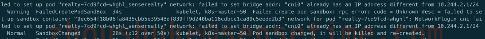

**原因**: 使用 `kubeadm reset` 重复操作过, `reset` 之后，之前 flannel 创建的 bridge device cni0 和网口设备 `flannel.1`依然健在

**解决**: 添加之前需要清除下网络

```

kubeadm reset
systemctl stop Kubelet
systemctl stop Docker
rm -rf /var/lib/cni/
rm -rf /var/lib/Kubelet/*
rm -rf /etc/cni/
ifconfig cni0 down
ifconfig flannel.1 down
ifconfig Docker0 down
ip link delete cni0
ip link delete flannel.1
systemctl start Docker
systemctl start Kubelet
```

### **27、kubeadm 初始化时提示 CPU 小于 2**

```
[preflight] Running pre-flight checks
error execution phase preflight: [preflight] Some fatal errors occurred:
    [ERROR NumCPU]: the number of available CPUs 1 is less than the required 2
[preflight] If you know what you are doing, you can make a check non-fatal with `--ignore-preflight-errors=...`
```

**原因**: kubeadm 对资源一定的要求，如果是测试环境无所谓的话,可忽略

解决:

```
使用 --ignore-preflight-errors 忽略
```

### **28、Unable to update cni config: no network found**

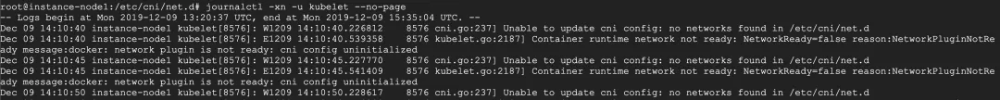

**原因**: 还未部署网络插件容器，导致在 `/etc/cni `下还没有文件

**解决**: 根据实际情况部署网络插件

### **29、while reading 'google-Dockercfg' metadata**

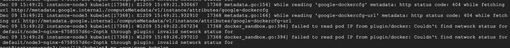

**原因**: 从其它机器访问上述这些 url 确实出现 404

**解决**: 由于是在 RKE 上部署 K8s, 所以可能会去访问 google 相关的 url, 不影响业务,可以忽略

### **30、no providers available to validate pod request**

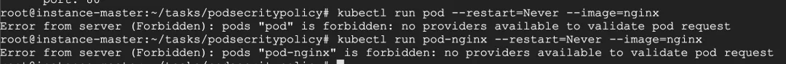

**原因**: 在 `api-server` 的启动参数 `enable-admission` 中设置了 `PodSecrityPolicy`, 但是集群中又没有任何的 podsecritypolicy，因此导致整个集群都无法新建出 pod

**解决**: 删除相应的 podsecritypolicy 即可


### **31、unable to upgrade connection: Unauthorized**

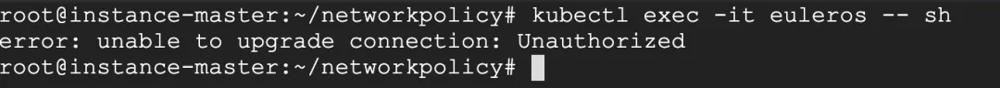

原因: Kubelet 的启动参数少了 x509 认证方式

解决: 配置证书的路径, 加上重启 Kubelet 即可

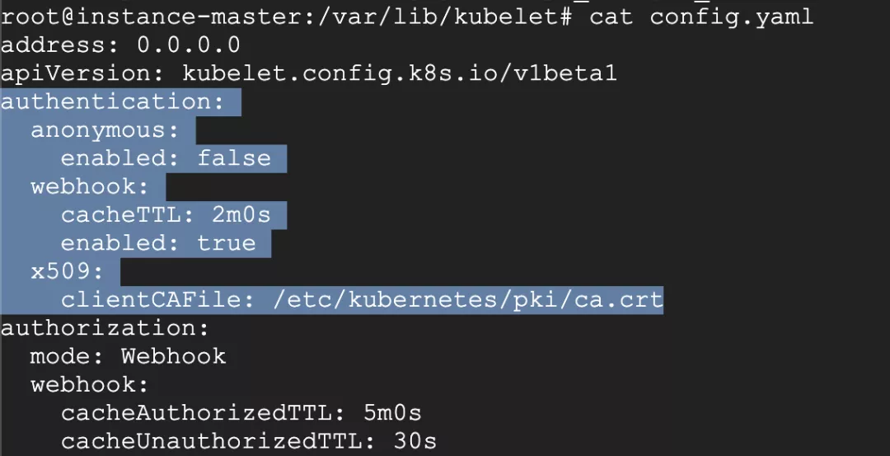


### **32、kubectl get cs 提示<unknown>**

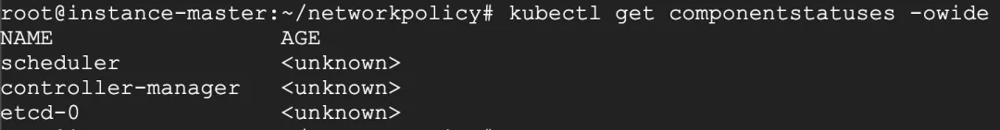

**原因**: 这是个 kubectl 的 bug, 跟版本相关，kubernetes 有意废除 get cs 命令

**解决**: 目前对集群的运行无影响, 可通过加 -o yaml 查看状态


### **33、安装 kubeadm 时提示 Depends 错误**

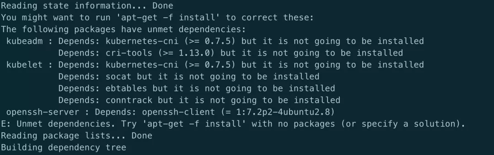

原因: 跟 kubeadm 没多大关系, 系统安装的有问题

解决: 执行以下命令修复

```
apt --fix-broken install
apt-get update
```

### **34、访问 service 时提示 Connection refused**

现象: 从另一环境中把 yaml 文件导入到新环境后有些 service 访问不通


```
telnet mongodb-mst.external 27017
Trying 10.97.135.242...
telnet: Unable to connect to remote host: Connection refused
```

首先排除了域名、端口的配置问题。

会发现提示连接拒绝.可以确定的是集群内的 DNS 是正常的.

那么就是通过 clusterIP 无法到达 realserver. 查看 iptables 规则

发现提示`default has no Endpoints --reject-with icmp-port-unreachable`

很奇怪, 提示没有 Endpoints, 但是使用kubectl get ep又能看到 ep 存在且配置没有问题
而且这个 default 是怎么来的.

为了方便部署, 很多配置是从别的环境导出的配置, 有些 service 访问是没问题的, 只有少部分 `connection refused`。

结比一下发现一个很有趣的问题，先来看下不正常的 yaml 文件:

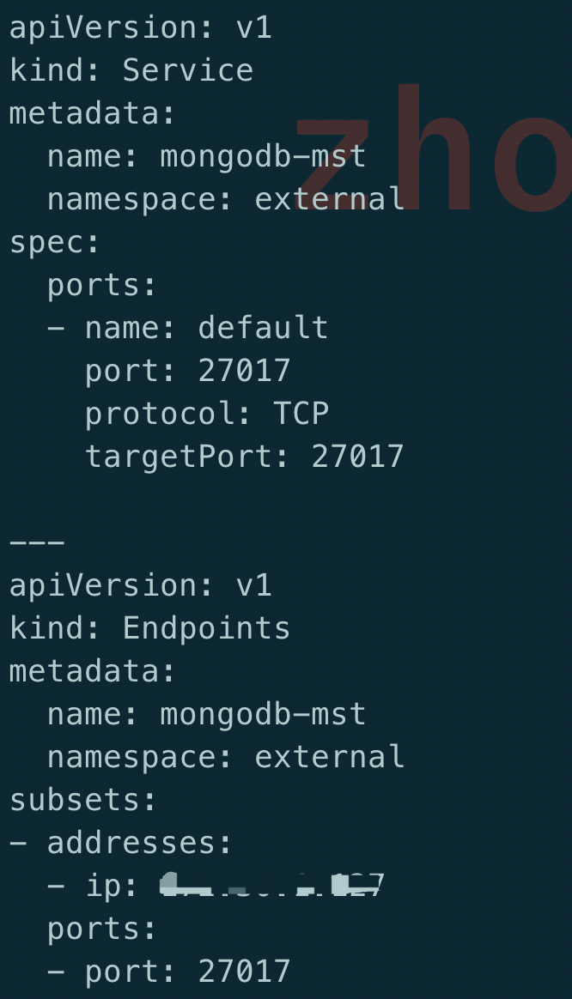


由于服务在集群外部署的, 因此这里使用了 subset 方式, 开始怀疑问题在这里, 但是后来知道这个不是重点


乍一看这个配置没什么问题, 部署也很正常, 但是对比正常的 yaml 文件，发现一个区别：

如果在 services 中的端口指定了名字, 那么在 subsets 中的端口也要带名字, 没有带名字的就会出现 `connection refused`，这个确实之前从来没有关注过, 一个端口的情况下也不会指定名字

而且这面` iptalbes `中提示的 `default` 刚好就是这里的 `port name`,虽然不敢相信，但是也只能试一试这个方法: 在 `subsets` 中也加了 `port name`

重新部署一个，再次查看 iptalbes 规则

```
iptables-save|grep mongodb-mst
```

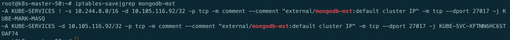

OMG, 居然可行, 再看下 telnet 的结果:

```
Trying 10.105.116.92...
Connected to mongodb-mst.external.svc.cluster.local.
Escape character is '^]'.
```

访问也是没问题, 那么原因就在于:

**在 service 中指定了 port name 时, 也需要在 ep 中指定 port name**

### **35、error converting fieldPath: field label not supported**

今天遇到一个部署 Deployment 出错的问题, yaml 文件如下:

```
apiVersion: apps/v1
kind: Deployment
metadata:
  name: demo-Deployment
  namespace: 4test
  labels:
    app: config-demo-app
spec:
  replicas: 1
  selector:
    matchLabels:
      app: config-demo-app
  template:
    metadata:
      labels:
        app: config-demo-app
      annotations:
        # The field we'll use to couple our ConfigMap and Deployment
        configHash: 4431f6d28fdf60c8140d28c42cde331a76269ac7a0e6af01d0de0fa8392c1145
    spec:
      containers:
      - name: config-demo-app
        image: gcr.io/optimum-rock-145719/config-demo-app
        ports:
        - containerPort: 80
        envFrom:
        # The ConfigMap we want to use
        - configMapRef:
            name: demo-config
        # Extra-curricular: We can make the hash of our ConfigMap available at a
        # (e.g.) debug Endpoint via a fieldRef
        env:
        - name: CONFIG_HASH
          #value: "4431f6d28fdf60c8140d28c42cde331a76269ac7a0e6af01d0de0fa8392c1145"
          valueFrom:
            fieldRef:
              fieldPath: spec.template.metadata.annotations.configHash
```
提示以下错误:

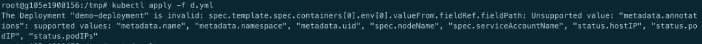

会提示 `Unsupported value:spec.template.metadata.annotations.configHash`。

目的很简单: container 中的环境变量中引用 configHash 变量, 这个值是当 ConfigMap 变更时比对两个不同的 sha 值以此达到重启 pod 的目的, 但 `fieldPath` 显然不支持 `spec.template.metadata.annotations.configHash`。

从报错提示来看, 支持列表有 metadata.name, metadata.namespace, metadata.uid, spec.nodeName,spec.serviceAccountName, status.hostIp, status.PodIP, status.PodIPs。

这些值用于容器中需要以下信息时可以不从 K8s 的 apiserver 中获取而是可以很方便地从这些变量直接获得。


