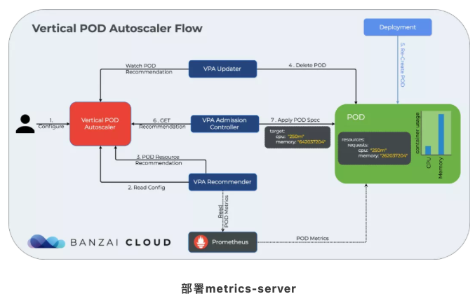

# **Kubernetes Pod垂直自动伸VPA**

**VPA全称Vertical Pod Autoscaler**，即垂直Pod自动扩缩容，它根据容器资源使用率自动设置CPU和内存的requests，从而允许在节点上进行适当的调度，以便为每个Pod提供适当的资源。

它既可以缩小过度请求资源的容器，也可以根据其使用情况随时提升资源不足的容量。

**PS：VPA不会改变Pod的资源limits值。**

废话不多说，直接上图，看VPA工作流程：



下载部署清单文件

https://github.com/kubernetes-sigs/metrics-server/releases

```
wget https://github.com/kubernetes-sigs/metrics-server/releases/download/v0.5.0/components.yaml
```

**修改components.yaml文件**

* 修改了`metrics-server`启动参数args

```
- args:
	- --cert-dir=/tmp
	- --secure-port=443
	- --kubelet-preferred-address-types=InternalIP
	- --kubelet-insecure-tls
	- --kubelet-use-node-status-port
	- --metric-resolution=15s
	image: k8s.gcr.io/metrics-server/metrics-server:v0.5.0
```

```
$ kubectl get pod -n kube-system | grep metrics
metrics-server-787484df96-l82zc          1/1     Running             0          2m31s

$ kubectl top nodes
NAME             CPU(cores)   CPU%   MEMORY(bytes)   MEMORY%
docker-desktop   1094m        13%    1611Mi          85%
```


## **部署`vertical-pod-autoscaler`**

**克隆autoscaler项目**

```
$ git clone https://github.com/kubernetes/autoscaler.git
```

**修改部署文件 (Optional)**

```
cd autoscaler/vertical-pod-autoscaler/deploy
admission-controller-deployment.yaml
us.gcr.io/k8s-artifacts-prod/autoscaling/vpa-admission-controller:0.8.0
改为
scofield/vpa-admission-controller:0.8.0

recommender-deployment.yaml
us.gcr.io/k8s-artifacts-prod/autoscaling/vpa-recommender:0.8.0
改为
image: scofield/vpa-recommender:0.8.0

updater-deployment.yaml
us.gcr.io/k8s-artifacts-prod/autoscaling/vpa-updater:0.8.0
改为
scofield/vpa-updater:0.8.0
```

**部署**

```
$ cd autoscaler/vertical-pod-autoscaler
$ ./hack/vpa-up.sh
customresourcedefinition.apiextensions.k8s.io/verticalpodautoscalercheckpoints.autoscaling.k8s.io created
customresourcedefinition.apiextensions.k8s.io/verticalpodautoscalers.autoscaling.k8s.io created
clusterrole.rbac.authorization.k8s.io/system:metrics-reader created
clusterrole.rbac.authorization.k8s.io/system:vpa-actor created
clusterrole.rbac.authorization.k8s.io/system:vpa-checkpoint-actor created
clusterrole.rbac.authorization.k8s.io/system:evictioner created
clusterrolebinding.rbac.authorization.k8s.io/system:metrics-reader created
clusterrolebinding.rbac.authorization.k8s.io/system:vpa-actor created
clusterrolebinding.rbac.authorization.k8s.io/system:vpa-checkpoint-actor created
clusterrole.rbac.authorization.k8s.io/system:vpa-target-reader created
clusterrolebinding.rbac.authorization.k8s.io/system:vpa-target-reader-binding created
serviceaccount/vpa-admission-controller created
clusterrole.rbac.authorization.k8s.io/system:vpa-admission-controller created
clusterrolebinding.rbac.authorization.k8s.io/system:vpa-admission-controller created
clusterrole.rbac.authorization.k8s.io/system:vpa-status-reader created
clusterrolebinding.rbac.authorization.k8s.io/system:vpa-status-reader-binding created
Error from server (Timeout): error when creating "STDIN": the server was unable to return a response in the time allotted, but may still be processi
ng the request (post clusterrolebindings.rbac.authorization.k8s.io)
serviceaccount/vpa-updater created
deployment.apps/vpa-updater created
serviceaccount/vpa-recommender created
deployment.apps/vpa-recommender created
Generating certs for the VPA Admission Controller in /tmp/vpa-certs.
Generating RSA private key, 2048 bit long modulus
.......+++++
..+++++
e is 65537 (0x10001)
unknown option -addext
req [options] <infile >outfile
where options  are
 -inform arg    input format - DER or PEM
 -outform arg   output format - DER or PEM
 -in arg        input file
 -out arg       output file
 -text          text form of request
 -pubkey        output public key
 -noout         do not output REQ
 -verify        verify signature on REQ
 -modulus       RSA modulus
 -nodes         don't encrypt the output key
 -engine e      use engine e, possibly a hardware device
 -subject       output the request's subject
 -passin        private key password source
 -key file      use the private key contained in file
 -keyform arg   key file format
 -keyout arg    file to send the key to
 -rand file:file:...
                load the file (or the files in the directory) into
                the random number generator
 -newkey rsa:bits generate a new RSA key of 'bits' in size
 -newkey dsa:file generate a new DSA key, parameters taken from CA in 'file'
 -newkey ec:file generate a new EC key, parameters taken from CA in 'file'
 -[digest]      Digest to sign with (md5, sha1, md2, mdc2, md4)
 -config file   request template file.
 -subj arg      set or modify request subject
 -multivalue-rdn enable support for multivalued RDNs
 -new           new request.
 -batch         do not ask anything during request generation
 -x509          output a x509 structure instead of a cert. req.
 -days          number of days a certificate generated by -x509 is valid for.
 -set_serial    serial number to use for a certificate generated by -x509.
 -newhdr        output "NEW" in the header lines
 -asn1-kludge   Output the 'request' in a format that is wrong but some CA's
                have been reported as requiring
 -extensions .. specify certificate extension section (override value in config file)
 -reqexts ..    specify request extension section (override value in config file)
 -utf8          input characters are UTF8 (default ASCII)
 -nameopt arg    - various certificate name options
 -reqopt arg    - various request text options

ERROR: Failed to create CA certificate for self-signing. If the error is "unknown option -addext", update your openssl version or deploy VPA from the vpa-release-0.8 branch.
deployment.apps/vpa-admission-controller created
service/vpa-webhook created
```


> 这里如果出现错误：ERROR: Failed to create CA certificate for self-signing. If the error is “unknown option -addext”, update your openssl version or deploy VPA from the vpa-release-0.8 branch


**需要升级openssl的版本解决：**

```
$ openssl version -a
OpenSSL 1.0.2s  28 May 2019
built on: reproducible build, date unspecified
platform: darwin64-x86_64-cc
options:  bn(64,64) rc4(ptr,int) des(idx,cisc,16,int) blowfish(idx) 
compiler: cc -I. -I.. -I../include  -fPIC -fno-common -DOPENSSL_PIC -DOPENSSL_THREADS -D_REENTRANT -DDSO_DLFCN -DHAVE_DLFCN_H -I/opt/chefdk/embedded/include -O2 -arch x86_64 -O3 -DL_ENDIAN -Wall -DOPENSSL_IA32_SSE2 -DOPENSSL_BN_ASM_MONT -DOPENSSL_BN_ASM_MONT5 -DOPENSSL_BN_ASM_GF2m -DSHA1_ASM -DSHA256_ASM -DSHA512_ASM -DMD5_ASM -DAES_ASM -DVPAES_ASM -DBSAES_ASM -DWHIRLPOOL_ASM -DGHASH_ASM -DECP_NISTZ256_ASM
OPENSSLDIR: "/opt/chefdk/embedded/ssl"
```

```
brew upgrade openssl

$ brew link --force openssl
Warning: Refusing to link macOS provided/shadowed software: openssl@1.1
If you need to have openssl@1.1 first in your PATH, run:
  echo 'export PATH="/usr/local/opt/openssl@1.1/bin:$PATH"' >> /Users/i/.bash_profile

For compilers to find openssl@1.1 you may need to set:
  export LDFLAGS="-L/usr/local/opt/openssl@1.1/lib"
  export CPPFLAGS="-I/usr/local/opt/openssl@1.1/include"

For pkg-config to find openssl@1.1 you may need to set:
  export PKG_CONFIG_PATH="/usr/local/opt/openssl@1.1/lib/pkgconfig"
  
echo 'export PATH="/usr/local/opt/openssl@1.1/bin:$PATH"' >> /Users/i/.bash_profile

source /Users/i/.bash_profile

$ openssl version -a
OpenSSL 1.1.1k  25 Mar 2021
built on: Thu Mar 25 21:01:05 2021 UTC
platform: darwin64-x86_64-cc
options:  bn(64,64) rc4(16x,int) des(int) idea(int) blowfish(ptr) 
```

```
$ cd autoscaler/vertical-pod-autoscaler
./hack/vpa-up.sh
```

再次执行`vertical-pod-autoscaler/pkg/admission-controller/gencerts.sh`

```
 ./gencerts.sh
Generating certs for the VPA Admission Controller in /tmp/vpa-certs.
Generating RSA private key, 2048 bit long modulus (2 primes)
......................................+++++
................+++++
e is 65537 (0x010001)
Generating RSA private key, 2048 bit long modulus (2 primes)
........+++++
......+++++
e is 65537 (0x010001)
Signature ok
subject=CN = vpa-webhook.kube-system.svc
Getting CA Private Key
Uploading certs to the cluster.
Error from server (AlreadyExists): secrets "vpa-tls-certs" already exists
```

可以看到metrics-server和vpa都已经正常运行了。

```
 kubectl get po -n kube-system | grep -E "metrics-server|vpa"
metrics-server-5b58f4df77-f7nks                          1/1     Running   0          35d
vpa-admission-controller-7ff888c959-tvtmk                1/1     Running   0          104m
vpa-recommender-74f69c56cb-zmzwg                         1/1     Running   0          104m
vpa-updater-79b88f9c55-m4xx5                             1/1     Running   0          103m
```

## 示例

### `updateMode: Off`

1、首先我们部署一个Nginx服务，部署到namespace: vpa中

```
apiVersion: apps/v1
kind: Deployment
metadata:
  labels:
    app: nginx
  name: nginx
  namespace: vpa
spec:
  replicas: 2
  selector:
    matchLabels:
      app: nginx
  template:
    metadata:
      labels:
        app: nginx
    spec:
      containers:
      - image: nginx
        name: nginx
        resources:
          requests:
            cpu: 100m
            memory: 250Mi
```

看下结果，正常运行了2个Pod：

```
# kubectl get po -n vpa
NAME                     READY   STATUS    RESTARTS   AGE
nginx-59fdffd754-cb5dn   1/1     Running   0          8s
nginx-59fdffd754-cw8d7   1/1     Running   0          9s
```

2、创建一个NodePort类型的Service

```
# cat svc.yaml 
apiVersion: v1
kind: Service
metadata:
  name: nginx
  namespace: vpa
spec:
  type: NodePort
  ports:
  - port: 80
    targetPort: 80
  selector:
    app: nginx
    
# kubectl get svc -n vpa | grep nginx
nginx   NodePort   10.255.253.166   <none>        80:30895/TCP   54s

 # curl -I 10.1.2.16:30895
HTTP/1.1 200 OK
Server: nginx/1.21.1
Date: Fri, 09 Jul 2021 09:54:58 GMT
Content-Type: text/html
Content-Length: 612
Last-Modified: Tue, 06 Jul 2021 14:59:17 GMT
Connection: keep-alive
ETag: "60e46fc5-264"
Accept-Ranges: bytes  

```

3、创建VPA


这里先使用`updateMode: Off`模式，这种模式仅获取资源推荐，但不更新Pod

```
# cat nginx-vpa-demo.yaml
apiVersion: autoscaling.k8s.io/v1beta2
kind: VerticalPodAutoscaler
metadata:
  name: nginx-vpa
  namespace: vpa
spec:
  targetRef:
    apiVersion: "apps/v1"
    kind: Deployment
    name: nginx
  updatePolicy:
    updateMode: "Off"
  resourcePolicy:
    containerPolicies:
    - containerName: "nginx"
      minAllowed:
        cpu: "250m"
        memory: "100Mi"
      maxAllowed:
        cpu: "2000m"
        memory: "2048Mi"
```

4、查看部署结果

```
# kubectl get vpa -n vpa
NAME        MODE   CPU   MEM   PROVIDED   AGE
nginx-vpa   Off                           7s
```

5、使用describe查看vpa详情，主要关注Container Recommendations

```
# kubectl describe vpa nginx-vpa -n vpa
Name:         nginx-vpa
Namespace:    vpa
Spec:
  Resource Policy:
    Container Policies:
      Container Name:  nginx
      Max Allowed:
        Cpu:     2000m
        Memory:  2048Mi
      Min Allowed:
        Cpu:     250m
        Memory:  100Mi
  Target Ref:
    API Version:  apps/v1
    Kind:         Deployment
    Name:         nginx
  Update Policy:
    Update Mode:  Off
Status:
  Conditions:
    Last Transition Time:  2021-07-09T09:59:50Z
    Status:                True
    Type:                  RecommendationProvided
  Recommendation:
    Container Recommendations:
      Container Name:  nginx
      Lower Bound:
        Cpu:     250m
        Memory:  262144k
      Target:
        Cpu:     250m
        Memory:  262144k
      Uncapped Target:
        Cpu:     25m
        Memory:  262144k
      Upper Bound:
        Cpu:     670m
        Memory:  700542995
```

其中：

```
Lower Bound:                 下限值
Target:                      推荐值
Upper Bound:                 上限值
Uncapped Target:             如果没有为VPA提供最小或最大边界，则表示目标利用率
上述结果表明，推荐的Pod的CPU请求为25m，推荐的内存请求为262144k字节。
```

6、现在对Nginx进行压测

执行压测命令：

```
# ab -c 100 -n 10000000 http://10.1.2.16:30895/
This is ApacheBench, Version 2.3 <$Revision: 1430300 $>
Copyright 1996 Adam Twiss, Zeus Technology Ltd, http://www.zeustech.net/
Licensed to The Apache Software Foundation, http://www.apache.org/

Benchmarking 10.1.2.16 (be patient)

Completed 1000000 requests
Completed 2000000 requests
Completed 3000000 requests
```

7、几分钟后再观察VPA Recommendation变化

```
# kubectl describe vpa -n vpa nginx-vpa | tail -n 20
  Conditions:
    Last Transition Time:  2021-07-09T09:59:50Z
    Status:                True
    Type:                  RecommendationProvided
  Recommendation:
    Container Recommendations:
      Container Name:  nginx
      Lower Bound:
        Cpu:     250m
        Memory:  262144k
      Target:
        Cpu:     1643m
        Memory:  262144k
      Uncapped Target:
        Cpu:     1643m
        Memory:  262144k
      Upper Bound:
        Cpu:     2
        Memory:  562581530
Events:          <none>
```

从输出信息可以看出，VPA对Pod给出了推荐值：`Cpu: 1643m`，因为我们这里设置了`updateMode: Off`，所以不会更新Pod。

### `updateMode: Auto`

1、把`updateMode: “Auto”`，看看VPA会有什么动作

这里把resources改为：memory: 50Mi，cpu: 100m

```
]# kubectl get po -n vpa
NAME                     READY   STATUS    RESTARTS   AGE
nginx-5594c66dc6-lzs67   1/1     Running   0          26s
nginx-5594c66dc6-zk6h9   1/1     Running   0          21s
```


2、再次部署VPA，这里VPA部署文件`nginx-vpa-demo.yaml`只改了`updateMode: "Auto"`

```
# cat  nginx-vpa-demo.yaml
apiVersion: autoscaling.k8s.io/v1beta2
kind: VerticalPodAutoscaler
metadata:
  name: nginx-vpa-2
  namespace: vpa
spec:
  targetRef:
    apiVersion: "apps/v1"
    kind: Deployment
    name: nginx
  updatePolicy:
    updateMode: "Auto"
  resourcePolicy:
    containerPolicies:
    - containerName: "nginx"
      minAllowed:
        cpu: "250m"
        memory: "100Mi"
      maxAllowed:
        cpu: "2000m"
        memory: "2048Mi"
```

3、再次压测

```
ab -c 100 -n 10000000 http://10.1.2.16:30895/
```

4、几分钟后，使用describe查看vpa详情，同样只关注Container Recommendations

```
]# kubectl describe vpa nginx-vpa  -n vpa | tail -n 20
  Conditions:
    Last Transition Time:  2021-07-09T09:59:50Z
    Status:                True
    Type:                  RecommendationProvided
  Recommendation:
    Container Recommendations:
      Container Name:  nginx
      Lower Bound:
        Cpu:     250m
        Memory:  262144k
      Target:
        Cpu:     1643m
        Memory:  262144k
      Uncapped Target:
        Cpu:     1643m
        Memory:  262144k
      Upper Bound:
        Cpu:     2
        Memory:  511550327
Events:          <none>
```

Target变成了`Cpu:1643m ，Memory:262144k`。

5、来看下event事件

```
# kubectl get event -n vpa
LAST SEEN   TYPE     REASON                 OBJECT                        MESSAGE
38s         Normal   Scheduled              pod/nginx-5594c66dc6-d8d6h    Successfully assigned vpa/nginx-5594c66dc6-d8d6h to 10.1.2.16
38s         Normal   Pulling                pod/nginx-5594c66dc6-d8d6h    Pulling image "nginx"
37s         Normal   Pulled                 pod/nginx-5594c66dc6-d8d6h    Successfully pulled image "nginx"
37s         Normal   Created                pod/nginx-5594c66dc6-d8d6h    Created container nginx
37s         Normal   Started                pod/nginx-5594c66dc6-d8d6h    Started container nginx
3m10s       Normal   Scheduled              pod/nginx-5594c66dc6-lzs67    Successfully assigned vpa/nginx-5594c66dc6-lzs67 to 10.1.2.15
3m9s        Normal   Pulling                pod/nginx-5594c66dc6-lzs67    Pulling image "nginx"
3m5s        Normal   Pulled                 pod/nginx-5594c66dc6-lzs67    Successfully pulled image "nginx"
3m5s        Normal   Created                pod/nginx-5594c66dc6-lzs67    Created container nginx
3m5s        Normal   Started                pod/nginx-5594c66dc6-lzs67    Started container nginx
99s         Normal   EvictedByVPA           pod/nginx-5594c66dc6-lzs67    Pod was evicted by VPA Updater to apply resource recommendation.
99s         Normal   Killing                pod/nginx-5594c66dc6-lzs67    Stopping container nginx
98s         Normal   Scheduled              pod/nginx-5594c66dc6-tdmnh    Successfully assigned vpa/nginx-5594c66dc6-tdmnh to 10.1.2.15
98s         Normal   Pulling                pod/nginx-5594c66dc6-tdmnh    Pulling image "nginx"
97s         Normal   Pulled                 pod/nginx-5594c66dc6-tdmnh    Successfully pulled image "nginx"
97s         Normal   Created                pod/nginx-5594c66dc6-tdmnh    Created container nginx
97s         Normal   Started                pod/nginx-5594c66dc6-tdmnh    Started container nginx
3m5s        Normal   Scheduled              pod/nginx-5594c66dc6-zk6h9    Successfully assigned vpa/nginx-5594c66dc6-zk6h9 to 10.1.2.17
3m4s        Normal   Pulling                pod/nginx-5594c66dc6-zk6h9    Pulling image "nginx"
3m          Normal   Pulled                 pod/nginx-5594c66dc6-zk6h9    Successfully pulled image "nginx"
2m59s       Normal   Created                pod/nginx-5594c66dc6-zk6h9    Created container nginx
2m59s       Normal   Started                pod/nginx-5594c66dc6-zk6h9    Started container nginx
39s         Normal   EvictedByVPA           pod/nginx-5594c66dc6-zk6h9    Pod was evicted by VPA Updater to apply resource recommendation.
39s         Normal   Killing                pod/nginx-5594c66dc6-zk6h9    Stopping container nginx
3m10s       Normal   SuccessfulCreate       replicaset/nginx-5594c66dc6   Created pod: nginx-5594c66dc6-lzs67
3m5s        Normal   SuccessfulCreate       replicaset/nginx-5594c66dc6   Created pod: nginx-5594c66dc6-zk6h9
99s         Normal   SuccessfulCreate       replicaset/nginx-5594c66dc6   Created pod: nginx-5594c66dc6-tdmnh
38s         Normal   SuccessfulCreate       replicaset/nginx-5594c66dc6   Created pod: nginx-5594c66dc6-d8d6h
35m         Normal   Scheduled              pod/nginx-59fdffd754-cb5dn    Successfully assigned vpa/nginx-59fdffd754-cb5dn to 10.1.2.16
35m         Normal   Pulling                pod/nginx-59fdffd754-cb5dn    Pulling image "nginx"
35m         Normal   Pulled                 pod/nginx-59fdffd754-cb5dn    Successfully pulled image "nginx"
35m         Normal   Created                pod/nginx-59fdffd754-cb5dn    Created container nginx
35m         Normal   Started                pod/nginx-59fdffd754-cb5dn    Started container nginx
3m5s        Normal   Killing                pod/nginx-59fdffd754-cb5dn    Stopping container nginx
35m         Normal   Scheduled              pod/nginx-59fdffd754-cw8d7    Successfully assigned vpa/nginx-59fdffd754-cw8d7 to 10.1.2.16
35m         Normal   Pulling                pod/nginx-59fdffd754-cw8d7    Pulling image "nginx"
35m         Normal   Pulled                 pod/nginx-59fdffd754-cw8d7    Successfully pulled image "nginx"
35m         Normal   Created                pod/nginx-59fdffd754-cw8d7    Created container nginx
35m         Normal   Started                pod/nginx-59fdffd754-cw8d7    Started container nginx
2m58s       Normal   Killing                pod/nginx-59fdffd754-cw8d7    Stopping container nginx
35m         Normal   SuccessfulCreate       replicaset/nginx-59fdffd754   Created pod: nginx-59fdffd754-cw8d7
35m         Normal   SuccessfulCreate       replicaset/nginx-59fdffd754   Created pod: nginx-59fdffd754-cb5dn
3m5s        Normal   SuccessfulDelete       replicaset/nginx-59fdffd754   Deleted pod: nginx-59fdffd754-cb5dn
2m58s       Normal   SuccessfulDelete       replicaset/nginx-59fdffd754   Deleted pod: nginx-59fdffd754-cw8d7
35m         Normal   ScalingReplicaSet      deployment/nginx              Scaled up replica set nginx-59fdffd754 to 2
34m         Normal   EnsuringService        service/nginx                 Deleted Loadbalancer
34m         Normal   EnsureServiceSuccess   service/nginx                 Service Sync Success. RetrunCode: S2000
3m10s       Normal   ScalingReplicaSet      deployment/nginx              Scaled up replica set nginx-5594c66dc6 to 1
3m5s        Normal   ScalingReplicaSet      deployment/nginx              Scaled down replica set nginx-59fdffd754 to 1
3m5s        Normal   ScalingReplicaSet      deployment/nginx              Scaled up replica set nginx-5594c66dc6 to 2
2m58s       Normal   ScalingReplicaSet      deployment/nginx              Scaled down replica set nginx-59fdffd754 to 0
```


从输出信息可以了解到，VPA执行了EvictedByVPA，自动停掉了Nginx，然后使用 VPA推荐的资源启动了新的Nginx，我们查看下Nginx的Pod可以得到确认。

```
# kubectl describe po -n vpa nginx-5594c66dc6-d8d6h
Name:         nginx-5594c66dc6-d8d6h
Namespace:    vpa
Priority:     0
Node:         10.1.2.16/10.1.2.16
Start Time:   Fri, 09 Jul 2021 18:09:26 +0800
Labels:       app=nginx
              pod-template-hash=5594c66dc6
Annotations:  tke.cloud.tencent.com/networks-status:
                [{
                    "name": "tke-bridge",
                    "interface": "eth0",
                    "ips": [
                        "10.252.1.50"
                    ],
                    "mac": "e6:38:26:0b:c5:97",
                    "default": true,
                    "dns": {}
                }]
              vpaObservedContainers: nginx
              vpaUpdates: Pod resources updated by nginx-vpa: container 0: cpu request, memory request
Status:       Running
IP:           10.252.1.50
IPs:
  IP:           10.252.1.50
Controlled By:  ReplicaSet/nginx-5594c66dc6
Containers:
  nginx:
    Container ID:   docker://42e45f5f122ba658e293395d78a073cfe51534c773f9419a179830fd6d1698ea
    Image:          nginx
    Image ID:       docker-pullable://nginx@sha256:8df46d7414eda82c2a8c9c50926545293811ae59f977825845dda7d558b4125b
    Port:           <none>
    Host Port:      <none>
    State:          Running
      Started:      Fri, 09 Jul 2021 18:09:27 +0800
    Ready:          True
    Restart Count:  0
    Requests:
      cpu:        1643m
      memory:     262144k
    Environment:  <none>
    Mounts:
      /var/run/secrets/kubernetes.io/serviceaccount from default-token-m2j2z (ro)
 ```
 
 看重点Requests：cpu: 1643m，memory: 262144k

再回头看看部署文件：

```
requests:
  cpu: 100m
  memory: 50Mi
```

现在可以知道VPA做了哪些事了吧。当然，随着服务的负载的变化，VPA的推荐之也会不断变化。当目前运行的pod的资源达不到VPA的推荐值，就会执行pod驱逐，重新部署新的足够资源的服务。

**VPA使用限制**

* **不能与HPA（Horizontal Pod Autoscaler）一起使用**
* Pod比如使用副本控制器，例如属于Deployment或者StatefulSet

**VPA有啥好处**


* Pod资源用其所需，所以集群节点使用效率高。
* Pod会被安排到具有适当可用资源的节点上。
* 不必运行基准测试任务来确定CPU和内存请求的合适值。
* VPA可以随时调整CPU和内存请求，无需人为操作，因此可以减少维护时间。