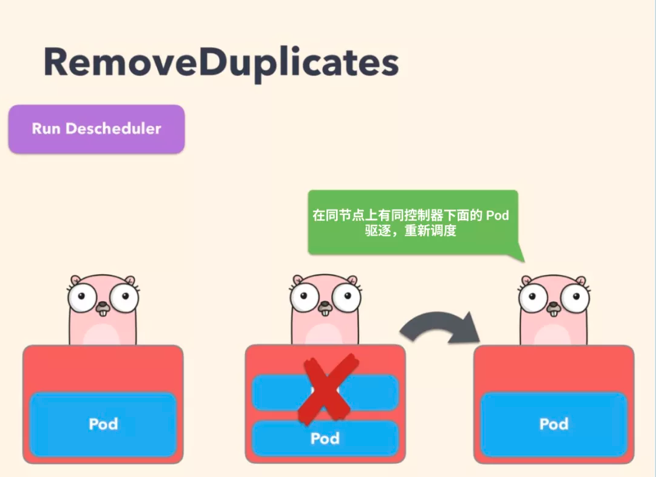
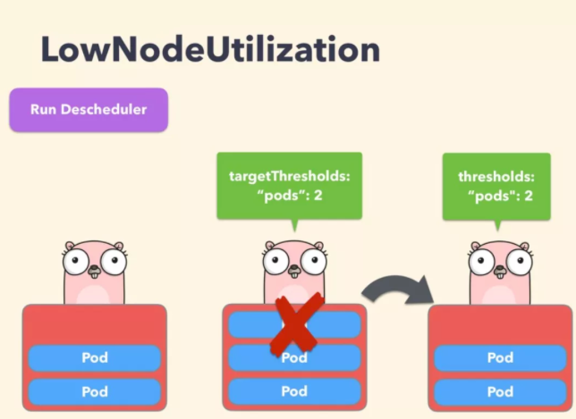
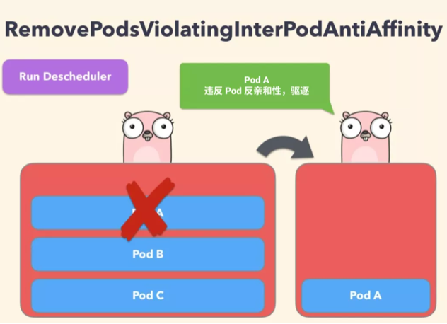

# **Kubernetes 调度均衡器 Descheduler 使用 2022**

从 kube-scheduler 的角度来看，它是通过一系列算法计算出最佳节点运行 Pod，当出现新的 Pod 进行调度时，调度程序会根据其当时对 Kubernetes 集群的资源描述做出最佳调度决定，但是 Kubernetes 集群是非常动态的，由于整个集群范围内的变化，比如一个节点为了维护，我们先执行了驱逐操作，这个节点上的所有 Pod 会被驱逐到其他节点去，但是当我们维护完成后，之前的 Pod 并不会自动回到该节点上来，因为 Pod 一旦被绑定了节点是不会触发重新调度的，由于这些变化，Kubernetes 集群在一段时间内就可能会出现不均衡的状态，所以需要均衡器来重新平衡集群。

当然我们可以去手动做一些集群的平衡，比如手动去删掉某些 Pod，触发重新调度就可以了，但是显然这是一个繁琐的过程，也不是解决问题的方式。为了解决实际运行中集群资源无法充分利用或浪费的问题，可以使用 descheduler 组件对集群的 Pod 进行调度优化，**descheduler 可以根据一些规则和配置策略来帮助我们重新平衡集群状态，其核心原理是根据其策略配置找到可以被移除的 Pod 并驱逐它们，其本身并不会进行调度被驱逐的 Pod，而是依靠默认的调度器来实现，目前支持的策略有**：

* RemoveDuplicates
* LowNodeUtilization
* RemovePodsViolatingInterPodAntiAffinity
* RemovePodsViolatingNodeAffinity
* RemovePodsViolatingNodeTaints
* RemovePodsViolatingTopologySpreadConstraint
* RemovePodsHavingTooManyRestarts
* PodLifeTime

这些策略都是可以启用或者禁用的，**作为策略的一部分，也可以配置与策略相关的一些参数，默认情况下，所有策略都是启用的**。另外，还有一些通用配置，如下：

* **nodeSelector：限制要处理的节点**
* **evictLocalStoragePods: 驱逐使用 LocalStorage 的 Pods**
* **ignorePvcPods: 是否忽略配置 PVC 的 Pods，默认是 False**
* **maxNoOfPodsToEvictPerNode：节点允许的最大驱逐 Pods 数**

我们可以通过如下所示的 DeschedulerPolicy 来配置：

```
apiVersion: "descheduler/v1alpha1"
kind: "DeschedulerPolicy"
nodeSelector: prod=dev
evictLocalStoragePods: true
maxNoOfPodsToEvictPerNode: 40
ignorePvcPods: false
strategies:  # 配置策略
  ...
```

## **1 安装**

`descheduler` 可以以 `Job`、`CronJob` 或者 `Deployment` 的形式运行在 k8s 集群内，同样我们可以使用 `Helm Chart` 来安装 `descheduler`：

```
➜ helm repo add descheduler https://kubernetes-sigs.github.io/descheduler/
```


通过 Helm Chart 我们可以配置 descheduler 以 CronJob 或者 Deployment 方式运行，默认情况下 descheduler 会以一个 critical pod 运行，以避免被自己或者 `kubelet` 驱逐了，需要确保集群中有 `system-cluster-critical` 这个 `Priorityclass`：

```
➜ kubectl get priorityclass system-cluster-critical
NAME                      VALUE        GLOBAL-DEFAULT   AGE
system-cluster-critical   2000000000   false            87d
```

使用 Helm Chart 安装默认情况下会以 CronJob 的形式运行，执行周期为 `schedule: "*/2 * * * *"`，这样每隔两分钟会执行一次 descheduler 任务，默认的配置策略如下所示：

```
apiVersion: v1
kind: ConfigMap
metadata:
  name: descheduler
data:
  policy.yaml: |
    apiVersion: "descheduler/v1alpha1"
    kind: "DeschedulerPolicy"
    strategies:
      LowNodeUtilization:
        enabled: true
        params:
          nodeResourceUtilizationThresholds:
            targetThresholds:
              cpu: 50
              memory: 50
              pods: 50
            thresholds:
              cpu: 20
              memory: 20
              pods: 20
      RemoveDuplicates:
        enabled: true
      RemovePodsViolatingInterPodAntiAffinity:
        enabled: true
      RemovePodsViolatingNodeAffinity:
        enabled: true
        params:
          nodeAffinityType:
          - requiredDuringSchedulingIgnoredDuringExecution
      RemovePodsViolatingNodeTaints:
        enabled: true
```

通过配置 `DeschedulerPolicy` 的 `strategies`，可以指定 `descheduler` 的执行策略，这些策略都是可以启用或禁用的，下面我们会详细介绍，这里我们使用默认策略即可，使用如下命令直接安装即可：

```
➜ helm upgrade --install descheduler descheduler/descheduler --set image.repository=cnych/descheduler,podSecurityPolicy.create=false -n kube-system
Release "descheduler" does not exist. Installing it now.
NAME: descheduler
LAST DEPLOYED: Fri Jan 21 10:35:55 2022
NAMESPACE: kube-system
STATUS: deployed
REVISION: 1
NOTES:
Descheduler installed as a cron job.
```

**部署完成后会创建一个 CronJob 资源对象来平衡集群状态：**


```
➜ kubectl get cronjob -n kube-system
NAME          SCHEDULE      SUSPEND   ACTIVE   LAST SCHEDULE   AGE
descheduler   */2 * * * *   False     1        27s             31s

➜ kubectl get job -n kube-system
NAME                   COMPLETIONS   DURATION   AGE
descheduler-27378876   1/1           72s        79s

➜ kubectl get pods -n kube-system -l job-name=descheduler-27378876
NAME                            READY   STATUS      RESTARTS   AGE
descheduler-27378876--1-btjmd   0/1     Completed   0          2m21s
```

正常情况下就会创建一个对应的 Job 来执行 descheduler 任务，我们可以通过查看日志可以了解做了哪些平衡操作：

```
➜ kubectl logs -f descheduler-27378876--1-btjmd -n kube-system
I0121 02:37:10.127266       1 named_certificates.go:53] "Loaded SNI cert" index=0 certName="self-signed loopback" certDetail="\"apiserver-loopback-client@1642732630\" [serving] validServingFor=[apiserver-loopback-client] issuer=\"apiserver-loopback-client-ca@1642732629\" (2022-01-21 01:37:09 +0000 UTC to 2023-01-21 01:37:09 +0000 UTC (now=2022-01-21 02:37:10.127237 +0000 UTC))"
I0121 02:37:10.127324       1 secure_serving.go:195] Serving securely on [::]:10258
I0121 02:37:10.127363       1 tlsconfig.go:240] "Starting DynamicServingCertificateController"
I0121 02:37:10.138724       1 node.go:46] "Node lister returned empty list, now fetch directly"
I0121 02:37:10.172264       1 nodeutilization.go:167] "Node is overutilized" node="master1" usage=map[cpu:1225m memory:565Mi pods:16] usagePercentage=map[cpu:61.25 memory:15.391786081415567 pods:14.545454545454545]
I0121 02:37:10.172313       1 nodeutilization.go:164] "Node is underutilized" node="node1" usage=map[cpu:675m memory:735Mi pods:16] usagePercentage=map[cpu:16.875 memory:9.542007959787252 pods:14.545454545454545]
I0121 02:37:10.172328       1 nodeutilization.go:170] "Node is appropriately utilized" node="node2" usage=map[cpu:975m memory:1515Mi pods:15] usagePercentage=map[cpu:24.375 memory:19.66820054018583 pods:13.636363636363637]
I0121 02:37:10.172340       1 lownodeutilization.go:100] "Criteria for a node under utilization" CPU=20 Mem=20 Pods=20
I0121 02:37:10.172346       1 lownodeutilization.go:101] "Number of underutilized nodes" totalNumber=1
I0121 02:37:10.172355       1 lownodeutilization.go:114] "Criteria for a node above target utilization" CPU=50 Mem=50 Pods=50
I0121 02:37:10.172360       1 lownodeutilization.go:115] "Number of overutilized nodes" totalNumber=1
I0121 02:37:10.172374       1 nodeutilization.go:223] "Total capacity to be moved" CPU=1325 Mem=3267772416 Pods=39
I0121 02:37:10.172399       1 nodeutilization.go:226] "Evicting pods from node" node="master1" usage=map[cpu:1225m memory:565Mi pods:16]
I0121 02:37:10.172485       1 nodeutilization.go:229] "Pods on node" node="master1" allPods=16 nonRemovablePods=13 removablePods=3
I0121 02:37:10.172495       1 nodeutilization.go:236] "Evicting pods based on priority, if they have same priority, they'll be evicted based on QoS tiers"
I0121 02:37:10.180353       1 evictions.go:130] "Evicted pod" pod="default/topo-demo-6bbf65d967-lzlfh" reason="LowNodeUtilization"
I0121 02:37:10.181506       1 nodeutilization.go:269] "Evicted pods" pod="default/topo-demo-6bbf65d967-lzlfh" err=<nil>
I0121 02:37:10.181541       1 nodeutilization.go:294] "Updated node usage" node="master1" CPU=1225 Mem=592445440 Pods=15
I0121 02:37:10.182496       1 event.go:291] "Event occurred" object="default/topo-demo-6bbf65d967-lzlfh" kind="Pod" apiVersion="v1" type="Normal" reason="Descheduled" message="pod evicted by sigs.k8s.io/deschedulerLowNodeUtilization"
......
```

从日志中我们就可以清晰的知道因为什么策略驱逐了哪些 Pods。

## **1 PDB**

由于使用 descheduler 会将 Pod 驱逐进行重调度，但是如果一个服务的所有副本都被驱逐的话，则可能导致该服务不可用。

如果服务本身存在单点故障，驱逐的时候肯定就会造成服务不可用了，**这种情况我们强烈建议使用反亲和性和多副本来避免单点故障，但是如果服务本身就被打散在多个节点上，这些 Pod 都被驱逐的话，这个时候也会造成服务不可用了，这种情况下我们可以通过配置 PDB（PodDisruptionBudget） 对象来避免所有副本同时被删除，**

比如我们可以设置在驱逐的时候某应用最多只有一个副本不可用，则创建如下所示的资源清单即可：

```
apiVersion: policy/v1
kind: PodDisruptionBudget
metadata:
  name: pdb-demo
spec:
  maxUnavailable: 1  # 设置最多不可用的副本数量，或者使用 minAvailable，可以使用整数或百分比
  selector:
    matchLabels:    # 匹配Pod标签
      app: demo
```

关于 PDB 的更多详细信息可以查看官方文档：https://kubernetes.io/docs/tasks/run-application/configure-pdb/。

**<mark>所以如果我们使用 descheduler 来重新平衡集群状态，那么我们强烈建议给应用创建一个对应的 PodDisruptionBudget 对象进行保护</mark>**。

## **2 策略**

### **2-1 PodLifeTime**

**该策略用于驱逐比 `maxPodLifeTimeSeconds` 更旧的 `Pods`，可以通过 `podStatusPhases` 来配置哪类状态的 `Pods` 会被驱逐**，建议为每个应用程序创建一个 PDB，以确保应用程序的可用性，比如我们可以配置如下所示的策略来驱逐运行超过7天的 Pod：

```
apiVersion: "descheduler/v1alpha1"
kind: "DeschedulerPolicy"
strategies:
  "PodLifeTime":
    enabled: true
    params:
      maxPodLifeTimeSeconds: 604800  # Pods 运行最多7天
```

### **2-2 RemoveDuplicates**

该策略确保只有一个和 Pod 关联的 RS、Deployment 或者 Job 资源对象运行在同一节点上。

如果还有更多的 Pod 则将这些重复的 Pod 进行驱逐，以便更好地在集群中分散 Pod。如果某些节点由于某些原因崩溃了，这些节点上的 Pod 漂移到了其他节点，导致多个与 RS 关联的 Pod 在同一个节点上运行，就有可能发生这种情况，一旦出现故障的节点再次准备就绪，就可以启用该策略来驱逐这些重复的 Pod。



**配置策略的时候，可以指定参数 `excludeOwnerKinds` 用于排除类型，这些类型下的 Pod 不会被驱逐：**

```
apiVersion: "descheduler/v1alpha1"
kind: "DeschedulerPolicy"
strategies:
  "RemoveDuplicates":
     enabled: true
     params:
       removeDuplicates:
         excludeOwnerKinds:
         - "ReplicaSet"
```

### **2-3 LowNodeUtilization**

该策略主要用于查找未充分利用的节点，并从其他节点驱逐 Pod，以便 kube-scheudler 重新将它们调度到未充分利用的节点上。该策略的参数可以通过字段 `nodeResourceUtilizationThresholds` 进行配置。

节点的利用率不足可以通过配置 thresholds 阈值参数来确定，可以通过 CPU、内存和 Pods 数量的百分比进行配置。如果节点的使用率均低于所有阈值，则认为该节点未充分利用。



此外，还有一个可配置的阈值 targetThresholds，用于计算可能驱逐 Pods 的潜在节点，该参数也可以配置 CPU、内存以及 Pods 数量的百分比进行配置。

**thresholds 和 targetThresholds 可以根据你的集群需求进行动态调整，如下所示示例**：

```
apiVersion: "descheduler/v1alpha1"
kind: "DeschedulerPolicy"
strategies:
  "LowNodeUtilization":
     enabled: true
     params:
       nodeResourceUtilizationThresholds:
         thresholds:
           "cpu" : 20
           "memory": 20
           "pods": 20
         targetThresholds:
           "cpu" : 50
           "memory": 50
           "pods": 50
```


需要注意的是：

* 仅支持以下三种资源类型：cpu、memory、pods
* **thresholds 和 targetThresholds 必须配置相同的类型**
* 参数值的访问是0-100（百分制）
* 相同的资源类型，thresholds 的配置不能高于 targetThresholds 的配置

如果未指定任何资源类型，则默认是100%，以避免节点从未充分利用变为过度利用。和 LowNodeUtilization 策略关联的另一个参数是 numberOfNodes，只有当未充分利用的节点数大于该配置值的时候，才可以配置该参数来激活该策略，该参数对于大型集群非常有用，其中有一些节点可能会频繁使用或短期使用不足，默认情况下，numberOfNodes 为0。

### **2-3 RemovePodsViolatingInterPodAntiAffinity**

该策略可以确保从节点中删除违反 Pod 反亲和性的 Pod，比如某个节点上有 podA 这个 Pod，并且 podB 和 podC（在同一个节点上运行）具有禁止它们在同一个节点上运行的反亲和性规则，则 podA 将被从该节点上驱逐，以便 podB 和 podC 运行正常运行。

当 podB 和 podC 已经运行在节点上后，反亲和性规则被创建就会发送这样的问题。



要禁用该策略，直接配置成 false 即可：

```
apiVersion: "descheduler/v1alpha1"
kind: "DeschedulerPolicy"
strategies:
  "RemovePodsViolatingInterPodAntiAffinity":
     enabled: false
```

### **2-4 RemovePodsViolatingNodeTaints**

**该策略可以确保从节点中删除违反 NoSchedule 污点的 Pod**，比如有一个名为 podA 的 Pod，通过配置容忍 `key=value:NoSchedule` 允许被调度到有该污点配置的节点上，如果节点的污点随后被更新或者删除了，则污点将不再被 Pods 的容忍满足，然后将被驱逐：

```
apiVersion: "descheduler/v1alpha1"
kind: "DeschedulerPolicy"
strategies:
  "RemovePodsViolatingNodeTaints":
    enabled: true
```


### **2-5 RemovePodsViolatingNodeAffinity**


该策略确保从节点中删除违反节点亲和性的 Pod。比如名为 podA 的 Pod 被调度到了节点 nodeA，podA 在调度的时候满足了节点亲和性规则 `requiredDuringSchedulingIgnoredDuringExecution`，但是随着时间的推移，节点 nodeA 不再满足该规则了，那么如果另一个满足节点亲和性规则的节点 nodeB 可用，则 podA 将被从节点 nodeA 驱逐，如下所示的策略配置示例：

```
apiVersion: "descheduler/v1alpha1"
kind: "DeschedulerPolicy"
strategies:
  "RemovePodsViolatingNodeAffinity":
    enabled: true
    params:
      nodeAffinityType:
      - "requiredDuringSchedulingIgnoredDuringExecution"
```

### **2-6 RemovePodsViolatingTopologySpreadConstraint**

该策略确保从节点驱逐违反拓扑分布约束的 Pods，具体来说，它试图驱逐将拓扑域平衡到每个约束的 maxSkew 内所需的最小 Pod 数，不过该策略需要 k8s 版本高于1.18才能使用。

默认情况下，此策略仅处理硬约束，如果将参数 `includeSoftConstraints` 设置为 True，也将支持软约束。


### **2-7 RemovePodsHavingTooManyRestarts**

该策略确保从节点中删除重启次数过多的 Pods，它的参数包括 podRestartThreshold（这是应将 Pod 逐出的重新启动次数），以及包括InitContainers，它确定在计算中是否应考虑初始化容器的重新启动，策略配置如下所示：

```
apiVersion: "descheduler/v1alpha1"
kind: "DeschedulerPolicy"
strategies:
  "RemovePodsHavingTooManyRestarts":
     enabled: true
     params:
       podsHavingTooManyRestarts:
         podRestartThreshold: 100
         includingInitContainers: true
```


## **3 过滤 Pods**


在驱逐 Pods 的时候，有时并不需要所有 Pods 都被驱逐，descheduler 提供了两种主要的方式进行过滤：命名空间过滤和优先级过滤。

### **3-1 命名空间过滤**

该策略可以配置是包含还是排除某些名称空间。可以使用该策略的有：


* PodLifeTime
* RemovePodsHavingTooManyRestarts
* RemovePodsViolatingNodeTaints
* RemovePodsViolatingNodeAffinity
* RemovePodsViolatingInterPodAntiAffinity
* RemoveDuplicates
* RemovePodsViolatingTopologySpreadConstraint


比如只驱逐某些命令空间下的 Pods，则可以使用 include 参数进行配置，如下所示：

```
apiVersion: "descheduler/v1alpha1"
kind: "DeschedulerPolicy"
strategies:
  "PodLifeTime":
     enabled: true
     params:
        podLifeTime:
          maxPodLifeTimeSeconds: 86400
        namespaces:
          include:
          - "namespace1"
          - "namespace2"
```

**又或者要排除掉某些命令空间下的 Pods，则可以使用 exclude 参数配置**，如下所示：


```
apiVersion: "descheduler/v1alpha1"
kind: "DeschedulerPolicy"
strategies:
  "PodLifeTime":
     enabled: true
     params:
        podLifeTime:
          maxPodLifeTimeSeconds: 86400
        namespaces:
          exclude:
          - "namespace1"
          - "namespace2"
```


### **3-2 优先级过滤**

所有策略都可以配置优先级阈值，只有在该阈值以下的 Pod 才会被驱逐，我们可以通过设置 `thresholdPriorityClassName`（将阈值设置为指定优先级类别的值）或 `thresholdPriority`（直接设置阈值）参数来指定该阈值。默认情况下，该阈值设置为 `system-cluster-critical` 这个 `PriorityClass` 类的值。

**比如使用 `thresholdPriority`：**

```
apiVersion: "descheduler/v1alpha1"
kind: "DeschedulerPolicy"
strategies:
  "PodLifeTime":
     enabled: true
     params:
        podLifeTime:
          maxPodLifeTimeSeconds: 86400
        thresholdPriority: 10000
```

**或者使用 `thresholdPriorityClassName` 进行过滤：**


```
apiVersion: "descheduler/v1alpha1"
kind: "DeschedulerPolicy"
strategies:
  "PodLifeTime":
     enabled: true
     params:
        podLifeTime:
          maxPodLifeTimeSeconds: 86400
        thresholdPriorityClassName: "priorityclass1"
```

不过需要注意不能同时配置 thresholdPriority 和 thresholdPriorityClassName，如果指定的优先级类不存在，则 descheduler 不会创建它，并且会引发错误。


## **4 注意事项**

当使用descheduler驱除Pods的时候，需要注意以下几点：

* **关键性 Pod 不会被驱逐，比如 `priorityClassName` 设置为 `system-cluster-critical` 或 `system-node-critical` 的 Pod**
* **不属于 RS、Deployment 或 Job 管理的 Pods 不会被驱逐**
* DaemonSet 创建的 Pods 不会被驱逐
* **使用 LocalStorage 的 Pod 不会被驱逐，除非设置 `evictLocalStoragePods: true`**
* 具有 PVC 的 Pods 不会被驱逐，除非设置 ignorePvcPods: true
* 在 LowNodeUtilization 和 RemovePodsViolatingInterPodAntiAffinity 策略下，Pods 按优先级从低到高进行驱逐，如果优先级相同，Besteffort 类型的 Pod 要先于 Burstable 和 Guaranteed 类型被驱逐
* annotations 中带有 `descheduler.alpha.kubernetes.io/evict` 字段的 Pod 都可以被驱逐，该注释用于覆盖阻止驱逐的检查，用户可以选择驱逐哪个Pods
* **如果 Pods 驱逐失败，可以设置 `--v=4` 从 descheduler 日志中查找原因，如果驱逐违反 PDB 约束，则不会驱逐这类 Pods**

