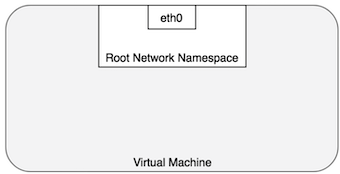
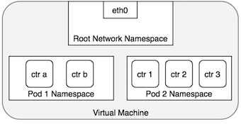
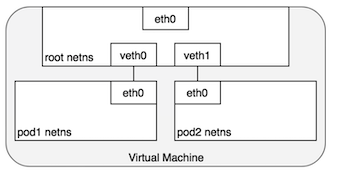
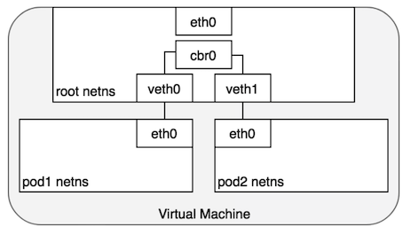
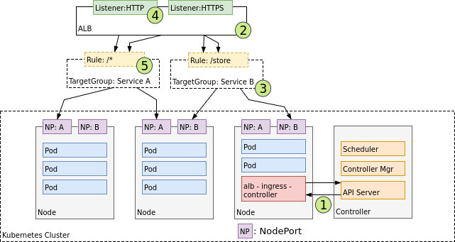
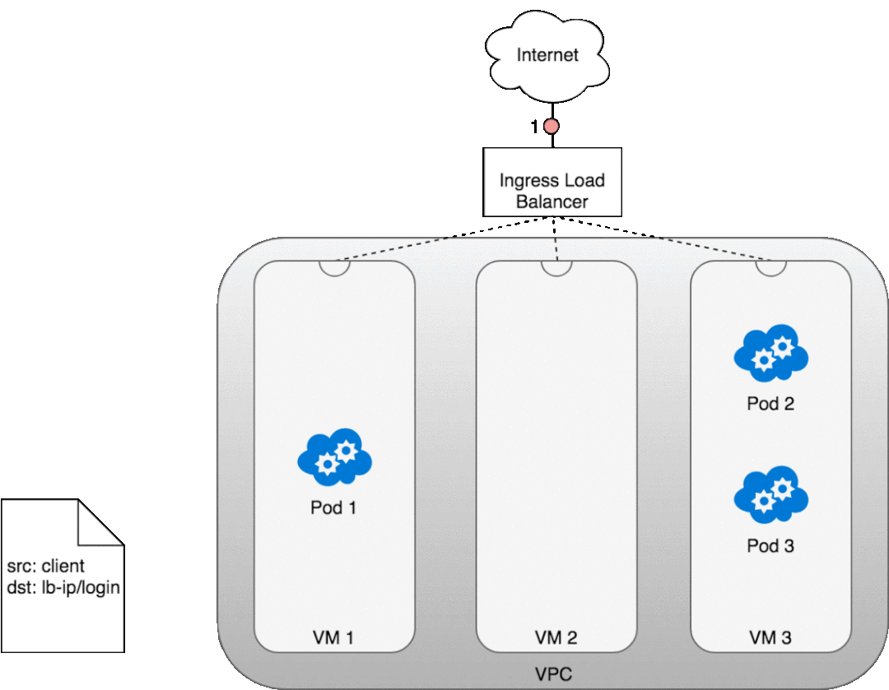

# **Kubernetes 网络模型基础面试**

Kubernetes 是为运行分布式集群而建立的，分布式系统的本质使得网络成为 Kubernetes 的核心和必要组成部分，了解 Kubernetes 网络模型可以使你能够正确运行、监控和排查应用程序故障。

网络是非常复杂的，拥有许多概念，对于不熟悉这个领域的用户来说，这可能会有一定的难度，这里面有很多概念需要理解，并且还需要把这些概念整合起来形成一个连贯的整体，比如网络命名空间、虚拟接口、IP 转发、NAT 等概念

Kubernetes 中对任何网络实现都规定了以下的一些要求：


* 所有 Pod 都可以在不使用 NAT 的情况下与所有其他 Pod 进行通信
* 所有节点都可以在没有 NAT 的情况下与所有 Pod 进行通信
* Pod 自己的 IP 与其他 Pod 看到的 IP 是相同的

鉴于这些限制，我们需要解决几个不同的网络问题：

* 容器到容器的网络
* Pod 到 Pod 的网络
* Pod 到 Service 的网络
* 互联网到 Service 的网络

接下来我们将来讨论这些问题及其解决方案。

## **容器到容器网络**

通常情况下我们将虚拟机中的网络通信视为直接与以太网设备进行交互，如图1所示。


实际的情况肯定比这要复杂，在 Linux 中，每个正在运行的进程都在一个网络命名空间内进行通信，该命名空间提供了一个具有自己的路由、防火墙规则和网络设备的逻辑网络栈，从本质上讲，网络命名空间为命名空间内的所有进程提供了一个全新的网络堆栈。

**Linux 用户可以使用 ip 命令创建网络命名空间。**例如，以下命令将创建一个名为 ns1 的网络命名空间。

```
$ ip netns add ns1 
```

**命名空间创建后，会在 `/var/run/netns ` 下面为其创建一个挂载点，即使没有附加任何进程，命名空间也是可以保留的。**

你可以通过列出 `/var/run/netns `下的所有挂载点或使用 ip 命令来列出可用的命名空间。

```
$ ls /var/run/netns
ns1

$ ip netns
ns1
```

默认情况下，Linux 将为每个进程分配到 root network namespace，以提供访问外部的能力，如图2所示。



对于 Docker 而言，一个 Pod 会被构建成一组共享网络命名空间的 Docker 容器，Pod 中的容器都有相同的 IP 地址和端口空间，它们都是通过分配给 Pod 的网络命名空间来分配的，并且可以通过 localhost 访问彼此，因为它们位于同一个命名空间中。这是使用 Docker 作为 Pod 容器来实现的，它持有网络命名空间，而应用容器则通过 Docker 的 `-net=container:sandbox-container` 功能加入到该命名空间中，图3显示了每个 Pod 如何由共享网络命名空间内的多个 Docker 容器（`ctr*`）组成的



此外 Pod 中的容器还可以访问共享卷，这些卷被定义为 Pod 的一部分，并且可以挂载到每个容器的文件系统中。


## **Pod 到 Pod 网络**

在 Kubernetes 中，每个 Pod 都有一个真实的 IP 地址，每个 Pod 都使用该 IP 地址与其他 Pod 进行通信。接下来我们将来了解 Kubernetes 如何使用真实的 IP 来实现 Pod 与 Pod 之间的通信的。我们先来讨论同一节点上的 Pod 通信的方式。

**从 Pod 的角度来看，它存在于自己的网络命名空间中，需要与同一节点上的其他网络命名空间进行通信。**

值得庆幸的时候，命名空间可以使用 Linux 虚拟以太网设备或由两个虚拟接口组成的 veth 对进行连接，这些虚拟接口可以分布在多个命名空间上。

**要连接 Pod 命名空间，我们可以将 veth 对的的一侧分配给 `root network namespace`，将另一侧分配给 Pod 的网络命名空间。**

**每个 veth 对就像一根网线，连接两侧并允许流量在它们之间流动。这种设置可以复制到节点上的任意数量的 Pod。图4显示了连接虚拟机上每个 Pod 的 root network namespace 的 veth 对**。



现在 Pod 都有自己的网络命名空间，这样它们就有自己的网络设备和 IP 地址，并且它们连接到节点的 root 命名空间，现在我们希望 Pod 能够通过 root 命名空间进行通信，那么我们将要使用一个网络 **bridge（网桥）来实现**。

现在 Pod 都有自己的网络命名空间，这样它们就有自己的网络设备和 IP 地址，并且它们连接到节点的 root 命名空间，现在我们希望 Pod 能够通过 root 命名空间进行通信，那么我们将要使用一个网络 bridge（网桥）来实现。

Bridges 实现了 ARP 协议来发现与指定 IP 地址关联的链路层 MAC 地址。当 bridge 接收到数据帧的时候，bridge 将该帧广播给所有连接的设备（原始发送者除外），响应该帧的设备被存储在一个查找表中，未来具有相同 IP 地址的通信使用查找表来发现正确的 MAC 地址来转发数据包。



## **同节点 Pod 通信**

网络命名空间将每个 Pod 隔离到自己的网络堆栈中，虚拟以太网设备将每个命名空间连接到根命名空间，以及一个将命名空间连接在一起的网桥，这样我们就准备好在同一节点上的 Pod 之间发送流量了，如下图6所示。


这上图中，pod1 向自己的网络设备 `eth0` 发送了一个数据包，对于 `pod1` 来说，`eth0` 通过虚拟网络设备连接到 `root netns` 的 `veth0(1)`，网桥 `cbr0` 被配置为与 `veth0 `一端相连，一旦数据包到达网桥，网桥就会使用 ARP 协议将数据包发送到 `veth1(3)`。

当数据包到达虚拟设备 `veth1` 时，它被直接转发到 `pod2` 的命名空间内的 `eth0(4) `设备。这整个过程中，每个 Pod 仅与 localhost 上的 eth0 进行通信，流量就会被路由到正确的 Pod。

Kubernetes 的网络模型决定了 Pod 必须可以通过其 IP 地址跨节点访问，也就是说，一个 Pod 的 IP 地址始终对网络中的其他 Pod 是可见的，每个 Pod 看待自己的 IP 地址的方式与其他 Pod 看待它的方式是相同的。接下来我们来看看不同节点上的 Pod 之间的流量路由问题。

这上图中，pod1 向自己的网络设备 eth0 发送了一个数据包，对于 pod1 来说，eth0 通过虚拟网络设备连接到 root netns 的 veth0(1)，网桥 cbr0 被配置为与 veth0 一端相连，一旦数据包到达网桥，网桥就会使用 ARP 协议将数据包发送到 veth1(3)。当数据包到达虚拟设备 veth1 时，它被直接转发到 pod2 的命名空间内的 eth0(4) 设备。这整个过程中，每个 Pod 仅与 localhost 上的 eth0 进行通信，流量就会被路由到正确的 Pod。


Kubernetes 的网络模型决定了 Pod 必须可以通过其 IP 地址跨节点访问，也就是说，一个 Pod 的 IP 地址始终对网络中的其他 Pod 是可见的，每个 Pod 看待自己的 IP 地址的方式与其他 Pod 看待它的方式是相同的。接下来我们来看看不同节点上的 Pod 之间的流量路由问题。


## **跨节点 Pod 通信**

在研究了如何在同一节点上的 Pod 之间路由数据包之后，接下来我们来看下不同节点上的 Pod 之间的通信。Kubernetes 网络模型要求 Pod 的 IP 是可以通过网络访问的，但它并没有规定必须如何来实现。

**通常集群中的每个节点都分配有一个 CIDR，用来指定该节点上运行的 Pod 可用的 IP 地址**。

一旦以 CIDR 为目的地的流量到达节点，节点就会将流量转发到正确的 Pod。图7展示了两个节点之间的网络通信，假设网络可以将 CIDR 中的流量转发到正确的节点。


上图一样和图相同的地方开始请求，但是这次目标 Pod（绿色标注）与源 Pod（蓝色标注）位于不同的节点上。

数据包首先通过 pod1 的网络设备发送，该设备与 `root netns（1）` 中的虚拟网络设备配对，最终数据包到达 `root netns` 的网桥（2）上。

这个时候网桥上的 ARP 会失败，因为与网桥相连的没有正确的数据包 MAC 地址。一旦失败，网桥会将数据包发送到默认路由上 - root netns 的 eth0 设备，此时就会路由离开节点，进入网络（3）。我们现在假设网络可以根据分配给节点的 CIDR 将数据包路由到正确的节点（4）。数据包进入目标节点的 root netns（VM2 上的 eth0），这那里它通过网桥路由到正确的虚拟设备（5）。最后，路由通过位于 pod4 的命名空间（6）中的虚拟设备 eth0 来完成。一般来说，每个节点都知道如何将数据包传递给其内部运行的 Pod，一旦数据包到达目标节点，数据包的流动方式与同一节点上的 Pod 间通信方式一样。

**我们这里没有介绍如何配置网络来将 Pod IPs 的流量路由到负责这些 IP 的正确节点**，这和特定的网络有关系，比如 AWS 就维护了一个 Kubernetes 容器网络插件，**该插件允许在 AWS 的 VPC 环境中使用 [容器网络接口（CNI）插件]（https://github.com/aws/amazon-vpc-cni-k8s）来进行节点到节点的网络通信。**

在 EC2 中，每个实例都绑定到一个弹性网络接口 (ENI)，并且所有 ENI 都连接在一个 VPC 内 —— ENI 无需额外操作即可相互访问。

默认情况下，每个 EC2 实例部署一个 ENI，但你可以创建多个 ENI 并将它们部署到 EC2 实例上。**Kubernetes 的 AWS CNI 插件会为节点上的每个 Pod 创建一个新的 ENI，因为 VPC 中的 ENI 已经连接到了现有 AWS 基础设施中，这使得每个 Pod 的 IP 地址可以在 VPC 内自然寻址**。

**当 CNI 插件被部署到集群时，每个节点（EC2 实例）都会创建多个弹性网络接口，并为这些实例分配 IP 地址，从而为每个节点形成了一个 CIDR 块**。

当部署 Pod 时，**有一个小的二进制文件会作为 DaemonSet 部署到 Kubernetes 集群中，从节点本地的 kubelet 进程接收任何添加 Pod 到网络的请求**，这个二进制文件会从节点的可用 ENI 池中挑选一个可用的 IP 地址，并通过在 Linux 内核中连接虚拟网络设备和网桥将其分配给 Pod，和在同一节点内容的 Pod 通信一样，有了这个，Pod 的流量就可以跨集群内的节点进行通信了。

## **Pod 到 Service**

上面我们已经介绍了如何在 Pod 和它们相关的 IP 地址之间的通信。但是 Pod 的 IP 地址并不是固定不变的，会随着应用的扩缩容、应用崩溃或节点重启而出现或消失，这些都可能导致 Pod IP 地址发生变化，Kubernetes 中可以通过 Service 对象来解决这个问题。

Kubernetes Service 管理一组 Pod，允许你跟踪一组随时间动态变化的 Pod IP 地址，Service 作为对 Pod 的抽象，为一组 Pod 分配一个虚拟的 VIP 地址，任何发往 Service VIP 的流量都会被路由到与其关联的一组 Pod。这就允许与 Service 相关的 Pod 集可以随时变更 - 客户端只需要知道 Service VIP 即可。

创建 Service 时候，会创建一个新的虚拟 IP（也称为 clusterIP），这集群中的任何地方，发往虚拟 IP 的流量都将负载均衡到与 Service 关联的一组 Pod。实际上，Kubernetes 会自动创建并维护一个分布式集群内的负载均衡器，将流量分配到 Service 相关联的健康 Pod 上。接下来让我们仔细看看它是如何工作的。

### **netfilter 与 iptables**


为了在集群中执行负载均衡，Kubernetes 会依赖于 Linux 内置的网络框架 - netfilter。

Netfilter 是 Linux 提供的一个框架，它允许以自定义处理程序的形式实现各种与网络相关的操作，**Netfilter 为数据包过滤、网络地址转换和端口转换提供了各种功能和操作，它们提供了引导数据包通过网络所需的功能，以及提供禁止数据包到达计算机网络中敏感位置的能力。**

iptables 是一个用户空间程序，它提供了一个基于 table 的系统，用于定义使用 netfilter 框架操作和转换数据包的规则。

在 Kubernetes 中，iptables 规则由 kube-proxy 控制器配置，该控制器会 `watch kube-apiserver` 的变更，当对 Service 或 Pod 的变化更新了 Service 的虚拟 IP 地址或 Pod 的 IP 地址时，iptables 规则会被自动更新，以便正确地将指向 Service 的流量路由到支持 Pod。

`iptables` 规则会监听发往 `Service VIP` 的流量，并且在匹配时，从可用 Pod 集中选择一个随机 Pod IP 地址，并且 `iptables `规则将数据包的目标 IP 地址从 `Service` 的` VIP` 更改为所选的 `Pod IP`。

当 Pod 启动或关闭时，`iptables` 规则集也会更新以反映集群的变化状态。换句话说，`iptables` 已经在节点上做了负载均衡，以将指向 `Service VIP` 的流量路由到实际的 Pod 的 IP 上。

在返回路径上，IP 地址来自目标 Pod，在这种情况下，iptables 再次重写 IP 头以将 Pod IP 替换为 Service 的 IP，以便 Pod 认为它一直只与 Service 的 IP 通信。

### **IPVS**

Kubernetes 新版本已经提供了另外一个用于集群负载均衡的选项：IPVS， IPVS 也是构建在 netfilter 之上的，并作为 Linux 内核的一部分实现了传输层的负载均衡。

IPVS 被合并到了 LVS（Linux 虚拟服务器）中，它在主机上运行并充当真实服务器集群前面的负载均衡器，IPVS 可以将基于 TCP 和 UDP 的服务请求定向到真实服务器，并使真实服务器的服务作为虚拟服务出现在一个 IP 地址上。这使得 IPVS 非常适合 Kubernetes 服务。

这部署 kube-proxy 时，可以指定使用 iptables 或 IPVS 来实现集群内的负载均衡。

**IPVS 专为负载均衡而设计，并使用更高效的数据结构（哈希表），与 iptables  相比允许更大的规模。在使用 IPVS 模式的 Service 时，会发生三件事：在 Node 节点上创建一个虚拟 IPVS 接口，将 Service 的 VIP 地址绑定到虚拟 IPVS 接口，并为每个 Service VIP 地址创建 IPVS 服务器。**


### **Pod 到 Service 通信**


当这 Pod 和 Service 之间路由一个数据包时，流量和以前开始的方式一样，

* 数据包首先通过连接到 Pod 的网络命名空间（1）的 **eth0** 离开 Pod。
* 然后它通过虚拟网络设备到达网桥（2）。
* 网桥上运行的 ARP 是不知道 Service 地址的，所以它通过默认路由 eth0（3）将数据包传输出去。

到这里会有一些不同的地方了，在 eth0 接收之前，该数据包会被 iptables 过滤，在收到数据包后，iptables 使用 `kube-proxy` 在节点上安装的规则来响应 Service 或 Pod 事件，将数据包的目的地从 Service VIP 改写为特定的 Pod IP（4）。


该数据包现在就要到达 pod4 了，而不是 Service 的 VIP，iptables 利用内核的 conntrack 工具来记录选择的 Pod，以便将来的流量会被路由到相同的 Pod。

**从本质上讲，iptables 直接从节点上完成了集群内的负载均衡，然后流量流向 Pod，剩下的就和前面的 Pod 到 Pod 通信一样的了（5）。**

### **Service 到 Pod 通信**


相应的回包的时候，收到该数据包的 Pod 将响应，将源 IP 标记为自己的 IP，将目标 IP 标记为最初发送数据包的 Pod(1)。进入节点后，数据包流经 iptables，它使用 **conntrack** 记住它之前所做的选择，并将数据包的源重写为 Service 的 VIP 而不是现在 Pod 的 IP(2)。从这里开始，数据包通过网桥流向与 Pod 的命名空间配对的虚拟网络设备 (3)，然后流向我们之前看到的 Pod 的虚拟网络设备 (4)。

## **外网到 Service 通信**

到这里我们已经了解了 Kubernetes 集群内的流量是如何路由的，但是更多的时候我们需要将服务暴露到外部去。这个时候会涉及到两个主要的问题：

* 将流量从 Kubernetes 服务路由到互联网上去
* 将流量从互联网传到你的 Kubernetes 服务

接下来我们就来讨论这些问题。

### **出流量**


从节点到公共 Internet 的路由流量也是和特定的网络有关系的，这取决于你的网络如何配置来发布流量的。这里我们以 AWS VPC 为例来进行说明。

在 AWS 中，Kubernetes 集群在 VPC 中运行，每个节点都分配有一个私有 IP 地址，该地址可从 Kubernetes 集群内访问。

**要从集群外部访问服务，你可以在 VPC 上附加一个外网网关。外网网关有两个用途：在你的 VPC 路由表中为可路由到外网的流量提供目标，以及为已分配公共 IP 地址的实例执行网络地址转换 (NAT)。NAT 转换负责将集群节点的内部 IP 地址更改为公网中可用的外部 IP 地址。**

有了外网网关，VM 就可以自由地将流量路由到外网。不过有一个小问题，Pod 有自己的 IP 地址，与运行 Pod 的节点 IP 地址不同，并且外网网关的 NAT 转换仅适用于 VM IP 地址，因为它不知道哪些 Pod 在哪些 VM 上运行 —— 网关不支持容器。让我们看看 Kubernetes 是如何使用 iptables 来解决这个问题的。


在下图中，数据包源自 Pod 的命名空间 (1)，并经过连接到根命名空间 (2) 的 veth 对。一旦进入根命名空间，数据包就会从网桥移动到默认设备，因为数据包上的 IP 与连接到网桥的任何网段都不匹配。在到达根命名空间的网络设备 (3) 之前，iptables 会破坏数据包 (3)。在这种情况下，数据包的源 IP 地址是 Pod，如果我们将源保留为 Pod，外网网关将拒绝它，因为网关 NAT 只了解连接到 VM 的 IP 地址。

**解决方案是让 iptables 执行源 NAT —— 更改数据包源，使数据包看起来来自 VM 而不是 Pod。有了正确的源 IP，数据包现在可以离开 VM (4) 并到达外网网关 (5) 了**。

外网网关将执行另一个 NAT，将源 IP 从 VM 内部 IP 重写为公网IP。最后，数据包将到达互联网上 (6)。在返回的路上，数据包遵循相同的路径，并且任何源 IP 的修改都会被取消，这样系统的每一层都会接收到它理解的 IP 地址：节点或 VM 级别的 VM 内部，以及 Pod 内的 Pod IP命名空间。


### **入流量**


让流量进入你的集群是一个非常难以解决的问题。同样这也和特定的网络环境有关系，但是一般来说入流量可以分为两种解决方案：

* Service LoadBalancer
* Ingress 控制器


**LoadBalancer**

当你创建一个 Kubernetes Service时，你可以选择指定一个 LoadBalancer 来使用它。LoadBalancer 有为你提供服务的云供应商负责创建负载均衡器，创建服务后，它将暴露负载均衡器的 IP 地址。终端用户可以直接通过该 IP 地址与你的服务进行通信。

**LoadBalancer 到 Service**

**在部署了 Service 后，你使用的云提供商将会为你创建一个新的 LoadBalancer（1）。因为 LoadBalancer 不支持容器，所以一旦流量到达 LoadBalancer，它就会分布在集群的各个节点上（2）。**

**每个节点上的 iptables 规则会将来自 LoadBalancer 的传入流量路由到正确的 Pod 上（3）**。**从 Pod 到客户端的响应将返回 Pod 的 IP，但客户端需要有 LoadBalancer 的 IP 地址**。正如我们之前看到的，iptables 和 conntrack 被用来在返回路径上正确重写 IP 地址。

下图展示的就是托管 Pod 的三个节点前面的负载均衡器。传入流量（1）指向 Service 的 LoadBalancer，一旦 LoadBalancer 接收到数据包（2），它就会随机选择一个节点。我们这里的示例中，我们选择了没有运行 Pod 的节点 VM2（3）。**在这里，运行在节点上的 iptables 规则将使用 kube-proxy 安装到集群中的内部负载均衡规则，将数据包转发到正确的 Pod。iptables 执行正确的 NAT 并将数据包转发到正确的 Pod（4）**。


### **Ingress 控制器**

在七层网络上 Ingress 在 HTTP/HTTPS 协议范围内运行，并建立在 Service 之上。

**启用 Ingress 的第一步是使用 Kubernetes 中的 NodePort 类型的 Service，如果你将 Service 设置成 NodePort 类型，Kubernetes master 将从你指定的范围内分配一个端口，并且每个节点都会将该端口代理到你的 Service，也就是说，任何指向节点端口的流量都将使用 iptables 规则转发到 Service。**


将节点的端口暴露在外网，可以使用一个 Ingress 对象，Ingress 是一个更高级别的 HTTP 负载均衡器，它将 HTTP 请求映射到 Kubernetes Service。根据控制器的实现方式，Ingress 的使用方式会有所不同。**HTTP 负载均衡器，和四层网络负载均衡器一样，只了解节点 IP（而不是 Pod IP），因此流量路由同样利用由 kube-proxy 安装在每个节点上的 iptables 规则提供的内部负载均衡。**

在 AWS 环境中，ALB Ingress 控制器使用 AWS 的七层应用程序负载均衡器提供 Kubernetes 入口。下图详细介绍了此控制器创建的 AWS 组件，它还演示了 Ingress 流量从 ALB 到 Kubernetes 集群的路由。



创建后，

* (1) Ingress Controller 会 watch 来自 Kubernetes APIServer 的 Ingress 事件。当它找到满足其要求的 Ingress 资源时，它会开始创建 AWS 资源。
* **AWS 将 Application Load Balancer (ALB) (2) 用于 Ingress 资源**。
* 负载均衡器与用于将请求路由到一个或多个注册节点的 TargetGroup一起工作。 (3) 在 AWS 中为 Ingress 资源描述的每个唯一 Kubernetes Service 创建 TargetGroup。
* **(4) Listener 是一个 ALB 进程，它使用你配置的协议和端口检查连接请求。Listener 由 Ingress 控制器为你的 Ingress 资源中描述的每个端口创建。最后，为 Ingress 资源中指定的每个路径创建 TargetGroup 规则**。
*  这可以保证到特定路径的流量被路由到正确的 Kubernetes 服务上 (5)。


### **Ingress 到 Service**

**流经 Ingress 的数据包的生命周期与 LoadBalancer 的生命周期非常相似。主要区别在于 Ingress 知道 URL 的路径（可以根据路径将流量路由到 Service）Ingress 和节点之间的初始连接是通过节点上为每个服务暴露的端口。**

* 部署 Service 后，你使用的云提供商将为你创建一个新的 Ingress 负载均衡器 (1)。
* 因为负载均衡器不支持容器，一旦流量到达负载均衡器，它就会通过为你的服务端口分布在组成集群 (2) 的整个节点中。
* 每个节点上的 iptables 规则会将来自负载均衡器的传入流量路由到正确的 Pod (3)。
* Pod 到客户端的响应将返回 Pod 的 IP，但客户端需要有负载均衡器的 IP 地址。正如我们之前看到的，iptables 和 conntrack 用于在返回路径上正确重写 IP。



### **总结**

本文介绍了 Kubernetes 网络模型以及如何实现常见网络任务。网络知识点既广泛又很深，所以我们这里不可能涵盖所有的内容，但是你可以以本文为起点，然后去深入了解你感兴趣的主题。