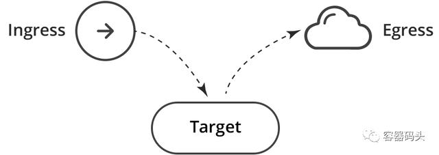

# **Kubernetes网络策略 NetworkPolicy**

## **Kubernetes网络策略**


**Kubernetes提供了一种称为网络策略的机制，可用于对部署在平台上的应用程序实施第3层分隔**。网络策略缺乏现代防火墙的高级功能，如第7层控制和威胁检测，但是它们确实提供了基本的网络安全，这是一个很好的起点。

### **网络策略控制Pod的通信**

Kubernetes的工作负载在pod中运行，pod由一个或多个部署在一起的容器组成。Kubernetes为每个pod分配一个IP地址，这个地址可以从其他所有pod路由，甚至可以跨底层服务器。Kubernets网络策略指定pod组的访问权限，类似于云服务中的安全组用于控制对虚拟机实例的访问。

## **编写网络策略**

与其他Kubernetes资源一样，网络策略可以使用一种称为YAML的语言定义。下面是一个简单的例子，它允许从负载均衡到postgres的访问。

```
apiVersion: networking.k8s.io/v1 
kind: NetworkPolicy 
metadata: 
  name: default.postgres 
  namespace: default 
spec: 
  podSelector: 
    matchLabels: 
      app: postgres 
  ingress: 
  - from: 
    - podSelector: 
        matchLabels: 
          app: balance 
  policyTypes: 
  - Ingress 
```

为了编写你自己的网络策略，你需要对yaml有基本的了解。**Yaml基于缩进(使用的是空格，而不是tab)**。

**缩进项属于其上方最接近的缩进项。连字符(破折号)开始一个新的列表项。所有其他项都是映射条目。你可以在网上找到大量关于yaml的信息。**


编写完策略的YAML文件后，使用kubectl创建策略：

```
kubectl create -f policy.yaml 
```

### **网络策略定义**

**网络策略定义由四个元素组成：**

* podSelector：将受此策略约束的pod(策略目标)。必填
* **policyType：指定哪些类型的策略包含在这个策略中，ingress或egress。该项是可选的，但建议总是明确的指定它。可选**
* **ingress：允许传入目标pod的流量。可选**
* **egress：允许从目标pod传出的流量。可选**

下面这个例子是从Kubernetes官网上改编的(将“role”改为了“app”)，它指定了四个元素：

```
apiVersion: networking.k8s.io/v1 
kind: NetworkPolicy 
metadata: 
  name: test-network-policy 
  namespace: default 
spec: 
  podSelector: 
    matchLabels: 
      app: db 
  policyTypes: 
  - Ingress 
  - Egress 
  ingress: 
  - from: 
    - ipBlock: 
        cidr: 172.17.0.0/16 
        except: 
        - 172.17.1.0/24 
    - namespaceSelector: 
        matchLabels: 
          project: myproject 
    - podSelector: 
        matchLabels: 
          role: frontend 
    ports: 
    - protocol: TCP 
      port: 6379 
  egress: 
  - to: 
    - ipBlock: 
        cidr: 10.0.0.0/24 
    ports: 
    - protocol: TCP 
      port: 5978 
```

注意，你不必包含所有四个元素。podSelector是必填的，其余三个是可选的。

如果你忽略了policyType，则推断如下：

* 策略总是被认为指定了一个ingress定义。如果你没有明确的定义它，它将被视为“不允许流量“。
* egress将由是否存在egress元素诱导。

为了避免错误，建议总是显式的指定policyType。

如果没有提供ingress或egress的定义，并且根据上面的逻辑假定它们存在，策略将认为它们是“不允许流量”。

### **默认策略是允许**

当没有定义任何策略时，Kubernetes允许所有通信。所有pod都可以相互自由通信。从安全角度来看，这听起来可能有悖常理，但请记住，Kubernetes是由希望应用程序进行通信的开发人员设计的。网络策略是作为后来的增强功能添加的。

### **命名空间**

命名空间是Kubernetes的多租户机制，旨在将命名空间环境相互隔离，但是，命名空间的通信在默认情况下仍然是被允许的。

与大多数Kubernetes实体一样，网络策略也位于特定的命名空间中。元数据头部告诉Kubernetes策略属于哪个命名空间：

```
apiVersion: networking.k8s.io/v1 
kind: NetworkPolicy 
metadata: 
  name: test-network-policy 
  namespace: my-namespace 
spec: 
... 
```

如果你没有明确指定元数据的命名空间，它将应用于kubectl提供的命名空间(默认是namespace=default)。

```
kubectl apply -n my-namespace -f namespace.yaml 
```

建议显式指定命名空间，除非你正在编写的策略要统一应用在多个命名空间中。

策略中的podSelector元素将从策略所属的命名空间中选择pod(它不能从另一个命名空间选择pod)。

**ingress和egress元素中的podSelector也会选择相同命名空间中的pod,除非你将它们和namespaceSelector一起使用。**

### **策略命名约定**

**策略的名称在命名空间中是唯一的。一个命名空间中不能有两个同名的策略，但是不同的命名空间可以有同名的策略**。当你想要在多个命名空间重复应用某个策略时，这非常方便。

我喜欢的策略命名方法之一是将命名空间与pod组合起来，例如：

```
apiVersion: networking.k8s.io/v1 
kind: NetworkPolicy 
metadata: 
  name: default.postgres 
  namespace: default 
spec: 
  podSelector: 
    matchLabels: 
      app: postgres 
  ingress: 
  - from: 
    - podSelector: 
        matchLabels: 
          app: admin 
  policyTypes: 
  - Ingress 
```
 
### **标签**

Kubernetes对象，如pod和namespace，可以附加用户自定义标签。Kubernetes网络策略依赖于标签来选择它们应用于的pod：

```
网络策略依赖于标签来选择它们应用于的pod：
podSelector: 
  matchLabels: 
    role: db 
```

或者它们应用于的命名空间。下面的例子中选择匹配标签的命名空间中的所有pod：

```
namespaceSelector: 
  matchLabels: 
    project: myproject 
```


需要注意的一点是：如果你使用namespaceSelector，请确保所选择的命名空间确实具有所使用的标签。请记住，像default和kube-system这样的内置命名空间没有现成的标签。你可以像这样给命名空间添加一个标签：

```
kubectl label namespace default namespace=default 
```

元数据中的namespace是命名空间的实际名称，而不是标签：

```
apiVersion: networking.k8s.io/v1 
kind: NetworkPolicy 
metadata: 
  name: test-network-policy 
  namespace: default 
spec: 
...
```

### **源和终点**

防火墙策略由具有源和终点的规则组成。Kubernetes网络策略是为目标(应用策略的一组pod)定义的，然后为目标指定传入或传出流量。再次使用相同的例子，你可以看到策略目标——默认命名空间中所有具有标签为“db:app”的pod:

```
apiVersion: networking.k8s.io/v1 
kind: NetworkPolicy 
metadata: 
  name: test-network-policy 
  namespace: default 
spec: 
  podSelector: 
    matchLabels: 
      app: db 
  policyTypes: 
  - Ingress 
  - Egress 
  ingress: 
  - from: 
    - ipBlock: 
        cidr: 172.17.0.0/16 
        except: 
        - 172.17.1.0/24 
    - namespaceSelector: 
        matchLabels: 
          project: myproject 
    - podSelector: 
        matchLabels: 
          role: frontend 
    ports: 
    - protocol: TCP 
      port: 6379 
  egress: 
  - to: 
    - ipBlock: 
        cidr: 10.0.0.0/24 
    ports: 
    - protocol: TCP 
      port: 5978 
```

该策略中的ingress项允许到目标pod的传入流量。因此，ingress被解释为“源”，目标被解释为各自的“终点”。同样，egress被解释为“终点”，目标是各自的“源”。



### **Egress和DNS**

**当执行egress时，必须小心不要阻止DNS，Kubernetes使用DNS将service的名称解释为其IP地址。否则，这个策略将不起作用，因为你没有允许balance执行DNS查找：**

```
apiVersion: networking.k8s.io/v1 
kind: NetworkPolicy 
metadata: 
  name: default.balance 
  namespace: default 
spec: 
  podSelector: 
    matchLabels: 
      app: balance 
  egress: 
  - to: 
    - podSelector: 
        matchLabels: 
          app: postgres 
  policyTypes: 
  - Egress
```

**“to”元素为空，它隐式选择了所有命名空间中的所有pod，从而允许balance通过Kubernetes的DNS服务执行DNS查找，DNS服务通常位于kube-system命名空间中**。

虽然这是有效的，但它过于宽松和不安全——它允许在集群外部进行DNS查找。

你可以分阶段锁定它：

**1.通过添加一个namespaceSelector只允许在集群内进行DNS查找：**

```
apiVersion: networking.k8s.io/v1 
kind: NetworkPolicy 
metadata: 
  name: default.balance 
  namespace: default 
spec: 
  podSelector: 
    matchLabels: 
      app: balance 
  egress: 
  - to: 
    - podSelector: 
        matchLabels: 
          app: postgres 
  - to: 
    - namespaceSelector: {} 
    ports: 
    - protocol: UDP 
      port: 53 
  policyTypes: 
  - Egress 
```

**2.只允许DNS在kube-system命名空间中**

为此，你需要为kube-system命名空间添加一个标签：

```
kubectl label namespace kube-system namespace=kube-system 
```

1. 然后用namespaceSelector在策略中指定它：

```
apiVersion: networking.k8s.io/v1 
kind: NetworkPolicy 
metadata: 
  name: default.balance 
  namespace: default 
spec: 
  podSelector: 
    matchLabels: 
      app: balance 
  egress: 
  - to: 
    - podSelector: 
        matchLabels: 
          app: postgres 
  - to: 
    - namespaceSelector: 
        matchLabels: 
          namespace: kube-system 
    ports: 
    - protocol: UDP 
      port: 53 
  policyTypes: 
  - Egress 
```

3.偏执狂可能想更进一步，将DNS限制为kube-system命名空间中特定的DNS服务。请参考下面的“通过命名空间和pod过滤”章节。

另一种选择是在命名空间级别允许DNS，这样就不需要为每个服务指定它了：

```
apiVersion: networking.k8s.io/v1 
kind: NetworkPolicy 
metadata: 
  name: default.dns 
  namespace: default 
spec: 
  podSelector: {} 
  egress: 
  - to: 
    - namespaceSelector: {} 
    ports: 
    - protocol: UDP 
      port: 53 
  policyTypes: 
  - Egress
```

空的podSelector选择该命名空间中的所有pod。

### **第一个匹配和规则顺序**

防火墙管理员知道对数据包采取的操作(允许或拒绝)由与其匹配的第一个规则决定。

但是在Kubernetes中，策略的顺序并不重要。默认的行为是，当没有定义策略时，允许所有通信，因此所有pod之间可以彼此通信。

一旦定义了策略，每个至少被一个策略选择的pod，将根据选择它的策略的并集(逻辑或)进行隔离：


没有被任何策略选中的pod继续保持开放。你可以通过定义cleanup规则来改变这个行为。

### **Cleanup规则(拒绝)**

**防火墙策略通常通过`any-any-any-deny`规则来丢弃所有非显式允许的流量。**

Kubernetes没有拒绝操作，但是你可以使用一个常规的规则来实现相同的效果，该策略指定`policyTypes=Ingress`，但是省略了实际ingress的定义，这被解释为“不允许进入”。

```
apiVersion: networking.k8s.io/v1 
kind: NetworkPolicy 
metadata: 
  name: deny-all 
  namespace: default 
spec: 
  podSelector: {} 
  policyTypes: 
  - Ingress 
```
该策略选择命名空间中的所有pod作为源，未定义ingress——这意味着不允许流量进入。

类似的，你可以拒绝来自一个命名空间的所有出站流量：

```
apiVersion: networking.k8s.io/v1 
kind: NetworkPolicy 
metadata: 
  name: deny-all-egress 
  namespace: default 
spec: 
  podSelector: {} 
  policyTypes: 
  - Egress 
```

请记住，任何其他允许访问命名空间中pod的策略都将优先于此拒绝策略——相当于防火墙中将允许策略添加到拒绝策略之上。

**Any-Any-Any-Allow**

**通过使用一个空的ingress元素修改上面的deny-all策略，可以创建一个allow-all策略**：

```
apiVersion: networking.k8s.io/v1 
kind: NetworkPolicy 
metadata: 
  name: allow-all 
  namespace: default 
spec: 
  podSelector: {} 
  ingress:  
  - {} 
  policyTypes: 
  - Ingress 
```

这允许所有命名空间中的所有pod(和IP)到默认命名空间中的任何pod的通信。这是默认行为，因此通常不需要这么做。但是，为了查找问题，暂时覆盖所有其他规则可能很有用。


你可以缩小此范围，仅允许访问默认命名空间中的一组特定的pod：

```
apiVersion: networking.k8s.io/v1 
kind: NetworkPolicy 
metadata: 
  name: allow-all-to-balance 
  namespace: default 
spec: 
  podSelector: 
    matchLabels: 
      app: balance 
  ingress:  
  - {} 
  policyTypes: 
  - Ingress 
```

下面的策略允许任何入站和出站流量(包括访问集群外的任何IP)：

```
apiVersion: networking.k8s.io/v1 
kind: NetworkPolicy 
metadata: 
  name: allow-all 
spec: 
  podSelector: {} 
  ingress: 
  - {} 
  egress: 
  - {} 
  policyTypes: 
  - Ingress 
  - Egress 
```

### **组合多个策略**

策略在三个级别上使用逻辑或进行组合。每个pod根据应用于它的所有策略的并集决定是否允许通信。

**1.在“from”和“to”项中，你可以定义三种类型的项，他们通过“或”进行组合：**

* namespaceSelector——选择一整个命名空间
* podSelector——选择pod
* ipBlock——选择一个子网

你可以在from/to下定义任意数量的项(即使是相同类型也可以定义多条)，它们将通过逻辑或组合在一起：

```
apiVersion: networking.k8s.io/v1 
kind: NetworkPolicy 
metadata: 
  name: default.postgres 
  namespace: default 
spec: 
  ingress: 
  - from: 
    - podSelector: 
        matchLabels: 
          app: indexer 
    - podSelector: 
        matchLabels: 
          app: admin 
  podSelector: 
    matchLabels: 
      app: postgres 
  policyTypes: 
  - Ingress 
```

**2.在一个策略中，ingress策略可以有多个“from”项，它们通过逻辑或组合在一起。同样，egress策略可以有多个“to”项，它们也通过逻辑或组合在一起：**

```
apiVersion: networking.k8s.io/v1 
kind: NetworkPolicy 
metadata: 
  name: default.postgres 
  namespace: default 
spec: 
  ingress: 
  - from: 
    - podSelector: 
        matchLabels: 
          app: indexer 
  - from: 
    - podSelector: 
        matchLabels: 
          app: admin 
  podSelector: 
    matchLabels: 
      app: postgres 
  policyTypes: 
  - Ingress 
```

**3.多个策略也通过逻辑或组合在一起。**

**但是当组合策略时，这里有一些限制:Kubernetes只能组合policyType(ingress或egress)不同的策略，多个策略都指定ingress(或egress)将会互相覆盖。**

**命名空间之间的通信**

默认情况下，命名空间间的通信是允许的。你可以使用deny-all策略来改变它，以阻止从或者到该命名空间的通信。

如果你阻止了对某个命名空间的访问，可以使用namespaceSelector允许来自一个特定的命名空间的访问。

```
apiVersion: networking.k8s.io/v1 
kind: NetworkPolicy 
metadata: 
  name: database.postgres 
  namespace: database 
spec: 
  podSelector: 
    matchLabels: 
      app: postgres 
  ingress: 
  - from: 
    - namespaceSelector: 
        matchLabels: 
          namespace: default 
  policyTypes: 
  - Ingress 
```

这允许default命名空间中的所有pod访问database命名空间中的postgres pod。但是，如果只想允许default命名空间中特定的pod访问postgres该怎么办呢?


通过namespace和pod联合过滤

Kubernetes 1.11及以上允许你将namespaceSelector和podSelector通过逻辑与组合在一起：

```
apiVersion: networking.k8s.io/v1 
kind: NetworkPolicy 
metadata: 
  name: database.postgres 
  namespace: database 
spec: 
  podSelector: 
    matchLabels: 
      app: postgres 
  ingress: 
  - from: 
    - namespaceSelector: 
        matchLabels: 
          namespace: default 
      podSelector: 
        matchLabels: 
          app: admin 
  policyTypes: 
  - Ingress 
```

## **为什么这被解释为“与”，而不是“或”呢?**

**请注意，podSelector不是以破折号开头的，在yaml中这意味着，podSelector与前面的namespaceSelector属于同一个列表项，因此它们通过逻辑与进行组合。**

**如果你在podSelector前面添加一个破折号，将创建一个新的列表项，这将与前面的namespaceSelector通过逻辑或组合。**要在所有命名空间中选择具有特定标签的pod，可以指定一个空的namespaceSelector：

```
apiVersion: networking.k8s.io/v1 
kind: NetworkPolicy 
metadata: 
  name: database.postgres 
  namespace: database 
spec: 
  podSelector: 
    matchLabels: 
      app: postgres 
  ingress: 
  - from: 
    - namespaceSelector: {} 
      podSelector: 
        matchLabels: 
          app: admin 
  policyTypes: 
  - Ingress 
```

**多个标签通过逻辑与组合**

 具有多个对象(主机、网络、组...)的防火墙规则被解释为逻辑或。例如，如果数据包的源匹配`HOST_1`或`HOST_2`，则应用此规则：
 
 
 
 与之相反的是，在Kubernetes中，`podSelector`和`namespaceSelector`中的多个标签通过逻辑与进行组合。例如，这将选择同时具有标签`role=db`和`version=v2`的pod：
 
 ```
 podSelector: 
  matchLabels: 
    role: db 
    version: v2 
 ```
 
 相同的逻辑适用所有类型的选择器：策略目标的选择器、pod的选择器、命名空间的选择器。

### **子网和IP地址(ipBlock)**

防火墙使用vlan、ip和子网来分割网络。

在Kubernetes中，pod的IP是自动分配的，并且可能经常变动，因此网络策略使用标签来选择pod和命名空间。子网(ipBlock)用于ingress或egress连接(南北向)。例如，下面这个策略允许default命名空间中的所有pod访问谷歌的DNS服务：

```
apiVersion: networking.k8s.io/v1 
kind: NetworkPolicy 
metadata: 
  name: egress-dns 
  namespace: default 
spec: 
  podSelector: {} 
  policyTypes: 
  - Egress 
  egress: 
  - to: 
    - ipBlock: 
        cidr: 8.8.8.8/32 
    ports: 
    - protocol: UDP 
      port: 53 
```

本例中空的podSelector表示“选择该命名空间中的所有pod”。该策略只允许访问8.8.8.8，这意味着它拒绝访问其他任何IP。因此，实际上，你已经阻止了对Kubernetes内部DNS服务的访问。如果你仍然想允许它，需要显式的指定它。

**通常ipBlock和podSelector是互斥的，因为通常你在ipBlock中不使用内部pod IP。如果你使用内部pod IP指定ipBlock，它实际上将允许与具有这些ip的pod进行通信。但是在实践中并不知道该用哪些IP，这就是为什么不应该用IP来选择pod**。


下面这个策略中包含所有IP，并允许访问所有其它pod：

```
apiVersion: networking.k8s.io/v1 
kind: NetworkPolicy 
metadata: 
  name: egress-any 
  namespace: default 
spec: 
  podSelector: {} 
  policyTypes: 
  - Egress 
  egress: 
  - to: 
    - ipBlock: 
        cidr: 0.0.0.0/0 
```

你可以通过排除内部IP来只允许访问外部IP。例如，如果pod的子网是10.16.0.0/14：

```
apiVersion: networking.k8s.io/v1 
kind: NetworkPolicy 
metadata: 
  name: egress-any 
  namespace: default 
spec: 
  podSelector: {} 
  policyTypes: 
  - Egress 
  egress: 
  - to: 
    - ipBlock: 
        cidr: 0.0.0.0/0 
        except: 
        - 10.16.0.0/14
```

**端口和协议**
 
 pod通常只监听一个端口，这意味着你可以简单的在策略中省略端口，默认允许任何端口。但是最好将策略设置为受限的，显式的指定端口：
 
```
apiVersion: networking.k8s.io/v1 
kind: NetworkPolicy 
metadata: 
  name: default.postgres 
  namespace: default 
spec: 
  ingress: 
  - from: 
    - podSelector: 
        matchLabels: 
          app: indexer 
    - podSelector: 
        matchLabels: 
          app: admin 
    ports: 
      - port: 443 
        protocol: TCP 
      - port: 80 
        protocol: TCP 
  podSelector: 
    matchLabels: 
      app: postgres 
  policyTypes: 
  - Ingress 
```

**请注意，端口应用于它们所在的“to”或“from”子句中的所有项。如果你想为不同的项指定不同的端口，你可以将ingress或egress拆分为多个“to”或“from”**，每个都有自己的端口：

```
apiVersion: networking.k8s.io/v1 
kind: NetworkPolicy 
metadata: 
  name: default.postgres 
  namespace: default 
spec: 
  ingress: 
  - from: 
    - podSelector: 
        matchLabels: 
          app: indexer 
    - podSelector: 
        matchLabels: 
          app: admin 
    ports: 
      - port: 443 
        protocol: TCP 
      - port: 80 
        protocol: TCP 
  podSelector: 
    matchLabels: 
      app: postgres 
  policyTypes: 
  - Ingress 
```

请注意，端口应用于它们所在的“to”或“from”子句中的所有项。如果你想为不同的项指定不同的端口，你可以将ingress或egress拆分为多个“to”或“from”，每个都有自己的端口：

```
apiVersion: networking.k8s.io/v1 
kind: NetworkPolicy 
metadata: 
  name: default.postgres 
  namespace: default 
spec: 
  ingress: 
  - from: 
    - podSelector: 
        matchLabels: 
          app: indexer 
    ports: 
     - port: 443 
       protocol: TCP 
  - from: 
    - podSelector: 
        matchLabels: 
          app: admin 
    ports: 
     - port: 80 
       protocol: TCP 
  podSelector: 
    matchLabels: 
      app: postgres 
  policyTypes: 
  - Ingress 
```

端口的默认行为：


* 如果完全省略端口，则表示所有端口和所有协议
* 如果省略协议，则默认为TCP
* 如果省略端口，则默认为所有端口

最佳实践：不要依赖默认行为，显式的指明。

注意你必须使用pod的端口，而不是service的端口。

## **策略是为pod定义的还是为service定义的?**

**当一个pod访问Kubernetes中另一个pod时，它通常要通过service，service是一个虚拟的负载均衡器，它将流量转发到实现该服务的pod上**。你可能会以为网络策略是控制对service的访问的，但事实并非如此。Kubernetes网络策略是应用于pod的端口，而非service的端口。

例如，如果一个service监听80端口，但是它将流量转发到监听8080端口的pod上，你需要在网络策略中指定8080端口。

这种设计不是最优的，因为当有人更改服务的内部工作方式时(如pod正在监听的端口)，你需要更新网络策略。

**显然，有一种解决方案可以解决这个问题，即使用命名端口，而不是硬编码的数字端口**

```
apiVersion: networking.k8s.io/v1 
kind: NetworkPolicy 
metadata: 
  name: default.allow-hello 
  namespace: default 
spec: 
  podSelector: 
    matchLabels: 
      app: hello 
  policyTypes: 
  - Ingress 
  ingress: 
  - from: 
    - podSelector: 
        matchLabels: 
          run: curl 
    ports: 
    - port: my-http 
```

你需要在pod的定义中指定这个端口的名字：


```
apiVersion: extensions/v1beta1 
kind: Deployment 
metadata: 
  labels: 
    app: hello 
  name: hello 
spec: 
  selector: 
    matchLabels: 
      app: hello 
  template: 
    metadata: 
      labels: 
        app: hello 
    spec: 
      containers: 
      - image: gcr.io/hello-minikube-zero-install/hello-node 
        imagePullPolicy: Always 
        name: hello-node 
        ports: 
        - containerPort: 8080 
          name: my-http 
```

这样就将网络策略和pod解耦了。


### **Ingress**

术语“ingress”在Kubernetes中有两种含义：

* **网络策略允许你控制其他pod或外部IP对pod的访问**
* **Kubergess的ingress是一种配置外部负载均衡器路由流量到集群内部的方式**

你可以编写一个k8s网络策略限制来自Kubernetes ingress的访问，但在大多数情况下这不是很有用，因为它只控制负载均衡器的内部IP。为了控制可以访问集群的外部子网，你需要在外部实施点(如负载均衡本身或负载均衡前面的防火墙)配置访问控制。

### **需要同时定义ingress和egress么?**

简单的回答是肯定的——为了允许pod A访问pod B，你需要允许pod A通过egress策略创建出站连接，并允许pod B通过ingress策略接受入站连接。

然而，实际上，你可能对两个方向中的一个使用默认的允许策略。

如果源pod被一个或多个egress策略选中，则将根据策略联合对其进行限制，在这种情况下你需要明确允许它连接到目标pod。如果pod不被任何策略选中，则它默认允许所有的出站流量。

同样，被一个或多个ingress策略选中的目标pod，也会受到策略的联合限制，在这种情况下你必须明确允许它接受来自源pod的流量。如果pod没有被任何策略选中，则它默认允许所有入站流量。

### **hostNetwork陷阱**

Kubernetes通常在自己的隔离网络中运行pod，然而，你可以指定Kubernetes在主机上运行pod

```
hostNetwork: true 
```
1.这样会完全绕开网路策略，pod像主机上运行的其他任何进程一样进行通信。

### **流量日志**

Kubernetes网络策略不能生成流量日志。这很难知道策略是不是像预期一样工作。这也是安全分析方面的主要限制。

### **控制到外部服务的流量**

Kubernetes网络策略不允许你为egress指定完全限定的域名(DNS)。当试图控制到无固定IP的外部站点(如aws.com)的流量时，这是一个限制。

### **策略验证**

防火墙将警告甚至拒绝接受无效的策略。Kubernetes也做了一些验证。当使用kubectl定义网络策略时，Kubernetes可能会告诉你策略无效并且拒绝接受。在其它情况下，Kubernetes将接受策略并修改它缺失的细节，你可以通过以下命令查看它：

```
kubernetes get networkpolicy  -o yaml
```

请注意，Kubernetes的验证不是无懈可击的，它可能允许策略中出现某些类型的错误。

### **执行**

Kubernetes本身并不执行网络策略，它只是一个API网关，它将执行的艰巨工作传递给一个称为容器网络接口(CNI)的底层系统。在没有合适CNI的Kubernetes集群中定义策略就像在没有安装防火墙的服务器上定义防火墙规则一样。你必须确保拥有具有安全功能的CNI，或者，对于托管的Kubernetes平台，你需要显式的启用将为你安装CNI的网络策略。


请注意，如果CNI不支持，你定义了一个网络策略，Kubernetes不会向你告警。

### **有状态还是无状态?**

目前所有的Kubernetes CNI都是有状态的，这使得pod能在它发起的TCP连接上接收应答，而不必为应答打开高端口。我不知道有没有Kubernetes标准保证状态性。

### **高级安全策略管理**

以下是一些针对Kubernetes实施更高级的网络策略的方法：

服务网格设计模式使用sidecar在服务级别提供更高级的遥测和流量控制。有关示例，请参考Istio。

一些CNI提供商已经将他们的工具扩展到了Kubernetes网络策略之外。

Tufin Orca——用于实现Kubernetes网络策略的可视化和自动化。

### **总结**

Kubernetes网络策略为集群划分提供了一种很好的方法，但是它们不直观并且有许多注意的地方。我相信，由于这种复杂性，一定有许多集群在他们的策略中存在“bug”。可能的解决方案是自动化策略定义或其他分割方法。同时，希望本文对澄清和解决你可能遇到的问题有所帮助。