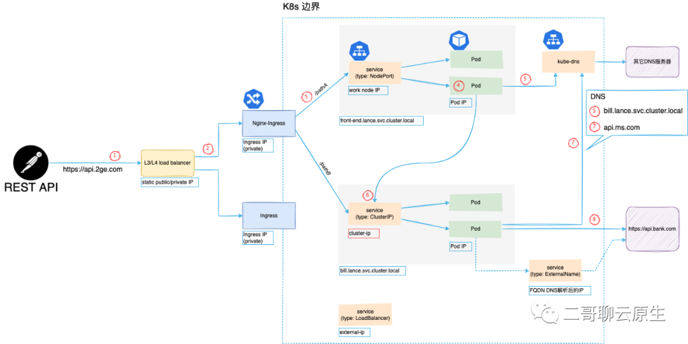
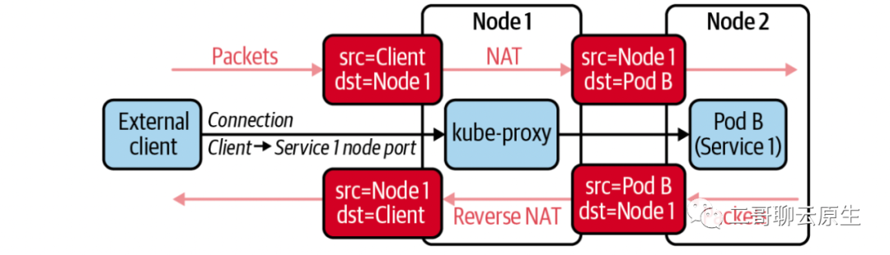
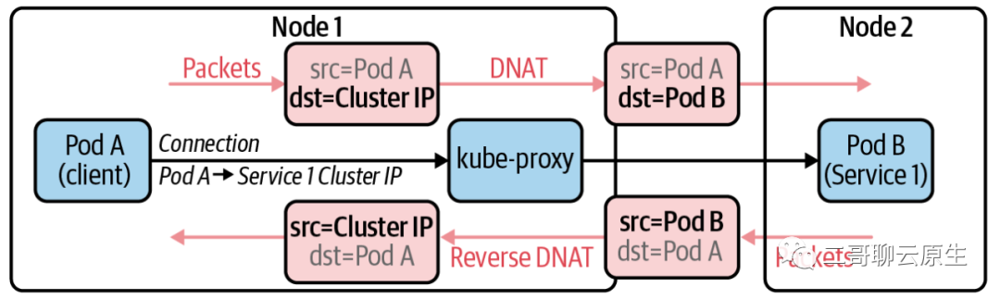
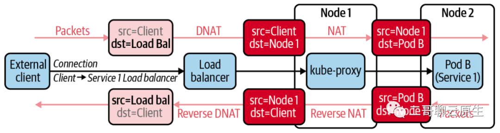

# **K8s 常用 IPs 地址类型知多少**

## **1. 示例介绍**

我们的示例涉及到的主要模块有：**客户端、L4 Load balancer、Nginx-Ingress、k8s 环境、外部服务（https://api.bank.com）**。

客户端想要访问的服务是` https://api.2ge.com/pathA`。在 K8s 内部，由两个 service 分别依次处理这个请求：`front-end.lance.svc.cluster.local` 和 `bill.lance.svc.cluster.local `。前者的角色从它的名字就可以看出来，而后者用于处理账单类事务。当然涉及到钱的时候，总离不开和银行打交道，所以 service bill 还会调用外部的一家银行所提供的服务 https://api.bank.com 做进一步的处理。

下图展示了上述模块的组成以及整个调用链。与负载均衡工作时所处的 OSI 网络模型层级相关，返回路径既可能经过原节点，也可能绕过原节点形成一个三角传输模式，所以这张图里没有画出返回路径。

## **2. L4 LB IP**

**① 客户端当然首先通过 DNS 获知 `FQDN api.2ge.com` 的 IP 地址。**

只不过客户端不知道的是这个地址是绑在 L4 load balancer (LB) 上的。这里的 IP 地址是一个 public IP 。如果我们使用的是云服务，那当使用它们的 LB 的时候，会非常容易地得到一个固定的 public IP 。

这里的 LB 工作在 L3/L4 。所谓四层负载均衡，也就是主要通过包的四层信息（ src/dst ip, src/dst port, proto），再加上负载均衡设备所设置的服务器选择方式，决定最终选择的内部服务器。它是一种基于IP+端口的负载均衡方式。

**这里所提及的服务器选择方式其实是一种策略，譬如有轮循均衡（Round Robin）、随机均衡（Random）、响应速度均衡（Response Time）等等**。

简言之：负载均衡的两大职责是“选择谁来处理用户请求”和“将用户请求转发过去”。

当 LB 决定将请求转交给它背后的服务时，它首先需要修改网络包的源 IP 地址和目的 IP 地址：将源地址改成自己的 IP ，而将目的 IP 地址改成图中 Nginx-Ingress 所拥有的 private IP。

## **3. Ingress IP**

**② 沿着请求路径，将我们的目光转移到 Ingress 身上。这里我们用的是 Nginx-Ingress 。我们给它分配的是 private IP 地址，如 192.168.5.20/16。这意味着这里的 Ingress 只能工作在 L4 LB 后面**。

为什么不把 Ingress 直接通过 public IP 暴露在 internet 上呢？答案当然是可以的。

**只是 L4 LB 只是单纯地转发包，且这个过程不需要和上下游建立连接。相比于 Nginx ，它的抗负载能力强、性能高（能相对靠近 F5 或 A10 硬件性能），对内存和cpu资源消耗比较低**。

从这里我们也可以看出来多级混合负载均衡的时候，通常应是工作在OSI 网络模型低层的负载均衡在前，而工作在高层的负载均衡在后。

**因为 Ingress 工作在 L7 ，所以它更懂应用层的协议，比如它可以理解 HTTP 请求里面的 path ，并基于 path 做进一步的路由。**

## **4. service IP**

**③ 既然说 Ingress 更懂 HTTP ，当它得知客户的请求路径是 `/pathA` 后，它就知道需要把请求转向内部的 `service front-end.lance.svc.cluster.local`。**

**<mark>步骤 ③ 这里发生的是 TCP 连接，所以 Ingress和 service 之间的三次握手、数据通信、四次挥手一个都不能少。相比步骤 ① 和 ② 之间的纯 IP 转发，这些多出来的步骤显然笨重了许多</mark>**。

但这个世界上的东西没有绝对的优点和缺点。当 ③ 得知了访问所请求的 path 之后，也便对通信内容有了更多的了解，当然也就有了更多的话语权，自然就能做更智能、更复杂的流量监控。比如我们可以以 REST API 为粒度来统计访问流量、延迟、错误率等。

步骤 ③ 既可能是基于 HTTP Proxy，也可能是 HTTPS Proxy的

当我们创建 K8s service 的时候，一定会需要做一个选择：service 类型是什么？事实上，目前我们可以选择的有：NodePort 、ClusterIP、LoadBalancer、ExternalName。不同的选择会出现不同的 IP 类型。

### **4.1 NodePort**

当我们选择 NodePort 类型意味着我们可以用 Node 自身的 IP 地址搭配在 Node 上所开启的端口访问该服务。

下图展示了在这种类型下，客户端通过向 Node1 的 IP 地址（端口未画出）发起请求，但最终由位于 Node2上的 Pod B 提供服务的流程。

**图中 kube-proxy 利用 full NAT 来实现了这样的 traffic control**。

因为请求发起方位于K8s cluster边界之外，如果不把client IP改成Node 1的IP的话，从 Pod B 返回的数据会直接发给 client 。而 client 端收到这个数据后会毫不犹豫地丢弃这个数据，因为它从来没有向Pod B的 IP 直接发起过请求。

### **4.2 ClusterIP**

当我们选择 ClusterIP 类型意味着我们所创建 service 的 IP 所能服务的范围是在 K8s cluster 内部的，故得名 Cluster IP 。

下图展示了在这种类型下，kube-proxy是如何利用 DNAT 来实现 traffic control 的。**在这里可以看到 DNAT 以及 Reverse DNAT 都发生在同一个Node上，这个 Node 同时也运行着发起请求的 Pod **。这也就是说 ClusterIP 无法直接对 K8s 边界外提供服务。与之相比，上一张图里客户端是在 K8s 边界之外的。

### **4.3 LoadBalancer**

当我们选择 LoadBalancer 类型意味我们的本意是想把这个 service 当成 load balancer 来使用。

如果你使用的是公有云提供的 K8s 服务，当查看 LoadBalancer 类型的 service 时，会明显地发现 EXTERNAL-IP 栏位不再为  <none> 。这个时候，云产商会为你的 LoadBalancer service 分配一个 public IP 地址。

下图展示了LoadBalancer service类型下，kube-proxy是如何利用 DNAT 来实现 traffic control 的。

* 首先看到 LoadBalancer 可以向 K8s cluster 边界之外提供服务 。
* LoadBalancer 的实现依赖于 NodePort service 。
* 整个过程既用到 DNAT 又用到了 full NAT 。

### **5. Pod IP**

我们继续往前走，来到步骤 ④ 。这是一个我们都熟悉的领域。每个 Pod 一个 IP 。没有 Network Policy 的干预下，一个 K8s Cluster 内，所有 Pod 之间互联互通，是一个位于 L2 的大平层。

我们的 Pod 在完成了它自身需要做的事情之后，需要将一部分工作转交给 service bill.lance.svc.cluster.local 来负责。很显然，这里需要 DNS 的介入。

但且慢，步骤 ③ 那里需要 DNS 吗？不需要。Ingress 有其它方法以 service 为线索得知它背后的 Pod 地址。

在步骤 ⑤ ，Pod 得知了 bill service 的 Cluster-IP ，这就足够了。步骤 ⑥ 标示出了发起请求的过程。

还记得文首我们提到 bill service 还得借助外部银行的一个服务来完成它自己的工作吗？步骤 ⑦ ⑧ 示意了这个过程。