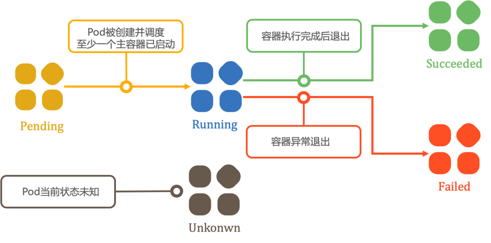
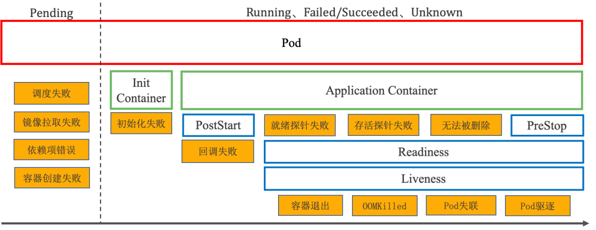
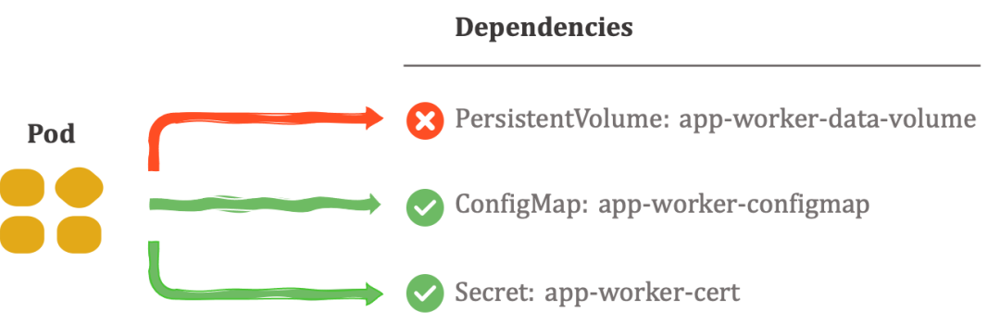
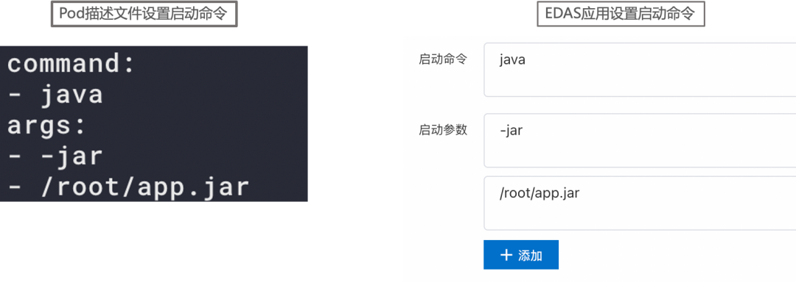
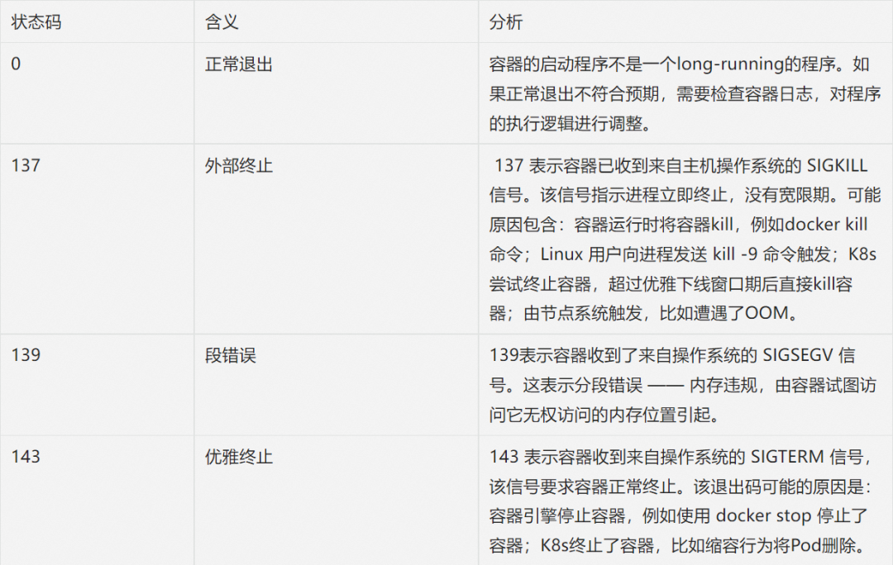

# **企业级弹性伸缩与优化建设**

## **一 背景**

传统意义上来讲，弹性伸缩主要解决的问题是容量规划与实际负载的矛盾, 这矛盾通常因为资源使用普遍具有以下几个问题导致：

* （1）在线服务申请资源时考虑到突发流量和服务稳定性，预留大量的 buffer 资源，造成资源申请量普遍远超实际使用量。
* （2）大部分在线服务的潮汐现象、波峰波谷特征非常明显，保留过多常态资源造成巨大浪费。
* （3）开发和运维评估和配置的资源规格不合理，并且动态更新不及时。

随着云原生技术的发展，容器云的弹性能力进入大众视野，弹性伸缩也成为各大服务器厂商的标准配置，在高速发展的互联网企业中，弹性既能支撑业务优雅面对突发的大流量、亦能在业务低峰时伸缩资源维持低成本运行，尤其在当前的大环境下， 降本增效的弹性能力建设是必然。那应该如何打造我们的弹性伸缩能力、又如何利用弹性的能力解决高昂的成本问题？

**本文根据笔者过去的实践和思考， 简单阐述对计算资源弹性、容器云kubernetes弹性、混合云弹性、Serverless等的一些心得体会**。

## **二 计算资源弹性能力建设**

业务还未部署在容器云的时候， 资源是私有云或公有云的虚拟机为主，设计弹性平台的落地产出就是提升虚拟机的资源利用率,降低服务器成本和动态感知业务增长,实现平滑扩容

### **弹性平台建设**

弹性平台基于应用资源画像的洞察-分析-优化方向建设， 整体架构包括可视化端层、计算层（数据获取、应用分析、弹性决策设定）、实施自动化，核心就是通过对资源使用率监控数据进行洞察分析，感知不同业务线的资源使用情况，对资源持续低负载或高负载有全局视角， 判断应用是否需要进行伸缩活动， 因为虚拟机资源的伸缩活动是分钟级（5分钟）以上的， 做不到容器云的秒级弹性， 所以还要考虑虚机资源池化

* 平台可视化层主要提供资源利用率大盘、应用弹性伸缩建议、业务健康度监控、事件日志审计、管理后台入口
* 计算模块主要提供数据获取、数据分析、伸缩弹性判定决策树
* 自动化模块主要提供伸缩事件通知、流量摘除、伸缩资源变更、业务部署、流量拉入等



 这里主要对决策树稍加阐述， 设定的算法逻辑主要考虑以下几点：

* 设计资源利用率升降配决策树
	* 降配时类型优先级：通用型 > 计算型 > 网络增强型
	* 升配时逆序
* 确定类型降配达标条件 主机：CPU利用率达到xx%，内存利用率达到xx%
* 设计优先横向实例数量扩缩 > 纵向规格变更
* 弹性扩容冷却期，在发生弹性扩容24h内， 不再进行缩容操作
* 考虑特殊情况， 白名单机制，譬如电商618、双十一等就需要提前扩容

当然资源成本优化也会考虑云商折扣、资源的类型譬如包年包月、按量付费、Spot抢占实例的组合方式等，Spot抢占实例在容器云中发挥的作用比较大，会在下文介绍

## **三 容器云集群层面优化**



随着云原生的发展， Kubernetes容器编排成为业务上云的首选。业界在容器上建设的路线基本遵循 `Docker > Kubernetes > ServiceMesh > Serverless ` 。

因为容器云是当下的主流， 所以下面会用比较大的篇幅来介绍容器云的弹性伸缩及优化方式

容器云弹性分为集群弹性和容器应用弹性两个层面。容器应用层面的弹性属于K8S的HPA或者VPA资源管理的范畴， 集群层面的弹性属于k8S的节点伸缩、动态调度等，本节从集群弹性讲起，主要包括以下内容：


* 集群弹性Cluster Autoscaler
* Node节点超卖
* 集群自定义调度
* 集群重调度
* 离线和在线业务混部
* Spot抢占实例替换

### **3.0、集群资源构成**

相比虚机类的弹性， 容器云环境的弹性是更为智能、高效的、可落地的。以 CPU 资源为例，一个 Kubernetes 集群的Node节点资源组成结构大致如下：

* Node Capacity是Node的所有硬件资源
* Kube-reserved是给kube组件预留的资源
* System-reserved是给System进程预留的资源
* Eviction-threshold（阈值）是kubelet eviction(收回)的阈值设定
* Allocatable才是真正scheduler调度Pod时的参考值
* `Node Allocatable  = Node Capacity - kube-reserved - system-reserved - eviction-threshold`
* 资源碎片因为node配置低、大资源pod不能调度、cpu满足但mem不满足调度等
* 通常业务申请的资源多，但POD实际利用率低，也导致Node利用率低

### **3.1、Kubernetes弹性优化总览**



* 集群自动弹性伸缩
* Node 资源超卖
* 动态调度
* 重调度descheduler
* 离线在线业务混部
* 低成本spot抢占
* 水平扩缩容HPA, 事件驱动KDEA， 预测EHPA
* 垂直扩容VPA，CronVPA Pod资源超卖

### **3.2、集群弹性CA**

Kubernetes AutoScaling 提供多种机制来满足 Pod 自动伸缩需求：

* Pod 级别的自动伸缩：包括Horizontal Pod Autoscaler（HPA）和Vertical Pod Autoscaler。
	* 其中 HPA 会基于 kubernetes 集群内置资源指标或者自定义指标来计算 Pod 副本需求数并自动伸缩，
	* VPA 会基于 Pod 在 CPU/Memory 资源历史使用详情来计算 Pod 合理的资源请求并驱逐 Pod 以更新资源配合；

* Node 级别的自动伸缩：Cluster Autoscaler 会综合考虑 Pod 部署挂起或集群容量等信息确定集群节点资源并相应调整集群 Node 数量。


 **集群Node级别的弹性伸缩** 

依托官方的ClusterAutoscaler组件，它可以根据部署的应用所请求的资源量来动态的伸缩集群，不同云厂商也分别实现了各自的Provider接入，对应的容器集群产品也都提供了弹性伸缩的功能，大家自行开启即可。如果你用的是自建集群， 可以参考云商实现适配自己集群的Provider。

在集群中部署CA主要解决以下几个问题：

* 1 思考需要多大的集群节点规模满足应用需求？
* 2 当Pod Pending ，没有可调度节点？
* 3 当多台节点利用率低， 不能被自动释放？

**整体架构**

* Autoscaler：核心模块，负责整体扩缩容功能
* Estimator：负责评估计算扩容
* Simulator：负责模拟调度，计算缩容
* Cloud Provider：抽象了CloudProvider及NodeGroup等相关接口，与云API交互



**什么时候扩？**

由于资源不足，pod调度失败，导致pod处于pending状态时，CA会评估扩容节点过程， 新拉起一台机器加入到集群中



**什么时候缩？**


当Node的资源利用率较低时，且此Node上存在的POD都能被重新调度到其他节点， CA组件就会执行评估缩容节点过程， **将这台Node节点上的POD驱逐到其他节点上，则此台Node就可以被释放** 。

需要注意适配缩容过程时需要考虑对POD的优雅调度 ， Cordon节点 + Drain方式 


什么样的节点不会被CA删除

* 节点上有pod被PodDisruptionBudget控制器限制。
* 节点上有命名空间是kube-system的pods。
* 节点上的pod不是被控制器创建，例如不是被deployment, replica set, job, stateful set创建。
* 节点上有pod使用了本地存储
* 节点上pod驱逐后无处可去，即没有其他node能调度这个pod
* 节点有注解：`"cluster-autoscaler.kubernetes.io/scale-down-disabled": "true"`

### **3.3、Node节点超卖**

Node 资源超卖方案是针对 Node 级别的资源调整方案，通过`AdmissionWebhook`修改K8s Node的Allocatable 实现， **达到在使用率较低的情况下，将原本较小的资源扩展为逻辑上较大的资源来处理**。

**例如原有CPU为4核，超卖2倍则是可将这个CPU视作8核**

* `Node Annotation xxx/cpu-oversold: "false"` 开启&关闭 Node 超卖增加灵活性 
* **`Node Annotation xxx/cpu-oversold-ratio=1.5 ` 调整Node可分配值到1.5倍**

超卖功能主要解决以下几个问题：

* 应用资源一般申请都超标、真实负载不高
* 测试环境节点超卖2-3倍节省成本

> 整体架构


**静态超卖**

静态超卖就是不考虑节点的真实负载， 只通过注解配置资源超卖比例

**动态超卖**

动态超卖就是根据每个节点的真实负载数据，进行不同比例的资源超卖或取消超卖

自研组件基于节点历史监控数据，动态的/周期性的去调整超卖比例。**比如某个 Node 连续 5m/1d持续低负载并且节点已分配资源水位线很高了，那么可以把超卖比例适当调高**，以此使 Node 能容纳更多的业务 Pod。如果节点已经是高负载， 那就维持或调小超卖比

当然超卖的设计也有常见一些问题需要考虑，譬如需要不断平衡Node节点的超卖与真实使用率、要支持指标采集灵活性支持1m或更长1d的不同选择、考虑大规模集群（5k节点）频繁的webhook更新对调度的性能影响等

### **3.4、集群调度**

在使用Node节点超卖时， 我们其实还有一个动态调度器配合一起工作， 调度器感知超卖相关配置和资源实际使用情况， 为应用稳定性和高效调度提供保证，  所以介绍下在调度层面可做的优化

**静态调度**

Kubernetes的资源编排调度默认使用的是静态调度Schedule，就是通过调度中预选+优选方式将Pod与Node绑定。

静态调度的好处就是调度简单高效、集群资源管理方便，最大的缺点也很明显，就是不管节点实际负载，极容易导致集群负载不高

**动态调度**  目前主要有3种扩展调度器方法：

* [**extender扩展调度**](https://kubernetes.io/docs/concepts/extend-kubernetes/#scheduler-extensions)，包含预选和优选接口的webhook，自实现逻辑对节点进行过滤和打分，参与调度流程中各个阶段的决策
* [**自定义调度器**](https://kubernetes.io/docs/tasks/extend-kubernetes/configure-multiple-schedulers/)，通过修改pod的`spec.schedulerName`来选择调度器。比较灵活，但研发成本高。**当集群有默认调度器和自定义调度器时，会出现两个调度器争抢**
*  [**Scheduling Framework**](https://kubernetes.io/docs/concepts/scheduling-eviction/scheduling-framework/)  Kubernetes v1.19版本stable的可拔插的调度框架，开发者可以通过实现扩展点定义的接口来实现插件 ---**推荐**

因主版本受限， 我们内部还是使用的extender， **通过实现 Filter  webhook 接口，接收 scheduler 请求 Filter 基于服务画像（服务、节点的cpu、mem均值、方差、欧氏距离聚类算法）来优化调度**

基本解决以下几个问题：

* 1 分配高负载低的情况、分配低但实际负载高的情况
* 2 节点CPU高负载75%以上不进行调度
* 3 机器打分制， 譬如ess机器分数最低
* 4 在线离线混部资源分配限制


> 开启自定义调度前


> 开启自定义调度后


### **3.5、Descheduler重调度**


上面讲到kube-scheduler默认是静态调度，属于'一次性'调度， 因为 Pod一旦被绑定了节点是不会自动触发重新调度的，那在后续node节点数量、标签、污点、容忍等的变动可能会导致已经被调度过的pod不是最优调度，  官方descheduler组件补足了这一点。

[Descheduler](https://github.com/Chao-Xi/JacobTechBlog/blob/master/k8s_tutorial/k8s_adv130_descheduler_adv.md)可以根据一些规则和配置策略来帮助我们重新平衡集群状态，其核心原理是根据其策略配置找到可以被移除的 Pod 并驱逐它们，其本身并不会进行调度被驱逐的 Pod，而是依靠默认的调度器来实现，目前支持的策略有：

* RemoveDuplicates  ---在集群中打散 Pod
* LowNodeUtilization --- 调度POD到未充分利用的节点上
* RemovePodsViolatingInterPodAntiAffinity --- 确保从节点中删除违反 Pod 反亲和性的 Pod
* RemovePodsViolatingNodeAffinity --- 确保从节点中删除违反NoSchedule污点的 Pod
* RemovePodsViolatingNodeTaints --- 确保从节点中删除违反节点亲和性的 Pod
* RemovePodsViolatingTopologySpreadConstraint --- 确保从节点驱逐违反拓扑分布约束的 Pods
* RemovePodsHavingTooManyRestarts --- 确保从节点中删除重启次数过多的 Pods
* PodLifeTime --- 驱逐比maxPodLifeTimeSeconds更旧的 Pods

### **3.6、离在线业务混部**

因为离线和在线业务有明显的潮汐性，进行合理的混部提升资源利用率、降低成本的有效方案 。


* 在线服务：运行时间长，服务流量及资源利用率有潮汐特征，时延敏感，对服务 SLA 要求极高，如消息流 Feed 服务、电商交易服务等，一般在线 k8s 集群的高峰为 08:00 - 24:00
* 离线作业：运行时间分区间，运行期间资源利用率较高，时延不敏感，容错率高，中断一般允许重运行，如 Hadoop 生态下的 MapReduce、Spark 作业，一般离线集群的高峰为 00:00 - 8:00


离线和在线业务混部是弹性的深水区， 因为不仅涉及调度部署、资源隔离与压制、容灾治理、跨部门合作等，所以一般也就只有大厂才真实落地


我介绍下我们在践行混部的路线，混部涉及到的比较复杂， 这里只介绍个思路， 大家也可以借鉴开源方案， 譬如 [阿里Koordinator](https://github.com/koordinator-sh/koordinator) 混部系统，[腾讯的Caelus](https://github.com/Tencent/Caelus) 混部方案等


**整体架构 **


阶段1 实现 Hadoop 离线集群的资源共享

* 器集群通过调度特定类型的服务特定阶段调度至 Hadoop 集群中空余的资源上，在离线集群的高峰到来之前进行迁移，保证离线集群高峰时期的资源


阶段2 整机腾挪方案

* 以集群转让节点的方式提高整体资源利用率
* 容器集群通过修改调度算法，实现低峰时期的空闲资源通过整机出让的方式，把机器资源共享至 Hadoop 离线集群
* 反之当在线服务的波峰来临，将Hadoop离线集群的机器通过整机出让的方式，把机器资源共享至 k8s在线集群

阶段3 离在线服务容器化混部

* 通过调度与隔离的手段进行资源共享与竞争
* 保障不同业务优先级(在线服务高优先级，离线服务低优先级)
* 离线服务低优先级，自动占用在线服务剩余宿主机资源
* 在线服务业务量增加的时候自动驱逐离线服务

### **3.7、Spot抢占实例**

前文我们都是在介绍集群层面的技术优化，这一节介绍的是Spot资源。Spot抢占实例的资源成本大概只占按量实例的30%左右

> Amazon EC2 Spot 实例让您可以利用 AWS 云中未使用的 EC2 容量。与按需实例的价格相比，使用 Spot 实例最高可以享受 90% 的折扣。
> 
> 得益于 AWS 的运行规模，Spot 实例可以在运行超大规模工作负载时实现规模并节省成本。您还可以选择休眠、停止或终止 Spot 实例，只需提前两分钟通知，我们就会收回 EC2 容量。

我们得到两个重要的信息， 1 spot实例最高可以享受90% 的折扣 2 实例终止提前两分钟通知 (阿里云是5分钟) 。那如果能用好抢占实例，就可以大幅降低我们的成本，所以我们尝试将云上业务的流量承载方式设置为如下：

* 30%的预留实例用来承载基础流量
* 10%的按需实例用来做弹性按需
* 60%的抢占实例做弹性支撑


**因为Spot实例具有随时会被回收终止的特点**，所以Spot实例比较适合灵活性较高或具有容错性的应用程序，所以在K8s的无状态业务负载节点我们大量使用了Spot实例。

如果你用的是云商的容器集群，那云商会提供Spot节点得选项， 如果是自建集群， 那建议通过阶段一、二完成建设

**整体架构**


> Kubernetes+Spot抢占架构

**阶段1**

已AWS为例，通过 [SpotFleet](https://docs.aws.amazon.com/AWSEC2/latest/UserGuide/spot-fleet.html)  或 [ASG](https://docs.aws.amazon.com/autoscaling/ec2/userguide/auto-scaling-groups.html) 获取所需的spot实例并加入k8s集群、通过CloudWatch[27]事件通知获取机器回收的消息、通过云函数Lambda触发回收节点操作、完成spot实例优雅释放

**阶段2**

* 首先通过对云商spot规格、价格、中断事件的数据收集和数据分析，考虑业务集群画像因素， 做深度智能推荐、中断预测
* 基于成本和稳定性双重考量，深度利用ondemand和spot实例组合，构建多可用区、业务分散策略、异常处理策略等
* 在节点工作阶段，通过中断预测提前预测实例回收事件发生概率，主动释放spot实例， 填充新的Node节点以减少不确定性，在节点回收阶段， 通过譬如提前扩容、弹性ECI兜底等减少pod不可调度风险

spot用法可以参考 容器成本降低50%，[携程在AWS Spot上的实践](https://mp.weixin.qq.com/s/xqsNeN28TCS5YzesBUIsxw)

## **四 容器云应用弹性方向建设**

前文提到kunernetes autoscaling 包括Pod 级别的自动伸缩和Node级别的自动伸缩， 接下来就聊聊Pod 级别的自动伸缩，基本包括：

* 原生的水平伸缩 [HPA](https://kubernetes.io/docs/tasks/run-application/horizontal-pod-autoscale/) 
* 事件驱动弹性 [KEDA](https://keda.sh/)
* HPA的扩展-CronHPA、
	* [EHPA](https://github.com/gocrane/crane)、
	* [AHPA](https://www.alibabacloud.com/blog/599120) 
* 原生纵向伸缩[Vertical Pod Autoscaler](https://github.com/kubernetes/design-proposals-archive/blob/main/autoscaling/vertical-pod-autoscaler.md)
* VPA扩展-CronVPA
* Pod request超卖

### **4.1、水平伸缩HPA**

HPA 会基于 kubernetes 集群内置资源指标或者自定义指标来计算 Pod 副本需求数并自动伸缩 ，因为伸缩的是副本数， 所以比较适合无状态应用deployment。kubernetes HPA 原生支持依据 CPU/Memory 资源利用率弹性伸缩，仅仅通过简单的命令就可以创建出hpa伸缩对象

```
kubectl autoscale deployment hpa-demo --cpu-percent=10 --min=2 --max=5
```

**整体架构**


**Prometheus-adapter**

在 HPA 实践落地过程中，仅仅依赖 CPU/Memory 利用率弹性伸缩无法满足业务在多指标扩缩、弹性伸缩稳定性方面的诸多需求，可以配置自定义的监控指标来，譬如 [Prometheus-adapter](https://github.com/kubernetes-sigs/prometheus-adapter)

1. 如果metrics数据pod可以暴露，则hpa的metrics type可以为pod类型，可以创建servicemonitor 从pod采集监控上报prometheus，也可以pod直接上报给prometheus
2. 如果metrics数据来源为k8s集群外部，比如ecs上的各种exporter，可以用servicemonitor从外部采集数据上报给集群内的prometheus,hpa的metrics type为object类型


> HPA接入Prometheus-adapter

### **4.2、KEDA**

我们看到原生HPA在支持多方数据指标时，需要做大量的工作来适配，并且原生HPA不支持预定的伸缩（解决弹性滞后的问题）、缩容到0（解决测试环境资源浪费问题）等问题，所以就出现各种基于HPA的扩展， 譬如当前最广泛应用的扩展器[KEDA](https://github.com/Chao-Xi/JacobTechBlog/blob/master/k8s_tutorial/k8s_adv117_EKDA_events.md)

KEDA是用于 Kubernetes 的基于事件驱动弹性伸缩器，用户只需要创建 ScaledObject 或 ScaledJob 来定义你想要伸缩的对象和你想要使用的触发器，KEDA 会处理剩下的一切！

附上KEDA架构图和对比原生HPA接入 Prometheus adapter的对比图


> KEDA架构


>  HPA接入外部指标架构


> KEDA接入外部指标架构

### **4.3、CronHPA、EHPA**

CronHPA 工作的核心是基于检测到的周期做“定时规划”，通过规划实现提前扩容的目的

**EHPA、AHPA 基于预测算法，提前触发应用扩容，大家感兴趣的可以深入研究下腾讯开源的基于FinOps为核心理念的Crane项目**


> EHPA架构


### **4.4、垂直扩容VPA**

Vertical Pod Autoscaler 是垂直扩容，根据 Pod 的资源利用率、历史数据、异常事件，来动态调整负载的 Request 值的组件，主要关注在有状态服务、单体应用的资源伸缩场景

**整体架构**

该项目包括3个组成部分：

* **Recommender** - 它监视当前和过去的资源消耗，并根据它提供推荐值容器的CPU和内存请求。
* **Updater** - 它检查哪些托管窗格具有正确的资源集，如果没有，则检查它们，以便控制器可以使用更新的请求重新创建它们
* **Admission Plugin** - 它在新pod上设置正确的资源请求（由于Updater的活动而刚刚由其控制器创建或重新创建）


不过VPA也有一些限制条件：

* VPA更新资源时要重建POD
* VPA和HPA同时工作时的冲突问题不好解决
* VPA性能尚未在大型集群中进行测试

除了VPA， 还有没有其他方式可以对资源设置的request资源进行弹性优化呢， 这里也介绍另外两种方式

### **4.5、CronVPA**

基本的核心还是基于检测到的周期做“定时规划”，根据业务的过去的监控数据，规划实现提前修改request的目的， 虽然也避免不了POD要进行重建


### **4.6、POD Request 超卖**

前文我们介绍过Node节点超卖，那还有一种更细粒度的就是Pod 的资源超卖，实现方式一样是通过webhook机制动态更改Pod的request设置（limit不超卖），或者更简单粗暴一些我们在研发申请资源的时候按照静态超卖的配置比例调整request设定， 当然这里要评估对业务稳定性的影响

## **五 基于混合云弹性建设**

从弹性的视角来讲私有云平台可以应对常态化业务访问压力，那如果遇到流量剧增，公有云更能提供成熟可靠的秒级弹性伸缩服，因此进行混合云建设可以有效填补业务高低峰访问对资源需求波动较大的业务需求场景，与私有云平台实现优势互补；当然混合云的建设不仅是为弹性，更多是为议价、多活、容灾考虑。如下我以私有云IDC和阿里云为例，举例其中一种混合云的形态，数据层是DTS同步、流量通过云解析DNS实现按照权重分发：


## **六 Serverless**

文中提到的这些资源伸缩及优化的方式，无疑都需要有个强大的技术团队来做支撑，并且这些对未来的大多数公司来讲也不是弹性优化的首选，或许Serverless才是云原生弹性演进的未来

Serverless 不是特指某种技术，而是无服务器、按需弹性、按量计费、简化运维等的工具结合， 通过一个应用引擎框架集成云开发、FaaS、BaaS、托管K8s、DevOps、服务治理、弹性等帮助业务轻松上云

比较流行的的开源框架像

* [Serverless](https://www.serverless.com/) 
* [Knative](https://knative.dev/ ) 
* [OpenFass](https://www.openfaas.com/)


