# **浅谈 Kubernetes Service 2023**

## **1 Service基本概念**

在kubernetes中，pod是应用程序的载体，我们可以通过pod的ip来访问应用程序，但是pod的ip地址不是固定的，直接访问pod ip 会带来很多问题。

为了解决这个问题，kubernetes提供了Service资源，Kubernetes Service 定义了这样一种抽象：逻辑上的一组 Pod，一种可以访问它们的策略。通过访问Service的入口地址就能访问到后面的pod服务。

### **1.1. 如何将Pod与Service关联起来——Endpoint**

Endpoint是kubernetes中的一个资源对象，存储在etcd中，用来记录一个service对应的所有pod的访问地址，它**是根据service配置文件中selector描述产生的。**

**一个Service由一组Pod组成，这些Pod通过Endpoints暴露出来，Endpoints是实现实际服务的端点集合**。换句话说，service和pod之间的联系是通过endpoints实现的。

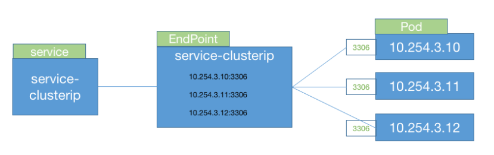

### **1.2. 从Endpoint到EndpointSlice**

**Endpoint 包含Service所有的Pod IP, 因此当一个Pod发生重启时，Pod IP发生改变，需要对整个Endpoint对象重新计算并存储。**

当Pod数量较少的情况下，这个不是大问题。但是当数量很多时，**需要的大量的网络IO。当一个Pod发生重启时，引入EndpointSlice，只需要更新发生改变的数组元素就可以了**。

**核心点在于在etcd里存储过程中不把整块数据一块存放（像原来Endpoint那样），而是分成几块分开存储。**

**EndpointSlice是Endpoint对象的集合**。

kubernetes会给任何带选择器的Service对象创建EndpointSlice. EndpintSlice对象包含Service 选择器匹配到的所有Pod 的网络地址。EndpointSlice通过`<协议，端口，Service名字>` 对Endpoint进行分组。

### 1.3. 如何将Service信息转化成对应的访问规则并进行转发——kube-proxy

我们知道k8s有很多组件工具，**其中网络代理工具使用的是kube-proxy**，**每个Node节点上都运行着一个kube-proxy，kube-proxy可以转发TCP，UDP，SCTP流**。那Service跟kube-proxy是如何协同工作的呢？

**当创建Service的时候会通过api-server向etcd写入创建的service的信息，而kube-proxy会基于监听的机制发现这种Service的变动，然后它会将最新的Service信息转换成对应的访问规则**。

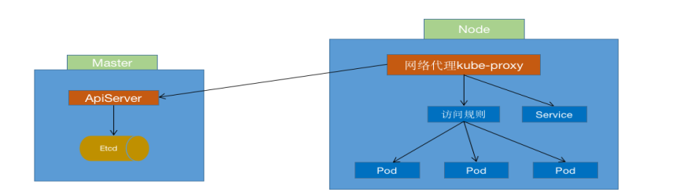

> 图kube-proxy工作原理

注：kube-proxy的三种模式：**userspace 模式、iptables模式、ipvs模式，可以通过KubeProxyConfiguration资源类型的的ProxyMode字段进行配置**。各种模式的优缺点对比如下：

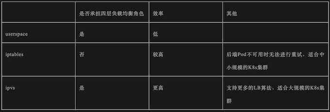

### **1.4. 如何通过servicename访问Pod服务——kube-dns**

除了Kube-proxy,我们还经常听到kube-dns,  **kube-dns功能主要是处理Pod通过servicename访问服务，即服务名称(servicename)到clusterIP的解析。**Kubernetes DNS pod 中包括 3 个容器

* kubedns：**kubedns 进程监视 Kubernetes master 中的 Service 和 Endpoint 的变化，并维护内存查找结构来服务DNS请求**。
* dnsmasq：**dnsmasq 容器添加 DNS 缓存以提高性能**。
* sidecar：**sidecar 容器在执行双重健康检查（针对 dnsmasq 和 kubedns）时提供单个健康检查端点（监听在10054端口）**

除了kube-dns，coredns 也可以实现通过servicename访问服务，coredns是一个高速并且十分灵活的dns服务。

coredns的优点是非常灵活的配置，**可以根据不同的需求给不同的域名配置不同的插件**,  k8s 1.9 版本后的默认的dns解析。

**缺点是缓存的效率不如 dnsmasq，对集群内部域名解析的速度不如 kube-dns（10% 左右）**。

## 02 Service的类型

### 2.1. ClusterIP 

默认值，它是Kubernetes系统自动分配Service网段中的IP

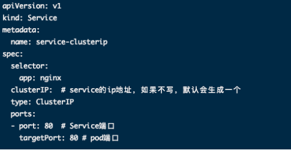

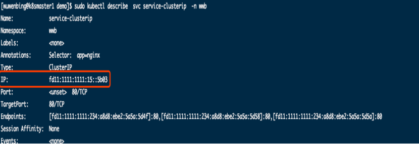

使用场景：当服务只需要在集群内部被访问时，比如一些中间件服务，建议使用该类型。

**优缺点：因为只局限于集群内部访问，保证了服务的网络隔离，具有安全性**。

### 2.2. headless类型的Service

Headless Service也是一种Service，但不同的是会定义`spec:clusterIP`: None，也就是不需要`Cluster IP`的`Service`。

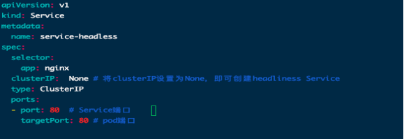

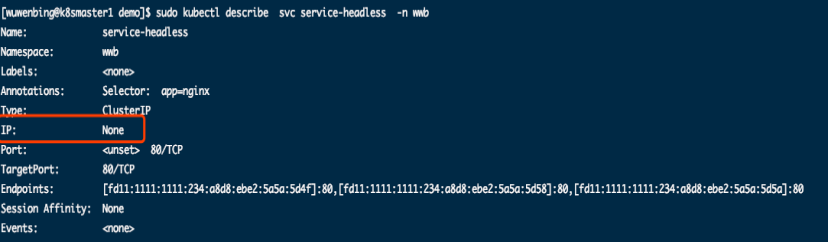

使用场景：

* 1、在某些场景中，开发人员可能不想使用Service提供的负载均衡功能，而希望自己来控制负载均衡策略。
* 2、headless Service还有一个很重要的场景是发现所有的pod（包括未就绪的pod），只有准备就绪的pod能够作为服务的后端。但有时希望即使pod没有准备就绪，服务发现机制也能够发现所有匹配服务标签选择器的pod。比如zk集群，zk节点pod之间必须互相识别之后进行选举，pod状态才会变为就绪，使用headless完美的解决这个问题。

优缺点：

1、这类Service不会分配Cluster IP，如果想要访问service，只能通过service的域名进行查询。

### 2.3. NodePort

通过每个集群节点上的 IP 和静态端口（NodePort）暴露服务。NodePort 服务会路由到 ClusterIP 服务，该 ClusterIP 服务会自动创建。通过请求 `<NodeIP>:<NodePort>`，可从集群的外部访问该 NodePort 服务

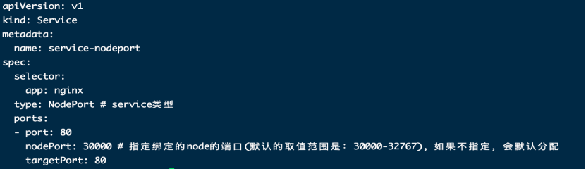

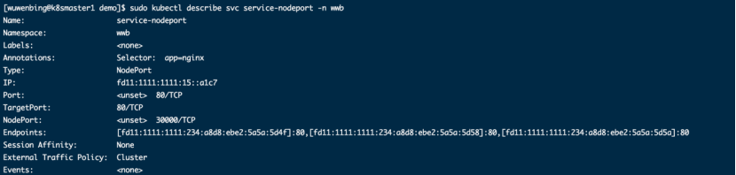

使用场景：

1、建议在测试及非生产环境使用，不推荐在生产环境中直接通过集群节点对外甚至公网提供服务。

优缺点：

* 1、从安全上考虑，使用该类型会直接暴露集群节点，容易受到攻击。
* 2、通常认为集群节点是动态的、可伸缩的，使用该类型使得对外提供服务的地址和集群节点产生了耦合。

## 2.4. LoadBalancer：

使用云提供商的负载均衡器向外部暴露服务。

外部负载均衡器可以将流量路由到自动创建的 NodePort 服务和 ClusterIP 服务上。

在使用支持外部负载均衡器的云提供商的服务时，设置 type 的值为 "LoadBalancer"，将为 Service 提供负载均衡器。负载均衡器是异步创建的，关于被提供的负载均衡器的信息将会通过 Service 的 status.loadBalancer 字段发布出去。

使用场景：使用外接负载均衡器完成到服务的负载分发

优缺点：具有使用限制：此模式需要外部云环境支持，通常在公有云上配合SLB使用。

## 2.5. ExternalName

把集群外部的服务引入集群内部，直接使用，对使用者做到了透明，让使用者感觉就好像调用自己命名空间的服务一样。

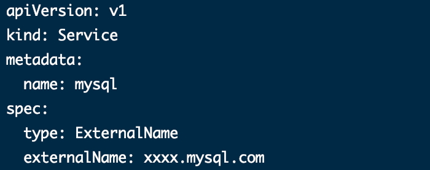

使用场景：具有 URI 的远程托管数据库

优缺点：

* 1、将外部服务映射到内部服务可未来灵活地将这些服务纳入集群，同时最大限度地减少重构工作。
* 2、可以更轻松地管理和了解组织所使用的外部服务。

## 03 Ingress介绍

###  3.1. 为什么要引入Ingress

在上面介绍了Service的几种类型，Service对集群之外暴露服务的主要方式有两种：NotePort和LoadBalancer，但是这两种方式，都有一定的缺点：

* 1.**NodePort方式的缺点是会占用很多集群机器的端口，那么当集群服务变多的时候，这个缺点就愈发明显**
* 2.**LB方式的缺点是每个service需要一个LB，浪费、麻烦，并且需要kubernetes之外设备的支持**
* 3.**Service只支持4层负载均衡，不支持7层复杂均衡**

基于这种现状，kubernetes提供了Ingress资源对象，Ingress是 Kubernetes 处理边缘入口流量的一种方式。

由于 Kubernetes 集群内的服务都是虚拟网络，外部流量访问集群内部至少需要一个公网ip和端口映射。Ingress 是 Kubernetes 应对集群管理外部访问流量的场景抽象出来一个资源对象，用来描述集群外部如何访问集群内部服务的方式。

### **3.2. Ingress是如何工作的**

以Nginx Ingress为例，支持7层的负载均衡，是kubernetes对反向代理的一个抽象，**它的工作原理类似于Nginx，可以理解成在Ingress里建立诸多映射规则，Ingress Controller通过监听这些配置规则并转化成Nginx的反向代理配置** , 然后对外部提供服务。在这里有两个核心概念：

* ingress：kubernetes中的一个对象，作用是定义请求如何转发到service的规则
* ingress controller：**具体实现反向代理及负载均衡的程序，对ingress定义的规则进行解析**，根据配置的规则来实现请求转发，实现方式有很多，比如Nginx, Contour, Haproxy等等

Nginx Ingress Controller 由用户部署在 Kubernetes 集群中，通过访问集群的 API Server 来实时监听用户应用到集群中的 Ingress 资源，经 Controller 解析并转化为 Nginx 配置文件（nginx.conf)，然后通过 reload 数据面 Nginx 的方式使得配置生效。

当外部请求访问集群入口点 Nginx Ingress Controller 时，匹配 Nginx Ingress 转发规则的流量转发到后端 Service 所对应的 Pod，由 Pod 处理外部请求。

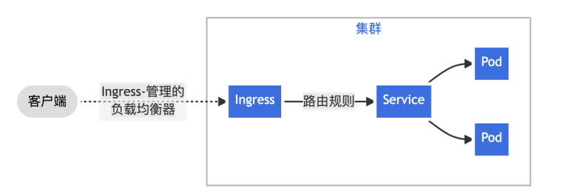