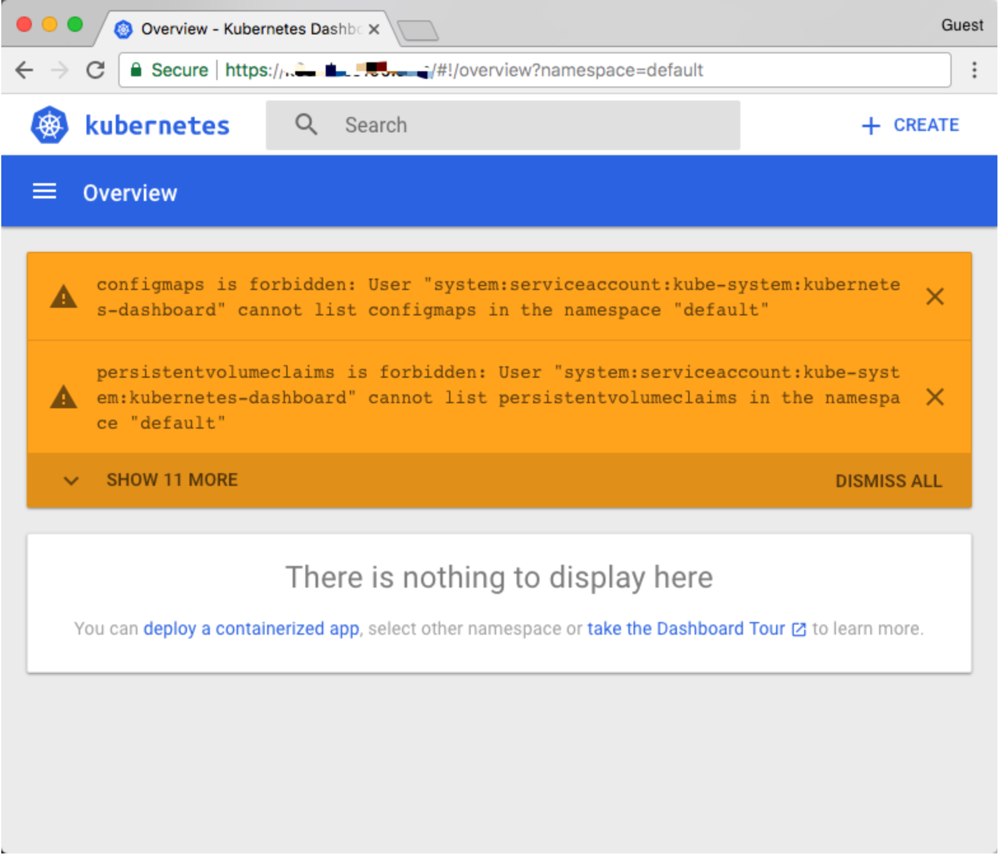
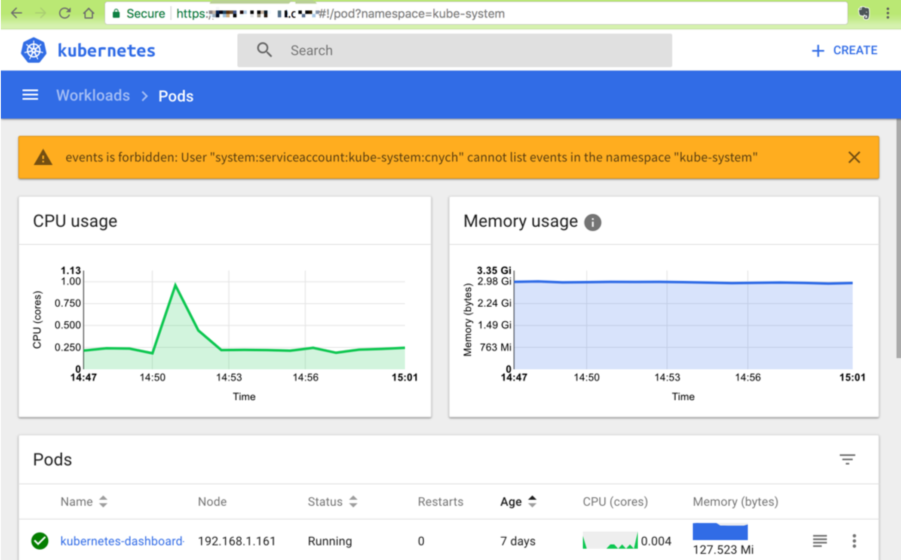

# Kubernetes RBAC 详解
# 深入理解 Kubernetes RBAC 的用法

`Kubernete`s中的有两个用于配置信息的重要资源对象：`ConfigMap`和`Secret`，其实到这里我们基本上学习的内容已经覆盖到`Kubernete`s中一些重要的资源对象了，来部署一个应用程序是完全没有问题的了。在我们演示一个完整的示例之前，我们还需要给大家讲解一个重要的概念：

### RBAC - 基于角色的访问控制

`RBAC`使用`rbac.authorization.k8s.io` API Group 来实现授权决策，允许管理员通过 `Kubernetes API` 动态配置策略，要启用`RBAC`，需要在 `apiserver` 中添加参数`--authorization-mode=RBAC`，如果使用的`kubeadm`安装的集群，1.6 版本以上的都默认开启了`RBAC`，可以通过查看 `Master` 节点上 `apiserver` 的静态`Pod`定义文件：

### `--authorization-mode=RBAC` 指定在安全端口使用RBAC 授权模式，拒绝未通过授权的请求

```
vi /etc/systemd/system/kube-apiserver.service

...
--insecure-bind-address=192.168.1.137 \
  --authorization-mode=Node,RBAC \
  --runtime-config=rbac.authorization.k8s.io/v1alpha1 \
...

```

如果是二进制的方式搭建的集群，添加这个参数过后，记得要重启 `apiserver` 服务。

## RBAC API 对象

`Kubernetes`有一个很基本的特性就是它的[所有资源对象都是模型化的 `API` 对象](https://kubernetes.io/docs/concepts/overview/working-with-objects/kubernetes-objects/)，允许执行 `CRUD(Create、Read、Update、Delete)`操作(也就是我们常说的增、删、改、查操作)，比如下面的这下资源：

* Pods
* ConfigMaps
* Deployments
* Nodes
* Secrets
* Namespaces

上面这些资源对象的可能存在的操作有：

* create
* get
* delete
* list
* update
* edit
* watch
* exec

在更上层，这些资源和 `API Group` 进行关联，比如`Pods`属于 `Core API Group`，而`Deployements`属于 `apps API Group`，要在`Kubernetes`中进行`RBAC`的管理，除了上面的这些资源和操作以外，我们还需要另外的一些对象：

* `Rule`：规则，规则是一组属于不同 `API Group` 资源上的一组操作的集合
* `Role` 和 `ClusterRole`：**角色和集群角色**，这两个对象都包含上面的 Rules 元素，二者的区别在于，
  * 在 `Role` 中，定义的规则只适用于单个命名空间，也就是和 `namespace` 关联的，
  * 而 `ClusterRole` 是集群范围内的，因此定义的规则不受命名空间的约束。
* 另外 `Role` 和 `ClusterRole` 在Kubernetes中都被定义为集群内部的 API 资源，和我们前面学习过的 Pod、`ConfigMap` 这些类似，都是我们集群的资源对象，所以同样的可以使用我们前面的kubectl相关的命令来进行操作.

`Subject`：主题，对应在集群中尝试操作的对象，集群中定义了3种类型的主题资源：

1. `User Account`：用户，这是有外部独立服务进行管理的，管理员进行私钥的分配，用户可以使用 `KeyStone`或者 `Goolge 帐号`，甚至一个用户名和密码的文件列表也可以。对于用户的管理集群内部没有一个关联的资源对象，所以用户不能通过集群内部的 API 来进行管理
2. `Group`：组，这是用来**关联多个账户的**，集群中有一些默认创建的组，比如`cluster-admin`
3. `Service Account`：服务帐号，通过`Kubernetes API `来管理的一些用户帐号，和 `namespace` 进行关联的，适用于集群内部运行的应用程序，需要通过 `API` 来完成权限认证，所以在集群内部进行权限操作，我们都需要使用到 `ServiceAccount`，这也是我们这节课的重点


`RoleBinding` 和 `ClusterRoleBinding`：**角色绑定和集群角色绑定**，简单来说就是把声明的 `Subject` 和我们的 `Role` 进行绑定的过程(给某个用户绑定上操作的权限)，

### 二者的区别也是作用范围的区别：`RoleBinding` 只会影响到当前 `namespace` 下面的资源操作权限，而 `ClusterRoleBinding` 会影响到所有的 `namespace`。


接下来我们来通过几个示例来演示下`RBAC`的配置方法。


## 创建一个只能访问某个 namespace 的用户

我们来创建一个 `User Account`，只能访问 `kube-system` 这个命名空间：

* username: nyjxi
* group: bbtest

### 第1步：创建用户凭证

我们前面已经提到过，`Kubernetes`没有 `User Account` 的 `API` 对象，不过要创建一个用户帐号的话也是挺简单的，利用管理员分配给你的一个私钥就可以创建了，这个我们可以[参考官方文档](https://kubernetes.io/docs/reference/access-authn-authz/authentication/)中的方法，这里我们来使用`OpenSSL`证书来创建一个 `User`，当然我们也可以使用更简单的`cfssl`工具来创建：

* 给用户 `nyjxi` 创建一个私钥，命名成：`nyjxi.key`：

```
$ openssl genrsa -out nyjxi.key 2048

Generating RSA private key, 2048 bit long modulus
.......................................+++
........................................................................+++
e is 65537 (0x10001)
```

* 使用我们刚刚创建的私钥创建一个证书签名请求文件：`nyjxi.csr`，要注意需要确保在`-subj`参数中指定用户名和组(`CN表示用户名，O表示组`)：

```
$ openssl req -new -key nyjxi.key -out nyjxi.csr -subj "/CN=nyjxi/O=bbtest"

```

* 后找到我们的`Kubernetes`集群的`CA`，我们使用的是`kubeadm`安装的集群，CA相关证书位于`/etc/kubernetes/pki/`目录下面，如果你是二进制方式搭建的，你应该在最开始搭建集群的时候就已经指定好了`CA`的目录，我们会利用该目录下面的`ca.crt`和`ca.key`两个文件来批准上面的证书请求

* 生成最终的证书文件，我们这里设置证书的有效期为500天：

```
$ openssl x509 -req -in nyjxi.csr -CA /etc/kubernetes/ssl/ca.crt -CAkey /etc/kubernetes/ssl/ca.key -CAcreateserial -out nyjxi.crt -days 500

Signature ok
subject=/CN=nyjxi/O=bbtest
Error opening CA Certificate /etc/kubernetes/ssl/ca.crt
140239269303960:error:02001002:system library:fopen:No such file or directory:bss_file.c:398:fopen('/etc/kubernetes/ssl/ca.crt','r')
140239269303960:error:20074002:BIO routines:FILE_CTRL:system lib:bss_file.c:400:
unable to load certificate
```

```
$ sudo openssl x509 -req -in nyjxi.csr -CA /etc/kubernetes/ssl/ca.pem -CAkey /etc/kubernetes/ssl/ca-key.pem -CAcreateserial -out nyjxi.crt -days 500
Signature ok
subject=/CN=nyjxi/O=bbtest
Getting CA Private Key
```

现在查看我们当前文件夹下面是否生成了一个证书文件：

```
$ ls
nyjxi.csr nyjxi.key nyjxi.crt
```

* 现在我们可以使用刚刚创建的证书文件和私钥文件在集群中创建新的凭证和上下文(Context):

```
$ kubectl config set-credentials nyjxi --client-certificate=nyjxi.crt  --client-key=nyjxi.key

User "nyjxi" set.
```

我们可以看到一个用户`nyjxi`创建了，然后为这个用户设置新的 `Context`:

```
$ kubectl config set-context nyjxi-context --cluster=kubernetes --namespace=kube-system --user=nyjxi

Context "nyjxi-context" created.
```

到这里，我们的用户`nyjxi`就已经创建成功了，现在我们使用当前的这个配置文件来操作`kubectl`命令的时候，应该会出现错误，因为我们还没有为该用户定义任何操作的权限呢

```
$ kubectl get pods --context=nyjxi-context
Error from server (Forbidden): pods is forbidden: User "nyjxi" cannot list pods in the namespace "default"
```


### 第2步：创建角色

用户创建完成后，接下来就需要给该用户添加操作权限，我们来定义一个YAML文件，创建一个允许用户操作 `Deployment`、`Pod`、`ReplicaSets` 的角色，如下定义：(`nyjxi-role.yaml`)

```
apiVersion: rbac.authorization.k8s.io/v1
kind: Role
metadata:
  name: nyjxi-role
  namespace: kube-system
rules:
- apiGroups: ["", "extensions", "apps"]
  resources: ["deployments", "replicasets", "pods"]
  verbs: ["get", "list", "watch", "create", "update", "patch", "delete"] # 也可以使用['*']
```


其中`Pod`属于 `core` 这个 `API Group`，在`YAML`中用空字符就可以，而`Deployment`属于 `apps` 这个 `API Group`，`ReplicaSets`属于`extensions`这个 `API Group`(我怎么知道的？[点这里查文档](https://kubernetes.io/docs/reference/generated/kubernetes-api/v1.10/))，所以 `rules` 下面的 `apiGroups` 就综合了这几个资源的 API Group：[“”, “extensions”, “apps”]，其中`verbs`就是我们上面提到的可以对这些资源对象执行的操作，我们这里需要所有的操作方法，所以我们也可以使用[’*‘]来代替。

然后创建这个`Role`：

```
$ kubectl create -f nyjxi-role.yaml
role "nyjxi-role" created
```

```
$ kubectl get roles -n=kube-system
NAME                                             AGE
extension-apiserver-authentication-reader        5d
nyjxi-role                                       1m
```

注意这里我们没有使用上面的`nyjxi-context`这个上下文了，因为木有权限

### 第3步：创建角色权限绑定

`Role` 创建完成了，但是很明显现在我们这个 `Role` 和我们的用户 `nyjxi` 还没有任何关系，对吧？这里我就需要创建一个`RoleBinding`对象，在 `kube-system` 这个命名空间下面将上面的 `nyjxi-role` 角色和用户 `nyjxi` 进行绑定:(`nyjxi-rolebinding.yaml`)

```
apiVersion: rbac.authorization.k8s.io/v1
kind: RoleBinding
metadata:
  name: nyjxi-rolebinding
  namespace: kube-system
subjects:
- kind: User
  name: nyjxi
  apiGroup: ""
roleRef:
  kind: Role
  name: nyjxi-role
  apiGroup: ""
```

上面的`YAML`文件中我们看到了`subjects`关键字，这里就是我们上面提到的用来尝试操作集群的对象，这里对应上面的 `User` 帐号 `nyjxi`，使用`kubectl`创建上面的资源对象：

```
$ kubectl create -f nyjxi-rolebinding.yaml
rolebinding "nyjxi-rolebinding" created
```

### 第4步. 测试

现在我们应该可以上面的`haimaxy-context`上下文来操作集群了：

```
$ kubectl get pods --context=nyjxi-context
NAME                                          READY     STATUS    RESTARTS   AGE
heapster-7cf895f48f-vldnr                     1/1       Running   0          5d
kube-dns-7d6cf4f985-lfllm                     3/3       Running   0          5d
kubernetes-dashboard-679cb978d7-5hncg         1/1       Running   0          5d
monitoring-grafana-746b995456-4txf2           1/1       Running   0          5d
monitoring-influxdb-67f8d587dd-4jvkd          1/1       Running   0          5d
test-volume-pod                               1/1       Running   0          3d
traefik-ingress-controller-668679b744-bdq6w   1/1       Running   0          5d

```
```
$ kubectl  get pods -n=kube-system
```

我们可以看到我们使用kubectl的使用并没有指定 `namespace` 了，这是因为我们已经为该用户分配了权限了，如果我们在后面加上一个`-n default`试看看呢？

```
kubectl --context=nyjxi-context get pods --namespace=default

Error from server (Forbidden): pods is forbidden: User "nyjxi" cannot list pods in the namespace "default"
```
是符合我们预期的吧？因为该用户并没有 `default` 这个命名空间的操作权限


## 创建一个只能访问某个 `namespace` 的`ServiceAccount`

上面我们创建了一个只能访问某个命名空间下面的普通用户，我们前面也提到过 `subjects` 下面还有一直类型的主题资源：`ServiceAccount`，现在我们来创建一个集群内部的用户只能操作 `kube-system` 这个命名空间下面的 `pods` 和 `deployments`，首先来创建一个 `ServiceAccount` 对象：

```
$ kubectl create sa haimaxy-sa -n kube-system
```

当然我们也可以定义成YAML文件的形式来创建。

然后新建一个 `Role` 对象：(`haimaxy-sa-role.yaml`)

```
apiVersion: rbac.authorization.k8s.io/v1
kind: Role
metadata:
  name: haimaxy-sa-role
  namespace: kube-system
rules:
- apiGroups: [""]
  resources: ["pods"]
  verbs: ["get", "watch", "list"]
- apiGroups: ["apps"]
  resources: ["deployments"]
  verbs: ["get", "list", "watch", "create", "update", "patch", "delete"]
```

* pods => ""    
* deployments => apps

可以看到我们这里定义的角色没有创建、删除、更新 Pod 的权限，待会我们可以重点测试一下，创建该 Role 对象：

```
$ kubectl create -f haimaxy-sa-role.yaml
```

然后创建一个 `RoleBinding` 对象，将上面的 `haimaxy-sa` 和角色 `haimaxy-sa-role` 进行绑定：(`haimaxy-sa-rolebinding.yaml`)

```
kind: RoleBinding
apiVersion: rbac.authorization.k8s.io/v1
metadata:
  name: haimaxy-sa-rolebinding
  namespace: kube-system
subjects:
- kind: ServiceAccount
  name: haimaxy-sa
  namespace: kube-system
roleRef:
  kind: Role
  name: haimaxy-sa-role
  apiGroup: rbac.authorization.k8s.io
```

添加这个资源对象：

```
$ kubectl create -f haimaxy-sa-rolebinding.yaml
```

然后我们怎么去验证这个 `ServiceAccount` 呢？我们前面的课程中是不是提到过一个 `ServiceAccount` 会生成一个 `Secret` 对象和它进行映射，这个 `Secret` 里面包含一个 `token`，我们可以利用这个 `token` 去登录 `Dashboard`，然后我们就可以在 `Dashboard` 中来验证我们的功能是否符合预期了：

```
$ kubectl get secret -n kube-system |grep haimay-sa
haimay-sa-token-nxgqx                  kubernetes.io/service-account-token   3         47m
$ kubectl get secret haimay-sa-token-nxgqx -o jsonpath={.data.token} -n kube-system |base64 -d
# 会生成一串很长的base64后的字符串
```

使用这里的 `token` 去 Dashboard 页面进行登录：



我们可以看到上面的提示信息，这是因为我们登录进来后默认跳转到 default 命名空间，我们切换到 kube-system 命名空间下面就可以了： `Dashboard`



我们可以看到可以访问`pod`列表了，但是也会有一些其他额外的提示：`events is forbidden: User “system:serviceaccount:kube-system:haimaxy-sa” cannot list events in the namespace “kube-system” `，这是因为当前登录用只被授权了访问 `pod` 和 `deployment` 的权限，同样的，访问下deployment看看可以了吗？


同样的，你可以根据自己的需求来对访问用户的权限进行限制，可以自己通过 Role 定义更加细粒度的权限，也可以使用系统内置的一些权限……

创建一个可以访问所有 `namespace` 的`ServiceAccount`

刚刚我们创建的`haimaxy-sa`这个 `ServiceAccount` 和一个 `Role` 角色进行绑定的，如果我们现在创建一个新的 `ServiceAccount`，需要他操作的权限作用于所有的 `namespace`，这个时候我们就需要使用到 `ClusterRole` 和 `ClusterRoleBinding` 这两种资源对象了。同样，首先新建一个 `ServiceAcount` 对象：(`haimaxy-sa2.yaml`)

```
apiVersion: v1
kind: ServiceAccount
metadata:
  name: haimaxy-sa2
  namespace: kube-system
```
创建：

```
$ kubectl create -f haimaxy-sa2.yaml
```

然后创建一个 `ClusterRoleBinding` 对象(`haimaxy-clusterolebinding.yaml`):

```
kind: ClusterRoleBinding
apiVersion: rbac.authorization.k8s.io/v1beta1
metadata:
  name: haimaxy-sa2-clusterrolebinding
subjects:
- kind: ServiceAccount
  name: haimaxy-sa2
  namespace: kube-system
roleRef:
  kind: ClusterRole
  name: cluster-admin
  apiGroup: rbac.authorization.k8s.io
```


从上面我们可以看到我们没有为这个资源对象声明 `namespace`，因为这是一个 `ClusterRoleBinding` 资源对象，是作用于整个集群的，我们也没有单独新建一个 `ClusterRole` 对象，而是使用的 `cluster-admin` 这个对象，这是`Kubernetes`集群内置的 `ClusterRole` 对象，

### 我们可以使用`kubectl get clusterrole` 和`kubectl get clusterrolebinding`查看系统内置的一些集群角色和集群角色绑定，这里我们使用的 `cluster-admin` 这个集群角色是拥有最高权限的集群角色，所以一般需要谨慎使用该集群角色。


```
$ kubectl get clusterrole
NAME                                                                   AGE
admin                                                                  5d
cluster-admin                                                          5d
edit                                                                   5d
prometheus                                                             5d
...
```

```
$ kubectl get clusterrolebinding
NAME                                           AGE
cluster-admin                                  5d
dashboard                                      5d
heapster                                       5d
kubelet-bootstrap                              5d
kubelet-nodes                                  5d
prometheus                                     5d
...
```

创建上面集群角色绑定资源对象，创建完成后同样使用 `ServiceAccount` 对应的 `token` 去登录 `Dashboard` 验证下：

```
$ kubectl create -f haimaxy-clusterolebinding.yaml
$ kubectl get secret -n kube-system |grep haimay-sa2
haimay-sa2-token-nxgqx                  kubernetes.io/service-account-token   3         47m
$ kubectl get secret haimay-sa2-token-nxgqx -o jsonpath={.data.token} -n kube-system |base64 -d
# 会生成一串很长的base64后的字符串
```

我们在最开始接触到`RBAC`认证的时候，可能不太熟悉，特别是不知道应该怎么去编写`rules`规则，大家可以去分析系统自带的 `clusterrole`、`clusterrolebinding` 这些资源对象的编写方法，怎么分析？还是利用 `kubectl` 的 `get`、`describe`、 `-o yaml` 这些操作，所以kubectl最基本的用户一定要掌握好。


