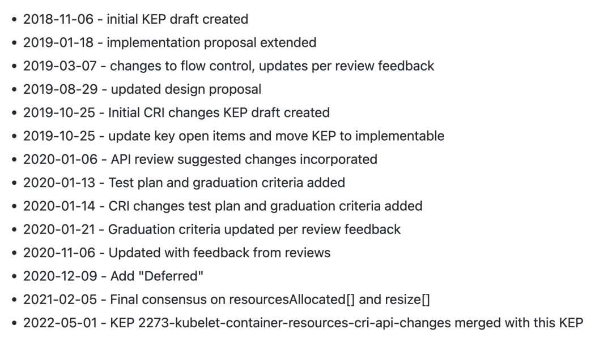
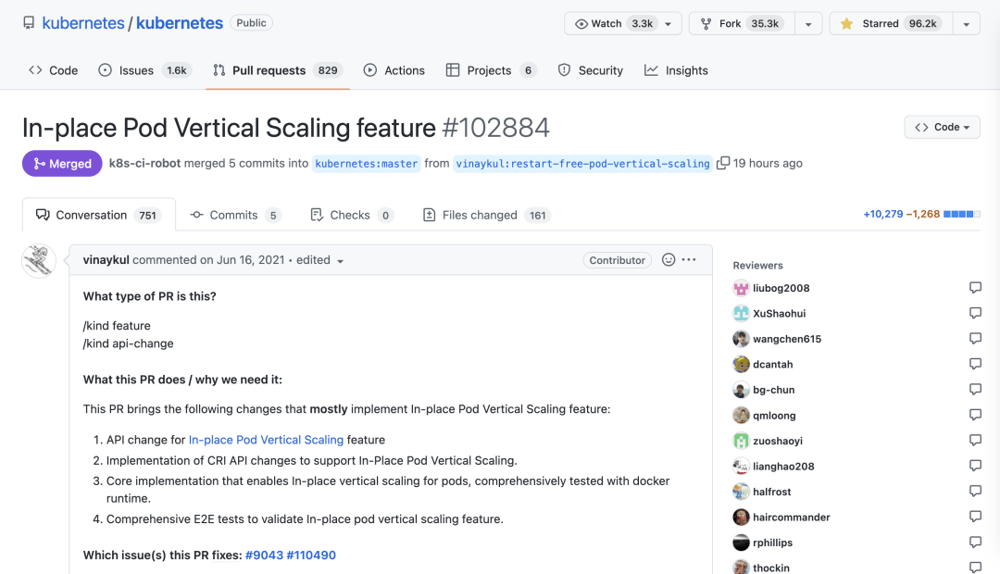

# **Pod 原地垂直伸缩**

该提案旨在允许 Pod 资源 requests 和 limits 的原地更新，而不需要重新启动 Pod 或其容器，该方案的核心思想是让 PodSpec 的 Resources 是可变的，表示所需的资源，此外 扩展 PodStatus 来反映分配给 Pod 的资源，并提供有关应用于 Pod 及其容器的实际资源信息。


此外该提案还提出了改进容器运行时接口（CRI）API，以便在运行时管理容器的 CPU 和内存资源配置，尝试扩展 **UpdateContainerResources** 这个 CRI API，使其适用于 Windows 和除 Linux 之外的其他未来的运行时。

它还需求扩展 **ContainerStatus CRI API**，以允许 Kubelet 能够发现当前配置在容器上的资源。

## 原因

由于各种原因，分配给 Pod 的容器资源可能需要变更比，这种场景有很多：

* 如 Pod 处理的负载大幅增加，而目前的资源不足了
* 又或者说负载大幅减少了，而分配的资源未被使用
* 资源配置不合理

目前，更改资源分配是需要重新创建 Pod 的，因为 PodSpec 的容器资源是不可改变的。 虽然许多无状态的工作负载被设计成可以承受这样的中断，但有些工作负载更加敏感，特别是在使用低数量的 Pod 副本时。

此外，对于有状态或批处理的工作负载，Pod 重启是一个严重的破坏行为，会导致工作负载可用性降低或运行成本提高。

允许在不重新创建 Pod 或重新启动容器的情况下改变资源，可以直接解决这个问题。此外，**原地 Pod 垂直伸缩**功能依赖于**容器运行时接口（CRI）**来更新 Pod 容器的 CPU 和/或内存的 **requests/limits**。

当前的 CRI API 有一些需要解决的缺点：

* UpdateContainerResources CRI API 需要一个参数来描述要为 Linux 容器更新的容器资源，这在未来可能无法适用于 Windows 容器或其他潜在的非 Linux 运行时。
* 没有 CRI 机制可以让 Kubelet 从容器运行时查询和发现容器上配置的 CPU 和内存限制。
* 处理 UpdateContainerResources CRI API 的运行时的预期行为没有很好地定义或记录。

### **目标**

* 主要：允许更改容器的资源请求（requests）和限制（limits），而不必重新启动容器。
* 次要：允许参与者（用户、VPA、StatefulSet、JobController）决定在无法进行原地资源调整的情况下如何进行。
* 次要：允许用户指定哪些容器可以在不重启的情况下调整资源大小。

此外，该提案对 CRI API 还有两个实现目标：

* 修改 **UpdateContainerResources** 以使其适用于 Windows 容器，以及 Linux 以外的其他运行时管理的容器。

* 提供 CRI API 机制，以查询容器运行时当前应用于容器的 CPU 和内存资源配置。

该提案的另一个目标是更好地定义和记录容器运行时在处理资源更新时的预期行为。

##  提案

PodSpec 在容器资源请求和限制方面是可变的，PodStatus 被扩展以显示分配给 Pod 和其容器的资源。

* `Pod.Spec.Containers[i].Resources` 成为一个纯粹的声明，表示 Pod 资源的期望状态。
* `Pod.Status.ContainerStatuses[i].ResourcesAllocated`（新字段，类型 v1.ResourceList）**表示分配给 Pod 及其容器的节点资源**。
* `Pod.Status.ContainerStatuses[i].Resources`（新字段，类型为 v1.ResourceRequirements）**显示 Pod 及其容器所持有的实际资源**。
* `Pod.Status.Resize`（新字段，类型为 map[string]string）解释了指定容器上的指定资源正在发生什么事情。

新的 `ResourcesAllocated` 字段表示正在进行中的大小调整操作，并由保存在节点检查点的状态驱动。

**<mark>在考虑节点上的可用空间时，调度器应该使用 `Spec.Containers[i].Resources` 和 `Status.ContainerStatuses[i].ResourcesAllocated `中较大的那个</mark>**。


### 子资源

对于 alpha 版，资源的变化将通过更新 pod 规范（spec）来实现。

对于 beta（或者可能是 alpha 的后续版本），**将定义一个新的子资源 `/resize`**，该子资源最终可以应用于其他使用了 PodTemplates 的资源，例如 Deployments、ReplicaSets、Jobs 和 StatefulSets。这将允许用户对 VPA 等控制器授予 RBAC 访问权限，而不允许对 pod specs 进行完全写入访问。这里的具体 API 待确定。

### **容器调整策略**

为了提供细粒度的用户控制，

`PodSpec.Containers` 扩展了 `ResizePolicy` - 一个支持 cpu 和 memory 作为名称的命名子对象（新对象）列表。它支持以下策略值：


* **`RestartNotRequired` - 默认值；如果可能，尝试在不重启容器的情况下调整它的大小**。
* Restart - 容器需要重新启动才能应用新的资源值（例如，Java 进程需要更改其 Xmx 标志），通过使用 `ResizePolicy`，用户可以将容器标记为安全（或不安全）的原地资源更新。 Kubelet 使用它来确定所需的操作。

注意：RestartNotRequired 并不能保证容器不会重新启动，如果不这样做就无法应用新的资源，那么运行时可能会选择停止该容器。

设置标志来单独控制 CPU 和内存是由于观察到通常 CPU 可以被添加/删除而没有什么问题，而对可用内存的更改更有可能需要重新启动。

### **调整状态**

除了上述内容之外，还将添加一个新字段 `Pod.Status.Resize[]`，该字段表面 kubelet 是否接受或拒绝了针对指定资源的建议调整操作。

每当 `Pod.Spec.Containers[i].Resources.Requests` 字段与 `Pod.Status.ContainerStatuses[i].Resources `字段不同时，这个新字段就会解释原因。


该字段可以设置为以下值之一：

* Proposed - 提议的调整大小（在 Spec...Resources 中）尚未被接受或拒绝。
* InProgress - 建议的调整大小已被接受并正在执行中。
* Deferred - 提议的调整大小在理论上是可行的（它适合在这个节点上）但现在不能；它将被重新评估。
* Infeasible - 提议的调整大小不可行并被拒绝；它不会被重新评估。
* 没有值 - 没有建议的大小调整

任何时候 `apiserver watch` 到建议的调整大小（对 Spec...Resources 字段的修改），它都会自动将此字段设置为 `Proposed`。为了使该字段未来是安全的，消费者应该假设任何未知值都与 Deferred 相同。

### **CRI 变更**

Kubelet 调用 UpdateContainerResources CRI API，该 API 目前使用 `runtimeapi.LinuxContainerResources` 参数，适用于 Docker 和 Kata，但不适用于 Windows。

将这个参数改为 `runtimeapi.ContainerResources`，它与运行时无关，并将包含特定平台的信息。这将使 `UpdateContainerResources API` 适用于 Windows，以及未来除 Linux 之外的任何其他运行时，方法是使 API 中传递的资源参数特定于目标运行时。

此外，`ContainerStatus CRI API`被扩展为持有 `runtimeapi.ContainerResources` 数据，这样它就允许 Kubelet 从运行时查询 Container 的 CPU 和内存限制配置。这就要求运行时响应当前应用于容器的 CPU 和内存资源值。

这些 CRI 的变化是一项单独的工作，并不影响本 KEP 中提出的设计。

要完成上述 CRI 更改：

下面介绍一个新的名为 ContainerResources 的 protobuf 消息对象，它封装了 LinuxContainerResources 和 WindowsContainerResources。

通过简单地向 message ContainerResources 添加新的特定于运行时的资源结构，可以轻松地为未来的运行时扩展此消息。

```
// ContainerResource 保存容器的资源配置
message ContainerResources {
    // 特定于Linux容器的资源配置
    LinuxContainerResources linux = 1;
    // 特定于Windows容器的资源配置
    WindowsContainerResources windows = 2;
}
```


`message UpdateContainerResourcesRequest` 被扩展为携带 `ContainerResources` 字段，如下所示。

* 这通过让依赖当前 `LinuxContainerResources` 的运行时继续工作，同时使更新的运行时版本能够使用 `UpdateContainerResourcesRequest.Resources.Linux` 来保持向后兼容性，
* 它开启了 `UpdateContainerResourcesRequest.Linux` 字段的 deprecation。
* 对于 Linux 运行时，Kubelet 除了 `UpdateContainerResourcesRequest.Resources.Linux `字段外填充 `UpdateContainerResourcesRequest.Linux ` 字段。

```
message UpdateContainerResourcesRequest {
    // ID of the container to update.
    string container_id = 1;
    // Resource configuration specific to Linux container.
    LinuxContainerResources linux = 2;
    // Resource configuration for the container.
    ContainerResources resources = 3;
}
```

`message ContainerStatus` 被扩展为返回 `ContainerResources`，如下所示。

这使 Kubelet 能够使用 `ContainerStatus CRI API` 查询运行时并发现当前应用于容器的资源。

```
@@ -914,6 +912,8 @@ message ContainerStatus {
     repeated Mount mounts = 14;
     // Log path of container.
     string log_path = 15;
+    // Resource configuration of the container.
+    ContainerResources resources = 16;
 }
```
 
ContainerManager CRI API 服务接口修改如下。
 
`UpdateContainerResources` 采用 `ContainerResources` 参数而不是 `LinuxContainerResources`。

```
--- a/staging/src/k8s.io/cri-api/pkg/apis/services.go
+++ b/staging/src/k8s.io/cri-api/pkg/apis/services.go
@@ -43,8 +43,10 @@ type ContainerManager interface {
        ListContainers(filter *runtimeapi.ContainerFilter) ([]*runtimeapi.Container, error)
        // ContainerStatus returns the status of the container.
        ContainerStatus(containerID string) (*runtimeapi.ContainerStatus, error)
-       // UpdateContainerResources updates the cgroup resources for the container.
-       UpdateContainerResources(containerID string, resources *runtimeapi.LinuxContainerResources) error
+       // UpdateContainerResources updates resource configuration for the container.
+       UpdateContainerResources(containerID string, resources *runtimeapi.ContainerResources) error
        // ExecSync executes a command in the container, and returns the stdout output.
        // If command exits with a non-zero exit code, an error is returned.
        ExecSync(containerID string, cmd []string, timeout time.Duration) (stdout []byte, stderr []byte, err error)
```

修改 Kubelet 代码适配上面的 CRI 变更。

### 风险

* 向后兼容：当 `Pod.Spec.Containers[i].Resources` 成为期望状态的代表时，Pod 的真实资源分配在 `Pod.Status.ContainerStatuses[i].ResourcesAllocated `中被跟踪，查询 `PodSpec` 并依赖 `PodSpec` 中的 `Resources` 来确定资源分配的应用程序将看到可能不代表实际分配的值。这一变化需要在发行说明和顶级 Kubernetes 文档中加以记录和强调。
* 降低内存大小：降低 cgroup 的内存限制可能不起作用，因为 pages 可能正在使用中，可能需要采取一些措施，如在当前使用量附近设置限制。这个问题需要进一步调查。
* 旧的客户端版本：以前版本的客户端不知道新的 `ResourcesAllocated` 和 `ResizePolicy` 字段，会把它们设置为 `nil`。为了保持兼容性，`PodResourceAllocation` 准入控制器通过将非零值旧 Pod 复制到当前 Pod 来改变这种更新
 
 
## 设计细节

### Kubelet 与 APIServer 的交互

当一个新的 Pod 被创建时，Scheduler 负责选择一个合适的 Node 来容纳这个 Pod。


对于新创建的 Pod，apiserver 将设置 `ResourcesAllocated` 字段以匹配每个容器的 `Resources.Requests`。

当 Kubelet 接纳 Pod 时，`ResourcesAllocated` 中的值用于确定是否有足够的空间接纳 Pod。 Kubelet 在接纳 Pod 时不会设置 `ResourcesAllocate`

当请求调整 Pod 大小时，Kubelet 会尝试更新分配给 Pod 及其容器的资源。 Kubelet 首先通过计算节点中所有 Pod 分配的资源总和 (`Pod.Spec.Containers[i].ResourcesAllocated`) 来检查新的所需资源是否适合节点可分配资源，除了被调整大小的 Pod。对于正在调整大小的 Pod，它将新的所需资源（即 `Spec.Containers[i].Resources.Requests`）添加到总和中

* 如果新的所需资源适合，Kubelet 通过更新 `Status...ResourcesAllocated `字段并将 `Status.Resize` 设置为 `InProgress` 来接受大小调整。然后调用 `UpdateContainerResources CRI API` 来更新容器资源限制。成功更新所有容器后，它会更新 `Status...Resources` 以反映新的资源值并取消设置 `Status.Resize`。
* 如果新的所需资源不适合，Kubelet 会将 `Status.Resize `字段更新为 Infeasible 并且不会对大小调整进行操作。
* 如果新的所需资源适合但目前正在使用中，Kubelet 会将 `Status.Resize` 字段更新为 Deferred。

除了上述内容之外，每当调整大小被接受或拒绝时，kubelet 将在 Pod 上生成事件，如果可能的话，记录在调整大小过程中的关键步骤，这将使人们知道正在取得进展。

如果有多个 Pod 需要调整大小，它们将按照 Kubelet 定义的顺序依次处理（例如按照出现的顺序）。

调度器可能会并行地将一个新的 Pod 分配给节点，因为它使用缓存的 Pod 来计算节点的可分配值。如果发生这种竞争情况，如果节点在 Pod 调整大小后没有空间，Kubelet 会通过拒绝新 Pod 来解决它。

> 注意：在 Pod 被拒绝后，调度器可以尝试在刚拒绝它的同一节点上重新调度替换 Pod。

**Kubelet 重启容错**

如果 Kubelet 在处理 Pod 大小调整的过程中重新启动，那么在重新启动时，所有 Pod 都会以其当前 `Status...ResourcesAllocated` 值被接纳，并且在添加所有现有 Pod 后处理大小调整。这可确保调整大小不会影响之前已接纳的现有 Pod。

### 调度器和 APIServer 交互

Scheduler 继续使用 Pod 的 `Spec.Containers[i].Resources.Requests` 来调度新的 Pod，并继续 watch Pod 更新，并更新其缓存。为了计算分配给 Pod 的节点资源，它必须考虑 `Status.Resize` 所描述的未决的调整。。

对于 `Status.Resize = "InProgress"` 或 `"Infeasible"` 的容器，它可以简单地使用  `Status.ContainerStatus[i].ResourcesAllocated`。

对于 `Status.Resize = "Proposed"` 的容器，它必须是悲观的，并假设调整大小将立即被接受。因此它必须使用 Pod 的 `Spec...Resources.Requests` 和 `Status...ResourcesAllocated` 值中较大的一个

### 流程控制

以下步骤表示了一个 Pod 的一系列原地调整大小操作的流程，该 Pod 的所有容器的 `ResizePolicy` 设置为 `RestartNotRequired`，这样可以针对各种边缘情况进行演示。

```
T=0: 一个新的 Pod 被创建
    - `spec.containers[0].resources.requests[cpu]` = 1
    - 所有状态都未设置

T=1: 应用 apiserver 默认值
    - `spec.containers[0].resources.requests[cpu]` = 1
    - `status.containerStatuses[0].resourcesAllocated[cpu]` = 1
    - `status.resize[cpu]` = unset

T=2: kubelet 运行 pod 并更新 API
    - `spec.containers[0].resources.requests[cpu]` = 1
    - `status.containerStatuses[0].resourcesAllocated[cpu]` = 1
    - `status.resize[cpu]` = unset
    - `status.containerStatuses[0].resources.requests[cpu]` = 1

T=3: Resize #1: cpu = 1.5 (通过 PUT 或者 PATCH 或者 /resize 调整)
    - apiserver 验证请求（例如 limits 不低于 requests，不超过 ResourceQuota 等）并接受操作
    - apiserver 设置 `resize[cpu]` 为 "Proposed"
    - `spec.containers[0].resources.requests[cpu]` = 1.5
    - `status.containerStatuses[0].resourcesAllocated[cpu]` = 1
    - `status.resize[cpu]` = "Proposed"
    - `status.containerStatuses[0].resources.requests[cpu]` = 1

T=4: Kubelet watching pod 发现大小调整 #1 并接受它
    - kubelet 发送 patch 操作 {
        `resourceVersion` = `<previous value>` # 启用冲突检测
        `status.containerStatuses[0].resourcesAllocated[cpu]` = 1.5
        `status.resize[cpu]` = "InProgress"
      }
    - `spec.containers[0].resources.requests[cpu]` = 1.5
    - `status.containerStatuses[0].resourcesAllocated[cpu]` = 1.5
    - `status.resize[cpu]` = "InProgress"
    - `status.containerStatuses[0].resources.requests[cpu]` = 1

T=5: Resize #2: cpu = 2  # 此时又来进行 Resize 操作
    - apiserver 验证请求并接受操作
    - apiserver 设置 `resize[cpu]` 为 "Proposed"
    - `spec.containers[0].resources.requests[cpu]` = 2
    - `status.containerStatuses[0].resourcesAllocated[cpu]` = 1.5
    - `status.resize[cpu]` = "Proposed"
    - `status.containerStatuses[0].resources.requests[cpu]` = 1

T=6: 容器运行时应用 cpu=1.5
    - kubelet 发送 patch 操作 {
        `resourceVersion` = `<previous value>` #  启用冲突检测
        `status.containerStatuses[0].resources.requests[cpu]` = 1.5
        `status.resize[cpu]` = unset
      }
    - apiserver操作失败，出现“冲突”错误

T=7: kubelet刷新并查看到大小调整 #2 (cpu = 2)
    - kubelet 认为这是可行的，但现在不行
    - kubelet sends patch {
        `resourceVersion` = `<updated value>` # enable conflict detection
        `status.containerStatuses[0].resources.requests[cpu]` = 1.5
        `status.resize[cpu]` = "Deferred"  # 标记为延迟
      }
    - `spec.containers[0].resources.requests[cpu]` = 2
    - `status.containerStatuses[0].resourcesAllocated[cpu]` = 1.5
    - `status.resize[cpu]` = "Deferred"
    - `status.containerStatuses[0].resources.requests[cpu]` = 1.5

T=8: Resize #3: cpu = 1.6
    - apiserver 验证请求并接受请求
    - apiserver 设置 `resize[cpu]` 为 "Proposed"
    - `spec.containers[0].resources.requests[cpu]` = 1.6
    - `status.containerStatuses[0].resourcesAllocated[cpu]` = 1.5
    - `status.resize[cpu]` = "Proposed"
    - `status.containerStatuses[0].resources.requests[cpu]` = 1.5

T=9: Kubelet 观测到 pod 第三次 resize 操作 #3 并接受它
    - kubelet sends patch {
        `resourceVersion` = `<previous value>` # enable conflict detection
        `status.containerStatuses[0].resourcesAllocated[cpu]` = 1.6
        `status.resize[cpu]` = "InProgress"  # 标记为调整中
      }
    - `spec.containers[0].resources.requests[cpu]` = 1.6
    - `status.containerStatuses[0].resourcesAllocated[cpu]` = 1.6
    - `status.resize[cpu]` = "InProgress"
    - `status.containerStatuses[0].resources.requests[cpu]` = 1.5

T=10: 容器运行时应用 cpu=1.6
    - kubelet sends patch {
        `resourceVersion` = `<previous value>` # enable conflict detection
        `status.containerStatuses[0].resources.requests[cpu]` = 1.6
        `status.resize[cpu]` = unset
      }
    - `spec.containers[0].resources.requests[cpu]` = 1.6
    - `status.containerStatuses[0].resourcesAllocated[cpu]` = 1.6
    - `status.resize[cpu]` = unset
    - `status.containerStatuses[0].resources.requests[cpu]` = 1.6

T=11: Resize #4: cpu = 100
    - apiserver 验证请求和接受操作
    - apiserver 设置 `resize[cpu]` 为 "Proposed"
    - `spec.containers[0].resources.requests[cpu]` = 100
    - `status.containerStatuses[0].resourcesAllocated[cpu]` = 1.6
    - `status.resize[cpu]` = "Proposed"
    - `status.containerStatuses[0].resources.requests[cpu]` = 1.6

T=12: Kubelet 观测到pod第四次调整 resize #4
    - 这个节点没有 100 CPUs, 所以 kubelet 不接受
    - kubelet sends patch {
        `resourceVersion` = `<previous value>` # enable conflict detection
        `status.resize[cpu]` = "Infeasible"  # 标记为拒绝
      }
    - `spec.containers[0].resources.requests[cpu]` = 100
    - `status.containerStatuses[0].resourcesAllocated[cpu]` = 1.6
    - `status.resize[cpu]` = "Infeasible"
    - `status.containerStatuses[0].resources.requests[cpu]` = 1.6
```

**容器资源限制更新顺序**

当一个 Pod 中的多个容器请求原地调整大小时，Kubelet 通过以下方式更新 Pod 及其容器的资源限制：

* 如果资源调整导致资源类型（CPU 或内存）净增加，Kubelet 首先更新该资源类型的 Pod 级 cgroup 限制，然后更新 Container 资源限制。
* 如果资源调整导致资源类型净减少，Kubelet 首先更新 Container 资源限制，然后更新 Pod 级别的 cgroup 限制。
* 如果资源更新导致资源类型没有净变化，则仅更新容器资源限制。

**容器资源限制更新失败处理**

如果 Pod 中的多个容器正在被更新，并且任何容器的 UpdateContainerResources CRI API 都失败，Kubelet 将回退并在稍后进行重试。 Kubelet 不会尝试更新在失败容器之后排队等待更新的容器的限制。这确保容器限制的总和在任何时候都不会超过 Pod 级别的 cgroup 限制。成功更新所有容器限制后，Kubelet 会更新 Pod 的 `Status.ContainerStatuses[i].Resources` 以匹配所需的限制值。

**CRI 变化流程**

下图是 Kubelet 使用 UpdateContainerResources 和 ContainerStatus CRI APIs 来设置新的容器资源限制，并在用户改变 Pod Spec 中的所需资源时更新 Pod 状态的概述。

```

   +-----------+                   +-----------+                  +-----------+
   |           |                   |           |                  |           |
   | apiserver |                   |  kubelet  |                  |  runtime  |
   |           |                   |           |                  |           |
   +-----+-----+                   +-----+-----+                  +-----+-----+
         |                               |                              |
         |       watch (pod update)      |                              |
         |------------------------------>|                              |
         |     [Containers.Resources]    |                              |
         |                               |                              |
         |                            (admit)                           |
         |                               |                              |
         |                               |  UpdateContainerResources()  |
         |                               |----------------------------->|
         |                               |                         (set limits)
         |                               |<- - - - - - - - - - - - - - -|
         |                               |                              |
         |                               |      ContainerStatus()       |
         |                               |----------------------------->|
         |                               |                              |
         |                               |     [ContainerResources]     |
         |                               |<- - - - - - - - - - - - - - -|
         |                               |                              |
         |      update (pod status)      |                              |
         |<------------------------------|                              |
         | [ContainerStatuses.Resources] |                              |
         |                               |                              |
```

* Kubelet 调用 `ContainerManager` 接口中的 `UpdateContainerResources() CRI API`，通过在 API 的 ContainerResources 参数中指定这些值来为容器配置新的 CPU 和内存限制。
	* Kubelet 在调用此 CRI API 时，Kubelet 会根据目标运行时平台来设置 ContainerResources 参数。
* Kubelet 在 ContainerManager 接口中调用 `ContainerStatus() CRI API` 以获取应用于 Container 的 CPU 和内存限制。
	* 它使用 `ContainerStatus.Resources` 中返回的值来更新 Pod 状态中该容器的 `ContainerStatuses[i].Resources.Limits`。

**注意事项**

* 如果一个节点的 CPU Manager 策略被设置为 "static"，则仅允许 CPU 调整大小的整数值。如果在 CPU Manager 策略为 "static" 的节点上请求非整数的 CPU 调整，该调整将被拒绝，并在 Events 中记录一个错误信息。
* 为了避免竞争状况，在计算 Pod 使用的资源时，所有组件将使用 Pod 的 `Status.ContainerStatuses[i].ResourcesAllocated`。
* 如果在 Pod 被调整大小时有额外的调整请求到达，这些请求将在正在进行的调整完成后处理。而调整大小是朝着最新的期望状态驱动的。
* 如果应用程序一直占用页面，降低内存限制可能并不总是会很快就生效。Kubelet 将使用一个控制循环来设置接近使用的内存限制，以便强制回收，并且只有在限制达到预期值时才更新 Pod 的 `Status.ContainerStatuses[i].Resources`。
* Pod Overhead 的影响，Kubelet 将 Pod Overhead 添加到调整大小的请求中，以确定是否可以在原地调整大小。
	
## 实现

其实该 KEP 草案第一次创建是在 2018 年了，到现在接近 5 年了。



该 KEP 对应的 PR # In-place Pod Vertical Scaling feature #102884(https://github.com/kubernetes/kubernetes/pull/102884) 第一次也是2021年，到现在也两年左右时间了，这不得不佩服 Kubernetes 社区的严谨，毕竟该 PR 改动较大，不过幸运的时该 PR 已于昨天合并了，真是不容易，总共涉及160多个文件变更，虽然很大一部分是用于测试的代码。



下面我们来看下要怎么使用这个新的特性。

现在有一个如下所示的测试 Pod：

```
# 2pod.yaml 
apiVersion: v1
kind: Pod
metadata:
  name: 2pod
spec:
  containers:
  - name: stress
    image: skiibum/ubuntu-stress:18.10
    resources:
      limits:
        cpu: "500m"
        memory: "500Mi"
      requests:
        cpu: "500m"
        memory: "500Mi"
```

直接创建该 Pod 即可：

```
$ kubectl apply -f 2pod.yaml
```

创建后我们查看下该资源清单的详细数据：

```
$ kubectl get po 2pod -oyaml 
apiVersion: v1
kind: Pod
metadata:
  name: 2pod
  namespace: default
spec:
  containers:
  - image: skiibum/ubuntu-stress:18.10
    name: stress
    resizePolicy:
    - policy: RestartNotRequired  # 默认值：如果可能，尝试在不重启容器的情况下调整它的大小。
      resourceName: cpu
    - policy: RestartNotRequired
      resourceName: memory
    resources:
      limits:
        cpu: 500m
        memory: 500Mi
      requests:
        cpu: 500m
        memory: 500Mi
...
...
status:
  conditions:
...
  containerStatuses:
  - containerID: docker://015b2d8605c732329129a8d61894ef5438b5a8ed09da0b5e56dad82d3b57a789
    image: skiibum/ubuntu-stress:18.10
    name: stress
    ready: true
    resources:
      limits:
        cpu: 500m
        memory: 500Mi
      requests:
        cpu: 500m
        memory: 500Mi
    resourcesAllocated:
      cpu: 500m
      memory: 500Mi
    restartCount: 0
    started: true
...
  qosClass: Guaranteed
  startTime: "2021-06-27T02:06:56Z"
```

可以看到最大的一个变化就是现在的 Pod 资源清单中新增了一个 resizePolicy 属性，下面自动配置的 cpu 和 memory 两种资源的 resize 策略为 RestartNotRequired，这也是默认值，表示如果可能，尝试在不重启容器的情况下调整它的大小。

另外在 Status 下面出现了一个新的自动 ResourcesAllocated，表示分配给 Pod 及其容器的节点资源。

现在修改该 Pod 的容器资源大小：

```
$ kubectl patch pod 2pod --patch '{"spec":{"containers":[{"name":"stress", "resources":{"requests":{"cpu":"650m"}, "limits":{"cpu":"650m"}}}]}}'
pod/2pod patched
```

修改后再次查看详细的 Pod 资源清单：

```
$ kubectl get po 2pod -oyaml 
apiVersion: v1
kind: Pod
metadata:
  name: 2pod
  namespace: default
spec:
  containers:
  - image: skiibum/ubuntu-stress:18.10
    name: stress
    resizePolicy:
    - policy: RestartNotRequired
      resourceName: cpu
    - policy: RestartNotRequired
      resourceName: memory
    resources:
      limits:
        cpu: 650m
        memory: 500Mi
      requests:
        cpu: 650m
        memory: 500Mi
...
...
status:
  conditions:
...
  containerStatuses:
  - containerID: docker://015b2d8605c732329129a8d61894ef5438b5a8ed09da0b5e56dad82d3b57a789
    image: skiibum/ubuntu-stress:18.10
    name: stress
    ready: true
    resources:
      limits:
        cpu: 500m
        memory: 500Mi
      requests:
        cpu: 500m
        memory: 500Mi
    resourcesAllocated:
      cpu: 650m
      memory: 500Mi
    restartCount: 0
    started: true
...
  qosClass: Guaranteed
  resize: InProgress
  startTime: "2021-06-27T02:06:56Z"
```

我们可以看到原本 PodSpec 下面的 resources 资源大小已经变化了，重点还是在 Status 中，可以发现多了一个 `resize: InProgress` 的字段，表示接受调整并正在执行资源大小调整。

如果现在再次调整资源大小：

```
$ kubectl patch pod 2pod --patch '{"spec":{"containers":[{"name":"stress", "resources":{"requests":{"cpu":"3950m"}, "limits":{"cpu":"3950m"}}}]}}'
pod/2pod patched
```

调整后查看 Pod 详细数据：

```
$ kubectl get po 2pod -oyaml 
apiVersion: v1
kind: Pod
metadata:
  name: 2pod
  namespace: default
spec:
  containers:
  - image: skiibum/ubuntu-stress:18.10
    name: stress
    resizePolicy:
    - policy: RestartNotRequired
      resourceName: cpu
    - policy: RestartNotRequired
      resourceName: memory
    resources:
      limits:
        cpu: 3950m
        memory: 500Mi
      requests:
        cpu: 3950m
        memory: 500Mi
...
...
status:
  conditions:
...
  containerStatuses:
  - containerID: docker://015b2d8605c732329129a8d61894ef5438b5a8ed09da0b5e56dad82d3b57a789
    image: skiibum/ubuntu-stress:18.10
    name: stress
    ready: true
    resources:
      limits:
        cpu: 500m
        memory: 500Mi
      requests:
        cpu: 500m
        memory: 500Mi
    resourcesAllocated:
      cpu: 650m
      memory: 500Mi
    restartCount: 0
    started: true
...
  qosClass: Guaranteed
  resize: Deferred
  startTime: "2021-06-27T02:06:56Z"
```

此时 Status 中的 resize 变成了 `Deferred` 状态，表示提议的调整大小在理论上是可行的（它适合在这个节点上）但现在还不能，它将被重新评估，注意 resourcesAllocated 还是上一次变更成功后的大小。

如果再次调整资源到节点不能满足的情况下：

```
$ kubectl patch pod 2pod --patch '{"spec":{"containers":[{"name":"stress", "resources":{"requests":{"cpu":"4650m"}, "limits":{"cpu":"4650m"}}}]}}'
pod/2pod patched
$ kubectl get po 2pod -oyaml 
apiVersion: v1
kind: Pod
metadata:
  name: 2pod
  namespace: default
spec:
  containers:
  - image: skiibum/ubuntu-stress:18.10
    name: stress
    resizePolicy:
    - policy: RestartNotRequired
      resourceName: cpu
    - policy: RestartNotRequired
      resourceName: memory
    resources:
      limits:
        cpu: 4650m
        memory: 500Mi
      requests:
        cpu: 4650m
        memory: 500Mi
...
...
status:
  conditions:
...
  containerStatuses:
  - containerID: docker://015b2d8605c732329129a8d61894ef5438b5a8ed09da0b5e56dad82d3b57a789
    image: skiibum/ubuntu-stress:18.10
...
    name: stress
    ready: true
    resources:
      limits:
        cpu: 500m
        memory: 500Mi
      requests:
        cpu: 500m
        memory: 500Mi
    resourcesAllocated:
      cpu: 650m
      memory: 500Mi
    restartCount: 0
...
  qosClass: Guaranteed
  resize: Infeasible
  startTime: "2021-06-27T02:06:56Z"
```

现在 resize 状态变成了 Infeasible，表示不能满足资源条件，拒绝调整。

以后当我们的 Pod 资源不足的时候，可以放心大胆去调整资源了，不用担心容器被重启了。

