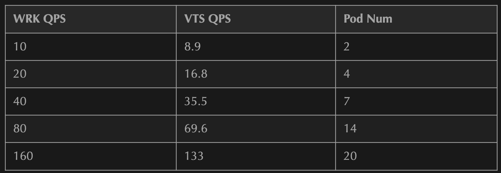
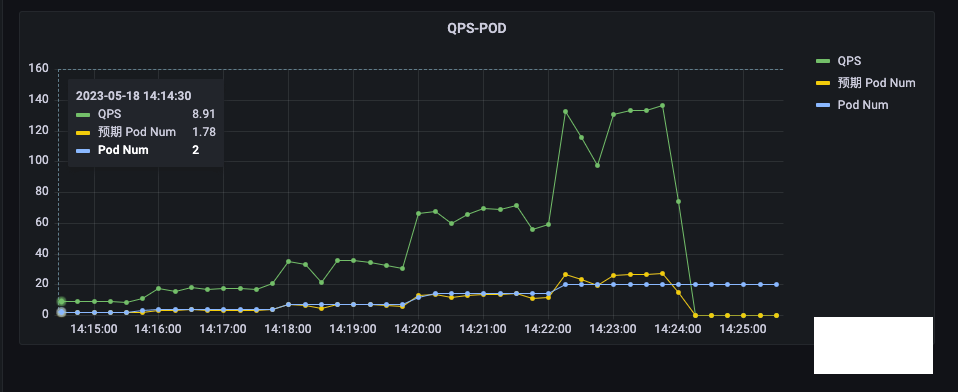
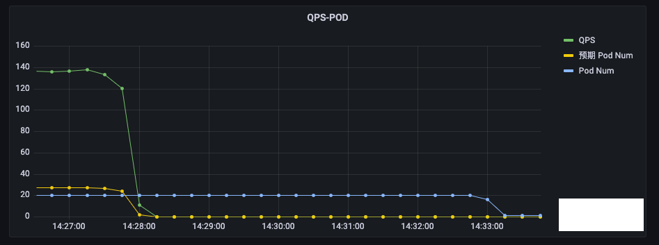
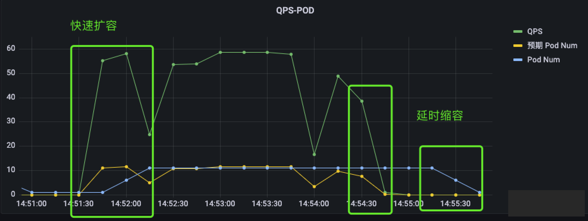
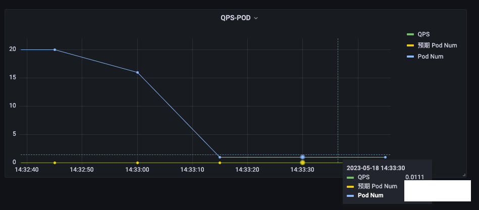

# **使用 KEDA 自动伸缩 Kubernetes 应用**

## 1. HPA VS KEDA

HPA 也实现了:

* 自定义指标的弹性
* Scale to Zero

这些与 KEDA 相比较，并不算劣势了。

**真正的差别在于 HPA 只能利用监控数据进行伸缩，而 KEDA 可以利用更多数据来源进行伸缩，比如队列消息、数据库、Redis 等**，当然也包括监控数据。


从 Kubernetes-based Event Driven Autoscaler (KEDA) 项目的名字就可以看出，KEDA 是一个基于事件的自动伸缩器，它强调的是事件驱动，而不是监控驱动。

另外，KEDA 与 HPA 也并不是对立的，在使用 KEDA 时，也会借助 HPA 的能力，创建 HPA 对象。

## 2. 部署 KEDA

```
KEDA Version	 Supported Kubernetes version
2.10				v1.24 - v1.26
2.8				v1.17 - v1.25
```

由于 KEDA 社区的镜像托管在 ghcr.io，因此转存了一份到 docker.io，方便在国内使用。

测试的集群版本是 v1.21.4，安装  KEDA 2.8 。

```
kubectl apply -f https://raw.githubusercontent.com/shaowenchen/kubernetes-components/master/keda/v2.8.2-keda.yaml
```

查看 Pod 是否正常

```

kubectl -n keda get pod                               

NAME                                     READY   STATUS    RESTARTS   AGE
keda-metrics-apiserver-7d8df95dd-nqfbg   1/1     Running   0          20d
keda-operator-59878677c4-2rqjm           1/1     Running   0          20d
```

keda-operator 负责处理 KEDA 内置对象、HPA 对象；

keda-metrics-apiserver 提供给 HPA 的 external 类型指标，借助 HPA 实现弹性。

## 3. 配置 ScaledObject

* 创建应用

```
apiVersion: apps/v1
kind: Deployment
metadata:
  name: nginx-deployment
  namespace: default
  labels:
    app: nginx
spec:
  replicas: 5
  selector:
    matchLabels:
      app: nginx
  template:
    metadata:
      labels:
        app: nginx
    spec:
      containers:
        - name: nginx-vts
          image: shaowenchen/demo-nginx-vts:latest
          ports:
            - containerPort: 80
          imagePullPolicy: Always
        - name: nginx-vts-exporter
          image: sophos/nginx-vts-exporter
          ports:
            - containerPort: 9913
```

* 创建 Service，并暴露在 30000 端口上

在 30001 端口上暴露 metrics，是为了方便测试，如果不需要，可以不暴露。

```
apiVersion: v1
kind: Service
metadata:
  labels:
    app: nginx
  name: nginx-svc
  namespace: default
  annotations:
    prometheus.io/scrape: "true"
    prometheus.io/path: "/metrics"
    prometheus.io/port: "9913"
spec:
  ports:
  - name: nginx
    nodePort: 30000
    port: 80
    protocol: TCP
    targetPort: 80
  - name: metrics
    nodePort: 30001
    port: 9913
    protocol: TCP
    targetPort: 9913
  selector:
    app: nginx
  type: NodePort
```

* 创建 ScaledObject 对象

ScaledObject 对象是 KEDA 的核心对象，它定义了伸缩的目标对象、触发器、伸缩策略等。ScaledJob 与 ScaledObject 类似，只是它的目标对象是 Job。

```
apiVersion: keda.sh/v1alpha1
kind: ScaledObject
metadata:
  name: nginx-deployment-scaledobject
  namespace: default
spec:
  scaleTargetRef:
    name: nginx-deployment
  pollingInterval: 15
  cooldownPeriod: 30
  minReplicaCount: 0
  maxReplicaCount: 20
  triggers:
  - type: prometheus
    metadata:
      serverAddress: http://prometheus-server.monitor.svc:80
      metricName: nginx_server_requests
      threshold: '5'
      query: sum (irate(nginx_server_requests{code="total", host="*"}[1m]))/60
```

其中:

* `scaleTargetRef` 指定了伸缩的目标对象
* `pollingInterval` 指定了触发器的轮询间隔，Prometheus 指标采样间隔为 15s，因此这里设置为 `15s`
* `cooldownPeriod` 指的是副本从 1 变为 0 的冷却时间，KEDA 并不仅仅针对常驻服务，Scale to Zero 也是 KEDA 的特性之一
* `minReplicaCount` 最小副本数
* `maxReplicaCount `最大副本数

triggers 指定了触发伸缩的数据来源，这里使用的是 Prometheus 触发器，它的参数有:

* `serverAddress: Prometheus` 服务地址
* `metricName`: 指标名称
* `threshold`: 阈值
* `query:` Prometheus 查询语句

`Pod 的副本数 = 当前 Pod 副本数 * （query/threshold）`。

这里的意思是，按照每个 Pod 处理 5 QPS，设置 Pod 的数量。

## 4. 测试应用伸缩能力

### 4.1 准备监控数据

监控先行。先看得到监控数据，再进行压测。

* QPS : 从下面监控值可以看到，QPS 的统计会有一定的误差。

```
sum (irate(nginx_server_requests{code="total", host="*"}[1m]))/60
``` 

* Pod Num

```
max (sum by(instance)(kube_deployment_status_replicas{deployment=~"nginx-deployment"}))
```

### 4.2 压测应用

这里使用的是 wrk 工具对应用进行压测。测试命令如下:

```
wrk -t1 -c10 -d120s http://0.0.0.0:30000/
```

这里的 `-t1 -c10 -d120s` 参数的意思是，使用 1 个线程，10 个连接，持续 120s。

以下为测试数据:




`VTS QPS / Pod Num` 约等于 5，与预期一致。

由于设置了 `maxReplicaCount ` 为 20，`VTS QPS` 达到 133 时，Pod 副本数为 20 时达到上线



缩容 Pod，但 Pod 副本数没有降为 0



这里有几个问题:

* 为什么缩容 Pod 速度很慢
* 为什么 Pod 副本数没有降为 0

请看下面的优化。

## 5. 优化配置

### 5.1 快速扩容、延时缩容

在指标达到阈值时，我们希望能够快速加副本，而不用长时间等待。

在指标低于阈值时，我们希望能够延缓缩容副本，避免因指标抖动，导致副本同步抖动。

```
apiVersion: keda.sh/v1alpha1
kind: ScaledObject
metadata:
  name: nginx-deployment-scaledobject
  namespace: default
spec:
  scaleTargetRef:
    name: nginx-deployment
  pollingInterval: 15
  cooldownPeriod: 30
  minReplicaCount: 0
  maxReplicaCount: 20
  advanced:
    horizontalPodAutoscalerConfig:
      behavior:
        scaleUp:
          stabilizationWindowSeconds: 15
          policies:
          - type: Pods
            value: 5
            periodSeconds: 15
        scaleDown:
          stabilizationWindowSeconds: 60
          policies:
          - type: Pods
            value: 5
            periodSeconds: 15

  triggers:
  - type: prometheus
    metadata:
      serverAddress: http://prometheus-server.monitor.svc:80
      metricName: nginx_server_requests
      threshold: '5'
      query: sum (irate(nginx_server_requests{code="total", host="*"}[1m]))/60
```

在 advanced 参数中有:

* `stabilizationWindowSeconds`: 指标稳定时间，也就是指标达到阈值后，需要持续多久才会触发伸缩
* `scaleUp:` 扩容策略
* `scaleDown`: 缩容策略
* `policies`: 策略列表，`periodSeconds` 指的是每隔多久执行一次策略，value 指的是每次执行策略时，增加或减少的 Pod 数量

**这里的意思是: 扩容时，持续 15s 就会触发伸缩，每隔 15s 扩容 5 个 Pod；缩容时，持续 60s 才会触发伸缩，每隔 15s 缩容 5 个 Pod。**

最终的效果如下:



扩容时，指标与 Pod 数量同步增加；缩容时，指标先下降，然后 Pod 数量才下降。

### 5.2 Scale to Zero

虽然我们设置了 minReplicaCount 为 0，但从监控数据看到 Pod 副本数并没有降为 0，

这其实就涉及到指标可能的误差。监控系统的可用性优先级是高于一致性、准确性的，是容忍一定的误差的。

如下图，我们可以看到在没有请求时，指标也不是 0，才导致 Pod 副本数没有降为 0。



解决办法很简单，就是在指标中减去误差值即可。

```
sum (irate(nginx_server_requests{code="total", host="*"}[1m]))/60 - 0.1
```

指标查询的结果为 0 或者负数时，KEDA 会将 Pod 副本数设置为 minReplicaCount 值。

## 6. 总结

最近在生产环境，有一批应用需要根据自定义的指标对 Kubernetes 应用的副本数进行伸缩，因此学习了一下 KEDA 。本文主要是记录学习和测试验证 KEDA 的过程。主要内容如下:

* KEDA 与 HPA 比较，支持更多的触发来源
* 通过 Advanced 参数，可以对伸缩策略进行优化，实现快速扩容、延时缩容
* Scale to Zero 时，需要考虑指标的误差

另外，KEDA 会自动管理 Deployment 副本数，人工设置的值会被覆盖。并且 Deployment 的 resourceVersion 值也会发生变化。如果在伸缩期间，修改 Deployment 镜像、环境变量等参数，可能会因为 resourceVersion 不一致，导致变更失败。