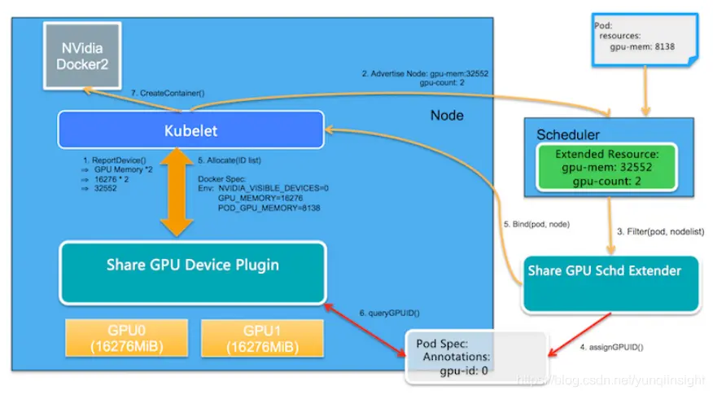
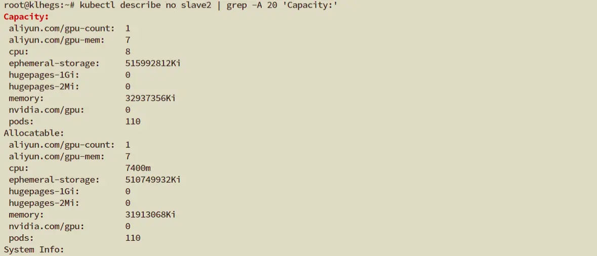
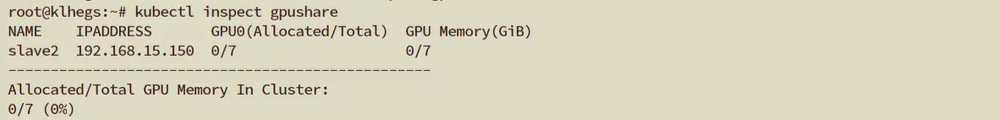
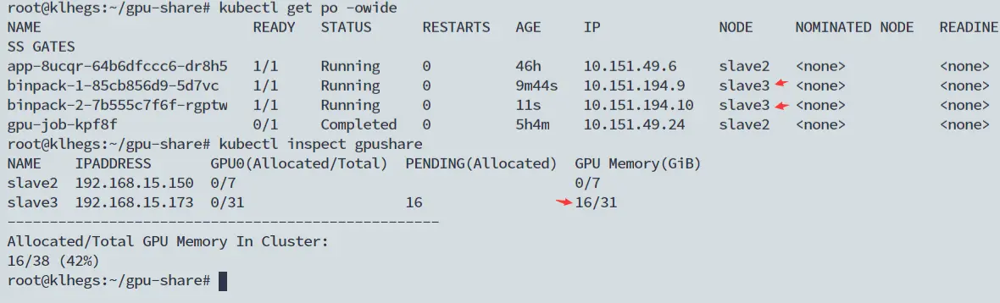
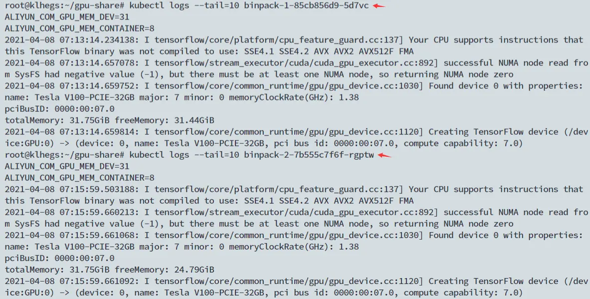
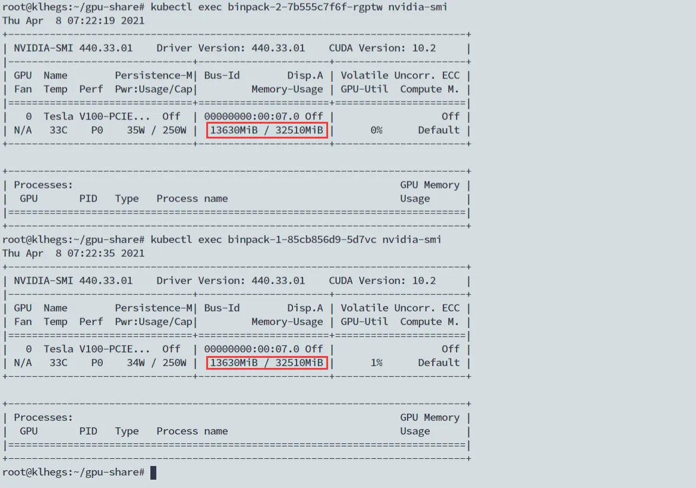

# 在Kubernetes集群中实现共享GPU调度(GPUshare)

Kubernetes 集群中，GPU资源作为一种外部资源(extended resources)，部署Nvidia官方提供的插件(k8s-device-plugin)后，GPU资源在节点上是以个数暴露给kubernetes集群来进行调度的，也就是说如果有两个后端应用pod需要使用到GPU资源，但集群节点上只有一张GPU物理卡的情况下，会导致两个后端应用容器中仅有一个可以正常运行，另一个pod则会处于pending状态。

* [extended resources](https://kubernetes.io/docs/concepts/configuration/manage-resources-containers/#extended-resources)
* [k8s-device-plugin](https://github.com/NVIDIA/k8s-device-plugin)


想要在Kubenentes集群中实现GPUshare，可以采用阿里云于2019年开源的 [gpushare-scheduler-extender](https://github.com/AliyunContainerService/gpushare-scheduler-extender)


The Nvidia GPU sharing device plugin for Kubernetes is a Daemonset that allows you to automatically:

* Expose the GPU Memory and GPU count on the node of your cluster // 将节点上的GPU资源以显存及显卡数的形式暴露给k8s
* Run GPU sharing-enabled containers in your Kubernetes cluster. //集群中的容器可以通过声明显存来共享GPU资源

本文用来记录部署gpushare-device-plugin 插件的过程及遇到的问题。

## **目标**

将节点上的GPU资源以GPU显存或者GPU个数的形式暴露给Kubernetes，实现多容器共享GPU资源。

### **设计原则**

一个outoftree的共享GPU调度方案，该方案依赖于Kubernetes的现有工作机制:

* Extended Resource定义
* Scheduler Extender机制
* Device Plugin机制



## 部署

[官方安装向导](https://github.com/AliyunContainerService/gpushare-scheduler-extender/blob/master/docs/install.md)

### 0. 准备 GPU Node

安装 `gpushare-device-plugin` 之前，确保在GPU节点上已经安装`Nvidia-Driver`以及`Nvidia-Docker2`，同时已将`docker`的默认运行时设置为`nvidia`，配置文件如下：`/etc/docker/daemon.json`

```
{
    "default-runtime": "nvidia",
    "runtimes": {
        "nvidia": {
            "path": "/usr/bin/nvidia-container-runtime",
            "runtimeArgs": []
        }
    }
}
```

**1. 部署 GPU share scheduler extender**

```
cd /etc/kubernetes/
curl -O https://raw.githubusercontent.com/AliyunContainerService/gpushare-scheduler-extender/master/config/scheduler-policy-config.json
cd /tmp/
curl -O https://raw.githubusercontent.com/AliyunContainerService/gpushare-scheduler-extender/master/config/gpushare-schd-extender.yaml
kubectl create -f gpushare-schd-extender.yaml
```

**2. 修改 scheduler 配置文件**

将 `/etc/kubernetes/scheduler-policy-config.json` 加到 `scheduler` 配置文件中(`/etc/kubernetes/manifests/kube-scheduler.yaml`).

这是一个成功添加配置的例子 `kube-scheduler.yaml`

> 注意: 如果当前 Kubernetes 的默认 scheduler 是以静态pod的方式部署的, 不要在这个路径下编辑配置文件 /etc/kubernetes/manifest. 应该在该路径外编辑 yaml 文件后将其复制到 '/etc/kubernetes/manifest/' 路径下, 然后Kubernetes 会自动更新 scheduler.

### **2.1 在 scheduler 参数中加入 `Policy config file` 参数**

```
- --policy-config-file=/etc/kubernetes/scheduler-policy-config.json
```

### **2.2 在 Pod Spec 中加入 volume mount**

```
- mountPath: /etc/kubernetes/scheduler-policy-config.json
  name: scheduler-policy-config
  readOnly: true
```

```
- hostPath:
      path: /etc/kubernetes/scheduler-policy-config.json
      type: FileOrCreate
  name: scheduler-policy-config
```

## **3. 部署Device Plugin**

```
wget https://raw.githubusercontent.com/AliyunContainerService/gpushare-device-plugin/master/device-plugin-rbac.yaml
kubectl create -f device-plugin-rbac.yaml
wget https://raw.githubusercontent.com/AliyunContainerService/gpushare-device-plugin/master/device-plugin-ds.yaml
kubectl create -f device-plugin-ds.yaml
```

可以通过修改DaemonSet中的参数来指定显存的单位是MiB/GiB

```
apiVersion: apps/v1
kind: DaemonSet
metadata:
  name: gpushare-device-plugin-ds
  namespace: kube-system
spec:
  selector:
    matchLabels:
        component: gpushare-device-plugin
        app: gpushare
        name: gpushare-device-plugin-ds
  template:
    metadata:
      annotations:
        scheduler.alpha.kubernetes.io/critical-pod: ""
      labels:
        component: gpushare-device-plugin
        app: gpushare
        name: gpushare-device-plugin-ds
    spec:
      serviceAccount: gpushare-device-plugin
      hostNetwork: true
      nodeSelector:
        gpushare: "true"
      containers:
      - image: registry.cn-hangzhou.aliyuncs.com/acs/k8s-gpushare-plugin:v2-1.11-aff8a23
        name: gpushare
        # Make this pod as Guaranteed pod which will never be evicted because of node's resource consumption.
        command:
          - gpushare-device-plugin-v2
          - -logtostderr
          - --v=5
          - --memory-unit=GiB//
        resources:
          limits:
            memory: "300Mi"
            cpu: "1"
          requests:
            memory: "300Mi"
            cpu: "1"
        env:
        - name: KUBECONFIG
          value: /etc/kubernetes/kubelet.conf
        - name: NODE_NAME
          valueFrom:
            fieldRef:
              fieldPath: spec.nodeName
        securityContext:
          allowPrivilegeEscalation: false
          capabilities:
            drop: ["ALL"]
        volumeMounts:
          - name: device-plugin
            mountPath: /var/lib/kubelet/device-plugins
      volumes:
        - name: device-plugin
          hostPath:
            path: /var/lib/kubelet/device-plugins
```

> 注意: 请移除 `GPU device plugin`, 例如 [nvidia-device-plugin](https://github.com/NVIDIA/k8s-device-plugin/blob/v1.11/nvidia-device-plugin.yml), 

可以通过命令 `kubectl delete ds -n kube-system nvidia-device-plugin-daemonset` 来删除.

## **4. 给 gpushare 节点打标签**

```
kubectl label node <target_node> gpushare=true
```


## 5. 安装Kubectl 扩展

### 5.1 需要已安装 kubectl 1.12+

在linux下安装 `kubectl`

```
curl -LO https://storage.googleapis.com/kubernetes-release/release/v1.12.1/bin/linux/amd64/kubectl
chmod +x ./kubectl
sudo mv ./kubectl /usr/bin/kubectl
```

### **5.2 下载并安装 kubectl 扩展功能**

```
cd /usr/bin/
wget https://github.com/AliyunContainerService/gpushare-device-plugin/releases/download/v0.3.0/kubectl-inspect-gpushare
chmod u+x /usr/bin/kubectl-inspect-gpushare
```

### **测试**

**1.部署后查看插件状态**

```
kubectl get po  -n kube-system | grep gpushare

gpushare-device-plugin-ds-ghzqf        1/1 Running 0 22h
gpushare-schd-extender-ff8d87c69-lxq7r 1/1 Running 0 3h40m
```

**2. 查看节点状态**



**3. 通过kubectl扩展功能查看gpushare**



## 4. 官例测试

```
apiVersion: apps/v1
kind: Deployment
metadata:
  name: binpack-1
  labels:
    app: binpack-1
spec:
  replicas: 1
  selector: # define how the deployment finds the pods it mangages
    matchLabels:
      app: binpack-1
  template: # define the pods specifications
    metadata:
      labels:
        app: binpack-1
    spec:
      containers:
      - name: binpack-1
        image: cheyang/gpu-player:v2
        env:
        - name: NVIDIA_VISIBLE_DEVICES
          value: "all"
        resources:
          limits:
            # GiB
            aliyun.com/gpu-mem: 8
```

**部署结果**

可以看到两个binpack的pod都已成功运行了，通过kubectl可以查看到被使用了16G的显存。



两个pod中的日志如下。



**进入pod，执行nvidia-smi，可以发现没有实现显存隔离。**



### **ISSIUES**

若指定

```
aliyun.com/gpu-mem：stderr: nvidia-container-cli: device error: unknown device id: no-gpu-has-**MiB-to-run
```

可以尝试一下在container中添加env，如下：

```
containers:
    - name: cuda
      image: nvidia/cuda:latest
      env: //
        - name: NVIDIA_VISIBLE_DEVICES 
          value: "all"
      resources:
        limits:
          # GiB
          aliyun.com/gpu-mem: 1
```

**注意事项**

* 按显存(GPU Memory)和按卡(GPU count)调度的方式可以在集群内并存，但是同一个节点内是互斥的。
* 不支持共享GPU显存资源的隔离，需要应用在代码中配置该任务可使用的GPU显存大小。