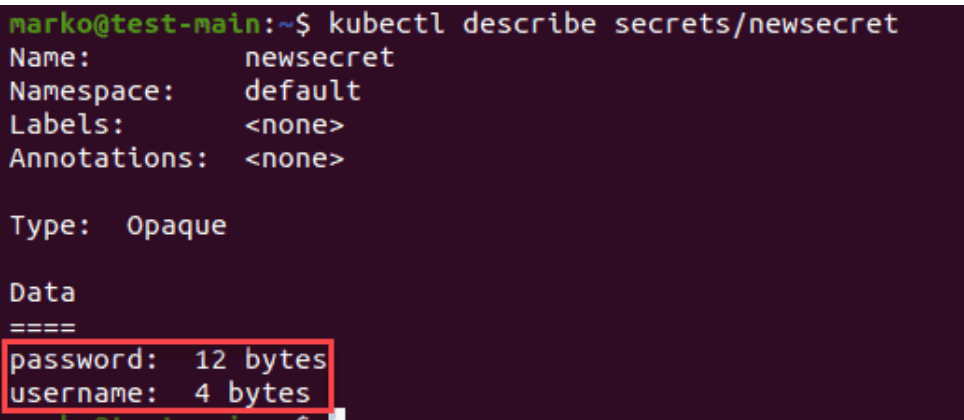
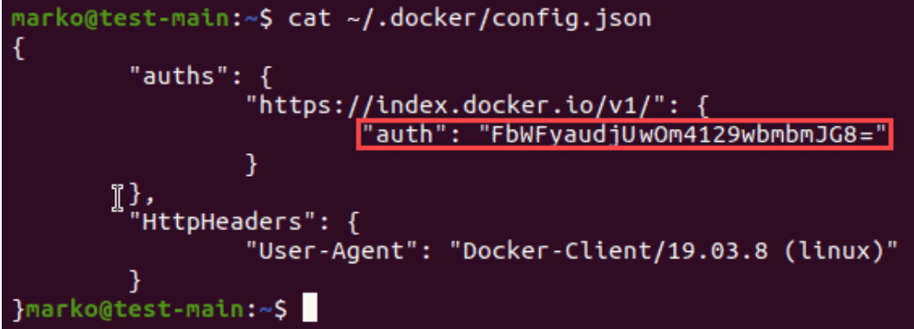
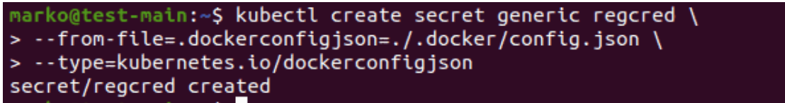
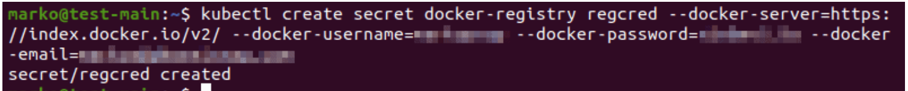

# **Kubernetes Secrets：如何创建、使用和访问Secrets？ 2023**

## Kubernetes Secrets用法教程介绍

大多数通过Kubernetes部署的应用程序需要访问位于外部的数据库、服务和其他资源。管理访问这些资源所需的登录信息的最简单方法是使用 Kubernetes Secrets。Secrets 有助于在集群中组织和分发敏感信息。

* 先决条件
* 一个 Kubernetes 集群（出于测试目的，你可以使用minikube创建它）
* Kubernetes  kubectl命令行工具

### 什么是 Kubernetes 的Secrets？

Kubernetes Secret 是一个存储敏感数据（例如用户名、密码、令牌和密钥）的对象。Secrets由系统在应用程序安装期间创建，或者由用户在需要存储敏感信息并将其提供给 Pod 时创建。

如果密码、令牌或密钥只是 pod 定义或容器映像的一部分，它们可能会在 Kubernetes 操作期间意外暴露。因此，Secrets最重要的功能是防止存储在其中的信息意外暴露，同时在用户需要的任何地方都可以使用。

注意： Secrets 并不是管理 Kubernetes 中敏感信息的唯一方法。通过使用系统的声明性，可以轻松集成第三方信息管理解决方案。

## Kubernetes Secrets类型

Kubernetes 具有两类Secrets：

* **Opaque**: **这是默认的Secrets类型。配置文件中不包含type语句的secret都被认为是这种类型的。不透明的Secrets旨在存储任意用户数据**。
* **`kubernetes.io/service-account-token`**: 服务帐户令牌Secrets存储标识服务帐户的令牌。创建 Pod 后，Kubernetes 会自动创建此密钥并将其与 Pod 关联，从而实现对 API 的安全访问。可以禁用此行为。
* `kubernetes.io/dockercfg`: 访问镜像的 Docker 注册表需要有效的 Docker 凭据。这种类型的Secrets用于存储`~/.dockercfgDocker `命令行配置的序列化旧格式。它包含 base64 编码的`.dockercfg`密钥。
* `kubernetes.io/dockerconfigjson`: 这种类型的Secrets具有一个`.dockerconfigjson`密钥，它是文件的 base64 编码`~/.docker/config.json`版本，是已弃用的`.dockercfg.
* `kubernetes.io/basic-auth`	: 用于存储基本认证数据的Secrets。它必须包含两个键 -`username`和`password`。
* `kubernetes.io/ssh-auth`	: 要存储建立 SSH 连接所需的数据，请使用`ssh-authtype`。此类型的数据字段必须包含`ssh-privatekey`键值对。
* `kubernetes.io/tls`: 	此类型用于存储TLS 证书和密钥。最常见的使用场景是 Ingress 资源终止，但该tls类型有时也与其他资源一起使用。
* `bootstrap.kubernetes.io/token`:	在节点引导过程中使用的令牌使用令牌Secrets类型存储。这种类型通常在`kube-system`命名空间中创建。

**注：本`basic-auth`，`ssh-auth`和`tls`提供给用户的便利性类型，因为该Opaque类型已经提供相同的功能**。

但是，为每个场景使用特定的内置格式有助于组织凭据

要定义自定义类型的Secrets，请type在Secrets文件的字段中分配一个非空字符串作为值。将该字段留空告诉 Kubernetes 假设该Opaque类型。自定义类型释放了内置​​类型带来的约束的Secrets。

## Kubernetes Secrets用法教程：使用 Kubernetes Secrets

当你创建一个 secret 时，它需要被将使用它的 pod 引用。要为 Pod 提供Secrets：

1. 将Secrets作为文件挂载在一个卷中，该卷可供 Pod 中的任意数量的容器使用。
2. 将Secrets作为环境变量导入到容器中。
3. 使用kubelet，以及imagePullSecrets字段。

以下部分解释了如何创建 Kubernetes Secrets，以及如何解码和访问它们

### **创建 Kubernetes Secret**

1. 要使用 开始创建Secrets `kubectl`，首先创建文件来存储敏感信息：

```
echo -n '[username]' > [file1]
echo -n '[password]' > [file2]
```

```
$ echo -n 'user' > ./username.txt
$ echo -n '54f41d12e8fa' > ./password.txt
```

该`-n` 选项告诉`echo`不要在字符串末尾追加新行。

新行也被视为一个字符，因此它将与其余字符一起编码，产生不同的编码值。

2.现在，使用kubectl上一步中的文件创建一个`Secrets`。使用通用子命令创建`OpaqueSecrets`。此外，`--from-file`为要包含的每个文件添加选项：

```
kubectl create secret generic [secret-name] \  
--from-file=[file1] \
--from-file=[file2]
```

Kubernetes Secrets用法示例 - 输出确认Secrets的创建：

```
kubectl create secret generic db-credentials
 --from-file=./username.txt
 --from-file=./password.txt
secret/db-credentials created
```

3.要为存储在密钥中的值提供密钥，请使用以下语法：

```
kubectl create secret generic [secret-name] \  
--from-file=[key1]=[file1] \  
--from-file=[key2]=[file2]
```

4.通过键入以下内容检查密钥是否已成功创建：

```
kubectl get secrets
```

该命令显示可用Secrets的列表——它们的名称、类型、它们包含的数据值的数量以及它们的年龄：

Kubernetes Secrets用法教程：**在配置文件中创建Secrets**

1. 要通过在配置文件中指定必要信息来创建Secrets，请首先对你希望存储的值进行编码：

```
echo -n '[value1]' | base64
echo -n '[value2]' | base64
```

```
echo -n 'user' | base64
dXNIcq==     base64-encrypted username

echo -n '54f41d12e8fa' | base64
NTRmNDFkMTJLOGZh    base64-encrypted password
```

2.现在使用文本编辑器创建一个 yaml 文件。该文件应如下所示：

```
apiVersion: v1
kind: Secret
metadata:  
  name: newsecret
type: Opaque
data:
  username: dXNlcg==
  password: NTRmNDFkMTJlOGZh
```

3. 保存文件并使用kubectl apply命令创建密钥：

```
kubectl apply -f [file]
```

**使用生成器创建 Kubernetes Secret**

Kustomize 等生成器有助于快速生成Secrets。

1 要使用 Kustomize 创建Secrets，请创建一个名为的文件`kustomization.yaml`并将其格式化如下：

```
secretGenerator:
- name: db-credentials 
  files:
  - username.txt
  - password.txt
```
 
上面的示例声明`db-credentials`为`Secrets`的名称，并使用两个先前创建的文件`username.txt`、 和`password.txt`，作为数据值

2. 或者，要提供数据值的未加密文字版本，请包含literals你希望存储的键值对部分：

```
secretGenerator:
- name: db-credentials
  literals:
  - username=user
  - password=54f41d12e8fa
```

3.保存文件并在所在文件夹中使用以下命令`kustomization.yaml`：

```
kubectl apply -k .
```

输出确认Secrets的创建：

使用 kubectl describe 查看创建的 Secret

如何创建、使用和访问Kubernetes Secrets？该kubectl describe命令显示有关 Kubernetes 对象的基本信息。使用它来查看Secrets的描述。

```
kubectl describe secrets/[secret]
```

第一个示例显示了通过提供文件作为数据值创建的Secrets：


第二个示例描述了使用字符串文字创建的Secrets。请注意该Data部分的更改，该部分现在显示键的名称而不是文件名：



**解码Secrets**

1. 要解码密钥中的值，请通过键入以下命令访问它们：

```
kubectl get secret [secret] -o jsonpath='{.data}'
```
输出显示了存储在数据部分中的编码键值对：

2.使用 echo 命令键入编码字符串并将输出通过管道传输到base64命令：

```
echo '[encoded-value]' | base64 --decode
```

解码后的字符串显示为输出：

**访问卷中加载的Secrets**

1. Kubernetes Secrets用法示例：要访问挂载到单独卷中的 Pod 的Secrets，请修改 Pod 的定义以包含新卷。选择你想要的任何卷名称，但请确保它与Secrets对象的名称相同。

2. 请务必指定readOnly为 true。例如，pod 定义可能如下所示：

```
apiVersion: v1
kind: Pod
metadata:
  name: test-pod
  spec:
    containers:
      - name: test-pod
        image: redis
        volumeMounts:
        - name: newsecret
          mountPath: “/etc/newsecret”
          readOnly: true
    volumes:
    - name: newsecret
      secret:
        secretName: newsecret
```

2.打开另一个终端实例，使用`kubectl exec`命令访问 pod 的 bash shell：

```
kubectl exec -it [pod] -- /bin/bash
```


3.cd进入`/etc/newsecret`，找到secret中包含的文件：

```
cd /etc/newsecret

 cd /etc/newsecret
/etc/newsecret# ls
password username
/etc/newsecret#
```

**使用环境变量将Secrets投影到容器中**

1. 如何创建、使用和访问Kubernetes Secrets？访问 Kubernetes pod 中的 secrets 的另一种方法是通过修改 pod 定义以包含对它们的引用，将它们作为环境变量导入。例如：

```
apiVersion: v1 
kind: Pod 
metadata: 
  name: secret-env-pod 
spec: 
  containers: 
  - name: secret-env-pod
    image: redis 
    env: 
      - name: SECRET_USERNAME 
        valueFrom: 
          secretKeyRef: 
            name: newsecret 
            key: username 
      - name: SECRET_PASSWORD 
        valueFrom: 
          secretKeyRef: 
            name: newsecret 
            key: password 
  restartPolicy: Never
```

2.`kubectl exec`再次使用bash 进入 pod。

3.使用以下echo命令测试环境变量：

```
echo $[VARIABLE]
```

命令输出显示映射到变量的值：

```
echo $SECRET_USERNAME
user
```

注意：查看我们的指南，了解如何使用 Helm 或 ConfigMap在 Kubernetes 上部署 Redis 集群。

**Kubernetes Secrets用法教程：使用 Secrets 从私有 Docker 注册表中拉取 Docker 镜像**

1.要使用私有 Docker 注册表，首先需要登录 Docker：

```
docker login
```

2.出现提示时，提供你的登录凭据：

3.如果登录成功，Docker 会`config.json`使用你的数据更新文件。使用`cat` 命令查看文件：

```
cat ~/.docker/config.json
```



该auths部分包含auth密钥，它是 Docker 凭据的编码版本。

4.kubectl用于创建secret，提供`config.json`文件的位置和`secret`类型：

```
kubectl create secret generic [secret] \
--from-file=.dockerconfigjson=./.docker/config.json \
--type=kubernetes.io/dockerconfigjson
```



或者，在同一行执行上述所有步骤，包括登录 Docker：

```
kubectl create secret docker-registry [secret] --docker-server:[address] --docker-username=[username] --docker-password=[password] --docker-email=[email]
```


5.Kubernetes Secrets用法示例 - 要创建一个可以访问这个Secrets的 pod，创建一个yaml定义它的文件。该文件应如下所示：

```
apiVersion: v1
kind: Pod
metadata:
  name: private-reg
spec: 
  containers:
  - name: private-reg-container
    image:   
  imagePullSecrets:  
  - name: regcred
```

6.通过使用以下命令激活它来完成创建 pod kubectl apply：

```
kubectl apply -f [file]
```

## Kubernetes Secrets用法教程：注意事项

Kubernetes Secret是一种存储敏感信息的安全方式。但是，在为你的使用场景决定最佳方法之前，你应该考虑以下几点：

* Secrets 中的用户名和密码使用 base-64 编码。这种文本编码技术会掩盖数据并防止意外暴露，但它对于恶意网络攻击并不安全。
* Secrets仅在它们所在的集群中可用。
* Secrets通常依赖于用于解锁所有Secrets的主密钥。虽然有一些方法可以保护主密钥，但使用它们只会创建另一个主密钥方案。

要缓解这些问题，请应用以下一些解决方案：

* 集成使用 Kubernetes 服务帐户的Secrets管理工具来验证需要访问Secrets保险库的用户。
* 集成 IAM（身份和访问管理）工具以允许系统使用来自安全令牌服务的令牌。
* 将第三方Secrets管理器集成到 Pod 中。
