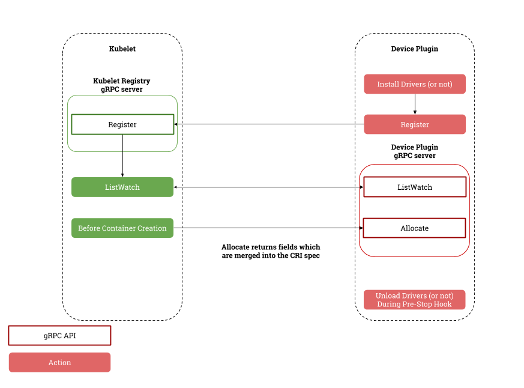
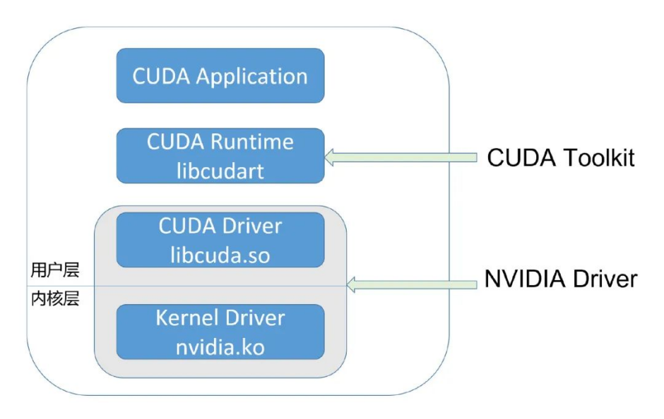
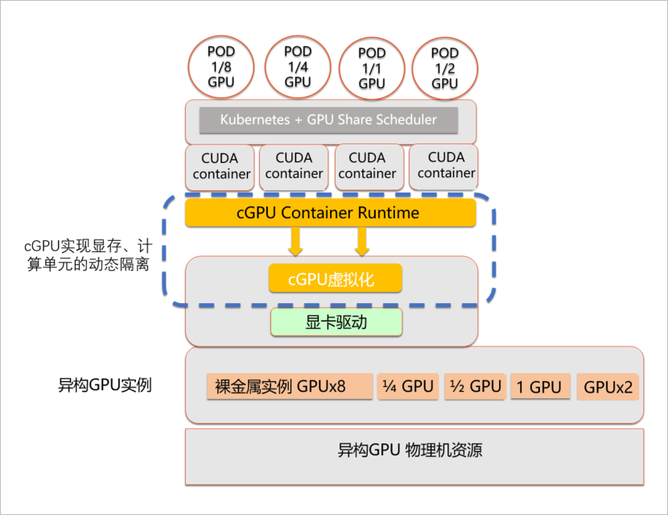
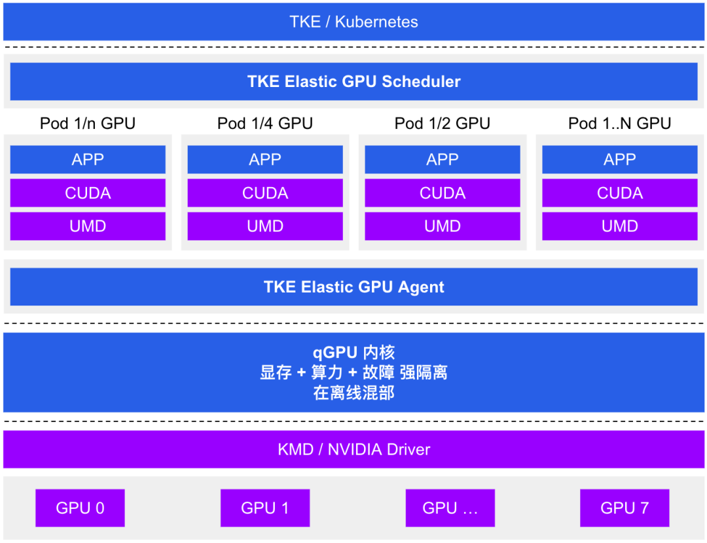
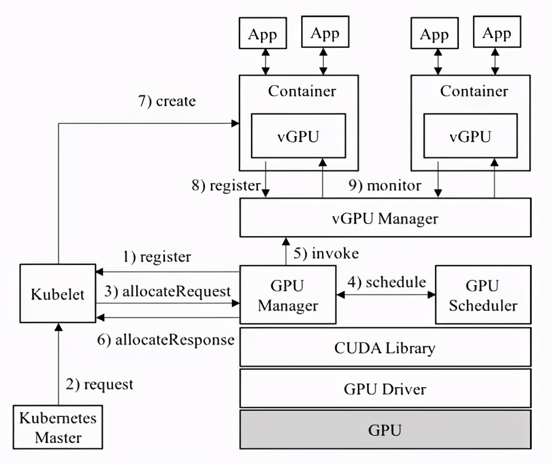
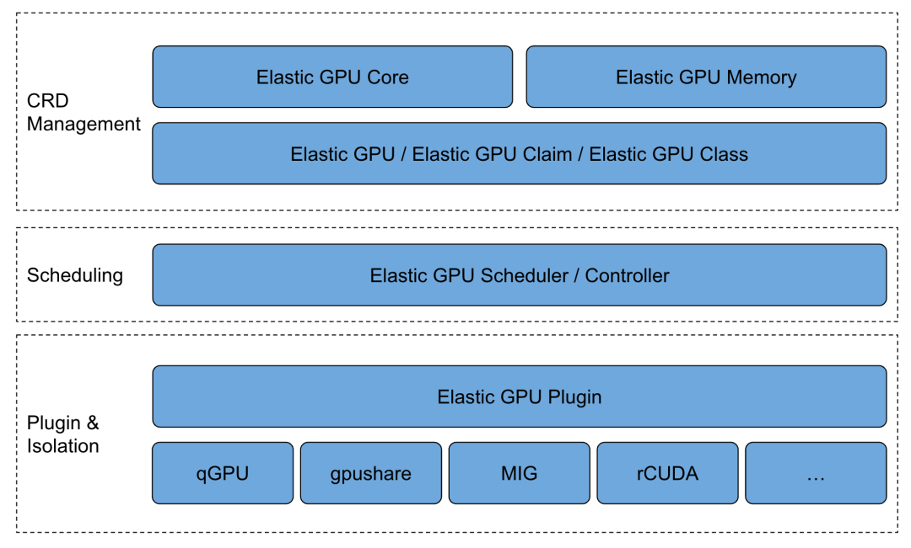

# **云原生 GPU 算力管理探索(FULL)**

## 01 GPU简介

GPU 具备大量核心和高速内存，擅长并行计算，适合用于深度学习训练/推理、图形图像处理以及科学计算等场景，主要厂商包括NVIDIA 、AMD等。其主要性能指标包括：

*  **计算能力**：单位为FLOP/s，表示每秒的浮点操作数量，包括单精度和双精度两种指标。
*  **显存容量**：其主要功能就是暂时储存GPU要处理的数据和处理完毕的数据。显存容量大小决定了GPU能够加载的数据量大小

## 02 Kubernetes管理GPU

由于近几年 AI 技术愈发成熟，落地场景越来越多，对 GPU的需求呈井喷趋势。而在资源管理调度平台上，Kubernetes 已成为事实上的标准。

所以很多客户选择在 Kubernetes 中使用 GPU 运行 AI 计算任务。Kubernetes 本身是通过插件扩展的机制来管理 GPU 资源的，具体来说这里有两个独立的内部机制：

* Extend Resources：允许用户自定义资源名称，并且该资源的度量是整数级别，这样做的目的在于通过一个通用的模式支持不同的异构设备，包括 RDMA、FPGA、GPU 等等。
	* 上报 Extend Resources，只需要通过一个 PACTH API 对 Node 对象进行 status 部分更新即可，可以简单地使用 curl 命令来发起，如下所示：

```
# **启动 Kubernetes 的客户端 proxy，这样你就可以直接使用 curl 来跟 Kubernetes  的 API Server 进行交互了**
$ kubectl proxy
  
# 执行 PACTH 操作
$ curl --header "Content-Type: application/json-patch+json" \
--request PATCH \
--data '[{"op": "add", "path": "/status/capacity/nvidia.com/gpu", "value": "1"}]' \
http://localhost:8001/api/v1/nodes/<your-node-name>/status
```

 PATCH 操作完成后，你就可以看到 Node 的 Status 变成了如下所示的内容：

```
apiVersion: v1
kind: Node
...
Status:
	Capacity:
		cpu:  2
		memory:  2049008Ki
		nvidia.com/gpu: 1
```

这样，在 Kubernetes 调度器中就能够记录这个节点的 GPU 类型，它所对应的资源数量是 1。

* Device Plugin：Device Plugin 是 Kubernetes 提供的一个设备插件框架，用来支持 GPU、FPGA 和高性能 NIC 等第三方设备，只要根据 Device Plugin 的接口实现一个特定设备的插件，就能实现 Kubernetes 对设备的管理。（pkg/kubelet/apis/deviceplugin/v1beta1/api.pb.go:567）接口定义如下：

```
type DevicePluginServer interface {
    // GetDevicePluginOptions returns options to be communicated with Device
    // Manager
    GetDevicePluginOptions(context.Context, *Empty) (*DevicePluginOptions, error)
    // ListAndWatch returns a stream of List of Devices
    // Whenever a Device state change or a Device disappears, ListAndWatch
    // returns the new list
    ListAndWatch(*Empty, DevicePlugin_ListAndWatchServer) error
    // Allocate is called during container creation so that the Device
    // Plugin can run device specific operations and instruct Kubelet
    // of the steps to make the Device available in the container
    Allocate(context.Context, *AllocateRequest) (*AllocateResponse, error)
    // PreStartContainer is called, if indicated by Device Plugin during registeration phase,
    // before each container start. Device plugin can run device specific operations
    // such as reseting the device before making devices available to the container
    PreStartContainer(context.Context, *PreStartContainerRequest) (*PreStartContainerResponse, error)
  }
```

其中， ListAndWatch和 Allocate 是最主要的方法：

*  ListAndWatch：当 DevicePlugin 启动并向 Kubelet 注册后，Kubelet 会调用该 API 获取设备信息。值得注意的是，它是一个长连接，当设备健康状况发生变化时，DevicePlugin 会主动向 Kubelet 发送最新的设备信息。
*    Allocate：当 Kubelet 要创建使用该设备的容器时， Kubelet 会调用该 API 为容器分配设备资源，得到使用该设备的必要信息，如设备列表、环境变量和挂载点等。



目前主流的GPU厂商都提供了对应的设备插件，**如NVIDIA提供的Device Plugin （https://github.com/NVIDIA/k8s-device-plugin）**。

安装了插件，集群就会暴露一个自定义可调度的资源，例如 `amd.com/gpu` 或 `nvidia.com/gpu`。

可以通过请求这个自定义的 GPU 资源在你的容器中使用这些 GPU，其请求方式与请求 cpu 或 memory 时相同。不过，在如何指定自定义设备的资源请求方面存在一些限制：

GPU 只能在limits部分指定，这意味着：

* 你可以指定 GPU 的 `limits` 而不指定其 `requests`，因为 Kubernetes 将默认使用限制值作为请求值。
*  你可以同时指定 `limits` 和 `requests`，不过这两个值必须相等。
*  你不可以仅指定 `requests` 而不指定 `limits`。


以下是一个 Pod 请求 GPU 的示例清单：

```
apiVersion: v1
kind: Pod
metadata:
  name: example-vector-add
spec:
  restartPolicy: OnFailure
  containers:
    - name: example-vector-add
      image: "registry.example/example-vector-add:v42"
      resources:
        limits:
          gpu-vendor.example/example-gpu: 1 # 请求 1 个 GPU
```

在kubernetes中使用厂商的Device Plugin插件，能够完成GPU的管理和调度，但是仍有很多不方便或者不足的地方，比如：

* 资源调度不够灵活，只支持按较粗粒度的调度，按 GPU 块数调度。
* GPU不能共享，算力不能切分，这样会导致GPU算力的浪费。
* 集群GPU资源缺少全局视角。没有直观方式可获取集群层面 GPU 信息，比如 Pod / 容器与 GPU 卡绑定关系、已使用 GPU 卡数等。

接下来介绍业内的一些GPU算力共享方案。

### 03业内共享GPU算力方案

**3.1  阿里GPU Share Device Plugin**

实现思路：

1. 利用 `kubernetes Extended Resource` 机制，重新定义 GPU 资源，主要是对显存和 GPU 数量的定义。
2. **利用`Device Plugin`机制，在节点上将 GPU卡数量和总显存（`数量 *显存`）总量上报给 kubelet，kubelet 进一步上报给 Kubernetes API Server**。
3. 利用`k8s scheduler Extender`机制，扩展调度器功能，负责在全局调度器 Filter 和 Bind 的时候判断节点上单个 GPU 卡是否能够提供足够的 GPU 显存，**并且在 Bind 的时刻将 GPU 的分配结果通过 annotation 记录到 Pod Spec 以供后续 Filter 检查分配结果**。

使用示例：

```
apiVersion: apps/v1beta1
kind: StatefulSet


metadata:
  name: binpack-1
  labels:
    app: binpack-1


spec:
  replicas: 3
  serviceName: "binpack-1"
  podManagementPolicy: "Parallel"
  selector: # define how the deployment finds the pods it manages
    matchLabels:
      app: binpack-1

  template: # define the pods specifications
    metadata:
      labels:
        app: binpack-1

    spec:
      containers:
      - name: binpack-1
        image: cheyang/gpu-player:v2
        resources:
          limits:
            # GiB
            aliyun.com/gpu-mem: 3
```

优点：开源，使用简单。

不足之处：**不支持共享资源的隔离，存在资源抢占情况；不支持算力维度的衡量划分**。

这里顺便介绍下常用的GPU共享资源隔离方案，参考GPU应用调用链图，一般有以下几种：



>  GPU应用调用链

* 截获CUDA库转发，如vCUDA。
* 截获驱动转发，如阿里云cGPU、腾讯云qGPU。
* 截获GPU硬件访问，如NVIDIA GRID vGPU。

**3.2 阿里cGPU**

cGPU是阿里云基于内核虚拟GPU隔离的容器共享技术。

**即多个容器共享一张GPU卡，从而实现业务的安全隔离，提高GPU硬件资源的利用率并降低使用成本**。

**和之前其开源的 GPU Sharing 工具不同，这次 cGPU 实现了对资源的隔离**。

* 通过一个内核驱动，为容器提供了虚拟的 GPU 设备，从而实现了显存和算力的隔离；
* 通过用户态轻量的运行库，来对容器内的虚拟 GPU 设备进行配置。



使用以下YAML内容，创建申请GPU显存和算力的任务：

```
apiVersion: batch/v1
kind: Job
metadata:
  name: cuda-sample
spec:
  parallelism: 1
  template:
    metadata:
      labels:
        app: cuda-sample
    spec:
      containers:
      - name: cuda-sample
        image:  registry.cn-beijing.aliyuncs.com/ai-samples/gpushare-sample:cuda-sample-11.0.3
        command:
        - bandwidthTest
        resources:
          limits:
            #申请2 GiB显存。
            aliyun.com/gpu-mem: 2
            #申请一张GPU卡的30%算力。
            aliyun.com/gpu-core.percentage: 30
        workingDir: /root
      restartPolicy: Never
```

优点：支持算力、显存维度的管理调度，支持共享资源隔离。

不足之处：商业产品，只能在阿里云容器服务使用；自研难度极大。

**3.3 腾讯qGPU**

腾讯云推出的 GPU 容器共享技术，支持在多个容器间共享 GPU 卡并提供容器间显存、算力强隔离的能力，其原理与阿里云cGPU相似，此处不多介绍。



**3.4 vCUDA**

这里主要是讨论腾讯开源的GaiaGPU。

vCUDA的系统架构采用一个Manager来管理GPU，Manager负责配置容器的GPU计算能力和显存资源，做到使用者无法使用多余申请的显存，GPU的平均使用率不会大幅超出申请值。vCUDA的设计只侵入了CUDA层，用户的程序无需重新编译就可以运行在基于vCUDA的GPU实现共享。vCUDA使用修改后cuda library来达到资源控制，vCUDA分别修改了计算操作，显存操作和信息获取3个方面的API。




vCUDA 通过劫持容器内用户程序对 CUDA Driver API 的调用来限制当前容器内进程对 GPU 和显存的使用

优点：开源，可以在任意地方使用，不依赖任何云。

缺点：需要替换CUDA库，版本要对齐；部分场景下有兼容性问题。

## **04 云原生方式管理GPU资源**

cGPU、qGPU、vCUDA、gpu share、GPU 池化 等 GPU 共享技术越来越被用户采用。每种方案都有自己独立的一套 Kubernetes 集成实现方式，**<mark>通常是由调度器 + device plugin 组成</mark>**。

这些方案相互独立，没有统一标准，无法共通。这导致用户在单个集群中很难同时使用多种 GPU 后端技术，同时也没有一个全局的视角获取集群层面 GPU 信息。这为基于 Kubernetes 构建统一的GPU算力基础设施平台增加了很多难度。

**Elastic GPU（https://github.com/elastic-ai/elastic-gpu）借鉴PV / PVC / StorageClass模型，定义了三种全新的 Kubernetes CRD，用于代表 GPU 资源的不同抽象**：


* **ElasticGPU：ElasticGPU 是集群中一个实际可使用的 GPU 资源，可以是一块本地 GPU 物理卡、一个 GPU 切片资源（ GPU 算力 / 显存 的组合）、一个远端 GPU 设备**。
* **ElasticGPUClaim：ElasticGPUClaim 是用户对 ElasticGPU 资源的申领，可以申请整卡数量，申请 GPU 核数 / 显存，或者申请 TFLOPS 算力。**
* EGPUClass：EGPUClass 提供了生产和挂载 ElasticGPU 的方式，可以使用 qGPU 虚拟化、vCUDA、或是 GPU 远端池化的技术。

支持用户通过云原生方式管理GPU资源。此方案分为四个模块：

* 在前端资源层面有两个标准化资源定义GPU Core和GPU Memory；
* 在GPU CRD里能看见物理卡与容器所用资源的关系，用户可获取到集群GPU资源分配情况，增加了物理卡在集群的可见性；
* 自研GPU Extender Scheduler扩展调度器可以针对GPU资源做精细化调度，提升集群层面分配效率，感知单个物理卡资源。
* Device Plugin Agent提供了一个通用化框架，支持任意基于Device Plugin的发现机制；在框架上实现了主流的GPU Provider支持，降低了用户管理成本。



以qGPU为例，描述结合Elastic GPU方案

* **qGPU资源申请**

用户在集群中创建 ElasticGPUClass，指定 qGPU 作为 GPU 后端。

```
apiVersion: elasticgpu.io/v1alpha
kind: ElasticGPUClass
metadata:
 name: qgpu-class
provisioner: elasticgpu.io/qgpu
reclaimPolicy: Retain
eGPUBindingMode: Immediate
```

创建 ElasticGPUClaim 描述对 qGPU 资源的申领，`tke.cloud.tencent.com/qgpu-core`代表申请 10% 的 GPU 算力，`tke.cloud.tencent.com/qgpu-memory`代表申请 4GB 显存。

```
apiVersion: elasticgpu.io/v1alpha
kind: ElasticGPUClaim
metadata:
 name: qgpu-egpuc
spec:
 storageClassName: qgpu-class
 resources:
  requests:
   tke.cloud.tencent.com/qgpu-core: 10
   tke.cloud.tencent.com/qgpu-memory: 4GB
```

用户在创建 Pod 时指定 ElasticGPUClaim 完成 qGPU 资源申领。

```
apiVersion: v1
kind: Pod
metadata:
 name: qgpu-pod
 annotations:
  elasticgpu.io/egpuc-<container-name>: qgpu-egpuc
spec:
 containers:
 - name: test
```

## 05 总结

Kubernetes通过Device Plugin机制对GPU进行管理，使用GPU厂商提供的Device Plugin插件，即可在集群中申请使用GPU资源。

**对于需要共享GPU算力，并且不考虑资源隔离的场景，可考虑使用开源的GPU Share Device Plugin插件。**

cGPU、qGPU、vCUDA等方案在支持共享GPU算力的同时，提供了资源隔离的能力，企业可根据需求进行选择。

Elastic GPU通过扩展定义CRD，对GPU资源进行了抽象，能较好的支持gpu share、cGPU、qGPU、vCUDA等多种技术，是一种非常好的云原生方式管理GPU思路。目前社区只适配了qGPU，其他技术如gpu share目前需要自行完成适配。