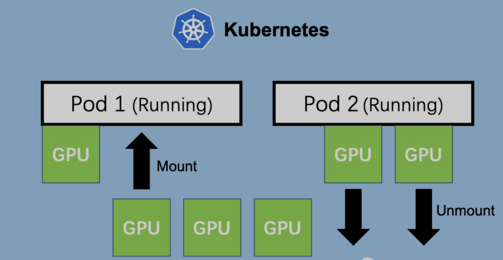

# 在Kubernetes（k8s）中使用GPU

Kubernetes 支持对节点上的 AMD 和 NVIDIA GPU （图形处理单元）进行管理，目前处于实验状态。



修改docker配置文件

```
root@hello:~# cat /etc/docker/daemon.json
{
    "default-runtime": "nvidia",
    "runtimes": {
        "nvidia": {
            "path": "/usr/bin/nvidia-container-runtime",
            "runtimeArgs": []
        }
    },
  "data-root": "/var/lib/docker",
  "exec-opts": ["native.cgroupdriver=systemd"],
  "registry-mirrors": [
    "https://docker.mirrors.ustc.edu.cn",
    "http://hub-mirror.c.163.com"
  ],
  "insecure-registries": ["127.0.0.1/8"],
  "max-concurrent-downloads": 10,
  "live-restore": true,
  "log-driver": "json-file",
  "log-level": "warn",
  "log-opts": {
    "max-size": "50m",
    "max-file": "1"
    },
  "storage-driver": "overlay2"
}
root@hello:~#

root@hello:~# systemctl  daemon-reload

root@hello:~# systemctl  start docker
```

添加标签

```

root@hello:~# kubectl label nodes 192.168.1.56 nvidia.com/gpu.present=true

root@hello:~# kubectl get nodes -L nvidia.com/gpu.present
NAME           STATUS                     ROLES    AGE    VERSION   GPU.PRESENT
192.168.1.55   Ready,SchedulingDisabled   master   128m   v1.22.2  
192.168.1.56   Ready                      node     127m   v1.22.2   true
root@hello:~#
```

安装helm仓库

```

root@hello:~# curl https://baltocdn.com/helm/signing.asc | sudo apt-key add -
root@hello:~# sudo apt-get install apt-transport-https --yes
root@hello:~# echo "deb https://baltocdn.com/helm/stable/debian/ all main" | sudo tee /etc/apt/sources.list.d/helm-stable-debian.list
root@hello:~# sudo apt-get update
root@hello:~# sudo apt-get install helm

helm install \
    --version=0.10.0 \
    --generate-name \
    nvdp/nvidia-device-plugin
```

查看是否有nvidia

```

root@hello:~# kubectl describe node 192.168.1.56 | grep nv
                    nvidia.com/gpu.present=true
  nvidia.com/gpu:     1
  nvidia.com/gpu:     1
  kube-system                 nvidia-device-plugin-1637728448-fgg2d         0 (0%)        0 (0%)      0 (0%)           0 (0%)         50s
  nvidia.com/gpu     0           0
root@hello:~#
```
下载镜像

```
root@hello:~# docker pull registry.cn-beijing.aliyuncs.com/ai-samples/tensorflow:1.5.0-devel-gpu

root@hello:~# docker save -o tensorflow-gpu.tar  registry.cn-beijing.aliyuncs.com/ai-samples/tensorflow:1.5.0-devel-gpu

root@hello:~# docker load -i tensorflow-gpu.tar
```

创建tensorflow测试pod

```
root@hello:~# vim gpu-test.yaml
root@hello:~# cat gpu-test.yaml
apiVersion: v1
kind: Pod
metadata:
  name: test-gpu
  labels:
    test-gpu: "true"
spec:
  containers:
  - name: training
    image: registry.cn-beijing.aliyuncs.com/ai-samples/tensorflow:1.5.0-devel-gpu
    command:
    - python
    - tensorflow-sample-code/tfjob/docker/mnist/main.py
    - --max_steps=300
    - --data_dir=tensorflow-sample-code/data
    resources:
      limits:
        nvidia.com/gpu: 1
  tolerations:
  - effect: NoSchedule
    operator: Exists
root@hello:~#

root@hello:~# kubectl  apply -f gpu-test.yaml
pod/test-gpu created
root@hello:~#
```

查看日志

```
root@hello:~# kubectl logs test-gpu
WARNING:tensorflow:From tensorflow-sample-code/tfjob/docker/mnist/main.py:120: softmax_cross_entropy_with_logits (from tensorflow.python.ops.nn_ops) is deprecated and will be removed in a future version.
Instructions for updating:


Future major versions of TensorFlow will allow gradients to flow
into the labels input on backprop by default.


See tf.nn.softmax_cross_entropy_with_logits_v2.


2021-11-24 04:38:50.846973: I tensorflow/stream_executor/cuda/cuda_gpu_executor.cc:895] successful NUMA node read from SysFS had negative value (-1), but there must be at least one NUMA node, so returning NUMA node zero
2021-11-24 04:38:50.847698: I tensorflow/core/common_runtime/gpu/gpu_device.cc:1105] Found device 0 with properties:
name: Tesla T4 major: 7 minor: 5 memoryClockRate(GHz): 1.59
pciBusID: 0000:00:10.0
totalMemory: 14.75GiB freeMemory: 14.66GiB
2021-11-24 04:38:50.847759: I tensorflow/core/common_runtime/gpu/gpu_device.cc:1195] Creating TensorFlow device (/device:GPU:0) -> (device: 0, name: Tesla T4, pci bus id: 0000:00:10.0, compute capability: 7.5)
root@hello:~#
```