# **Maven + Docker + Jar 打包流程**

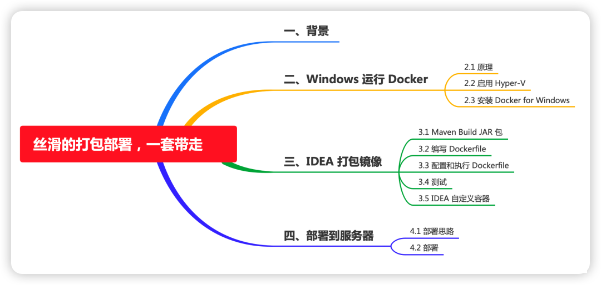

## **一、背景**

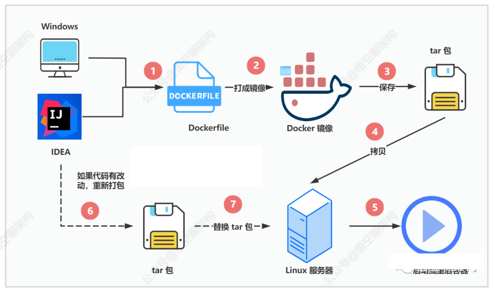


* 项目背景：新项目的后端框架是刚起步，搭建的是一套微服务框架，基础服务有网关 Gateway， Nacos 注册中心，以及其他的微服务。现在需要弄个简单且方便的，基于 Docker 的部署方式。

* 为什么用 Docker：为了让后端程序更容易打包部署和管理，所以用上了 Docker 容器化部署。比如用 Docker Swarm 或 K8s 来管理多个容器。

* 为什么要提到 Windows：本地机器是 Windows 系统开发，通过 Windows + IDEA 将应用程序打成 Docker 镜像，然后拷贝到 Linux 服务器进行容器化部署。

## 二、Windows 运行 Docker

### 2.1 原理

为了在 Windows 能够打包 Docker 镜像，就必须弄个可以运行 Docker 的环境。

Docker 依赖于已存在并运行的 Linux 内核环境。实质上是在已经运行的 Linux 下制造了一个隔离的文件环境，因此它执行的效率几乎等同于所部署的 Linux 主机。

如果其他系统想部署 Docker 就必须安装一个虚拟 Linux 环境。

### 2.2 启用 Hyper-V

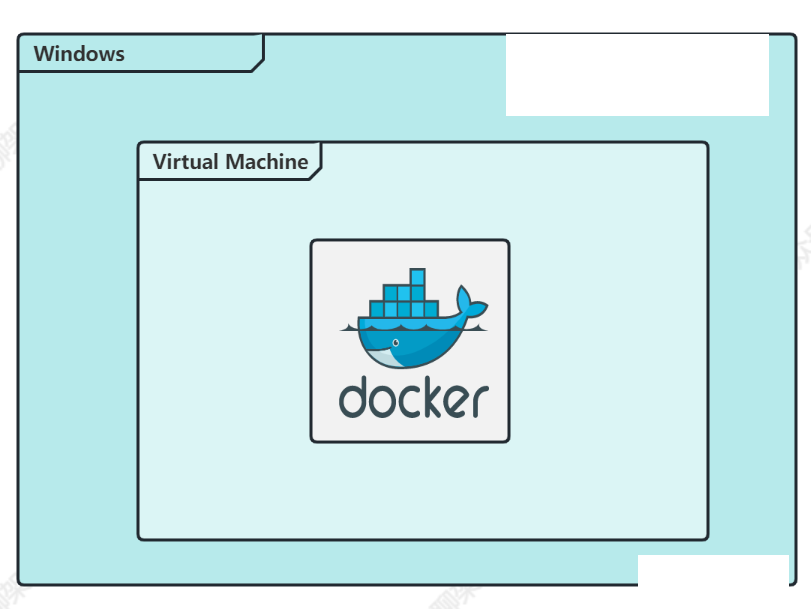

Windows 自带的 Hyper-V 工具就是一款管理和创建虚拟机的工具，要求：Windows 10 企业版、专业版或教育版。启用 Hyper-V 如下所示：

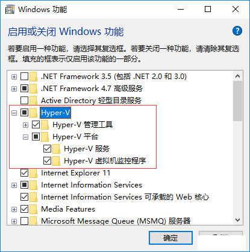

操作步骤：程序和功能->打开或关闭 Windows 功能->选择“Hyper-V”，然后单击“确定

参考链接：

```
https://learn.microsoft.com/zh-cn/virtualization/hyper-v-on-windows/quick-start/enable-hyper-v
```

### 2.3 安装 Docker for Windows

点击 官网下载地址，并下载 Windows 的版本，安装就是一路点击 next 就好了。

```
官网下载地址：https://www.docker.com/products/docker-desktop/
```

安装好之后，打开 Windows 的Powershell 命令行窗口，执行 docker run hello-world。当看到 Hello from Docker！就表示安装成功。

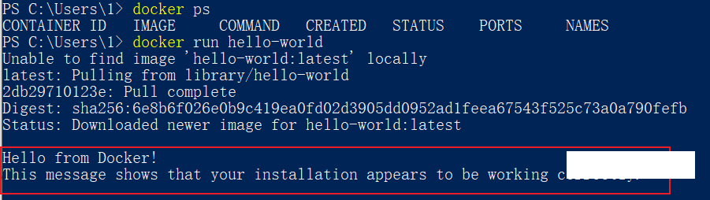

好了，现在我们开发环境拥有了运行 docker 容器，打包 docker 镜像的能力。接下来我们来看下如何用 IDEA 开发工具来启动 docker 容器和打包镜像。

## 三、IDEA 打包镜像

IDEA 工具很强大，提供 Docker 相关的功能。

IDEA 打包 Docker 镜像的方式主要分为这么几步：

* 通过 Maven 工具将 SpringBoot 应用程序打成可执行的 JAR 包。
* IDEA 执行指定的 Dockerfile 打包成 Docker 镜像。

这里我写了一个简单 SpringBoot 项目，定义了一个简单的 Rest API 接口。


应用程序的端口为 9600。

```
server.port=9600
```

### 3.1 Maven Build JAR 包

Maven 打包的话这个我们都比较熟悉，直接执行 Maven 命令（mvn package）或者在 IDEA 上点击 Maven 相关按钮即可。就会生成这样一个包

operation-core-0.0.1-SNAPSHOT，我们可以把它的名字改短一点，就改为  operation.jar 吧

### 3.2 编写 Dockerfile

Dockerfile 又是什么呢？

它是一个用来构建镜像的文本文件，文件内容就是一条条构建镜像所需的指令和说明。

我们就到项目创建两个 dockerfile 文件吧，一个用作开发环境的，一个用作生产环境的。

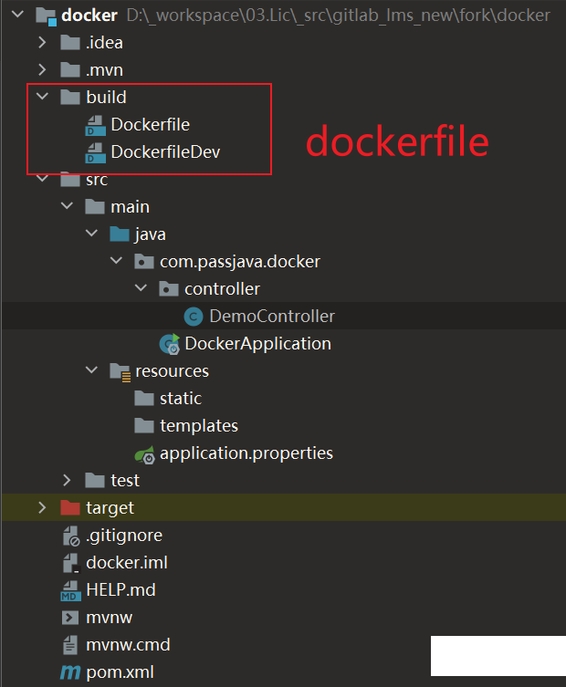

如下所示：

```
# 拉取指定的镜像文件
FROM hub.github.com/library/java:latest

# MAINTAINER 指令允许你给将要制作的镜像设置作者信息
MAINTAINER jxi <jxi@outlook.com>
# 容器内创建一个 apps 目录，用来挂载 jar 包
RUN mkdir -p /apps
# 将 passjavas-demo-1.0 jar 包复制到 /apps/passjava-demo.jar
ADD passjava-demo-1.0.jar /apps/passjava-demo.jar
# 设置时区
ENV TZ "Asia/Shanghai"
# 设置暴露的端口
EXPOSE 9600
#dockerfile中增加健康检查，interval表示每个5分钟检查一次，timeout每次超过5秒钟认定为失败，retries失败后轮询3次认定为容器不健康，考虑重启。
#HEALTHCHECK --interval=60s --timeout=5s --retries=6 \
#  CMD curl -f http://localhost:8989/health || exit 1
# 运行 Java 应用程序的命令
ENTRYPOINT ["java","-jar","/apps/passjava-demo.jar"]
```

### 3.3 配置和执行 Dockerfile

在 IDEA 里面创建一个 运行配置，添加一个 Dockerfile 配置，如下所示：

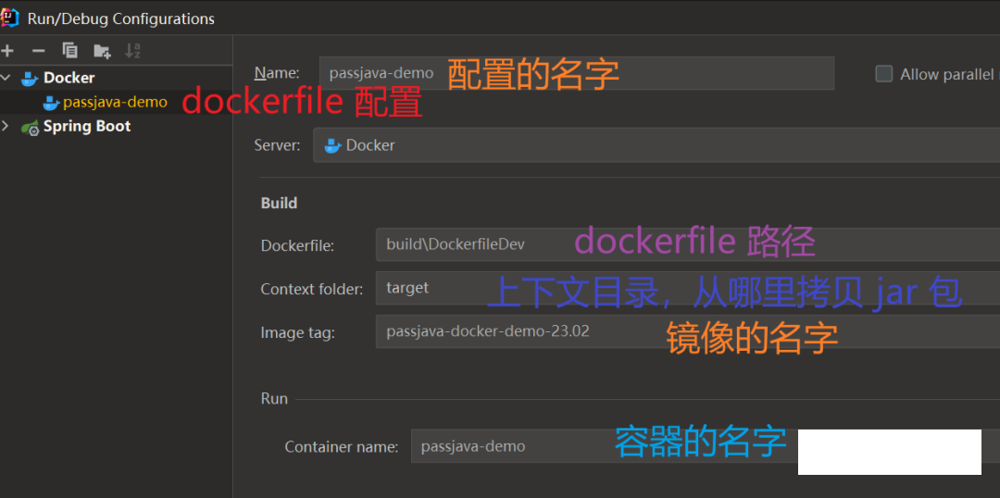

开始运行这个配置后，IDEA 就会根据 dockerfile 里面的配置自动拉取 Java JDK 镜像文件，这个过程会比较长，Java JDK 还是比较大的。

拉取之后，会一步步执行 dockerfile 里面的命令，最后会启动一个 docker 容器。

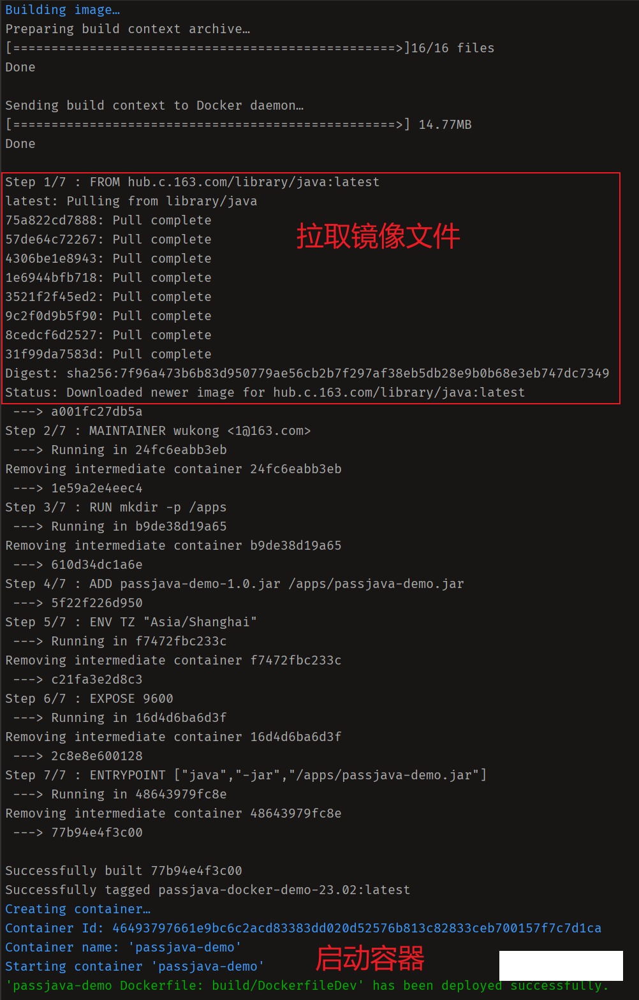

### 3.4 测试

我们来测试下 Java 程序是否正常运行。还是用 curl 命令访问 Restful API。

```
curl http://localhost:9600/test
```

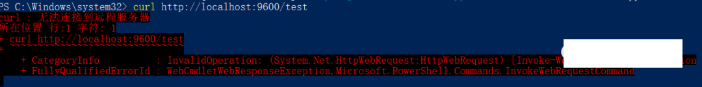

我们来排查下。先看下容器日志，执行命令 docker logs <容器id>，可以看到 Java 应用程序正常启动，也没有报错日志。

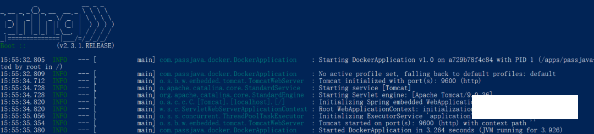

那说明可能是网络问题，比如容器的端口和我们本机的端口没有映射。果不其然。这里端口是否没有映射的，如下图所示。


那说明通过这种方式虽然能正常启动程序，但是程序不能提供服务，那就换一种方式。上面的方式是通过 Dockerfile 创建了一个镜像文件，然后 IDEA 工具帮我们启动了一个 Docker 容器，但是这种容器还缺少一些参数，比如端口映射没有做。要不我们就自己来启动一个容器看看？自己启动就是通过 docker run 命令即可，不过也可以通过创建一个 IDEA container 配置来启动一个容器。

## 3.5 IDEA 自定义容器

如下图所示，自定义一个容器跑配置。因为上面的步骤我们已经创建了镜像了，所以可以直接用这个镜像即可。

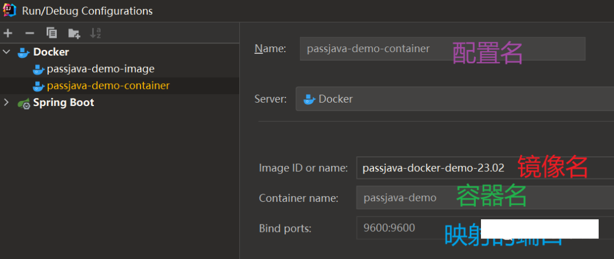

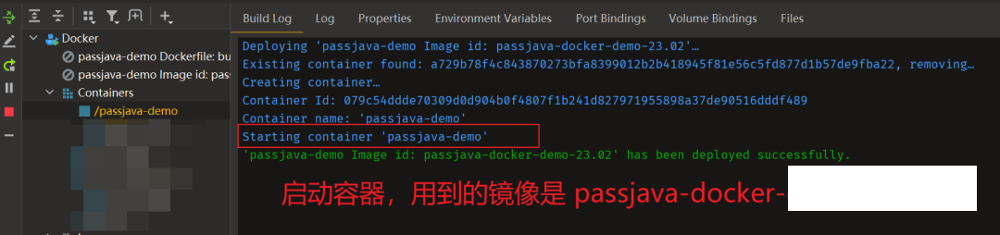

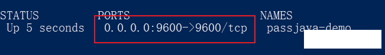

再来测试下是否能访问 API。还是用 curl 命令，返回结果如下，这次就成功了。

```
passjava，jxi
```
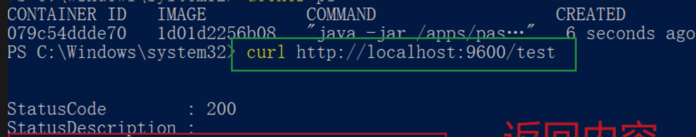

## 四、部署到服务器

### 4.1 部署思路

* 把镜像保存为一个压缩包，上传到服务器，服务器上用命令启动容器。
* 如果有代码修改，把项目重新打成 JAR 包上传到挂载的目录就可以了。


### 4.2 部署

先在本地把 docker 镜像打成一个 tar 包。

```
docker save passjava-docker-demo-23.02 -o D:\passjava-demo.tar
```

然后把这个 tar 包拷贝到 Linux 服务器。

接着将 tar 加载为 docker 镜像

```
docker load -i passjava-demo.tar
```

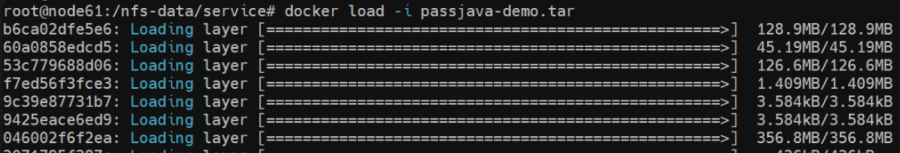

然后就可以通过命令来启动容器了。命令里面包含了挂载的目录卷，端口映射，启动方式等。

```

docker run --name passjava-demo -d \
-v /nfs-data/service:/nfs-data/service \
-v /nfs-data/service/apps:/apps \
-v /nfs-data/service/logs:/nfs-data/service/logs \
--restart=always \
-p 9600:9600 \
passjava-docker-demo-23.02
```

又报错了，查看日志提示找不到 jar 包。

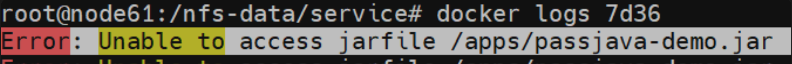

想起来了，挂载上面的 apps 目录后，容器会从容器里面的 apps 目录找 JAR 包，发现没有这个 jar 包，当然报错了呀

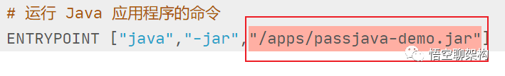

而这个 apps 目录正好是和宿主服务器的 /nfs-data/service/apps 目录做了映射的，这个目录没有 jar 包，容器里面的 apps 目录也就没有 jar 包。所以我们可以把 jar 包拷贝到这个目录就好

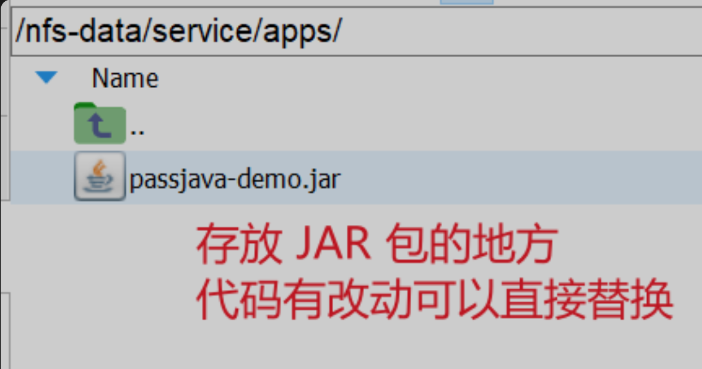

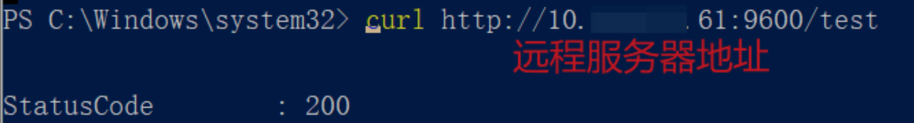

