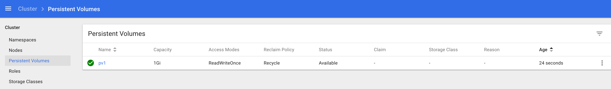
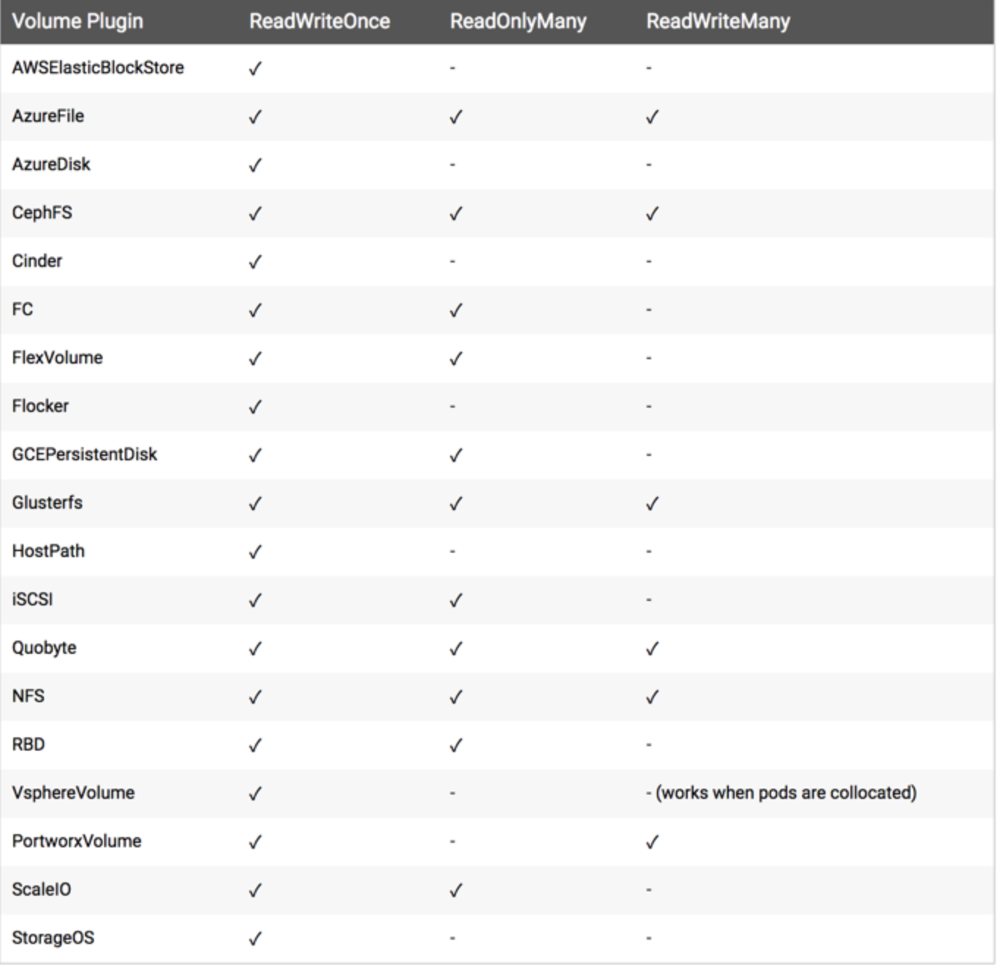
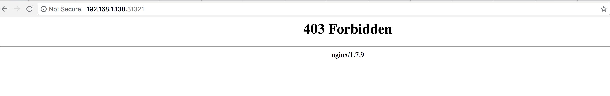
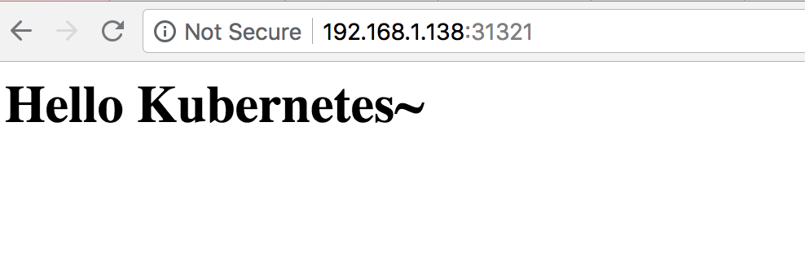
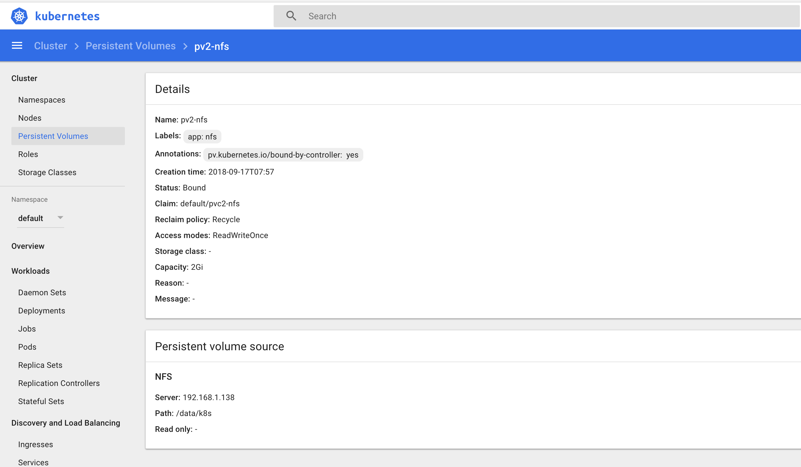

# kubernetes 持久化存储(一)
# PV 和 PVC 的使用

前面我们也和大家讲到了有状态的应用和对数据有持久化的应用，我们有通过 `hostPath` 或者 `emptyDir` 的方式来持久化我们的数据，但是显然我们还需要更加可靠的存储来保存应用的持久化数据，这样容器在重建后，依然可以使用之前的数据。但是显然存储资源和 `CPU` 资源以及内存资源有很大不同，为了屏蔽底层的技术实现细节，让用户更加方便的使用，

### `Kubernetes` 便引入了 `PV` 和 `PVC` 两个重要的资源对象来实现对存储的管理。

## 概念

`PV` 的全称是：`PersistentVolume（持久化卷`，是对**底层的共享存储的一种抽象**，`PV` 由管理员进行`创建和配置`，它和具体的底层的共享存储技术的实现方式有关，比如 `Ceph`、`GlusterFS`、`NFS` 等，**都是通过插件机制完成与共享存储的对接。**

`PVC` 的全称是：`PersistentVolumeClaim`（持久化卷声明），`PVC` 是用户存储的一种声明，`PVC` 和 `Pod` 比较类似，`Pod` 消耗的是节点，`PVC` 消耗的是 `PV` 资源，`Pod` 可以请求 `CPU` 和`内存`，而 `PVC` 可以请求特定的存储空间和访问模式。对于真正使用存储的用户不需要关心底层的存储实现细节，只需要直接使用 `PVC` 即可。


但是通过 `PVC` 请求到一定的存储空间也很有可能不足以满足应用对于存储设备的各种需求，而且不同的应用程序对于存储性能的要求可能也不尽相同，比如读写速度、并发性能等，为了解决这一问题，`Kubernetes` 又为我们引入了一个新的资源对象：`StorageClass`，通过 `StorageClass` 的定义，管理员可以将存储资源定义为某种类型的资源，比如`快速存储`、`慢速存储`等，用户根据 `StorageClass` 的描述就可以非常直观的知道各种存储资源的具体特性了，这样就可以根据应用的特性去申请合适的存储资源了。

## NFS

我们这里为了演示方便，决定使用相对简单的 NFS 这种存储资源，接下来我们在节点`docker_mnodes`:`192.168.1.136`上来安装 `NFS` 服务，数据目录：`/data/k8s/`

### 0.建立服务端数据目录,共享目录设置权限：

```
$ sudo mkdir -p  /data/k8s/
$ sudo chmod 755 /data/k8s/
```

### 1.关闭防火墙

```
$ sudo systemctl stop firewalld.service
$ sudo systemctl disable firewalld.service
```

### 2.安装配置 nfs

```
$ sudo apt-get install -y nfs-utils rpcbind
```

配置 `nfs`，`nfs` 的默认配置文件在 `/etc/exports` 文件下，在该文件中添加下面的配置信息：

```
$ sudo vi /etc/exports
/data/k8s  *(rw,sync,no_root_squash)
```

配置说明：

* `/data/k8s`：是共享的数据目录
* `*`：表示任何人都有权限连接，当然也可以是一个网段，一个 IP，也可以是域名
* `rw`：读写的权限
* `sync`：表示文件同时写入硬盘和内存
* `no_root_squash`：当登录 NFS 主机使用共享目录的使用者是 `root` 时，其权限将被转换成为匿名使用者，通常它的 `UID` 与 `GID`，都会变成 `nobody` 身份

1. 启动服务 `nfs` 需要向 `rpc` 注册，`rpc` 一旦重启了，注册的文件都会丢失，向他注册的服务都需要重启

### 注意启动顺序，先启动 rpcbind

```
$ sudo vi exports
$ sudo systemctl start rpcbind.service
$ sudo systemctl enable rpcbind

Created symlink from /etc/systemd/system/multi-user.target.wants/rpcbind.service to /usr/lib/systemd/system/rpcbind.service.
[vagrant@chefserver etc]$ systemctl status rpcbind
● rpcbind.service - RPC bind service
   Loaded: loaded (/usr/lib/systemd/system/rpcbind.service; enabled; vendor preset: enabled)
   Active: active (running) since Thu 2018-09-13 16:53:08 UTC; 15s ago
 Main PID: 4700 (rpcbind)
   CGroup: /system.slice/rpcbind.service
           └─4700 /sbin/rpcbind -w

```

看到上面的 `Started` 证明启动成功了。

然后启动 `nfs` 服务：

```
$ sudo systemctl start nfs.service
$ sudo systemctl enable nfs
Created symlink from /etc/systemd/system/multi-user.target.wants/nfs-server.service to /usr/lib/systemd/system/nfs-server.service.
$ systemctl status nfs

● nfs-server.service - NFS server and services
   Loaded: loaded (/usr/lib/systemd/system/nfs-server.service; enabled; vendor preset: disabled)
  Drop-In: /run/systemd/generator/nfs-server.service.d
           └─order-with-mounts.conf
   Active: active (exited) since Thu 2018-09-13 16:53:37 UTC; 13s ago
 Main PID: 4778 (code=exited, status=0/SUCCESS)
   CGroup: /system.slice/nfs-server.service
```

同样看到 `Started` 则证明 `NFS Server` 启动成功了。

另外我们还可以通过下面的命令确认下：

```
$ rpcinfo -p|grep nfs
    100003    3   tcp   2049  nfs
    100003    4   tcp   2049  nfs
    100227    3   tcp   2049  nfs_acl
    100003    3   udp   2049  nfs
    100003    4   udp   2049  nfs
    100227    3   udp   2049  nfs_acl
```

查看具体目录挂载权限：

```
$ cat /var/lib/nfs/etab
/data/k8s	*(rw,sync,wdelay,hide,nocrossmnt,secure,no_root_squash,no_all_squash,no_subtree_check,secure_locks,acl,no_pnfs,anonuid=65534,anongid=65534,sec=sys,secure,no_root_squash,no_all_squash)
```

到这里我们就把 `nfs server` 给安装成功了，接下来我们在节点`192.168.33.13`上来安装 `nfs` 的客户端来验证下 `nfs`

```
$ sudo systemctl stop firewalld.service
$ sudo systemctl disable firewalld.service
```

然后安装 nfs

```
$ sudo apt-get install -y nfs-utils rpcbind
```

安装完成后，和上面的方法一样，先启动 rpc、然后启动 nfs：

```
$ sudo systemctl start rpcbind.service
$ sudo systemctl enable rpcbind.service
$ sudo systemctl start nfs.service
$ sudo systemctl enable nfs.service
```

1. 挂载数据目录 客户端启动完成后，我们在客户端来挂载下 `nfs` 测试下：

```
$ showmount -e 192.168.33.16
Export list for 192.168.33.16:
/data/k8s *
```

然后我们在客户端上新建目录：

```
sudo mkdir -p /root/course/kubeadm/data
```

将 nfs 共享目录挂载到上面的目录：

```
$ sudo mount -t nfs 192.168.33.16:/data/k8s /root/course/kubeadm/data
```

挂载成功后，在客户端上面的目录中新建一个文件，然后我们观察下 nfs 服务端的共享目录下面是否也会出现该文件：

```
$ sudo touch /root/course/kubeadm/data/test.txt
```

然后在 nfs 服务端查看：

```
$ ls -ls /data/k8s/
total 0
0 -rw-r--r-- 1 root root 0 Sep 13 16:59 test.txt
```


## PV

由于我现在使用的`k8s nodes` (192.168.1.138) & (192.168.1.170)，机子的类型属于 `Ubuntu 16.04`, 安装的[参考文档](https://blog.csdn.net/CSDN_duomaomao/article/details/77822883)

```
$ sudo apt install nfs-kernel-server
$ sudo vi /etc/exports

/data/k8s *(rw,sync,no_root_squash)

$ sudo mkdir -p  /data/k8s/
$ sudo chmod 755 /data/k8s/

$ sudo service nfs-kernel-server restart

#显示已经mount到本机nfs目录的客户端机器。
$ sudo showmount -e localhost


#将配置文件中的目录全部重新export一次！无需重启服务。
$ sudo exportfs -rv
xportfs: /etc/exports [7]: Neither 'subtree_check' or 'no_subtree_check' specified for export "*:/data/k8s".
  Assuming default behaviour ('no_subtree_check').
  NOTE: this default has changed since nfs-utils version 1.0.x

exporting *:/data/k8s

#查看NFS的运行状态
$ sudo nfsstat
Server rpc stats:
calls      badcalls   badclnt    badauth    xdrcall
0          0          0          0          0

#查看rpc执行信息，可以用于检测rpc运行情况
$ sudo rpcinfo
program version netid     address                service    owner
100000    4    tcp6      ::.0.111               portmapper superuser
100000    3    tcp6      ::.0.111               portmapper superuser

#查看网络端口，NFS默认是使用111端口。
$ sudo rpcinfo
program version netid     address                service    owner
100000    4    tcp6      ::.0.111               portmapper superuser
100000    3    tcp6      ::.0.111               portmapper superuser
100000    4    udp6      ::.0.111               portmapper superuser
100000    3    udp6      ::.0.111               portmapper superuser
100000    4    tcp       0.0.0.0.0.111          portmapper superuser
```

有了上面的 NFS 共享存储，下面我们就可以来使用 `PV` 和 `PVC` 了。`PV` 作为存储资源，主要包括存储能力、访问模式、存储类型、回收策略等关键信息，下面我们来新建一个 `PV` 对象，使用 `nfs` 类型的后端存储，`1G `的存储空间，访问模式为 `ReadWriteOnce`，回收策略为 `Recyle`，对应的 `YAML` 文件如下：(`pv1-demo.yaml`)

```
apiVersion: v1
kind: PersistentVolume
metadata:
  name:  pv1
spec:
  capacity:
    storage: 1Gi
  accessModes:
  - ReadWriteOnce
  persistentVolumeReclaimPolicy: Recycle
  nfs:
    path: /data/k8s
    server: 192.168.1.138
```

Kubernetes 支持的 `PV `类型有很多，比如常见的 `Ceph`、`GlusterFs`、`NFS`，甚至 `HostPath`也可以，不过 `HostPath` 我们之前也说过仅仅可以用于单机测试，更多的支持类型可以前往 `Kubernetes PV` [官方文档](https://kubernetes.io/docs/concepts/storage/persistent-volumes/)进行查看，因为每种存储类型都有各自的特点，所以我们在使用的时候可以去查看相应的文档来设置对应的参数。

然后同样的，直接使用 `kubectl` 创建即可：

```
$ kubectl create -f pv1-demo.yaml
persistentvolume "pv1" created

$ kubectl get pv
NAME      CAPACITY   ACCESS MODES   RECLAIM POLICY   STATUS      CLAIM     STORAGECLASS   REASON    AGE
pv1       1Gi        RWO            Recycle          Available                                      15m
```

我们可以看到 `pv1` 已经创建成功了，状态是 `Available`，表示 `pv1` 就绪，可以被 `PVC` 申请。我们来分别对上面的属性进行一些解读。




### Capacity（存储能力）

一般来说，一个 PV 对象都要指定一个存储能力，通过 PV 的 **capacity**属性来设置的，目前只支持存储空间的设置，就是我们这里的 `storage=1Gi`，不过未来可能会加入 `IOPS`、`吞吐量`等指标的配置。

### AccessModes（访问模式）

`AccessModes` 是用来对 `PV` 进行访问模式的设置，用于描述用户应用对存储资源的访问权限，访问权限包括下面几种方式：

`ReadWriteOnce（RWO）`：读写权限，但是只能被单个节点挂载
`ReadOnlyMany（ROX）`：只读权限，可以被多个节点挂载
`ReadWriteMany（RWX）`：读写权限，可以被多个节点挂载

一些 PV 可能支持多种访问模式，但是在挂载的时候只能使用一种访问模式，多种访问模式是不会生效的。

下图是一些常用的 `Volume` 插件支持的访问模式：



### `persistentVolumeReclaimPolicy`（回收策略）

我这里指定的 `PV` 的回收策略为 `Recycle`，目前 PV 支持的策略有三种：

* `Retain`（保留）- 保留数据，需要管理员手工清理数据
* `Recycle`（回收）- 清除 `PV` 中的数据，效果相当于执行 `rm -rf /thevolume/*`
* `Delete`（删除）- 与 `PV `相连的后端存储完成 `volume `的删除操作，当然这常见于云服务商的存储服务，比如 `AWS EBS`。

不过需要注意的是，目前只有 `NFS` 和 `HostPath` 两种类型支持回收策略。当然一般来说还是设置为 Retain 这种策略保险一点。

### 状态

一个 PV 的生命周期中，可能会处于4中不同的阶段：

* Available（可用）：表示可用状态，还未被任何 PVC 绑定
* Bound（已绑定）：表示 PV 已经被 PVC 绑定
* Released（已释放）：PVC 被删除，但是资源还未被集群重新声明
* Failed（失败）： 表示该 PV 的自动回收失败

我们平时真正使用的资源其实是 `PVC`，就类似于我们的服务是通过 `Pod` 来运行的，而不是 `Node`，只是 `Pod 跑在 `Node` 上而已，所以接下来我们就来给大家讲解下 PVC 的使用方法。

## 准备工作

在使用 PVC 之前，我们还得把其他节点上的 nfs 客户端给安装上，比如我们这里：

```
$ kubectl get nodes
NAME            STATUS    ROLES     AGE       VERSION
192.168.1.138   Ready     <none>    3d        v1.8.2
192.168.1.170   Ready     <none>    5d        v1.8.2
```

```
$ sudo apt install nfs-common
```

## 新建 PVC

同样的，我们来新建一个数据卷声明，我们来请求 `1Gi` 的存储容量，访问模式也是 `ReadWriteOnce`，YAML 文件如下：(`pvc-nfs.yaml`)

```
kind: PersistentVolumeClaim
apiVersion: v1
metadata:
  name: pvc-nfs
spec:
  accessModes:
    - ReadWriteOnce
  resources:
    requests:
      storage: 1Gi

```

我们可以看到我们这里的声明方法几乎和新建 PV 是一样的，在新建 PVC 之前，我们可以看下之前创建的 PV 的状态：

```
apiVersion: v1
kind: PersistentVolume
metadata:
  name:  pv-nfs
spec:
  capacity:
    storage: 1Gi
  accessModes:
  - ReadWriteOnce
  persistentVolumeReclaimPolicy: Recycle
  nfs:
    path: /data/k8s
    server: 192.168.1.138
```

```
$ kubectl create -f pv1-demo.yaml
persistentvolume "pv-nfs" created

$ kubectl get pv
NAME      CAPACITY   ACCESS MODES   RECLAIM POLICY   STATUS      CLAIM     STORAGECLASS   REASON    AGE
pv-nfs    1Gi        RWO            Recycle          Available                                      24s
```

我们可以看到当前 `pv-nfs` 是在 `Available` 的一个状态，所以这个时候我们的 `PVC` 可以和这个 `PV` 进行绑定：

```
$ kubectl create -f pvc-nfs.yaml
persistentvolumeclaim "pvc-nfs" created

$ kubectl get pvc
NAME      STATUS    VOLUME    CAPACITY   ACCESS MODES   STORAGECLASS   AGE
pvc-nfs   Bound     pv-nfs    1Gi        RWO                           44s
```

我们可以看到 `pvc-nfs` 创建成功了，状态是 Bound 状态了，这个时候我们再看下 PV 的状态呢：

```
$ kubectl get pv
NAME      CAPACITY   ACCESS MODES   RECLAIM POLICY   STATUS    CLAIM             STORAGECLASS   REASON    AGE
pv-nfs    1Gi        RWO            Recycle          Bound     default/pvc-nfs                            2m
```

同样我们可以看到 `PV` 也是 Bound 状态了，对应的声明是 `default/pvc-nfs`，就是 `default` 命名空间下面的 `pvc-nfs`，证明我们刚刚新建的 `pvc-nfs` 和我们的 `pv-nfs` 绑定成功了。

有的同学可能会觉得很奇怪，我们并没有在 `pvc-nfs` 中指定关于 `pv` 的什么标志，它们之间是怎么就关联起来了的呢？

### 其实这是系统自动帮我们去匹配的，他会根据我们的声明要求去查找处于 `Available` 状态的 `PV`，如果没有找到的话那么我们的 `PVC` 就会一直处于 `Pending `状态，找到了的话当然就会把当前的 `PVC` 和目标 `PV` 进行绑定，这个时候状态就会变成 `Bound` 状态了。比如我们新建一个 `PVC`，如下：(`pvc2-nfs.yaml`)


```
kind: PersistentVolumeClaim
apiVersion: v1
metadata:
  name: pvc2-nfs
spec:
  accessModes:
    - ReadWriteOnce
  resources:
    requests:
      storage: 2Gi
  selector:
    matchLabels:
      app: nfs
```

我们这里声明一个 `PV `资源的请求，邀请访问模式是 `ReadWriteOnce`，存储容量是 `2G`，最后我们还要求匹配具有标签 `app=nfs` 的 PV，这样要求的 PV 有吗？我们先查看下当前系统的所有 PV：

```
$ kubectl get pv
NAME      CAPACITY   ACCESS MODES   RECLAIM POLICY   STATUS    CLAIM             STORAGECLASS   REASON    AGE
pv-nfs    1Gi        RWO            Recycle          Bound     default/pvc-nfs                            8m
```

都是 `Bound` 状态，并没有 `Available` 状态的 `PV`，所以我们可以想象到我们上面新建的 `PVC` 是没办法选择到合适的 `PV` 的，我们创建一下看看：

```
$ kubectl create -f pvc2-nfs.yaml
persistentvolumeclaim "pvc2-nfs" created
$ kubectl get pvc
NAME        STATUS    VOLUME    CAPACITY   ACCESS MODES   STORAGECLASS   AGE
pvc-nfs     Bound     pv-nfs    1Gi        RWO                           23m
pvc2-nfs    Pending                                                      14s
```
很显然是 `Pending` 状态，因为并没有合适的 `PV` 给你使用，现在我们来新建一个 `PV`，让上面的 `PVC ` 有合适的 `PV` 使用：（`pv2-nfs.yaml`）

```
apiVersion: v1
kind: PersistentVolume
metadata:
  name: pv2-nfs
  labels:
    app: nfs
spec:
  capacity:
    storage: 2Gi
  accessModes:
  - ReadWriteOnce
  persistentVolumeReclaimPolicy: Recycle
  nfs:
    server: 192.168.1.138
    path: /data/k8s
```

```
$ kubectl create -f pv2-nfs.yaml
persistentvolume "pv2-nfs" created

$ kubectl get pv
NAME      CAPACITY   ACCESS MODES   RECLAIM POLICY   STATUS    CLAIM              STORAGECLASS   REASON    AGE
pv2-nfs   2Gi        RWO            Recycle          Bound     default/pvc2-nfs                            24s
```

创建完 `pv2-nfs` 后，是不是很快就发现该 `PV `是 `Bound` 状态了，对应的 `PVC` 是 `default/pvc2-nfs`，证明上面的 `pvc2-nfs` 终于找到合适的 PV 进行绑定上了：

```
$ kubectl get pvc
NAME       STATUS    VOLUME    CAPACITY   ACCESS MODES   STORAGECLASS   AGE
pvc2-nfs   Bound     pv2-nfs   2Gi        RWO                           2m
```

成功了，对吧！有的同学可能又会说了，我们的 `pv2-nfs` 声明的容量是 2Gi，如果我 `pvc2-nfs` 这里声明的容量是 `1Gi` 的话呢？还能正常绑定吗？如果可以正常绑定的话，那剩下的 `1Gi` 容量还能使用吗？其实我也不清楚，怎么办？我们去实际测试下就知道了吧，先删除上面的 `pvc2-nfs`，然后我们把该 `PVC` 里面的容量改成 `1Gi`，再新建试一试呢：

```
$ kubectl delete pvc pvc2-nfs
persistentvolumeclaim "pvc2-nfs" deleted
$ cat pvc2-nfs.yaml
...
  resources:
    requests:
      storage: 1Gi
...
$ kubectl create -f pvc2-nfs.yaml
persistentvolumeclaim "pvc2-nfs" created
$ kubectl get pvc
NAME        STATUS    VOLUME    CAPACITY   ACCESS MODES   STORAGECLASS   AGE
pvc2-nfs    Bound     pv2-nfs   2Gi        RWO                           7s
```

### 我们可以看到上面的 `PVC` 依然可以正常的绑定，仔细看 `CAPACITY` 这一列的数据：`2Gi`，也就是说我们声明的 `1Gi` 是没什么用的，我 `P`V 是 `2Gi`，你这里声明 `1Gi` 是不行的，你必须得使用 `2Gi`。

### 如果我们这里容量声明是 `3Gi` 呢？还可以正常绑定吗？大家可以思考一下，如果声明的容量大于了 PV 里面的容量的话，是没办法进行绑定的，大家可以下去自己测试一下。

## 使用 PVC

上面我们已经知道怎么创建 `PV` 和 `PVC` 了，现在我们就来使用下我们的 PVC，这里我们同样使用之前的 `nginx` 的镜像来测试下：(`nfs-pvc-deploy.yaml`)


```
apiVersion: extensions/v1beta1
kind: Deployment
metadata:
  name: nfs-pvc
spec:
  replicas: 2
  template:
    metadata:
      labels:
        app: nfs-pvc
    spec:
      containers:
      - name: nginx
        image: nginx:1.7.9
        imagePullPolicy: IfNotPresent
        ports:
        - containerPort: 80
          name: web
        volumeMounts:
        - name: www
          mountPath: /usr/share/nginx/html
      volumes:
      - name: www
        persistentVolumeClaim:
          claimName: pvc2-nfs

---

apiVersion: v1
kind: Service
metadata:
  name: nfs-pvc
  labels:
    app: nfs-pvc
spec:
  type: NodePort
  ports:
  - port: 80
    targetPort: web
  selector:
    app: nfs-pvc
```

我们这里使用 `nginx` 镜像，将容器的 `/usr/share/nginx/html` 目录通过 `volume` 挂载到名为 `pvc2-nfs` 的 `PVC` 上面，然后创建一个 `NodePort` 类型的 `Service` 来暴露服务：

```
$ kubectl create -f nfs-pvc-deploy.yaml
deployment "nfs-pvc" created
service "nfs-pvc" created

$ kubectl get pods -o wide
nfs-pvc-674c99b77f-6r295        1/1       Running   0          24s       172.17.0.5    192.168.1.138
nfs-pvc-674c99b77f-tlrhg        1/1       Running   0          24s       172.17.0.23   192.168.1.170

$ kubectl get svc -o wide
NAME            TYPE        CLUSTER-IP      EXTERNAL-IP   PORT(S)        AGE       SELECTOR
nfs-pvc         NodePort    10.254.4.34     <none>        80:31321/TCP   1m        app=nfs-pvc
```

然后我们就可以通过任意节点的 `IP:31321` 端口来访问我们这里的 Nginx 服务了，但是这个时候我们来访问会出现403，这是为什么？我们再去看看 `nfs` 共享数据目录下面有没有数据呢？



```
$ ls /data/k8s
```

我们发现并没有任何数据，这是因为我们把容器目录`/user/share/nginx/html`和挂载到了`pvc2-nfs`这个 `PVC` 上面，这个 `PVC` 就是对应着我们上面的 `nfs` 的共享数据目录的，该目录下面还没有任何数据，所以我们访问就出现了`403`，现在我们在`/data/k8s`这个目录下面新建一个 `index.html` 的文件：

```
$ cd /data/k8s/
$ vi index.html

<h1>Hello Kubernetes~</h1>

$ ls /data/k8s/
index.html
```

我们可以看到共享数据目录中已经有一个 `index.html` 的文件了，由于我们挂载了 `pvc2-nfs` 到上面的 `nginx` 容器中去，是不是这个时候容器目录`/user/share/nginx/html`下面也有`index.html`这个文件了啊？所以这个时候我们再来访问下服务，任一节点IP:31321：




现在是不是正常了啊，但是我们可以看到我们容器中的数据是直接放到共享数据目录根目录下面的，如果以后我们又有一个新的 `nginx` 容器也做了数据目录的挂载，是不是就会有冲突了啊，所以这个时候就不太好区分了，这个时候我们可以在 `Pod` 中使用一个新的属性：`subPath`，该属性可以来解决这个问题，我们只需要更改上面的 `Pod` 的 `YAML` 文件即可：

```
...
volumeMounts:
- name: www
  subPath: nginxpvc-test
  mountPath: /usr/share/nginx/html
...

```

更改完 `YAML` 文件后，我们重新更新即可：

```
$ kubectl apply -f nfs-pvc-deploy.yaml
Warning: kubectl apply should be used on resource created by either kubectl create --save-config or kubectl apply
deployment "nfs-pvc" configured
Warning: kubectl apply should be used on resource created by either kubectl create --save-config or kubectl apply
service "nfs-pvc" configured
```

更新完后，我们再去看看 nfs 的数据共享目录：

```
$ ls /data/k8s/
index.html  nginxpvc-test
$ ls /data/k8s/nginxpvc-test/
```
我们可以预想到现在我们访问上面的服务，是不是又会得到403的结果啊，因为`nginxpvc-test`目录下面还没有任何文件呢，我们把根目录下面的 `index.html` 文件一到到 `nginxpvc-test` 目录下面去是不是又可以访问了：


```
$ sudo mv /data/k8s/index.html /data/k8s/nginxpvc-test/
```

现在快去验证下吧，看看能不能得到正确结果。


到这里我们就算完整的使用了一次 `PVC` 了，现在我们再来验证下我们的数据是否会丢失，怎么验证？首先我们把上面的 `Deployment` 删除掉，这样是不是他下面管理的3个 `Pod` 也会被一起删除掉啊：

```
$ kubectl delete deployment nfs-pvc
deployment.extensions "nfs-pvc" deleted
```

`Deployment` 被删除掉了，但是 `nfs` 的数据共享目录下面的数据呢？

```
$ ls /data/k8s/nginxpvc-test/
index.html
```

还在吧？当然了如果不在了，我们用他就没有任何意义了吧，现在我们再来重新创建上面的 `Deployment`，看看访问服务还能得到上面的正常输出结果吗：

```
$ kubectl create -f nfs-pvc-deploy.yaml
deployment.extensions "nfs-pvc" created
Error from server (AlreadyExists): error when creating "nfs-pvc-deploy.yaml": services "nfs-pvc" already exists
```

可以看到 nfs-pvc 这个 Deployment 创建成功了，由于 Service 我们之前没有删除掉，所以这里提示已经存在，我们忽略就可以了，现在同样我们用任一节点 `IP:31321` 来访问我们这里的服务，是不是依然可以在页面上看到`Hello Kubernetes~`这里的输出信息啊，这证明我们的数据持久化是成功的吧！



## 注意事项

上面我们演示了数据持久化，如果这个时候我们把 PV 给删除了，上面持久化的数据还会存在吗？如果是删除的 PVC 呢？在实际使用的工程中，是很有可能出现这种情况的吧？下面我们来实际验证下。

我们先删除上面使用的 `PV`：

```
$ kubectl delete pv pv2-nfs
persistentvolume "pv2-nfs" deleted
```

然后再看看之前创建的 PVC 还会存在吗：

```
$ kubectl get pvc
NAME        STATUS    VOLUME    CAPACITY   ACCESS MODES   STORAGECLASS   AGE
...
pvc2-nfs    Bound     pv2-nfs   2Gi        RWO                           1h
...
```

是不是觉得很奇怪，`pvc2-nfs` 仍然是 `Bound` 的状态，也就意外着我们还可以正常使用这个 `PVC`，但是如果我们有一个新的 `Pod` 来使用这个 `PVC` 会是怎样的情况呢？大家下去自己验证下

**如有 Pod 正在使用此 `pvc2-nfs` 这个 `PVC` 的话，那么新建的 `Pod` 则仍可使用，如无 `Pod` 使用，则创建 `Pod` 挂载此 `PVC` 时会出现失败。大家自己去验证下吧**

现在我们在恢复到最开始的状态，把 `PV` 和 `PVC` 添加回来，如果现在我们把使用 `pvc2-nfs` 关联的 `Pod` 都删除，然后再删除该 `PVC` 的话，那么我们的持久化数据还存在吗？

```
$ kubectl delete -f nfs-pvc-deploy.yaml
deployment.extensions "nfs-pvc" deleted
service "nfs-pvc" deleted
$ kubectl get pvc
NAME        STATUS    VOLUME    CAPACITY   ACCESS MODES   STORAGECLASS   AGE
...
pvc2-nfs    Bound     pv2-nfs   2Gi        RWO                           5m
...
$ kubectl delete pvc pvc2-nfs
persistentvolumeclaim "pvc2-nfs" deleted
$ kubectl get pv
NAME      CAPACITY   ACCESS MODES   RECLAIM POLICY   STATUS     CLAIM               STORAGECLASS   REASON    AGE
...
pv2-nfs   2Gi        RWO            Recycle          Released   default/pvc2-nfs                             6m
...
$ ls /data/k8s/
```

我们可以看到 `pv2-nfs` 这个 `PV` 的状态已经变成了 `Released` 状态了，这个状态是不是表示 `PVC` 已经被释放了，现在可以被重新绑定了，由于我们设置的 `PV` 的回收策略是 `Recycle`，所以我们可以很明显的发现 `nfs` 的共享数据目录下面已经没有了数据了，这是因为我们把 `PVC` 给删除掉了，然后回收了数据。

```
不过大家要注意，并不是所有的存储后端的表现结果都是这样的，我们这里使用的是 nfs，其他存储后端肯能会有不一样的结果。
```

## 大家在使用 `PV` 和 `PVC` 的时候一定要注意这些细节，不然一不小心就把数据搞丢了。


