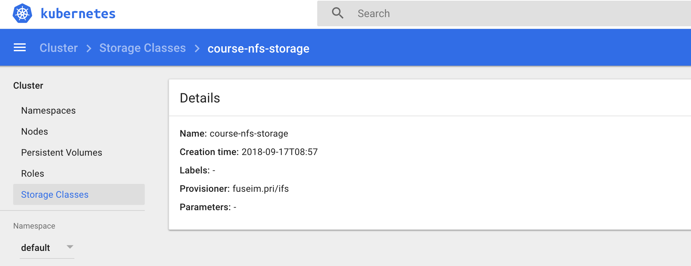

# kubernetes 持久化存储(二)
# StorageClass 的使用

前面的课程中我们学习了 `PV` 和 `PVC` 的使用方法，但是前面的 `PV` 都是静态的，什么意思？就是我要使用的一个 `PV`C 的话就必须手动去创建一个 `PV`，我们也说过这种方式在很大程度上并不能满足我们的需求，比如我们有一个应用需要对存储的并发度要求比较高，而另外一个应用对读写速度又要求比较高，特别是对于 `StatefulSet` 类型的应用简单的来使用静态的 `PV` 就很不合适了，这种情况下我们就需要用到动态 `PV`，也就是我们今天要讲解的 `StorageClass`。


## 创建 Provisioner

### 要使用 `StorageClass`，我们就得安装对应的自动配置程序，比如我们这里存储后端使用的是 `nfs`，那么我们就需要使用到一个 `nfs-client` 的自动配置程序，我们也叫它 `Provisioner`，这个程序使用我们已经配置好的 `nfs` 服务器，来自动创建持久卷，也就是自动帮我们创建 `PV`。

* 自动创建的 PV 以`${namespace}-${pvcName}-${pvName}`这样的命名格式创建在 NFS 服务器上的共享数据目录中
* 而当这个 PV 被回收后会以`archieved-${namespace}-${pvcName}-${pvName}`这样的命名格式存在 NFS 服务器上。

当然在部署`nfs-client`之前，我们需要先成功安装上 `nfs` 服务器，前面的课程中我们已经过了，服务地址是`192.168.1.138`，共享数据目录是`/data/k8s/`，然后接下来我们部署 `nfs-client` 即可，我们也可以直接参考`nfs-client` 的文档，进行安装即可。

**第一步**：配置 `Deployment`，将里面的对应的参数替换成我们自己的 `nfs` 配置（`nfs-client.yaml`）

```
kind: Deployment
apiVersion: extensions/v1beta1
metadata:
  name: nfs-client-provisioner
spec:
  replicas: 1
  strategy:
    type: Recreate
  template:
    metadata:
      labels:
        app: nfs-client-provisioner
    spec:
      serviceAccountName: nfs-client-provisioner
      containers:
        - name: nfs-client-provisioner
          image: quay.io/external_storage/nfs-client-provisioner:latest
          volumeMounts:
            - name: nfs-client-root
              mountPath: /persistentvolumes
          env:
            - name: PROVISIONER_NAME
              value: fuseim.pri/ifs
            - name: NFS_SERVER
              value: 192.168.1.138
            - name: NFS_PATH
              value: /data/k8s
      volumes:
        - name: nfs-client-root
          nfs:
            server: 192.168.1.138
            path: /data/k8s

```
**第二步**：将环境变量 `NFS_SERVER` 和 `NFS_PATH` 替换，当然也包括下面的 `nfs` 配置，我们可以看到我们这里使用了一个名为 `nfs-client-provisioner` 的`serviceAccount`，所以我们也需要创建一个 `sa`，然后绑定上对应的权限：（`nfs-client-sa.yaml`）

```
apiVersion: v1
kind: ServiceAccount
metadata:
  name: nfs-client-provisioner

---
kind: ClusterRole
apiVersion: rbac.authorization.k8s.io/v1
metadata:
  name: nfs-client-provisioner-runner
rules:
  - apiGroups: [""]
    resources: ["persistentvolumes"]
    verbs: ["get", "list", "watch", "create", "delete"]
  - apiGroups: [""]
    resources: ["persistentvolumeclaims"]
    verbs: ["get", "list", "watch", "update"]
  - apiGroups: ["storage.k8s.io"]
    resources: ["storageclasses"]
    verbs: ["get", "list", "watch"]
  - apiGroups: [""]
    resources: ["events"]
    verbs: ["list", "watch", "create", "update", "patch"]

---
kind: ClusterRoleBinding
apiVersion: rbac.authorization.k8s.io/v1
metadata:
  name: run-nfs-client-provisioner
subjects:
  - kind: ServiceAccount
    name: nfs-client-provisioner
    namespace: default
roleRef:
  kind: ClusterRole
  name: nfs-client-provisioner-runner
  apiGroup: rbac.authorization.k8s.io
```

第三步：`nfs-client` 的 `Deployment` 声明完成后，我们就可以来创建一个`StorageClass`对象了：（`nfs-client-class.yaml`)

```
apiVersion: storage.k8s.io/v1
kind: StorageClass
metadata:
  name: course-nfs-storage
provisioner: fuseim.pri/ifs # or choose another name, must match deployment's env PROVISIONER_NAME'
```

我们声明了一个名为 `course-nfs-storage` 的`StorageClass`对象，注意下面的`provisioner`对应的值一定要和上面的`Deployment`下面的 `PROVISIONER_NAME` 这个环境变量的值一样。

现在我们来创建这些资源对象吧：

```
$ kubectl create -f nfs-client.yaml
deployment "nfs-client-provisioner" created
$ kubectl create -f nfs-client-sa.yaml
serviceaccount "nfs-client-provisioner" created
clusterrole "nfs-client-provisioner-runner" created
clusterrolebinding "run-nfs-client-provisioner" created
$ kubectl create -f nfs-client-class.yaml
storageclass "course-nfs-storage" created
```

创建完成后查看下资源状态：

```
$ kubectl get pods
NAME                                      READY     STATUS    RESTARTS   AGE
nfs-client-provisioner-67c879c69d-trwjt   1/1       Running   0          1m

$ kubectl get storageclass

$ kubectl get storageclass
NAME                 PROVISIONER
course-nfs-storage   fuseim.pri/ifs
```



## 新建 `StorageClass`

上面把`StorageClass`资源对象创建成功了，接下来我们来通过一个示例测试下动态 PV，首先创建一个 PVC 对象：(`test-pvc.yaml`)

```
kind: PersistentVolumeClaim
apiVersion: v1
metadata:
  name: test-pvc
spec:
  accessModes:
  - ReadWriteMany
  resources:
    requests:
      storage: 1Mi
```
 
 我们这里声明了一个`PVC`对象，采用 `ReadWriteMany` 的访问模式，请求 `1Mi` 的空间，但是我们可以看到上面的 `PVC` 文件我们没有标识出任何和 `StorageClass` 相关联的信息，那么如果我们现在直接创建这个 PVC 对象能够自动绑定上合适的 `PV` 对象吗？显然是不能的(前提是没有合适的 `PV`)，我们这里有两种方法可以来利用上面我们创建的 `StorageClass` 对象来自动帮我们创建一个合适的 `PV`:
 
### 第一种方法：在这个`PVC`对象中添加一个声明`StorageClass`对象的标识，这里我们可以利用一个`annotations`属性来标识，如下

```
kind: PersistentVolumeClaim
apiVersion: v1
metadata:
  name: test-pvc
  annotations:
    volume.beta.kubernetes.io/storage-class: "course-nfs-storage"
spec:
  accessModes:
  - ReadWriteMany
  storageClassName: course-nfs-storage
  resources:
    requests:
      storage: 1Mi
 ```
 
 
 第二种方法：我们可以设置这个 `course-nfs-storage` 的 `StorageClass` 为 `Kubernetes` 的默认存储后端，我们可以用`kubectl patch`命令来更新： 


``` 
yaml $ kubectl patch storageclass course-nfs-storage -p '{"metadata": {"annotations":{"storageclass.kubernetes.io/is-default-class":"true"}}}'
```

上面这两种方法都是可以的，当然为了不影响系统的默认行为，我们这里还是采用第一种方法，直接创建即可：
 

```
$ kubectl get pvc
NAME         STATUS    VOLUME                                     CAPACITY   ACCESS MODES   STORAGECLASS          AGE
test-pvc     Bound     pvc-73b5ffd2-8b4b-11e8-b585-525400db4df7   1Mi        RWX            course-nfs-storage    2m
```

我们可以看到一个名为 `test-pvc` 的 `PVC` 对象创建成功了，状态已经是`Bound`了，是不是也产生了一个对应的`VOLUME` 对象，最重要的一栏是`STORAGECLASS`，现在是不是也有值了，就是我们刚刚创建的`StorageClass`对象 `course-nfs-storage`。

然后查看下 PV 对象呢：

```
$ kubectl get pv
NAME                                       CAPACITY   ACCESS MODES   RECLAIM POLICY   STATUS      CLAIM                STORAGECLASS          REASON    AGE
...
pvc-73b5ffd2-8b4b-11e8-b585-525400db4df7   1Mi        RWX            Delete           Bound       default/test-pvc     course-nfs-storage              8m
...
```
可以看到是不是自动生成了一个关联的 `PV` 对象，访问模式是`RWX`，回收策略是 `Delete`，这个 `PV` 对象并不是我们手动创建的吧，这是通过我们上面的 `StorageClass` 对象自动创建的。这就是 `StorageClass` 的创建方法。


### The problem I running to:

```
$ kubectl get pvc
NAME       STATUS    VOLUME    CAPACITY   ACCESS MODES   STORAGECLASS         AGE
test-pvc   Pending                                       course-nfs-storage   4s

$ kubectl describe pvc test-pvc
Name:          test-pvc
Namespace:     default
StorageClass:  course-nfs-storage
Status:        Pending
Volume:
Labels:        <none>
Annotations:   volume.beta.kubernetes.io/storage-class=course-nfs-storage
               volume.beta.kubernetes.io/storage-provisioner=fuseim.pri/ifs
Capacity:
Access Modes:
Events:
  Type    Reason                Age               From                         Message
  ----    ------                ----              ----                         -------
  Normal  ExternalProvisioning  8s (x2 over 18s)  persistentvolume-controller  waiting for a volume to be created, either by external provisioner "fuseim.pri/ifs" or manually created by system administrator
```

```
$ kubectl get pods

NAME                                      READY     STATUS    RESTARTS   AGE
nfs-client-provisioner-67c879c69d-mvx42   1/1       Running   0          28s

$ kubectl logs nfs-client-provisioner-67c879c69d-mvx42

I0918 02:16:20.608016       1 leaderelection.go:185] attempting to acquire leader lease  default/fuseim.pri-ifs...
E0918 02:16:20.618900       1 leaderelection.go:234] error retrieving resource lock default/fuseim.pri-ifs: endpoints "fuseim.pri-ifs" is forbidden: User "system:serviceaccount:default:nfs-client-provisioner" cannot get endpoints in the namespace "default"
```


## 测试


接下来我们还是用一个简单的示例来测试下我们上面用 `StorageClass` 方式声明的 `PVC` 对象吧：(`test-pod.yaml`)

```
kind: Pod
apiVersion: v1
metadata:
  name: test-pod
spec:
  containers:
  - name: test-pod
    image: busybox
    imagePullPolicy: IfNotPresent
    command:
    - "/bin/sh"
    args:
    - "-c"
    - "touch /mnt/SUCCESS && exit 0 || exit 1"
    volumeMounts:
    - name: nfs-pvc
      mountPath: "/mnt"
  restartPolicy: "Never"
  volumes:
  - name: nfs-pvc
    persistentVolumeClaim:
      claimName: test-pvc
```

上面这个 `Pod` 非常简单，就是用一个 `busybox` 容器，在 `/mnt` 目录下面新建一个 `SUCCESS` 的文件，然后把 `/mnt` 目录挂载到上面我们新建的 `test-pvc` 这个资源对象上面了，要验证很简单，只需要去查看下我们 `nfs` 服务器上面的共享数据目录下面是否有 `SUCCESS` 这个文件即可：

```
$ kubectl create -f test-pod.yaml
pod "test-pod" created
```
然后我们可以在 nfs 服务器的共享数据目录下面查看下数据：

```
$ ls /data/k8s/
default-test-pvc-pvc-73b5ffd2-8b4b-11e8-b585-525400db4df7
```

我们可以看到下面有名字很长的文件夹，这个文件夹的命名方式是不是和我们上面的规则：`${namespace}-${pvcName}-${pvName}`是一样的，再看下这个文件夹下面是否有其他文件：

```
$ ls /data/k8s/default-test-pvc-pvc-73b5ffd2-8b4b-11e8-b585-525400db4df7
SUCCESS
```

我们看到下面有一个 `SUCCESS` 的文件，是不是就证明我们上面的验证是成功的啊。

另外我们可以看到我们这里是手动创建的一个 `PVC` 对象，在实际工作中，使用 `StorageClass` 更多的是 `StatefulSet` 类型的服务，`StatefulSet`类型的服务我们也可以通过一个`volumeClaimTemplates`属性来直接使用 `StorageClass`，如下：(`test-statefulset-nfs.yaml`)

```
apiVersion: apps/v1beta1
kind: StatefulSet
metadata:
  name: nfs-web
spec:
  serviceName: "nginx"
  replicas: 3
  template:
    metadata:
      labels:
        app: nfs-web
    spec:
      terminationGracePeriodSeconds: 10
      containers:
      - name: nginx
        image: nginx:1.7.9
        ports:
        - containerPort: 80
          name: web
        volumeMounts:
        - name: www
          mountPath: /usr/share/nginx/html
  volumeClaimTemplates:
  - metadata:
      name: www
      annotations:
        volume.beta.kubernetes.io/storage-class: course-nfs-storage
    spec:
      accessModes: [ "ReadWriteOnce" ]
      resources:
        requests:
          storage: 1Gi

```

实际上 `volumeClaimTemplates` 下面就是一个 `PVC` 对象的模板，就类似于我们这里 `StatefulSet` 下面的 `template`，实际上就是一个 `Pod` 的模板，我们不单独创建成 `PVC` 对象，而用这种模板就可以动态的去创建了对象了，这种方式在 `StatefulSet` 类型的服务下面使用得非常多。

直接创建上面的对象：

```
$ kubectl create -f test-statefulset-nfs.yaml
statefulset.apps "nfs-web" created
$ kubectl get pods
NAME                                             READY     STATUS              RESTARTS   AGE
...
nfs-web-0                                        1/1       Running             0          1m
nfs-web-1                                        1/1       Running             0          1m
nfs-web-2                                        1/1       Running             0          33s
...
```

创建完成后可以看到上面的3个 Pod 已经运行成功，然后查看下 PVC 对象：

```
$ kubectl get pvc
NAME            STATUS    VOLUME                                     CAPACITY   ACCESS MODES   STORAGECLASS          AGE
...
www-nfs-web-0   Bound     pvc-cc36b3ce-8b50-11e8-b585-525400db4df7   1Gi        RWO            course-nfs-storage    2m
www-nfs-web-1   Bound     pvc-d38285f9-8b50-11e8-b585-525400db4df7   1Gi        RWO            course-nfs-storage    2m
www-nfs-web-2   Bound     pvc-e348250b-8b50-11e8-b585-525400db4df7   1Gi        RWO            course-nfs-storage    1m
...
```

我们可以看到是不是也生成了3个 PVC 对象，名称由模板名称 name 加上 Pod 的名称组合而成，这3个 PVC 对象也都是 绑定状态了，很显然我们查看 PV 也可以看到对应的3个 PV 对象：


```
$ kubectl get pv
NAME                                       CAPACITY   ACCESS MODES   RECLAIM POLICY   STATUS      CLAIM                   STORAGECLASS          REASON    AGE
...                                                        1d
pvc-cc36b3ce-8b50-11e8-b585-525400db4df7   1Gi        RWO            Delete           Bound       default/www-nfs-web-0   course-nfs-storage              4m
pvc-d38285f9-8b50-11e8-b585-525400db4df7   1Gi        RWO            Delete           Bound       default/www-nfs-web-1   course-nfs-storage              4m
pvc-e348250b-8b50-11e8-b585-525400db4df7   1Gi        RWO            Delete           Bound       default/www-nfs-web-2   course-nfs-storage              4m
...
```

查看 nfs 服务器上面的共享数据目录：

```
$ ls /data/k8s/
...
default-www-nfs-web-0-pvc-cc36b3ce-8b50-11e8-b585-525400db4df7
default-www-nfs-web-1-pvc-d38285f9-8b50-11e8-b585-525400db4df7
default-www-nfs-web-2-pvc-e348250b-8b50-11e8-b585-525400db4df7
...
```

是不是也有对应的3个数据目录，这就是我们的 `StorageClass` 的使用方法，

### 对于` StorageClass` 多用于 `StatefulSet` 类型的服务。

 
 

