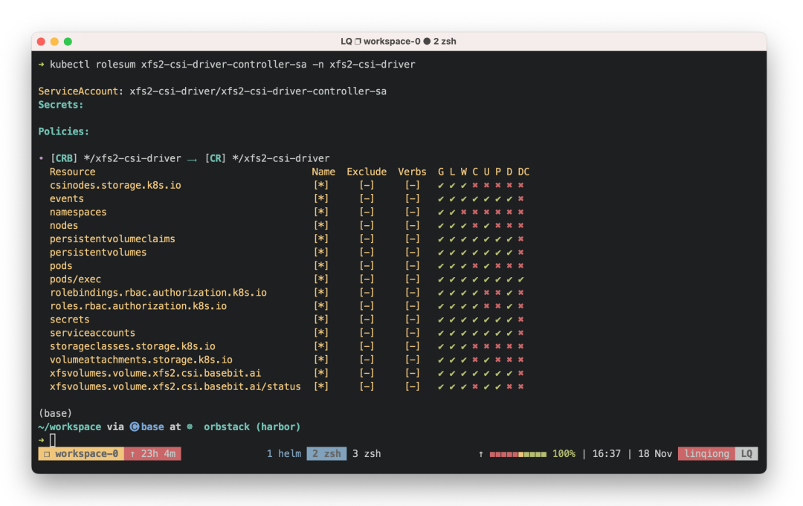
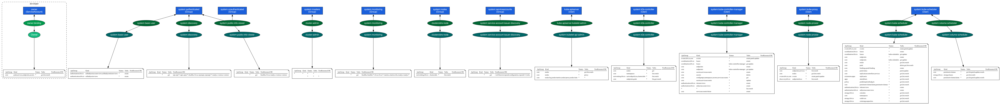
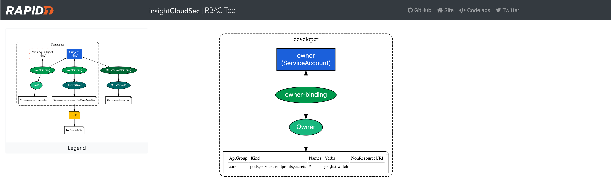

# 如何使用RBAC 辅助命令加强 K8s 安全控制

**错误配置的 RBAC 可能会导致严重的安全隐患，甚至可能让攻击者获得高级权限，从而完全控制整个集群。**

## 初始准备

在开始之前，我们在集群中创建了一个供开发者使用的命名空间 developer，并配置了必要的资源，这些步骤包括创建命名空间、服务账号、服务账号秘钥（token），以及定义了具体的角色和角色绑定：

```
# 1. 创建 namespace
kubectl create ns developer

# 2. 创建 ServiceAccount
kubectl -n developer create serviceaccount owner

# 3. 创建服务账号 token 类型的 secret
cat << EOF | kubectl apply -f -
apiVersion: v1
kind: Secret
metadata:
  name: owner-secret
  namespace: developer
  annotations:
    kubernetes.io/service-account.name: owner
type: kubernetes.io/service-account-token
EOF

# 4. 创建角色
kubectl create role Owner \
  --resource pods,services,endpoints,secrets \
  --verb get,list,watch \
  -n developer

# 5. 将这个 Owner 角色的权限授予服务账号 developer:owner
kubectl create rolebinding owner-binding \
  --role=Owner \
  --serviceaccount=developer:owner \
  -n developer
```

## `kubectl auth can-i`

`kubectl auth can-i` 是一款实用的权限检查工具，用于验证用户或服务账户是否有权限执行特定的 Kubernetes 操作

我们可以验证在初始化阶段是否正确地限制了创建 Pod 的权限

```
➜ kubectl --kubeconfig dev-config auth can-i create pod
no
```

同样，用户也可以通过以下命令，来检查自己是否在当前命名空间中拥有执行所有操作的权限：

```
➜ kubectl --kubeconfig dev-config auth can-i '*''*'
no
```

管理员还可以使用 `--as` 参数来模拟任何服务账户的权限，进一步检查权限设置：

```
$ kubectl auth can-i \
    get pods --as=system:serviceaccount:developer:owner -n developer
yes

$ kubectl auth can-i \
    create pod --as=system:serviceaccount:developer:owner -n developer
no
```

**局限性**

尽管 kubectl auth can-i 实用，但它不支持复杂查询，也不能提供完整的权限视图。

## kubectl-who-can

kubectl-who-can[1] 是一个进阶工具，扩展了 Kubernetes 的原生功能，提供了对 RBAC 策略的深入分析，帮助管理员和开发者能够快速了解谁有权限执行特定的操作。

它主要用于显示哪些主体（用户、组、服务账户等）有权限执行指定的动作（如创建、获取、删除）在特定的资源上。这是通过分析现有的 RBAC 配置来实现的。

```
brew install krew
```


### 安装

我们可以通过 Krew 非常方便的安装它

```
kubectl krew install who-can
```

### 如何使用？

例如，要找出哪些用户或服务账户有权在特定命名空间中获取 Pod，可以运行以下命令

```
$ kubectl who-can get pods -n developer
ROLEBINDING    NAMESPACE  SUBJECT  TYPE            SA-NAMESPACE
owner-binding  developer  owner    ServiceAccount  developer

CLUSTERROLEBINDING                             SUBJECT                                 TYPE            SA-NAMESPACE
cluster-admin                                  system:masters                          Group           
system:kube-scheduler                          system:kube-scheduler                   User            
system:controller:deployment-controller        deployment-controller                   ServiceAccount  kube-system
system:controller:endpoint-controller          endpoint-controller                     ServiceAccount  kube-system
system:controller:endpointslice-controller     endpointslice-controller                ServiceAccount  kube-system
system:controller:ephemeral-volume-controller  ephemeral-volume-controller             ServiceAccount  kube-system
system:controller:generic-garbage-collector    generic-garbage-collector               ServiceAccount  kube-system
system:controller:namespace-controller         namespace-controller                    ServiceAccount  kube-system
system:controller:node-controller              node-controller                         ServiceAccount  kube-system
system:controller:persistent-volume-binder     persistent-volume-binder                ServiceAccount  kube-system
system:controller:statefulset-controller       statefulset-controller                  ServiceAccount  kube-system
system:controller:pvc-protection-controller    pvc-protection-controller               ServiceAccount  kube-system
k3s-cloud-controller-manager                   k3s-cloud-controller-manager            User            kube-system
local-path-provisioner-bind                    local-path-provisioner-service-account  ServiceAccount  kube-system
system:k3s-controller                          system:k3s-controller                   User         
```

这个命令将列出所有有权限在 developer 命名空间获取 Pod 的主体（同时包括 namespace 级别和 cluster 级别）。

### kubectl-who-can 的优势

1. **深入的权限分析**： 与 K8s 自带的 `kubectl auth can-i` 相比，`kubectl-who-can` 提供了更全面的视角，不仅能告知你是否有权限，还能指出集群中谁有这些权限。
2. **安全审计**： 这个工具对于安全团队来说尤其重要，因为它有助于快速识别可能的权限过度分配。
3. **简化故障排除**： 在调试权限问题时，能够迅速找出有权限执行特定操作的所有主体，大大简化了问题解决的过程。

这对于审核权限、准备安全报告或进行故障排除非常有用。

### 局限性

尽管 `kubectl-who-can` 在权限管理和安全审计方面极为有效，但它的输出仅基于当前的 RBAC 配置。

## kubectl-rolesum

kubectl-rolesum，这是一个非常实用的第三方工具，提供了对角色和角色绑定的清晰视图。

它的主要功能是汇总和显示特定 K8s 实体（如用户、组或服务账户）的角色权限，这对于验证安全策略和进行故障排除非常重要。

```
export PATH="${KREW_ROOT:-$HOME/.krew}/bin:$PATH"

kubectl krew install rolesum
```

### 如何使用？

重新回到我们上面的用例，只要通过以下命令，它就能能够提供比标准 kubectl 命令更加详细和直观的权限视图。

```
$ kubectl rolesum owner -n developer
ServiceAccount: developer/owner
Secrets:

Policies:
• [RB] developer/owner-binding ⟶  [R] developer/Owner
  Resource   Name  Exclude  Verbs  G L W C U P D DC  
  endpoints  [*]     [-]     [-]   ✔ ✔ ✔ ✖ ✖ ✖ ✖ ✖   
  pods       [*]     [-]     [-]   ✔ ✔ ✔ ✖ ✖ ✖ ✖ ✖   
  secrets    [*]     [-]     [-]   ✔ ✔ ✔ ✖ ✖ ✖ ✖ ✖   
  services   [*]     [-]     [-]   ✔ ✔ ✔ ✖ ✖ ✖ ✖ ✖ 
```

* RB: RoleBinding
* R: Role
* CRB: ClusterRoleBinding
* CR: ClusterRole
* G: get
* L: list
* W: watch
* C: create
* U: udpate
* P: patch
* D: delete
* DC: deletecollection

**实际应用案例**

下面是一个实际应用案例截图，我们可以清晰的看到这个服务被赋予了哪些权限。




### 局限性

kubectl-rolesum 的主要优势在于其能够提供比标准 kubectl 命令更加详细和直观的权限视图。这对于管理复杂的 RBAC 策略特别有用。

但也有其局限性，就是它提供不了创建或修改这些角色的能力。

## rbac-tool

rbac-tool，这是一个强大的多功能工具，它不仅简化了 RBAC 策略的查询，还帮助我们更容易地创建和管理这些策略。

```
$ kubectl krew install rbac-tool
Updated the local copy of plugin index.
Installing plugin: rbac-tool
Installed plugin: rbac-tool
\
 | Use this plugin:
 |      kubectl rbac-tool
 | Documentation:
 |      https://github.com/alcideio/rbac-tool
/
WARNING: You installed plugin "rbac-tool" from the krew-index plugin repository.
   These plugins are not audited for security by the Krew maintainers.
   Run them at your own risk.
```

例如，要生成特定命名空间或整个集群的 RBAC 权限图，可以使用以下命令：

```
$ kubectl rbac-tool viz --outformat dot \
  && cat rbac.dot | dot -Tpng > rbac.png  && open rbac.png
[RAPID7-INSIGHTCLOUDSEC] Namespaces included '*'
[RAPID7-INSIGHTCLOUDSEC] Namespaces excluded 'kube-system'
[RAPID7-INSIGHTCLOUDSEC] Connecting to cluster ''
[RAPID7-INSIGHTCLOUDSEC] Generating Graph and Saving as 'rbac.dot'
```



这个命令会创建一个 DOT 文件，该文件可以用图形化工具（如 Graphviz）打开，展示角色和角色绑定之间的关系图。

对于前面的例子，我们也可以使用如下命令用 chrome 打开，查看 owner 的情况。




```
➜ kubectl rbac-tool viz --include-subjects=owner && open -a "Google Chrome" rbac.html
[RAPID7-INSIGHTCLOUDSEC] Namespaces included '*'
[RAPID7-INSIGHTCLOUDSEC] Namespaces excluded 'kube-system'
[RAPID7-INSIGHTCLOUDSEC] Connecting to cluster ''
[RAPID7-INSIGHTCLOUDSEC] Generating Graph and Saving as 'rbac.html'
```

效果如下所示：


### kubectl rbac-tool lookup

提供查询主体的权限：

```
$ kubectl rbac-tool lookup -e '^owner.*'
  SUBJECT | SUBJECT TYPE   | SCOPE | NAMESPACE | ROLE   
+---------+----------------+-------+-----------+-------+
  owner   | ServiceAccount | Role  | developer | Owner  
```

### rbac-tool who-can

查看谁有执行特定操作的权限，类比 kubectl-who-can 的能力：

```
➜ kubectl rbac-tool who-can get pod
  TYPE           | SUBJECT                                | NAMESPACE
+----------------+----------------------------------------+------------------------------------------------+
  Group          | system:masters                         |
  ServiceAccount | cert-manager                           | cert-manager
  ServiceAccount | deployment-controller                  | kube-system
  ServiceAccount | endpoint-controller                    | kube-system
  ServiceAccount | endpointslice-controller               | kube-system
  ServiceAccount | ephemeral-volume-controller            | kube-system
  ServiceAccount | generic-garbage-collector              | kube-system
  ServiceAccount | local-path-provisioner-service-account | kube-system
  ServiceAccount | namespace-controller                   | kube-system
  ServiceAccount | node-controller                        | kube-system
  ServiceAccount | owner                                  | developer
  ServiceAccount | persistent-volume-binder               | kube-system
  ServiceAccount | pvc-protection-controller              | kube-system
  ServiceAccount | statefulset-controller                 | kube-system
  ServiceAccount | user-sa                                | user-zone-4ef1aab6-3c45-4d37-bdb1-0b0c629b3b26
  ServiceAccount | user-sa                                | user-zone-729281f1-46e8-4d63-8ab8-cfd895923bab
  ServiceAccount | xfs2-csi-driver-controller-sa          | xfs2-csi-driver
  User           | k3s-cloud-controller-manager           | kube-system
  User           | system:k3s-controller                  |
  User           | system:kube-scheduler                  |
```

### rbac-tool policy-rules

展示详细的权限规则，类比 kubectl-rolesum 的能力，但在输出可视化上，个人觉得 kubectl-rolesum 要更加清晰一些：

```
 kubectl rbac-tool policy-rules -e '^owner'
  TYPE           | SUBJECT | VERBS | NAMESPACE | API GROUP | KIND      | NAMES | NONRESOURCEURI | ORIGINATED FROM          
+----------------+---------+-------+-----------+-----------+-----------+-------+----------------+-------------------------+
  ServiceAccount | owner   | get   | developer | core      | endpoints |       |                | Roles>>developer/Owner   
  ServiceAccount | owner   | get   | developer | core      | pods      |       |                | Roles>>developer/Owner   
  ServiceAccount | owner   | get   | developer | core      | secrets   |       |                | Roles>>developer/Owner   
  ServiceAccount | owner   | get   | developer | core      | services  |       |                | Roles>>developer/Owner   
  ServiceAccount | owner   | list  | developer | core      | endpoints |       |                | Roles>>developer/Owner   
  ServiceAccount | owner   | list  | developer | core      | pods      |       |                | Roles>>developer/Owner   
  ServiceAccount | owner   | list  | developer | core      | secrets   |       |                | Roles>>developer/Owner   
  ServiceAccount | owner   | list  | developer | core      | services  |       |                | Roles>>developer/Owner   
  ServiceAccount | owner   | watch | developer | core      | endpoints |       |                | Roles>>developer/Owner   
  ServiceAccount | owner   | watch | developer | core      | pods      |       |                | Roles>>developer/Owner   
  ServiceAccount | owner   | watch | developer | core      | secrets   |       |                | Roles>>developer/Owner   
  ServiceAccount | owner   | watch | developer | core      | services  |       |                | Roles>>developer/Owner   
```

### rbac-tool gen

生成自定义 RBAC 规则。类比 kubectl create role 和 kubectl create clusterrole，但是在灵活性和资源的指定上，在部分场景下会更加高效：

```
➜ kubectl rbac-tool gen \
  --generated-type=Role \
  --allowed-verbs=get,list,watch \
  --allowed-groups=, \
  --deny-resources=bindings.,persistentvolumeclaims.,limitranges.,events.,replicationcontrollers.,configmaps.,resourcequotas.,podtemplates.,serviceaccounts.

apiVersion: rbac.authorization.k8s.io/v1
kind: Role
metadata:
  creationTimestamp: null
  name: custom-role
  namespace: mynamespace
rules:
- apiGroups:
  - ""
  resources:
  - pods
  - secrets
  - endpoints
  - services
  verbs:
  - get
  - list
  - watch
```

**1. 最小权限原则**

在定义角色时，应遵循最小权限原则。只授予执行特定任务所需的最少权限，以最大限度地减少未授权操作的风险。这是确保安全的关键步骤。

**2. 定期审计**

定期回顾和审计集群里的 RBAC 配置，确保它们与组织的安全策略保持一致。删除不必要或过度的权限，并根据需要更新角色。这有助于维持一个清晰、安全的权限结构。

**3. 有效使用命名空间**

利用命名空间逻辑地隔离不同的团队或项目，并在命名空间级别执行 RBAC 策略。这样可以更有效地管理权限，确保不同团队或项目之间的操作隔离。

**4. 测试 RBAC 策略**

在非生产环境中彻底测试我们的 RBAC 策略，确保它们按预期工作，然后再应用到生产集群中。这是防止潜在问题影响生产环境的重要一步。

