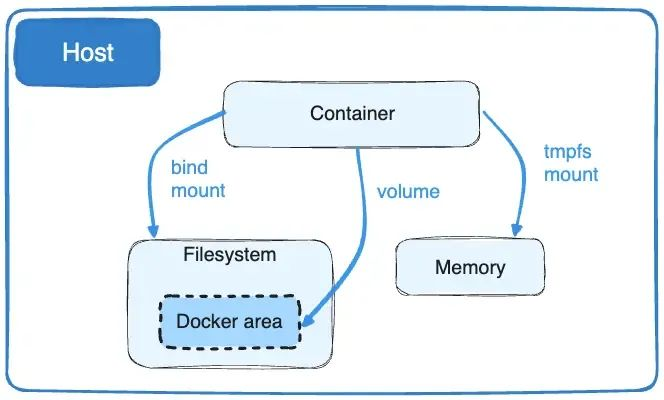
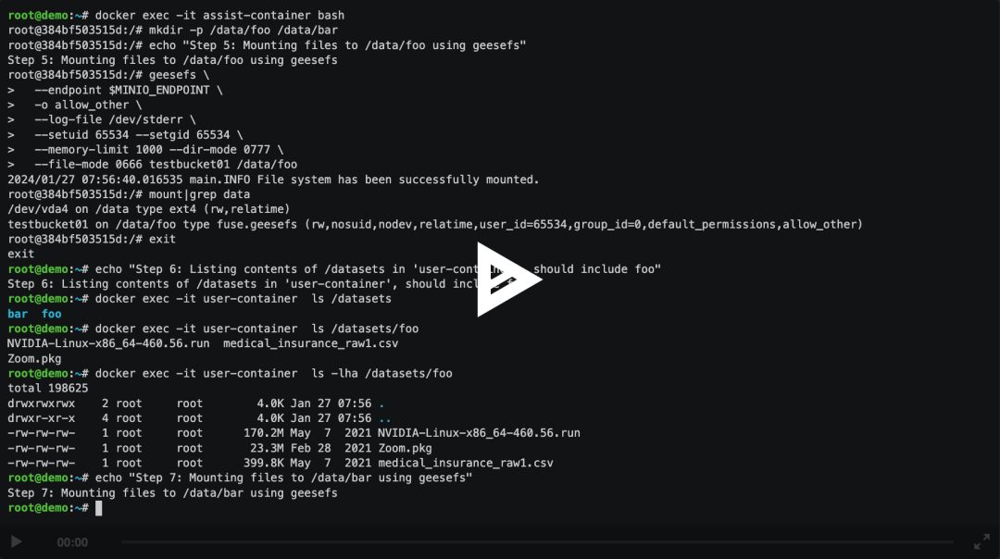
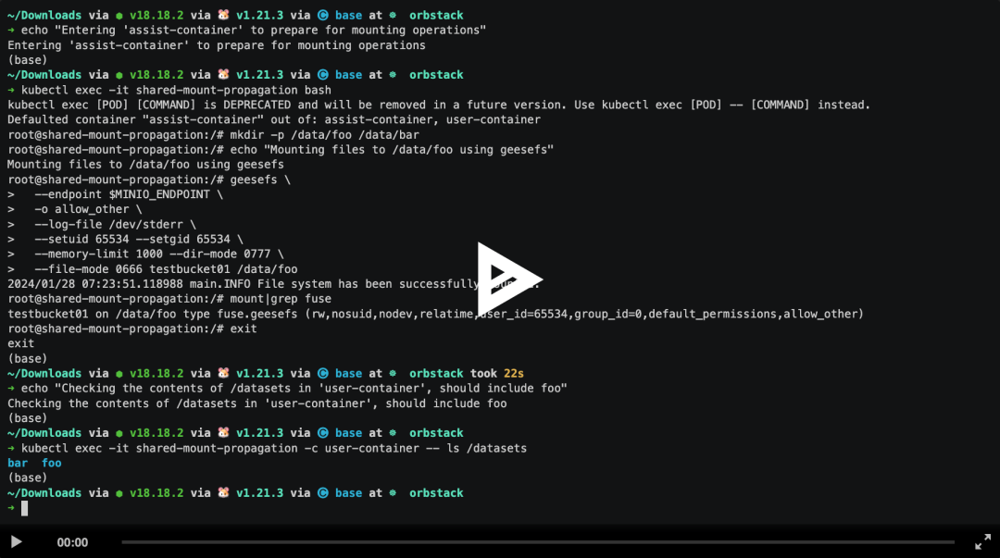

# 2024 引入动态挂载卷，实现工作负载运行时的存储灵活性

在 Kubernetes 生态中，工作负载一旦配置了持久卷声明（PVC），通常就无法在运行后更改已挂载的存储。

这一限制对于追求高效和灵活性的用户来说，无疑是一个痛点。

**我们在处理海量数据的任务时，突发的存储需求增加，或者需要接入额外的第三方存储服务。传统的解决方案是需要停止实例，并重新配置存储选项，这种做法不仅耗时，而且会引起服务的暂停。**

## 容器存储挂载的探索

Kubernetes 项目它的本质是一个容器编排工具，所以我们不妨先来看下在容器里能否做到这一点？

### 挂载类型

Dcoker 它默认支持三种存储挂载类型：**`bind(--mount type=bind) 、volume(--mount type=volume)` 和 `tmpfs(--mount type=tmpfs)`**，如下图所示：



其中 `tmpfs mounts` 类型它将数据存储在宿主机的内存中，而不是磁盘。这意味着数据的读写速度非常快，但是一旦容器停止，数据就会丢失，所以它不属于持久化的范畴，这里我们不需要关注。


**而 volumes 类型是由 Docker 自身维护和管理，它是一种更加隔离的存储方式**。即便容器被删除，通过 volumes 保存的数据也能得到保留，适用于需要持久化存储数据的应用，它是 Docker 里一个抽象的概

**最后我们来看下 bind mounts 类型，这是最直接的存储方式，将宿主机上的某个目录或文件直接映射到容器中的指定路径，它是直接与原生文件系统做对接**。

## 配置挂载传播

在 Docker 中，Bind propagation 定义了挂载点在宿主机和容器间的共享行为。这个高级功能适用于复杂的挂载场景，特别是在需要容器间共享挂载的情况下。

以下是 Docker 中挂载传播类型的简要说明：

* **`private`: 挂载点是私有的**。宿主机上的挂载点不会传播到容器，同样容器中的挂载也不会传播到宿主机或其他容器。
* **`rshared`: 挂载点是共享的**。在宿主机上进行的挂载或卸载操作会传播到容器内，同时容器内的挂载或卸载操作也会传播到宿主机及所有使用相同挂载点的容器。
* **`shared`: 类似于 rshared，但是限制更多**。挂载点的传播仅限于在挂载点上明确创建的那些挂载。
* **`slave`: 挂载点是从属的**。**宿主机上的挂载会传播到容器内，但容器内的挂载不会传播到宿主机或其他容器。**
* **`rslave`: 类似于 slave，但是传播是递归的**，这意味着所有的挂载和卸载操作都会从宿主机传播到容器，但容器内的操作不会反向传播。

要设置挂载传播，我们可以在使用 `docker run` 命令时，通过 `--mount` 标志的 `bind-propagation` 选项来指定，例如：

```
docker run -d \
  -it \
  --name devtest \
  --mount type=bind,source="$(pwd)"/target,target=/app,bind-propagation=rshared \
  nginx:latest
```


**`bind-propagation=rshared`**

这将创建一个名为 devtest 的容器，其中宿主机上的 `"$(pwd)"/target` 目录以 `rshared` 传播模式挂载到容器内的 `/app `目录。这意味着任何在宿主机上对 `"$(pwd)"/target` 的挂载变更都会传播到容器内，反之亦然。

### 实践案例

假设有一个业务容器: `user-container`，**我们希望在容器启动后，可以在容器内的 `/datasets` 目录下，随时动态的添加或删除任意数据集**。

```
# 业务容器
docker run -d -it \
  --name user-container \
  -v "$(pwd)"/datasets:/datasets:slave \
  lqshow/busybox-curl:1.28
```

**如果仅仅使用单纯的 Docker 卷挂载命令是无法达到动态管理的目的的。这是因为标准的 Docker 挂载通常是静态的，一旦创建，就不能再改变挂载点内容而不重启容器**。


**为了实现这一需求，我们可以创建一个辅助容器：`assist-container`，内部使用了 Geesefs 文件系统和 rshared 挂载传播类型。**

这里的关键点在于 rshared，它允许挂载点的变化在宿主机和所有共享该挂载点的容器之间传播。如下所示：

```
# 辅助容器
docker run -d -it \
  --privileged \
  --name assist-container \
  -v ~/.aws:/root/.aws \
  -v "$(pwd)"/datasets:/data:rshared \
  lqshow/debian-with-geesefs:0.0.1
```

下面有两个要点我们需要特别的注意

* 必须给与 `--privileged` 权限，确保了辅助容器有足够的权限执行 FUSE 文件系统的挂载操作，这对于 `geesefs `来说是必需的。
* 然后，将宿主机的上的 `"$(pwd)"/datasets` 目录以 `rshared` 传播模式挂载到辅助容器的 `/data` 目录

**当 geesefs 在辅助容器的 `/data` 目录下挂载或卸载数据集时，由于挂载点的传播属性，这些变化也会同步到业务容器的 `/datasets` 目录中。**

这种方法无需重启业务容器，就可以灵活地管理数据集，为动态数据管理提供了有效的解决方案。




我们通过容器间的挂载传播和 FUSE 文件系统，不仅解决了数据动态挂载的问题，还创造了可扩展的存储模式，适应复杂场景。这体现了容器技术在应用部署和管理的灵活性和实力，特别是在云原生环境中的重要性。


## Kubernetes 中的挂载传播


Kubernetes 在处理卷的挂载传播时提供了与 Docker 相似的机制，但更加集成于其自身的声明式配置中。

**<mark>`mountPropagation` 属性，作为volumeMounts 的一部分，它定义了 Pod 容器之间以及容器与宿主机之间卷的挂载传播行为。</mark>**

```
➜ kubectl explain pod.spec.containers.volumeMounts.mountPropagation

```

**简而言之，挂载传播允许将容器挂载的卷共享给同一 Pod 中的其他容器，甚至同一节点上的其他 Pod**。

### 理解 Mount Propagation


在 Kubernetes 中，mountPropagation 属性允许开发者精确控制挂载点如何在 Pod 内的容器间以及与宿主机间传播，具体选项如下：

* **None: 相当于 Docker 的 private，挂载是完全私有的，确保挂载点的隔离，避免任何外部影响**。
* **HostToContainer: 类似于 Docker 的 slave 或 rslave，允许挂载从宿主机传播到容器，实现单向的挂载传播**。
* **Bidirectional: 对应 Docker 的 rshared 或 shared，实现从宿主机到容器的双向挂载传播，需在安全上下文中启用特权模式。**

### 实践案例


结合上面提到的场景，如果我们想要在 Kubernetes 中实现类似的动态挂载能力，我们可以在定义 Pod 的时候，**为 volumeMounts 设置 mountPropagation 为 Bidirectional**。


**这样，我们就可以在 Pod 的一个辅助容器中使用类似 geesefs 的文件系统来动态挂载数据，这些挂载的变化会传播到所有共享同一 Volume 的容器中**。

以下是一个具体的 Pod 配置示例：

```
apiVersion: v1
kind: Pod
metadata:
  name: shared-mount-propagation
spec:
  restartPolicy: Always
  volumes:
  - name: shared-volume
    emptyDir: {}

  containers:
  - name: assist-container
    image: lqshow/debian-with-geesefs:0.0.1
    stdin: true
    tty: true
    securityContext:
      privileged: true
    volumeMounts:
    - name: shared-volume
      mountPath: /data
      mountPropagation: Bidirectional

  - name: user-container
    image: lqshow/busybox-curl:1.28
    stdin: true
    tty: true
    volumeMounts:
    - name: shared-volume
      mountPath: /datasets
      mountPropagation: HostToContainer
```


在这个配置中，`assist-container` 作为辅助容器，使用 `Bidirectional` 挂载传播，允许它对共享卷 `/data` 进行管理。

所有挂载或卸载操作会同步到 `user-container `的 `/datasets` 目录，实现了高效的动态数据管理。


这里我们利用的是**同一个 Pod 内的多个容器可以声明共享同一个 Volume，同时利用 Kubernetes 提供的 Mount propagation 的能力，任何带有 Bidirectional 挂载传播的 Pod 挂载到同一个卷上，带有 HostToContainer 挂载传播的容器将会看到它。**


这就为 Kubernetes 用户提供了与 Docker 类似的挂载传播功能，使得在云原生环境中处理动态存储需求变得更加灵活和高效。




有了初始的动态挂载架构后，我们可以进一步扩展和优化这个方案，将其发展成一个更为成熟和灵活的服务。具体来说，我们可以将 assist-container 辅助容器转变为一个功能更全面的 gRPC 服务。

通过定义专门的 gRPC 接口（如 Mount 和 Umount），我们可以实现更细粒度的存储资源管理，业务容器可以按需动态挂载或卸载存储资源，提升系统的灵活性和扩展性

**业务容器可以通过定义的 gRPC 接口与 assist-container 交互**，实现存储资源的动态管理。这种方式的优点是：

* 灵活性和扩展性: 业务容器可以根据实际需求，在运行时动态地添加或移除存储资源，而无需重启或重新部署。
* 解耦和模块化: 通过 gRPC 接口，业务逻辑与存储管理逻辑相互独立，提高了系统的模块化程度和可维护性。