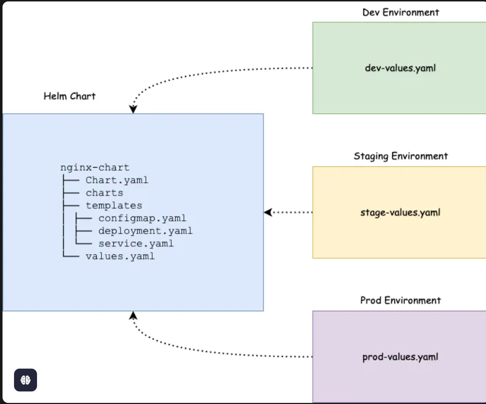
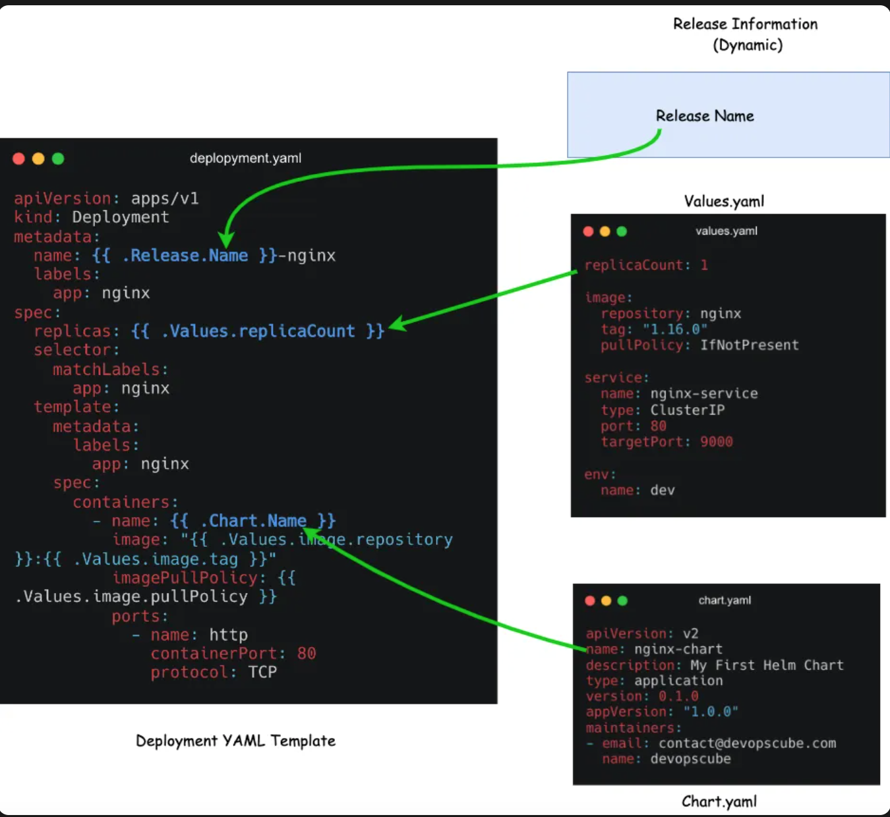
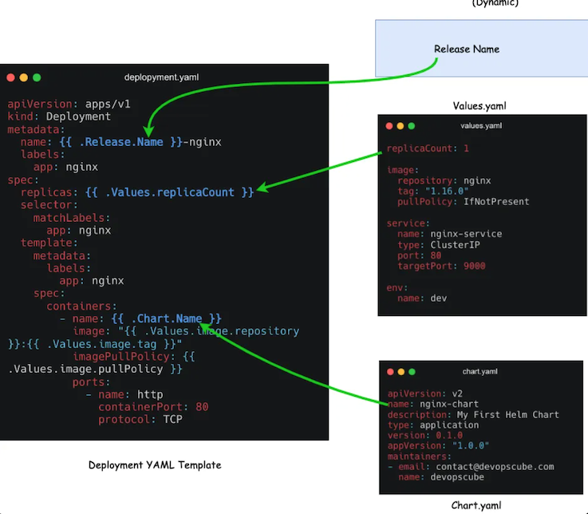
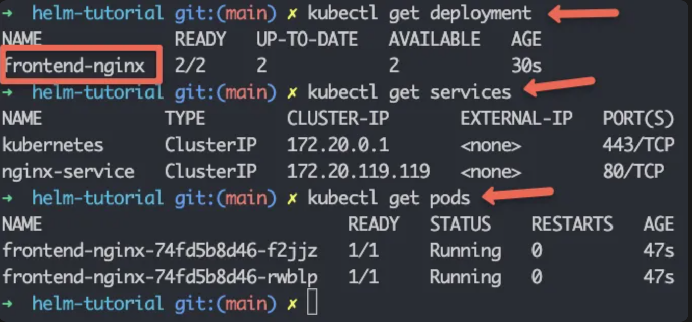
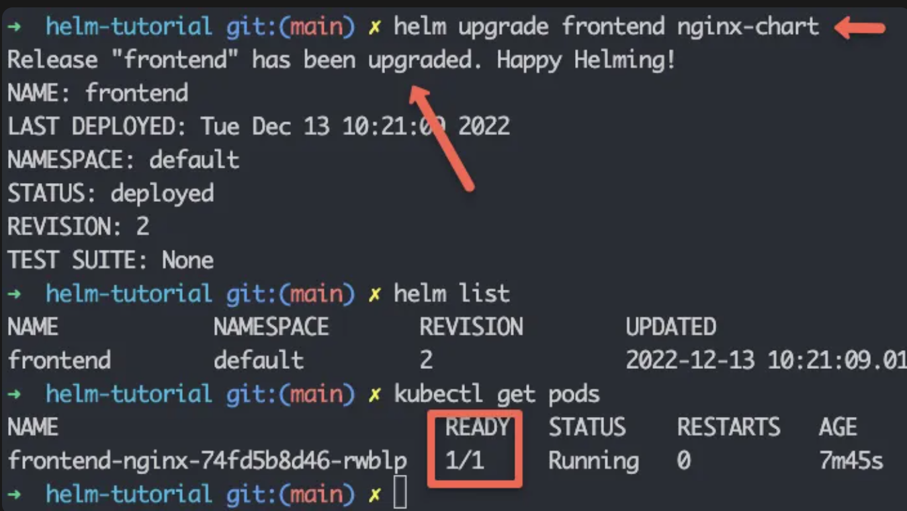
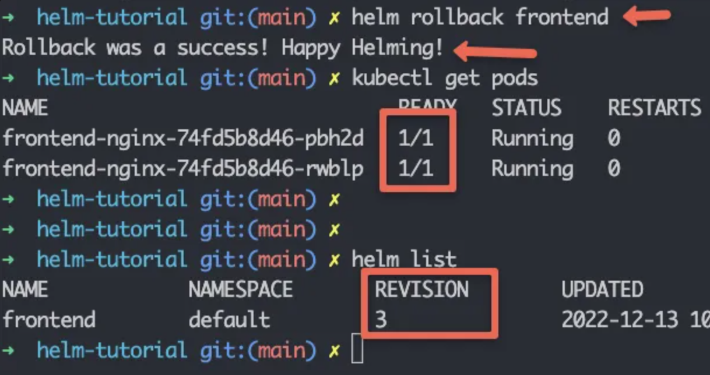

# Helm Chart 教程，K8s 必备知识（2024）

## 先决条件

要开始使用 Helm Chart，您需要具备以下条件。

* 一个正在运行的 Kubernetes 集群
* Helm 安装在您的工作站上
* 用于连接到集群的有效 kubeconfig
* 具备 Kubernetes 和 YAML 的工作知识。

## 什么是 Helm Chart？

假设您的项目中有四种不同的环境。Dev、QA、Staging 和 Prod。每个环境都会有不同的 Nginx 部署参数。例如

* 在 Dev 和 QA 环境，您可能只需要一个副本
* 在 Staging 和 Prod 环境，您将拥有更多具有 pod 自动缩放功能的副本
* 每个环境中的入口路由规则都会有所不同
* 每个环境的配置和 secret 都会不同

由于每个环境的配置和部署参数都会发生变化，因此您需要为每个环境维护不同的Nginx部署文件。或者您将有一个部署文件，并且需要编写自定义 shell 或 python 脚本来根据环境替换值。然而，这不是一种可扩展的方法。这就是 Helm Chart 发挥作用的地方



Helm Chart 是 Kubernetes YAML 清单模板和 Helm 特定文件的组合。您可以将其称为 helm 包。

由于 Kubernetes YAML 清单可以模板化，因此您不必维护不同环境的多个 Helm Chart。 Helm 使用 go 模板引擎来实现模板功能

您只需要一个 Helm Chart，并且只需更改单个值文件即可修改每个环境的部署参数。Helm 将负责将这些值应用到模板。我们将在接下来的部分中详细了解它。

在较高的层面上，Helm Charts 降低了复杂性，并且 kubernetes 仅用一个模板就体现了每个环境(dev, uat, cug, prod)的冗余。

### Helm Chart 结构

为了理解 Helm Chart，我们以 Nginx 部署为例。要在 Kubernetes 上部署 Nginx，通常您将拥有以下 YAML 文件。

```
nginx-deployment
    ├── configmap.yaml
    ├── deployment.yaml
    ├── ingress.yaml
    └── service.yaml
```

现在，如果我们为上述 Nginx 部署创建一个 Helm Chart，它将具有以下目录结构。

```
nginx-chart/
|-- Chart.yaml
|-- charts
|-- templates
|   |-- NOTES.txt
|   |-- _helpers.tpl
|   |-- deployment.yaml
|   |-- configmap.yaml
|   |-- ingress.yaml
|   |-- service.yaml
|   `-- tests
|       `-- test-connection.yaml
`-- values.yaml
```

如您所见，部署 YAML 文件是模板目录的一部分（以粗体突出显示），并且有特定于 helm 的文件和文件夹。让我们看看 Helm Chart 中的每个文件和目录并了解其重要性。

* `.helmignore`：它用于定义我们不想包含在 helm 图表中的所有文件。它的工作原理与 `.gitignore` 文件类似。

* `Chart.yaml`：它包含有关 Helm Chart 的信息，如版本、名称、描述等。

* value.yaml：在此文件中，我们定义 YAML 模板的值。例如，镜像名称、副本计数、HPA 值等。正如我们之前所解释的，每个环境中只有 `values.yaml `文件会发生变化。此外，您可以动态覆盖这些值，或者在安装图表时使用 `--values` 或 `--set `命令覆盖这些值。

* `charts`：如果我们的主图表对其他图表有一定的依赖性，我们可以在此目录中添加另一个图表的结构。默认情况下该目录是空的。

* `templates`：该目录包含构成应用程序的所有 Kubernetes 清单文件。这些清单文件可以被模板化以访问 `values.yaml` 文件中的值。 Helm 为 Kubernetes 对象创建一些默认模板，例如 `deployment.yaml`、`service.yaml` 等，我们可以直接使用、修改或用我们的文件覆盖它们。

* **`templates/NOTES.txt`：这是一个纯文本文件，在成功部署 chart 后打印出来。**

* **`templates/_helpers.tpl`：该文件包含多个方法和子模板。这些文件不会呈现给 Kubernetes 对象定义，但可以在其他图表模板中随处使用**。

* **`templates/tests/`：我们可以在图表中定义测试，以验证图表在安装后是否按预期工作**。

## Helm Chart 教程的 Github repo

本 Helm Chart 教程中使用的示例 Helm Chart 和清单托管在 Helm Chart Github repo 上。您可以克隆它并使用它来遵循指南。

```
git clone https://github.com/techiescamp/helm-tutorial.git
```

## 从头开始创建 Helm Chart

为了亲自创建 Helm Chart，让我们从头开始创建一个 Nginx Helm Chart 。

执行以下命令来创建图表样板。它使用默认文件和文件夹创建一个名为 nginx-chart 图表。

```
helm create nginx-chart
```

如果检查创建的图表，它将具有以下文件和目录。

```
nginx-chart
│   ├── Chart.yaml
│   ├── charts
│   ├── templates
│   │   ├── NOTES.txt
│   │   ├── _helpers.tpl
│   │   ├── deployment.yaml
│   │   ├── hpa.yaml
│   │   ├── ingress.yaml
│   │   ├── service.yaml
│   │   ├── serviceaccount.yaml
│   │   └── tests
│   │       └── test-connection.yaml
│   └── values.yaml
```

让我们进入生成的图表目录。

```
cd nginx-chart
```

### Chart.yaml


如上所述，我们将图表的详细信息放在 Chart.yaml 文件中。将 chart.yaml 的默认内容替换为以下内容。

```
apiVersion: v2
name: nginx-chart
description: My First Helm Chart
type: application
version: 0.1.0
appVersion: "1.0.0"
maintainers:
- email: contact@devopscube.com
  name: devopscube
```

* apiVersion：这表示 Chart API 版本。 v2 适用于 Helm 3，v1 适用于以前的版本。
* name：表示图表的名称。
* description：表示 Helm Chart 的描述。
* type：Chart 类型可以为 application 或 library。application chart 用于部署应用程序，library chart 可重复使用，可以与其他 Chart 一起使用。与编程中库的类似概念。
* version：Chart 版本。
* appVersion：这表示我们的应用程序（Nginx）的版本号。
* maintainers：有关图表所有者的信息。

每次对应用程序进行更改时，我们都应该增加 version 和 appVersion 。还有一些其他字段，例如依赖项、图标等。

### templates

Helm 创建的 templates 目录中有多个文件。在我们的例子中，我们将进行简单的 Kubernetes Nginx 部署。

让我们从模板目录中删除所有默认文件。

```
rm -rf templates/*
```
我们将添加 Nginx YAML 文件并将其更改为模板以便更好地理解。创建 deployment.yaml 文件并复制以下内容。

```
apiVersion: apps/v1
kind: Deployment
metadata:
  name: release-name-nginx
  labels:
    app: nginx
spec:
  replicas: 1
  selector:
    matchLabels:
      app: nginx
  template:
    metadata:
      labels:
        app: nginx
    spec:
      containers:
        - name: nginx-chart
          image: "nginx:1.16.0"
          imagePullPolicy: IfNotPresent
          ports:
            - name: http
              containerPort: 80
              protocol: TCP
          volumeMounts:
            - name: nginx-index-file
              mountPath: /usr/share/nginx/html/
      volumes:
        - name: nginx-index-file
          configMap:
          	 name: index-html-configmap
```

如果您看到上面的 YAML 文件，则这些值是静态的。 Helm Chart 的想法是对 YAML 文件进行模板化，以便我们可以通过动态地为它们分配值来在多个环境中重用它们。

要模板化一个值，您所需要做的就是在大括号内添加对象参数，如下所示。它称为模板指令，语法遵从 Go 模板。

```
{{ .Object.Parameter }}
```

首先我们来了解一下什么是对象。以下是我们将在本示例中使用的三个对象。

Release：每个 Helm Chart 都将使用发 release name 进行部署。如果要在模板内使用 release name 或访问与发布相关的动态值，可以使用发布对象。

Chart：如果您想使用在Chart.yaml中提到的任何值，您可以使用图表对象。

Values：values.yaml 文件中的所有参数都可以使用 Values 对象进行访问。

要了解有关支持的对象的更多信息，请查看 Helm 内置对象 文档。

下图显示了如何在模板内替换内置对象。



首先，您需要弄清楚哪些值可以改变或者您想要模板化哪些值。我选择 name, replicas, container name, image, imagePullPolicy 和 configMap Name 等

* `name: {{ .Release.Name }}-nginx`：我们每次都需要更改部署名称，因为 Helm 不允许我们安装同名的版本。因此，我们将使用版本名称模板化部署名称，并随之插入` -nginx`。现在，如果我们使用名称 frontend 创建一个版本，则部署名称将为frontend-nginx。这样，我们就能保证名称的唯一性。

* `container name: {{ .Chart.Name }}`：对于容器名称，我们将使用 Chart 对象并使用 Chart.yaml 中的 Chart 名称作为容器名称。

* `Replicas: {{ .Values.replicaCount }}` 我们将从 values.yaml 文件中访问副本数量的值。

* `image: {{ .Values.image.repository }}:{{ .Values.image.tag }}`：我们在一行中使用多个模板指令，并从 Values 文件中访问 image 下的 repository 和 tag 信息。

* 配置映射名称：`{{ .Release.Name }}-index-html-configmap` 这里我们将发布名称添加到配置映射中。

同样，您可以在 YAML 文件中模板化所需的值。

这是应用模板后的最终 deployment.yaml 文件。将部署文件内容替换为以下内容。

```
apiVersion: apps/v1
kind: Deployment
metadata:
  name: {{ .Release.Name }}-nginx
  labels:
    app: nginx
spec:
  replicas: {{ .Values.replicaCount }}
  selector:
    matchLabels:
      app: nginx
  template:
    metadata:
      labels:
        app: nginx
    spec:
      containers:
        - name: {{ .Chart.Name }}
          image: "{{ .Values.image.repository }}:{{ .Values.image.tag }}"
          imagePullPolicy: {{ .Values.image.pullPolicy }}
          ports:
            - name: http
              containerPort: 80
              protocol: TCP
          volumeMounts:
            - name: nginx-index-file
              mountPath: /usr/share/nginx/html/
      volumes:
        - name: nginx-index-file
          configMap:
            name: {{ .Release.Name }}-index-html-configmap
```
```
apiVersion: v1
kind: Service
metadata:
  name: {{ .Release.Name }}-service
spec:
  selector:
    app.kubernetes.io/instance: {{ .Release.Name }}
  type: {{ .Values.service.type }}
  ports:
    - protocol: {{ .Values.service.protocol | default "TCP" }}
      port: {{ .Values.service.port }}
      targetPort: {{ .Values.service.targetPort }}
```

竖线（`|`）用于定义协议的默认值为TCP。这意味着，如果我们不在 `values.yaml` 文件中定义协议值或者它为空，它将采用TCP作为协议的默认值。

创建 configmap.yaml 并向其中添加以下内容。在这里，我们将默认的 Nginx index.html 页面替换为自定义 HTML 页面。此外，我们添加了一个模板指令来替换 HTML 中的环境名称。

```
kind: ConfigMap
metadata:
  name: {{ .Release.Name }}-index-html-configmap
  namespace: default
data:
  index.html: |
    <html>
    <h1>Welcome</h1>
    </br>
    <h1>Hi! I got deployed in {{ .Values.env.name }} Environment using Helm Chart </h1>
    </html>    
```

### values.yaml

values.yaml 用于存储各种变量，这些变量可以在模板文件中引用。比如 `Values.image.repository` 就是 `values.yaml` 中的 `image.repository` 的值。

现在，将默认的values.yaml内容替换为以下内容。

```
replicaCount: 2

image:
  repository: nginx
  tag: "1.16.0"
  pullPolicy: IfNotPresent

service:
  name: nginx-service
  type: ClusterIP
  port: 80
  targetPort: 9000

env:
  name: dev
```

现在我们已经准备好了 Nginx Helm Chart，最终的 Helm Chart 结构如下所示。

```
nginx-chart
├── Chart.yaml
├── charts
├── templates
│   ├── configmap.yaml
│   ├── deployment.yaml
│   └── service.yaml
└── values.yaml
```

让我们进入生成的图表目录。

```
cd nginx-chart
```

我们将根据我们的部署要求一一编辑这些文件。


## Chart.yaml

如上所述，我们将图表的详细信息放在 Chart.yaml 文件中。将 chart.yaml 的默认内容替换为以下内容。

```
apiVersion: v2
name: nginx-chart
description: My First Helm Chart
type: application
version: 0.1.0
appVersion: "1.0.0"
maintainers:
- email: contact@devopscube.com
  name: devopscube
```

* apiVersion：这表示 Chart API 版本。 v2 适用于 Helm 3，v1 适用于以前的版本。
* name：表示图表的名称。
* description：表示 Helm Chart 的描述。
* **type：Chart 类型可以为 application 或 library**。application chart 用于部署应用程序，library chart 可重复使用，可以与其他 Chart 一起使用。与编程中库的类似概念。
* version：Chart 版本。
* appVersion：这表示我们的应用程序（Nginx）的版本号。
* maintainers：有关图表所有者的信息。

**每次对应用程序进行更改时，我们都应该增加 version 和 appVersion** 。还有一些其他字段，例如依赖项、图标等。

### templates

Helm 创建的 templates 目录中有多个文件。在我们的例子中，我们将进行简单的 Kubernetes Nginx 部署。

让我们从模板目录中删除所有默认文件。

```
rm -rf templates/*
```

我们将添加 Nginx YAML 文件并将其更改为模板以便更好地理解。创建 deployment.yaml 文件并复制以下内容。

```
apiVersion: apps/v1
kind: Deployment
metadata:
  name: release-name-nginx
  labels:
    app: nginx
spec:
  replicas: 1
  selector:
    matchLabels:
      app: nginx
  template:
    metadata:
      labels:
        app: nginx
    spec:
      containers:
        - name: nginx-chart
          image: "nginx:1.16.0"
          imagePullPolicy: IfNotPresent
          ports:
            - name: http
              containerPort: 80
              protocol: TCP
          volumeMounts:
            - name: nginx-index-file
              mountPath: /usr/share/nginx/html/
      volumes:
        - name: nginx-index-file
          configMap:
            name: index-html-configmap
```

如果您看到上面的 YAML 文件，则这些值是静态的。 Helm Chart 的想法是对 YAML 文件进行模板化，以便我们可以通过动态地为它们分配值来在多个环境中重用它们。

要模板化一个值，您所需要做的就是在大括号内添加对象参数，如下所示。它称为模板指令，语法遵从 Go 模板。

```
{{ .Object.Parameter }}
```

首先我们来了解一下什么是对象。以下是我们将在本示例中使用的三个对象。

* **Release**：每个 `Helm Chart ` 都将使用发 `release name` 进行部署。如果要在模板内使用 `release name` 或访问与发布相关的动态值，可以使用发布对象。
* `Chart`：如果您想使用在`Chart.yaml`中提到的任何值，您可以使用图表对象。
* `Values`：`values.yaml `文件中的所有参数都可以使用 Values 对象进行访问。


要了解有关支持的对象的更多信息，请查看 Helm 内置对象 文档。

下图显示了如何在模板内替换内置对象。



## 验证 Helm Chart

现在为了确保我们的 Chart 有效并且所有缩进都正常，我们可以运行以下命令。当然，这需要您在 chart 目录中运行。

```
helm lint .
```

如果您从 nginx-chart 目录外部执行它，请提供 nginx-chart 的完整路径：

```
helm lint /path/to/nginx-chart
```
如果没有错误或问题，则会显示此结果：

```
==> Linting ./nginx
[INFO] Chart.yaml: icon is recommended

1 chart(s) linted, 0 chart(s) failed
```

要验证模板中的值是否被替换，您可以使用以下命令呈现带有值的模板化 YAML 文件。它将生成并显示带有替换值的所有清单文件。

```
helm template .
```

我们还可以使用 `--dry-run` 命令来检查。这将假装将图表安装到集群中，如果出现问题，它将显示错误。

```
helm install --dry-run my-release nginx-chart
```

## 部署 Helm Chart

当您部署Chart时，Helm将从values.yaml文件中读取Chart和配置值并生成清单文件。然后它将这些文件发送到 Kubernetes API 服务器，Kubernetes 将在集群中创建请求的资源。

现在我们准备安装Chart了。确保从helm-chart文件夹外部的目录运行 Helm 命令。执行以下命令，其中frontend是版本名称， nginx-chart是Chart名称。它在默认命名空间中安装`nginx-chart`。

```
helm install frontend nginx-chart
```

```
NAME: frontend
LAST DEPLOYED: Wed Jun 19 11:12:20 2024
NAMESPACE: default
STATUS: deployed
REVISION: 1
TEST SUITE: None
```

现在您可以使用以下命令检查发布列表：您也可以使用ls代替list：

```
helm list
```

运行 kubectl 命令来检查 Deployment、Service 和 Pod。

```
kubectl get deployment
kubectl get services
kubectl get configmap
kubectl get pods
```

我们可以看到部署frontend-nginx 、 nginx-service和 pod 已启动并正在运行，如下所示。



我们讨论了如何使用不同的values.yaml文件将单个 Helm Chart 用于多个环境。要使用外部values.yaml文件安装 Helm Chart，您可以使用以下命令以及–values标志和值文件的路径

```
helm install frontend nginx-chart --values env/prod-values.yaml
```

当您将 Helm 作为 CI/CD 管道的一部分时，您可以编写自定义逻辑来根据环境传递所需的值文件。


## Helm 升级与回滚


现在假设您要修改图表并安装更新版本，我们可以使用以下命令：

```
helm upgrade frontend nginx-chart
```

例如，我们将副本从 2 个更改为 1 个。您可以看到修订号为 2，并且只有 1 个 pod 正在运行。



```
helm rollback frontend
```

上述命令会将 helm 版本回滚到上一个版本。




回滚后，我们可以看到 2 个 Pod 又开始运行了。请注意，Helm 将回滚视为新修订版，这就是我们将修订版设为 3 的原因。

如果我们想回滚到特定版本，我们可以这样输入修订号。

```
helm rollback <release-name> <revision-number>
```

例如，

```
helm rollback frontend 2
```

## 卸载 Helm 版本

要卸载 helm 版本，请使用 uninstall 命令。它将删除与图表的最后版本关联的所有资源。

```
helm uninstall frontend
```

如果您已在特定命名空间中部署了该版本，则可以使用卸载命令传递命名空间标志，如下所示。

```
helm uninstall <release-name> --namespace <namespace>
```

## 打包 Helm Chart

我们可以打包 Chart 并将其部署到 Github、S3 或任何 Chart 存储库。执行以下命令打包 nginx-chart。

```
helm package chart-name/
```

例如，

```
helm package nginx-chart

Successfully packaged chart and saved it to: /home/vagrant/helm-tutorial/nginx-chart-0.1.0.tgz
```

当您打包它时，它遵循 semver 2 版本指南。


## 调试 Helm Chart

我们可以使用以下命令来调试 helm charts 和 templates。

* `helm lint`: 此命令接收图表的路径并运行一系列测试来验证图表的格式是否正确
* `helm get values`: 此命令将输出安装到集群的版本值。
* `helm install –dry-run`: 使用此功能我们可以检查所有资源清单并确保所有模板都正常工作。
* `helm get manifest`: 此命令将输出集群中正在运行的清单。
* `helm diff`: 它将输出两个修订版之间的差异。

```
helm diff revision nginx-chart 1 2
```


## Helm Chart 可能的错误

如果您尝试安装已存在的 Helm 软件包，您将收到以下错误。

```
Error: INSTALLATION FAILED: cannot re-use a name that is still in use
```

要更新或升级版本，您需要运行升级命令。

如果您尝试从其他位置安装 Chart 而不给出 Chart 的绝对路径，您将收到以下错误。

```
Error: non-absolute URLs should be in form of repo_name/path_to_chart
```

要纠正此问题，您应该从图表所在的目录执行 helm 命令，或者提供图表目录的绝对路径或相对路径。

## Helm Chart

以下是开发 Helm Chart 时应遵循的一些最佳实践。

* 通过添加注释和 README 来记录您的 Chart，因为文档对于确保可维护的 Helm Chart 至关重要。
* 我们应该根据对象的种类（即 deployment, service, secret, ingress 等）来命名 Kubernetes 清单文件。 
* 图表名称仅使用小写，如果超过一个单词，则用连字符 (-) 分隔。
* 在 values.yaml 文件中，字段名称应为小写。
* 始终将字符串值括在引号之间。
* 使用 Helm 版本 3 进行更简单、更安全的发布。


## Helm 命令总结备忘

```
# 将 Helm Chart 安装到 Kubernetes 集群上。
helm install <release-name> <chart-path-or-name>

# 使用新的图表更改或更新的值更新现有的 Helm 版本。
helm upgrade <release-name> <chart-path-or-name>

# 将 Helm 版本回滚到之前的版本。
helm rollback <release-name> <revision-number>

# 针对您的版本运行 Helm 图表的 templates/tests 目录中定义的测试。
helm test <release-name>

# 检查图表是否存在格式或缺失字段等可能的问题。
helm lint <chart-directory>

# 渲染图表以显示 Kubernetes 清单，而无需安装它们。对于调试模板很有用。
helm template <chart-directory>

# 列出指定命名空间中当前安装的所有版本（默认为当前命名空间）。
helm list

# 卸载 Helm 版本，从集群中删除所有关联的 Kubernetes 资源。
helm uninstall <release-name>
```

## 总结

Helm Chart 是 Kubernetes 应用程序的包装和部署工具。

它使我们能够轻松地在多个环境中部署应用程序。

在本 Helm Chart 教程中，我们了解了 Helm Chart 的结构、组件和最佳实践。我们还讨论了如何创建、验证、部署、升级和回滚 Helm Chart

