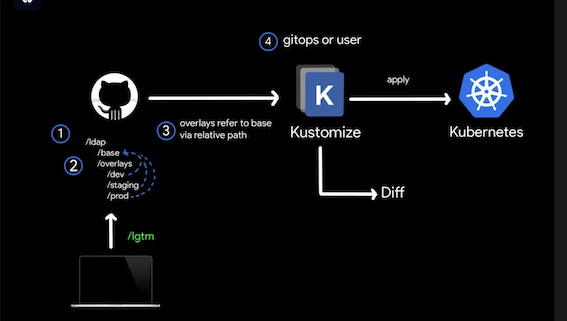
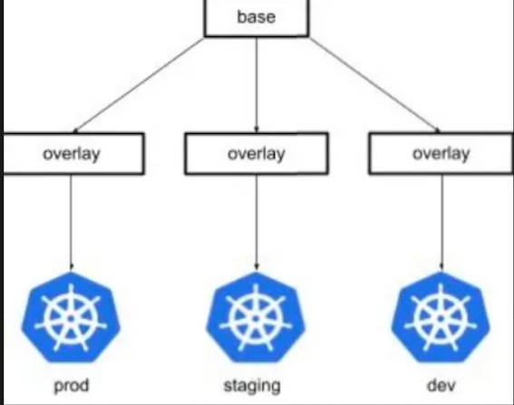
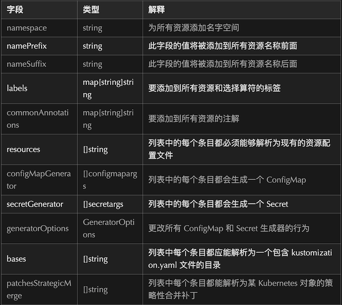
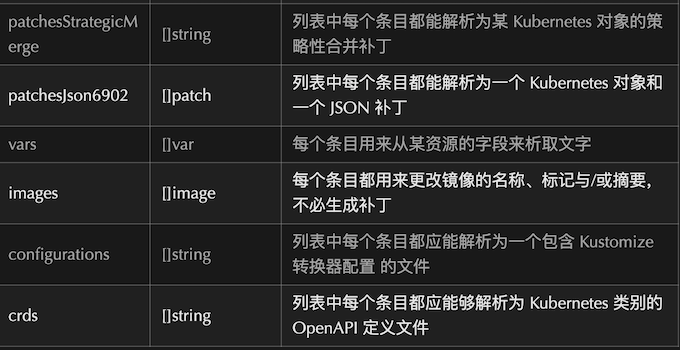

# Kustomize 设计理念与使用说明


## 一、设计理念

Kustomize 的设计理念是基于"基础配置 + 补丁"的模式，这里解释一下为什么需要在 base 目录下创建基础配置

#### 1. 基础配置的重要性：

* base 目录下的配置是所有环境共享的基础配置
* 包含了服务最基本的定义和配置
* 确保了不同环境的配置一致性

#### 2. 环境差异管理：

* overlays 目录只存放与基础配置的差异部分
* 每个环境只需要关注自己特有的配置
* 避免了配置重复和维护困难

#### 3. 配置复用：

* 基础配置可以被多个环境复用
* 减少了重复配置的维护成本
* 确保了配置的一致性

#### 4. 如果只在 overlays 下创建配置的问题：

base 中放置：

overlays 中放置：

* 镜像版本
* 副本数量
* 特定注解
* 容器端口
* 资源限制
* 健康检查
* 基础标签
* 每个环境都需要维护完整的配置
* 配置变更需要在多个环境中同步修改
* 容易造成环境间的配置不一致
* 难以追踪配置的变化

## 二、工作流

kustomization工作流方式

Kustomize 不是一个新工具，它自 2017 年以来一直在建设中，并在 1.14 版本中作为原生 kubectl 子命令引入。

Kustomize 由 Google 和 Kubernetes 社区构建，符合 Kubernetes 使用 Kubernetes 对象定义配置文件和以声明方式管理这些配置的原则。

Kustomize 配置对象称为 Kustomization，用于描述如何生成或转换其他 Kubernetes 对象。

Kustomization 在名为 kustomization.yaml 的文件中以声明方式定义，此文件可由 Kustomize 本身生成和修改。


在 kustomize 中，可以定义常见、可重复使用的 kustomization（称为基础）并使用多个其他 kustomization（称为覆盖层）对其进行修补，这些 kustomization 可以选择性地覆盖基础中定义的设置以生成变体。

然后，Kustomize 根据 kustomization 基础和覆盖层中定义的配置转换和生成资源，此过程称为融合或渲染。接下来，这些渲染资源会写入标准输出或文件，并保持原始 YAML 文件不变，以便许多不同的叠加层重复使用基础。





这种无模板方法在 Kustomization 库的易用性和可重用性方面非常强大。使用它你能够以几乎任何想要的方式自定义 Kubernetes 配置，而无需为每个单独的用例提供大量值。

## 二、Kustomize 支持众多的功能特性




### 二、目录结构说明

```
Kustomize-dc/
├── base/                    # 基础配置目录
│   ├── backend/            # 后端服务基础配置
│   │   └── accounting-service/
│   ├── frontend/           # 前端服务基础配置
│   │   └── ybf-www-h5/
│   └── kustomization.yaml  # 基础配置的kustomization文件
└── overlays/               # 环境特定配置目录
    ├── prod/               # 生产环境配置
    │   ├── backend/
    │   ├── frontend/
    │   └── kustomization.yaml
    ├── test/               # 测试环境配置
    └── dev/                # 开发环境配置
```

## 三、常用命令示例

**1 查看生成的配置：**

```
kubectl kustomize overlays/prod
```

**2 应用配置到集群：**

```
kubectl apply -k overlays/prod
```

**3 删除已部署的资源：**

```
kubectl delete -k overlays/prod
```

## 四、最佳实践建议

**1 标签管理：**

* 使用统一的标签体系
* 在base中定义基础标签
* 在overlays中添加环境特定标签

**2 配置管理：**

* 敏感配置使用Secret
* 环境变量使用ConfigMap
* 避免在base中包含环境特定的配置

**补丁使用：**

* 使用strategic merge patch进行配置覆盖
* 只在必要时使用json patch
* 保持补丁文件的简洁性

## 五、常见问题解答


**Q: 如何处理不同环境的域名配置？**A: 在overlays中使用patch-ingress.yaml进行覆盖，如示例中的ybf-www-h5服务。

**Q: 如何管理不同环境的标签？**A: 在base中定义通用标签，在overlays中使用labels字段添加环境标签。

**Q: 如何处理配置文件的优先级？**A: Kustomize按照以下顺序应用配置：

* base配置
* overlays中的补丁
* overlays中的资源

**Q: 如何维护大型项目的配置？**A: 建议按照服务类型（前端/后端）和业务模块进行目录划分，保持清晰的层次结构。

## 六、配置示例

### **1. 基础服务配置示例**

**base/backend/accounting-service/deployment.yaml**

```
apiVersion: apps/v1
kind: Deployment
metadata:
  name: accounting-service
spec:
  replicas: 1
  selector:
    matchLabels:
      app: accounting-service
  template:
    metadata:
      labels:
        app: accounting-service
    spec:
      containers:
        - name: accounting-service
          ports:
            - containerPort: 8080
          resources:
            limits:
              cpu: '1'
              memory: 2Gi
            requests:
              cpu: 500m
              memory: 1Gi
```

### **2. 环境特定配置示例**

**overlays/prod/backend/accounting-service/patch-deployment.yaml**

```
apiVersion: apps/v1
kind: Deployment
metadata:
  name: accounting-service
spec:
  replicas: 3
  template:
    spec:
      containers:
        - name: accounting-service
          image: your-registry/accounting-service:prod
          env:
            - name: SPRING_PROFILES_ACTIVE
              value: prod
```

### 3. ConfigMap配置示例

**base/configmap.yaml**

```
apiVersion: v1
kind: ConfigMap
metadata:
  name: app-config
data:
  application.properties: |
    server.port=8080
    spring.application.name=my-app
```

**overlays/prod/patch-configmap.yaml**

```

apiVersion: v1
kind: ConfigMap
metadata:
  name: app-config
data:
  apollo_namespace: prod
  sw_agent_collector_backend_services: skywalking-oap.prod-ybf-mid:11800
  apollo_cluster: prod
  apollo_config_service: http://service-apollo-config-server.prod-ybf-mid:8080
```

## 4. Ingress配置示例

**base/ingress.yaml**

```
apiVersion: networking.k8s.io/v1
kind: Ingress
metadata:
  name: my-app
  annotations:
    kubernetes.io/ingress.class: nginx
    nginx.ingress.kubernetes.io/ssl-redirect: 'false'
spec:
  rules:
    - host: example.com
      http:
        paths:
          - path: /
            pathType: Prefix
            backend:
              service:
                name: my-app
                port:
                  number: 80
```

## 5. Kustomization文件示例

**base/kustomization.yaml**

```
apiVersion: kustomize.config.k8s.io/v1beta1
kind: Kustomization

resources:
  - deployment.yaml
  - service.yaml
  - ingress.yaml
  - configmap.yaml

labels:
  - pairs:
      app.kubernetes.io/component: backend
      app.kubernetes.io/name: my-app
    includeSelectors: true
```

**overlays/prod/kustomization.yaml**

```
apiVersion: kustomize.config.k8s.io/v1beta1
kind: Kustomization

resources:
  - ../../base

namespace: prod

patches:
  - path: patch-deployment.yaml
  - path: patch-configmap.yaml

labels:
  - pairs:
      environment: prod
    includeSelectors: true
```

这些示例展示了：

1. 基础部署配置
2. 环境特定的补丁
3. ConfigMap的基础配置和环境特定配置
4. Ingress配置
5. Kustomization文件的组织方式

## 五、使用说明

### **前端项目部署**

* 进入项目目录
* 执行 `kustomize build overlays/prod/frontend/ybf-www-h5/` 生成 prod 环境服务的 yaml
* 执行 `kustomize build overlays/prod/frontend/` 生成 prod 环境所有前端服务的 yaml
* 执行 `kustomize build overlays/prod/` 生成 prod 环境所有服务的 yaml


### 后端项目部署

* 进入项目目录
* 执行 `kustomize build overlays/prod/backend/accounting-service/` 生成 prod 环境服务的 yaml
* 执行 `kustomize build overlays/prod/backend/` 生成 prod 环境所有后端服务的 yaml
* 执行 `kustomize build overlays/prod/` 生成 prod 环境所有服务的 yaml

## 六、调试命令

```

使用 --load-restrictor 参数调试
kustomize build --load-restrictor LoadRestrictionsNone ./Kustomize-dc/overlays/prod
验证 yaml 语法
kustomize build ./Kustomize-dc/overlays/prod | kubectl apply --dry-run=client -f -
使用 --verbose 参数获取详细错误信息
kustomize build --verbose ./Kustomize-dc/overlays/prod
```

## 七、新服务添加说明

**后端服务添加：**

1. 复制 base/backend/accounting-service 目录作为模板
2. 复制 overlays/prod/backend/accounting-service 目录作为模板
3. 修改所有文件中的服务名称
4. 更新 base/backend/kustomization.yaml 添加新服务

**前端服务添加：**

1. 复制 base/frontend/ybf-www-h5 目录作为模板
2. 复制 overlays/prod/frontend/ybf-www-h5 目录作为模板
3. 修改所有文件中的服务名称
4. 更新 base/frontend/kustomization.yaml 添加新服务


## 八、优势

* 配置清晰可维护
* 环境差异一目了然
* 基础配置变更容易同步到所有环境
* 降低配置错误的风险
* 便于版本控制和审计