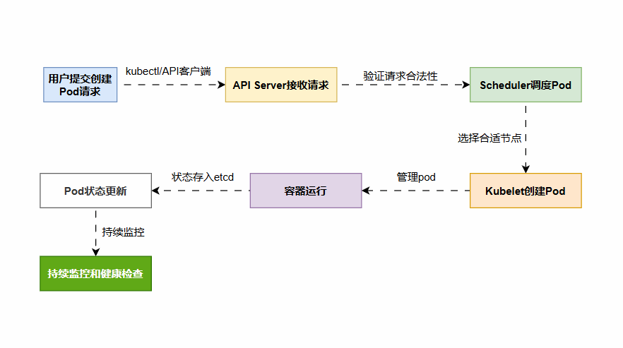

# 描述K8S创建pod的全过程 - 2025

这道面试题考察的是对 Kubernetes 核心组件和工作原理的理解。以下是一个简单的流程图和详细的回答，涵盖了从用户提交请求到 Pod 正常运行的全过程：

## 1. 用户提交请求

* 用户通过 kubectl 命令行工具或 API 客户端提交创建 Pod 的请求。
* 请求中包含了 **Pod 的配置信息，例如容器镜像、资源需求、环境变量等**

## 2. API Server 接收请求

* **API Server 是 Kubernetes 集群的入口，负责接收和处理所有 API 请求**。
* API Server 会验证请求的合法性，**例如用户权限、资源配额等。**
* **验证通过后，API Server 会将 Pod 的配置信息存储到 etcd 中**。

## 3. Scheduler 调度 Pod

* **Scheduler 是 Kubernetes 的调度器，负责为新创建的 Pod 选择合适的节点**。
* Scheduler **会根据 Pod 的资源需求、节点资源利用率、亲和性/反亲和性规则等因素进行调度决策**。
* 调度完成后，**Scheduler 会将 Pod 与目标节点的绑定信息更新到 etcd 中。**

## 4. kubelet 创建 Pod

* kubelet 是运行在每个节点上的代理，**负责管理节点上的 Pod 和容器**。
* kubelet 会监听 API Server 的变化，当发现有新的 Pod 被调度到当前节点时，就会开始创建 Pod。
* kubelet 会从镜像仓库拉取所需的容器镜像，并调用容器运行时 (例如 Docker) 创建和启动容器。

## 5. 容器运行

* **容器运行时负责下载镜像、创建容器、启动容器等操作。**
* 容器启动后，kubelet 会监控容器的运行状态，并将状态信息上报给 API Server。

## 6. Pod 状态更新

* API Server 会将 Pod 的状态信息存储到 etcd 中。
* 用户可以通过 kubectl get pods 命令查看 Pod 的状态。

## 7. 持续监控和健康检查

* kubelet 会持续监控 Pod 的运行状态，并根据配置的健康检查策略对容器进行健康检查。
* 如果容器出现故障，kubelet 会根据重启策略尝试重启容器。

以上就是K8S 创建 Pod 的过程涉及多个组件的协作，包括 API Server、Scheduler、kubelet、容器运行时等