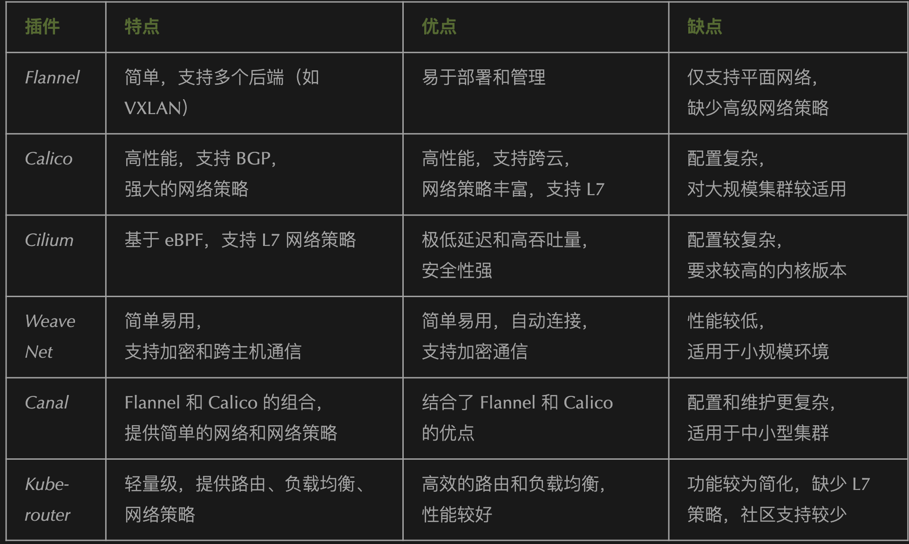

# Kubernetes 面试题精解：从入门到进阶(2025) - 必看 

## 1 Kubernetes 面试题精解：从入门到进阶

Kubernetes 中的 Pod 是最小的调度单元，通常用于运行一个或多个容器。Pod 的创建和销毁是 Kubernetes 集群中重要的操作，涉及到多个组件的交互和状态变更。下面是对 Pod 创建 和 Pod 销毁 过程的详细描述

#### 1. Pod的创建过程

**步骤1：用户提交请求 (kubectl或API)**

* 用户通过 kubectl 或者直接通过 Kubernetes API 提交创建 Pod 的请求。这通常是通过 kubectl run、kubectl apply 等命令，或者通过编写一个 YAML 文件描述 Pod 的配置并将其提交到集群。
* 请求包含 Pod 的配置，**通常包括容器的镜像、资源限制、环境变量、卷、端口等信息**

#### 2. APIIServer处理请求

Kubernetes 的 API Server 是整个集群的接口，处理所有的 HTTP 请求。收到 Pod 创建请求后，API Server 会对请求进行验证和授权（基于 RBAC 和其他策略）

* **验证**：检查请求是否符合 Kubernetes 的 API 规范（例如，Pod 配置的语法、字段是否正确等）。
*  **授权**：确保发起请求的用户有足够的权限来创建 Pod。

如果请求通过验证和授权，**API Server 会将 Pod 配置保存到 Etcd 中**。**Etcd 是一个强一致性的数据库，用于存储 Kubernetes 集群的所有状态信息**

#### 步骤3：调度器选择节点 (Scheduler)

Kubernetes Scheduler 会监控 Etcd 中的 Pod 状态，并选择适合的节点来运行该 Pod。调度器会根据以下因素做出决策

* **资源请求**：Pod 请求的 CPU 和内存资源。
* **节点资源**：**节点的当前负载和可用资源。**
* **亲和性/反亲和性**：Pod 对节点的亲和性或反亲和性规则（例如，某些 Pod 必须一起运行，或者不能与其他 Pod 一起运行）。
* **污点和容忍**：节点是否有污点，并且 Pod 是否容忍这些污点
*
调度器选择的节点会更新 Pod 的配置，指定该 Pod 将运行在选定的节点上。

#### 步骤4：Kubelet启动容器

Kubelet 是每个节点上的代理，它负责确保容器在节点上运行。当调度器确定 Pod 将运行在某个节点上时，Kubelet 会接收到该节点上 Pod 的信息

Kubelet 会根据 Pod 配置启动容器，确保容器按预期启动。它会：

* 下载所需的容器镜像（如果镜像不存在于节点上）。
* 根据 Pod 配置启动容器。
* 如果使用了卷，Kubelet 会挂载相应的存储资源到容器中。

Kubelet 启动容器后，容器运行的状态会定期报告给 API Server，确保 Pod 的状态是健康的。

#### 步骤5：服务发现和网络配置

* **Kube Proxy 会为 Pod 配置网络规则**，**确保服务能够找到这个 Pod**。**如果 Pod 是通过 Service 暴露的，Kube Proxy 会更新 Service 的后端列表，包含新创建的 Pod**。
• Kubernetes 的 DNS 服务会为 Pod 分配一个 DNS 名称，使其可以通过 DNS 解析访问。

#### 步骤6：Pod状态更新

• 在 Pod 被成功调度并启动后，Kubernetes API Server 会将 Pod 的状态更新为 Running，**并将状态信息保存在 Etcd 中。Pod 的 IP 地址和其他元数据也会在这个阶段更新**。

###  2.Pod销毁过程

#### 步骤1：用户或控制器发起删除请求

* Pod 的销毁通常由用户通过 `kubectl delete pod <pod_name>` 命令，或者由控制器（如 Deployment、StatefulSet 等）发起。
* 当控制器的期望状态与实际状态不一致时，控制器会发起删除 Pod 的请求。比如，Deployment 中的 Pod 副本数发生变化时，控制器会删除不需要的 Pod

#### 2 APIServer 处理删除请求

* API Server 接收到删除请求后，首先会验证请求的合法性。
* **API Server 会将删除请求的状态保存到 Etcd 中，更新 Pod 的状态为 Terminating**。

#### 3 Kubelet 停止服务

Kubelet 发现 Pod 被标记为 Terminating 后，会启动容器的终止过程。Kubelet 会：

* 发送终止信号（如 SIGTERM）给 Pod 中的容器。
* 等待一定的时间（Grace Period），允许容器优雅地关闭。
* 如果容器没有在规定时间内退出，Kubelet 会发送强制终止信号（如 SIGKILL）。

#### 4 清理容器资源

Kubelet 会清理容器和与 Pod 相关的资源，例如：

* 删除容器的运行时资源。
* 如果 Pod 使用了卷，Kubelet 会释放和卸载卷资源。
* 删除容器网络设置。

#### 5 Kubernetes集群状态更新

* Kubernetes API Server 会更新 Pod 的状态为 **Deleted**，并从 Etcd 中删除 Pod 的相关数据。
* 如果 Pod 是由控制器（如 Deployment）管理的，控制器会根据新的状态启动新的 Pod，以维持期望的副本数。

#### 6：清理网络资源

**Kube Proxy 会更新服务的后端列表，移除已删除 Pod 的 IP 地址，确保流量不再路由到该 Pod。**

* Pod 创建过程：**从用户提交请求到 API Server，再到调度器选择节点，Kubelet 启动容器，最后更新状态并暴露服务**。
* Pod 销毁过程：**从用户或控制器发起删除请求，到 API Server 标记 Pod 为 Terminating，Kubelet 优雅地终止容器，最终清理资源并更新状态**。

### **1: 存活探针（Liveness Probe）、就绪探针（Readiness Probe）、启动探针（Startup Probe）的区别及适用场景？**


## 2 Kubernetes 的精通

### 2-1 Kbernetes架构：

* Kubernetes 核心组件：如 **API Server、Scheduler、Controller Manager、Kubelet、Kube Proxy** 等的工作原理和交互方式。
* **Pod、Deployment、ReplicaSet、StatefulSet、DaemonSet、Job、CronJob** 等 Kubernetes 资源对象的详细理解，并能合理选择使用场景。
* Master 节点和 Worker 节点的角色和功能，如何管理和调度容器化应用

### 2-2 容器化应用的部署与管理

* **高效的应用部署**：能熟练使用 Helm、Kustomize 等工具，简化和自动化 Kubernetes 上的应用部署。
* **滚动更新与回滚**：能够在 Kubernetes 中实现无停机更新，并能快速应对故障进行回滚。
* **多环境管理**：熟悉如何在不同的环境中（如开发、测试、生产）管理和配置 Kubernetes 集群。

### 2-3.服务发现与负载均衡

* **内部和外部服务暴露**：熟练使用 Kubernetes 的 Service 资源，支持负载均衡、DNS 解析和端口映射。
* **Ingress 控制器**：能够配置和管理 Ingress 控制器，控制外部流量的访问。
* **Service Mesh（如 Istio）**：理解并能应用 Service Mesh 实现微服务间的通信、监控和安全性控制

### 2-4. 存储与持久化

* Volume 和 Persistent Volume (PV)：理解 Kubernetes 中的存储体系，能够根据应用的需要选择合适的存储类型（如 NFS、GlusterFS、Ceph、云存储等）。
* **StatefulSet 与持久化存储：能够有效地为有状态的应用（如数据库）配置持久化存储**。
* **StorageClass 和动态供应**：使用 StorageClass 配置动态卷供应，满足高效、灵活的存储需求

### 2-5.安全性管理：

* RBAC（角色和权限控制）：熟练使用 Kubernetes 的基于角色的访问控制（RBAC）来控制集群访问权限。
* NetworkPolicy：能够为不同的 Pod 和服务配置网络策略，保证集群内外的安全性。
* 密钥和凭证管理：使用 Kubernetes Secret 管理敏感信息，确保应用的安全配置。

### 2-6.集群监控与日志管理

* 监控系统：熟练使用 Prometheus、Grafana 等工具对集群和应用进行实时监控，设置告警机制。
* 日志管理：使用 ELK Stack、Fluentd、EFK 等日志收集和分析工具进行集群日志管理和故障排查。


### 2-7 性能优化与故障排除：

* **性能调优**：能够根据工作负载的需求优化集群资源配置，如合理设置 CPU 和内存资源请求与限制。
*  **故障排查**：能够通过 kubectl 命令、日志、监控工具和事件分析，迅速诊断和解决集群中的各种问题。
* **集群高可用性和灾难恢复**：能够配置和管理高可用的 Kubernetes 集群，确保集群在面临单点故障时仍能稳定运行。

### 2-8.自定义与扩展：

* 自定义资源和控制器：**能够使用 CRD（Custom Resource Definition）扩展 Kubernetes，创建和管理自定义资源对象**。
* Operator 模式：**理解并能实现 Kubernetes Operator，以自动化管理复杂的、有状态的应用**

### 2-9.CI/CD集成与自动化：

* 集成 Jenkins/GitLab CI/CD：能够将 Kubernetes 与 CI/CD 工具集成，实现自动化构建、测试和部署。
*  GitOps 流程：能够使用 Argo CD、Flux 等工具实现基于 GitOps 的持续交付。

### 2-10.多集群管理与服务网格：

* 跨集群通信和管理：了解如何管理多个 Kubernetes 集群以及它们之间的服务发现与通信。
* Service Mesh：熟练使用 Service Mesh 技术（如 Istio）来处理跨服务的流量管理、安全控制、负载均衡等问题。


## 3 对于像容器之类的服务，出现了故障

**你的排查思路是什么呢？**

### 1. 检查容器状态和日志

**检查容器的状态：**

* 使用 docker ps（对于 Docker）或者 kubectl get pods（对于 Kubernetes）查看容器或 Pod 是否处于正常运行状态。**如果容器处于 "CrashLoopBackOff" 或 "Error" 状态，可能是容器启动失败或崩溃**。

**查看容器日志：**

* 使用 docker logs （Docker）或 kubectl logs （Kubernetes）查看容器的日志输出。这通常能提供关于容器内发生错误的直接信息，如应用崩溃、依赖缺失等。

**检查应用日志：**

* 如果容器内运行的是应用程序，查看应用的日志，了解是否有业务逻辑错误、异常或数据库连接问题等

### 2. 资源问题排查

**内存和CPU资源：**

容器如果因为资源不足而崩溃，可以使用 docker stats 或 kubectl top pod 查看资源的使用情况。如果发现某个容器超出了其资源限制（如 CPU 或内存），则需要增加资源限制或优化应用。

**磁盘空间：**

确认宿主机或 Kubernetes 节点的磁盘空间是否足够，特别是 /var/lib/docker 或者类似存储容器镜像和日志的路径，空间不足可能导致容器运行失败

### 3. 网络问题排查

**网络连接**：

检查容器是否能正常访问其他服务（例如数据库、外部 API 等）。

使用 `docker exec ping [target]` 或 `kubectl exec [pod_name] -- ping [target]` 测试网络连通性。


**DNS 配置问题**：
容器内的 DNS 配置可能存在问题，导致无法解析域名。查看容器中的 /etc/resolv.conf 文件，确认 DNS 配置是否正确。

**防火墙或安全组：**

检查宿主机或云平台的防火墙或安全组设置，确保没有阻止容器之间的通信或外部访问。

### 4. 配置错误

**环境变量**：

确保容器中设置的环境变量正确，例如数据库连接字符串、API 密钥等。如果环境变量缺失或错误，应用程序可能无法正常启动或连接到外部服务。

**配置文件：**

容器的配置文件可能被错误修改，导致应用无法正常工作。确保配置文件的路径和内容正确，尤其是在 Kubernetes 中使用 ConfigMap 或 Secret 时

### 5. 容器镜像问题

**镜像拉取失败：**

• 如果容器无法启动，检查镜像是否成功拉取。在 Docker 中可以使用 docker pull 命令检查镜像是否可用；在 Kubernetes 中使用 kubectl describe pod 查看详细的错误信息，看看是否存在镜像拉取失败的情况。

**镜像版本问题：**

确认容器运行的镜像版本是否正确。如果应用依赖特定版本的镜像，确保版本号和标签匹配，且没有使用过时或错误的镜像。

### 6. 依赖服务问题

**数据库/外部服务不可用**：

• 检查容器是否能访问其依赖的数据库或外部服务。使用 docker exec 或 kubectl exec 进入容器，手动尝试连接数据库或外部服务，确认其可达性。

**依赖的服务是否正常运行：**

• 确保容器依赖的其他服务（如 Redis、Kafka、API 服务等）是否正常工作。检查这些服务的状态，查看是否有故障。


### 7. 容器的健康检查

**Kubernetes 健康检查：**

如果在 Kubernetes 中使用了 livenessProbe 和 readinessProbe，检查健康检查是否配置正确，容器是否被错误地标记为不健康或不可用。查看 kubectl describe pod 中关于探针的详细信息。

**Docker 健康检查：**

• 对于 Docker，可以使用 docker inspect 检查容器的健康状态。如果容器使用了 HEALTHCHECK 指令，查看健康检查的结果。


### 8. 集群和容器编排平台问题

**Kubernetes 集群问题：**

如果是 Kubernetes 集群中的容器故障，检查集群的状态是否正常，使用 kubectl get nodes 查看节点状态，确保集群中没有不可用的节点。

**资源调度问题：**

检查 Kubernetes 的调度器是否有问题，导致某些容器无法调度到合适的节点。可以查看调度器的日志（kubectl logs -n kube-system ）了解详细情况。

### 9. 查看事件和警告

**Kubernetes 事件：**

使用 kubectl get events 查看与容器或 Pod 相关的事件。这些事件可以提供很多有用的信息，如容器启动失败、资源不足、调度失败等。

**容器运行时的警告和错误**：

查看 Docker 或 Kubernetes 运行时的日志（如 journalctl 或 /var/log/docker.log），可能会提供额外的警告信息或错误原因。


## 3  k8s 每个重要组件

Kubernetes（K8s）是一个强大的容器编排平台，旨在自动化应用程序容器的部署、扩展和管理。它由多个组件组成，每个组件在整个 Kubernetes 系统中发挥着重要作用。以下是对 Kubernetes 每个关键组件的理解

### 1. APIServer

* **作用**：API Server 是 Kubernetes 控制平面的核心组件，它作为所有用户请求的入口，**负责接收和处理外部请求（如 kubectl 命令）以及集群内各组件的内部请求。API Server 提供 RESTful API 接口，供用户和 Kubernetes 控制平面的其他组件交互**。
* **工作原理**：API Server 将请求验证、认证，**并根据请求类型（如 GET、POST、PUT 等）与 Etcd 存储交互**。它还会通过授权（RBAC）和准入控制器（Admission Controller）来确保请求符合权限和策略。

### 2. ETCD 配置管理数据库

* 作用：Etcd 是一个分布式键值存储，用于存储 Kubernetes 集群的所有配置信息和状态数据（如集群配置、Pod 状态、节点信息等）。
* 工作原理：Etcd 通过强一致性保证集群数据的一致性。Kubernetes 中的所有状态信息（**如 Pod、Service、ConfigMap、Secret 等）都会存储在 Etcd 中，它支持数据的高可用性和灾难恢复**。

### 3. Scheduler (调度器）

* 作用：Scheduler 负责将没有指定节点的 Pod 调度到适当的节点上。它会根据资源需求、亲和性、反亲和性、污点和容忍等规则来做出调度决策。
* 工作原理：Scheduler 从 API Server 获取待调度的 Pod 列表，并根据集群中各节点的资源状况（如 CPU、内存、磁盘等）决定将 Pod 安排在哪个节点上。**它会考虑节点的负载、约束条件（如节点选择器、亲和性等）以及其他调度策略**

### 4. ControllerManager  （控制器管理器）

* 作用：Controller Manager 运行控制器，负责 Kubernetes 集群状态的维护。控制器是一个循环控制系统，确保集群中的实际状态符合期望状态。
* 工作原理：Controller Manager 包含多个控制器（如 Replication Controller、Deployment Controller、StatefulSet Controller 等），每个控制器监视集群的某个方面，并确保系统状态始终保持一致。例如，Deployment Controller 会确保部署的 Pod 数量与期望的副本数一致，Pod 的健康检查失败时会自动重新创建 Pod。

### 5. Kubelet（节点管理代理）

* 作用：Kubelet 是 Kubernetes 中每个节点上的代理，它负责管理节点上的容器，并确保容器在节点上正常运行。
* 工作原理：Kubelet 会定期向 API Server 汇报节点和容器的状态，并且确保本地的 Pod 和容器与 API Server 中的期望状态一致。如果容器崩溃或需要重新启动，Kubelet 会处理容器的启动和重启。

### 6. KubeProxy (服务代理)

* 作用：Kube Proxy 负责集群内的网络代理和负载均衡。它管理 Kubernetes 中服务的访问，通过实现负载均衡策略，将流量分发到集群中的各个 Pod。
* 工作原理：Kube Proxy 会监听 Kubernetes 服务资源的变化，并为每个服务创建负载均衡规则。它支持三种负载均衡模式：基于 iptables、基于 IPVS 和基于用户空间的代理。Kube Proxy 确保用户和外部流量能够正确地访问集群内的服务，并根据负载均衡策略将请求转发到相应的 Pod。

### 7. IngressController (Ingress控制器)

* 作用：Ingress Controller 是负责处理集群外部 HTTP 和 HTTPS 流量的组件。它基于 Ingress 资源，提供 HTTP 路由、SSL/TLS 终端等功能。
* 工作原理：Ingress 资源定义了外部访问服务的规则，而 Ingress Controller 会根据这些规则配置外部访问的路由和负载均衡。它允许将多个服务暴露在同一个负载均衡器上，并根据请求的路径或主机名将流量转发到不同的后端服务。


### 8. Nmespace(命名空间)

* 作用：**Namespace 是 Kubernetes 中的一种资源隔离机制，允许在同一个集群中创建多个虚拟集群**。每个命名空间内的资源（如 Pod、Service、ConfigMap 等）是独立的。
* 工作原理：命名空间用于组织集群中的资源，并在大规模集群中提供隔离。在多租户环境中，不同的团队或项目可以在各自的命名空间中管理资源，从而避免资源冲突。

### 9. Volume (存储卷)

* 作用：Volume 是 Kubernetes 提供的一种持久化存储解决方案，容器内的数据可以存储在 Volume 中，以便容器重启或迁移后数据仍然可用。
* 工作原理：Volume 是与 Pod 生命周期绑定的，可以挂载到 Pod 中的容器上。Kubernetes 支持多种类型的 Volume（如 **HostPath、NFS、Ceph、Cloud Provider 的存储服务等**），并且通过 **Persistent Volume（PV）和 Persistent Volume Claim（PVC）**来动态管理存储资源

### 10.Service (服务)

* 作用：Service 是 Kubernetes 中的一个抽象层，用于定义一组 Pod 的访问方式，通常是通过负载均衡器来提供稳定的网络访问。
* 工作原理：Service 提供了一种访问 Pod 的方法，它会自动发现并负载均衡所有后端 Pod 的流量。**通过 ClusterIP、NodePort、LoadBalancer 等不同类型的 Service，用户可以定义不同的访问方式和策略。**

### 11.ConfigMap和机密管理

* 作用：ConfigMap 和 Secret 是用于管理应用程序配置和敏感信息的资源对象。ConfigMap 存储非敏感的配置信息，而 Secret 存储机密信息，如数据库密码、API 密钥等。
* 工作原理：**ConfigMap 和 Secret 允许在容器中以环境变量、命令行参数或挂载文件的方式提供配置信息**。**这些信息可以在 Pod 中以动态的方式进行更新，从而减少应用程序的硬编码配置**

## 4 k8s 里面的资源调度吧

Kubernetes 中的 资源调度 是指将容器化的应用程序（通常是 Pod）分配到集群中的节点上的过程。Kubernetes 的调度系统决定了哪些 Pod 运行在集群中的哪些节点上，以确保集群资源的有效利用和负载均衡

Kubernetes 资源调度的基本概念

1. Pod：Kubernetes 中的最小调度单元，**一个 Pod 可以包含一个或多个容器**。
2. 节点：Kubernetes 集群中的机器，通常是虚拟机或物理机，负责承载和运行 Pod。
3. 调度器：Kubernetes 的调度器（Scheduler）负责将没有指定节点的 Pod 调度到合适的节点上

### 调度器（scheduler）

调度器是 Kubernetes 中负责做出 Pod 调度决策的组件。它根据以下几个因素来选择最合适的节点：

* **资源需求**：Pod 所请求的 CPU、内存和存储等资源。
* **节点资源**：节点上的可用资源，调度器会检查各节点的资源使用情况，选择最合适的节点。
* **调度策略**：调度器还会根据预定义的调度策略（如亲和性、反亲和性、污点和容忍等）来进一步筛选节点

###  节点选择

调度器基于多种因素，选择适合的节点来运行 Pod。调度器会考虑以下几个方面：

**资源请求和限制**：

每个 Pod 都可以指定 CPU 和内存的请求（request）与限制（limit）。调度器会根据这些需求来选择节点。如果某个节点的资源足够满足 Pod 的请求，调度器就会选择这个节点。

**节点亲和性（Node Affinity）**：

 节点亲和性允许你将 Pod 调度到特定的节点上，基于节点的标签。例如，你可以将某些 Pod 调度到具有特定标签（如 zone=us-west-1）的节点上
 
**Pod 亲和性和反亲和性（Pod Affinity and Anti-Affinity）**：

Pod 亲和性用于控制 Pod 的调度规则，以便将某些 Pod 安排在一起（例如，某些 Pod 应该运行在一起，或者在同一节点上共享资源）。Pod 反亲和性用于确保某些 Pod 不会调度到一起，避免共享资源过多导致性能问题

**污点和容忍（Taints and Tolerations）：**

污点和容忍是一种机制，用于将某些节点标记为“不适合”运行某些 Pod。污点是一个节点的标记，表示该节点不适合运行某些类型的 Pod，除非这些 Pod 有相应的容忍（Toleration）。这种机制常用于将节点标记为只能运行特定类型的 Pod，例如专用的硬件节点（如 GPU）。

**负载均衡**：

调度器会根据集群中节点的负载情况来均衡调度 Pod。如果某个节点的资源已经接近饱和，调度器会选择一个资源比较空闲的节点来调度新的 Pod。

### 3 调度算法和优先级

调度器会根据不同的优先级和算法来决定哪个节点最适合运行某个 Pod。Kubernetes 调度器使用以下机制来决策：

* **Filter（过滤）**：**调度器首先会进行过滤**，剔除不符合条件的节点。例如，如果某个节点的资源无法满足 Pod 的请求，或者该节点上运行着不允许该 Pod 运行的服务，那么该节点会被排除。
* **Score（打分）**：在剩余的候选节点中，调度器会根据各节点的条件和策略进行打分，选择得分最高的节点。
* **优先级**：Kubernetes 允许根据不同的调度策略设置优先级。**例如，优先选择资源空闲的节点，或根据节点标签、硬件特性（如 GPU 支持）来选择节点**。

### 4 容器调度中的资源管理

#### **请求（Request）与限制（Limit）**

* 请求是容器启动时所需的最小资源（如 CPU 和内存）。调度器会基于请求来评估是否有足够资源的节点来运行 Pod。

* • **限制是容器的最大资源使用限制。如果容器超过限制，Kubernetes 会采取措施（如杀掉容器）来限制资源的使用**。请求和限制的合理配置可以确保容器的资源得到有效分配，避免节点资源过载

#### Resource Quotas（资源配额）：

Kubernetes 支持在命名空间级别设置资源配额，限制每个命名空间中可以使用的资源总量。资源配额用于控制不同团队或服务对资源的占用，避免单个应用占用过多的集群资源。

#### 调度器的扩展性

**自定义调度器：**

* Kubernetes 允许用户自定义调度器，针对特定需求（如性能优化、特定硬件需求等）设计自己的调度策略。
* 例如，Kubernetes 可以通过使用多个调度器，来支持更复杂的调度需求：**例如针对某些特殊硬件（如 GPU）使用自定义调度器，其他工作负载使用默认调度器**。

#### pod 的生命周期管理

Pod 管理控制器：如 Deployment、StatefulSet、DaemonSet、ReplicaSet 等控制器会确保 Pod 持续按照期望状态运行。调度器与这些控制器紧密配合，确保 Pod 能够正确地调度并按需扩展

总结：

Kubernetes 的资源调度是一个复杂的过程，涉及对节点资源的细粒度管理、不同策略的应用以及优先级的判断。调度器在集群资源的分配中起着至关重要的作用，确保容器能够根据资源请求、亲和性、污点和容忍等规则高效、可靠地运行在适当的节点上。调度器还支持高度的可扩展性和自定义功能，使得 Kubernetes 可以适应各种不同的使用场景和负载要求。

## 4 CNI 并且描述下它们之间的区别

在 Kubernetes 环境中，CNI (Container Network Interface) 插件用于提供和管理容器之间的网络连接。不同的 CNI 插件具有不同的网络架构、性能、功能和适用场景。以下是一些常见的 CNI 插件及其区别：

### Flannel 

Flannel 是最早的 Kubernetes 网络插件之一，简单易用，广泛应用于生产环境。

**特点：**

* **简单性**：Flannel 非常容易设置，主要用于为 Pod 提供网络地址分配。
* **支持多种后端**：Flannel 支持多种后端实现，包括 **VXLAN、host-gw、AWS VPC** 等。最常见的是 VXLAN 模式，它封装容器流量并通过 UDP 通道传输。
* **单一网络模型**：Flannel 提供的网络模型不支持多租户功能。Flannel 仅提供了每个节点的 IP 地址池，支持 Pod 之间的直接通信。

**优点：**

* 简单易用，适合小型和中型集群。
* 不依赖外部服务。

**缺点**：

* 仅支持平面网络（没有高级的网络策略和 QoS）。
* 网络隔离性差，适合简单的场景，扩展性较弱

### Calico

Calico 是一个强大的网络插件，支持高性能的容器网络、网络策略和多云环境

**特点**：

* **网络策略**：Calico 是 Kubernetes 中最流行的 CNI 插件之一，提供强大的 网络策略，可以对流量进行细粒度控制，包括 Ingress 和 Egress 策略。
* **支持 BGP 路由**：Calico 使用 BGP 协议来提供跨节点的路由信息，它也支持 IP-in-IP 模式来封装流量。
* **性能优越**：Calico 直接使用 Linux 内核的路由功能，提供非常高的性能。
* **支持网络隔离**：通过 NetworkPolicy，可以对不同的应用和租户进行流量控制和隔离

**优点**

• 提供高性能，适用于大规模生产环境。
• 提供完整的网络策略功能，支持跨云环境和混合云。
• 高度可定制化，支持多种后端（**BGP、VXLAN、IP-in-IP**）。

缺点：

* 配置和维护相对复杂。
* 对某些环境可能需要额外的网络硬件支持（如 BGP 路由）。

### Cilium

**Cilium 基于 eBPF（extended Berkeley Packet Filter）**技术，它提供高性能、高灵活性和强大的网络安全能力，尤其适合现代云原生架构

**特点**

* **eBPF：Cilium 使用 eBPF 来进行内核级流量控制，提供比传统网络插件更低的延迟和更高的吞吐量**。
* **网络安全**：提供高级的 L7（应用层）网络策略，支持基于 HTTP、gRPC 等协议的细粒度流量控制。
* **多租户支持**：支持容器网络的细粒度隔离，适合多租户和微服务架构。
* **性能优化**：由于 eBPF 可以直接操作 Linux 内核，因此其性能非常高

**优点**

* 基于 eBPF 提供极低的延迟和高吞吐量。
* 提供 L7 网络策略支持，增强网络安全。
* 可以在云原生环境中使用，支持微服务和多租户隔离。
* 更好地与容器安全和监控工具集成


**缺点：**

* 性能相对较低，不适合高性能网络需求的场景。
* 相比于 Calico，网络策略功能较弱，扩展性有限。


### Canal

Canal 是 Calico 和 Flannel 的结合，它利用 Flannel 来处理网络和 IP 地址管理，利用 Calico 来提供网络策略功

**特点：**

*  组合优势：结合了 Flannel 的简易性和 Calico 的强大功能，提供了简单的网络部署和强大的网络策略支持。
* 可扩展性：支持 IP-in-IP、VXLAN 和 BGP 等多种网络模式，适应不同规模的集群需求。

**优点：**

• 既提供了简单的 Flannel 网络功能，又支持 Calico 网络策略。
• 适合那些需要简单配置但又想要支持网络策略的环境

**缺点：**

* 配置和维护相比纯粹的 Calico 或 Flannel 更加复杂。
* 对于一些复杂场景，可能需要更多的资源进行调优

### Kube-router

Kube-router 是一个轻量级的 CNI 插件，旨在简化 Kubernetes 网络功能，并且可以提供高效的网络路由、负载均衡和网络策略功能

**特点：**

* **简化设计**：Kube-router 旨在减少 Kubernetes 网络的复杂性，提供一个集中化的网络模型。
* **支持 BGP 和路由**：通过 BGP 进行跨节点路由配置，支持多租户的流量隔离。
• **内置负载均衡**：Kube-router 提供了服务和 Pod 的内置负载均衡功能。

缺点：

* 相比于 Calico 和 Cilium，功能可能略显简化，不支持 L7 网络策略。
* 不如 Calico 那样被广泛使用，社区支持较少。



### **选择CNI插件时的考虑因素**

* **集群规模**：对于小规模集群，Flannel 或 Weave Net 可能已经足够；对于大规模和高性能需求的集群，Calico 或 Cilium 更合适。
* **安全性**：如果需要高级的安全功能和网络策略，建议选择 Calico 或 Cilium。
* **网络性能**：对于要求高性能、低延迟的网络，Cilium 和 Calico（使用 BGP）是更好的选择。
* **简单性**：如果简化配置和快速部署是您的首要目标，Flannel 或 Weave Net 可能是更好的选择。


## 5 存活探针（Liveness Probe）、就绪探针（Readiness Probe）、启动探针（Startup Probe）的区别及适用场景？

### 1. 存活探针（Liveness Probe）

目的：**检测容器是否处于运行状态**，若失败则重启容器。

**适用场景：**

* 应用程序因死锁或死循环无法响应请求时自动恢复。
* 例如：Web 服务长时间无响应需强制重启。

**配置示例**

```
livenessProbe:
  httpGet:
    path: /healthz
    port: 8080
  initialDelaySeconds: 5
  periodSeconds: 10
```

### 2. 就绪探针（Readiness Probe）

**目的**：检测容器是否准备好接收流量，若失败则从** Service 的 Endpoints 中移除**。

**适用场景：**

* 应用启动时需要加载大量数据（如缓存预热）。
* 依赖外部服务（如数据库）初始化完成后才可提供服务。

配置示例

```
readinessProbe:
  exec:
    command: ["/bin/check-db-connection.sh"]
  initialDelaySeconds: 10
  periodSeconds: 5
```

### 3. 启动探针（Startup Probe）

**目的**：延迟其他探针的启动，直到容器成功启动。

**适用场景：**

* 旧应用启动时间较长（如 Java 应用需数分钟初始化）。
* 避免存活/就绪探针在启动阶段误判导致容器重启

**配置示例**

```
startupProbe:
  httpGet:
    path: /startup
    port: 8080
  failureThreshold: 30  # 最长等待 30*5=150 秒
  periodSeconds: 5
```

## 2: Kubernetes 的 QoS 分类（Guaranteed、Burstable、BestEffort）及其资源管理策略？

### 1. Guaranteed

条件：所有容器的 **CPU/Memory 均设置 limits=requests**。

资源保障：

* 严格保证资源分配，适用于核心服务（如数据库）。
* **OOM 优先级最低，不易被杀死**

### 2. Burstable

*  **条件**：至少一个容器设置了 requests 但未满足 limits=requests。
*  资源弹性：
	*  允许突发使用资源，**适用于多数应用（如 Web 服务）**。
	*  OOM 优先级高于 Guaranteed。

### 3. BestEffort

条件：所有容器均未设置 requests 和 limits。

**资源竞争**：

* 资源不足时优先被终止，适用于非关键任务（如批处理作业）
* OOM 优先级最高。

### 4 如何为 Pod 配置 QoS 策略？举例说明不同场景的选择。

配置方法：**通过 resources.requests 和 resources.limits 定义资源需求**。

场景示例：

#### **1. Guaranteed**

```
containers:
- name: redis
  resources:
    requests:
      cpu: "1"
      memory: "2Gi"
    limits:
      cpu: "1"
      memory: "2Gi"
```

**适用场景：MySQL、Redis 等需要稳定资源的服务。**

#### 2. Burstable

```
containers:
- name: web
  resources:
    requests:
      cpu: "0.5"
      memory: "1Gi"
    limits:
      cpu: "2"
      memory: "4Gi"
```

适用场景：Web 应用需应对流量高峰。

#### 3. BestEffort

```
containers:
- name: batch-job
  resources: {} 
```
适用场景：日志清理、临时数据分析任务。

### 5 如果一个 Pod 频繁重启，如何通过探针和 QoS 策略排查问题？

#### **1. 检查探针配置**

* 确认存活探针是否过于敏感（**如检测间隔 periodSeconds 过短**）。
* 查看日志确认探针失败原因（如 `/healthz` 接口超时）。

#### 2. 分析资源限制

* 检查 Pod 的 QoS 类别是否为 BestEffort，**导致资源不足被 OOMKill**。
* **调整 requests/limits 为 Burstable 或 Guaranteed**。

#### 3. 查看事件日志

```
kubectl describe pod <pod-name>
```

确认是否因资源不足（OutOfMemory）或探针失败（Liveness probe failed）触发重启。

### 6 如何通过 QoS 和探针优化高密度集群的资源利用率？
 
**策略：**

1. 优先级调度：核心服务设为 Guaranteed，抢占资源能力低但稳定性高。
2. 动态调整：使用 Vertical Pod Autoscaler（VPA）自动优化 requests/limits。
3. 探针精细化：
	* 启动探针避免过早检测导致重启。
	* 就绪探针确保依赖服务就绪后再接收流量。

## 6. 在 Kubernetes 中，如何配置资源请求和限制？

资源请求和限制可以在 Pod 的定义文件中通过 resources 字段进行配置。它包括两部分：

* **请求（request）**：容器启动时所需的最低资源。Kubernetes 使用请求来决定 Pod 调度到哪个节点。
* **限制（limit）**：容器能够使用的最大资源。当容器超过这个限制时，Kubernetes 会限制其资源使用，避免影响其他容器的运行。

例如：

```
apiVersion: v1
kind: Pod
metadata:
  name: mypod
spec:
  containers:
  - name: mycontainer
    image: myimage
    resources:
      requests:
        memory: "64Mi"
        cpu: "250m"
      limits:
        memory: "128Mi"
        cpu: "500m"
```

## 7. Kubernetes 中的 Horizontal Pod Autoscaler（HPA）是如何工作的？

Horizontal Pod Autoscaler（HPA）根据 Pod 的 CPU 使用率或其他自定义指标，自动调整 Pod 的副本数。

HPA 通过持续监控指标，并根据设定的阈值（如 CPU 或内存）来自动扩展或缩减 Pod 数量。

配置 HPA 时，需要指定最小副本数、最大副本数和目标指标。

例如，下面是一个基于 CPU 使用率的 HPA 配置示例：

```
apiVersion: autoscaling/v2
kind: HorizontalPodAutoscaler
metadata:
  name: myapp-hpa
spec:
  scaleTargetRef:
    apiVersion: apps/v1
    kind: Deployment
    name: myapp
  minReplicas: 1
  maxReplicas: 10
  metrics:
type: Resource
resource:
  name: cpu
  target:
    type: Utilization
    averageUtilization: 50
```

### Kubernetes 中如何进行 Pod 弹性伸缩

Pod 弹性伸缩可以通过以下几种方式实现：

* **Horizontal Pod Autoscaler（HPA）**：根据 CPU、内存或自定义指标来动态增加或减少 Pod 的副本数。
* **Vertical Pod Autoscaler（VPA）**：根据 Pod 使用的资源自动调整其 CPU 和内存的请求和限制。
* **Cluster Autoscaler**：自动调整集群的规模，根据节点的资源需求自动增加或减少节点的数量。

### Kuernetes 中的资源限制和请求设置为什么重要？

设置资源请求和限制对于确保集群资源合理分配非常重要

* **资源请求**：确保每个容器在节点上获得足够的资源，可以保证应用的正常运行。
* **资源限制**：防止容器使用过多资源，影响其他容器的正常运行。特别是在高负载场景中，合理设置资源限制可以避免资源竞争，保证整个系统的稳定性。

## 8 如何使用 Kubernetes 进行资源隔离？

Kubernetes 提供了多种方式来实现资源隔离：

* **Namespace**：用于将集群中的资源划分为不同的虚拟集群，不同的团队或应用可以在不同的命名空间中工作，互不干扰。
* **Resource Requests and Limits**：通过资源请求和限制来确保每个容器有足够的资源，并防止资源争夺。
*** Node Affinity and Taints/Tolerations**：通过节点亲和性、污点和容忍度来限制某些 Pod 只能在特定节点上运行，从而实现更细粒度的资源隔离。

## 9. Kubernetes 中如何实现 Pod 的高可用性？

Kubernetes 提供了多种方式来确保 Pod 的高可用性：

*  **副本集（ReplicaSet）**：通过 ReplicaSet 来确保某个 Pod 的副本数始终保持在指定数量。ReplicaSet 可以自动创建和删除 Pod，以确保所需数量的 Pod 始终运行。
* **部署（Deployment）**：Deployment 是一种管理 Pod 副本集的控制器，支持滚动更新和回滚，确保服务可用。
* **Pod Disruption Budgets（PDB）**：**通过 Pod Disruption Budgets 来限制可以同时被中断的 Pod 数量**，确保在升级或维护时，至少有一定数量的 Pod 在运行。
* **多节点调度**：通过分布式调度和 Affinity 策略，将 Pod 调度到多个物理节点上，避免单点故障。


## 10 Kubernetes 如何处理网络通信？

Kubernetes 使用 CNI（容器网络接口） 来处理网络通信。以下是 Kubernetes 网络的关键概念：

* Pod 网络：每个 Pod 在集群中都有自己的 IP 地址，所有 Pod 都可以直接相互通信，无需 NAT。**Kubernetes 通过 CNI 插件（如 Calico、Flannel、Weave）实现 Pod 网络**。
* **服务（Service）**：Kubernetes 中的服务提供了对外暴露应用的方式，使用服务的 ClusterIP、NodePort 或 LoadBalancer 类型，可以使 Pod 对外可访问。
* **DNS**：Kubernetes 集群内自动为每个服务分配一个 DNS 名称，使得 Pod 通过 DNS 进行服务发现和通信

## 11 Kubernetes 中如何进行资源的限额管理（Resource Quota）

**资源配额（ResourceQuota）**用于限制一个命名空间中可以使用的资源量，避免单个团队或应用消耗过多资源，影响集群的稳定性。通过定义资源配额来管理 CPU、内存、Pod 数量等

例如：

```
apiVersion: v1
kind: ResourceQuota
metadata:
  name: example-quota
spec:
  hard:
    cpu: "10"
    memory: 50Gi
    pods: "10"
```

## 12. Kubernetes 中的 Taints 和 Tolerations 如何工作？

Taints 和 Tolerations 是 Kubernetes 用来控制 Pod 调度的机制：

* **Taints：是节点上设置的标记，表示某些 Pod 不应该调度到该节点，除非它们能够容忍这个 taint。Taints 定义了节点的“污点**”。
* **Tolerations：是 Pod 上设置的标记，表示该 Pod 可以容忍某些节点上的 Taints**。只有当 Pod 能够容忍节点上的 Taints 时，才能调度到该节点。

通过 Taints 和 Tolerations，可以实现对特定节点的调度控制，如避免将某些 Pod 调度到资源紧张或不合适的节点上。

## 13 Kubernetes 中如何实现服务发现（Service Discovery）？

DNS 来实现服务发现，每个服务都会自动分配一个 DNS 名称，其他 Pod 可以通过该名称访问该服务。例如，如果创建了一个名为 myapp 的服务，它会自动在 DNS 中分配一个 **myapp.default.svc.cluster.local 的地址，集群内的其他 Pod 可以通过这个地址访问该服务**。

## 14. Kubernetes 的 Pod 生命周期是如何管理的？

Kubernetes Pod 的生命周期包括以下几个阶段：

* **Pending**：Pod 已被调度到节点，但容器还没有启动。
* **Running**：Pod 的容器已经启动并正在运行。
* **Succeeded**：Pod 中的所有容器都成功终止并完成任务。
* **Failed**：Pod 中的容器已终止且失败，无法重新启动。
* **Unknown**：Kubernetes 无法确定 Pod 的状态，通常是由于与节点的通信失败。

Kubernetes 通过控制器（如 Deployment、StatefulSet 等）来管理 Pod 的生命周期，确保在 Pod 失败或被删除时，可以自动恢复或创建新的 Pod。

## 15. Kubernetes 中如何实现网络策略（NetworkPolicy）？

NetworkPolicy 用于控制 Pod 之间的通信，通过定义规则来限制或允许流量。**前提是你的 CNI 支持 NetworkPolicy，比如 Calico 就支持**

它可以基于 Pod 标签、命名空间、IP 地址等进行访问控制。**它支持 Ingress（流入）和 Egress（流出）规则**。 例如，允许只有标签为 role=frontend 的 Pod 可以访问标签为 role=backend 的 Pod

```
apiVersion: networking.k8s.io/v1
kind: NetworkPolicy
metadata:
  name: allow-frontend-to-backend
spec:
  podSelector:
    matchLabels:
      role: backend
  ingress:
  - from:
    - podSelector:
        matchLabels:
          role: frontend
```

## 16 Kubernetes 中如何处理节点故障？

Kubernetes 使用节点监控和调度策略来处理节点故障：

*  **节点监控**：Kubernetes 的 kubelet 组件定期向 master 节点报告节点状态，如果某个节点长时间无法与 master 节点通信，Kubernetes 会标记该节点为不可用（**NotReady**）。
* **Pod 重新调度**：当节点发生故障，调度器会重新将 Pod 调度到其他健康节点上。为了保证 Pod 高可用，**可以配置 PodDisruptionBudget 和 ReplicaSet，确保 Pod 可以在其他节点上运行**。

## 17. Kubernetes 中的 StatefulSet 与 Deployment 有什么区别？

StatefulSet 和 Deployment 都是用于管理 Pod 的控制器，但它们适用于不同类型的应用：

* Deployment：适用于无状态应用，Pod 的副本可以相互替换，Pod 的名字和顺序没有重要意义。
* StatefulSet：**适用于有状态应用**，
	* 需要保持 Pod 的唯一标识和顺序。**StatefulSet 会为每个 Pod 提供一个稳定的持久存储和网络标识**。

## 18 Kubernetes 中的 PersistentVolume（PV）和 PersistentVolumeClaim（PVC）是什么？它们如何工作？

Kubernetes 中的 PersistentVolume（PV） 和 PersistentVolumeClaim（PVC） 是用于管理持久存储的资源：

* PersistentVolume（PV）：是集群中的一个存储资源，它表示一个具体的存储设备，可能是一个 NFS 存储、云存储（如 AWS EBS）或本地磁盘等。
* PersistentVolumeClaim（PVC）：是用户向 Kubernetes 申请持久存储的一种方式，它定义了所需存储的大小、访问模式等要求。Kubernetes 根据 PVC 自动绑定适当的 PV。

## 19. Kubernetes 中的监控和日志如何结合使用？

Kubernetes 的监控和日志结合使用可以帮助开发和运维人员更好地掌握集群状态和故障排查：

* 监控：使用 Prometheus 来收集集群和应用的指标（如 CPU、内存、网络流量等），通过 Grafana 可视化展示。
* 日志管理：使用 ELK Stack（Elasticsearch、Logstash、Kibana）来集中管理和查询 Kubernetes 的日志。
* 集成：将 Prometheus 和 Grafana 与日志管理工具（如 Fluentd 或 Filebeat）集成，通过统一的面板和报警系统，提高监控和日志的响应效率

## 20. Kubernetes 中如何处理存储资源的动态供给？

Kubernetes 通过 **StorageClass 和 动态存储供给（Dynamic Provisioning）** 实现存储资源的自动化管理。通过定义 StorageClass，**用户可以自动为 PVC 申请合适的存储类型（如 SSD、HDD 或云存储）**。

使用 StorageClass，可以定义不同存储类型的参数，并在 PVC 中指定该 StorageClass，Kubernetes 会根据该配置自动创建和绑定 PV。

## 21. Kubernetes 中的 Affinity 和 Anti-Affinity 是如何工作的？

Kubernetes 中的 Affinity 和 Anti-Affinity 是控制 Pod 调度策略的机制，用于指定 Pod 在节点上的调度规则：

* Affinity：允许指定 Pod 在相同节点上调度，或在特定条件下与其他 Pod 调度在一起。例如，可以使用 nodeAffinity 让 Pod 只调度到特定标签的节点上。
* Anti-Affinity：用于确保 Pod 不与其他指定的 Pod 调度在同一节点或同一可用区。例如，可以确保某些 Pod 在不同节点上运行，以避免单点故障。

## 22 Kubernetes 中如何处理 Pod 的优先级和抢占？

Kubernetes 支持通过 PodPriority 和 PriorityClass 来设置 Pod 的优先级。高优先级的 Pod 可以抢占低优先级的 Pod 资源，确保关键服务优先运行

*  **PriorityClass：通过为 Pod 设置不同的优先级，控制 Pod 在资源争夺时的调度顺序**。
* Pod抢占：如果集群资源紧张，Kubernetes 会终止优先级较低的 Pod 来为高优先级的 Pod 提供资源

## 23 Kubernetes 中的 Ingress 和 Egress 是如何控制流量的？

Kubernetes 提供了 Ingress 和 Egress 控制流量进出集群的方式：

 * **Ingress：是一种 API 资源，允许外部流量通过 HTTP/HTTPS 访问 Kubernetes 内部服务**。**Ingress 通常由 Ingress Controller 实现（如 Nginx Ingress Controller）**。
 * **Egress**：是集群内的 Pod 发起的流量访问外部网络。可以通过配置 NetworkPolicy 来控制 Pod 的出站流量，限制哪些 Pod 可以访问外部服务。

## 24 Kubernetes 中的 RBAC（Role-Based Access Control）如何控制权限？

RBAC 是 Kubernetes 中的权限管理系统，用于控制用户或服务账户在集群中的操作权限。RBAC 通过定义 Role 和 RoleBinding 来授予权限

* Role：定义在某个命名空间内的权限，如访问资源的权限（Pods、Services 等）。
*  ClusterRole：定义集群范围内的权限。
*  **RoleBinding 和 ClusterRoleBinding：将 Role 或 ClusterRole 绑定到特定的用户或服务账户**

## 25. Kubernetes 中如何处理事件日志？

Kubernetes 中的事件日志用于记录集群状态和各类事件，如 Pod 启动、容器重启、资源限制等。**可以使用 kubectl get events 命令查看事件日志**。

* Kubernetes 中的事件是由 Kubelet、Controller Manager 等组件生成的。
* 集成日志管理：可以使用 Fluentd、Elasticsearch 和 Kibana（ELK Stack） 等工具来集中管理和分析 Kubernetes 事件日志。

## 26. Kubernetes 中的 PodDisruptionBudget（PDB）是什么？如何使用？

**PodDisruptionBudget（PDB）**用于控制 Pod 的可中断性，确保在升级或维护时至少有一定数量的 Pod 处于运行状态。

**PDB 通过定义 maxUnavailable 或 minAvailable 来保证在允许的范围内，Pod 可以被中断。**

例如，设置一个 PDB，确保最多只能有一个 Pod 被中断：

```
apiVersion: policy/v1
kind: PodDisruptionBudget
metadata:
  name: myapp-pdb
spec:
  minAvailable: 2
  selector:
    matchLabels:
      app: myapp
```

## 27 Kubernetes 中的资源管理器（Resource Manager）如何确保集群资源的公平分配？

Kubernetes 的资源管理器（Scheduler） 通过以下方式确保资源的公平分配：

* 资源请求和限制：每个 Pod 在调度时，Kubernetes 会根据资源请求和限制来选择最合适的节点。
* QoS 策略：通过 QoS 类别（Guaranteed、Burstable、BestEffort）来管理 Pod 的优先级和资源分配。
* 调度策略：如资源亲和性、节点亲和性等，帮助在资源有限的情况下，做出最合适的资源调度决策。