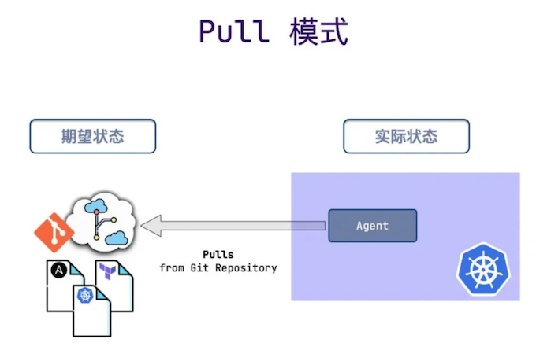
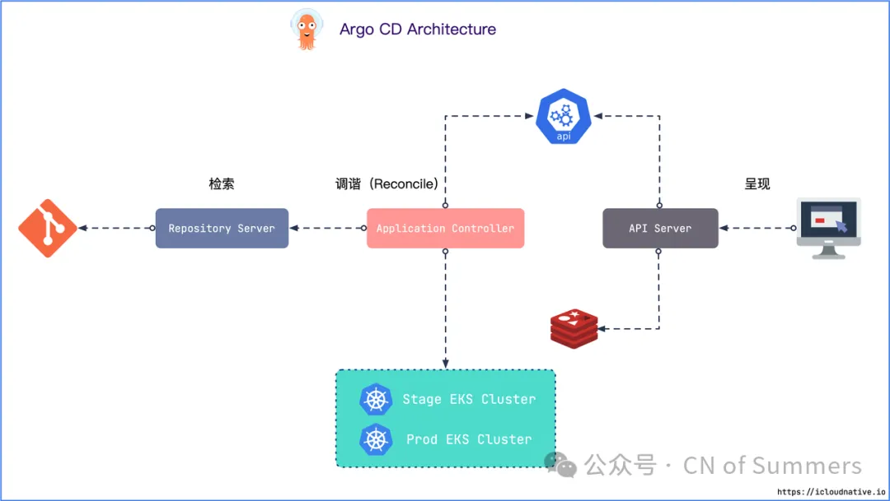

# GitOps 实践：企业变革之路

很多业务都托管在阿里云平台上，同时也使用了 AWS 来支持一部分服务。

**在 Kubernetes 方面，几乎全部使用阿里云的托管服务——ACK Serverless 集群。**

为了保证系统的可监控性，最初我们选择了阿里云 Marketplace 上的 prometheus-operator 来监控集群。

当相关人员对 chart 包做出修改时，我们需要手动更新 Kubernetes 集群中的 Prometheus。

这种手动更新的方式显然不够高效，也有可能浪费我们宝贵的时间，甚至同事们也可能会因此产生困扰。因此，我们需要一种更自动化的解决方案来解决这个问题。

## 引入 GitOps

决定引入 ArgoCD 来解决这个问题。ArgoCD 作为一个声明式的 GitOps 工具，能帮助我们自动化地管理 Kubernetes 上的资源。 

当 GitLab 中的 chart 包发生变动时，ArgoCD 会自动检测到并更新我们集群中的 Prometheus，而无需我们手动介入

## 基础设施即代码

在理解 GitOps 之前，我们需要先理解什么是基础设施即代码。 基础设施即代码（Infrastructure as Code, IaC），顾名思义，表示使用代码（而非手动流程）来定义基础设施，研发人员可以像对待应用软件一样对待基础设施，例如：

* **可以创建包含基础架构规范的声明式配置文件，从而便于编辑和分发配置**。
* 可以确保每次配置的环境都完全相同。
* 可以进行版本控制，所有的变更都会被记录下来，方便溯源。
* 可以将基础设施划分为若干个模块化组件，并通过自动化以不同的方式进行组合。 当然，广义上的 IaC 不仅仅只关于基础设施，还包含了网络、安全、配置等等，所以广义上的 IaC 又叫 X as Code。

**X as Code**

* **Infrastructure** as Code
* **Configuration** as Code
* **Network** as Code
* **Security** as Code
* **Policy** as Code

比如你想在 AWS 中创建服务器，配置网络，部署 Kubernetes 集群以及各种工作负载，你只需要定义好 Terraform 或 Ansible 的声明式配置，以及 Kubernetes 的配置清单即可，免去一切繁杂的手动操作。

### GitOps

1. **声明式（Declarative）**：整个系统必须通过声明式的方式进行描述，比如 Kubernetes 就是声明式的，它通过 YAML 来描述系统的期望状态；
2. **版本控制和不可变（Versioned and immutable）**：所有的声明式描述都存储在 Git 仓库中，通过 Git 我们可以对系统的状态进行版本控制，记录了整个系统的修改历史，可以方便地回滚；
3. **自动拉取（Pulled automatically）**：**Git 仓库中声明的期望状态发生了任何变更，都可以立即应用到系统中，而且不需要安装配置额外工具（比如 kubectl），也不需要配置 Kubernetes 的认证授权**；
4. **持续调谐（Continuously reconciled**）：Reconciliation 其实最早是 Kubernetes 里的一个概念，表示的是确保系统的实际状态与期望状态一致的过程。具体的实现方式是在目标环境中安装一个 agent，一旦实际状态与期望状态不匹配，agent 就会进行自动修复。这里的修复比 Kubernetes 的故障自愈更高级，即使是手动修改了集群的编排清单，集群也会被恢复到 Git 仓库中的清单所描述的状态

GitOps = IaC + Git + CI/CD，即基于 IaC 的版本化 CI/CD。它的核心是使用 Git 仓库来管理基础设施和应用的配置，并且以 Git 仓库作为基础设施和应用的单一事实来源，你从其他地方修改配置（比如手动改线上配置）一概不予通过。

Git 仓库中的声明式配置描述了目标环境当前所需基础设施的期望状态，借助于 GitOps，如果集群的实际状态与 Git 仓库中定义的期望状态不匹配，Kubernetes reconcilers 会根据期望状态来调整当前的状态，最终使实际状态符合期望状态

另一方面，现代应用的开发更多关注的是迭代速度和规模，拥有成熟 DevOps 文化的组织每天可以将代码部署到生成环境中数百次，DevOps 团队可以通过版本控制、代码审查以及自动测试和部署的 CI/CD 流水线等最佳实践来实现这一目标，这就是 GitOps 干的事情

### GitOps vs DevOps

GitOps 与 DevOps 并不冲突，GitOps 是一种技术手段，而 DevOps 是一种文化。GitOps 是一种实现持续交付（Continuous Delivery）、持续部署（Continuous Deployment）和基础设施即代码（IaC）的工具和框架，它是支持 DevOps 文化的。

首先，GitOps 是以目标为导向的。它使用 Git 来维护期望状态，并不断调整实际状态，最终与期望状态相匹配。而 DevOps 更多关注的是最佳实践，这些实践可以普遍应用于企业的每一个流程。

其次，**GitOps 采取声明式的操作方法，而 DevOps 同时接受声明式和命令式的方法**，所以 DevOps 除了适用于容器环境之外，还适用于虚拟机和裸机环境。

最后，**GitOps 重新定义了云原生场景下的 CI/CD，它以 Git 作为中心的不可变状态声明，以加快持续部署速度**。

## Push vs Pull

**CD 流水线有两种模式：Push 和 Pull**。

### Push 模式

目前大多数 CI/CD 工具都使用基于 Push 的部署模式，例如 Jenkins、CircleCI 等。这种模式一般都会在 CI 流水线运行完成后执行一个命令（比如 kubectl）将应用部署到目标环境中

这种 CD 模式的缺陷很明显：

*  需要安装配置额外工具（比如 kubectl）；
* **需要 Kubernetes 对其进行授权**；
* 需要云平台授权；
* 无法感知部署状态。也就无法感知期望状态与实际状态的偏差，需要借助额外的方案来保障一致性

Kubernetes 集群或者云平台对 CI 系统的授权凭证在集群或云平台的信任域之外，不受集群或云平台的安全策略保护，因此 CI 系统很容易被当成非法攻击的载体。

### Pull 模式

**Pull 模式会在目标环境中安装一个 Agent，例如在 Kubernetes 集群中就靠 Operator 来充当这个 Agent**。

Operator 会周期性地监控目标环境的实际状态，并与 Git 仓库中的期望状态进行比较，如果实际状态不符合期望状态，Operator 就会更新基础设施的实际状态以匹配期望状

只有 Git 的变更可以作为期望状态的唯一来源，除此之外，任何人都不可以对集群进行任何更改，即使你修改了，也会被 Operator 还原为期望状态，这也就是传说中的不可变基础设施。

目前基于 Pull 模式的 CD 工具有 Argo CD， Flux CD 以及 ks-devops。

### **GitOps 的优势**

* **更强大的安全保障**

上面已经提到了，使用 GitOps 不需要任何 Kubernetes 或者云平台的凭证来执行部署，Kubernetes 集群内的 Argo CD 或者 Flux CD 只需要访问 Git 仓库，并通过 Pull 模式来更新即可。

另一方面，Git 由用于跟踪和管理代码变更的强大密码学支持，拥有对变更进行签名以证明作者身份和来源的能力，这是保障集群安全的关键

* **Git 作为事实的唯一真实来源**

因为所有的应用包括基础设施的声明式配置都保存在 Git 中，并把 Git 作为应用系统的唯一事实来源，因此可以利用 Git 的强大功能操作所有东西，例如版本控制、历史记录、审计和回滚等等，无需使用 kubectl 这样的工具来操作。

* **提高生产力**

Git 也是开发人员非常熟悉的工具，通过 Git 不断迭代，可以提高生产率，加快开发和部署速度，更快地推出新产品，同时提高系统的稳定性和可靠性

* **更容易合规的审计**

使用 GitOps 的基础设施可以像任何软件项目一样使用 Git 来管理，所以同样可以对其进行质量审计。当有人需要对基础设施进行更改时，会创建一个 Pull Request，等相关人员对其进行 Code Review 之后，更改才可以应用到系统中。

### Argo CD

Argo CD 遵循 GitOps 模式，使用 Git 仓库作为定义所需应用程序状态的真实来源，Argo CD 支持多种 Kubernetes 清单：

* kustomize
* helm charts
* ksonnet applications
* jsonnet files
* Plain directory of YAML/json manifests
* Any custom config management tool configured as a config management plugin

Argo CD 可在指定的目标环境中自动部署所需的应用程序状态，应用程序部署可以在 Git 提交时跟踪对分支、标签的更新，或固定到清单的指定版本。

## 核心架构

先来看一下官方提供的这个架构图，注意默认情况下Argo CD部署时会配置多种组件和Kubernetes controllers。

这些Kubernetes controllers更倾向于CRD而不是模块化的组件，因此在架构图中并没有将其表现出来，与此相似的还有一些如configmap、service、secret的配置

官方的架构图中将整个**Argo CD系统分为四个逻辑层级：UI、Application、Core和Infra**。

逻辑层还有助于使图表更易于理解，因为依赖关系以自上而下的关系表示。这意味着来自顶层的组件将被允许依赖于来自任何底层的任何组件。然而，来自底层的组件永远不会依赖于来自上层的任何组件

* UI：这是表示层。用户主要通过这一层的组件与 Argo CD 进行交互（包括WebUI和CLI）。
* Application：支持来自 UI 层的组件所需的功能。
* Core：主要的 Argo CD gitops 功能由核心层的组件和 Kubernetes 控制器实现。
* Infra：表示 Argo CD 作为其基础设施的一部分所依赖的工具。

以下是各个组件的主要职责，我们在平时维护的时候可以根据这些信息来快速定位故障：

*  Webapp：Argo CD 附带一个强大的 Web 界面，允许管理部署在给定 Kubernetes 集群中的应用程序；
* CLI：Argo CD 提供了一个 CLI，用户可以使用它与 Argo CD API 进行交互。 CLI 还可用于自动化和脚本编写；
* API Server：定义由 Argo CD 公开的专有 API，该 API 为 Web 应用程序和 CLI 功能提供支持；
*  **Application Controller：应用程序控制器负责协调 Kubernetes 中的应用程序资源和项目资源，并将所需的应用程序状态（在 Git 中提供）与实时状态（在 Kubernetes 中）同步**；
* ApplicationSet Controller：ApplicationSet Controller 负责协调 ApplicationSet 资源，applicationset是argo创建的一个CRD；
* Repo Server：Repo Server 在 Argo CD 架构中起着重要作用，因为它负责与 Git 存储库交互，为属于给定 application 的所有 Kubernetes 资源生成所需的状态；
*  **Redis：Argo CD 使用 Redis 来提供缓存层，减少发送到K8S的API Server和Git服务器的请求。它还支持一些 UI 操作**；
*  **Kube API：Argo CD 控制器将连接到K8S的API Server以执行操作**。
	* **因此如果需要管理多个集群时，在部署了argocd之外的集群是不需要部署任何argocd的客户端程序的，只需要创建一个ServiceAccount用于管理权限**；
* Git：作为 gitops 工具，Argo CD 要求在 Git 存储库中提供所需的 Kubernetes 资源状态。 我们在这里使用git来代表实际的 git 存储库、Helm 存储库或 OCI 工件存储库。 Argo CD 支持所有这些选项；
*  **Dex：Argo CD 依赖于 Dex 来提供与外部 OIDC 提供商的身份验证。当然，可以使用其他工具代替 Dex**；

## 工作流架构

从功能架构来看，Argo CD 主要有三个组件：API Server、Repository Server 和 Application Controller。从 GitOps 工作流的角度来看，总共分为 3 个阶段：**检索、调谐和呈现**。

### **检索 – Repository Server**

检索阶段会克隆应用声明式配置清单所在的 Git 仓库，并将其缓存到本地存储。包含 Kubernetes 原生的配置清单、Helm Chart 以及 Kustomize 配置清单。履行这些职责的组件就是 Repository Server。

### **调谐 – Application Controller**

调谐（Reconcile）阶段是最复杂的，这个阶段会将 Repository Server 获得的配置清单与反映集群当前状态的实时配置清单进行对比，一旦检测到应用处于 OutOfSync 状态，Application Controller 就会采取修正措施，使集群的实际状态与期望状态保持一致。

### **呈现 – API Server**

最后一个阶段是呈现阶段，由 Argo CD 的 API Server 负责，它本质上是一个 gRPC/REST Server，提供了一个无状态的可视化界面，用于展示调谐阶段的结果。同时还提供了以下这些功能：

* 应用管理和状态报告；
* 调用与应用相关的操作（例如同步、回滚、以及用户自定义的操作）；
* Git 仓库与集群凭证管理（以 Kubernetes Secret 的形式存储）；
* 为外部身份验证组件提供身份验证和授权委托；
* RBAC 增强；
* Git Webhook 事件的监听器/转发器。
