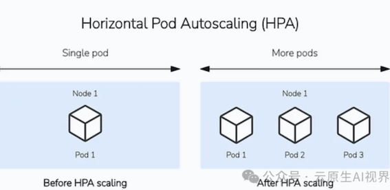
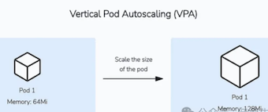
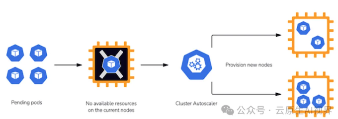
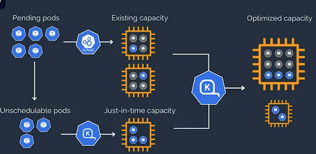

# Karpenter vs. Cluster Autoscaler — Kubernetes 节点自动扩展工具

## Karpenter vs. Cluster Autoscaler — Kubernetes 扩展工具

Kubernetes 提供了多种处理这些扩展需求的方法，其中两种解决方案在集群级别扩展中脱颖而出：传统的 Kubernetes Cluster Autoscaler 和更复杂的新工具 Karpenter。

尽管这两种工具的基本目的都是自动调整集群容量，但它们在方法和实现上有显著差异。

本文比较了这些自动扩展解决方案，探讨了它们的架构、差异和用例。

我们将涵盖以下内容：

* Kubernetes 自动扩展基础
* 什么是 Cluster Autoscaler？
* 什么是 Karpenter？
* Karpenter vs Cluster Autoscaler 表格比较
* Karpenter 和 Cluster Autoscaler 的主要区别
* 未来考虑

## **Kubernetes 自动扩展基础**

Kubernetes 提供了两层自动扩展来处理资源管理的不同方面。

第一层包括在应用程序级别进行自动扩展，通过自动调整部署或复制控制器中的 Pod 副本数量，或通过调整 Pod 的大小。

**水平 Pod 自动扩展器 (HPA)**

水平 Pod 自动扩展器 (HPA) 是最常见的工具，用于自动水平扩展部署所需的 Pod 数量。HPA 在应用程序级别运行，并监控 CPU 利用率、内存使用或自定义指标等指标。

当跟踪的指标超过定义的阈值时，HPA 会相应地增加 Pod 数量。

同样，当资源使用率下降时，HPA 会减少 Pod 数量。HorizontalPodAutoscaler 作为 Kubernetes API 资源和控制器实现。

**Horizontal Pod Autoscaling (HPA)**

**垂直 Pod 自动扩展器 (VPA)**

另一种应用程序级自动扩展选项是垂直自动扩展方法，由垂直 Pod 自动扩展器 (VPA) 实现。

VPA 采用不同的方法。它不是根据使用情况更改 Pod 数量，而是更改它们的大小。**VPA 可以缩小过度请求资源的 Pod，并根据它们的使用情况扩大未充分请求资源的 Pod**

这两种解决方案的核心区别在于垂直自动扩展涉及停机时间。控制器需要更新 Pod 资源，这会导致 Pod 被删除并重新创建。

**VPA 不应与 HPA 在同一资源指标（CPU 或内存）上使用**

## 扩展 Kubernetes 集群

HPA 处理**单个工作负载** 的扩展，而集群级扩展是确保有足够的底层计算资源来容纳这些工作负载的必要条件。

Kubernetes 中的集群自动扩展涉及根据资源需求自动调整集群中的节点数量。

当由于资源不足而无法调度 Pod 时，集群自动扩展机制会添加额外的节点。同样，当节点利用率不足时，可以删除它们以优化成本。

Kubernetes 中最流行的两种集群自动扩展解决方案包括：

* Cluster Autoscaler (CA)：这是传统的、广泛采用且经过实战检验的解决方案，它基于预定义的节点组和配置采用更严格的扩展方法。
* Karpenter：这是一种更灵活的新解决方案，它根据工作负载需求动态配置节点，而无需预定义的节点组。它提供更快的扩展和更好的资源优化。

## 什么是 Kubernetes Cluster Autoscaler (CA)？

Cluster Autoscaler 是一种工具，它通过根据资源需求添加或删除节点来自动调整 Kubernetes 集群的大小。它确保您的集群拥有足够的计算资源来高效处理您的工作负载，同时优化成本。

### Cluster Autoscaler (CA) 的工作原理

当由于资源不足而无法在集群中运行 Pod 时，CA 会被触发并配置额外的节点。

当集群中的节点长时间未被充分利用并且它们的 Pod 可以放置在其他现有节点上时，CA 也会被触发以删除这些节点。

CA 与云提供商或 Kubernetes 的集群 AP集成，以实现节点管理。

例如，AWS EKS 使用其 AWS 自动扩展组功能集成到 Kubernetes 中，以自动添加和删除作为集群节点的 EC2 虚拟机。

### Cluster Autoscaler (CA) 的优势

以下是使用 Cluster Autoscaler 的主要优势：

* **成本和资源优化**：自动删除不需要的基础设施节点，平衡资源可用性和利用率
* **操作效率**：减少集群扩展和维护基础设施组件所需的手动工作和干预
* **高可用性 (HA)**：通过确保所有 Pod 有足够的资源正常运行，有助于实现高可用性
* **多云提供商支持**：查看 README以获取可用的 CA 云提供商集成列表

### Cluster Autoscaler (CA) 的重要考虑和最佳实践

在 Kubernetes 或其他环境中使用 CA 时，您应遵循重要的考虑和最佳实践，以确保高效、稳定和成本效益的扩展。

* **设置资源请求和限制**：为了使 CA 高效运行，您必须为应用程序 Pod 设置适当的资源请求和限制。
* **CA 的主要目的是让挂起的 Pod 有地方运行**：CA 不会考虑实际的 CPU 或内存使用情况来进行扩展决策。
	* **它仅检查 Pod 的请求和限制以做出扩展决策。**
* **将 CA 与 HPA 结合使用：HPA 和 CA 以互补的方式协同工作，以高效管理资源。当 CPU 利用率上升时，HPA 会自动增加部署中的 Pod 副本数量**。 如果集群缺乏足够的资源来调度这些新 Pod，CA 会提供额外的节点。相反，当 CPU 利用率下降时，HPA 会减少 Pod 副本数量。这种 Pod 的减少可能导致节点利用率不足或为空，从而促使 CA 删除这些不必要的节点。
* **监控自动扩展事件并调整配置**：高效运行 CA 不是一项设置后就可以忘记的任务。由于工作负载的需求不断变化，您必须监控集群的自动扩展事件并相应地调整配置。
* **不要手动修改自动扩展的节点**：同一节点组中的所有节点应具有相同的容量、标签和运行在其上的系统 Pod。
* **为关键工作负载设置Pod 中断预算**：Pod 中断预算限制了由于自愿中断而同时不可用的复制应用程序的 Pod 数量。它们在集群操作（如节点排空或自动扩展）期间充当保障措施，通过防止太多应用程序实例同时不可用，确保高可用性。
* **扩展延迟**：在突然的流量高峰期间，CA 会请求云提供商扩展集群。创建和准备新节点以托管新 Pod 的实际时间可能需要几分钟。

### Cluster Autoscaler 的局限性是什么？

Cluster Autoscaler 调整 Kubernetes 集群的大小，但面临扩展延迟、不可调度的 Pod、云提供商限制以及不可驱逐的 Pod 等挑战。

**它缺乏预测性扩展，可能在大型集群或成本优化方面遇到困难，并且依赖于 Kubernetes 和云 API**。有效的规划、PDB 和补充工具可以帮助缓解这些问

## 什么是 Karpenter？

Karpenter 是由 AWS 构建的灵活、高性能的 Kubernetes 集群自动扩展器，它已开源并通过 Kubernetes SIG 自动扩展捐赠给云原生计算基金会 (CNCF)。

Karpenter 自动启动适当的计算资源来处理集群的应用程序。它旨在让您充分利用云的优势，为 Kubernetes 集群提供快速且简单的计算配置。

### Karpenter 的工作原理

Karpenter 通过监视 Kubernetes 调度器标记为不可调度的 Pod，评估调度约束，配置满足 Pod 要求的节点，并在不再需要节点时中断节点。

要配置 Karpenter，您可以创建 NodePools，它定义了 Karpenter 如何管理不可调度的 Pod 并配置节点。

尽管大多数用例通过为多个团队使用单个 NodePool 来解决，但多个 NodePools 有助于隔离节点以进行计费或使用不同的节点约束（例如，某个团队不使用 GPU）。

Karpenter 将在不再需要节点时删除它们。

如果启用，**整合模式** 会主动尝试通过识别何时可以用更便宜的变体替换节点或在重新安排工作负载后删除节点来降低集群成本。

Karpenter 的另一个有用功能与漂移相关**。Karpenter 会将节点标记为漂**移，并中断已从其所需规范漂移的节点。

Karpenter 在预定义的**过期**设置后自动刷新节点。

这对于自动化节点升级非常有用。当节点过期并被终止时，Karpenter 会启动一个带有最新机器镜像的新节点，包括最新的软件和操作系统更新。

### Karpenter 的优势

Karpenter 为扩展 Kubernetes 集群提供了多项优势：

* **更快的节点配置**：Karpenter 直接与云提供商 API 集成以启动实例，并直接管理每个实例，而无需使用节点组等额外的编排机制。这使得它在容量不可用时能够在毫秒内重试，而不是几分钟，并允许在大规模下改进 Pod 调度。
* **成本优化**：由于 Karpenter 轻松考虑多种实例类型和购买选项，它通过即时节点配置、细粒度的资源匹配和自动清理未充分利用的节点提供了改进的资源效率。Karpenter 与 Spot 实例很好地集成，并且可以原生处理中断和缓解。
* **计算灵活性**：不同的团队和工作负载可能有不同的计算需求。Karpenter 通过简单的配置提供对多种实例类型和购买选项的访问，而无需创建数百个节点组。
* **操作优势**：Karpenter 提供了诸如节点过期等功能，并自动使用最新的兼容机器镜像创建新节点，从而有效地简化了数据平面升级。
	* 这意味着节点的维护和升级更少，因为节点会在预定义的时间范围内自动替换为新配置的升级实例。
* **增加多云支持**：围绕 Karpenter 已经建立了一个活跃的社区，它在 AWS 中变得非常流行。Karpenter 目前是一个多云项目，其他 Azure 和 AlibabaCloud 的实现 正在引起兴趣。

### Karpenter 的重要考虑和最佳实践

为了有效实施 Karpenter，请考虑以下最佳实践：

* **将 Karpenter 用于波动的工作负载**：Karpenter 通过绕过云提供商的抽象（如节点组）直接将灵活性引入节点配置，从而在快速高效的自动扩展方面表现出色。这意味着 Karpenter 最适合用于具有高、峰值需求期或多样化计算需求的集群。
* **不要在由 Karpenter 管理的节点上运行 Karpenter**：Karpenter 应运行在不由 Karpenter 管理的节点上，以避免任何调度问题。
* **灵活选择实例类型**：避免过度限制 Karpenter 可以配置的实例类型，尤其是在使用 Spot 时。
	* 作为最佳实践，尝试仅排除不适合您工作负载的实例类型。您允许 Karpenter 使用的实例类型越多，它就越能优化您的环境。
* **中断处理**：当 Karpenter 检测到非自愿中断（如 Spot 中断或计划维护事件）时，它会自动标记、排空并终止节点。它会提前执行此操作，以在中断之前开始优雅地清理工作负载。
* **通过多个 NodePools 实现多租户**：共享集群的不同团队可能需要在不同的工作节点或操作系统类型上运行具有不同要求的工作负载。在这些情况下，配置多个 NodePools 以适应多租户。
* **使用 TTL 自动刷新节点**：节点过期可用于升级，以便节点被退役并替换为更新版本。
* **资源使用和高可用性**：为工作负载定义适当的资源请求和限制，以确保 Karpenter 表现最佳。
	* 当有关工作负载需求的信息准确时，Karpenter 可以启动最适合您工作负载的节点。
	* 如果您使用 Karpenter 的整合功能，这一点尤为重要。为确保您的应用程序以高可用性方式运行，请实施中断预算和 Pod 拓扑分布

### Karpenter 和 Cluster Autoscaler 的主要区别

Cluster Autoscaler 在节点组级别运行，根据挂起的 Pod 调整预定义节点组的大小，而 Karpenter 更灵活。

它根据工作负载需求配置单个节点，并支持实例类型和区域等自定义配置。

**1. 架构和扩展机制**

**Cluster Autoscaler 在节点组级别运行，利用云提供商的抽象**，而 Karpenter 直接与云提供商实例配置 API 交互，允许它动态添加单个节点。

**2. 扩展速度**

由于 Cluster Autoscaler 通过预定义的节点组和扩展策略运行，它的扩展速度响应往往比 Karpenter 慢。

Karpenter 与云提供商的直接交互使其能够快速配置节点，减少需要立即资源的应用程序的延迟。

**3. 工作负载整合和计算灵活性**

Karpenter 允许选择最符合工作负载当前需求的实例类型和配置。这种灵活性使 Karpenter 成为更具响应性和适应性的解决方案。Cluster Autoscaler 有时可能导致过度配置，因为它并不总是为特定工作负载提供最佳和细粒度的选择。

尽管 Cluster Autoscaler 可以与 Spot 实例一起工作，但它缺乏 Karpenter 提供的管理 Spot 中断和选择最佳 Spot 实例的高级集成。

**4. 云提供商集成**

在云提供商和系统支持方面，CA 具有优势。CA 与多个云提供商[26] 一起工作，而 Karpenter 目前与 AWS、Azure 和 Alibaba Cloud 一起工作。

**5. 操作特性**

Cluster Autoscaler 是经过实战检验的成熟工具，同时提供更广泛的云提供商支持。然而，当您需要管理多个节点组时，其设置可能会变得复杂，并且总体上提供的灵活性有限。

**Karpenter 采用了更现代的设计，专注于简化操作。诸如整合、过期和 Spot 中断等功能使 Kubernetes 管理员的维护和升级更加容易。**

**6. 用例适用性**

Cluster Autoscaler 更适合具有简单和可预测工作负载以及预定义配置的传统部署模式。它在多云支持方面也更加通用，使其成为跨多个云环境运行 Kubernetes 集群的团队的良好选择。

Karpenter 最适合动态工作负载和成本敏感的操作。其简化的操作方法使其成为希望在减少操作开销的同时专注于成本优化的用例的绝佳选择。

尽管 Karpenter 从 AWS 开始，但它正在扩展到其他云提供商，如 Azure。

### **Karpenter 比 Cluster Autoscaler 更好吗？**

Karpenter 提供了更动态和灵活的 Kubernetes 集群扩展方法，具有更快的扩展时间和优化的资源利用率。然而，它目前主要支持 AWS 环境可能限制其在多云场景中的适用性。

Cluster Autoscaler 提供了稳定、可预测的扩展机制，与多个云提供商兼容，但由于其依赖于预定义的节点组，可能会导致效率低下。