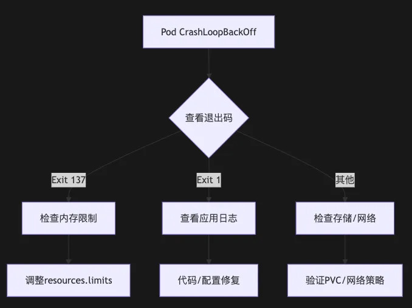

# K8s 悬案：当 Pod 集体 “自杀” 而日志却说一切正常(2025)

### 1 故障场景深度还原

**影响范围**：

* **生产集群prod-cluster-01中，payment-service、order-service等核心服务共32个Pod进入CrashLoopBackOff状态**
* 服务可用性从99.99%骤降至83.5%，用户支付失败率上升至15%

**初步观察：**

* 容器启动日志显示`Application started successfully on port 8080`
* 但`kubectl describe pod`显示`Last State: Terminated with exit code 137`
* **节点监控显示`node-5`至`node-8`内存使用率超90%**

### 2 SRE标准化应急响应流程（逐步拆解）

####  阶段1：黄金5分钟 - 快速定位问题边界

**1. 信息收集模板（群内首发）**

```
@运维团队 @开发团队 @网络团队  
【故障通告 - 2024-08-20 14:05】  
**现象**：  
- 生产集群prod-cluster-01出现32个Pod CrashLoopBackOff  
- 影响服务：payment-service、order-service  
**紧急行动项**：  
1. [开发团队] 请提供最近1小时内的发布记录和配置变更（Git提交记录+Helm版本）  
2. [网络团队] 验证以下端口连通性（示例命令）：  
   - 节点间：`nc -zv 10.0.5.10 6443`（API Server）  
   - 跨命名空间：`kubectl run net-test --image=nicolaka/netshoot --command -- sleep 3600`
3. [存储团队] 检查Ceph集群状态：`ceph -s`
4. [运维团队] 正在收集以下数据（预计5分钟同步）：  
   - 异常Pod分布图（见附件）  
   - 关键组件日志（API Server、kubelet、CNI插件）  
**沟通纪律**：  
- 所有结论需附带日志片段或命令输出  
- 非紧急问题请通过工单系统提交  
```

**2. 初步诊断（命令详解）**

```
# 1. 确认故障范围（按命名空间统计）
kubectl get pods -A -o wide | grep CrashLoopBackOff | awk '{print $1}' | sort | uniq -c


# 输出示例：
# 15 payment-service
# 17 order-service
```

```
# 2. 检查节点状态（重点观察资源水位）
kubectl top nodes --use-protocol-buffers
# 输出示例：
# NAME       CPU(cores)  CPU%  MEMORY(bytes)  MEMORY%
# node-5     3800m       95%   6144Mi         98%
# node-6     4200m       92%   5892Mi         96%
```


```
# 3. 查看kubelet关键日志（过滤错误）
journalctl -u kubelet -n 200 --no-pager | grep -E 'error|fail|oom'
# 关键日志线索：
# Aug 20 13:58:23 node-5 kubelet[1123]: Error: failed to start container "payment": OOMKilled
```

####  阶段2：根因分析 - 全链路排查

```
# 1. 查看Pod完整事件链（重点关注Warning事件）
kubectl describe pod payment-service-abcde -n production | grep -A 30 Events:

# 输出示例：
# Events:
#   Type     Reason     Age    From               Message
#   ----     ------     ----   ----               -------
#   Warning  Unhealthy  2m10s  kubelet            Liveness probe failed: HTTP probe failed...
#   Normal   Killing    2m10s  kubelet            Stopping container payment
#   Warning  BackOff    2m8s   kubelet            Back-off restarting failed container


# 2. 获取前一次容器日志（关键！）
kubectl logs payment-service-abcde --previous --tail=200
# 日志片段：
# ERROR [main] o.s.boot.SpringApplication: Application run failed
# java.lang.OutOfMemoryError: Java heap space


# 3. 检查容器退出码（137=OOM）
kubectl get pod payment-service-abcde -o jsonpath='{.status.containerStatuses[].lastState.terminated.exitCode}'
# 输出：137
```

#### 4. 存储与网络专项验证（分步骤）

**存储验证流程：**

```
# 1. 进入Pod验证挂载点
kubectl exec -it payment-service-abcde -- df -h
# 输出示例：
# Filesystem      Size  Used Avail Use% Mounted on
# /dev/rbd0        50G   50G     0 100% /data

# 2. 尝试写入测试文件
kubectl exec -it payment-service-abcde -- touch /data/test.txt
# 错误信息：
# touch: cannot touch '/data/test.txt': No space left on device

# 3. 检查PVC状态
kubectl get pvc -n production
# 输出示例：
# NAME           STATUS   VOLUME   CAPACITY   ACCESS MODES
# payment-data   Bound    pvc-xyz  50Gi       RWO
```

**网络验证流程**：

```
# 1. 创建临时网络诊断Pod
kubectl run net-test --image=nicolaka/netshoot -it --rm --restart=Never --command -- sh

# 2. 验证服务发现
nslookup payment-service.production.svc.cluster.local
# 预期输出：解析到ClusterIP

# 3. 测试跨命名空间通信
nc -zv redis.cache.svc.cluster.local 6379
# 错误示例：
# Connection to redis.cache.svc.cluster.local (10.100.50.10) 6379 port [tcp/*] failed: Connection timed out
```

#### 5. 探针配置审计（常见错误模式）

```
# 错误配置示例：探针过于敏感
livenessProbe:
  httpGet:
    path: /healthz
    port: 8080
  initialDelaySeconds: 2   # 应用启动需要10秒以上
  periodSeconds: 5         # 检测过于频繁
  failureThreshold: 3      # 失败3次即重启

# 优化建议：
livenessProbe:
  httpGet:
    path: /healthz
    port: 8080
  initialDelaySeconds: 30   # 根据应用启动时间调整
  periodSeconds: 10        
  failureThreshold: 5
```


## 典型故障模式与解决方案（附真实案例）

**现象：**

* `kubectl describe pod`显示`Warning: FailedMount`
* 存储插件日志（Ceph CSI）报No space left on device


**排查步骤：**

1. 检查存储卷容量：

```
kubectl exec -it payment-service-abcde -- df -h /data
# 输出：Use% 100%
```

**2. 清理存储或扩容PVC：**

```
# 临时清理（需开发确认）
kubectl exec -it payment-service-abcde -- rm -rf /data/logs/*.old

# 永久扩容
kubectl edit pvc payment-data -n production
# 修改spec.resources.requests.storage: "100Gi"
```

**Case 2：节点内存泄漏触发OOM**

现象：

* 容器退出码137（OOMKilled）
* 节点dmesg日志显示Out of memory: Kill process


解决方案：

1. 调整Pod资源限制

```
resources:
  requests:
    memory: "2Gi"
  limits:
    memory: "4Gi"  # 原为2Gi
```

**2. 优化应用内存配置：**

```
# Java应用添加JVM参数
-XX:MaxRAMPercentage=80
```

**Case 3：网络策略阻断服务发现**

现象：

* 容器日志显示`java.net.UnknownHostException: redis.cache`
* kubectl exec执行nslookup失败

**排查流程：**

**1. 检查NetworkPolicy：**

```
kubectl get networkpolicy -n production
# 发现存在default-deny-all策略
```

**2. 添加允许规则：**

```
apiVersion: networking.k8s.io/v1
kind: NetworkPolicy
metadata:
  name: allow-dns
spec:
  podSelector: {}
  policyTypes:
    - Egress
  egress:
    - ports:
        - protocol: UDP
          port: 53
```

**信息同步模板（每小时更新）**

```
【故障处理进展 - 2024-08-20 15:00】  
**当前状态**：  
- 已恢复25个Pod，剩余7个仍在处理  
- 确认根因：Ceph存储卷空间耗尽（OSD.12故障导致容量计算错误）  

**行动记录**：  
1. [存储团队] 已完成OSD.12替换，存储集群恢复健康  
2. [运维团队] 执行以下操作：  
   - 扩容受影响PVC至100Gi  
   - 驱逐故障节点上的Pod  
3. [开发团队] 已回滚可能导致内存泄漏的配置变更  

**后续计划**：  
- 16:00前完成所有Pod恢复  
- 今晚22:00进行存储系统架构评审  

**遗留风险**：  
- 节点node-5内存使用率仍偏高（建议后续扩容）  
```

**3. 故障复盘模板**

```
## 故障复盘报告 - 2024-08-20  
**影响时长**：14:00-15:47（总1小时47分钟）  

**根本原因**：  
1. 直接原因：Ceph OSD.12磁盘故障导致存储卷容量计算错误  
2. 深层原因：  
   - 存储容量监控未覆盖OSD级指标  
   - PVC自动扩容策略未启用  

**改进项**：  
| 改进措施                  | 负责人   | 截止日期  |  
|---------------------------|----------|-----------|  
| 部署Ceph OSD健康监控      | 存储团队 | 2024-08-25|  
| 启用PVC自动扩容（StorageClass） | 运维团队 | 2024-08-23|  
| 实施存储多AZ副本策略       | 架构组   | 2024-09-10|  

**经验沉淀**：  
- 新增《存储故障应急手册》第3.2节  
- 开发团队完成JVM内存配置培训  
```

## 5、防御性设计与长效优化

**1. 集群健康检查自动化脚本**

```
#!/bin/bash
# check_k8s_health.sh

# 控制平面检查
kubectl get componentstatuses
kubectl -n kube-system get pods -l tier=control-plane

# 节点状态检查
kubectl get nodes -o json | jq -r '.items[] | .metadata.name + " " + .status.conditions[] | select(.type=="Ready").status'

# 存储健康检查
if which ceph &>/dev/null; then
  ceph -s
  ceph osd tree
fi

# 网络策略审计
calicoctl get networkpolicy -A -o wide
```

**2. 混沌工程常态化测试方案**

```
# chaos-mesh/network-loss.yaml
apiVersion: chaos-mesh.org/v1alpha1
kind: NetworkChaos
metadata:
  name: simulate-network-loss
spec:
  action: loss
  mode: one
  selector:
    namespaces: [production]
  loss:
    loss: "50"
    correlation: "50"
  duration: "5m"
```

#### 3. 架构优化措施
 
**存储多活架构：**

```
apiVersion: storage.k8s.io/v1
kind: StorageClass
metadata:
  name: ceph-rbd-multi-az
parameters:
  clusterID: ceph-primary
  mirroringPool: replica-pool
  dataPool: ec-data-pool
provisioner: rbd.csi.ceph.com
reclaimPolicy: Retain
volumeBindingMode: WaitForFirstConsumer
```

**Pod优先级与抢占：**

```
apiVersion: scheduling.k8s.io/v1
kind: PriorityClass
metadata:
  name: mission-critical
value: 1000000
globalDefault: false
description: "用于核心业务Pod"
```

## 6、可视化辅助工具

1. 故障排查流程图



**2. 典型故障模式速查表**

* 137 - OOMKilled  - `kubectl top pod/node`
* 1 - 应用启动失败 - `kubectl logs --previous`
* 143 - SIGTERM终止 - SIGTERM终止
* 255 -  容器运行时错误 - `docker inspect <container>`


 


