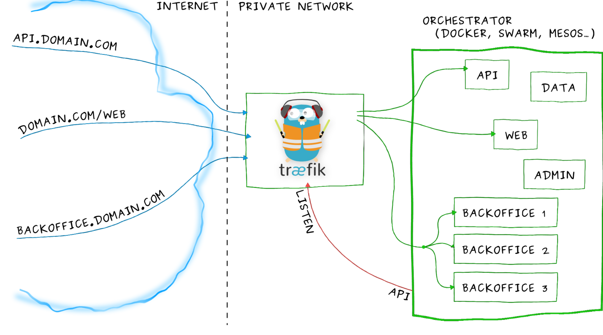
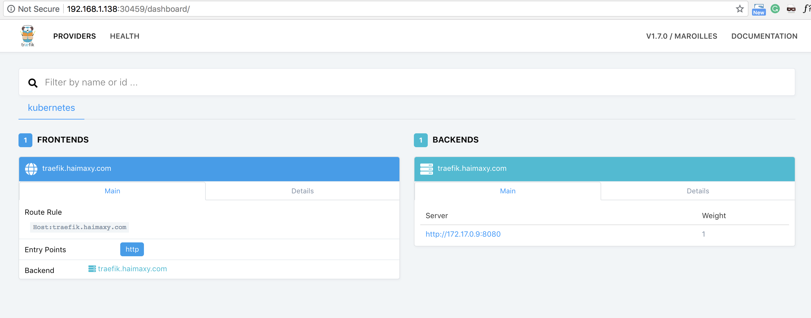
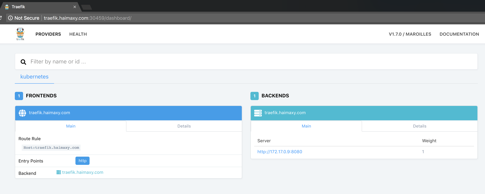
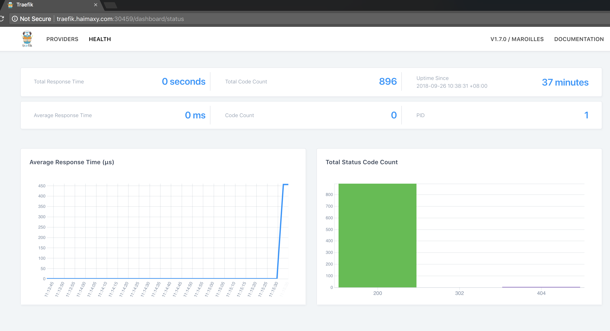
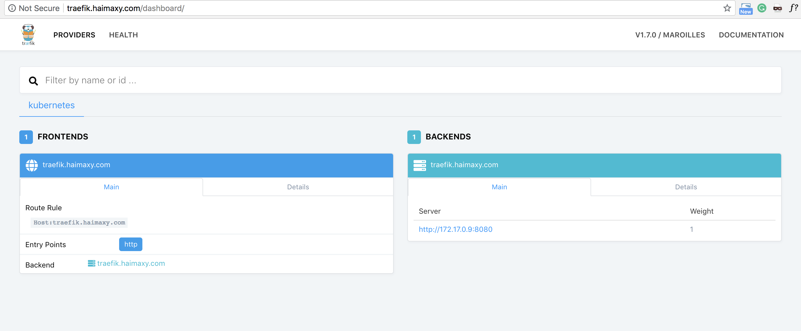

# 外部服务发现之 ingress(一)
# traefik 的安装使用

### 我们部署在`Kubernetes` 集群中的应用如何暴露给外部的用户使用呢？

我们知道前面我们使用 `NodePort` 和 `LoadBlancer` 类型的 `Service` 可以实现把应用暴露给外部用户使用，除此之外，`Kubernetes` 还为我们提供了一个非常重要的资源对象可以用来暴露服务给外部用户，那就是 `ingress`。对于小规模的应用我们使用`NodePort`或许能够满足我们的需求，但是当你的应用越来越多的时候，你就会发现对于 `NodePort` 的管理就非常麻烦了，这个时候使用 `ingress` 就非常方便了，可以避免管理大量的 `Port`。


## 介绍

**`Ingress`** 其实就是从 `kuberenets` 集群外部访问集群的一个入口，将外部的请求转发到集群内不同的 `Service` 上，其实就相当于 `nginx`、`haproxy` 等负载均衡代理服务器，有的同学可能觉得我们直接使用 `nginx` 就实现了，但是只使用 `nginx` 这种方式有很大缺陷，每次有新服务加入的时候怎么改 `Nginx` 配置？不可能让我们去手动更改或者滚动更新前端的 `Nginx Pod` 吧？那我们再加上一个服务发现的工具比如 `consul` 如何？貌似是可以，对吧？而且在之前单独使用 `docker` 的时候，这种方式已经使用得很普遍了，`Ingress` 实际上就是这样实现的，只是服务发现的功能自己实现了，不需要使用第三方的服务了，然后再加上一个域名规则定义，路由信息的刷新需要一个靠 `Ingress controller` 来提供。

### `Ingress controller` 可以理解为一个监听器，通过不断地与 `kube-apiserver` 打交道，实时的感知后端 `service`、`pod `的变化，当得到这些变化信息后，`Ingress controller` 再结合 `Ingress` 的配置，更新反向代理负载均衡器，达到服务发现的作用。
其实这点和服务发现工具 `consul consul-template` 非常类似。

现在可以供大家使用的 `Ingress controller` 有很多，比如 [traefik](https://traefik.io/)、[nginx-controller](https://kubernetes.github.io/ingress-nginx/)、[Kubernetes Ingress Controller for Kong](https://konghq.com/blog/kubernetes-ingress-controller-for-kong/)、[HAProxy Ingress controller](https://github.com/jcmoraisjr/haproxy-ingress)，当然你也可以自己实现一个 `Ingress Controller`，现在普遍用得较多的是 `traefik` 和 `nginx-controller`，`traefik `的性能较 `nginx-controller` 差，但是配置使用要简单许多，我们这里会以更简单的 `traefik` 为例给大家介绍 `ingress` 的使用。

## Traefik

**`Traefik` 是一款开源的反向代理与负载均衡工具**。它最大的优点是能够与常见的微服务系统直接整合，可以实现自动化动态配置。目前支持 `Docker、Swarm、Mesos/Marathon、 Mesos、Kubernetes、Consul、Etcd、Zookeeper、BoltDB、Rest API` 等等后端模型。



要使用 `traefik`，我们同样需要部署 `traefik` 的 `Pod`，由于我们演示的集群中只有 `master` 节点有外网网卡，所以我们这里只有 `master` 这一个边缘节点，我们将 `traefik` 部署到该节点上即可。

### 删除原来已经建好的traefik

```
$ cd traefik/traefik/examples/k8s

$ kubectl delete -f ui.yaml
service "traefik-web-ui" deleted
ingress "traefik-web-ui" deleted

$ kubectl delete -f nginx1.yaml
ingress "my-nginx1-ingress" deleted

$ kubectl delete -f nginx2.yaml
ingress "traefik-ingress" deleted

$ kubectl delete -f traefik-deployment.yaml
serviceaccount "traefik-ingress-controller" deleted
deployment "traefik-ingress-controller" deleted

$ kubectl delete -f traefik-rbac.yaml
clusterrole "traefik-ingress-controller" deleted
clusterrolebinding "traefik-ingress-controller" deleted
```


首先，为安全起见我们这里使用 `RBAC` 安全认证方式：(`rbac.yaml`)：

```
---
apiVersion: v1
kind: ServiceAccount
metadata:
  name: traefik-ingress-controller
  namespace: kube-system
---
kind: ClusterRole
apiVersion: rbac.authorization.k8s.io/v1beta1
metadata:
  name: traefik-ingress-controller
rules:
  - apiGroups:
      - ""
    resources:
      - services
      - endpoints
      - secrets
    verbs:
      - get
      - list
      - watch
  - apiGroups:
      - extensions
    resources:
      - ingresses
    verbs:
      - get
      - list
      - watch
---
kind: ClusterRoleBinding
apiVersion: rbac.authorization.k8s.io/v1beta1
metadata:
  name: traefik-ingress-controller
roleRef:
  apiGroup: rbac.authorization.k8s.io
  kind: ClusterRole
  name: traefik-ingress-controller
subjects:
- kind: ServiceAccount
  name: traefik-ingress-controller
  namespace: kube-system
```

直接在集群中创建即可：


```
$ kubectl create -f rbac.yaml
serviceaccount "traefik-ingress-controller" created
clusterrole.rbac.authorization.k8s.io "traefik-ingress-controller" created
clusterrolebinding.rbac.authorization.k8s.io "traefik-ingress-controller" created
```

然后使用 `Deployment` 来管理 `Pod`，直接使用官方的 `traefik` 镜像部署即可（`traefik.yaml`）

```
---
kind: Deployment
apiVersion: extensions/v1beta1
metadata:
  name: traefik-ingress-controller
  namespace: kube-system
  labels:
    k8s-app: traefik-ingress-lb
spec:
  replicas: 1
  selector:
    matchLabels:
      k8s-app: traefik-ingress-lb
  template:
    metadata:
      labels:
        k8s-app: traefik-ingress-lb
        name: traefik-ingress-lb
    spec:
      serviceAccountName: traefik-ingress-controller
      terminationGracePeriodSeconds: 60
      tolerations:
      - operator: "Exists"
      nodeSelector:
        kubernetes.io/hostname: master
      containers:
      - image: traefik
        name: traefik-ingress-lb
        ports:
        - name: http
          containerPort: 80
        - name: admin
          containerPort: 8080
        args:
        - --api
        - --kubernetes
        - --logLevel=INFO
---
kind: Service
apiVersion: v1
metadata:
  name: traefik-ingress-service
  namespace: kube-system
spec:
  selector:
    k8s-app: traefik-ingress-lb
  ports:
    - protocol: TCP
      port: 80
      name: web
    - protocol: TCP
      port: 8080
      name: admin
  type: NodePort
```

直接创建上面的资源对象即可：

```
$ kubectl create -f traefik.yaml
deployment.extensions "traefik-ingress-controller" created
service "traefik-ingress-service" created
```

要注意上面 yaml 文件：

```
tolerations:
- operator: "Exists"
nodeSelector:
  kubernetes.io/hostname: master
```
由于我们这里的特殊性，只有 `master` 节点有外网访问权限，所以我们使用`nodeSelector`标签将`traefik`的固定调度到`master`这个节点上，那么上面的`tolerations`是干什么的呢？这个是因为我们集群使用的 `kubeadm` 安装的，`master` 节点默认是不能被普通应用调度的，要被调度的话就需要添加这里的 `tolerations` 属性，当然如果你的集群和我们的不太一样，直接去掉这里的调度策略就行。

### `traefik` 还提供了一个 `web ui` 工具，就是上面的 `8080` 端口对应的服务，为了能够访问到该服务，我们这里将服务设置成的 `NodePort`：

```
$ kubectl get pods -n kube-system -l k8s-app=traefik-ingress-lb -o wide
NAME                                          READY     STATUS    RESTARTS   AGE       IP           NODE
traefik-ingress-controller-69fcb85b8c-7rf8d   1/1       Running   0          2m        172.17.0.8   192.168.1.138

$ kubectl get svc -n kube-system
NAME                      TYPE        CLUSTER-IP       EXTERNAL-IP   PORT(S)                       AGE
traefik-ingress-service   NodePort    10.254.236.84    <none>        80:31712/TCP,8080:30459/TCP   2m
```

现在在浏览器中输入 `node_ip:30459` 就可以访问到 `traefik` 的 `dashboard` 了：




## Ingress 对象

现在我们是通过 `NodePort` 来访问 `traefik` 的 `Dashboard` 的，那怎样通过 `ingress` 来访问呢？ 首先，需要创建一个 `ingress` 对象：(`ingress.yaml`)

```
apiVersion: extensions/v1beta1
kind: Ingress
metadata:
  name: traefik-web-ui
  namespace: kube-system
  annotations:
    kubernetes.io/ingress.class: traefik
spec:
  rules:
  - host: traefik.haimaxy.com
    http:
      paths:
      - backend:
          serviceName: traefik-ingress-service
          servicePort: 8080
```

然后为 `traefik dashboard` 创建对应的 `ingress` 对象：

```
$ kubectl create -f ingress.yaml
ingress.extensions "traefik-web-ui" created
```

要注意上面的 `ingress` 对象的规则，特别是 `rules` 区域，我们这里是要为 `traefik` 的 `dashboard` 建立一个 `ingress` 对象，所以这里的 `serviceName` 对应的是上面我们创建的 `traefik-ingress-service`，端口也要注意对应 `8080` 端口，为了避免端口更改，这里的 `servicePort` 的值也可以替换成上面定义的 `port` 的名字：**admin**

创建完成后，我们应该怎么来测试呢？

* 第一步，在本地的`/etc/hosts`里面添加上 `traefik.haimaxy.com` 与 `master` 节点外网 `IP` 的映射关系

```
$ sudo vi /etc/hosts

...
::1             localhost
192.168.1.138 traefik.haimaxy.com traefik.haimaxy.com
```

* 第二步，在浏览器中访问：**`http://traefik.haimaxy.com`，我们会发现并没有得到我们期望的 `dashboard` 界面**，这是因为我们上面部署 `traefik` 的时候使用的是 `NodePort` 这种 `Service` 对象，所以我们只能通过上面的 30539 端口访问到我们的目标对象：[http://traefik.haimaxy.com:30459](http://traefik.haimaxy.com:30459/dashboard/)



加上端口后我们发现可以访问到 `dashboard` 了，而且在 `dashboard `当中多了一条记录，正是上面我们创建的 `ingress` 对象的数据，我们还可以切换到 `HEALTH` 界面中，可以查看当前 `traefik` 代理的服务的整体的健康状态



* 第三步，上面我们可以通过自定义域名加上端口可以访问我们的服务了，但是我们平时服务别人的服务是不是都是直接用的域名啊，`http` 或者 `https` 的，几乎很少有在域名后面加上端口访问的吧？为什么？太麻烦啊，端口也记不住，要解决这个问题，怎么办，我们只需要把我们上面的 `traefik` 的核心应用的端口隐射到 `master` 节点上的 `80` 端口，是不是就可以了，因为 `http` 默认就是访问 `80` 端口，但是我们在 `Service` 里面是添加的一个 `NodePort` 类型的服务，没办法隐射 `80` 端口，怎么办？

### 这里就可以直接在 `Pod` 中指定一个 `hostPort` 即可，更改上面的 `traefik.yaml` 文件中的容器端口：


```
containers:
- image: traefik
name: traefik-ingress-lb
ports:
- name: http
  containerPort: 80
  hostPort: 80
- name: admin
  containerPort: 8080
```

添加以后`hostPort: 80`，然后更新应用：

```
$ vi traefik.yaml
vagrant@kube-node1:~/mytraefik$  kubectl apply -f traefik.yaml
Warning: kubectl apply should be used on resource created by either kubectl create --save-config or kubectl apply
deployment "traefik-ingress-controller" configured
Warning: kubectl apply should be used on resource created by either kubectl create --save-config or kubectl apply
service "traefik-ingress-service" configured
```

更新完成后，这个时候我们在浏览器中直接使用域名方法测试下：



