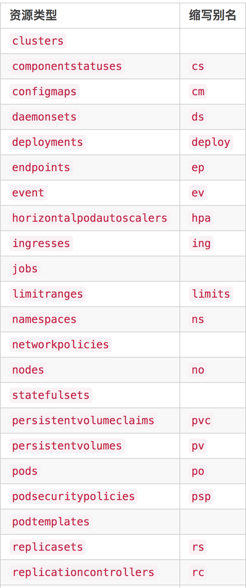
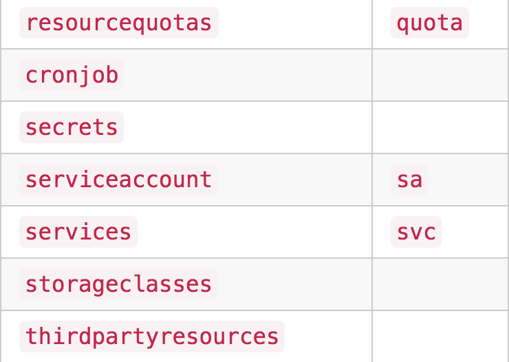
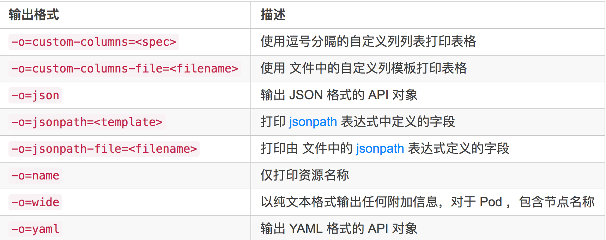
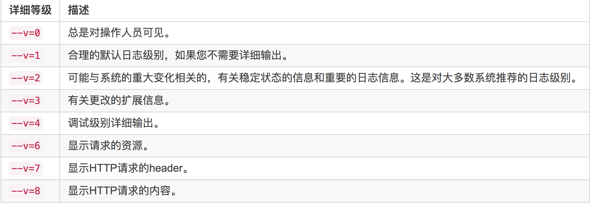

# Kubectl Cheatsheet / kubectl命令技巧大全

Kubectl 命令是操作 `kubernetes` 集群的最直接和最 skillful 的途径，这个 **60MB** 大小的二进制文件，到底有啥能耐呢？本文是对官方文档的中文翻译，原文地址：[https://kubernetes.io/docs/user-guide/kubectl-cheatsheet/](https://kubernetes.io/docs/user-guide/kubectl-cheatsheet/)。

## Kubectl 自动补全

### Bash 用户

```
$ echo "source <(kubectl completion bash)" >> ~/.bashrc
$ source ~/.bashrc
```

### ZSH 用户

```
$ echo "source <(kubectl completion zsh)" >> ~/.zshrc
$ source ~/.zshrc
```

## Kubectl 上下文和配置

设置 `kubectl` 命令交互的 `kubernetes` 集群并修改配置信息。

```
$ kubectl config view # 显示合并后的 kubeconfig 配置

apiVersion: v1
clusters:
- cluster:
    certificate-authority-data: REDACTED
    server: https://k8s-api.virtual.local:6443
  name: kubernetes
contexts:
- context:
    cluster: kubernetes
    user: admin
  name: kubernetes
- context:
    cluster: kubernetes
    namespace: kube-system
    user: nyjxi
  name: nyjxi-context
current-context: kubernetes
kind: Config
preferences: {}
users:
- name: admin
  user:
    client-certificate-data: REDACTED
    client-key-data: REDACTED
    token: 6e872236b852d4b708b98a0c906f9f41
- name: nyjxi
  user:
    client-certificate: /home/vagrant/rabc/nyjxi.crt
    client-key: /home/vagrant/rabc/nyjxi.key
```

```
# 同时使用多个 kubeconfig 文件并查看合并后的配置
$ KUBECONFIG=~/.kube/config:~/.kube/kubconfig2 kubectl config view
```

```
# 获取 e2e 用户的密码
$ kubectl config view -o jsonpath='{.users[?(@.name == "e2e")].user.password}'
```

```
# 显示当前的上下文
$ kubectl config current-context
kubernetes
```

```
# 向 kubeconf 中增加支持基本认证的新集群
$ kubectl config set-credentials kubeuser/foo.kubernetes.com --username=kubeuser --password=kubepassword

# 使用指定的用户名和 namespace 设置上下文
$ kubectl config set-context gce --user=cluster-admin --namespace=foo \
  && kubectl config use-context gce
```

## Kubectl Context and Configuration

Set which Kubernetes cluster `kubectl` communicates with and modifies configuration information.

```
kubectl config view # Show Merged kubeconfig settings.

# use multiple kubeconfig files at the same time and view merged config
KUBECONFIG=~/.kube/config:~/.kube/kubconfig2 

kubectl config view

# get the password for the e2e user
kubectl config view -o jsonpath='{.users[?(@.name == "e2e")].user.password}'

kubectl config view -o jsonpath='{.users[].name}'    # get a list of users
kubectl config get-contexts                          # display list of contexts 
kubectl config current-context			               # display the current-context
kubectl config use-context my-cluster-name           # set the default context to my-cluster-name

# add a new cluster to your kubeconf that supports basic auth
kubectl config set-credentials kubeuser/foo.kubernetes.com --username=kubeuser --password=kubepassword

# permanently save the namespace for all subsequent kubectl commands in that context.
kubectl config set-context --current --namespace=ggckad-s2

# set a context utilizing a specific username and namespace.
kubectl config set-context gce --user=cluster-admin --namespace=foo \
  && kubectl config use-context gce
 
kubectl config unset users.foo                       # delete user foo

```


## 创建对象

`Kubernetes` 的清单文件可以使用 `json` 或 `yaml` 格式定义。可以以 `.yaml`、`.yml`、或者 `.json` 为扩展名。

```
$ kubectl create -f ./my-manifest.yaml           # 创建资源
$ kubectl create -f ./my1.yaml -f ./my2.yaml     # 使用多个文件创建资源
$ kubectl create -f ./dir                        # 使用目录下的所有清单文件来创建资源
$ kubectl create -f https://git.io/vPieo         # 使用 url 来创建资源


$ kubectl run nginx --image=nginx                # 启动一个 nginx 实例
```

```
$ kubectl explain pods,svc                       # 获取 pod 和 svc 的文档

$ kubectl explain pods 

ESCRIPTION:
Pod is a collection of containers that can run on a host. This resource is created by clients and scheduled onto hosts.

FIELDS:
   kind	<string>
     Kind is a string value representing the REST resource this object
     represents. Servers may infer this from the endpoint the client submits
     requests to. Cannot be updated. In CamelCase. More info:
     https://git.k8s.io/community/contributors/devel/api-conventions.md#types-kinds

   metadata	<Object>
     Standard object's metadata. More info:
     https://git.k8s.io/community/contributors/devel/api-conventions.md#metadata

   spec	<Object>
     Specification of the desired behavior of the pod. More info: https://
     git.k8s.io/community/contributors/devel/api-conventions.md#spec-and-status/

   status	<Object>
     Most recently observed status of the pod. This data may not be up to date.
     Populated by the system. Read-only. More info: https://git.k8s.io/community/
     contributors/devel/api-conventions.md#spec-and-status/

   apiVersion	<string>
     APIVersion defines the versioned schema of this representation of an
     object. Servers should convert recognized schemas to the latest internal
     value, and may reject unrecognized values. More info:
     https://git.k8s.io/community/contributors/devel/api-conventions.md#resources


$ kubectl explain svc
DESCRIPTION:
Service is a named abstraction of software service (for example, mysql) consisting of local port (for example 3306) that the proxy listens on, and the selector that determines which pods will answer requests sent through the proxy.

FIELDS:
   apiVersion	<string>
     APIVersion defines the versioned schema of this representation of an
     object. Servers should convert recognized schemas to the latest internal
     value, and may reject unrecognized values. More info:
     https://git.k8s.io/community/contributors/devel/api-conventions.md#resources

   kind	<string>
     Kind is a string value representing the REST resource this object
     represents. Servers may infer this from the endpoint the client submits
     requests to. Cannot be updated. In CamelCase. More info:
     https://git.k8s.io/community/contributors/devel/api-conventions.md#types-kinds

   metadata	<Object>
     Standard object's metadata. More info:
     https://git.k8s.io/community/contributors/devel/api-conventions.md#metadata

   spec	<Object>
     Spec defines the behavior of a service. https://git.k8s.io/community/
     contributors/devel/api-conventions.md#spec-and-status/

   status	<Object>
     Most recently observed status of the service. Populated by the system.
     Read-only. More info: https://git.k8s.io/community/contributors/devel/
     api-conventions.md#spec-and-status/
```

## 显示和查找资源

```
# Get commands with basic output
$ kubectl get services                          # 列出所有 namespace 中的所有 service
$ kubectl get pods --all-namespaces             # 列出所有 namespace 中的所有 pod
$ kubectl get pods -o wide                      # 列出所有 pod 并显示详细信息
$ kubectl get deployment my-dep                 # 列出指定 deployment
$ kubectl get pods --include-uninitialized      # 列出该 namespace 中的所有 pod 包括未初始化的


# 使用详细输出来描述命令
$ kubectl describe nodes my-node
$ kubectl describe pods my-pod

$ kubectl describe nodes 192.168.1.138
Name:               192.168.1.138
Roles:              <none>
Labels:             beta.kubernetes.io/arch=amd64
                    beta.kubernetes.io/os=linux
                    kubernetes.io/hostname=192.168.1.138
                    source=master02
Annotations:        node.alpha.kubernetes.io/ttl=0
                    volumes.kubernetes.io/controller-managed-attach-detach=true
Taints:             <none>
CreationTimestamp:  Fri, 14 Sep 2018 01:48:15 +0000
Conditions:
  Type             Status  LastHeartbeatTime                 LastTransitionTime                Reason                       Message
  ----             ------  -----------------                 ------------------                ------                       -------
  OutOfDisk        False   Wed, 21 Nov 2018 09:05:12 +0000   Fri, 14 Sep 2018 01:48:15 +0000   KubeletHasSufficientDisk     kubelet has sufficient disk space available
  MemoryPressure   False   Wed, 21 Nov 2018 09:05:12 +0000   Wed, 21 Nov 2018 07:58:53 +0000   KubeletHasSufficientMemory   kubelet has sufficient memory available
  DiskPressure     False   Wed, 21 Nov 2018 09:05:12 +0000   Wed, 21 Nov 2018 07:58:53 +0000   KubeletHasNoDiskPressure     kubelet has no disk pressure
  Ready            True    Wed, 21 Nov 2018 09:05:12 +0000   Wed, 21 Nov 2018 07:58:53 +0000   KubeletReady                 kubelet is posting ready status. AppArmor enabled
Addresses:
  InternalIP:  192.168.1.138
  Hostname:    192.168.1.138
Capacity:
 cpu:     2
 ...


$ kubectl get services --sort-by=.metadata.name 
# List Services Sorted by Name

# 根据重启次数排序列出 pod
$ kubectl get pods --sort-by='.status.containerStatuses[0].restartCount'


# 获取所有具有 app=cassandra 的 pod 中的 version 标签
$ kubectl get pods --selector=app=cassandra rc -o \
  jsonpath='{.items[*].metadata.labels.version}'
 
# 获取所有节点的 ExternalIP
$ kubectl get nodes -o jsonpath='{.items[*].status.addresses[?(@.type=="ExternalIP")].address}'

# 列出属于某个 PC 的 Pod 的名字
# “jq”命令用于转换复杂的 jsonpath，参考 https://stedolan.github.io/jq/

# sudo apt-get install jq

$ sel=${$(kubectl get rc my-rc --output=json | jq -j '.spec.selector | to_entries | .[] | "\(.key)=\(.value),"')%?}
$ echo $(kubectl get pods --selector=$sel --output=jsonpath={.items..metadata.name})


# 查看哪些节点已就绪
$ JSONPATH='{range .items[*]}{@.metadata.name}:{range @.status.conditions[*]}{@.type}={@.status};{end}{end}' \
 && kubectl get nodes -o jsonpath="$JSONPATH" | grep "Ready=True"
 
# 列出当前 Pod 中使用的 Secret
$ kubectl get pods -o json | jq '.items[].spec.containers[].env[]?.valueFrom.secretKeyRef.name' | grep -v null | sort | uniq 
```

```
$ kubectl get pods -o json -n kube-ops
{
    "apiVersion": "v1",
    "items": [
        {
            "apiVersion": "v1",
            "kind": "Pod",
            "metadata": {
                "annotations": {
                    "kubernetes.io/created-by": "{\"kind\":\"SerializedReference\",\"apiVersion\":\"v1\",\"reference\":{\"kind\":\"ReplicaSet\",\"namespace\":\"kube-ops\",\"name\":\"jenkins-8f6ccbf9d\",\"uid\":\"27213f08-be38-11e8-9074-080027ee1df7\",\"apiVersion\":\"extensions\",\"resourceVersion\":\"1858320\"}}\n"
                },
                "creationTimestamp": "2018-11-05T13:25:25Z",
                "generateName": "jenkins-8f6ccbf9d-",
                ...
```

## 更新资源

```
$ kubectl rolling-update frontend-v1 -f frontend-v2.json           # 滚动更新 pod frontend-v1
$ kubectl rolling-update frontend-v1 frontend-v2 --image=image:v2  # 更新资源名称并更新镜像
$ kubectl rolling-update frontend --image=image:v2                 # 更新 frontend pod 中的镜像
$ kubectl rolling-update frontend-v1 frontend-v2 --rollback        # 退出已存在的进行中的滚动更新
$ cat pod.json | kubectl replace -f -                              # 基于 stdin 输入的 JSON 替换 pod

# 强制替换，删除后重新创建资源。会导致服务中断。
$ kubectl replace --force -f ./pod.json

# 为 nginx RC 创建服务，启用本地 80 端口连接到容器上的 8000 端口
$ kubectl expose rc nginx --port=80 --target-port=8000

# 更新单容器 pod 的镜像版本（tag）到 v4
$ kubectl get pod mypod -o yaml | sed 's/\(image: myimage\):.*$/\1:v4/' | kubectl replace -f -

$ kubectl label pods my-pod new-label=awesome                      # 添加标签
$ kubectl annotate pods my-pod icon-url=http://goo.gl/XXBTWq       # 添加注解
$ kubectl autoscale deployment foo --min=2 --max=10                # 自动扩展 deployment “foo”
```

## 修补资源

使用策略合并补丁并修补资源。

```
$ kubectl patch node k8s-node-1 -p '{"spec":{"unschedulable":true}}' # 部分更新节点

# 更新容器镜像； spec.containers[*].name 是必须的，因为这是合并的关键字
$ kubectl patch pod valid-pod -p '{"spec":{"containers":[{"name":"kubernetes-serve-hostname","image":"new image"}]}}'

# 使用具有位置数组的 json 补丁更新容器镜像
$ kubectl patch pod valid-pod --type='json' -p='[{"op": "replace", "path": "/spec/containers/0/image", "value":"new image"}]'

# 使用具有位置数组的 json 补丁禁用 deployment 的 livenessProbe
$ kubectl patch deployment valid-deployment  --type json   -p='[{"op": "remove", "path": "/spec/template/spec/containers/0/livenessProbe"}]'

```

## 编辑资源

在编辑器中编辑任何 API 资源。

```
$ kubectl edit svc/docker-registry                      # 编辑名为 docker-registry 的 service
$ KUBE_EDITOR="nano" kubectl edit svc/docker-registry   # 使用其它编辑器
```

## Scale 资源

```
$ kubectl scale --replicas=3 rs/foo                                 # Scale a replicaset named 'foo' to 3
$ kubectl scale --replicas=3 -f foo.yaml                            # Scale a resource specified in "foo.yaml" to 3
$ kubectl scale --current-replicas=2 --replicas=3 deployment/mysql  # If the deployment named mysql's current size is 2, scale mysql to 3
$ kubectl scale --replicas=5 rc/foo rc/bar rc/baz                   # Scale multiple replication controllers
```

## 删除资源

```
$ kubectl delete -f ./pod.json                   # 删除 pod.json 文件中定义的类型和名称的 pod
$ kubectl delete pod,service baz foo             # 删除名为“baz”的 pod 和名为“foo”的 service
$ kubectl delete pods,services -l name=myLabel   # 删除具有 name=myLabel 标签的 pod 和 serivce
$ kubectl delete pods,services -l name=myLabel --include-uninitialized      # 删除具有 name=myLabel 标签的 pod 和 service，包括尚未初始化的
$ kubectl -n my-ns delete po,svc --all           # 删除 my-ns namespace 下的所有 pod 和 serivce，包括尚未初始化的
```

## 与运行中的 Pod 交互

```
$ kubectl logs my-pod                                 # dump 输出 pod 的日志（stdout）
$ kubectl logs my-pod -c my-container                 # dump 输出 pod 中容器的日志（stdout，pod 中有多个容器的情况下使用）
$ kubectl logs -f my-pod                              # 流式输出 pod 的日志（stdout）
$ kubectl logs -f my-pod -c my-container              # 流式输出 pod 中容器的日志（stdout，pod 中有多个容器的情况下使用）
$ kubectl run -i --tty busybox --image=busybox -- sh  # 交互式 shell 的方式运行 pod
$ kubectl attach my-pod -i                            # 连接到运行中的容器
$ kubectl port-forward my-pod 5000:6000               # 转发 pod 中的 6000 端口到本地的 5000 端口
$ kubectl exec my-pod -- ls /                         # 在已存在的容器中执行命令（只有一个容器的情况下）
$ kubectl exec my-pod -c my-container -- ls /         # 在已存在的容器中执行命令（pod 中有多个容器的情况下）
$ kubectl top pod POD_NAME --containers               # 显示指定 pod 和容器的指标度量
```

```
$ kubectl logs -f monitoring-grafana-746b995456-mq5wp -n kube-system
Starting a utility program that will configure Grafana
Starting Grafana in foreground mode
t=2018-11-21T07:59:38+0000 lvl=info msg="Starting Grafana" logger=main version=v4.0.2 commit=unknown-dev compiled=2018-11-21T07:59:36+0000
t=2018-11-21T07:59:38+0000 lvl=info msg="Config loaded from" logger=settings file=/usr/share/grafana/conf/defaults.ini
t=2018-11-21T07:59:38+0000 lvl=info msg="Config loaded from" logger=settings file=/etc/grafana/grafana.ini
t=2018-11-21T07:59:38+0000 lvl=info msg="Config overriden from command line" logger=settings arg="default.paths.data=/var/lib/grafana"
...
```

## 与节点和集群交互

```
$ kubectl cordon my-node                   # 标记 my-node 不可调度
$ kubectl drain my-node                    # 清空 my-node 以待维护
$ kubectl uncordon my-node                 # 标记 my-node 可调度
$ kubectl top node my-node                 # 显示 my-node 的指标度量
$ kubectl cluster-info                     # 显示 master 和服务的地址
$ kubectl cluster-info dump                # 将当前集群状态输出到 stdout                                    
$ kubectl cluster-info dump --output-directory=/path/to/cluster-state   # 将当前集群状态输出到 /path/to/cluster-state

# 如果该键和影响的污点（taint）已存在，则使用指定的值替换
$ kubectl taint nodes foo dedicated=special-user:NoSchedule

```

```
$ kubectl cluster-info
Kubernetes master is running at https://k8s-api.virtual.local:6443
Heapster is running at https://k8s-api.virtual.local:6443/api/v1/namespaces/kube-system/services/heapster/proxy
KubeDNS is running at https://k8s-api.virtual.local:6443/api/v1/namespaces/kube-system/services/kube-dns/proxy
kubernetes-dashboard is running at https://k8s-api.virtual.local:6443/api/v1/namespaces/kube-system/services/kubernetes-dashboard/proxy
monitoring-grafana is running at https://k8s-api.virtual.local:6443/api/v1/namespaces/kube-system/services/monitoring-grafana/proxy
monitoring-influxdb is running at https://k8s-api.virtual.local:6443/api/v1/namespaces/kube-system/services/monitoring-influxdb/proxy

To further debug and diagnose cluster problems, use 'kubectl cluster-info dump'.
```

## 资源类型

下表列出的是 kubernetes 中所有支持的类型和缩写的别名。




## 格式化输出

要以特定的格式向终端窗口输出详细信息，可以在 `kubectl` 命令中添加 `-o` 或者 `-output` 标志。



## Kubectl 详细输出和调试

使用 `-v` 或 `--v` 标志跟着一个整数来指定日志级别。[这里](https://github.com/kubernetes/community/blob/master/contributors/devel/logging.md)描述了通用的 `kubernetes` 日志约定和相关的日志级别。

