# k8s自动伸缩那些事

## 课程介绍 

* 弹性伸缩概念在容器场下的延伸 
* Kubernetes弹性伸缩设计思路解析 
* Kubernetes弹性伸缩相关组件详解 
  * HPA的介绍、原理与演进 
  * Cluster-Autoscaler的介绍、原理与演进 
  * VPA的设计原理 
  * Cluster-Proportional-Autoscaler的设计原理 

  

## 冗余资源与峰值流量的博弈

不是所有的业务都存在峰值流量，越来越细分 的业务形态带来更多成本节省与可用性之间的挑战

1. 在线负载型 - 微服务、API、网站
2. 离线任务型 - 离线计算、 机器学习／深度学习 
3. 定时任务型 - 定时批量计算
4. 特殊场景型 - 闲时计算、自定义伸缩 

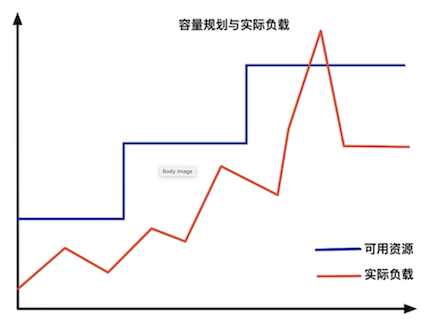

### ‘调度’ 与 ‘资源’ - 弹性伸缩的二象性

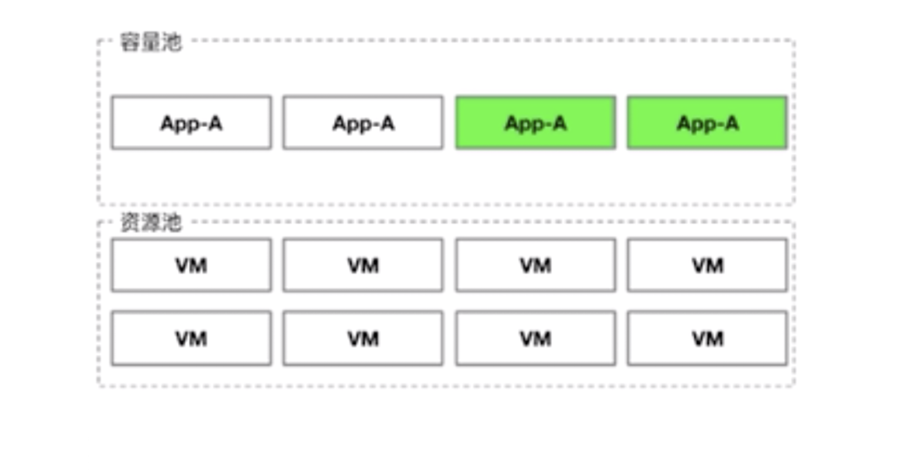

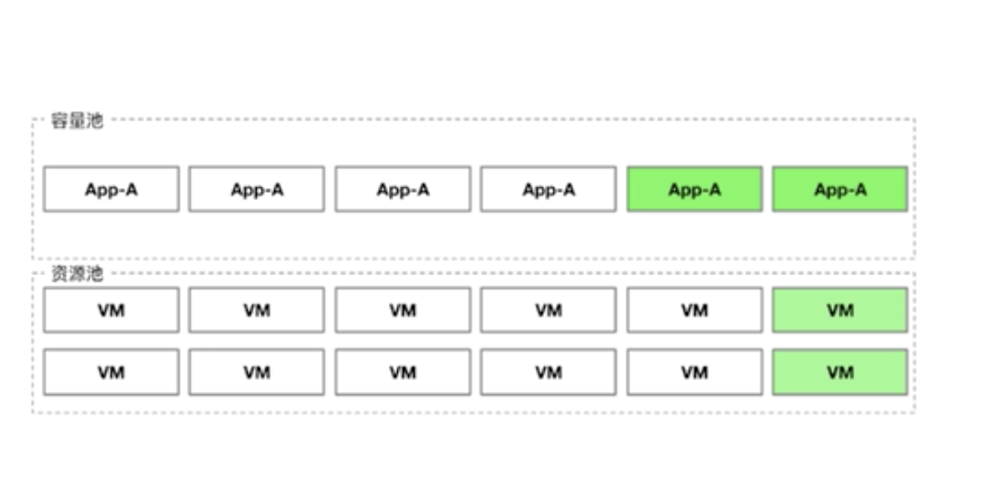

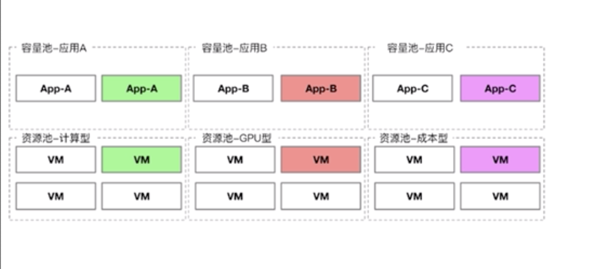

**“调度”在集群容量充裕的前提下提供尽可能的弹性集群容不符合场景的情况下需要弹性调整“资源”**


## Kubernetes的架构设计理念 - 架构原理 

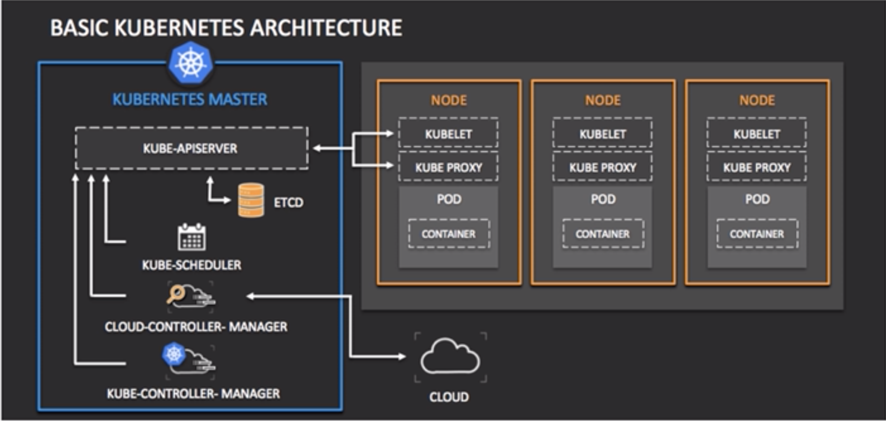

1. **etcd**保存了整个集群的状态;
2. **apiserver提供了资源操作的唯一入口，并提供认证、授权、访问控制、API注册和发现等机制;**
3. **controller manager负责维护集群的状态**，比如**故障检测、自动扩展、滚动**更新等
4. **scheduler负责资源的调度**，按照预定的调度策略将Pod调度到相应的机器上;
5. **kubelet负责维持容器的生命周期**，同时也负责Volume(CVI)和网络(CNI)的管理;
6. **Container runtime负责镜像管理以及Pod和容器的真正运行(CRI)**;
7. **kube-proxy负责为Service提供cluster内部的服务发现和负载均衡;**

## Kubernetes的架构设计理念 - 组件交互 


### 一个pod的生命周期

1. 通过 `apiserver REST API` 创建一个 `pod` 相当于写了一个 `pod spec`
2. 数据写入`etcd`, `etcd` 相当于一个 `key-value` 的存储
3. `Apiserver` 启动 `watch` 机制（监听者模式）产生一个 `watcher` 并将数据交给 `scheduler`
4. `scheduler` 把 `pod spec` 拉下来，放到内存， 然后给所有的 `node` 进行打分， `pod` 跑在 `node A` 上打多少分， `pod` 跑在`node B`上打多少分，然后排序，排序最高的 `node` assign给它 `pod spec`
5. 信息回写给`etcd`, 包含了新的 `node` 的信息
6. `APIServer` 把 `watcher` 数据给 `kubelet`, `kubelet` 发现传入的 `pod` 的数据包含 `node`信息, **并且是它自己**，`kubelet` 把 `pod spec` 拉倒本地，通过`docker run`的方式把`pod`跑起来
7. `container` 跑起来或是没有, kubelet 会把`pod status` 这条信息 append到 `pod spec`中
8. `apiserver` 把最新的`pod spec` 传入 `etcd` 中

## Kubernetes的架构设计理念 - 设计原则

#### 面向资源的简化模型 （go-restful）

所有在 Kubernetes 中操作的实体都可以用资源进行抽象，**所有的资源都有restful的API与之对应**

* `DaemonSet` 和 `StatefulSet` 是对**应用层**的抽象
* `Service` 是对 **接入层**的抽象
* `Deployment`, `Replication Controller`, `Replica Set` 是对 **负载层**的抽象
* `PV`, `PVC`, `Storageclass` 是对**存储层**的抽象
* `User Account`, `Group `, `Service Account` 是对**账号**的抽象
* **秘钥和配置** 通过 `secret` and `Configmap`


#### 异步动作保证性能（informers)

所有依赖资源的组件都通过异步进行监听，具体的执行由各的消费者者决定频度。

#### 状态机提供状态基线（etcd) 

所有的信息流都通过期望、实施、反馈的机制存储在etcdc.数据即状态。

#### 反馈机制保证状态

`informers` 中可以实现定期的 `sync`，可以通过 `sync`来处理中间状态。

#### 组件松藕合可插拔 

组件之间通信要么是通过 `APIServer` 进行中转，要么是通过 `APIGroup` 进行解椒，组件之间没有强依赖关系，部分组件自带熔断器。


## Kubernetes弹性伸缩矩阵 


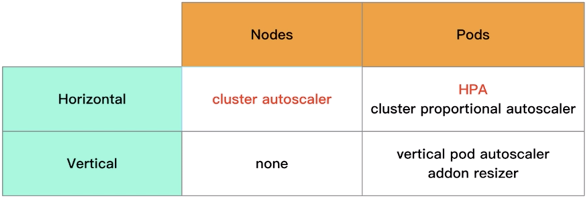

#### POD两个维度的弹性伸缩: `request` and `limit` is highly critical


### HPA一容量规划与资源水位 

`HPA` 的**弹性伸缩**基于负载的 `Request` 值以及实际利用率来进行计算的，当资源利用率超过阈值，即由 `ReplicationController` 进行 `replicas` 的增加，若低于 `阈值`，则进行`replicas`的减少。 


## HPA一内部实现原理 

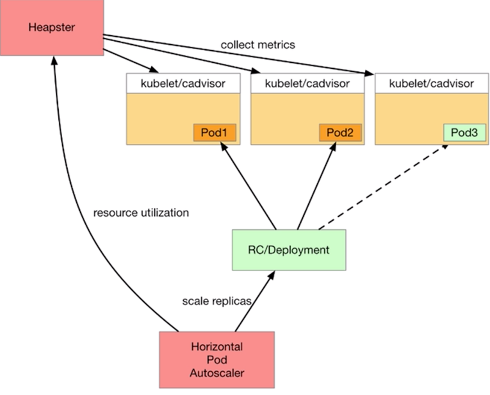
(**kubelet包装了 cadvisor**)


### 噪声处理

`Starting` 或者 `Stopping Pod` 存在时会直接进 入下一个计算周期 

### 冷却周期

扩容冷却时间**3**分钟，缩容冷却时间**5**分钟

### 边界值计算△ 

通过**10％**的△缓冲阈值防止扩缩容震荡 

## HPA一监控组件的演进促进HPA演进 

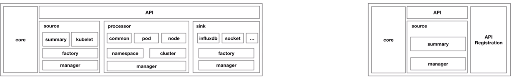

### Heapster

**必选组件**，集群无法解藕与替换，所有 `client` 依赖直接 `Service Proxy`的调用，扩展性差，集成`Sink`较多，但`maintainer`不活跃  

### Metrics-Server (0.1一0.2)

**采集能力完全等同 `Heapster`**，**剥离所有`Sink`**，增加全新的`metrics api`.

### Metrics一Server (0.3)

**采集能力精简，数据处理精简**，`Sink`精简到**只保留接口**，70％以上代码重写，**基本无法兼容原有的API**。 0.3版本最重要的意义是， 确定了`Metrics-Server`的定位，以及`Prometheus`的未来地位

### HPA一Metrics Server 的`API` 注册方式 

```
apiVersion: apiregistration.k8s.io/v1betal
kind: APIService
metadata: 
  name: v1beta1.metrics.k8s.io 
spec:
  service: 
    name: metrics-server
    namespace: kube-system
  group: metrics.k8s.io
  version: v1beta1
  insecureSkipTLSVerify: true
  groupPriorityMinimum: 100 
  versionPriority: 100 
```

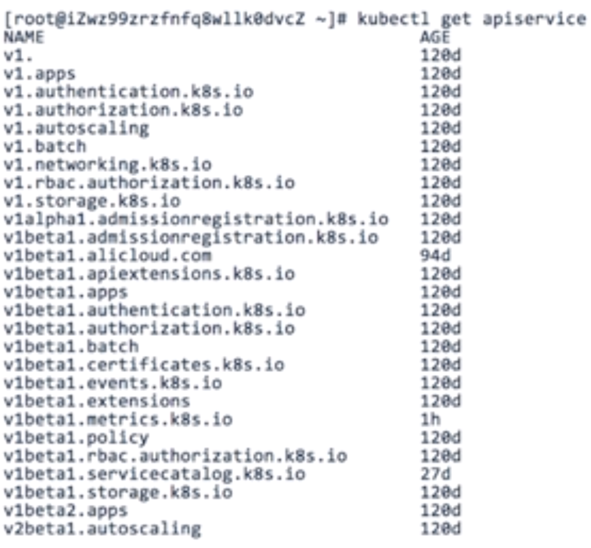

### HPA - API 版本演进 

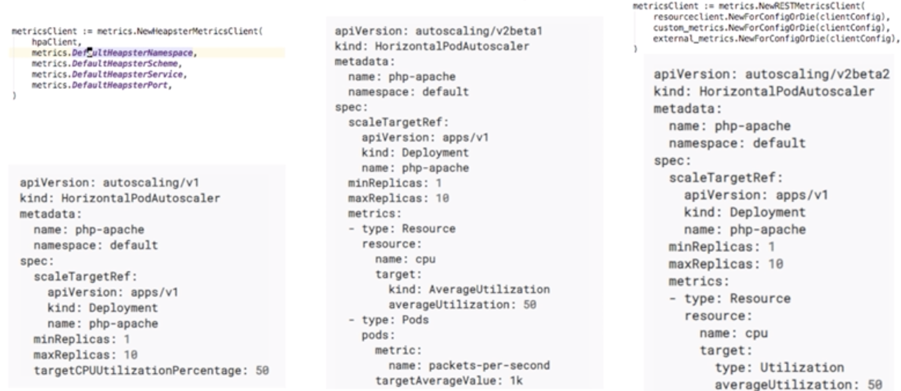

#### v1:  HPA put heapster in APIVersion and only support CPU 

#### v2beta1: include resourceclient and customer_metrics

#### v2beta2: add new external_metrics 

## HPA - ingress custom metrics

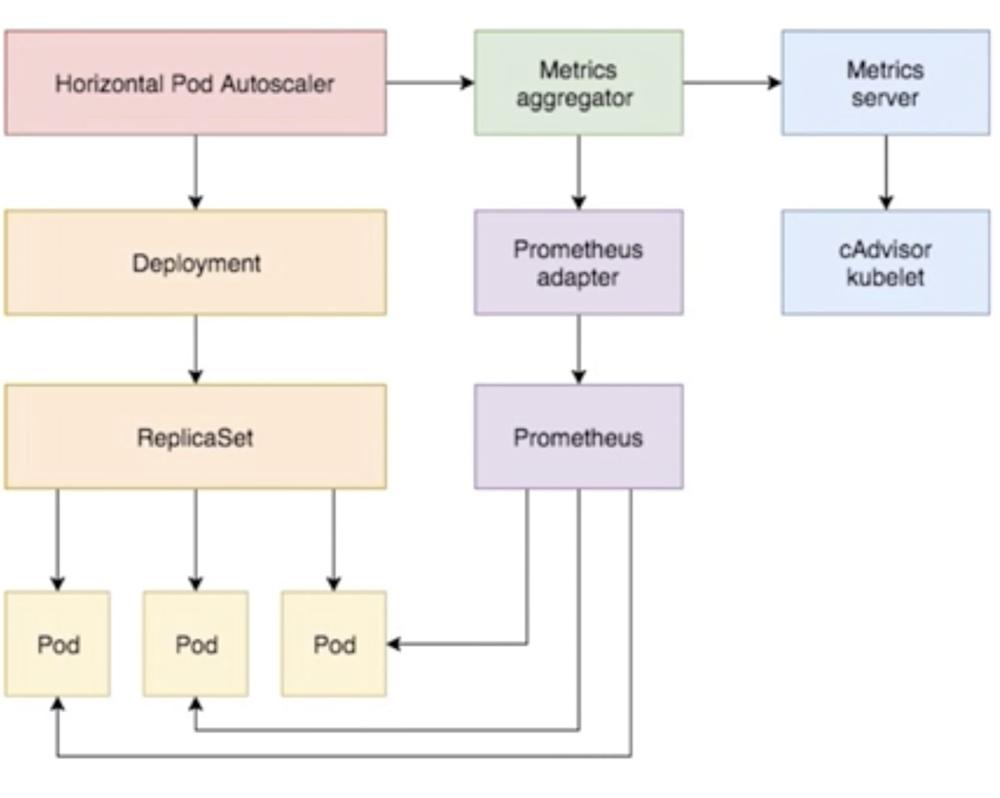

* 中间是: `custom metrics for prometheus`
* 右边是: `resource metrics`

```
apiVersion: autoscaling/v2beta1 
kind: HorizontalPodAutoscaler 
metadata: 
  name: php-apache 
  namespace: default 
spec: 
  scaleTargetRef: 
    apiVersion: apps/v1 
    kind: Deployment 
    name: php-apache 
  minReplicas: 1 
  maxReplicas: 10
  metrics: 
  - type: Resource 
    resource: 
      name: cpu 
      target: 
        kind: AverageUtilization 
        averageUtilization: 50 
  - type: Pods 
    pods: 
      metric: 
        name: packets-per-second 
      targetAverageValue: 1k 
  - type: Object 
    object: 
      metric: 
        name: requests-per-second 
      describedObject: 
        apiVersion extensions/v1beta1 
        kind: Ingress 
        name: main-route 
      target: 
        kind: Value 
        value: 10k 
```

## Cluster - Autoscaler

### ClusterAutoscaler - 集群节点伸缩的组件

* `Cluster-Autoscaler`**扩容**的条件是存在**未调度的Pod** 
* `Cluster-Autoscaler`**缩容**的条件是节点利用率低于阈值 

`Cluster-Autoscaler`中核心的概念`ASG一＞ESS`，增减节点即触发`ASG`增加节点的接口，移除节点即指定节点 从`ASG`中移除。

`Cluster-Autoscaler` 会监听所有的Pod，当Pod出现未调度的时候，会尝试将配置的`ASG模拟`成为一个虚拟节点，**尝试将未调度的容器进行重新调度**，并选择一个符合 `ASG` 进行节点伸缩。没有扩容任务的时候，会便利用每个节点的 `request`资源，检查资源的申请值，**低于阈值的时候会逐个删除**。

 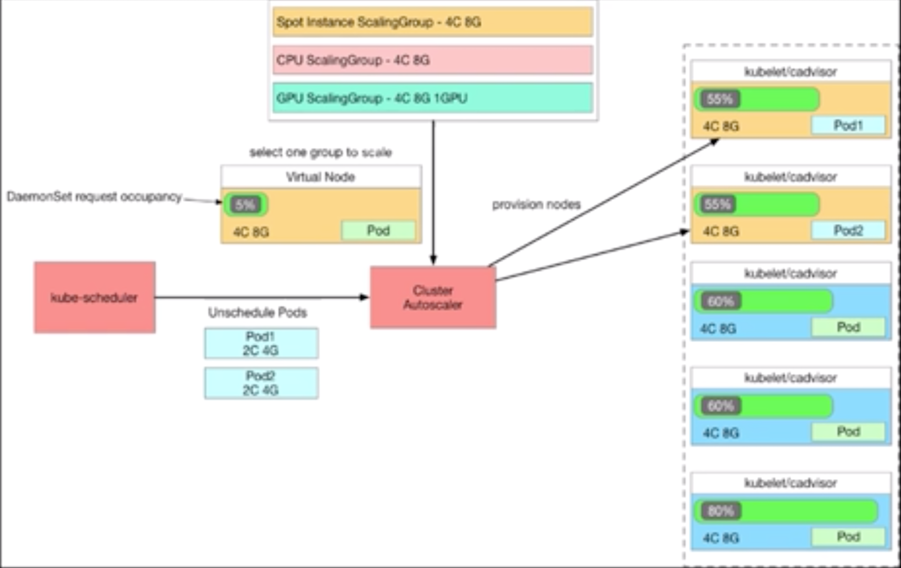
 
### ClusterAutoscaler - 扩容

#### 扩容判断的判断条件为`有未调度的容器`且`不在冷却阈值内`。

#### 扩容时会进行模拟调度，同时会将`DaemonSet`与`Static Pod`进行模拟，因此可调度资源会略低于机器配置 

#### 模拟调度使用同版本的 `kube-shecudler`，因此最好与 `kubernetes`的版本保持一致。

#### `fleet`控制器可能是方向，但目前对autoscaler来讲还不可行。  


### Cluster-Autoscaler 一 缩容 

缩容是 `Cluster-Autoscaler` 最复杂的逻辑 

#### 如下场景节点不可缩容:

* 有不可缩容label的 
* 有`critical Pod`的 
* 节点上有`statefulset`的 
* PDB到达小副本的 
* 未被`autoscaler`的伸缩组管理的 

缩容目前的只能一个节点一个节点缩容，缩容后的重新调度会带来利用率的重新计算。
 
#### 缩容的具体操作为当利用率低于阈值到达指定时间，进行打`label`禁止调度，驱逐容器， 删除节点。 

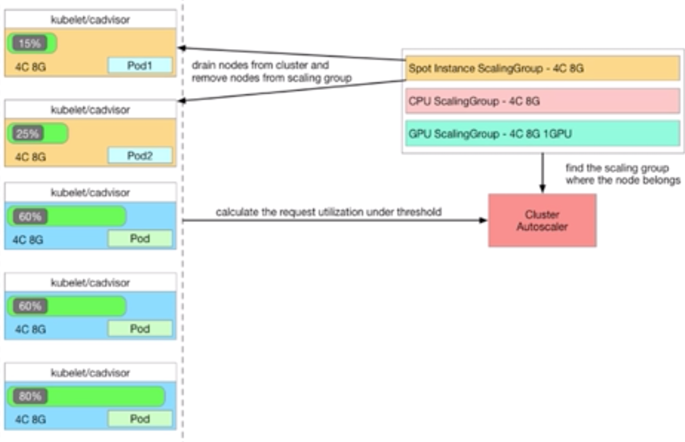

### Cluster-Autoscaler 一 实现资源预留的占位“气球🎈”

```
apiVersion: scheduling.k8s.io/v1beta1 
kind: PriorityClass 
metadata: 
  name: overprovisioning 
value: -1 
globalDefault: false 
description: "Priority class used by overprovisioning." 
```
设置 `Priority` 非常低的 `Pod`, 默认申请占位资源例如 `4G8G*4`，作为 占位“气球🎈"，当系统的常规资源无法调度的时候，会尝试扎破气球，牺牲 `Priority` 很低的容器，此时 `Priority` 很低的容器进入未调度 的状态，`Cluster-Autoscaler` 行扩容处理，提供扩容缓冲。 

#### 更进一步，根据集群size，动态增减占位“气球🎈? 

```
containers: 
  - image: gcr.io/google_containers/cluster-proportional-autoscaler-amd64:1.1.2 
    name: autoscaler 
    command: 
      - /cluster-proportional-autoscaler 
      - --namespaces=default 
      - --configmap=nginx-autoscaler 
      - --target=deployment/nginx-autoscale-example 
      - --default-params= {"linear": {"coresPerReplica":2, "nodesPerReplica":1, "preventSinglePointFailure":true}}
      - --logtostderr: true 
      - --v=2 
```

### `cluster-proportional-autoscaler` - 基于集群节点数目伸缩 `Pods`

 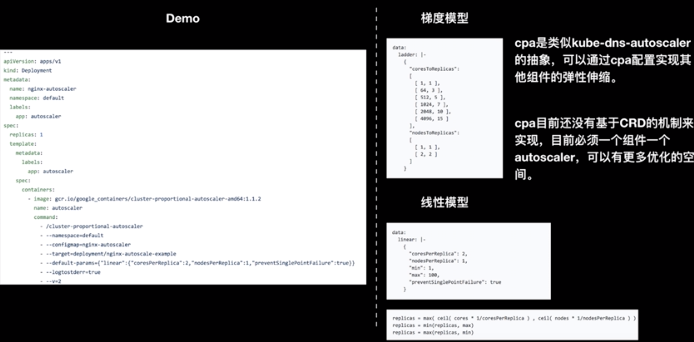

### Cluster-Autoscaler - 使用场景

|  | 特点  | 例子 |
|:------------- |:---------------:| -------------:|
| 在线任务    | 弹出时敏感      |  流量负载型任务 |
| 离线任务    | 缩容时敏感，价格敏感 |   AI/大数据类型任务 |
| 定时任务    | 稳定性敏感     |    定时弹出，定时回收 |
| 特殊任务    |  稳定性敏感       |      基于网络带宽和资源利用率|

### Cluster-Autoscaler - 离线任务的福音Spot Instance

### ClusterAutoscaler一 多可用区、多实例规格保证伸缩效果 

`Cluster-Autoscaler` 感知机器规格的方式是通过 `NodeTemplate` 的模拟调度实现的，当配置多个不同实例族的时候，会默认选择第一个机器配置作为规格。具体的规格选择交由 `ESS` 进行判断。目前支持如下四种策略。

* 可用区均衡 
* 价格最低 
* Spot优先
* 顺序优先  

多实例规格、多可用区可以保证弹性的稳定性，保证资源分配的平衡性，保证价格的相对最优性 


### ClusterAutoscaler 一 指定分组调度与策略调度 

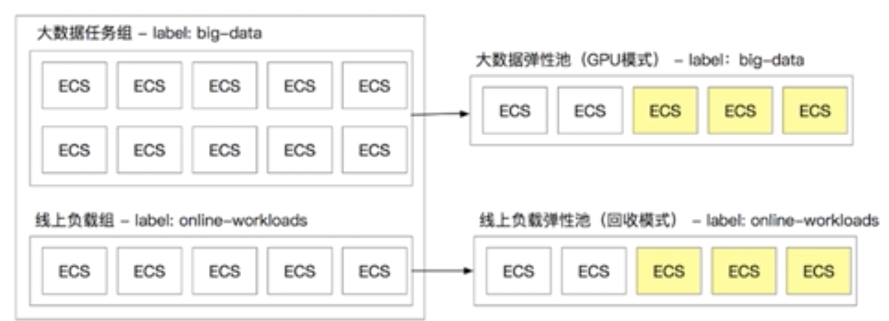

* 模板可以通过 `label一selector` 指定调度，每个弹性伸缩组可以有自己的伸缩特性。 
* 大数据与机器学习可以考虑用`GPU`的`Spot Instance`伸缩组。 

### Cluster-Autoscaler 一 实现非调度类型的弹性扩缩容 

部分客户存在特殊的弹性伸缩要求，**例如要基于metrics指标伸缩**，**要基于定时任务伸缩等非调度伸缩** 

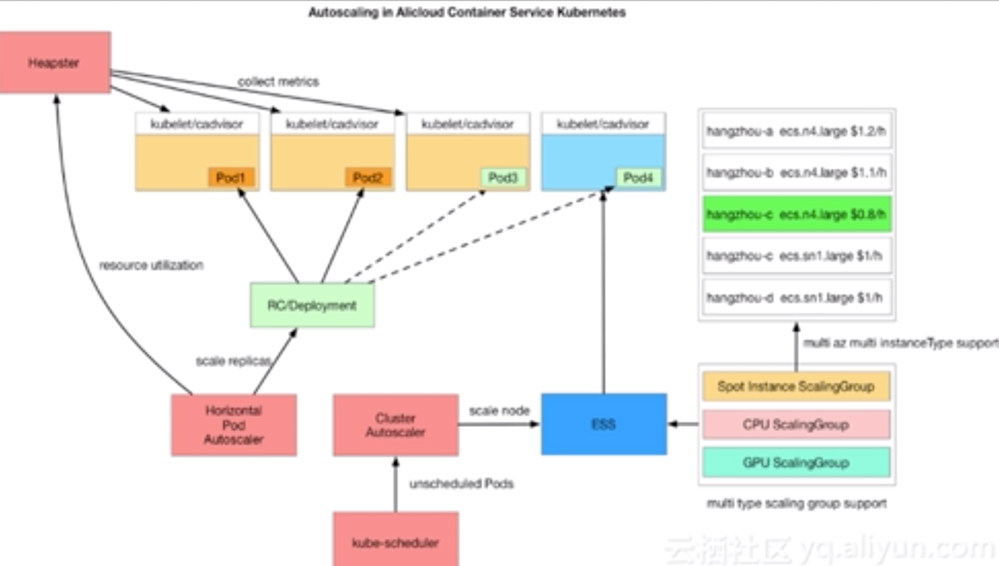

## VPA一要解决的问题 

* 有状态服务进行扩缩容的问题 
* CPU竞争的问题 
* 内存OOM的问题 
* 资源利用率压缩节约成本的问题 

**他们导致了**

**Request的变化，重新调度或更新**

### VPA一原理架构图 

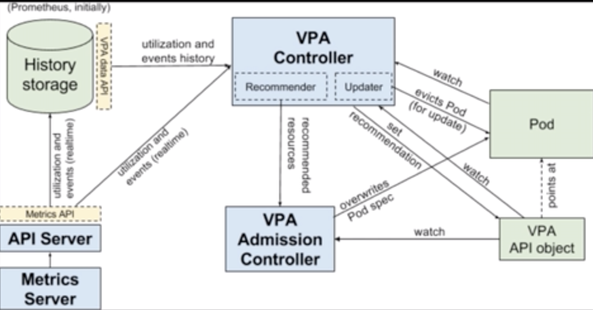

* `MetricsServer` 实时监控数据提供 
* `Prometheus` 历史监控数据提供 
* `Admission Controller` 拦截`VPA object`与 `Pod Spec` 并动态更新`Pod`的 `request` 与 `limit`。 
* `Recommender` 监视当前和过去的资源消耗，并提供推荐值容器的 `CPU`和内存请求。 
* `Updater` 监控`Pod Spec`变化，触发驱逐进行变更 

### VPA - 四种不同的`updateMode` 

```
apiversion: poc.autoscaling.k8s.io/v1alpha1 
kind: VertiCalPodAutoscaler 
metadata: 
  name: redis-vpa 
spec: 
  selector: 
    matchLabels: 
      app: redis 
  updatePolicy: 
    updateMode: "Auto" 
---
apiVersion: apps/v1beta2  # for versions before 1.8.0 use apps/v1beta1 
kind: Deployment 
metadata: 
  name: redis-master 
spec: 
  selector: 
    matchLabels: 
      app: redis 
  replicas: 3 
  template: 
    metadata: 
      labels: 
        app: redis 
    spec: 
      containers: 
      - name: master 
        image: k8s.gcr.io/redis:e2e  # or lust sear: redis 
        resources:| 
          request: 
          cpu: 100m 
          memory: 100Mi 
        ports: 
        - containerPort: 6379
``` 

#### 四种不同的updateMode: 

* Init:只在Pod创建的时候生效，后续不生效 
* auto/recreate：只在安全的时候或者不可不变化时更新，变更或者驱逐 
* off:不真实触发变化，但可以看到VPA的建议 

### VPA 一 获取推荐值的方式 

* **安全边界：Pod正常运行峰值＋15％的边界阈值** 
* **最小单元：25毫核 250M内存** 
* **默认算子：下限0.5当 前值0.9 上限0.95** 


1. 初始25OMi内存，下限：138Mi 上限：263Mi 
2. 实时计算上下限，当触发上下限驱逐的时候会 主动驱逐并设置新的request 
3. 如果连续触发，则会不断添加新的`request`到 `Pod`，可能会触发资源无法满足，此时需要 `autoscaled`协助。

#### 上限驱逐 

* // No history: `*INF` (do not force pod eviction)
* /／12h history: `*3` (force pod eviction if the request is > 3* upper bound) 
* // 24h history :`*2` 
* // 1 week history: `*1.14`   

#### 下限驱逐

* // No history: `*0` (do not force pod eviction) 
* // 5m history: `*0.6` (force pod eviction If the request is< 0.6* lower bound)
* // 30m history: `*0.9`
* // 60m history: `*0.95`


