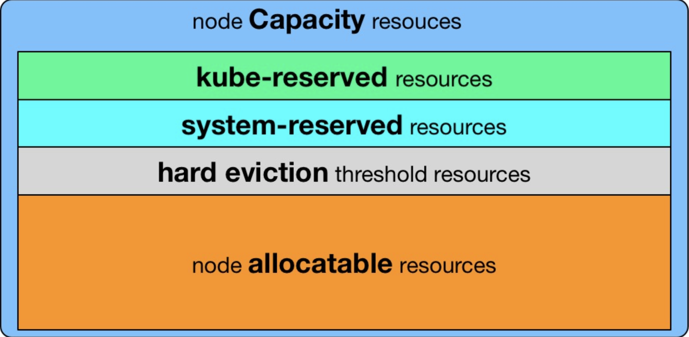
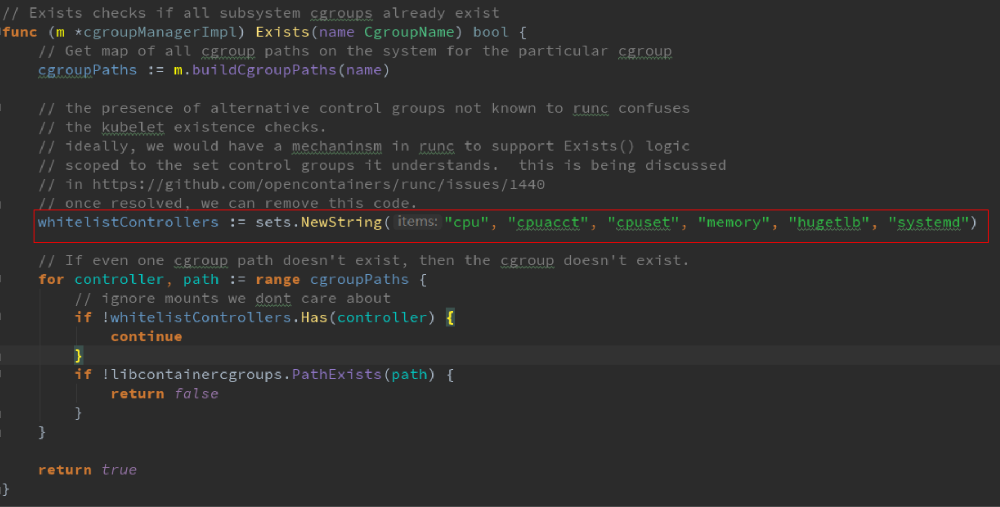
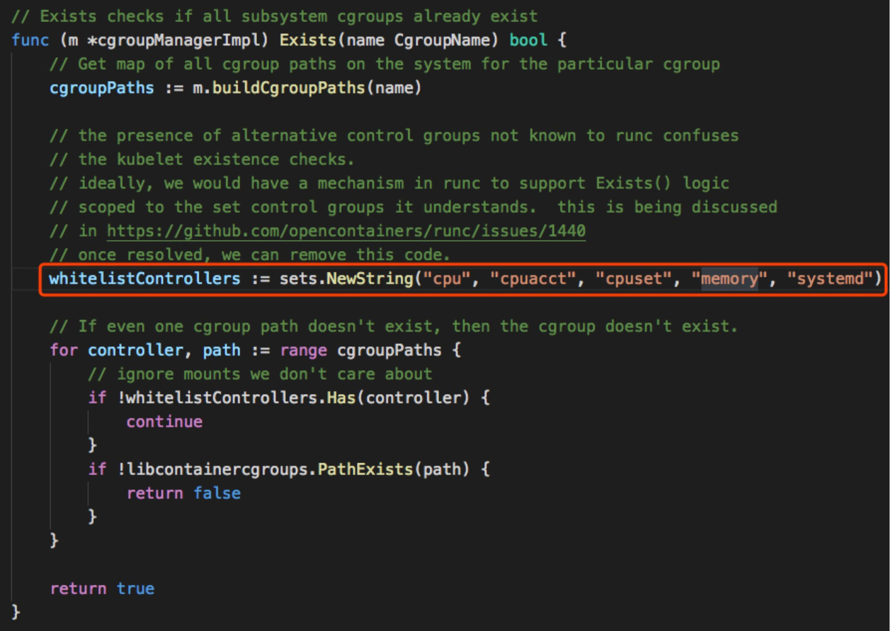
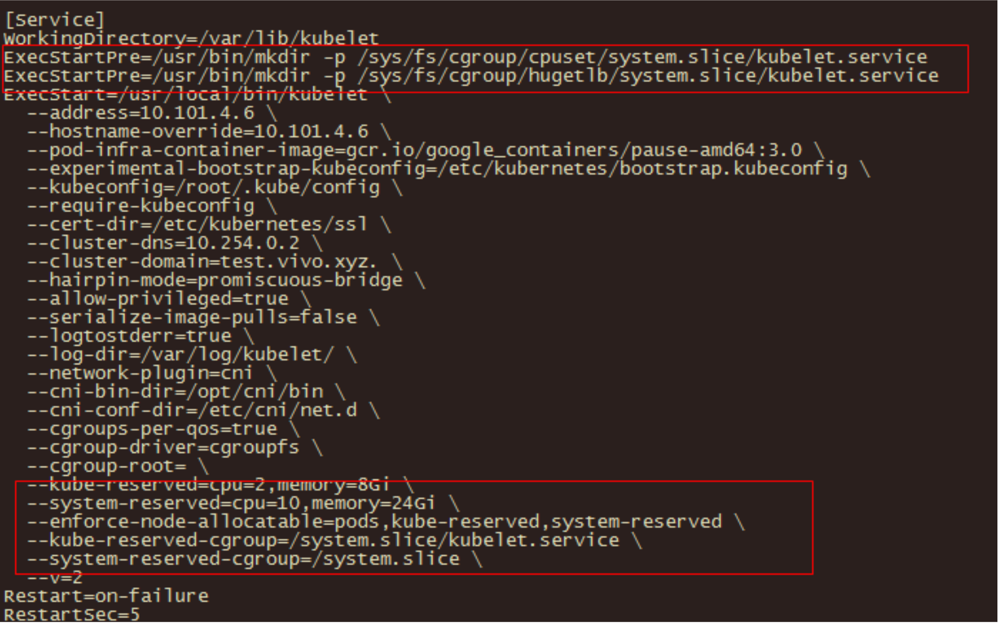

# Kubelet资源预留

## Kubelet Node Allocatable

`Kubelet Node Allocatable` 用来为 `Kube组件` 和`System进程` 预留资源，从而保证当节点出现满负荷时也能保证`Kube` 和`System` 进程有足够的资源

目前支持 `cpu`, `memory`, `ephemeral-storage`三种资源预留。

* `Node Capacity` 是 `Node` 的所**有硬件资源**，
* `kube-reserved` 是给 `kube` **组件预留的资源**，
* `system-reserved`是给 `System` **进程预留的资源**， 
* `eviction-threshold` 是 `kubelet eviction` 的**阈值设定**，
* `allocatable` 才是真正`scheduler 调度`Pod` 时的参考值

```
Node Allocatable Resource = Node Capacity - Kube-reserved - system-reserved - eviction-threshold
```



## 如何配置


* **--enforce-node-allocatable**，默认为pods，要为kube组件和System进程预留资源，则需要设置为`pods,kube-reserved,system-reserve`。
* **--cgroups-per-qos**，Enabling QoS and Pod level cgroups，**默认开启**。开启后，kubelet会将管理所有`workload Pods`的 `cgroups`。
* **--cgroup-driver**，默认为`cgroupfs`，另一可选项为`systemd`。取决于容器运行时使用的 `cgroup driver`，`kubelet`与其保持一致。比如你配置`docker`使用`systemd cgroup driver`，那么`kubelet`也需要配置`--cgroup-driver=systemd`。
* **--kube-reserved**,用于配置为`kube`组件（`kubelet,kube-proxy,dockerd`等）预留的资源量，比如`—kube-reserved=cpu=1000m,memory=8Gi，ephemeral-storage=16Gi`。
* **--kube-reserved-cgroup**，如果你设置了`--kube-reserved`，那么**请一定要设置对应的cgroup**，并且该**cgroup目录要事先创建好**，否则kubelet将不会自动创建导致kubelet启动失败。比如设置为`kube-reserved-cgroup=/kubelet.service` 。
* **--system-reserved**，用于配置为**System进程预留的资源量**，比如`—system-reserved=cpu=500m,memory=4Gi,ephemeral-storage=4Gi`。
* **--system-reserved-cgroup**，如果你设置了`--system-reserved`，那么请一定要设置对应的`cgroup`，并且**该cgroup目录要事先创建好**，否则`kubelet`将不会自动创建导致kubelet启动失败。比如设置为 `system-reserved-cgroup=/system.slice`。
* **--eviction-hard**，**用来配置kubelet的hard eviction条件**，只支持`memory`和`ephemeral-storage`, **两种不可压缩资源**。当出现`MemoryPressure`时，`Scheduler` 不会调度新的 `Best-Effort QoS Pods`到此节点。当出现`DiskPressure`时，**Scheduler不会调度任何新Pods到此节点**。
* **Kubelet Node Allocatable**的代码很简单，主要在`pkg/kubelet/cm/node_container_manager.go`


## Sample

以如下的 `kubelet` 资源预留为例，`Node Capacity` 为 `memory=32Gi, cpu=16, ephemeral-storage=100Gi`，我们对kubelet进行如下配置：

```
--enforce-node-allocatable=pods,kube-reserved,system-reserved
--kube-reserved-cgroup=/kubelet.service
--system-reserved-cgroup=/system.slice
--kube-reserved=cpu=1,memory=2Gi,ephemeral-storage=1Gi
--system-reserved=cpu=500m,memory=1Gi,ephemeral-storage=1Gi
--eviction-hard=memory.available<500Mi,nodefs.available<10%
```

```
NodeAllocatable = NodeCapacity - Kube-reserved - system-reserved - eviction-threshold = 
cpu=14.5,memory=28.5Gi,ephemeral-storage=98Gi.
```

* `Scheduler` 会确保`Node` 上所有的`Pod Resource Request`**不超过**`NodeAllocatable`。
* `Pods`所使用的`memory`和`storage`之和超过`NodeAllocatable`后就会触发`kubelet Evict Pods`。


## Problems

`kube-reserved-cgroup` 及 `system-reserved-cgroup` 配置

最开始，我只对 `kubelet` 做了如下配置`--kube-reserved`, `--system-reserved`,我就以为 `kubelet`会自动给 `kube`和 `system`创建对应的`Cgroup`，并设置对应的`cpu share, memory limit`等，然后高枕无忧了。

然而实际上并非如此，直到在线上有一次某个TensorFlow worker的问题，无限制的使用节点的cpu，导致节点上`cpu usage`持续100%运行，**并且压榨到了kubelet组件的cpu使用**，**导致kubelet与APIServer的心跳断了**，这个节点便`Not Ready`了。

接着，`Kubernetes`会在其他某个最优的`Ready Node`上启动这个贪婪的`worker`，**进而把这个节点的cpu也跑满了，节点Not Ready了**。


如此就出现了集群雪崩，集群内的Nodes逐个的Not Ready了,后果非常严重。

把`kublet`加上如下配置后，即可保证在`Node`高负荷时，也能保证当`kubelet`需要`cpu`时至少能有`--kube-reserved`设置的`cpu cores`可用。

```
--enforce-node-allocatable=pods,kube-reserved,system-reserved
--kube-reserved-cgroup=/kubelet.service
--system-reserved-cgroup=/system.slice
```

**注意,因为`kube-reserved`设置的`cpu`其实最终是写到`kube-reserved-cgroup`下面的`cpu shares`**

## Kubernetes会检查的cgroup subsystem

* 在Kubernetes 1.7版本，`Kubelet`启动会检查`cgroup subsystem`的存在：



* 在Kubernetes 1.8及1.9版本，Kubelet启动会检查以下`cgroup subsystem`的存在：



对于Centos系统，`cpuset`和`hugetlb subsystem是`默认没有初始化s`ystem.slice`，因此需要手动创建，否则会报`Failed to start ContainerManager Failed to enforce System Reserved Cgroup Limits on "/system.slice": "/system.slice" cgroup does not exist`的错误日志。

我们可以通过在`kubelet service`中配置`ExecStartPre`来实现。




