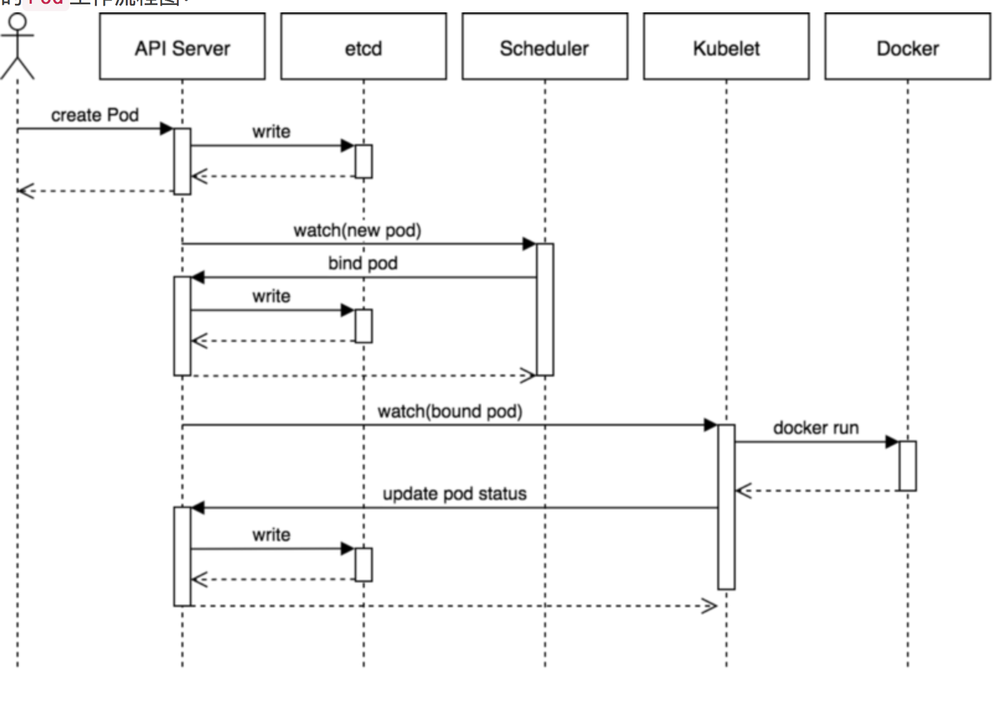
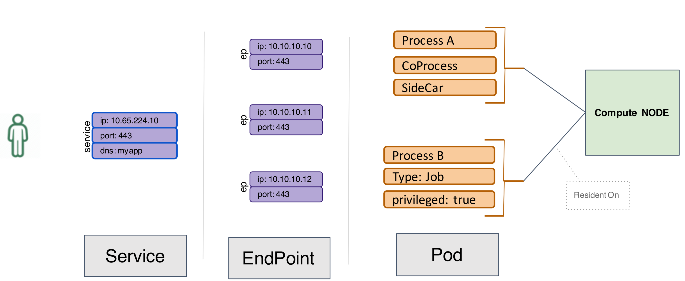
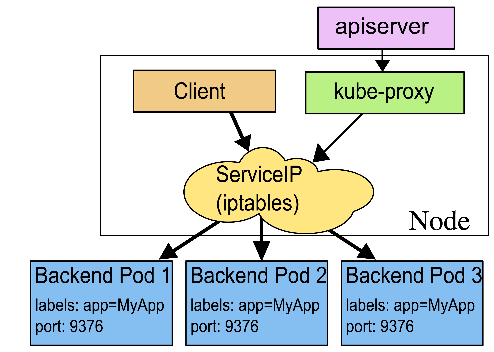
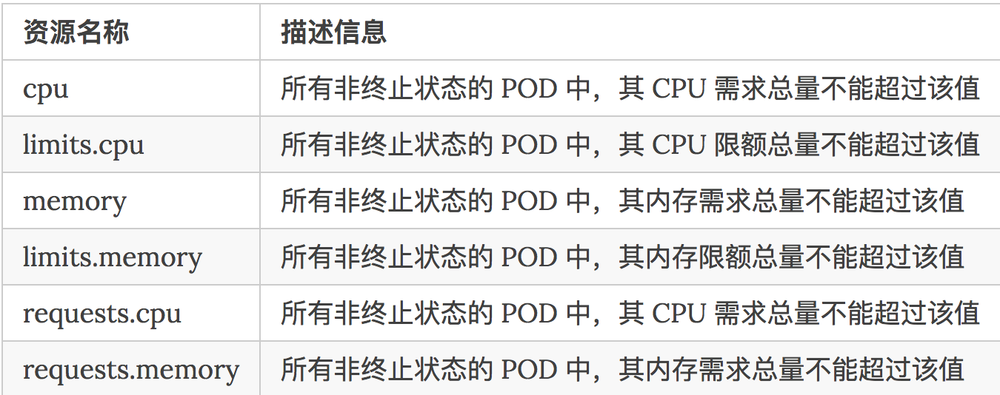
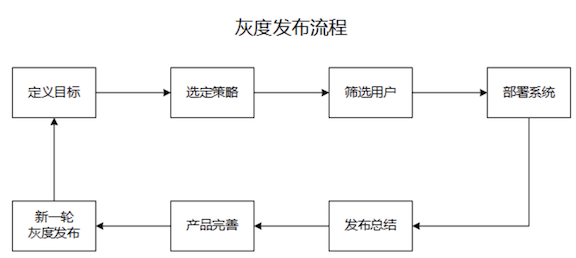

# **kubernetes interview questions (Keep Updating)**

## 基础篇

### 基础篇主要面向的初级、中级开发工程师职位，主要考察对k8s本身的理解。

* `kubernetes` 包含几个组件。各个组件的功能是什么。组件之间是如何交互的。
  * **Four types of k8s services**
* `k8s`的 `pause` 容器有什么用。是否可以去掉。
* `k8s` 中的`pod`内几个容器之间的关系是什么。
* 一个经典`pod`的完整生命周期。
* `k8s`的`service`和`ep`是如何关联和相互影响的。
* 详述`kube-proxy`原理，一个请求是如何经过层层转发落到某个`pod`上的整个过程。请求可能来自pod也可能来自外部。
* `rc/rs`功能是怎么实现的。详述从`API`接收到一个创建`rc/rs`的请求，到最终在节点上创建`pod`的全过程，尽可能详细。另外，当一个`pod`失效时，`kubernetes`是如何发现并重启另一个pod的？
* `deployment/rs`有什么区别。其使用方式、使用条件和原理是什么。
* `cgroup`中的`cpu`有哪几种限制方式。k8s是如何使用实现`request`和`limit`的。


### 本人的简略回答：

### 1. `kubernetes` 包含几个组件。各个组件的功能是什么。组件之间是如何交互的。

**1.1 核心组件**

* `etcd`保存了整个集群的状态;
* `apiserver`提供了资源操作的唯一入口，并提供认证、授权、访问控制、API注册和发现等机制;
* `controller manager`负责维护集群的状态，比如**故障检测**、**自动扩展**、**滚动更新**等
* `scheduler`负责资源的调度，按照预定的**调度策略将Pod调度到相应的机器上**
* `kubelet`负责维持容器的生命周期，同时也负责`Volume(CVI)`和网络`(CNI)`的管理;
* `Container runtime`负责镜像管理以及Pod和容器的真正运行(CRI);
* `kube-proxy`负责为`Service`提供`cluster`内部的**服务发现和负载均衡**;
* `Flannel` 网络保证，集群内各节点能通过`Pod`网段互联互通

**1.2 推荐的`Add-ons`:**

* `kube-dns`负责为整个集群提供DNS服务
* `Ingress Controller`为服务提供外网入口
* `Heapster`提供资源监控
* `Dashboard`提供GUI
* `Federation`提供跨可用区的集群
* `Fluentd-elasticsearch`提供集群日志采集、存储与查询

**1.3 集群功能模块之间的通信:**

`kubernetes API Server` 作为集群的核心，**负责集群各功能模块之间的通信**，集群内各个功能模块通过`API Server`将信息存入`etcd`，当需要获取和操作这些数据时，通过`API Server`提供的**REST接口**（**GET\LIST\WATCH方法**）来实现，从而实现各模块之间的信息交互。

主要有以下三类通信交互的场景：

* **`kubelet`与`API Server`交互**
  
  * **每个`Node`节点上的`kubelet`定期就会调用`API Server`的`REST`接口报告自身状态**，`API Server`接收这些信息后，将节点状态信息更新到`etcd`中。
  * `kubelet`也通过`API Server`的`Watch`接口监听`Pod`信息，如果监听到新的`Pod`副本被调度绑定到本节点，则执行`Pod`对应的容器的创建和启动逻辑；
  * 如果监听到`Pod`对象被删除，则删除本节点上的相应的`Pod`容器；
  * 如果监听到修改`Pod`信息，则`kubelet`监听到变化后，会相应的修改本节点的`Pod`容器。

* **`kube-controller-manager`与`API Server`交互**

`kube-controller-manager`中的`Node Controller`模块通过`API Server`提供的`Watch`接口，实时监控`Node`的信息，并做相应处理。

* **`kube-scheduler`与`API Server`交互**

`Scheduler`通过`API Server`的`Watch`接口监听到新建`Pod`副本的信息后，它会检索所有符合该`Pod`要求的`Node`列表(round robin)，开始执行`Pod`调度逻辑。调度成功后将`Pod`绑定到目标节点上。

为了缓解各模块对`API Server`的访问压力，**各功能模块都采用缓存机制来缓存数据**，各功能模块**定时**从`API Server`获取指定的资源对象信息 **LIST/WATCH方法**，**然后将信息保存到本地缓存**，**功能模块在某些情况下不直接访问`API Server`，而是通过访问缓存数据来间接访问`API Server`**。

### 1.Four types of k8s services

我们在定义`Service`的时候可以指定一个自己需要的类型的`Service`，如果不指定的**话默认是`ClusterIP`类型**。

我们可以使用的服务类型如下：

* `ClusterIP`：通过集群的**内部 IP 暴露服务**，选择该值，**服务只能够在集群内部可以访问，这也是默认的`ServiceType`**。
* `NodePort`：通过每个 **`Node节点上的IP`** 和 **`静态端口（NodePort）`** 暴露服务。NodePort 服务会路由到 ClusterIP 服务，这个 ClusterIP 服务会自动创建。通过请求 : **可以从集群的外部访问一个 NodePort 服务**。
* `LoadBalancer`：**使用云提供商的负载局衡器，可以向外部暴露服务**。外部的负载均衡器可以路由到 `NodePort` 服务和 `ClusterIP` 服务，这个需要结合具体的云厂商进行操作。
* `ExternalName`：**通过返回 CNAME 和它的值，可以将服务映射到 `externalName` 字段的内容**（例如， `foo.bar.example.com`）。没有任何类型代理被创建，这只有 Kubernetes 1.7 或更高版本的 kube-dns 才支持。


### 2.`k8s`的 `pause` 容器有什么用。是否可以去掉。

我们可以在集群环境中去查看下人任意一个`Pod`对应的运行的`Docker`容器，我们可以发现每一个`Pod`下面都包含了一个`pause-amd64`的镜像，这个就是我们的`infra`镜像，我们知道`Pod`下面的所有**容器是共享同一个网络命名空间的**，这个镜像就是来做这个事情的，**所以每一个`Pod`当中都会包含一个这个镜像**。

用`“kubernetes/pause”`镜像为每个`Pod`创建一个容器。`Pause`容器用于接管`Pod`中所有其他容器的网络。每创建一个新的`Pod`，`Kubelet`都会先创建一个`Pause`容器，然后创建其他容器。


>>> grep -rnw . -e 'pause'  # find a string in directory


### 3.`k8s` 中的`pod`内几个容器之间的关系是什么。

#### pod内部容器之间：

这种情况下容器通讯比较简单，因为`k8s pod` 内部容器是**共享网络空间**的，所以容器直接可以使用`localhost`访问其他容器。

`k8s`在启动容器的时候会先启动一个`pause`容器，这个容器就是实现这个功能的。

#### `pod` 与 `pod` 容器之间:

1. 针对第一种情况，就比较简单了，就是`docker`默认的`docker`网桥互连容器。


2. 第二种情况需要更为复杂的网络模型了，`k8s`官方推荐的是使用`flannel`组建一个大二层扁平网络，`pod`的`ip`分配由`flannel`统一分配，通讯过程也是走`flannel`的网桥。

```
docker --daemon --bip=172.17.18.1/24 
```
注意其中的 `“--bip=172.17.18.1/24”` 这个参数，它限制了所在节点容器获得的IP范围。

**每个`node`上面都会创建一个`flannel0`虚拟网卡，用于跨`node`之间通讯。所以容器直接可以直接使用`pod id`进行通讯。**

跨节点通讯时，发送端数据会从`docker0`路由到`flannel0`虚拟网卡，接收端数据会从`flannel0`路由到`docker0`，这是因为`flannel`会添加一个路由

发送端：

```
route -n

172.17.0.0    0.0.0.0    255.255.0.0      U  0  0  0   flannel0

172.17.13.0  0.0.0.0    255.255.255.0  U  0  0  0   docker0
```

接收端：

```
172.18.0.0    0.0.0.0    255.255.0.0      U  0  0  0  flannel0

172.17.12.0  0.0.0.0    255.255.255.0  U  0  0  0   docker0
```


例如现在有一个数据包要从IP为`172.17.13.2`的**容器**发到IP为`172.17.12.2`的**容器**。根据数据发送节点的路由表，它只与`172.17.0.0/16`匹配这条记录匹配，因此数据从`docker0`出来以后就被投递到了`flannel0`。同理在目标节点，由于投递的地址是一个容器，因此目的地址一定会落在`docker0`对于的`172.17.12.0/24`这个记录上，自然的被投递到了`docker0`网卡。

**`flannel`的原理是将网络包封装在`udp`里面，所以发送端和接收端需要装包和解包，对性能有一定的影响**


### 4.一个经典`pod`的完整生命周期。



#### 一个pod的生命周期(1)

1. 第一步通过`apiserver REST API`创建一个Pod
2. 然后`apiserver`接收到数据后将数据写入到`etcd`中
3. 由于`kube-scheduler`通过`apiserver watch API`一直在监听资源的变化，这个时候发现有一个新的`Pod`，但是这个时候该`Pod`还没和任何`Node`节点进行绑定，所以`kube-scheduler`就经过一系列复杂的调度策略，选择出一个合适的`Node`节点，将该`Pod`和该目标`Node`进行绑定，当然也会更新到`etcd`中去的
4. 这个时候一样的目标`Node`节点上的`kubelet`通过`apiserver watch API`检测到有一个新的`Pod`被调度过来了，他就将该`Pod`的相关数据传递给后面的容器运行时`(container runtime)`，比如`Docker`，让他们去运行该`Pod`
5. 而且`kubelet`还会通过`container runtime`获取`Pod`的状态，然后更新到`apiserver`中，当然最后也是写入到`etcd`中去的。


#### 一个pod的生命周期(2)

1. 通过 `apiserver REST API` 创建一个 `pod` 相当于写了一个 `pod spec`
2. 数据写入`etcd`, `etcd` 相当于一个 `key-value` 的存储
3. `Apiserver` 启动 `watch` 机制（监听者模式）产生一个 `watcher` 并将数据交给 `scheduler`
4. `scheduler` 把 `pod spec` 拉下来，放到内存， 然后给所有的 `node` 进行打分**(round robin)**， `pod` 跑在 `node A` 上打多少分， `pod` 跑在`node B`上打多少分，**然后排序**，排序最高的 `node` assign给它 `pod spec`
5. 信息回写给`etcd`, 包含了新的 `node` 的信息
6. `APIServer` 把 `watcher` 数据给 `kubelet`, `kubelet` 发现传入的 `pod` 的数据包含 `node`信息, **并且是它自己**，`kubelet` 把 `pod spec` 拉倒本地，通过`docker run`的方式把`pod`跑起来
7. `container` 跑起来或是没有, kubelet 会把`pod status` 这条信息 append到 `pod spec`中
8. `apiserver` 把最新的`pod spec` 传入 `etcd` 中

### 5.k8s 的 `service` 和 `ep(endpoints)` 是如何关联和相互影响的。

**`Service`是对一组提供相同功能的`Pods`的抽象，并为它们提供一个统一的入口**。

借助Service，应用可以方便的实现**服务发现**与**负载均衡**，并实现**应用的零宕机升级**。

* `Service`通过标签来选取服务后端，一般配合`Replication Controller` 或者`Deployment`来保证后端容器的正常运行。
* **这些匹配标签的`Pod IP`和`端口列表`组成`endpoints`，由`kube-proxy`负责将服务IP负载均衡到这些`endpoints`上。**

**`Service`同样是根据`Label Selector`来刷选`Pod`进行关联的，实际上k8s在`Service`和`Pod`之间通过`Endpoint`衔接，`Endpoints`同`Service`关联的`Pod`；相对应，可以认为是`Service`的服务代理后端，`k8s`会根据`Service`关联到`Pod`的`Pod IP` 信息组合成一个`Endpoints`。**

#### **9.k8s创建service的过程**

* 通过kubectl提交一个pod的service创建请求
* **`Controller Manager`会通过对应的`Label`标签查询到相关的pod实例**，生成**`Serveice`的`Endpoints`信息**，**并通过`API server`写入到`etcd`键值库中**
* **`Worker Node`节点上的`kube proxy`通过`API server`查询并监听`service`对象与其对应的`Endpoints`信息(服务发现)**，创建一个类似负载均衡器实现`Service`访问到后端Pod的流量




#### `kubernetes` 集群内部访问外部服务可以通过不指定`selectors` 的 `service` 来进行解藕

* 自定义`endpoint`，即创建同名的 `service` 和 `endpoint`，在`endpoint`中设置 外部服务的`IP`和`端口`
* 通过`DNS`转发，在`service`定义中指定 `external Name`。此时`DNS`服务会给 `<service>.<namespace>.svc.cluster.local` 创建一个`CNAME`记录，其值为 `my.database.example.com`。并且，该服务不会自动分配 `ClusterIP`，需要通过 `service`的`DNS`来访问。

### 6.详述 `kube-proxy` 原理，一个请求是如何经过层层转发落到某个 `pod` 上的整个过程。请求可能来自 `pod` 也可能来自外部。

在`Kubernetes`集群中，每个`Node`会运行一个`kube-proxy`进程, 负责为`Service`实现一种 **Virtual IP**（虚拟 IP，就是我们上面说的`clusterIP`）的代理形式，现在的`Kubernetes`中默认是使用的`iptables`和`ipvs`这种两种模式来代理。

这种模式，`kube-proxy`会监视`Kubernetes master` 对 `Service`对象和 `Endpoints`对象的**添加和移除**。

* 对每个 `Service`，它会添加上 `iptables` 规则，从而捕获到达该 `Service` 的 `clusterIP`（虚拟 IP）和端口的请求，进而将请求重定向到 `Service` 的一组 `backend` 中的某一个个上面。
* 对于每个 `Endpoints` 对象，它也会安装 `iptables` 规则，这个规则会选择一个 `backend Pod`。

默认的策略是，随机选择一个 `backend`。 我们也可以实现基于**客户端 IP 的会话亲和性**，可以将 `service.spec.sessionAffinity` 的值设置为 “ClientIP” （默认值为 “None”）。



### 7.rc/rs功能是怎么实现的。详述从API接收到一个创建rc/rs的请求，到最终在节点上创建pod的全过程，尽可能详细。另外，当一个pod失效时，kubernetes是如何发现并重启另一个pod的？

#### Replication Controller（RC）

`Replication Controller`简称`RC`，`RC`是Kubernetes系统中的核心概念之一，简单来说，`RC`可以保证在任意时间运行`Pod`的副本数量，能够保证`Pod`总是可用的。如果实际`Pod`数量比指定的多那就结束掉多余的，如果实际数量比指定的少就新启动一些`Pod`，当`Pod`失败、被删除或者挂掉后，`RC`都会去自动创建新的`Pod`来保证副本数量，所以即使只有一个`Pod`，我们也应该使用`RC`来管理我们的`Pod`。

#### Replication Set（RS）

`Replication Set`简称`RS`，随着`Kubernetes`的高速发展，官方已经推荐我们使用`RS`和`Deployment`来代替RC了，实际上`RS`和`RC`的功能基本一致，目前唯一的一个区别就是`RC`只支持基于等式的`selector`（`env=dev`或`app=nginx`），但RS还支持基于`集合的selector（version in (v1, v2)）`，这对复杂的运维管理就非常方便了。


#### Kubernetes 创建 ReplicaSet 的 工作流    

1.`kubectl` 发起 `create replicaSet` 请求

2.`k8s api server` 接受 `replicaSet` 创建请求,创建`yaml`模板。

3.`apiserver` 将刚才的`yaml`信息写入`etcd`数据库。

4.**`Controller-Manager`中的`ReplicaSetController`,在`etcd`数据库中读到了新的`replicaSet` 信息后，
向`k8s api server`发起请求，创建`3`个`Pod`(个数可以自己指定)。**

5.`scheduler` 在`etcd`中读到相应信息, 若 `3pod.spec.Node == null`, 则执行调度计算，找到最“闲”的若干个Node(如果有一个Node真的太闲，可能3个Pod都会被起在这个Node上面) 

```
pod1.spec.Node = nodeA (更新记录)
pod2.spec.Node = nodeB
pod3.spec.Node = nodeA (Node都是随机分配的)
```
将这些信息写回`etcd`数据库中。

6.`nodeA` 的 `kubelet` 读 `etcd` 时读到`apiserver`的信息，调用d`ocker api`；创建属于自己的`pod1/pod3`的`container`

7.`nodeB kubelet` 读到 `k8s api server`的信息，调用`docker api`，创建`pod2`的`container`。


### 8.`deployment/rs`有什么区别。其使用方式、使用条件和原理是什么。

`Deployment`继承了`rc`的全部功能外，还可以查看**升级详细进度**和**状态**. 当升级出现问题的时候，可以使用**回滚操作**, 回滚到指定的版本，每一次对`Deployment`的操作，都会保存下来，变能方便的进行回滚操作了，另外对于**每一次升级都可以随时暂停和启动**，

**拥有多种升级方案：**

* `Recreate`删除现在的`Pod`，
* 重新创建；`RollingUpdate`滚动升级，逐步替换现有`Pod`，对于生产环境的服务升级，显然这是一种最好的方式

一个`Deployment`拥有多个`Replica Set`，而一个`Replica Set`拥有一个或多个`Pod`。

**一个`Deployment`控制多个`rs`主要是为了支持回滚机制，每当`Deployment`操作时，`Kubernetrs`会重新生成一个`Replica Set`并保留，以后有需要的话就可以回滚至之前的状态**


#### 使用方式:

* 滚动升级`Deployment`

```
spec:
  minReadySeconds: 5
  strategy:
    # indicate which strategy we want for rolling update
    type: RollingUpdate
    rollingUpdate:
      maxSurge: 1
      maxUnavailable: 1
```

* `rollout`滚动升级`Deployment`

```
# check
$ kubectl rollout status deployment/nginx-deploy

# pause
$ kubectl rollout pause deployment <deployment>

# resume
$ kubectl rollout resume deployment <deployment>
```

* `rollback`滚动升级`Deployment`

```
# check history
$ kubectl rollout history deployment nginx-deploy
deployments "nginx-deploy"
REVISION  CHANGE-CAUSE
1         <none>
2         <none>

# roll back with specific history
$ kubectl rollout history deployment nginx-deploy --revision=2

# roll back last one directly
$ kubectl rollout undo deployment nginx-deploy

# roll back to version x directly
$ kubectl rollout undo deployment nginx-deploy --to-revision=2
```

### 8. `cgroup`中的`cpu`有哪几种限制方式。`k8s`是如何使用实现`request`和`limit`的。

`kubernetes`主要有3个层级的资源配额控制：

* `容器`：可以对 `CPU` 和 `Memory` 进行限制
* `POD`：可以对一个 `POD` 内所有**容器**的的资源进行限制
* `Namespace`：为一个命名空间下的资源进行限制

其中容器层次主要利用容器本身的支持，比如 

* `Docker` 对 `CPU`、`内存`等的支持；
* `POD` 方面可以限制系统内创建 `POD` 的资源范围，比如最大或者最小的 `CPU`、`memory` 需求； 
* `Namespace` 层次就是对用户级别的资源限额了，包括 `CPU`、内存，还可以限定 `POD`、`RC`、`Service` 的数量。


#### 用户可以对给定 `namespace` 下的计算资源总量进行限制，`ResourceQuotaController`

```
apiVersion: v1 
kind: ResourceQuota 
metadata: 
  name: demo 
spec: 
  hard: 
    requests.cpu: 500m 
    requests.memory: 100Mib 
    limits.cpu: 700m 
    limits.memory: 500Mib 
```


```
$ kubectl describe quota compute-resources -n myspace
```

#### 如果 `namespace` 下的计算资源 （如 `cpu` 和 `memory`）的配额被启用，则用户必须为这些资源设定`请求值（request）` 和 `约束值（limit）`，否则配额系统将拒绝Pod的创建；或者也可以为资源设置默认的资源限制

```
apiVersion: v1
kind: LimitRange 
metadata: 
  name: demo 
spec: 
  limits: 
  - default: 
    cpu: 600m 
    memory: 100Mib
  defaultRequest: 
    cpu: 100m 
    memory: 50Mib 
  max: 
    cpu: 1000m 
    memory: 200Mib
  min: 
    cpu: 10m 
    memory: 10Mib 
  type: Container
```

#### `Pod` 资源 `requests` 和 `limits` 通过 `QoS（Quality of Service` 来对 `pod` 进行服务质量管理。

**对于一个 `pod` 来说，服务质量体现在两个具体的指标：`CPU` 和`内存`**


#### `QoS` 主要分为`Guaranteed`、`Burstable` 和 `Best-Effort`三类，优先级从高到低。

**Guaranteed:**

* Pod中的所有容器都且仅设置了 `CPU` 和`内存`的 `limits`

```
containers:
  name: foo
    resources:
      limits:
        cpu: 10m
        memory: 1Gi
```

* pod中的所有容器都设置了 `CPU `和`内存`的 `requests` 和 `limits` ，且单个容器内的`requests==limits`（`requests`不等于`0`）

```
containers:
 name: foo
   resources:
     limits:
       cpu: 10m
       memory: 1Gi
     requests:
       cpu: 10m
       memory: 1Gi
```

**Burstable:**

`pod`中只要有一个容器的`requests`和`limits`的**设置不相同**，该`pod`的`QoS`即为`Burstable`。

**Best-Effort:**

如果`Pod`中所有容器的`resources`**均未设置**`requests`与`limits`，该`pod`的`QoS`即为`Best-Effort`。




### **9 StatefulSet和Deployment的区别**

**“Deployment用于部署无状态服务，StatefulSet用来部署有状态服务”。**

**无状态的应用**

* **pod之间没有顺序**
* **所有pod共享存储**
* **pod名字包含随机数字**
* service都有`ClusterIP`,**可以负载均衡**

**有状态的应用**

* 部署、扩展、更新、删除都要有顺序
* 每个pod都有自己存储，所以都用volumeClaimTemplates，为每个pod都生成一个自己的存储，保存自己的状态
* **pod名字始终是固定的**
* service没有ClusterIP，**是`headlessservice`，所以无法负载均衡，返回的都是pod名，所以pod名字都必须固定**，
	* `StatefulSet`在`Headless Service`的基础上又为StatefulSet控制的每个Pod副本创建了一个DNS域名:`$(podname).(headless server name).namespace.svc.cluster.local`


## 拓展实践篇

拓展实践篇主要面向的高级开发工程师、架构师职位，主要考察实践经验和技术视野。

* 设想一个一千台物理机，上万规模的容器的kubernetes集群，请详述使用kubernetes时需要注意哪些问题？应该怎样解决？（提示可以从高可用，高性能等方向，覆盖到从镜像中心到kubernetes各个组件等）
* 设想kubernetes集群管理从一千台节点到五千台节点，可能会遇到什么样的瓶颈。应该如何解决。
* kubernetes的运营中有哪些注意的要点。
* 集群发生雪崩的条件，以及预防手段。
* 设计一种可以替代kube-proxy的实现
* sidecar的设计模式如何在k8s中进行应用。有什么意义。
* 灰度发布是什么。如何使用k8s现有的资源实现灰度发布。
* 介绍k8s实践中踩过的比较大的一个坑和解决方式。


### 4.集群发生雪崩的条件，以及预防手段。

`Kubelet`资源预留, `Kubelet Node Allocatable` 用来为 `Kube组件` 和`System进程` 预留资源，从而保证当节点出现满负荷时也能保证 `Kube` 和`System` 进程有足够的资源

目前支持 `cpu`, `memory`, `ephemeral-storage`三种资源预留。

* `Node Capacity` 是 `Node` 的所**有硬件资源**，
* `kube-reserved` 是给 `kube` **组件预留的资源**，
* `system-reserved`是给 `System` **进程预留的资源**， 
* `eviction-threshold` 是 `kubelet eviction` 的**阈值设定**，
* `allocatable` 才是真正`scheduler` 调度`Pod` 时的参考值

```
Node Allocatable Resource = Node Capacity - Kube-reserved - system-reserved - eviction-threshold
```

#### Sample

以如下的 `kubelet` 资源预留为例，`Node Capacity` 为 `memory=32Gi, cpu=16, ephemeral-storage=100Gi`，我们对kubelet进行如下配置：

```
--enforce-node-allocatable=pods,kube-reserved,system-reserved
--kube-reserved-cgroup=/kubelet.service
--system-reserved-cgroup=/system.slice
--kube-reserved=cpu=1,memory=2Gi,ephemeral-storage=1Gi
--system-reserved=cpu=500m,memory=1Gi,ephemeral-storage=1Gi
--eviction-hard=memory.available<500Mi,nodefs.available<10%
```

```
NodeAllocatable = NodeCapacity - Kube-reserved - system-reserved - eviction-threshold = 
cpu=14.5,memory=28.5Gi,ephemeral-storage=98Gi.
```

* `Scheduler` 会确保`Node` 上所有的`Pod Resource Request`**不超过**`NodeAllocatable`。
* `Pods`所使用的`memory`和`storage`之和超过`NodeAllocatable`后就会触发`kubelet Evict Pods`。

### 5. 设计一种可以替代`kube-proxy`的实现

`Kube-router` 是一个基于 `BGP` 的网络插件，并提供了可选的 `ipvs` 服务发现（替代 `kube-proxy`）以及网络策略功能。

**部署 Kube-router：**

```
kubectl apply -f https://raw.githubusercontent.com/cloudnativelabs/kube-router/master/daemonset/kubeadm-kuberouter.yaml
```

**部署 Kube-router 并替换 kube-proxy（这个功能其实不需要了，kube-proxy 已经内置了 ipvs 模式的支持）：**

```
kubectl apply -f https://raw.githubusercontent.com/cloudnativelabs/kube-router/master/daemonset/kubeadm-kuberouter-all-features.yaml
# Remove kube-proxy
kubectl -n kube-system delete ds kube-proxy
docker run --privileged --net=host gcr.io/google_containers/kube-proxy-amd64:v1.7.3 kube-proxy --cleanup-iptables
```

#### Features

* IPVS/LVS Service Proxy
* Pod Networking
* Network Policy
* Network Load Balancer
* Small footprint
* High performance


### 6.`sidecar`的设计模式如何在`k8s`中进行应用。有什么意义。

**将应用程序的功能划分为单独的进程可以被视为 `Sidecar` 模式。`Sidecar` 设计模式允许你为应用程序添加许多功能，而无需额外第三方组件的配置和代码。**

就如 `Sidecar` 连接着摩托车一样，类似地在软件架构中， `Sidecar` 应用是连接到父应用并且为其扩展或者增强功能。`Sidecar` 应用与主应用程序松散耦合。

#### 应用实例： Kubernetes日志采集Sidecar模式介绍

`Sidecar`方式：一个`POD`中运行一个`sidecar`的日志`agent`容器，用于采集该`POD`主容器产生的日志。

#### 使用 `Sidecar` 模式的优势

* 通过抽象出与功能相关的共同基础设施到一个不同层**降低了微服务代码的复杂度**。
* 因为你不再需要编写相同的第三方组件配置文件和代码，**所以能够降低微服务架构中的代码重复度。**
* **降低应用程序代码和底层平台的耦合度**。

### 7.灰度发布是什么。如何使用k8s现有的资源实现灰度发布。

#### 蓝绿发布

蓝绿部署是不停老版本，部署新版本然后进行测试，确认OK后将流量逐步切到新版本。蓝绿部署无需停机，并且风险较小。


#### 灰度发布

**1、什么是灰度发布，有哪些好处？**

灰度发布（又名金丝雀发布）是指在黑与白之间，能够平滑过渡的一种发布方式。

>>> 在其上可以进行A/B testing，即让一部分用户继续用产品特性A，一部分用户开始用产品特性B，如果用户对B没有什么反对意见，那么逐步扩大范围，把所有用户都迁移到B上面来。灰度发布可以保证整体系统的稳定，在初始灰度的时候就可以发现、调整问题，以保证其影响度。灰度期：灰度发布开始到结束期间的这一段时间，称为灰度期

**好处:**

* 提前获得目标用户的使用反馈；
* 根据反馈结果，做到查漏补缺；
* 发现重大问题，可回滚“旧版本”；
* 补充完善产品不足；
* 快速验证产品的 idea。

**2、那么灰度发布的流程是咋样的呢？**




相关解释：

* 选定策略：包括用户规模、发布频率、功能覆盖度、回滚策略、运营策略、新旧系统部署策略等
* 筛选用户：包括用户特征、用户数量、用户常用功能、用户范围等
* 部署系统：部署新系统、部署用户行为分析系统（web analytics）、设定分流规则、运营数据分析、分流规则微调
* 发布总结：用户行为分析报告、用户问卷调查、社会化媒体意见收集、形成产品功能改进列表


**3、A/B测试云服务提供商**

海外应用：optimizely