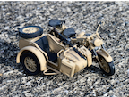
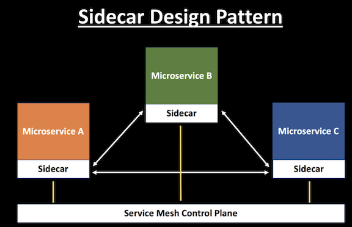
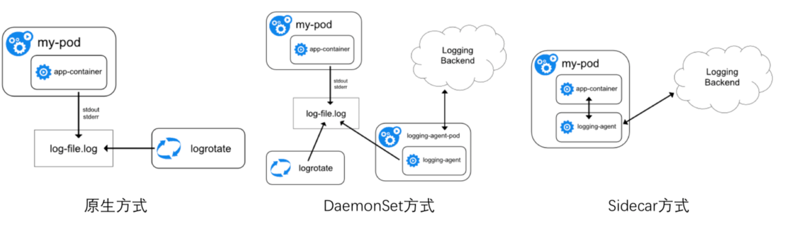
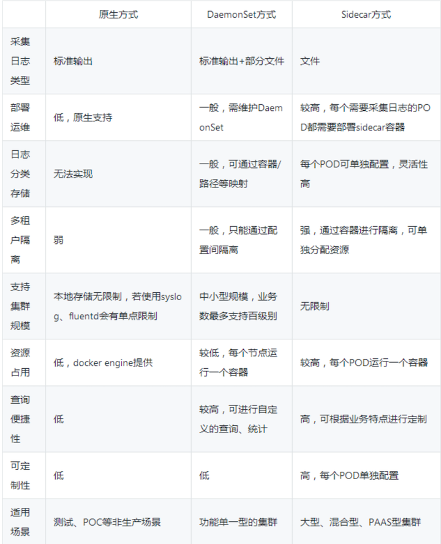
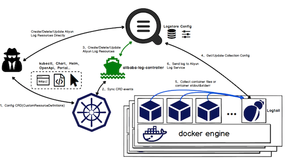
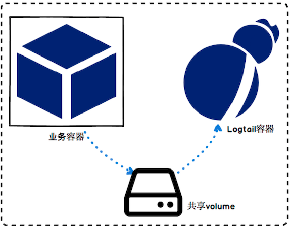

# 微服务中的Sidecar设计模式解析

## 什么是 Sidecar 模式

**将应用程序的功能划分为单独的进程可以被视为 `Sidecar` 模式。`Sidecar` 设计模式允许你为应用程序添加许多功能，而无需额外第三方组件的配置和代码。**

就如 `Sidecar` 连接着摩托车一样，类似地在软件架构中， `Sidecar` 应用是连接到父应用并且为其扩展或者增强功能。`Sidecar` 应用与主应用程序松散耦合。

让我用一个例子解释一下。想象一下假如你有6个微服务相互通信以确定一个包裹的成本。

每个微服务都需要具有**可观察性、监控、日志记录、配置、断路器**等功能。所有这些功能都是根据一些行业标准的第三方库在每个微服务中实现的。

但再想一想，这不是多余吗？它不会增加应用程序的整体复杂性吗？如果你的应用程序是用不同的语言编写时会发生什么——如何合并那些特定用于 .Net、Java、Python 等语言的第三方库。

## 使用 Sidecar 模式的优势

* 通过抽象出与功能相关的共同基础设施到一个不同层**降低了微服务代码的复杂度**。
* 因为你不再需要编写相同的第三方组件配置文件和代码，**所以能够降低微服务架构中的代码重复度。**
* **降低应用程序代码和底层平台的耦合度**。

## Sidecar 模式是如何工作的

服务网格层可以存在于与应用程序一起运行的 `Sidecar` 容器中。 每个应用程序旁边都附有相同 `Sidecar` 的副本。

来自单个服务的所有传入和传出网络流量都流经 `Sidecar` 代理。 因此，`Sidecar` **能够管理微服务之间的流量**，**收集遥测数据并实施相关策略**。

从某种意义上说，该服务不了解整个网络，只知道附加的 `Sidecar` 代理。这实际上就是 `Sidecar` 模式如何工作的本质——将网络依赖性抽象为 `Sidecar`。

在服务网格中有数据平面和控制平面的概念：

* **数据平面**的职责是处理网格内部服务之间的通信，并负**责服务发现、负载均衡、流量管理、健康检查**等功能。
* **控制平面**的职责是管理和配置 `Sidecar `代理以实施策略并收集遥测。

#### 在 `Kubernetes` 和 `Istio` 世界中，你可以将 `Sidecar` 注入 `Pod` 内。`Istio` 使用带有 `Envoy` 的 `Sidecar` 模型作为代理。

## Kubernetes日志采集Sidecar模式介绍

### 日志采集方式

日志作为任一系统不可或缺的部分，在K8S的官方文档中也介绍了多种的日志采集形式，总结起来主要有下述3种：**原生方式**、**DaemonSet方式**和**Sidecar方式**。

1. 原生方式：使用 `kubectl logs` 直接在查看本地保留的日志，或者通过`docker engine`的 `log driver` 把日志重定向到文件、`syslog`、`fluentd`等系统中。
2. `DaemonSet`方式：在`K8S`的每个`node`上部署日志`agent`，由`agent`采集所有容器的日志到服务端。
3. `Sidecar`方式：一个`POD`中运行一个`sidecar`的日志`agent`容器，用于采集该`POD`主容器产生的日志。

### 采集方式对比

每种采集方式都有一定的优劣势，这里我们进行简单的对比：

从上述表格中可以看出：

* 原生方式相对功能太弱，一般不建议在生产系统中使用，否则问题调查、数据统计等工作很难完成；
* `DaemonSet`方式在每个节点只允许一个日志`agent`，**相对资源占用要小很多**，但扩展性、租户隔离性受限，**比较适用于功能单一或业务不是很多的集群**；
* `Sidecar`方式为每个`POD`单独部署日志`agent`，**相对资源占用较多**，但灵活性以及多租户隔离性较强，**建议大型的`K8S`集群或作为`PAAS`平台为多个业务方服务的集群使用该方式**。

### 日志服务K8S采集方式

`DaemonSet`和`Sidecar`模式各有优缺点，目前没有哪种方式可以适用于所有场景。因此我们阿里云日志服务同时支持了`DaemonSet`以及`Sidecar`两种方式，并对每种方式进行了一些额外的改进，更加适用于K8S下的动态场景。

这两种模式均基于`Logtail`实现，日志服务客户端Logtail目前已有百万级部署。

### DaemonSet采集方式

`DaemonSet`方式下`Logtail`做了非常多的适配工作，包括：

* 一条命令一个参数即可实现部署，资源自动初始化
* 支持`CRD`方式配置，支持`K8S`控制台、`kubectl`、`kube api`等，与`K8S`发布、部署无缝集成
* `K8S RBAC`鉴权，日志服务`STS`鉴权管理

### Sidecar采集方式

`sidecar`方式的配置以及使用相对在虚拟机/物理机上采集数据区别不大，

从`Logtail`容器视角来看：**`Logtail`工作在一个“虚拟机”上，需要采集这个机器上某个/某些日志文件。**

但在容器场景下还需解决两个问题：

* 配置：使用编排的方式配置`agent`容器
* 动态性：需适应`POD`的`IP`地址和`hostname`的变化
* 目前`Logtail`的容器支持通过环境变量配置相关参数，并支持自定义标识的机器组进行工作，可以完美解决上述两个问题。

