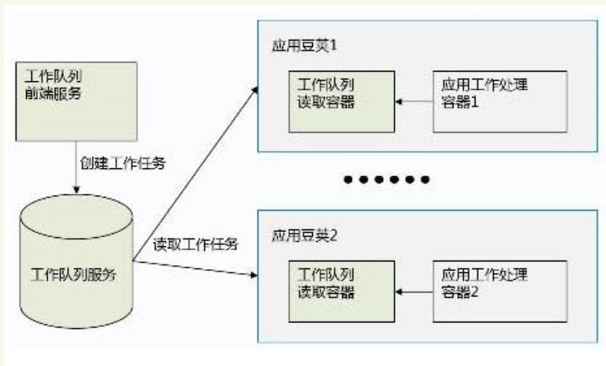

# Kubernetes与容器设计模式

在程序设计领域，面向对象设计和面向对象语言是大家最为熟悉和强大的工具，而面向对象除了其强大的核心特性之外，还有人们通过实践总结出来的一系列设计模式，可以用来解决实际应用设计中的一些复杂问题

云原生应用运行的环境都是复杂的分布式环境，在这种情况下，一些有用的设计模式可以起到四两拨千斤的作用，而K8s社区推出的容器设计模式，则是结合了**K8s集群的微服务模型提出的一系列可重用的解决典型分布式系统问题的模式**。

目前K8s社区推出的容器设计模式主要分为三大类：

* 单容器管理模式；
* 单节点多容器模式；
* 多节点多容器模式；


## 一、单容器管理模式

K8s的最大特色是支持多容器的微服务实例。当然，单容器的模式也是支持的，只不过这种模式并不能突出K8s的特色和强大。很多人对K8s一直以来的印象是：功能强大，但入门较难。其实，单单就启动一个单容器微服务实例，K8s的命令行操作跟Docker原生命令一样简单。

```
# kubectl run nginx --image=nginx
deployment "nginx" created

# kubectl get deployment
NAME      DESIRED   CURRENT   UP-TO-DATE   AVAILABLE   AGE
nginx     1         1         1            1           24s

# kubectl get rs
NAME               DESIRED   CURRENT   AGE
nginx-3137573019   1         1         1m
```

由上面的例子可以看到，K8s只要一个命令既可以启动以nginx为镜像的一个微服务实例。与此同时，K8s的强大之处在于，方便用户用一个命令的同时，仍然保证了K8s应用体系的完整性和规范性。也就是说，虽然用户只运行了一个命令，但K8s为用户自动创建了四种API对象，包括：`Deployment`，`ReplicaSet(RS)`，`Pod`和`Container`。要想扩展伸缩同一服务的实例个数也非常简单。

```
# kubectl scale deployment nginx --replicas=3
deployment "nginx" scaled

# kubectl get rs
NAME               DESIRED   CURRENT   AGE
nginx-3137573019   3         3         22m
```

依靠这种兼顾易用性和模型一致性的设计理念，K8s使自己既适合简单场景也适合复杂场景。


## 二、单节点多容器模式

　　从单节点多容器模式开始的容器设计模式，是真正体现K8s设计特点的地方，也就是基于多容器微服务模型的分布式应用模型。在K8s体系中，Pod是一个轻量级的节点，同一个Pod中的容器可以共享同一块存储空间和同一个网络地址空间，这使得我们可以实现一些组合多个容器在同一节点工作的模式。既然Pod的特点是共享存储空间和网络地址，那么单节点多容器模式一定是利用这两种特性的。

### 2.1挎斗模式（Sidecar pattern）

第一种单节点多容器模式是**挎斗模式**。**这种模式主要是利用在同一`Pod`中的容器可以共享存储空间的能力**。

一个典型的挎斗应用场景如图所示：

#### 一个工具容器写文件到共享的文件目录，应用主容器从共享的文件目录读文件。

例如，我们可以用Nginx构建一个代码发布仓库，简单的将代码放到某个本地目录即可。为了保持同步，我们同时用一个装有Git客户端的容器定时到原始代码仓库同步下拉最新的代码。

* 这种模式的好处是，**工具容器的镜像，也就是打包有Git客户端的镜像可以重用，而不需要跟应用的容器打包在一起**。
* 同样的应用，应用主容器不用Nginx也可以用Apache Httpd，都可以跟工具容器组合起来形成微服务。


另一个典型的挎斗模式如图所示：**一个工具容器读文件，应用容器写文件**。

例如：一个基于Nginx的Web应用向系统文件系统写入日志，而一个收集日志的容器从共享目录读出日志，并输出到集群的日志系统。

这一模式的好处在于，**工具容器的镜像是可以重用的**，不需要在每次更新应用容器打包的时候，把工具容器的执行文件打包进去。


### 2.2 外交官模式(Ambassador pattern)

第二种单节点多容器模式是**外交官模式**。

这种模式主要利用同一`Pod`中的容器可以**共享网络地址空间**的特性(**Pause container**)。

如图所示，**在一个`Pod`中给应用容器搭配一个工具容器作为代理服务器**。

#### 工具容器帮助应用容器访问外部服务，使得应用容器访问服务时不需要使用外网的`IP`地址，而只需要用`localhost`访问本地服务。在这种模式下，作为代理服务器的工具容器好像外部服务派驻在`Pod`中的“外交官”，使得应用容器办理业务时只需要跟本`Pod`的外交官打交道，而不需要出国了，因此而得名。


#### 2.2.1基于外交官模式的Redis访问案例


### 2.3 适配器模式（Adapter pattern）

第三种单节点多容器模式是适配器模式。
　
**这种模式对于监控和管理分布式系统尤为重要**。

对分布式系统的一种理想设计目标，就是能够实现“**分布地执行和存储，统一的监控和管理**”。要想实现“统一的监控和管理”，应用和监控管理交互的接口需要是统一的，而且其接口是依照“统一的监控服务”的接口模式来实现。

这和面向对象设计模式中的“适配器模式”也非常相似。


[监控 Kubernetes 集群节点 with node exporter](https://github.com/Chao-Xi/JacobTechBlog/blob/master/k8s_dev/prometheus/6Adv_K8S_Nodes_monitor.md)

一个典型的可以采用适配器模式的系统，是利用`Prometheus`作为监控服务的分布式系统。

在`Prometheus`周边项目中，有诸多适用于不同应用系统的监控数据输出器（`Exporter`），负责收集跟特定应用相关的监控数据，使得`Prometheus`服务可以以统一的数据模式收集不同应用系统的监控数据，每个`Exporter`同时也都是一个适配器模式的实现。

## 三、多节点组合模式


### 3.1 多节点选举模式

多节点选举在分布式系统中是一种重要的模式，特别是对有状态服务来说。在分布式系统中，一般来说，无状态服务，可以随意的水平伸缩，只要把运行业务逻辑的实例复制出去运行就可以，这也就是K8s里`ReplicationController`和`ReplicaSet`所做的事情。

　　**对于有状态服务，人们也希望能够水平的扩展，但因为每个实例有自己的持久化状态**，而这个持久化状态必须要延续它的生命，因此，**有状态服务的水平伸缩模式就是状态的分片**，其中机制跟数据库的分片是一致的。那么对于一个原生为分布式系统设计的有状态服务，每个实例与分片数据的对应关系，就成为这个有状态服务的全局信息。对于任何服务，多个实例的全局信息都需要一个保存的地方。

　　**一个简单的办法是保存在外部的一个代理服务器上**，这也就是`MariaDB`的`Galera`解决方案的做法，**也是所以代理服务器为后端服务器所做的事情**。但这种方式的问题在于，系统要依赖外部代理服务器，而代理服务器本身的高可用和水平伸缩还是没有解决的问题。

　　所以对于要原生自己解决高可用和水平伸缩问题的系统，例如`Etcd`和`ElasticSearch`，**一定要有原生的主控节点选举机制**。这样这个分布式系统就不需要依赖外部的系统来维护自己的状态了。**对于一个分布式系统，最主要的系统全局信息，就是集群中有哪些节点，`Master` 节点是哪个，每个节点对应哪个分片。主控节点的任务，就是保存和分发这些信息**。

 　　在K8s集群中，一个微服务实例`Pod`可以有多个容器。这一特性很好地提高了多节点选举机制的可重用性。它使得我们可以专门开发一个用于选举的容器镜像，在实际部署中，将选举容器和普通应用容器组合起来，应用容器只需要从本地的选举容器读取状态，就可以得到选举结果。这样，使得应用容器可以只关注自身业务逻辑相关的代码。
 　　


### 3.2工作队列模式

分布式系统的一个重要作用是能够充分利用多个物理计算资源的能力，特别是在动态按需调动计算资源完成计算任务。设想如果有大量的需要处理的任务随机的到来，对计算资源需要的容量是不确定地；显然，按照最大可能计算量和最小可能计算量设置计算节点都是不合理的。

　　**这种情况下，可以把需要处理的任务放到一个待处理的队列里，根据需要启动计算节点从队列读取任务进行处理**。在容器技术广泛应用之前，也有诸多的分布式处理系统依靠队列来处理大量计算任务，例如大数据处理系统`Hadoop`和`Spark`等。这些系统的一个限制是实现队列处理模式大多要遵循特定的编程模式和特定的编程语言，同时搭建基础设施也大多复杂而耗时。而基于容器和`Kubernetes`编排技术的工作队列模式的好处在于，利用非常简单的编排脚本就可以实现工作队列模式，而用`Pod`作为轻量级处理节点的模式，使得动态的调度计算资源变得非常容易。在`Kubernetes`中应用工作队列模式的逻辑示意图如下：
　　
　
　　
### 3.3 分散收集模式

   **分散收集模式利用分布式系统弹性计算能力的容器设计模式**。
   
   **在这一模式中，计算服务的使用者，即服务的客户端，将初始计算请求发送给一个“根计算节点”。根计算节点对计算任务做出分割，将任务分割成大量的小计算任务，然后将小计算任务分配给大量计算服务器进行分布式平行计算.**
   
   每个计算服务器都计算初始计算任务的一小块，将计算结果返回给根计算节点。根计算节点将所有计算结果合并起来，组成一个针对初始计算任务的一个统一的结果，返回给申请计算任务的客户端。

　　这一系统中的分布式服务器非常适合用容器技术来实现，具体到K8s系统中，就是一个`K8s`的`Pod`；具体到`Docker`系统中，就是一个`Docker`容器。利用容器快速部署启动和运行时开销特别小的特点，任务可以被分到很多小服务器上并行处理，这些容器形成的小服务器跟其他任务共同使用基础设施计算节点的能力。

　　一个典型的分散收集模式的分布式系统如下图所示。**根节点接受到来自客户端的服务请求，将服务请求分配给不同的业务模块分散处理，处理结果收集到根节点，经过一定的汇聚合并运算，产生一个合并的结果交付给客户端。**

　

　　

