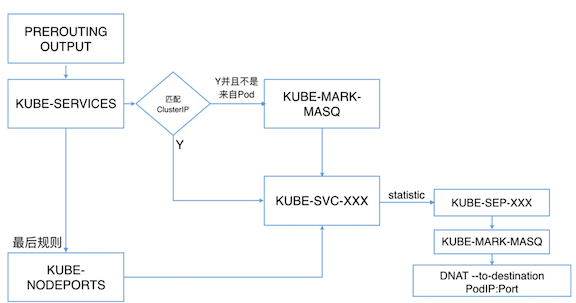

# 内部服务发现 kube-proxy 实现原理

`service` 是一组`pod`的服务抽象，相当于一组`pod`的`LB(load balancer)`，负责将请求分发给对应的`pod`。`service`会为这个`LB`提供一个`IP`，一般称为`cluster IP`。 `kube-proxy`的作用主要是负责`service`的实现，


每台机器上都运行一个`kube-proxy`服务，它监听`API server`中`service`和`endpoint`的变化情况，并通过`iptables`等来为服务配置负载均衡(仅支持`TCP`和`UDP`)。

`kube-proxy`可以直接运行在物理机上，也可以以`static pod`或者`daemonset`的方式运行。

#### 具体来说，就是实现了内部从`pod`到`service`和外部的从`node port`向`service`的访问。

举个例子，现在有`podA`，`podB`，`podC` 和 `serviceAB`。`serviceAB` 是`podA`，`podB` 的服务抽象`(service)`。 那么`kube-proxy`的作用就是可以将`pod`(不管是`podA`，`podB`或者`podC`)向`serviceAB`的请求，进行转发到`service`所代表的一个具体`pod`(`podA`或者`podB`)上。 **请求的分配方法一般分配是采用轮询方法进行分配。(round robin)**

#### 另外，`kubernetes`还提供了一种在`node`节点上暴露一个端口，从而提供从外部访问`service`的方式。

比如我们使用这样的一个`manifest`来创建`service`


```
apiVersion: v1
kind: Service
metadata:
  labels:
    name: mysql
    role: service
  name: mysql-service
spec:
  ports:
    - port: 3306
      targetPort: 3306
      nodePort: 30964
  type: NodePort
  selector:
    mysql-service: "true"
```

* 他的含义是在`node`上暴露出`30964`端口**(nodePort)**。
* 当访问node上的`30964`端口时，其请求会转发到`service`对应的`cluster IP`的`3306`端口**(targetPort)**，
* 并进一步转发到`pod`的`3306`端口**(Port)**。

#### kube-proxy当前支持一下几种实现:

* `userspace`:最早的负载均衡方案，**它在用户空间监听一个端口**，所有服务通过iptables转发到这个端口，然后在其内部负载均衡到实际的`Pod`。该方式最主要的问题是效率低，有明显的性能瓶颈。
* `iptables`:**目前推荐的方案**，**完全以`iptables`规则的方式来实现`service`负载均衡**。该方式最主要的问题是在服务多的时候产生太多的`iptables`规则，非增量式更新会引入一定的时延，大规模情况下有明显的性能问题
* `ipvs`:为解决`iptables`模式的性能问题，`v1.8`新增了`ipvs`模式，**采用增量式更新**，并可以保证`service` 更新期间连接保持不断开
* `winuserspace`:同`userspace`，但仅工作在`windows`上


### 1. userspace

这里具体举个例子，以`ssh-service1`为例，`kube`为其分配了一个`clusterIP`。分配`clusterIP`的作用还是如上文所说，是方便`pod`到`service`的数据访问。

```
$ kubectl get service NAME LABELS SELECTOR IP(S) PORT(S) kubernetes component=apiserver,provider=kubernetes   <none>                10.254.0.1       443/TCP
ssh-service1     name=ssh,role=service                     ssh-service=true 10.254.132.107   2222/TCP
```

使用`describe`可以查看到详细信息。可以看到暴露出来的`NodePort`端口`30239`。

```
$ kubectl describe service ssh-service1 
Name:			ssh-service1
Namespace:		default
Labels:			name=ssh,role=service
Selector:		ssh-service=true Type:			LoadBalancer
IP:			10.254.132.107
Port:			<unnamed>	2222/TCP
NodePort:		<unnamed>	30239/TCP
Endpoints:		<none>
Session Affinity:	None
No events.
```

`nodePort`的工作原理与`clusterIP`大致相同，是发送到`node`上指定端口的数据，通过`iptables`重定向到`kube-proxy`对应的端口上。然后由`kube-proxy`进一步把数据发送到其中的一个`pod`上。

```
$ sudo iptables -S -t nat
...
-A KUBE-NODEPORT-CONTAINER -p tcp -m comment --comment "default/ssh-service1:" -m tcp --dport 30239 -j REDIRECT --to-ports 36463
-A KUBE-NODEPORT-HOST -p tcp -m comment --comment "default/ssh-service1:" -m tcp --dport 30239 -j DNAT --to-destination 10.0.0.5:36463
-A KUBE-PORTALS-CONTAINER -d 10.254.132.107/32 -p tcp -m comment --comment "default/ssh-service1:" -m tcp --dport 2222 -j REDIRECT --to-ports 36463
-A KUBE-PORTALS-HOST -d 10.254.132.107/32 -p tcp -m comment --comment "default/ssh-service1:" -m tcp --dport 2222 -j DNAT --to-destination 10.0.0.5:36463
```

* **可以看到访问`node`时候的`30239`端口会被转发到`node`上的`36463`端口**。
* **而且在访问`clusterIP` `10.254.132.107`的`2222`端口时，也会把请求转发到本地的`36463`端口。** 
* **`36463`端口实际被`kube-proxy`所监听，将流量进行导向到后端的`pod`上。**


### 2. iptables

`iptables`的方式则是利用了`linux`的`iptables`的`nat`转发进行实现。在本例中，创建了名为`mysql-service`的`service`。

```
apiVersion: v1
kind: Service
metadata:
  labels:
    name: mysql
    role: service
  name: mysql-service
spec:
  ports:
    - port: 3306
      targetPort: 3306
      nodePort: 30964
  type: NodePort
  selector:
    mysql-service: "true"
```

* 他的含义是在`node`上暴露出`30964`端口**(nodePort)**。
* 当访问node上的`30964`端口时，其请求会转发到`service`对应的`cluster IP`的`3306`端口**(targetPort)**，
* 并进一步转发到`pod`的`3306`端口**(Port)**。


`mysql-service`后端代理了两个`pod`，`ip`分别是`192.168.125.129`和`192.168.125.131`。先来看一下`iptables`。

```
# iptables -S -t nat
...
-A PREROUTING -m comment --comment "kubernetes service portals" -j KUBE-SERVICES
-A OUTPUT -m comment --comment "kubernetes service portals" -j KUBE-SERVICES
-A POSTROUTING -m comment --comment "kubernetes postrouting rules" -j KUBE-POSTROUTING
-A KUBE-MARK-MASQ -j MARK --set-xmark 0x4000/0x4000
-A KUBE-NODEPORTS -p tcp -m comment --comment "default/mysql-service:" -m tcp --dport 30964 -j KUBE-MARK-MASQ
-A KUBE-NODEPORTS -p tcp -m comment --comment "default/mysql-service:" -m tcp --dport 30964 -j KUBE-SVC-67RL4FN6JRUPOJYM
-A KUBE-SEP-ID6YWIT3F6WNZ47P -s 192.168.125.129/32 -m comment --comment "default/mysql-service:" -j KUBE-MARK-MASQ
-A KUBE-SEP-ID6YWIT3F6WNZ47P -p tcp -m comment --comment "default/mysql-service:" -m tcp -j DNAT --to-destination 192.168.125.129:3306
-A KUBE-SEP-IN2YML2VIFH5RO2T -s 192.168.125.131/32 -m comment --comment "default/mysql-service:" -j KUBE-MARK-MASQ
-A KUBE-SEP-IN2YML2VIFH5RO2T -p tcp -m comment --comment "default/mysql-service:" -m tcp -j DNAT --to-destination 192.168.125.131:3306
-A KUBE-SERVICES -d 10.254.162.44/32 -p tcp -m comment --comment "default/mysql-service: cluster IP" -m tcp --dport 3306 -j KUBE-SVC-67RL4FN6JRUPOJYM
-A KUBE-SERVICES -m comment --comment "kubernetes service nodeports; NOTE: this must be the last rule in this chain" -m addrtype --dst-type LOCAL -j KUBE-NODEPORTS
-A KUBE-SVC-67RL4FN6JRUPOJYM -m comment --comment "default/mysql-service:" -m statistic --mode random --probability 0.50000000000 -j KUBE-SEP-ID6YWIT3F6WNZ47P
-A KUBE-SVC-67RL4FN6JRUPOJYM -m comment --comment "default/mysql-service:" -j KUBE-SEP-IN2YML2VIFH5RO2T
```

下面来逐条分析

首先如果是通过`node`的`30964`端口访问，则会进入到以下链

```
-A KUBE-NODEPORTS -p tcp -m comment --comment "default/mysql-service:" -m tcp --dport 30964 -j KUBE-MARK-MASQ
-A KUBE-NODEPORTS -p tcp -m comment --comment "default/mysql-service:" -m tcp --dport 30964 -j KUBE-SVC-67RL4FN6JRUPOJYM
```

然后进一步跳转到`KUBE-SVC-67RL4FN6JRUPOJYM`的链

```
-A KUBE-SVC-67RL4FN6JRUPOJYM -m comment --comment "default/mysql-service:" -m statistic --mode random --probability 0.50000000000 -j KUBE-SEP-ID6YWIT3F6WNZ47P
-A KUBE-SVC-67RL4FN6JRUPOJYM -m comment --comment "default/mysql-service:" -j KUBE-SEP-IN2YML2VIFH5RO2T
```

这里利用了`iptables`的`–probability`的特性，使连接有**50%**的概率进入到`KUBE-SEP-ID6YWIT3F6WNZ47P`链，**50%**的概率进入到`KUBE-SEP-IN2YML2VIFH5RO2T`链。

`KUBE-SEP-ID6YWIT3F6WNZ47P`的链的具体作用就是将请求通过`DNAT`发送到`192.168.125.129`的`3306`端口。


```
-A KUBE-SEP-ID6YWIT3F6WNZ47P -s 192.168.125.129/32 -m comment --comment "default/mysql-service:" -j KUBE-MARK-MASQ
-A KUBE-SEP-ID6YWIT3F6WNZ47P -p tcp -m comment --comment "default/mysql-service:" -m tcp -j DNAT --to-destination 192.168.125.129:3306
```

同理`KUBE-SEP-IN2YML2VIFH5RO2T`的作用是通过`DNAT`发送到`192.168.125.131`的`3306`端口。

```
-A KUBE-SEP-IN2YML2VIFH5RO2T -s 192.168.125.131/32 -m comment --comment "default/mysql-service:" -j KUBE-MARK-MASQ
-A KUBE-SEP-IN2YML2VIFH5RO2T -p tcp -m comment --comment "default/mysql-service:" -m tcp -j DNAT --to-destination 192.168.125.131:3306
```

#### Kubernetes Iptables规则



分析完`nodePort`的工作方式，接下里说一下`clusterIP`的访问方式。 对于直接访问`cluster IP(10.254.162.44)`的`3306`端口会直接跳转到`KUBE-SVC-67RL4FN6JRUPOJYM`。

```
-A KUBE-SERVICES -d 10.254.162.44/32 -p tcp -m comment --comment "default/mysql-service: cluster IP" -m tcp --dport 3306 -j KUBE-SVC-67RL4FN6JRUPOJYM
```

接下来的跳转方式同上文，这里就不再赘述了。


### 3. ipvs

[如何在 kubernetes 中开启 ipvs 模式](k8s_adv26_ipvs.md)


