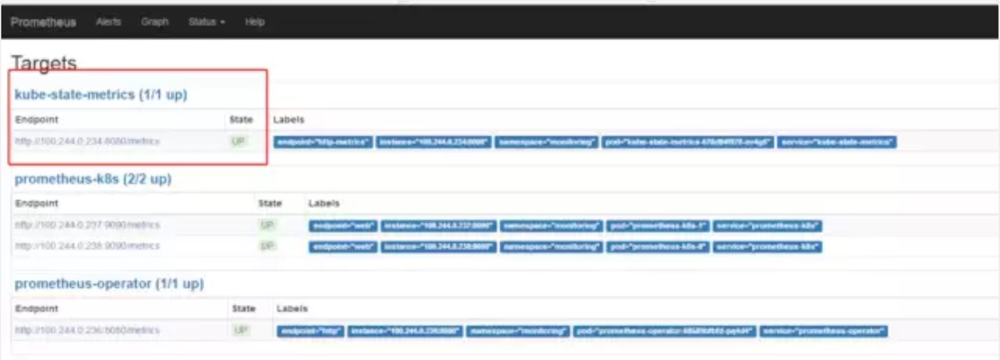

# kube-state-metrics 

## 概述

已经有了 `cadvisor`、`heapster`、`metric-server`，几乎容器运行的所有指标都能拿到，但是下面这种情况却无能为力：


* 我调度了多少个 `replicas`？现在可用的有几个？
* 多少个 `Pod` 是 `running/stopped/terminated` 状态？
* `Pod` 重启了多少次？
* 我有多少 `job` 在运行中

**而这些则是 `kube-state-metrics` 提供的内容，它基于 `client-go` 开发，轮询 `Kubernetes API`，并将 `Kubernetes`的结构化信息转换为`metrics`。**


## 功能

`kube-state-metrics` 提供的指标，按照阶段分为三种类别：

* 1.实验性质的：`k8s api` 中 `alpha` 阶段的或者 `spec` 的字段。
* 2.稳定版本的：`k8s` 中不向后兼容的主要版本的更新
* 3.被废弃的：已经不在维护的。


指标类别包括：

- CronJob Metrics
- DaemonSet Metrics
- Deployment Metrics
- Job Metrics
- LimitRange Metrics
- Node Metrics
- PersistentVolume Metrics
- PersistentVolumeClaim Metrics
- Pod Metrics
- Pod Disruption Budget Metrics
- ReplicaSet Metrics
- ReplicationController Metrics
- ResourceQuota Metrics
- Service Metrics
- StatefulSet Metrics
- Namespace Metrics
- Horizontal Pod Autoscaler Metrics
- Endpoint Metrics
- Secret Metrics
- ConfigMap Metrics

以 `Pod` 为例：

- `kube_pod_info`
- `kube_pod_owner`
- `kube_pod_status_phase`
- `kube_pod_status_ready`
- `kube_pod_status_scheduled`
- `kube_pod_container_status_waiting`
- `kube_pod_container_status_terminated_reason`
- ...

## 使用:

部署清单地址：`https://github.com/kubernetes/kube-state-metrics/tree/master/kubernetes`

```
$ cd kube-state-metrics/kubernetes
$ tree
.
├── kube-state-metrics-cluster-role-binding.yaml
├── kube-state-metrics-cluster-role.yaml
├── kube-state-metrics-deployment.yaml
├── kube-state-metrics-role-binding.yaml
├── kube-state-metrics-role.yaml
├── kube-state-metrics-service-account.yaml
└── kube-state-metrics-service.yaml

0 directories, 7 files
```

主要镜像有：

```
image: quay.io/coreos/kube-state-metrics:v1.5.0
image: k8s.gcr.io/addon-resizer:1.8.3（参考metric-server文章，用于扩缩容）
```

对于`pod`的资源限制，一般情况下：

```
200MiB memory 0.1 cores
```

超过`100`节点的集群：

```
2MiB  memory per node 0.001 cores per node
```

`kube-state-metrics` 做过一次性能优化，具体内容参考下文

部署成功后，`prometheus`的`target`会出现如下标志



因为 `kube-state-metrics-service.yaml` 中有 `prometheus.io/scrape:'true'`标识，因此会将 `metric` 暴露给 `Prometheus`，而 `Prometheus` 会在 `kubernetes-service-endpoints` 这个 `job` 下自动发现`kube-state-metrics`，并开始拉取 `metrics`，无需其他配置。

**`kube-state-metrics-service.yaml`**

```
apiVersion: v1
kind: Service
metadata:
  name: kube-state-metrics
  namespace: kube-system
  labels:
    k8s-app: kube-state-metrics
  annotations:
    prometheus.io/scrape: 'true'
spec:
  ports:
  - name: http-metrics
    port: 8080
    targetPort: http-metrics
    protocol: TCP
  - name: telemetry
    port: 8081
    targetPort: telemetry
    protocol: TCP
  selector:
    k8s-app: kube-state-metrics
```

```
annotations:
    prometheus.io/scrape: 'true'
```


使用 `kube-state-metrics` 后的常用场景有：

* **存在执行失败的 `Job`**: `kube_job_status_failed{job="kubernetes-service-endpoints",k8s_app="kube-state-metrics"}==1`
* **集群节点状态错误**: `kube_node_status_condition{condition="Ready",status!="true"}==1`
* **集群中存在启动失败的 `Pod`**： `kube_pod_status_phase{phase=~"Failed|Unknown"}==1`
* **最近30分钟内有 `Pod` 容器重启**: `changes(kube_pod_container_status_restarts[30m])>0`

配合报警可以更好地监控集群的运行


## 与`metric-server`的对比

* `metric-server`（或`heapster`）是从 `api-server` 中获取 `cpu`、`内存使用率`这种监控指标，并把他们发送给存储后端，如 `influxdb` 或云厂商，他当前的核心作用是：为 `HPA `等组件提供决策指标支持。
* `kube-state-metrics` 关注于获取 `k8s` 各种资源的最新状态，如 `deployment` 或者 `daemonset`，
* 之所以没有把`kube-state-metrics` 纳入到 `metric-server` 的能力中，**是因为他们的关注点本质上是不一样的**。**`metric-server`仅仅是获取、格式化现有数据，写入特定的存储，实质上是一个监控系统**。**而 `kube-state-metrics` 是将 `k8s` 的运行状况在内存中做了个快照，并且获取新的指标，但他没有能力导出这些指标**
* 换个角度讲，`kube-state-metrics` 本身是 `metric-server` 的一种数据来源，虽然现在没有这么做。
* 另外，像 `Prometheus` 这种监控系统，并不会去用 `metric-server` 中的数据，他都是自己做指标收集、集成的`（Prometheus包含了metric-server的能力）`，但 `Prometheus` 可以监控 `metric-server` 本身组件的监控状态并适时报警，这里的监控就可以通过 `kube-state-metrics` 来实现，如 `metric-server pod` 的运行状态。


## 深入解析

`kube-state-metrics` 本质上是不断轮询 `api-server`，代码结构也很简单，主要代码目录：

```
$ cd /kube-state-metrics/pkg/
$ tree 
.
├── collectors
│   ├── builder.go
│   ├── collectors.go
│   ├── configmap.go
│   ...
│   ├── statefulset_test.go
│   ├── testutils.go
│   ├── testutils_test.go
│   └── utils.go
├── constant
│   └── resource_unit.go
├── metrics
│   ├── metrics.go
│   └── metrics_test.go
├── metrics_store
│   ├── metrics_store.go
│   └── metrics_store_test.go
├── options
│   ├── collector.go
│   ├── options.go
│   ├── options_test.go
│   ├── types.go
│   └── types_test.go
├── version
│   └── version.go
└── whiteblacklist
    ├── whiteblacklist.go
    └── whiteblacklist_test.go

7 directories, 58 files
```
所有类型：

```
$ cd /kube-state-metrics/pkg/options
$ less collectors.go

package options

import (
	metav1 "k8s.io/apimachinery/pkg/apis/meta/v1"
)

var (
	DefaultNamespaces = NamespaceList{metav1.NamespaceAll}
	DefaultCollectors = CollectorSet{
		"daemonsets":               struct{}{},
		"deployments":              struct{}{},
		"limitranges":              struct{}{},
		"nodes":                    struct{}{},
		"pods":                     struct{}{},
		"poddisruptionbudgets":     struct{}{},
		"replicasets":              struct{}{},
		"replicationcontrollers":   struct{}{},
		"resourcequotas":           struct{}{},
		"services":                 struct{}{},
		"jobs":                     struct{}{},
		"cronjobs":                 struct{}{},
		"statefulsets":             struct{}{},
		"persistentvolumes":        struct{}{},
		"persistentvolumeclaims":   struct{}{},
		"namespaces":               struct{}{},
		"horizontalpodautoscalers": struct{}{},
		"endpoints":                struct{}{},
		"secrets":                  struct{}{},
		"configmaps":               struct{}{},
	}
)
```

构建对应的收集器

`Family`即一个类型的资源集合，如 `job` 下的 `kubejobinfo`、`kubejobcreated`，都是一个 `FamilyGenerator` 实例

```
		metrics.FamilyGenerator{
			Name: "kube_job_info",
			Type: metrics.MetricTypeGauge,
			Help: "Information about job.",
			GenerateFunc: wrapJobFunc(func(j *v1batch.Job) metrics.Family {
				return metrics.Family{&metrics.Metric{
					Name:  "kube_job_info",
					Value: 1,
				}}
			}),
		},
		
func (b *Builder) buildCronJobCollector() *Collector{
  // 过滤传入的白名单
  filteredMetricFamilies := filterMetricFamilies(b.whiteBlackList, cronJobMetricFamilies)
  composedMetricGenFuncs := composeMetricGenFuncs(filteredMetricFamilies)

  // 将参数写到header中
  familyHeaders := extractMetricFamilyHeaders(filteredMetricFamilies)

 // NewMetricsStore实现了client-go的cache.Store接口，实现本地缓存。
  store := metricsstore.NewMetricsStore(
     familyHeaders,
     composedMetricGenFuncs,
   )
 // 按namespace构建Reflector，监听变化
 
 reflectorPerNamespace(b.ctx, b.kubeClient, &batchv1beta1.CronJob{}, store, b.namespaces, createCronJobListWatch)

return NewCollector(store)
}

```

性能优化：


`kube-state-metrics` 在之前的版本中暴露出两个问题：

* `1./metrics` 接口响应慢(10-20s)
* 2.内存消耗太大，导致超出 `limit` 被杀掉

问题一的方案就是基于 `client-go` 的 `cache tool` 实现本地缓存，具体结构为：

```
var cache = map[uuid][]byte{}
```
问题二的的方案是：对于时间序列的字符串，是存在很多重复字符的（如 `namespace` 等前缀筛选），可以用指针或者结构化这些重复字符。

## 优化点和问题

1. 因为 `kube-state-metrics` 是监听资源的 `add`、`delete`、`update` 事件，那么在 `kube-state-metrics` 部署之前已经运行的资源，岂不是拿不到数据？`kube-state-metric` 利用 `client-go` 可以初始化所有已经存在的资源对象，确保没有任何遗漏
2. `kube-state-metrics` 当前不会输出 `metadata` 信息(如 `help` 和 `description`）
3. 缓存实现是基于 `golan`g 的 `map`，解决并发读问题当期是用了一个简单的互斥锁，可以解决问题，后续会考虑`golang` 的 `sync.Map` 安全 `map`。
4. `kube-state-metrics` 通过比较 `resource version` 来保证 `event` 的顺序
5. `kube-state-metrics` 并不保证包含所有资源


 


