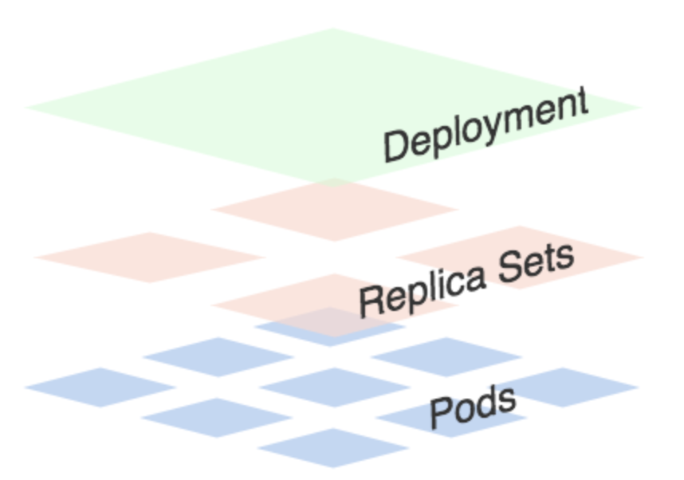
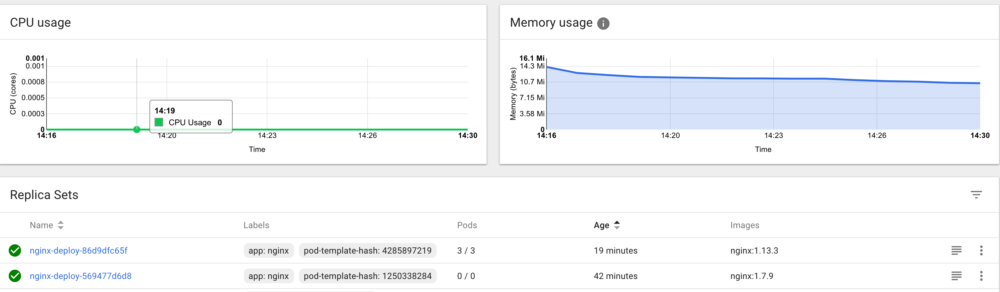

# Kubernetes Deployment滚动升级

k8s集群从1.7.7版本开始官方已经推荐使用`Deployment`代替`Replication Controller(rc)`了，`Deployment`继承了`rc`的全部功能外，还可以查看升级详细进度和状态，当升级出现问题的时候，可以使用回滚操作回滚到指定的版本，每一次对Deployment的操作，都会保存下来，变能方便的进行回滚操作了，另外对于每一次升级都可以随时暂停和启动，拥有多种升级方案：`Recreate`删除现在的`Pod`，重新创建；`RollingUpdate`滚动升级，逐步替换现有`Pod`，对于生产环境的服务升级，显然这是一种最好的方式

## 创建Deployment



可以看出一个`Deployment`拥有多个`Replica Set`，而一个`Replica Se`t拥有一个或多个`Pod`。一个`Deployment`控制多个`rs`主要是为了支持回滚机制，每当`Deployment`操作时，`Kubernetes`会重新生成一个`Replica Set`并保留，以后有需要的话就可以回滚至之前的状态。 下面创建一个`Deployment`，它创建了一个`Replica Set`来启动3个`nginx pod`，yaml文件如下：

```
apiVersion: apps/v1beta1
kind: Deployment
metadata:
  name: nginx-deploy
  labels:
    k8s-app: nginx-demo
spec:
  replicas: 3
  template:
    metadata:
      labels:
        app: nginx
    spec:
      containers:
      - name: nginx
        image: nginx:1.7.9
        ports:
        - containerPort: 80
```

将上面内容保存为: `nginx-deployment.yaml`，执行命令:

```
$ kubectl create -f nginx-deployment.yaml
deployment "nginx-deploy" created
```

然后执行一下命令查看刚刚创建的`Deployment`:

```
$ kubectl get deployments
kubectl get deployments
NAME           DESIRED   CURRENT   UP-TO-DATE   AVAILABLE   AGE
my-nginx       2         2         2            2           20h
nginx-deploy   3         3         3            3           32s
```

我们可以看到`Deployment`已经创建了3个`Replica Set`了，执行下面的命令查看`rs`和`pod`:

```
$ kubectl get rs
NAME                      DESIRED   CURRENT   READY     AGE
nginx-deploy-569477d6d8   3         3         3         1m
```

```
$ kubectl get pod --show-labels
NAME                            READY     STATUS    RESTARTS   AGE       LABELS
nginx-deploy-569477d6d8-4mvwz   1/1       Running   0          2m        app=nginx,pod-template-hash=1250338284
nginx-deploy-569477d6d8-9hf8c   1/1       Running   0          2m        app=nginx,pod-template-hash=1250338284
nginx-deploy-569477d6d8-zmr9z   1/1       Running   0          2m        app=nginx,pod-template-hash=1250338284
```

上面的`Deployment`的yaml文件中的`replicas:3`将会保证我们始终有3个POD在运行。

## 滚动升级Deployment

现在我们将刚刚保存的yaml文件中的`nginx`镜像修改为`nginx:1.13.3`，然后在`spec`下面添加滚动升级策略：

```
minReadySeconds: 5
strategy:
  # indicate which strategy we want for rolling update
  type: RollingUpdate
  rollingUpdate:
    maxSurge: 1
    maxUnavailable: 1
```

new `nginx-deployment.yaml`

```
apiVersion: apps/v1beta1
kind: Deployment
metadata:
  name: nginx-deploy
  labels:
    k8s-app: nginx-demo
spec:
  replicas: 3
  template:
    metadata:
      labels:
        app: nginx
    spec:
      containers:
      - name: nginx
        image: nginx:1.13.3
        ports:
        - containerPort: 80
  minReadySeconds: 5
  strategy:
    # indicate which strategy we want for rolling update
    type: RollingUpdate
    rollingUpdate:
      maxSurge: 1
      maxUnavailable: 1
```

### `minReadySeconds`:

* Kubernetes在等待设置的时间后才进行升级
* 如果没有设置该值，Kubernetes会假设该容器启动起来后就提供服务了
* 如果没有设置该值，在某些极端情况下可能会造成服务非正常运行

### `maxSurge`:

* 升级过程中最多可以比原先设置多出的`POD`数量
* 例如：`maxSurage=1，replicas=5`,则表示Kubernetes会先启动`1`一个新的`Pod`后才删掉一个旧的`POD`，整个升级过程中最多会有`5+1`个`POD`。

### `maxUnavaible`:

* 升级过程中最多有多少个`POD`处于无法提供服务的状态
* 当`maxSurge`不为`0`时，该值也不能为`0`
* 例如：`maxUnavaible=1`，则表示Kubernetes整个升级过程中最多会有`1`个POD处于无法服务的状态。

然后执行命令：

```
$ kubectl apply -f nginx-deployment.yaml
Warning: kubectl apply should be used on resource created by either kubectl create --save-config or kubectl apply
deployment "nginx-deploy" configured
```

### 然后我们可以使用`rollout`命令：

**1. 查看状态：**

```
$ kubectl rollout status deployment/nginx-deploy
kubectl rollout status deployment/nginx-deploy
Waiting for rollout to finish: 2 out of 3 new replicas have been updated...
Waiting for rollout to finish: 2 out of 3 new replicas have been updated...
Waiting for rollout to finish: 2 out of 3 new replicas have been updated...
Waiting for rollout to finish: 2 out of 3 new replicas have been updated...
Waiting for rollout to finish: 2 out of 3 new replicas have been updated...
Waiting for rollout to finish: 2 of 3 updated replicas are available...
Waiting for rollout to finish: 2 of 3 updated replicas are available...
deployment "nginx-deploy" successfully rolled out
```

**2. 暂停升级:**

```
$ kubectl rollout pause deployment <deployment>
```

**3. 继续升级**

```
$ kubectl rollout pause deployment <deployment>
```

升级结束后，继续查看rs的状态：

```
kubectl get rs
NAME                      DESIRED   CURRENT   READY     AGE
nginx-deploy-569477d6d8   0         0         0         23m
nginx-deploy-86d9dfc65f   3         3         3         58s
```

根据AGE我们可以看到离我们最近的当前状态是：`3`，和我们的yaml文件是一致的，证明升级成功了。用`describe`命令可以查看升级的全部信息：

```
Name:                   nginx-deploy
Namespace:              default
CreationTimestamp:      Wed, 12 Sep 2018 05:51:09 +0000
Labels:                 k8s-app=nginx-demo
Annotations:            deployment.kubernetes.io/revision=2
                        kubectl.kubernetes.io/last-applied-configuration={"apiVersion":"apps/v1beta1","kind":"Deployment","metadata":{"annotations":{},"labels":{"k8s-app":"nginx-demo"},"name":"nginx-deploy","namespace":"defa...
Selector:               app=nginx
Replicas:               3 desired | 3 updated | 3 total | 3 available | 0 unavailable
StrategyType:           RollingUpdate
MinReadySeconds:        5
RollingUpdateStrategy:  1 max unavailable, 1 max surge
Pod Template:
  Labels:  app=nginx
  Containers:
   nginx:
    Image:        nginx:1.13.3
    Port:         80/TCP
    Environment:  <none>
    Mounts:       <none>
  Volumes:        <none>
Conditions:
  Type           Status  Reason
  ----           ------  ------
  Available      True    MinimumReplicasAvailable
  Progressing    True    NewReplicaSetAvailable
OldReplicaSets:  <none>
NewReplicaSet:   nginx-deploy-86d9dfc65f (3/3 replicas created)
Events:
  Type    Reason             Age   From                   Message
  ----    ------             ----  ----                   -------
  Normal  ScalingReplicaSet  24m   deployment-controller  Scaled up replica set nginx-deploy-569477d6d8 to 3
  Normal  ScalingReplicaSet  1m    deployment-controller  Scaled up replica set nginx-deploy-86d9dfc65f to 1
  Normal  ScalingReplicaSet  1m    deployment-controller  Scaled down replica set nginx-deploy-569477d6d8 to 2
  Normal  ScalingReplicaSet  1m    deployment-controller  Scaled up replica set nginx-deploy-86d9dfc65f to 2
  Normal  ScalingReplicaSet  1m    deployment-controller  Scaled down replica set nginx-deploy-569477d6d8 to 0
  Normal  ScalingReplicaSet  1m    deployment-controller  Scaled up replica set nginx-deploy-86d9dfc65f to 3
```

## 回滚 Deployment

我们已经能够滚动平滑的升级我们的Deployment了，但是如果升级后的`POD`出了问题该怎么办？我们能够想到的最好最快的方式当然是回退到上一次能够提供正常工作的版本，`Deployment`就为我们提供了回滚机制。

### 首先，查看Deployment的升级历史：

```
$ kubectl rollout history deployment nginx-deploy

deployments "nginx-deploy"
REVISION  CHANGE-CAUSE
1         <none>
2         <none>

```

从上面的结果可以看出在执行`Deployment`升级的时候最好带上`record`参数，便于我们查看历史版本信息。同样我们可以使用下面的命令查看单个`REVISION`的信息：

```
$ kubectl rollout history deployment nginx-deploy --revision=3

error: unable to find the specified revision
```

```
$ kubectl rollout history deployment nginx-deploy --revision=2
deployments "nginx-deploy" with revision #2
Pod Template:
  Labels:	app=nginx
	pod-template-hash=4285897219
  Containers:
   nginx:
    Image:	nginx:1.13.3
    Port:	80/TCP
    Environment:	<none>
    Mounts:	<none>
  Volumes:	<none>
```

```
$ kubectl rollout history deployment nginx-deploy --revision=1
deployments "nginx-deploy" with revision #1
Pod Template:
  Labels:	app=nginx
	pod-template-hash=1250338284
  Containers:
   nginx:
    Image:	nginx:1.7.9
    Port:	80/TCP
    Environment:	<none>
    Mounts:	<none>
  Volumes:	<none>
```

假如现在要直接回退到当前版本的前一个版本

```
$ kubectl rollout undo deployment nginx-deploy
deployment "nginx-deploy" rolled back
```

当然也可以用`revision`回退到指定的版本：

```
$ kubectl rollout undo deployment nginx-deploy --to-revision=2
deployment "nginx-deploy" rolled back
```

现在可以用命令查看`Deployment`现在的状态了。


## 注意清除机制

前面在用`apply`命令滚动升级`Deployment`后，无意间在`Dashboard`中发现了`Replica Sets`下面有很多`Pods`为`0/0`的`RS`，由于本人有轻微的强迫症，眼里是容不下`0/0`这种东西的，然后就给删除了，结果后面更新的时候又出现了，以为是yaml脚本有误，**结果到现在才清楚这个是用于`Deployment`回滚用的，不能随便删除的.**




### Kubernetes默认是会将`Deployments`的每次改动操作生成一个新的`RS`，并保存下来的。不过你可以设置参数`.spec.revisonHistoryLimit`来指定`Deployment`最多保留多少`revision` 历史记录。如果将该项设置为`0`，`Deployment`就不允许回退了。

## 参考文档

* [http://kubernetes.io/docs/user-guide/deployments/](http://kubernetes.io/docs/user-guide/deployments/)
* [https://kubernetes.io/docs/reference/generated/kubectl/kubectl-commands#rollout_history/](https://kubernetes.io/docs/reference/generated/kubectl/kubectl-commands#rollout_history/)
* [http://kubernetes.io/docs/user-guide/kubectl/kubectl_rolling-update/](http://kubernetes.io/docs/user-guide/kubectl/kubectl_rolling-update/)


