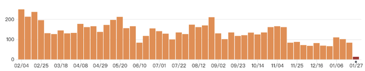
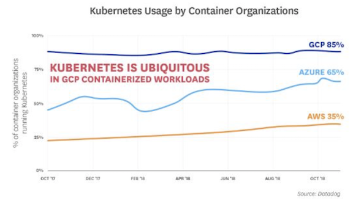

# Kubernetes 2018 年度简史

Kubernetes 在过去几年中一直是云计算领域最著名的开源项目之一。

2018 年，Kubernetes 度过了自己的 4 岁生日。从 2014 年开源，到如今成功从 CNCF 孵化，它已成为容器编排的事实标准。虽然 Kubernetes 还很年轻，但它正如初升的朝阳，在过去几年中一往直前，为组织设计和部署应用程序带来全新定义。本文将回顾 2018 年 Kubernetes 的发展情况，同时展望它在 2019 年的前行之路。

## 分布式计算的新时代

当容器于 2008 年首次推出时，虚拟机（VM）还是云提供商和内部数据中心寻求优化数据中心资产的最佳选择。

在那时，VM 确实提供了良好的灵活性，但它也存在一些缺陷，如每个 VM 都需要在整个层（管理程序）中模拟完全可操作的系统，并大幅占用物理 CPU 资源。即使采用 `Intel VT-x` 和 `AMD-V` 等技术，使用 VM 的性能也远不如裸机运行。

在这个背景下，容器技术通过在所有镜像中共享相同的内核来解决这些缺陷。**换句话说，来自不同镜像的流程可以在同一空间中运行，而内核负责保证它们之间的正确隔离，我们也可以设置限制镜像资源利用，对计算资源进行合理调配**。占用内存更少，又不存在硬件仿真层，因此容器一经提出就迅速走红。

但随着容器广泛进入生产领域，人们很快也意识到一个事实，就是尽管在同一台计算机上部署容器很容易，但它在高可用性管理、灾难恢复和可伸缩性方面仍存在不少问题，优秀的编排层才是在生产中大规模部署容器的必要前提。

这些问题催生了一种名为容器编排系统的新型软件，这种软件也在过去五年中得到了普及。它们负责进行集群操作，协调调度、内存分配、安全性和网络，目的是确保所有镜像按规定工作。

经过激烈竞争，最后，于 2014 年开源的 Kubernetes 力克 `Docker Swarm` 和 `Apache Mesos`，成了容器编排领域当之无愧的胜者。它背靠 Google 多年实践，实现了对即时部署、弹性伸缩、健康检查与高可用性（HA）系统的全部覆盖，能为生产完整生命周期保驾护航。

## Kubernetes 的 2018

### 自身不断发展

在刚开源的前两年，Kubernetes 只有五个主要版本。从 2017 年起，它相继推出 1.6、1.7、1.8、1.9，围绕稳定性、性能和平台的 cloud availability 做了改进。**而在 2018 年，Kubernetes 更进一步，又进行了 4 次重大更新，在企业最关注的安全性和可扩展性上做了显著改善：**

* 2018 年 3 月 27 日，Kubernetes v1.10 发布。此版本持续增强了 Kubernetes 的成熟性、可扩展性以及可插拔性，并在存储、安全、网络增强了其稳定性；
* 2018 年 6 月 28 日，Kubernetes v1.11 发布。此版本增强了网络功能、可扩展性与灵活性。**Kubernetes 1.11 功能的更新为任何基础架构、云或内部部署都能嵌入到 Kubernetes 系统中增添了更多可能性**；
* 2018 年 9 月 28 日，Kubernetes v1.12 发布。此版本新增了两个备受期待的功能，**Kubelet TLS Bootstrap 和对 Azure 虚拟机规模集支持（并已达到 GA 阶段）**。同时该版本在安全性和 Azure 等关键功能上作出了改进；
* 2018 年 12 月 4 日，Kubernetes v1.13 发布。此版本是迄今为止发布时间最短的版本之一。这一周期的三个主要特性已逐渐过渡到 GA。此版本中的显着特征包括：**使用 kubeadm 简化集群管理、Container Storage Interface（CSI）、以 CoreDNS 作为默认 DNS。**

功能方面，Kubernetes 在 1.10 版本中对接了 kubectl 凭证，从此云服务供应商、企业可以发布二进制插件以处理特定云供应商 IAM 服务的身价验证，可扩展性更强。

在 1.13 版本中，CoreDNS 被声明为通过所有规模/资源使用测试的默认集群 DNS。**`CoreDNS` 解决了 `kube-dns` 存在的安全性和扩展性问题，把 Service 放在一个容器中完成，并用不同插件来复制（并增强）kube-dns 功能，为 Kubernetes 在网络安全方面的长期发展铺好了路。**

### 社区日渐繁荣

CNCF 是一个随容器编排和微服务发展起来的新一代基金会，它的设立初衷是在开源社区基础上对现代分布式系统环境进行不断优化。而在 Google 把 Kubernetes 捐献给它后，CNCF 就把管理、支持 Kubernetes 推广发展作为自己的使命。

**2018 年，作为 Kubernetes 最强大的支持者，CNCF 为繁荣社区做了许多事，其中又以 3 个孵化项目的成功毕业最为典型：**

* 2018 年 3 月 7 日，CNCF 宣布 Kubernetes 正式毕业；
* 2018 年 8 月 9 日， Prometheus 成为继 Kubernetes 之后的第二个毕业项目；
* 2018 年 11 月 28 日，CNCF 宣布 Envoy 成功毕业。

而在不久前刚举办的云容器领域最大的峰会之一 KubeCon + CloudNativeCon North America 2018 上，基金会宣布接受 etcd 分布式键值存储作为孵化项目，发挥它在 Kubernetes 集群管理软件设计中的重要作用；2019 年 1 月 24 日，CNCF 宣布 CoreDNS 毕业，为新一年 Kubernetes 的蓬勃发展打响第一炮。

在 GitHub 上，由于 Kubernetes 在稳定性和成熟性上已经上升到一个新高度，这一年提交数量有所降低，但 Kubernetes 的代码行数还在保持持续增长，且已突破 200 万大关。
尽管谷歌这些年来是 Kubernetes 的主要贡献者，但现在其他技术人员在这个项目上的贡献量已经几乎和谷歌持平了。此外，包括 IBM、Microsoft 等主要云提供商在内的 600 余个组织也为社区发展提供了的重要支持。在国内，华为、才云等组织和机构的贡献也名列前茅。

在 Kubernetes 代码库中导出的 API 端点数量已经稳定在 16,000，这也从侧面印证了 Kubernetes 的成熟度和复杂性水平。

### 企业踊跃支持

Kubernetes 所处的时间点是传统和现代软件开发日益高流量的交叉点。根据 CNCF 统计数据，2018 年，云原生技术增长了 200％，全球有近三分之一的企业正在运营多达 50 个容器，运营 50 至 249 个容器地企业占比也超过 25%，有超过 80％ 的受访者把 Kubernetes 作为容器管理的首选。

数据都在说明这样一个事实：谁掌握了 Kubernetes，谁就能进一步扩大在云计算市场的竞争力，在风云诡谲的市场上抢占先机。结合这个背景，2018 年同样也是谷歌、亚马逊、微软等大型云提供商围绕 Kubernetes 奋勇争先的一年：

* 1 月，红帽收购 CoreOS，扩大其 Kubernetes 和容器的领导地位；
* 2 月，Pivotal 与 VMware 联合开发的企业级容器平台 Pivotal Container Service 1.0（简称 PKS），使运营商能够大规模运营 Kubernetes；
* 5 月，微软宣布扩大与红帽的合作关系，在 Azure 上提供全托管的 OpenShift，使开发人员能够在 Azure 和本地运行基于容器的应用程序；
* 6 月，微软宣布 Azure Kubernetes 服务（AKS）可用。 通过 AKS，用户可以部署和管理他们用于生产的 Kubernetes 应用程序；
* 6 月，亚马逊 EKS 可用。 Amazon EKS 简化了构建、保护、操作和维护 Kubernetes 集群的过程，对企业充分利用基于容器的云计算优势进行简化；
* 8 月，Google 将 Kubernetes 的云资源控制权移交给 CNCF 社区，并且承诺会在三年内提供价值约 900 万美元的支持；
* 10 月，IBM 斥资 340 亿美元收购 Red Hat，这是开源领域金额最大的一笔收购，也标志着 IBM 将更强势介入云计算市场，介入 Kubernetes 竞争；
* 11 月，VMware 用 5.5 亿美元收购 Heptio，借 Kubernetes 加强其在云原生态系统中的角色。

这些举动都在表明云计算市场的战火将继续蔓延，Kubernetes 已经成为兵家必争之地。**而根据招聘网站 Dice 的报告，2018 年，Kubernetes 也是最受互联网公司青睐的 IT 技能之一，发展前景不可估量。**

### Kubernetes 和 AI 的结合 

这两年，AI 发展得如火如荼，越来越多的企业正在寻求把它用于降低成本和业务创新，同时结合大数据实现企业整体的数字化升级。但再强的算法也需强大的架构和工程作为支撑。

从开发到测试再到生产，容器为流程运行提供了紧凑的环境，它们易于扩展，能将大型完整应用程序分解为有针对性、易于维护的微服务，完美契合 AI 应用开发的各个阶段。**因此，Kubernetes 和 AI 的结合也被业界视为大势所趋。**

但是，AI 在产品化过程中仍会遇到部署复杂、指令繁冗等种种问题。为了解决这些问题，智能且易于操作的 Kubeflow 应运而生。它可以使机器学习的工作负载分布在多个节点上，极大提高开发人员的工作效率，让 Kubernetes 上的机器学习、深度学习堆栈变得简单、快速、可扩展。

2018 年 11 月 8 日，Google Cloud 宣布推出 Kubeflow Pipelines。它部分基于并利用来自 TensorFlow Extended 的库，允许开发人员利用该工作并将其投入生产，促进了企业内部协作，并进一步实现了访问民主化。

近日，英特尔推出 Kubernetes-Native 深度学习平台 Nauta，这是一个企业级堆栈，适用于需要运行 DL 的工作负载，训练那些将在生产中部署的模型。用户可以在单个或多个工作节点上使用 Kubernetes 定义，安排容器化深度学习实验，并检查这些实验的状态和结果。

	“Kubeflow 在简易化 Kubernetes 上配置和生产化机器学习工作负载上取得了重大进步，我们认为这会极大程度上让更多企业接受该平台。” 
	
	—— Reza Shafii，CoreOS 产品副总裁
	
新的一年，Kubernetes 和 AI 在融合之路上还有很长的一段路需要走，而除了简化整个流程，它们仍将面临在带宽上做出更多突破。

## Kubernetes 尚有不足

然而，随着 Kubernetes 被更广泛采用，企业在容器部署中仍面临挑战，这涉及从安全性到复杂性再到可扩展性的各个方面。

### 可扩展性

**可扩展性包括两部分：基础架构的可扩展性和 API 的可扩展性。**

谈到它，首先我们要理解一个概念：微服务。微服务是一项在云中部署应用和服务的技术，它允许公司将其应用程序分解为更小的专用代码包，根据需要进行独立调整和更新。虽然可用性很强，但与之俱来的是网络复杂性，企业难以管理用于构建应用程序的微服务之间的流量，也难以提高这些应用程序执行方式的安全性和可视性。

为了解决这个问题，现在许多供应商开始纷纷采用谷歌、IBM 和 Lyft 开发的开源项目 Istio，以帮助改进云原生网络。 

### 复杂性 

近日，Nirmata （一家增强企业 DevOps 能力的容器初创公司）的一项研究显示，虽然 Kubernetes 未来可期，但它的复杂性已经成为项目继续发展的一个不可忽视的障碍。根据他们的调查报告，有超过 50% 的开发人员表示曾因 Kubernetes 的复杂操作有过不同程度的困扰。

对简单小型业务来说，Kubernetes 的体量太大了，不如直接用 shell 脚本来得高效直接。因此如果 Kubernetes 想要取得真正的成功，它还要在轻量级和化繁为简上做出更多努力。

### 安全性

同样的，安全性问题也不容小觑。去年，Kubernetes 出现的严重安全漏洞，攻击者可以利用该漏洞通过 Kubernetes API 服务器连接到后端服务器，利用 API 服务器的 TLS 凭证进行身份验证并发送任意请求，从企业防火墙内破坏应用和服务。

而同样是 2018 年，包括特斯拉、Weight Watchers 在内的多家公司也曾遭受 Kubernetes 环境的攻击，原因是他们把 Kubernetes 仪表板打开并暴露在互联网上。这些事故无疑会打击企业对 Kubernetes 的信心。

Kubernetes 的安全性问题是多维度的。**一方面，对于一个运行在 Kubernetes 上的普通应用，真正业务代码只占 0.1%，不同的组件都可能存在不同的安全隐患；另一方面，企业的广泛使用和网络安全意识缺失也加剧了问题的严重性。**

可喜的是，随着问题的暴露，社区中围绕 Kubernetes 安全的技术项目（如 Notary、TUF 以及谷歌 gVisor）在日益增多，开发者们也正积极地针对漏洞进行补丁和建议。

## 2019 年预测

随着越来越多的公司将 Kubernetes 视为转向现代化 IT 企业的路标，再结合 2018 年的发展情况，新的一年，我们可以对 Kubernetes 有以下展望：

* 2019 年，Kubernetes 将完成其作为首选、协调的主导地位；
* Kubernetes 与大数据的结合将是一种趋势；
* Kubernetes 快速变化的脚步不会停滞；
* Kubernetes 安全性或将成为焦点；
* IT 领导者将对他们的 Kubernetes 平台更加挑剔。

