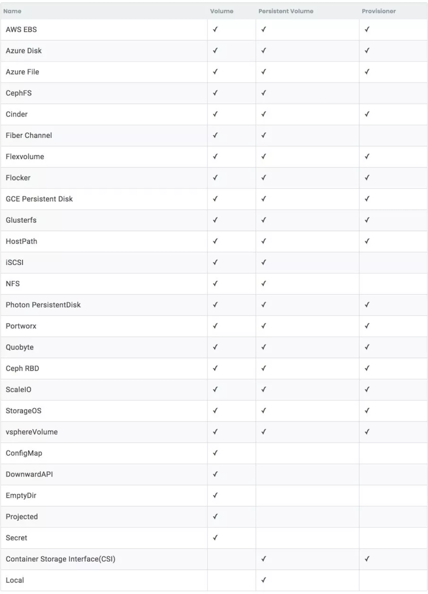

# 深入浅出聊聊Kubernetes存储（二）：搞定持久化存储

## 简单回顾一下：

* `PV`在最一开始是设计成了一个需要管理员预先分配的存储块。**引入`Storage Class`和`Provisioner`之后，用户可以动态地供应`PV`。**
* `PVC`是对`PV`的请求，**当和`Storage Class`一起使用时，它将触发与相匹配PV的动态供应。**
* `PV`和`PVC`总是一一对应的。
* **`Provisioner`是给用户提供`PV`的插件。它可以把管理员从为持久化创建工作负载的繁重角色中解脱出来。**
* `Storage Class`是`PV`的分类器。相同的`Storage Class`中的`PV`可以共享一些属性。**在大多数情况下，`Storage Class`和`Provisioner`一起使用时，可以把它当作具有预定义属性的`Provisioner`。** 因此，当用户请求它时，它能够用这些预定义的属性动态地提供PV。

不过上述这些只是在Kubernetes中使用持久化存储的其中一种方法而已

## Volume

在前一篇文章中，我们提到`Kubernetes`中还有一个卷（`Volume`）的概念。为了把`Volume`和持久卷（`Persistent Volume`）区分开，大家有时会称它为`In-line Volume`或者`Ephemeral Volume`。

这里我们引用Volume的定义：

**`Kubernetes Volume`…有一个显式的生命周期**——这和包含它的pod的生命周期相同。因此，`Volume`的生命周期比在`pod`中运行的任何容器都长，并且在容器重启的时候会保存数据。当然，当`Pod`终止时，`Volume`也将终止。更重要的是，`Kubernetes`支持多种类型的`Volume`，一个`pod`中也可以同时使用任何数量的`Volume`。

在其核心部分，Volume只是一个目录，可能其中包含了一些数据，这些数据可由pod中的容器访问。这些目录是如何产生的、支持它的介质、以及它的内容都是由所使用的特定volume的类型决定的。

#### `Volume`一个重要属性是，它与所属的`pod`具有相同的生命周期。如果pod消失了，它也会消失。

这与`Persistent Volume`不同，因为`Persistent Volume`将继续存在于系统中，直到用户删除它。`Volume`还可以在同一个`pod`中的容器间共享数据，不过这不是主要的用例，因为通常情况下用户只会在每个`pod`中使用一个容器。


#### 因此，这更可以把`Volume`看作是`pod的`属性而不是一个独立的对象。

正如它的定义所说，`Volume`表示`pod`中的目录，而`Volume`的类型定义了目录中的内容。例如，`Config Map Volume`类型将会在`Volume`目录中从`API`服务器创建配置文件；`PVC Volume`类型将从目录中相应的`PV`里挂在文件系统等等。实际上，**`Volume`几乎是在`pod`中本地使用存储的唯一方法。**

#### `Volume`、`Persistent Volume`和`持久卷声明（Persistent Volume Claim）`之间很容易弄混淆。假设有一个数据流，它是这样`PV->PVC->Volume`。`PV`包含了真实数据，绑定到`PVC`上，最终变成`pod`中的`Volume`。

```
PV->PVC->Volume
```

然而，除了PVC，Volume还可以由Kubernetes直接支持的各种类型的存储库支持，从这个意义上来说，Volume的定义也挺令人困惑的。

我们需要知道的事，我们已经有了Persistent Volume，它支持不同类型的存储解决方案。我们还有Provisioner，它支持类似（并不完全相同）的解决方案。而且我们还有不同类型的Volume。

## 持久化数据的多种方式

#### 以AWS EBS为例。让我们来细数Kubernetes中的持久化数据方式吧。

### Volume方式

`awsElasticBlockStore`是一个`Volume`类型。

你可以创建一个`Pod`，定义一个`awsElasticBlockStore`类型的`volume`，设置好`volumeID`，接着使用`pod`中存在的`EBS volume`。

**该`EBS volume`在直接和`Volume`使用前必须已经存在。**

### PV方式

`AWSElasticBlockStore`还是一个PV类型。

所以你可以创建一个`PV`，用它来表示`EBS volume`（假设你有这样的权限），然后创建一个和它绑定的`PVC`卷。最后，令`PVC`作为`volume`，然后就可以在`pod`中使用它了。

和Volume方法类似，`EBS volume`在创建`PV`之前就必须存在。

### Provisioner方式

`kubernetes.io/aws-ebs`是一个`Kubernetes`中用于`EBS`的内置`Provisioner`。

**你可以用`Provisioner kubernetes.io/aws-ebs`来创建一个`Storage Class`，通过`Storage Class`创建`PVC`。`Kubernetes`会自动为你创建相对应的`PV`。** 接下来指定PVC为volume就可以在pod中使用了。


#### 在本用例中，你不需要在使用使用之前创建`EBS`，`EBS Provisioner`会为你创建的。

### 第三方方式

上面列出的都是`Kubernetes`内置选项，如果你不太满意的话，其实还有一些使用`Flexvolume driver`格式的第三方EBS实现，它们可以帮助你和`Kubernetes`连接起来。

如果Flexvolume不适合你，还可以使用具备同样功能的CSI drivers（为什么这么说？稍后会对此进行详细介绍）

### `VolumeClaimTemplate`方式

**如果你在使用`StatefulSet`，那么恭喜你！你现在有额外多了一种使用工作负载中EBS的方式——`VolumeClaimTemple`。**


#### `VolumeClaimTemple`是`StatefulSet`规范属性，它为`StatefulSet`所创建的`Pod`提供了创建匹配`PV`和`PVC`的方式。

这些`PVC`将通过`Storage Class`创建，这样当`StatefulSet`扩展时就可以自动创建它们。

当S`tatefulSet`缩小时，多余的`PV/PVCs`会保留在系统中。因此，当`StatefulSet`再一次扩展时，它们会再次作用于`Kubernetes`创建的新`pods`中。稍后我们会详细讲`StatefulSet`。

1. 举个例子说明，假设你用`replica 3`创建了一个名为`www`的`StatefulSet`，并用它创建了名为data的`VolumeClaimTemplate。
2. `Kubernetes`会创建3个pods，分别起名`www-0`、`www-1`、`www-2`。
3. `Kubernetes`还会创建`PVC`，其中`www-data-0用`于`pod www-0`，`www-data-1`给`www-1`，`www-data-2`给`www-2`。
4. 如果你把`StatefulSet`扩展到`5`，Kubernetes就会分别创建`www-3`、`www-data-3`、`www-4`、`www-data-4`。
5. 如果接着将`StatefulSet`降为`1`，`www-1`到`www-4`全都会删除，**而`www-data-1`到`www-data-4`会保留在系统中。**
6. 因此当你决定再次扩展到`5`的时候，`pod www-1`到`www-4`又回被创建出来，而`PVC www-data-1`仍然会服务于`Pod www-1`，`www-data-2`对应`www-2`，以此类推。
7. 这是因为`StatefulSet`中`pod`的身份在是`stable`的。使用StatefulSet时，名称和关系都是可以预测的。


`VolumeClaimTemple`对于像`EBS`和`Longhorn`这样的块存储解决方案非常重要。因为这些解决方案本质上是`ReadWriteOnce`，你不能在`Pod`之间共享它们。如果你有不止一个运行了持久化数据的`pod`，那么就无法顺利地进行部署。

#### 因此，`VolumeClaimTemplate`的出现为块存储解决方案提供了一种水平扩展`Kubernetes`工作负载的方式。


### 如何在Volume、Persistent Volume和Provisioner之间做出选择

正如你所看到的，现在有了内置的`Volume`类型、`PV`类型、`Provisioner`类型、以及使用`Flexvolume`和/或`CSI`的外部插件。让人比较头大的是，它们之间提供的功能基本相同，不过也有略微的区别。


所以我翻遍了代码和文档，画出了下面的比较表格，以及对我来说最有意义的准则，从`Volume`、`Persistent Volume`和`Provisioner`几个方面进行对比。

 

这里我只涉及到Kubernetes中in-tree所支持的，除此之外一些官方的out-of-tree的Provisioners：

[https://github.com/kubernetes-incubator/external-storage](https://github.com/kubernetes-incubator/external-storage)


可以看到，Volume、Persistent Volume以及Provisioner在一些细微的地方还是不一样的。

#### 1.Volume支持大部分的volume插件。

* 它是连接`PVC`和`pod`的唯一方法
* **它也是唯一一个支持`Config Map`、`Secret`、`Downward API`以及`Projected`的。这些所有都与`Kubernetes API`服务器密切相关。**
* 它还是唯一一个支持EmptyDir的，EmptyDir可以自动给pod分配和清理临时volume。


```
volumes:
	- name: data-volume
	  emptyDir: {}
```

#### 2. PV支持的插件是`Provisioner`支持的超集，因为`Provisioner`需要在工作负载使用它之前创建PV。但是，还有一些`PV`支持而`Provisioner`不支持的插件，比如`Local Volume`（正在进行修改中）。

#### 3.还有两种类型Volume是不支持的。他们是两个最新的特性：CSI和Local Volume，现在还有一些正在进行的工作，会在之后把它们用于Volume。

## 在Volume、Persistent Volume和Provisioner之间选择的准则


在我看来，用户们应该坚持一个原则：

**在条件允许的情况下，选择`Provisioner`而不是`Persistent Volume`，接着再是`Volume`。**

#### Provisioner(storageclass) > Persistent Volume > Volume

### 详细来说：

* **对于`Config Map`、`Downward API`、`Secret`或者`Projected`，请使用`Volume`，因为PV不支持它们。**
* 对于`EmptyDir`，直接使用`Volume`，或者使用`Host Path`来代替。
* 对于`Host Path`，通常是直接使用`Volume`，因为它绑定到一个特定的节点，并且节点之间它是同构的。
* 如果你想用异构的`Host Path Volume`，它在`Kubernetes v1.11`版之后才能使用，因为之前缺少对PV的节点亲和知识，使用v1.11+版本，你可以使用我的Local Path Provisioner创建带有节点亲和的Host Path PV：[https://github.com/rancher/local-path-provisioner](https://github.com/rancher/local-path-provisioner)。
* 对于其他的情况，除非你需要和现有的卷挂钩（这种情况下你应该使用PV），否则就使用`Provisioner`代替。有些`Provisioner`并不是内置的选项，但是你应该能在此链接（[https://github.com/kubernetes-incubator/external-storage](https://github.com/kubernetes-incubator/external-storage)）或者供应商的官方仓库中找到它们。

这个准则背后的原理很简单。在Kubernetes内部进行操作时，对象（PV）比属性（Volume）更容易管理，而且和手动创建PV相比，自动创建PV容易得多（Provisioner）。

不过这里有一个例外：如果你喜欢在Kubernetes外面进行存储，那么最好使用Volume，尽管使用这种方式需要用到另一组API进行创建/删除。此外，由于缺少`VolumeClaimTemplate`，会失去使用`StatefulSet`自动伸缩的能力。我不认为这是多数`Kubernetes`用户会选择的方式。


