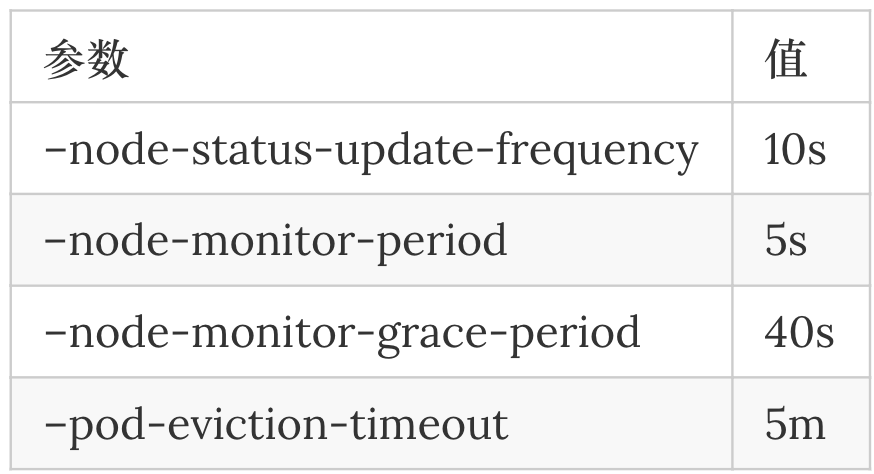
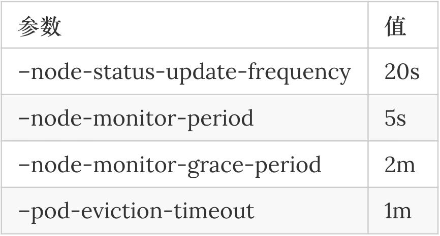
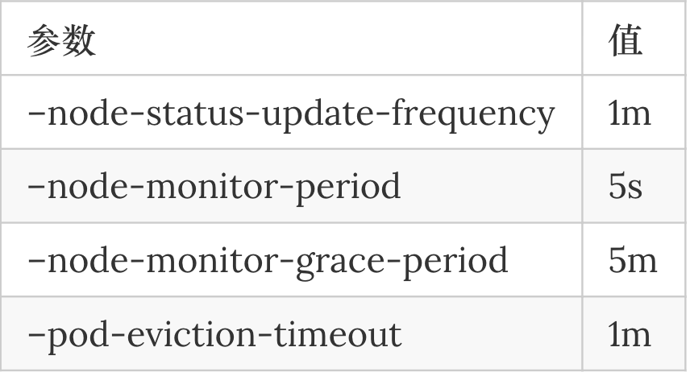

# Kubelet 状态更新机制

当 `Kubernetes` 中 Node 节点出现状态异常的情况下，节点上的 `Pod` 会被重新调度到其他节点上去，但是有的时候我们会发现节点 `Dow`n 掉以后，`Pod` 并不会立即触发重新调度，这实际上就是和 `Kubelet` 的状态更新机制密切相关的，`Kubernetes` 提供了一些参数配置来触发重新调度到，下面我们来分析下 Kubelet 状态更新的基本流程。

1. `kubelet` 自身会定期更新状态到 `apiserver`，**通过参数`--node-status-update-frequency`指定上报频率**，默认是 `10s` 上报一次。
2. `kube-controller-manager` 会每隔`--node-monitor-period`时间去检查 `kubelet` 的状态，默认是 `5s`。
3. 当 `node` 失联一段时间后，`kubernetes` 判定 `node` 为 `notready` 状态，这段时长通过`--node-monitor-grace-period`参数配置，默认 `40s`。
4. 当 node 失联一段时间后，`kubernetes` 判定 `node` 为 `unhealthy `状态，这段时长通过`--node-startup-grace-period`参数配置，默认 `1m0s`。
5. 当 `node` 失联一段时间后，`kubernetes` 开始删除原 `node` 上的 `pod`，这段时长是通过`--pod-eviction-timeout`参数配置，默认 `5m0s`。

```
kubelet   ===>  自身会定期更新状态 s--node-status-update-frequency=10s  ===> apiserver
```

```
kube-controller-manager  ===>  定期检查 --node-monitor-period=5s  ===> kubelet
```

### 当 node 失联一段时间后:

```
notready  ===>  --node-monitor-grace-period  = 40s
unhealthy  ===>  --node-startup-grace-period = 1m0s
删除原 node 上的 pod => --pod-eviction-timeout = 5m0s
```

> **`kube-controller-manager` 和 `kubelet` 是异步工作的，这意味着延迟可能包括任何的网络延迟、`apiserver` 的延迟、`etcd `延迟，一个节点上的负载引起的延迟等等。因此，如果`--node-status-update-frequency`设置为`5s`，那么实际上 `etcd` 中的数据变化会需要 `6-7s`，甚至更长时间。**


`Kubelet`在更新状态失败时，会进行`nodeStatusUpdateRetry`次重试，默认为 `5` 次。

`Kubelet` 会在函数 `tryUpdateNodeStatus`中尝试进行状态更新。

**`Kubelet` 使用了 `Golang` 中的`http.Client()`方法，但是没有指定超时时间，因此，如果 `API Server` 过载时，当建立 `TCP` 连接时可能会出现一些故障。**


因此，在`nodeStatusUpdateRetry * --node-status-update-frequency`时间后才会更新一次节点状态。

同时，`Kubernetes` 的 `controller manager` 将尝试每`--node-monitor-period`时间周期内检查`nodeStatusUpdateRetry`次。在`--node-monitor-grace-period`之后，会认为节点 `unhealthy`，然后会在`--pod-eviction-timeout`后删除 `Pod`。


**`kube proxy` 有一个 `watcher API`，一旦 `Pod` 被驱逐了，`kube proxy` 将会通知更新节点的 `iptables` 规则，将 `Pod` 从 `Service` 的 `Endpoints` 中移除，这样就不会访问到来自故障节点的 Pod 了。**

## 配置

对于这些参数的配置，需要根据不通的集群规模场景来进行配置。

### 社区默认的配置



### 快速更新和快速响应


在这种情况下，`Pod` 将在 `50s` 被驱逐，因为该节点在 `20s` 后被视为`Down`掉了，`--pod-eviction-timeout`在 `30s` 之后发生，但是，这种情况会给 `etcd` 产生很大的开销，因为每个节点都会尝试每 `2s` 更新一次状态。

**如果环境有1000个节点，那么每分钟将有15000次节点更新操作，这可能需要大型 `etcd` 容器甚至是 `etcd` 的专用节点。**

> 如果我们计算尝试次数，则除法将给出5，但实际上每次尝试的 nodeStatusUpdateRetry 尝试将从3到5。 由于所有组件的延迟，尝试总次数将在15到25之间变化。

### 中等更新和平均响应



这种场景下会 `20s` 更新一次 `node` 状态，`controller manager` 认为 `node` 状态不正常之前，会有 `2m*60⁄20*5=30`次的 node 状态更新，Node 状态为 `down `之后 `1m`，就会触发驱逐操作。

如果有 `1000` 个节点，1分钟之内就会有 `60s/20s*1000=3000` 次的节点状态更新操作。


### 低更新和慢响应



**Kubelet 将会 `1m` 更新一次节点的状态，在认为不健康之后会有 `5m/1m*5=25` 次重试更新的机会。**`Node`为不健康的时候，`1m` 之后 `pod`开始被驱逐。

可以有不同的组合，例如快速更新和慢反应以满足特定情况。

原文链接: [https://github.com/kubernetes-sigs/kubespray/blob/master/docs/kubernetes-reliability.md](https://github.com/kubernetes-sigs/kubespray/blob/master/docs/kubernetes-reliability.md)
