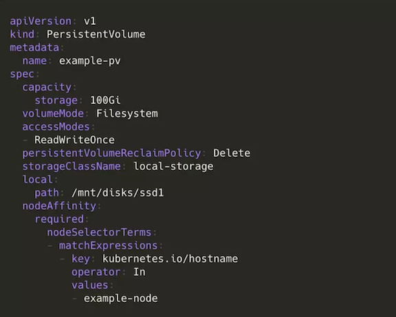
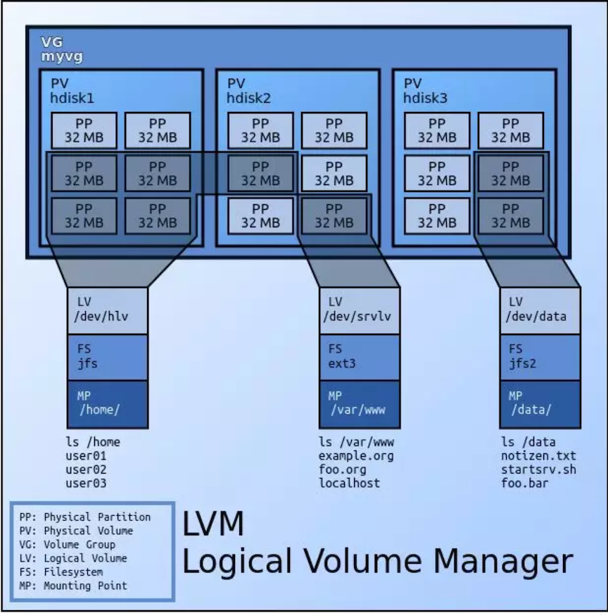
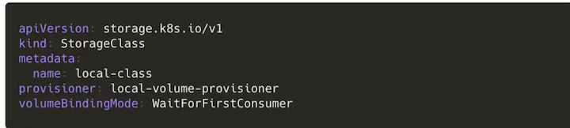
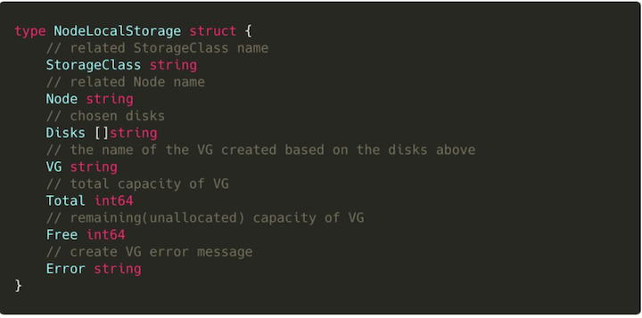
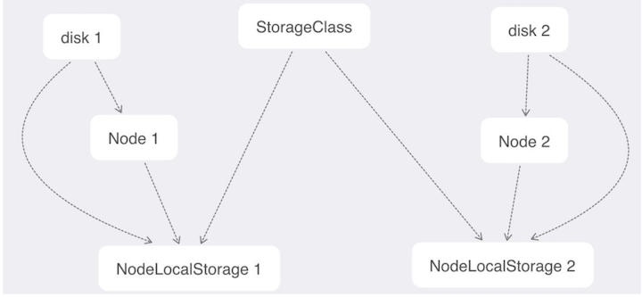
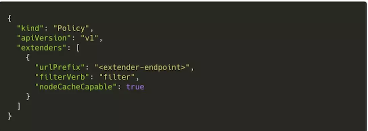
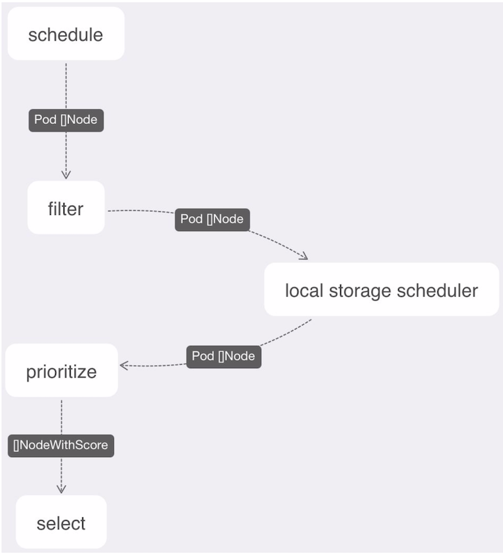

# 在 `Kubernetes v1.14` 中，如何动态配置本地存储？

在企业 IT 架构转型的过程中，存储一直是个不可避免的大问题。

Kubernetes 中使用节点的本地存储资源有 `emptyDir`、`hostPath`、`Local PV` 等几种方式。这之中，**`emptyDir` 无法持久化数据，`hostPath` 方式需要手动管理卷的生命周期，** 运维压力大。

**因此在某些场景下，如果用户出于性能和运维成本考虑需要使用本地存储，`Local PV` 似乎是唯一选择。**

## 什么是 Local PV？

所谓 Local PV（本地持久化存储），**指的就是利用机器上的磁盘来存放业务需要持久化的数据**，和远端存储类似，此时数据依然独立于 Pod 的生命周期，即使业务 `Pod` 被删除，数据也不会丢失。

**同时，和远端存储相比，本地存储可以避免网络 IO 开销，拥有更高的读写性能，所以分布式文件系统和分布式数据库这类对 `IO` 要求很高的应用非常适合本地存储。**

## 设计方案

在具体介绍如何动态配置本地存储前，我们先来介绍一下 `Kubernetes` 上游对于 `Local PV` 的一些支持情况：

* Kubernetes v1.7： 正式引入 Local PV；
* Kubernetes v1.10： Local PV 进入 Beta；
* Kubernetes v1.14： Local PV 进入 GA。

在今年 3 月发布的 Kubernetes v1.14 中，社区对此的评价是：

> 出于性能和成本考量，分布式文件系统和数据库一直是 Local PV 的主要用例。相比云服务供应商，本地 SSD 提供的性能远比远程磁盘优秀；而相比裸机，除了性能，本地存储通常更便宜，并且使用它是配置分布式文件系统的必要条件。

目前，`Local PV` 的本地持久存储允许我们直接使用**节点上的一块磁盘、一个分区或者一个目录作为持久卷的存储后端**，**但暂时还不提供动态配置支持，也就是说：你得先把 `PV` 准备好**。

**不同于其他类型的存储，本地存储强依赖于节点。** 换言之，它在调度 `Pod` 的时候还要考虑到这些 `Local PV` 对容量和拓扑域的要求。

这里我先介绍一下**延迟绑定机制**和 **`volume topology-aware scheduling`**。

* 延迟绑定机制可以让 `PVC` 的绑定推迟到有 `Pod` 使用它并且完成调度后，
* 而 `volume topology-aware scheduling` 则可以让 `Kubernetes `的调度器知道卷的拓扑约束，也就是这个存储卷只能在特定的区域或节点上使用（访问），让调度器在调度 `Pod` 的时候必须考虑这一限制条件。

在介绍了这些背景之后，我们来看一个使用本地存储的 PV 示例：

其他内容和一个普通 PV 无异，**只是多了一个 `nodeAffinity`。**

这个字段的值使得 `Kubernetes` 调度器能够把使用这个 `PV` 的 `Pod` 调度到正确的 `Node` 上。

对于本地存储的动态配置，除了实现最基础的根据 `StorageClass` 和 `PVC` 动态创建 `Persistent Volume` 外，它**还要让 `Kubernetes` 的调度器能够感知本地存储节点的剩余容量，选择存储量足够大的节点，**能够将使用本地存储的 `Pod` 调度到正确的拓扑域上，例如上面例子中的一个节点或者一个特定的区域。

为了方便对本地存储节点的磁盘进行管理，本地存储功能的底层选择使用 `LVM` 来实现。**`LVM` 是 `Linux` 环境下对磁盘分区进行管理的一种机制，是建立在硬盘和分区之上的一个逻辑层，具有很高的灵活性**。下面是 `LVM` 架构的一个示意图：

而为了让 `Kubernetes` 的调度器能够感知本地存储节点的剩余容量，我们选择使用 `Kubernetes Scheduler Extender`，使用一个 `webhook` 来扩展原生调度器的功能，这种方法实现起来简单、易于维护和使用且无侵入性，不修改源代码。

**所以整个组件由两部分组成：**

* **一个是 `LVM Manager`，它以 `DaemonSet` 的形式运行，负责管理每个节点上的磁盘，汇报节点磁盘的容量和剩余容量，动态创建 `PV` 等**；
* **另一个是个 `local storage scheduler` 调度模块，负责为使用本地存储的 `Pod` 选择合适（有足够容量）的节点**。

**`StorageClass` 需要设置 `provisioner` 字段的值为我们自定义的 `local-volume-provisioner` 之类的，表示需要动态创建 `Persistent Volume`：**

创建 `StorageClass` 时需要选择的节点和磁盘等信息会先记录在 `parameters` 中，数据结构定义如下（JSON 格式化成普通字符串后存储在 `parameters` 中）：

然后 `LVM Manager` 会根据这个信息在对应的节点上将选择的磁盘合并成一个 `LVM` 的卷组`（VG）`，方便后续管理。

考虑到可扩展性，**和 `StorageClass`、`Node` 关联的磁盘、VG 等信息会记录在一个新增的自定义资源（Custom Resources，以下简称 CR）里面**，而不是直接将信息记录在对应的 `StorageClass` 和 `Node` 的 `annotation` 中。原因如下：

* 其一，我们需要**自定义的结构化数据；**
* 其二，我们把本地存储作为一种扩展资源。它**区别于 `CPU` 和内存，包含了类型、节点和磁盘等众多属性，并且一个节点可以关联多个本地存储资源。**

一组 `StorageClass`、`Node` 和磁盘信息就有一条记录，新的 `CR` 的定义如下（注意，以下结构只是为了方便说明和阅读，并不是 `Kubernetes` 推荐的标准结构）：

关系示意图如下：

* 几乎所有和 `LVM` 相关的操作都只需要监听和更新这一个对象。
* `LVM Manager` 监听这个对象，在需要的 `Node` 上动态创建 `VG` 并定时更新这个对象中的 `VG` 的容量和剩余容量等；
* `Scheduler` 根据这个对象上的容量信息辅助调度。

**然后对于 `local storage scheduler` 模块**，

* 首先我们要配置 `Kubernetes Scheduler`，为其增加一个 `extender`，
* 使其在进行 `node filter` 的时候会访问我们的 `local storage scheduler webhook` 以达到我们想要的对节点进行二次筛选的效果。

下面是一个配置的示例：

下面有一个增加了 `scheduler extender` 之后的调度流程示例：

最后，我再总结一下整个动态配置的正常流程：

* 创建 `StorageClass` 并配置想要选择的节点和对应的磁盘等信息；
* `LVM Manager` 为对应的节点创建 `VG`；
* `LVM Manager` 同时需要负责定期上报 `VG` 的容量信息；
* 创建 `PVC` 和使用它的 `Pod`；
* `Kubernetes` 调度器为 `Pod` 选择合适的节点，然后访问 `Extender webhook`；
* **`local storage scheduler` 对选择的节点根据容量条件进行二次过滤；**
* `Kubernetes` 调度器最后再选中一个节点，并且把该节点名称也存储到 `PVC` 的 **`volume.kubernetes.io/selected-node annotation`** 中；
* `dynamic provisioner` 介入，根据 `PVC` 的 **`volume.kubernetes.io/selected-node annotation`** 的值，在这个节点上根据 `PVC` 的要求创建一个 `LVM` 的逻辑卷`（LV）`，再创建对应的 `PV`；
* `volume` 绑定完成，`Pod` 和 `Node` 绑定，调度完成。

## 结语

**动态本地存储涉及多个组件的交互，异常处理尤为重要。**

例如，若 `NodeLocalStorage` 对象的容量信息没有及时更新，导致选中的节点其实没有剩余容量了，那么相应的 `LVM` 的逻辑卷`（LV）`也创建不出来，`provisioning` 失败。

这时，`local-storage-provisioner` 就要将 `PVC` 的 **`volume.kubernetes.io/selected-node annotation`** 清空，接下来 `Kubernetes Scheduler` 会重新调度。

