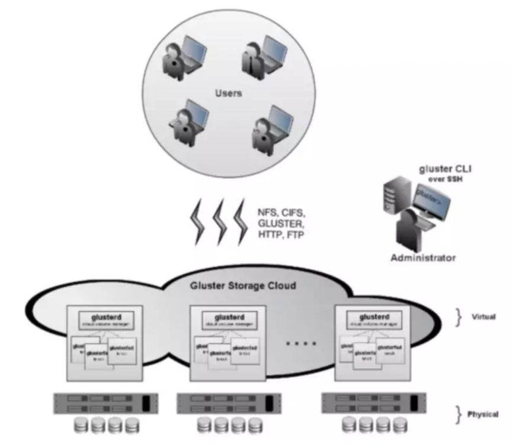
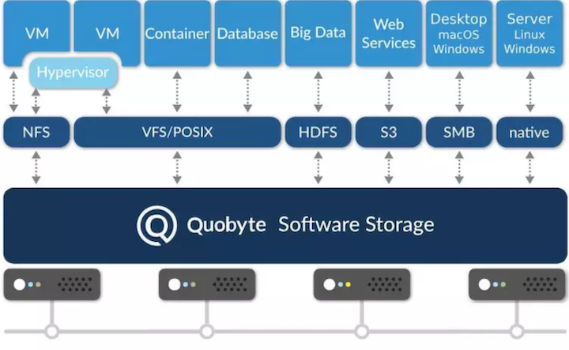

# K8s 的软件定义存储解决方案(Software-Defined Storage:GlusterFS/ScaleIO/Quobyte)


随着 Kubernetes 的迅速发展，容器存储正变得日益成熟，其地位也越来越重要。从产品角度来看，存**储分为`本地存储`、`网络存储`、`存储局域网`和`软件定义存储`四大类**。今天，我们就详细了解一下，软件定义存储的那些事儿。

根据 `Gartner`（全球第一家信息技术研究和分析公司）的分析数据显示，到 2020 年，全球 50％ 的企业将在生产环境中使用容器。到那时，**在企业中将有超过 20％ 的存储容量被分配给容器使用（而今只有 1％）**。

然而，迁移到容器会对存储的配置带来新的挑战。特别是，对分布式容器化工作负载使用传统存储解决方案将变得过于复杂和昂贵。**传统存储解决方案主要有如下问题**：

* **对于绝大多数操作系统，服务器可以添加的存储卷的数量是有限的**。例如，**基于 `AWS Linux` 的实例会限制最多添加 40 个存储卷。添加更多存储卷可能导致系统启动失败。**容器技术是可以实现在单个主机上运行数百个容器的，但这些容器加起来需要的存储卷可能超过 OS 的限制。因此，容器用户需要一种更灵活的方法来支持存储的虚拟化和池化；

* **容器会不断的创建、销毁并在 Node 之间迁移，所以容器的动态本质决定了它们需要动态存储。**  因此，在容器中运行的那些有状态的应用程序需要一个存储解决方案，使它们可以自动 `attach` 或 `detach` 存储，保证及时有效地在容器所在的可用区中配置新的存储，**并定期创建数据的备份和副本以确保高可用性（HA）**。手动配置存储无法有效地满足这些要求，即使可以，也需要额外的 Ops 和管理员；

* **分布式系统中存储的多样性和异构性决定了需要把存储硬件做一层软件抽象**。容器可能使用多种存储方案，包括 HDD、SSD、块存储或对象存储等。此外，云供应商提供的可供容器使用的存储和卷的类型是不同的。所以，**大规模运行云原生应用程序需要一个额外的抽象层，它可以抽象出各种存储类型，并将它们作为单个资源池供应用程序使用。**

毫无疑问，解决上面列出的挑战需要一个针对容器做了优化的云原生存储解决方案。它应该是灵活的，与硬件无关的，可扩展的，并且可以紧密集成到流行的容器编排框架中，例如 `Google Kubernetes`、`Docker Swarm` 或 `Apache Mesos`。 这就引出了软件定义存储（`SDS`）的概念。

## 什么是软件定义存储（Software-Defined Storage）?


简而言之，**软件定义存储（SDS）是一种存储架构，使用软件对存储硬件做一层抽象，并允许将存储资源作为统一的资源池呈现给用户。** 一个优秀的 SDS 解决方案可以消除存储软件对任何 x86 系统上的专有硬件的依赖，这意味着它支持市场上的很多主要存储和硬件解决方案。

为什么 SDS 如此有用？想象一下，**你有多台 `x86` 服务器，但是每台服务器都有不同的存储类型（例如，SSD 或 HDD）、存储软件和文件系统（NTFS，ext4）**。

每种不同的存储都需要专门配置才能正常工作。幸运的是，**SDS 可以帮你把硬件上的存储资源进行抽象，并将其合并到一个具有无限灵活性和可伸缩性的存储池中。**

存储池的消费者无需为管理不同的存储类型所需的特定存储软件而烦恼，因为 SDS 替你做了这些事。


除了抽象不同的硬件类型和提供存储池之外，**`SDS` 系统还可以提供标准 `API` 来管理和维护存储设备、存储访问服务（例如，通过 NFS 和 SMB）、存储备份和副本、数据加密以及存储和应用程序的超融合等**。

### 简单来说，SDS 为容器提供了以下好处：

* **你可以选择任何类型的存储硬件来运行容器化工作负载。** **一个优秀的 `SDS` 系统既可以支持绝大多数 x86 系统上的硬件，例如 HDD、SDD、外部驱动器等，也支持许多存储技术，如块存储和对象存储**。因此，你可以将异构存储类型作为统一的存储资源池进行管理；

* **可扩展性。** **大多数 SDS 系统都支持按需配置的存储方式，来满足当前的业务需求。**扩展存储也变得更容易，并且你不再需要担心底层存储的硬件和软件；

* **不同环境的分布式存储。** **现代的 SDS 技术可以加入源自不同环境的存储。** 无论你使用基于云的还是本地存储解决方案，SDS 都将确保远程存储服务通过 SDS API 进行互连和访问，从而实现资源的即时配置和扩展（无论它们位于何处）；

* **高可用性**。**SDS 可以通过跨可用区的副本和备份，来迁移不健康节点的数据**，将数据和应用放到相近的位置来确保更低的延迟和更快的访问，以此来实现存储群集群中数据的高可用性；

* **与容器编排服务集成。** **许多现代的 SDS 解决方案可以集成到你选择的容器编排框架中**。和容器编排服务集成可以让 SDS 从容器编排的服务中获益，比如调度和灾难恢复，从而更好地管理容器存储服务。


## Kubernetes 的 SDS volume

众所周知，`Kubernetes` 附带了大量的 `volume` 插件，这些插件允许容器使用不同的存储和文件系统，例如 CSP 卷、NFS，以及对象存储和块存储。除此之外，Kubernetes 还支持许多流行的 SDS，包括 `GlusterFS`、`Quobyte`、`Portworx` 和 `ScaleIO`。

但是，用户在 `Kubernetes` 中使用的 `SDS` 方案是没有限制的。

**因为在 `Kubernetes` 中，你可以使用 `Container Storage Interface(CSI)` 和 `Flexvolume plugin interfaces` 为任何 `SDS` 解决方案创建 `volume` 插件。**

使用这些方案，你可以在 Kubernetes 之上创建自定义 `volume` 插件，并将这些插件中的存储提供给其容器工作负载。

接下来，我们将概述目前 Kubernetes 支持的主要 `SDS` 解决方案，并用示例演示如何在你的 Pod 和容器中使用它们。

### GlusterFS 

**`GlusterFS` 是一个软件定义的分布式文件系统，可以将多个节点的磁盘存储聚合到一个全局命名空间中。**

它与 `POSIX` 兼容，可以扩展到几个 `pb` 中，处理数千个客户端，并可使用任何支持扩展属性的磁盘文件系统。

此外，`GlusterFS` 使用 `SMB` 和 `NFS` 等行业标准协议提供网络连接，支持复制、快照、`bitrot` 检测等。





在 Kubernetes 中使用 GlusterFS 的先决条件：

* 一个正常运行的 `GlusterFS` 集群；
* 一个 `GlusterFS` 卷；
* 在 Kubernetes 中定义 `GlusterFS` 的访问地址，该地址是 `GlusterFS` 集群中的节点地址。

如果满足这些先决条件，你可以使用如下的方式在 Pod 中挂载一个 GlusterFS 卷。

```
"volumes": [
  {
    "name": "glusterfsvol",
    "glusterfs": {
      "endpoints": "glusterfs-cluster",
      "path": "kube_vol",
      "readOnly": true
    }
  }
]
 
```

### ScaleIO 

**`ScaleIO` 是由 `Dell EMC` 设计的 `SDS` 系统。 它使用现有客户硬件从本地服务器直连存储（DAS）以此创建存储区域网络（SAN）**。

**该系统支持使用任何存储类型的物理机、虚拟机或云服务器，包括磁盘驱动器（HDD、SSD）、闪存驱动器、闪存等。它可以从 3 个存储节点快速扩展到超过 1000 个节点并可提升达到 2.4 亿 IOPS。**

`ScaleIO` 可以在每个应用程序主机上安装其软件工具来与本地存储进行交互。反过来，这些主机可以将他们的 DAS 推向 ScaleIO 集群。当存储容量提供给集群后，主机可以通过 ScaleIO API 使用软件定义的卷。ScaleIO 数据客户端（SDC）可以用来管理存储资源的读写（SDC 位于需要访问 ScaleIO 集群的每台主机上的设备驱动程序中）。SDC 有一个非常小的内存映射，只需几兆字节的 RAM 即可映射 PB 级的数据。 除了存储池，ScaleIO 还支持数据恢复、数据保护、复制、备份和精简配置。

在 Kubernetes 中，`scaleIO volume` 插件允许 `Pod` 访问现有的 `ScaleIO` 卷。该插件还支持使用 `scaleIO StorageClass` 和 PVC 动态创建 `ScaleIO` 卷。要在 Kubernetes 中使用 ScaleIO，如果不使用动态创建卷，则必须部署 `ScaleIO` 集群并将它连接到 `Kubernetes` 中，而且还需要预先配置 `ScaleIO` 卷。


```
apiVersion: v1
kind: Pod
metadata:
  name: pod-0
spec:
  containers:
  - image: k8s.gcr.io/test-webserver
    name: pod-0
    volumeMounts:
    - mountPath: /test-pd
      name: vol-0
  volumes:
  - name: vol-0
    scaleIO:
      gateway: https://localhost:443/api
      system: scaleio
      protectionDomain: pd01
      storagePool: sp01
      volumeName: vol-0
      secretRef:
        name: sio-secret
      fsType: xfs
```

### Quobyte 

**`Quobyte` 是一种软件定义的存储解决方案和针对数据中心优化的分布式文件系统。**

**它适用于 `HDD`、`SSD` 和 `NVM` 设备，它支持块（`Cinder`）、对象（`S3`）存储和 `Hadoop` 等。**




**Quobyte 具有如下功能：**


* **线性扩展。** 节点数增加一倍可使存储集群性能提高一倍；
* **统一存储。** Quobyte 允许多个客户端使用不同的文件系统和访问协议同时处理同一文件。例如，Windows 用户可以在 Mac 用户正在观看同一文件时编辑视频，无需将此视频文件复制到另一个系统中。统一存储可以使数据在不同的操作系统（如 Linux、macOS 或 Windows）之间的传输环境受益；
* **自我监控和自我修复功能。** `Quobyte` 会监视存储集群的状态，并在出现问题时进行干预；]
* **数据备份和恢复。** Quobyte 可支持卷镜像，以此来自动备份集群中的卷；
* **精简配置。** Quobyte 支持精简配置：一种存储管理范例，可根据当前用户对存储空间的需求，灵活地在多个用户之间分配存储资源；
* **支持各种存储访问方法**。 `Quobyte` 支持 `POSIX`、`NFS`、`S3`、`SMB` 和 `Hadoop` 文件访问方法；
* **支持常见硬件设备**。 `Quobyte` 适用于 `HDD`、`SSD` 和 `NVMe` 设备；
* **高效的硬件管理**。`Quobyte` 支持自动检测和修复损坏的数据和磁盘。损坏的数据检测由智能监视层和硬件监视器管理。


`Kubernetes` 有一个内置的 `quobytevolume`，可以挂载到 Pod 上，如下所示：

```
apiVersion: v1
kind: Pod
metadata:
  name: quobyte
spec:
  containers:
  - name: quobyte
    image: kubernetes/pause
    volumeMounts:
    - mountPath: /mnt
      name: quobytevolume
  volumes:
  - name: quobytevolume
    quobyte:
      registry: registry:7861
      volume: testVolume
      readOnly: false
      user: root
      group: root
```
 
### Portworx 

**`Portworx` 是一个 `SDS`，它聚合那些附加到工作节点上的可用存储，并创建一个统一的持久存储层，专门针对容器化数据库或其他有状态应用程序进行优化。**`SDS` 支持 `VM` 和裸机服务器，每个集群限制为 `1000` 个节点。

将 Portworx 与其他 SDS 系统区分开来的特点是它与 Kubernetes 调度可以深度集成。Portworx 随附了 Kubernetes 的内置存储编排器 STORK。STORK 于 2018 年初发布，它支持通过 Kubernetes 进行存储感知调度，从而确保集群中卷的最佳放置位置。从本质上讲，STORK 扩展了 Kubernetes 调度程序，为在 Kubernetes 中运行的有状态应用程序提供容器数据超融合、存储运行状况监视、快照生命周期管理和故障感知。


`Portworx` 在 `Kubernetes` 中的最佳特性之一是超融合。像 `Elasticsearch` 和 `Cassandra` 这样的有状态应用程序在与他们的数据位置非常接近的情况下运行得最好。但是，

`Kubernetes` 卷插件系统不支持优化后的 `Pod` 调度位置。你可以使用 `labels` 和 `node affinity` 来解决这些问题，但是集群规模扩大的时候会变得很麻烦。STORK 通过实现 `Kubernetes scheduler extender` 克服了这一限制（该功能可根据容器所需卷的位置来调整容器调度情况）。

**在 `Kubernetes` 中，`Portworx volume` 可以依靠 `portworxVolume` 插件挂载到 `Pod` 中。一个 `portworxVolume` 可以通过 `StorageClass` 来被动态创建或者提前创建并在 `Pod` 中引用。这是一个 `Pod` 中使用 `portworxVolume` 的例子：**

```
apiVersion: v1
kind: Pod
metadata:
  name: test-portworx-volume-pod
spec:
  containers:
  - image: k8s.gcr.io/test-webserver
    name: test-container
    volumeMounts:
    - mountPath: /mnt
      name: pxvol
  volumes:
  - name: pxvol
    # This Portworx volume must already exist.
    portworxVolume:
      volumeID: "pxvol"
      fsType: "<fs-type>"
```

## 总结

在本文中，我们讨论了软件定义存储的体系结构，并回顾了 Kubernetes 主要的 SDS 解决方案。对于依赖于各种存储类型和文件系统的分布式计算环境，SDS 是非常有效的解决方案。**对于需要动态存储配置、即时存储扩展以及跨不同可用区和服务器类型的 HA 容器化应用程序，它也是一个不错的选择。**


 


 


