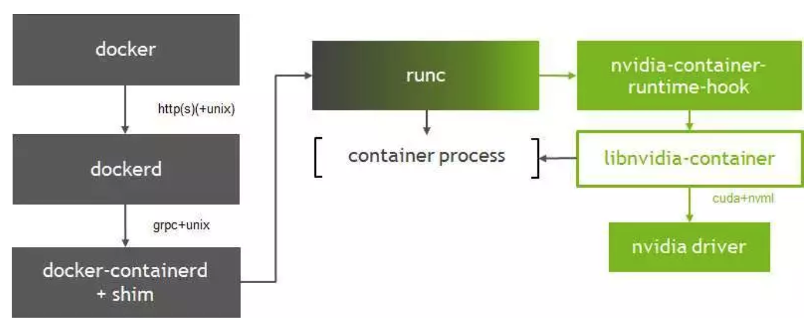
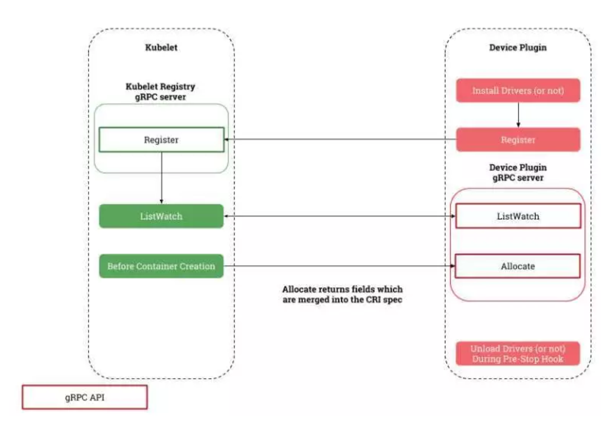
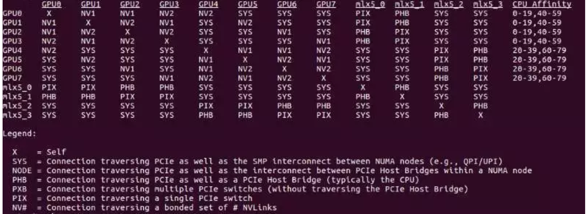
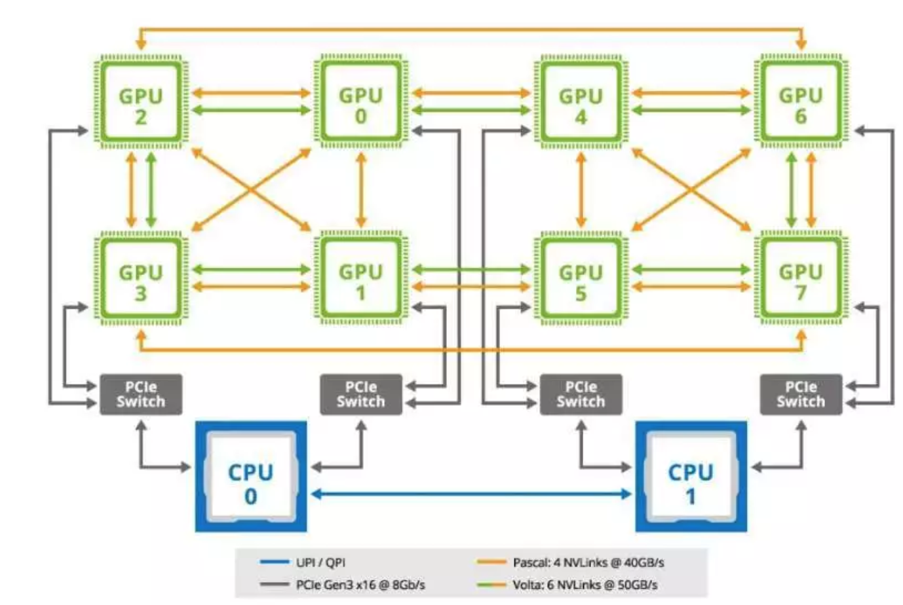

# 如何在Kubernetes实现GPU调度及共享

## 概论


近年来AI技术的繁荣和深化，尤其是深度学习的崛起，离不开海量数据和计算力的提升。尤其是对Nvidia的GPU的利用，让深度学习获得几十倍的性能提升，才彻底打开了AI想象空间。虽然智慧芯片近年来有着百花齐放的风景，最典型的例如Google的TPU，但是平心而论，从普惠意义和生态上，Nvidia的GPU仍然占有主导位置。


不过，`Nvidia`的`GPU无`疑是昂贵的，所以如何最大化利用好`GPU`的硬件资源，是每一个算力平台型产品都要考虑的问题。比如，有多个用户使用`GPU`服务器进行训练时，如何保证资源合理的分配非常重要。得益于`Nvidia`公司为`Docker`写的`Runtime`，也就是`Nvidia-Docker`，使得在`Docker`里使用`GP`U成为可能。

从容器粒度来管理和使用`GPU`要比从主机角度容易很多，因为运行GPU的AI任务通常配置非常复杂，这种复杂包括管理员从管理`GPU`卡的分配和使用者切换不同的训练环境，而容器可以封装不同的训练环境，很大程度上降低复杂性。此外，借助`Kubernetes`来管理`Nvidia-Docker`，**使得`GPU`任务的分配更加简单和合理，目前已成为几乎所有主流的`AI`算力平台的方案。**


`Kubernetes`支持通过`Device-Plugin`的方式来增加对默认资源(`CPU,Memory`等)之外的设备支持，而第三方可以通过编写相应的`Device-Plugin`来增加对设备的支持。目前`Nvidia`也是通过这样的方式对`GPU`进行支持。

**`K8s + Nvidia-Device-Plugin`的方式两个限制：**

每一块GPU同时最多只能被一个容器使用；没有考虑`GPU`卡之间的通道亲和性。 这样的方式已经满足了部分AI算力需求场景，**但是某些场景下还是有缺点和限制的**: 每一块`GPU`同时最多只能被一个容器使用，这在训练模式下没有任何问题，但是在开发调试模式下会造成巨大的资源浪费。

因为开发调试模式下用户大部分时间并没有实质运行`GPU`的资源，但却排他的独占了昂贵的`GPU`。此外在多卡主机架构下，`GPU`卡直接的连接通常是不一样的，有的通过`Nvlink`相连，有的通过`PCIe`，而不同的连接方式性能差别非常大。而没有考虑同个主机里`GPU`卡直接的通道亲和性时，也会给多卡计算时需要发生数据传输时(如`all_reduce`操作)带来过高的通信开销。

**那么自然而然，在同一个容器挂载多张`GPU`卡时，我们当然更希望会挂载通道亲和性更好的卡**

本文会介绍`K8s`进行GPU调度的通用流程和我们的一些改造方案。包括用于支持容器`GPU`挂载的`Nvidia-Docker`、`K8s`中将`GPU`作为拓展资源调度的`Device-Plugin`机制，以及针对原生`Nvidia-Device-Plugin`存在的问题的改造方案。

[nvidia-docker](https://github.com/NVIDIA/nvidia-docker)

## Nvidia-Docker的简单介绍

`Nvidia-Docker`是`Nvidia`官方对容器做的拓展，用以让容器能够支持`Nvidia`的`GPU`设备。据官方统计的数据标明，目前`Nvidia-Docker`的下载量已经超过200万次，可以得知目前使用`Nvidia-Docker`来做AI系统环境已经是非常主流的做法。

这里不详细介绍`Nvidia-Docker`的原理了，详细的原理可以阅读其官方的设计文档，这里只作简单的介绍。从2015年开始，Docker容器的诞生了一套容器运行时标准OCI(Open Containers Initiative)，它包含容器运行时标准(`Runtime-Spec`)和 容器镜像标准`(Image-Spec`)。而著名的Runc则是这套标准的一个默认实现，然而任何满足该标准的实现都可以注册为容器的运行时拓展。Containerd则包装了Runc和其它功能如生命周期管理等，以`Daemon`的形式运行在主机。`Nvidia-Docker`正是基于这一套拓展标准增加`Nvidia GPU`的容器支持。

**`Nvidia-Docker`主要原理**是将对`GPU`的支持放入一个兼容`OCI`标准的运行时库拓展`libnvidia-container`中，并在`Runtime`的API中进行调用，在`libnvidia-container`中通过共享和调用主机侧的`nvidia-driver`实现对`GPU`的支持。在容器启动时，`Runc`会调用一个叫做`nvidia-container-runtime-hook`的`hook`，这个`hook`会去检查相应的环境是否具有`GPU`的支持和一些环境检查，完成之后容器启动，在运行时容器内进程也是通过`libnvidia-container`暴露的接口进行交互，从而实现容器对GPU的透传和运行时支持。




值得注意的是，`Nvidia-Docker`容器会使用主机侧的`Nvidia-Driver`，再上层的软件栈如`cuda/cudnn`，`AI`框架等，则在容器里面提供。此外，**多个`Nvidia-Docker`可以挂载同一个`GPU`，只要通过环境变量指定就好，并没有数量上的限制。**


**为了方便理解后面`Device-Plugin`的机制，这里简单介绍一下`Nvidia-Docker`挂载不同`GPU`设备的方式。**

`Nvidia-Docker`的使用非常简单，它通过指定一个环境变量来指定将要挂载的`GPU`设备，不过要在`Docker`的配置文件中指定`Docker`的`Runtime`为`Nvidia-Docker`，或者通过命令行显式指定也可以：

```
nvidia-docker run -e NVIDIA_VISIBLE_DEVICES=0,1 --runtime=nvidia -it tensorflow/tensorflow-gpu:v1.13 bash
```

如果在`Docker`配置中已经做过相关配置，那么就可以简化为：

```
docker run -e NVIDIA_VISIBLE_DEVICES=0,1 -it tensorflow/tensorflow-gpu:v1.13 bash
```

这里`NVIDIA_VISIBLE_DEVICES`这个环境变量用来指定需要绑定的`GPU`卡的逻辑`ID`，就可以实现容器中对该卡的绑定，使用上非常简单。

## K8s的Device-Plugin机制

`K8s`通过`Device-Plugin`的机制对非默认的资源设备进行支持，例如`RDMA`设备、`AMD GPU`等，当然也包括本文最关心的`Nvidia GPU`。通过编写相应的`Device-Plugin`，第三方资源设备上可以在`K8s`中添加对相应设备的支持，让用户获得和原生资源`(CPU,Memory等)`近乎一样的使用体验。

**`Device-Plugin`机制本质上是一个`RPC`服务**。

`K8s`定义了一个`RPC`调用接口，第三方资源设备方可以通过实现该接口来让该设备得以在`K8s`侧得以支持，并且在使用方式上和默认资源没有太大区别。`Device-Plugin`以`Daemonset`的方式在主机侧运行，并且通过一个`Socket`文件与`Kubelet`进行通信，从而通过`Kubelet`给`K8s`上报相关信息。部署了该`Daemonset`的主机节点在`k8s`看来会包含由`Device-Plugin`注册的硬件资源。`Device-Plugin`总的原理如下：



首先，`Device-Plugin`需要向`K8s`注册该资源，注册机制通过实现以下`RPC`接口得以实现：

```

service Registration {
  rpc Register(RegisterRequest) returns (Empty) {}
}
```

在详细的`rpc`调用中，该接口会上报`socket`名称、`Device-Plugin`的`Api Version`等信息，当然，更重要的是它会上报`ResourceName`,该`ResourceName`会被`K8s`登记为该自定义设备的名称，而名称的规范是`vendor-domain/resource`，例如，`Nvidia`的`GPU`就被定义为`nvidia.com/gpu`，在用户申请资源时，就需要使用该名称。

例如，在创建`POD`的资源配置里，需要这样指定该资源：

```
apiVersion: v1
kind: Pod
metadata:
  name: demo-pod
spec:
  containers:
    - name: demo-container-1
      image: k8s.gcr.io/pause:2.0
      resources:
        limits:
          nvidia.com/gpu: 2 
```


注册之后，`Device-Plugin`还需要上报主机侧的设备的数量和状态，例如，如果主机节点上有`8`块`GPU`卡，`Device-Plugin`会将该数量的资源数量和资源id列表告知K8s。此外，当有`Pod`向`K8s`申请该资源时，`K8s`会从上报的`id`列表中按照一定策略返回满足用户需求的资源数量的`id`序列，当该`id`列表返回给`Device-Plugin`，再由`Device-Plugin`根据一定策略映射到真正的资源设备。以上的过程主要由以下的RPC调用实现的：

```
service DevicePlugin {
     rpc ListAndWatch(Empty) returns (stream ListAndWatchResponse) {}
     rpc Allocate(AllocateRequest) returns (AllocateResponse) {}
}
```

* 这里的`ListAndWatch`将由`Device-Plugin`调用`NVML`库获取主机侧的`GPU`设备和状态，并返回给`k8s`相应的设备列表。
* 而`Allocate`将在容器创建被调用，用来返回一些能够使用主机上该资源的特殊配置，比如一些环境变量，再将这些信息给到`Kubelet`，并在容器启动的时候传给容器。
* 对于`Nvidia GPU`而言，主要是前面的提到的环境变量`NVIDIA_VISIBLE_DEVICES`，这样容器启动的时候就能够挂载相应的`GPU`设备了。

值得注意的是，容器侧并没有任何`gpu`虚拟化或者显存分配的策略，所以`Nvidia-Device-Plugin`分配的粒度是单张卡，并且绝对的一一映射，即上报的`GPU`数量就是绝对的`GPU`数量，`k8s`侧负责资源的分配，再由`Device-Plugin`受`K8s`的返回的需要挂载`GPU`数量和`ID`，并将容器映射到实际的`GPU`设备上。

这样的方式在某些场景下是合理的，比如在强计算量任务的模式下，能够避免不同进程对`GPU`卡资源的争抢以致发生显存`OOM`等现象。但是在某些场景下缺会造成巨大的资源浪费。比如有某些容器环境仅仅是给到用户进行算法的开发和调试，这样的任务在绝大部分时间里并不会实际使用`GPU`，这种情况下能够让容器可以适当的共享`GPU`是有很大价值的，毕竟GPU的价格非常昂贵，我们需要提供共享机制最大化资源的使用。此外`Nvidia-Device-Plugin`并没有考虑`GPU`的亲和性，这有可能会让单容器多卡的容器遭遇较差的计算性能。这里会介绍我们的实现思路

## 如何让不同容器共享GPU？

前面介绍过，`Device-Plugin`通过`ListAndWatch`接口上报`GPU`资源列表，那么自然而然，我们会想，如果能够伪造出更多虚拟的`GPU ID`给`K8s`，`K8s`在分配`POD`资源的时候返回虚拟的`id`，再由`Device-Plugin`映射回真实的`id`从而实现`GPU`卡的复用，就像虚拟内存地址到物理内存地址映射一样，而虚拟内存可以比物理内存大很多。是的，主要的思路就是这样，构造出虚拟的`GPU`设备id，在容器真正启动的时候再映射到真实的`GPU`设备。但是有一个非常重要的问题需要解决：**怎么样保证GPU负载的大体上的平衡，而不会出现某些卡上绑定了太多的容器，而另一些卡上则没有任何容器？**

这个现象是有可能出现的，容器的寿命不一，不断的创建和删除容器极有可能会造成`GPU`资源分配的不均匀。所以虚拟`id`到真实`id`的映射不能够是通过一个简单的线性映射关系来决定，而是需要通过考虑在任务创建时的真实的GPU负载来动态的决定挂载`GPU`的`id`。

解决这个问题我们评估过两个方案：调用`NVML`获取`GPU`卡的实时状态，并选择负载较少的卡进行分配；借助外部数据库存放每个节点的`GPU`负载信息，`Device-Plugin`在`Allocate`的时候调用`Redis`的信息查看负载情况。我们最终采用的是第二种方法，因为`NVML`只能够查询进程占用、资源占用的情况，如果一个容器绑定了一块GPU卡，但容器里面并没有任何进程使用`GPU`，那么用`NVML`并不能查看真实的容器绑定关系。我们现阶段还是希望把负载局限在卡上绑定的容器数，而不是真实的`GPU`使用率。

当决定采用借助于一个外部的`Redis`数据库的方案，用来存放每个节点的实时动态的状态，我们会在`redis`中为每一个节点维护一个单独的`map`，记录每个`GPU id`上分配的容器数量和任务名称。当`Device-Plugin`每次决定`Allocate`分配时，会去查询`Redis`中查询该节点下各个`GPU id`的容器负载，选择最低的部分进行绑定，并且将相应的`GPU id`上的容器负载增加1。当资源释放时，`Device-Plugin`并不能知道释放的消息，我们通过K8s的调度服务的`Informer`机制，在自定义的`Informer`中捕捉到释放的`POD`的节点信息和任务名称，并以此并将`Redis`中相应的`GPU id`的资源数减去1。通过这种方式维护和监控着`GPU`资源的分配信息。这里仅仅介绍解决的思路，具体细节不再展开。

## 如何让多卡任务绑定亲和性高的卡？

`GPU`的通道亲和性在多卡训练任务中非常重要，因为不同的连接介质对卡与卡之间的数据传输速度影响非常大。以下是一个典型的8卡`GPU`的卡间通道拓扑图。可以看出有的卡之间是通过`Nvlink(NV1等)`相连，有的是通过`PCIe(PIX)`相连。




而不同的`GPU`通道会导致完全不一样的数据传输性能，通常它们之间的速度传输能相差很多倍，例如，`Nvlink`可以达到`几十GB/s`，而`PCIe`通常只有`10 GB/s`左右的吞吐性能。下图是`Nvidia Tesla P100`的系列的直观的连通拓扑图和通道传输性能：




正如前面所说，`Nvidia-Device-Plugin`并没有考虑通道的亲和性，也就是说在一个单容器双卡的容器中，通过`K8s`的调度极有可能将两个通过`PCIe`连接的卡绑定到一起，即便有在同一个`Nvlink`通道的卡的存在，这显然是不合理的。

**高亲和性和容器负载均衡有时会是相互矛盾的需求，如果追求绝对的亲和性，那么可能要牺牲容器任务的负载均衡。我们采用的算法策略是尽量让这两个指标取得一个均衡。**

如果不考虑真实的`GPU`任务负载，单纯的让高亲和性的卡绑定到一起是比较容易实现的。类似于共享`GPU`实现的思路，在多卡绑定的任务重，我们可以在`Device-Plugin`里面调用`NVML`，获得`GPU`卡的连接拓扑，从而知道它们之间的亲和性关系。然后当`Allocate`的时候，选择让高亲和性通道间的GPU卡分配到一起即可。但是，如果考虑到高亲和性的卡中间有部分的容器任务负载非常高，那么这个时候可能要高负载的影响。比较合理的方式是使用评分函数，按照一定策略给不同的可选组合评分，选择得分最高的组合。但是我们采用较简单和直接的策略：首先选出负载最小的一个`GPU id`，再选择跟这个`id`在同一高亲和性通道的`GPU`卡，并挑选其中任务负载最小的卡进行绑定。具体的细节不再展开了，主要是对`NVML`库的调用，可以拿到主机的通道拓扑，剩下的工作是顺理成章的。


## 总结

本文简单介绍了`Docker`对`Nvidia GPU`的支持方案以及`K8s`的`Device-Plugin`机制。并且针对现有的`Nvidia-Device-Plugin`的某些场景缺陷提供解决思路。主要是针对`GPU`卡的任务间共享和通道亲和性的优化。然而，这些改造都是要看场景的，有的场景值得和迫切需要这么做，但是有的场景却非常不适合。这样的改造会增加外部依赖并且让`Nvidia-Device-Plugin`的`GPU`卡的绑定策略变得更加复杂，所以我个人强烈建议只有在必要的时候进行这些改造。而平台的交互式测试、验证场景，正是这样改造的场景和动力。


