# Kubernetes 网络模型解析

`Kubernetes` 对 `Pod` 之间如何进行组网通信提出了要求，Kubernetes 对集群网络有以下要求：

* 所有的 `Pod` 之间可以在不使用 `NAT` 网络地址转换的情况下相互通信；
* 所有的 `Node` 之间可以在不使用 `NAT` 网络地址转换的情况下相互通信；
* 每个 `Pod` 看到的自己的 `IP` 和其他 `Pod` 看到的一致。

### `Kubernetes` 网络模型设计基础原则：

每个 `Pod` 都拥有一个独立的 `IP` 地址，而且假定所有 `Pod` 都在一个可以直接连通的、扁平的网络空间中。所以不管它们是否运行在同一个 `Node` (宿主机) 中，都要求它们可以直接通过对方的 `IP` 进行访问。设计这个原则的原因是，用户不需要额外考虑如何建立 `Pod` 之间的连接，也不需要考虑将容器端口映射到主机端口等问题。

由于 `Kubernetes` 的网络模型是假设 `Pod` 之间访问时使用的是对方 `Pod` 的实际地址，所以一个 `Pod` 内部的应用程序看到自己的 `IP` 地址和端口与集群内其他 `Pod` 看到的一样。它们都是 `Pod` 实际分配的 `IP` 地址 (从 docker0 上分配的)。这个 `IP` 地址和端口在 `Pod` 内部和外部都保持一致，我们可以不使用 `NAT` 来进行转换。

**鉴于上面这些要求，我们需要解决 4 个不同的网络问题：**

* 容器和容器之间的网络；
* `Pod` 与 `Pod` 之间的网络；
* `Pod` 与 `Service` 之间的网络；
* `Internet` 与 `Service` 之间的网络

下面我们对每种网络问题以及解决方法进行一一讨论。

## 1.容器和容器之间的网络

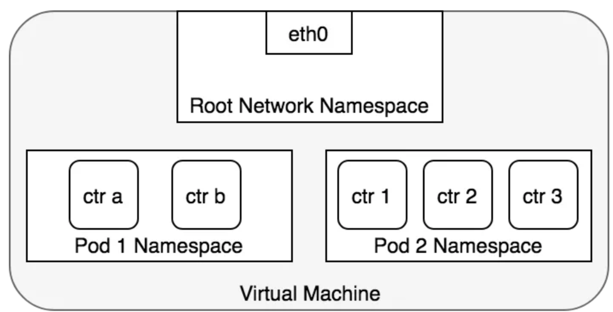 

* 在 `Kubernetes` 中每个 `Pod` 中管理着一组 `Docker` 容器，这些 `Docker` 容器共享同一个网络命名空间；
* **`Pod` 中的每个 `Docker` 容器拥有与 `Pod` 相同的 `IP` 和 `port` 地址空间，并且由于它们在同一个网络命名空间，它们之间可以通过 `localhost` 相互访问**。什么机制让同一个 Pod 内的多个 Docker 容器相互通信呢？**那是因为使用了 `Docker` 的一种网络模型：`–net=container`**。

`container` 模式指定新创建的 `Docker` 容器和已经存在的一个容器共享一个网络命名空间，而不是和宿主机共享。

**新创建的 `Docker` 容器不会创建自己的网卡，配置自己的 `IP`，而是和一个指定的容器共享 IP、端口范围等**。

**每个 `Pod` 容器都有一个 `Pause` 容器，它有独立的网络命名空间**，在 `Pod` 内启动 `Docker` 容器的时候，**我们使用 `–net=container` 就可以让当前的 `Docker` 容器加入到 `Pod` 容器拥有的网络命名空间中（`Pause` 容器）**。

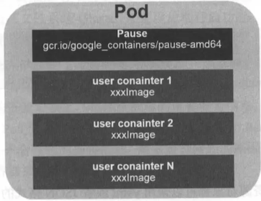 

## 2.Pod 与 Pod 之间的网络

* 在 `Kubernetes` 中，每个 `Pod` 拥有一个 `IP` 地址，**不同的 `Pod` 之间可以直接更改 `IP` 与彼此进行通讯**；
* 在同一个 `Node` 上，从 `Pod` 视角来看，它存在于自己的网络命名空间中，并且需要与该 `Node` 上的其他网络命名空间上的 `Pod` 进行通信。

那么是如何做到的？这多亏了我们可以使用 `Linux` 虚拟以太网设备，或者说是由两个虚拟接口组成的 `veth` 对使不同的网络命名空间链接起来，这些虚拟接口分布在多个网络命名空间上（这里是指多个 Pod 上）。

为了让多个 `Pod` 的网络命名空间链接起来，我们可以让 `veth` 对的一端链接到 `root` 网络命名空间（宿主机的），另一端链接到 `Pod` 的网络命名空间。

* 每对 `veth` 就像一根接插电缆，连接两侧并允许流量在它们之间流动；
* 这种 `veth` 对可以推广到同一个 `Node` 上任意多的 `Pod` 上。
* 上图展示了使用 `veth` 对链接每个 `Pod` 到虚拟机的 `root` 网络命名空间。

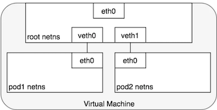 

**接下来，我们应该如何使用网桥设备来让通过 veth 对链接到 root 命名空间的多个 Pod 进行通信呢？**

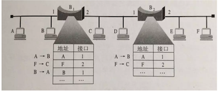 

网桥实现了 `ARP` 协议，根据给定的 `IP` 地址它会找到对应机器的数据链路层的 `MAC` 地址。一开始转发表为空，当一个数据帧被网桥接受后，网桥会广播该帧到所有的链接设备（除了发送方设备），并且把响应这个广播的设备记录到转发表中；随后发往相同 IP 地址的流量会直接从转发表查找正确的 MAC 地址，然后转发到对应的设备上。

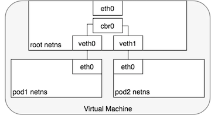 

如上图显示了两个 Pod 通过 veth 对链接到 root 网络命名空间，并且通过网桥进行通信。

###  同一个 Node 中的 Pod 之间的一次通信  

鉴于每个 `Pod` 有自己独立的网络命名空间，我们可以使用虚拟以太网设备把多个 `Pod` 的命名空间链接到 `root` 命名空间，并且使用网桥让多个 `Pod` 进行通信，下面我们看如何在两个 `Pod` 之间进行通信：

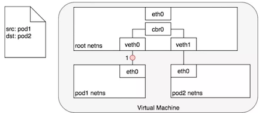 

* 通过网桥把 `veth0` 和 `veth1` 组成为一个以太网，它们直接是可以直接通信的，另外这里通过 `veth` 对让 `Pod1` 的 `eth0` 和 `veth0`、`Pod2` 的 `eth0` 和 `veth1` 关联起来，从而让 `Pod1` 和 `Pod2` 相互通信；
* `Pod 1` 通过自己默认的以太网设备 `eth0 `发送一个数据包，`eth0` 把数据传递给 `veth0`，数据包到达网桥后，网桥通过转发表把数据传递给 `veth1`，然后虚拟设备 `veth1` 直接把包传递给 `Pod2` 网络命名空间中的虚拟设备 `eth0`。

###  不同 Node 中的 Pod 之间通讯  

`Kubernetes` 网络模型需要每个 `Pod` 必须通过 `IP` 地址才可以进行访问，每个 `Pod` 的 `IP` 地址总是对网络中的其他 `Pod` 可见，并且每个 `Pod` 看到的自己的 `IP` 与别的 `Pod` 看到的是一样的（虽然它没规定如何实现），下面我们看不同 Node 间 Pod 如何交互？

**`Kubernetes` 中每个集群中的每个 `Node` 都会被分配一个 `CIDR` 块**（无类别域间路由选择：把网络前缀都相同的连续地址组成的地址组称为 CIDR 地址块）用来给该 `Node` 上的 `Pod` 分配 `IP` 地址。（保证 Pod 的 IP 不会冲突）另外还需要把 Pod 的 IP 与所在的 Node IP 关联起来。

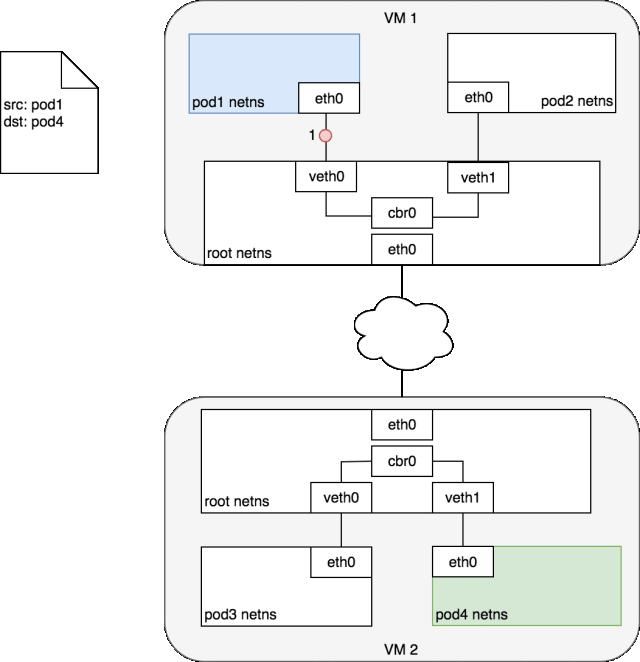 

* 如上图 `Node1(vm1)` 上的 `Pod1` 与 `Node2(vm2)` 上 `Pod4 `之间进行交互；
* 首先 `Pod1` 通过自己的以太网设备 `eth0` 把数据包发送到关联到 `root` 命名空间的 `veth0` 上，然后数据包被 `Node1` 上的网桥设备 `cbr0` 接受。网桥查找转发表发现找不到 `Pod4` 的 `MAC` 地址，则会把包转发到默认路由（`root` 命名空间的 `eth0` 设备），然后数据包经过 `eth0` 就离开了 `Node1`，被发送到网络；
* 数据包到达 `Node2` 后，首先会被 `root` 命名空间的 `eth0` 设备进行处理，然后通过网桥 `cbr0` 把数据路由到虚拟设备 `veth1` 上，最终数据表会被流转到与 `veth1 `配对的另外一端（Pod4 的 eth0）。

每个 `Node` 都知道如何把数据包转发到其内部运行的 `Pod`。当一个数据包到达 `Node` 后，其内部数据流就和 `Node` 内 `Pod` 之间的流转类似了。

**对于如何来配置网络，`Kubernetes` 在网络这块自身并没有实现网络规划的具体逻辑，而是制定了一套 `CNI（Container Network Interface）`接口规范，开放给社区来实现。**

例如 `AWS`，亚马逊为 `Kubernetes` 维护了一个容器网络插件 , 使用 `CNI` 插件来让亚马逊 `VPC`（虚拟私有云）环境中的 `Node` 与 `Node` 直接进行交互。

**`CoreOS` 的 `Flannel` 是 `Kubernetes` 中实现 `CNI` 规范较为出名的一种实现。**

#### VXLAN

* `UDP` 帧格式

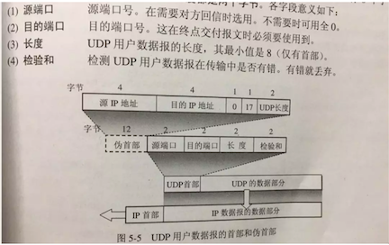 

* `VLAN`

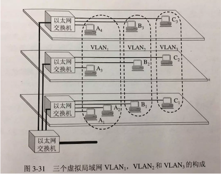 

* **`VXLAN` 协议格式 `VXLAN` 全称是 `Virtual Extensible Local Area Network`，虚拟可扩展的局域网**。它是一种 `overlay` 技术，**通过三层网络来搭建虚拟二层网络**，其帧格式为：

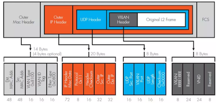 

**从这个报文中可以看到 3 部分：**

* 最外层的 `UDP` 协议报文用来在底层网络上传输，也就是 `vtep` 之间互相通信的基础；
* 中间是 `VXLAN` 头部，`vtep` 接受到报文之后，去除前面的 `UDP`协议部分。根据这部分来处理 `VXLAN` 的逻辑，主要是根据 `VNI` 发送到最终的虚拟机；
* 最里面是原始的报文，也就是虚拟机看到的报文内容。

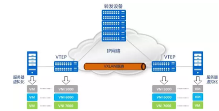 

* `VTEP（VXLAN Tunnel Endpoints）`：VXLAN 网络的边缘设备，用来进行 VXLAN 报文的处理（封包和解包）。vtep 可以是网络设备（比如交换机），也可以是一台机器（比如虚拟化集群中的宿主机）；
* `VNI（VXLAN Network Identifier）`：VNI 是每个 VXLAN 的标识，是个 24 位整数，一共有 2^24 = 16,777,216（一千多万），一般每个 VNI 对应一个租户，也就是说使用 VXLAN 搭建的公有云，理论上可以支撑千万级别的租户；
* `Tunnel`：隧道是一个逻辑上的概念，在 VXLAN 模型中并没有具体的物理实体相对应。隧道可以看做是一种虚拟通道，VXLAN 通信双方（图中的虚拟机）认为自己是在直接通信，并不知道底层网络的存在。从整体来说，每个 VXLAN 网络像是为通信的虚拟机搭建了一个单独的通信通道，也就是隧道。

#### Flannel

Flannel 是 CoreOS 团队针对 Kubernetes 设计的一个网络规划实现。**简单来说，它的功能有以下几点：**

* 使集群中的不同 `Node` 主机创建的 `Docker` 容器都具有全集群唯一的虚拟 `IP `地址；
* 建立一个覆盖网络（`overlay network`），这个覆盖网络会将数据包原封不动的传递到目标容器中。覆盖网络是建立在另一个网络之上并由其基础设施支持的虚拟网络。覆盖网络通过将一个分组封装在另一个分组内来将网络服务与底层基础设施分离。在将封装的数据包转发到端点后，将其解封装；
* 创建一个新的虚拟网卡 `flannel0 `接收 `docker` 网桥的数据，通过维护路由表，对接收到的数据进行封包和转发（VXLAN）；
* 路由信息一般存放到 `etcd` 中：多个 `Node` 上的 `Flanneld` 依赖一个 `etcd cluster` 来做集中配置服务，`etcd` 保证了所有 `Node` 上 `Flannel` 所看到的配置是一致的。同时每个 `Node `上的 `Flannel` 都可以监听 `etcd` 上的数据变化，实时感知集群中 `Node `的变化；
* `Flannel` 首先会在 `Node` 上创建一个名为 `flannel0` 的网桥（VXLAN 类型的设备），并且在每个 `Node` 上运行一个名为 `Flanneld` 的代理。每个 `Node` 上的 `Flannel` 代理会从 `etcd `上为当前 `Node` 申请一个 `CIDR` 地址块用来给该 `Node` 上的 `Pod` 分配地址；
* **`Flannel` 致力于给 `Kubernetes` 集群中的 `Node` 提供一个三层网络，它并不控制 `Node` 中的容器是如何进行组网的，仅仅关心流量如何在 `Node` 之间流转。**

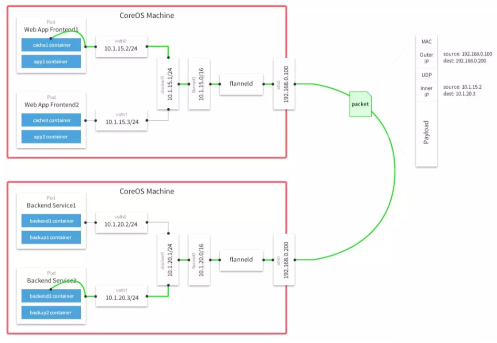 

* 如上图， `IP` 为 `10.1.15.2` 的 `Pod1` 与另外一个 `Node` 上 `IP` 为 `10.1.20.3` 的 `Pod2` 进行通信；
* 首先 `Pod1` 通过 `veth` 对把数据包发送到 `docker0` 虚拟网桥，网桥通过查找转发表发现 `10.1.20.3` 不在自己管理的网段，就会把数据包转发给默认路由（这里为 `flannel0` 网桥）；
* `flannel0` 网桥是一个 `VXLAN` 设备，`flannel0` 收到数据包后，由于自己不是目的 `IP` 地址 `10.1.20.3`，也要尝试将数据包重新发送出去。数据包沿着网络协议栈向下流动，在二层时需要封二层以太包，填写目的 `MAC` 地址，这时一般应该发出 `arp：”who is 10.1.20.3″`。但 `VXLAN` 设备的特殊性就在于它并没有真正在二层发出这个 `arp` 包，而是由 `linux kernel` 引发一个”L3 MISS”事件并将 `arp` 请求发到用户空间的 `Flannel` 程序中；
* `Flannel` 程序收到”L3 MISS”内核事件以及 `arp` 请求 (`who is 10.1.20.3`) 后，并不会向外网发送 `arp request`，而是尝试从 `etcd` 查找该地址匹配的子网的 `vtep` 信息，也就是会找到 `Node2` 上的 `flannel0` 的 `MAC` 地址信息。`Flannel` 将查询到的信息放入 `Node1 host` 的 `arp cache` 表中，`flannel0` 完成这项工作后，`Linux kernel` 就可以在 `arp table` 中找到 `10.1.20.3` 对应的 `MAC` 地址并封装二层以太包了：

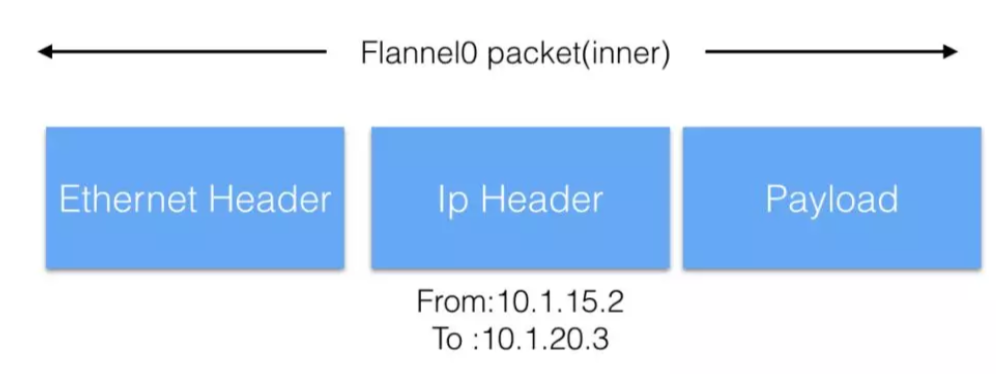 

* 由于是 `Vlanx` 设备，`flannel0` 还会对上面的包进行二次封装，封装新的以太网 MAC 帧：

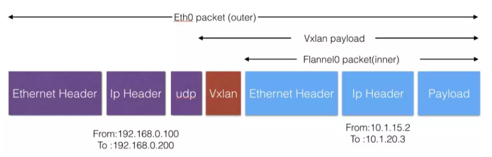 

* `Node` 上 `2` 的 `eth0` 接收到上述 `VXLAN` 包，`kernel` 将识别出这是一个 `VXLAN` 包，于是拆包后将 `packet` 转给 `Node` 上 `2` 的 `flannel0`。`flannel0` 再将这个数据包转到 `docker0`，继而由 `docker0` 传输到 `Pod2` 的某个容器里。

如上图，总的来说就是建立 `VXLAN` 隧道，通过 `UDP` 把 `IP` 封装一层直接送到对应的节点，实现了一个大的 `VLAN`。

## Pod 与 Service 之间的网络

上面展示了 `Pod` 之间如何通过它们自己的 `IP` 地址进行通信，但是 `Pod` 的 `IP` 地址是不持久的，当集群中 `Pod` 的规模缩减或者 `Pod` 故障或者 `Node` 故障重启后，新的 `Pod` 的 `IP` 就可能与之前的不一样。所以 `Kubernetes` 就中衍生出了 `Service` 来解决这个问题。

`Kubernetes` 中` Service `管理了一系列的 `Pod`，每个 `Service` 有一个虚拟的 IP，要访问 `Service` 管理的 `Pod` 上的服务只需要访问你这个虚拟 `IP` 就可以了。这个虚拟 `IP` 是固定的，当 `Service` 下的 `Pod` 规模改变、故障重启、`Node` 重启时候，对使用 `Service` 的用户来说是无感知的，因为它们使用的 `Service IP` 是没有变化的。

当数据包到达 `Service` 虚拟 `IP` 后，数据包会被通过 `Kubernetes`，给该 `Servcie` 自动创建的负载均衡器路由到背后的 `Pod` 容器上。下面我们看看具体是如何做到的？

###  netfilter  

为了实现负载均衡，`Kuberntes` 依赖 `Linux` 内建的网络框架 `-netfilter`。`netfilter` 是 `Linux` 提供的内核态框架，允许使用者自定义处理接口实现各种与网络相关的操作。 `netfilter` 为包过滤，网络地址转换和端口转换提供各种功能和操作，以及提供禁止数据包到达计算机网络内敏感位置的功能。在 `Linux` 内核协议栈中，有 5 个跟 `netfilter` 有关的钩子函数，数据包经过每个钩子时，都会检查上面是否注册有函数，如果有的话，就会调用相应的函数处理该数据包。

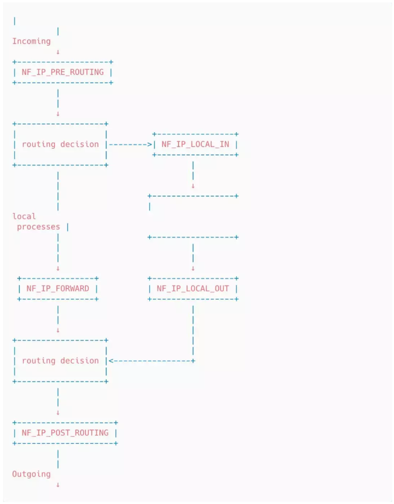 

* `NFIPPRE_ROUTING`：接收的数据包刚进来，还没有经过路由选择，即还不知道数据包是要发给本机还是其它机器；
* `NFIPLOCAL_IN`：已经经过路由选择，并且该数据包的目的 IP 是本机，进入本地数据包处理流程；
* `NFIPFORWARD`：已经经过路由选择，但该数据包的目的 IP 不是本机，而是其它机器，进入 forward 流程；
* `NFIPLOCAL_OUT`：本地程序要发出去的数据包刚到 IP 层，还没进行路由选择；
* `NFIPPOST_ROUTING`：本地程序发出去的数据包，或者转发（forward）的数据包已经经过了路由选择，即将交由下层发送出去。

`netfilter` 是工作在哪一层？

### iptables  

`iptables` 是运行在用户态的用户程序，其基于表来管理规则，用于定义使用 `netfilter` 框架操作和转换数据包的规则。根据 `rule` 的作用分成了好几个表，比如用来过滤数据包的 `rule` 就会放到 `Filter` 表中，用于处理地址转换的 `rule` 就会放到 `NAT` 表中，其中 `rule` 就是应用在 `netfilter` 钩子上的函数，用来修改数据包的内容或过滤数据包。目前 `iptables` 支持的表有下面这些：

* `Filter`：从名字就可以看出，这个表里面的 `rule` 主要用来过滤数据，用来控制让哪些数据可以通过，哪些数据不能通过，它是最常用的表；
* `NAT（*）`：里面的 `rule` 都是用来处理网络地址转换的，控制要不要进行地址转换，以及怎样修改源地址或目的地址，从而影响数据包的路由，达到连通的目的，这是家用路由器必备的功能；
* `Mangle`：里面的 `rule` 主要用来修改 `IP` 数据包头，比如修改 `TTL` 值，同时也用于给数据包添加一些标记，从而便于后续其它模块对数据包进行处理（这里的添加标记是指往内核 skb 结构中添加标记，而不是往真正的 IP 数据包上加东西）；
* `Raw`：在 `netfilter` 里面有一个叫做 `connection tracking` 的功能，主要用来追踪所有的连接，而 `Raw` 表里的 `rule` 的功能是给数据包打标记，从而控制哪些数据包不被 `connection tracking `所追踪；
* `Security`：里面的 `rule` 跟 `SELinux` 有关，主要是在数据包上设置一些 `SELinux` 的标记，便于跟 `SELinux `相关的模块来处理该数据包。

**在 `Kubernetes` 中，`iptables` 规则由 `kube-proxy` 控制器配置，该控制器监视 `Kubernetes API `服务器的更改。当对 `Service` 或 `Pod` 的虚拟 `IP` 地址进行修改时，`iptables` 规则也会更新以便让 `Service` 能够正确的把数据包路由到后端 Pod。**

`iptables` 规则会监视发往 `Service` 虚拟 `IP` 的流量，并且在匹配时，从可用 `Pod` 集合中选择随机 `Pod IP` 地址，`iptables` 规则将数据包的目标 `IP` 地址从 `Service` 的虚拟 `IP` 更改为选定的 `Pod` 的 `IP`。总的来说 `iptables` 已在机器上完成负载均衡，并将指向 `Servcie` 的虚拟 `IP` 流量转移到实际的 `Pod IP` 上。

在从 `Service` 到 `Pod` 的路径上，`IP` 地址来自目标 `Pod`。 在这种情况下，`iptables` 再次重写 `IP` 头以将 `Pod IP` 替换为 `Service` 的 `IP`，以便 `Pod` 认为它一直与 `Service ` 的虚拟 `IP` 通信。

### IPVS

Kubernetes 包括了用于集群内负载均衡的第二个选项：`IPVS`。 `IPVS（IP Virtual Server）`也构建在 `netfilter` 之上，并实现传输层负载均衡（属于 `Linux` 内核的一部分）。 `IPVS` 包含在 `LVS`（Linux 虚拟服务器）中，它在主机上运行，并在真实服务器集群前充当负载均衡器。 `IPVS` 可以将对基于 `TCP` 和 `UDP` 的服务的请求定向到真实服务器中，并使真实服务器的服务在单个 `IP` 地址上显示为虚拟服务。这使得 `IPVS` 非常适合 `Kubernetes` 服务。

声明 `Kubernetes` 服务时，你可以指定是否要使用 `iptables` 或 `IPVS` 完成集群内的负载均衡。 `IPVS` 专门用于负载均衡，并使用更高效的数据结构（哈希表），与 `iptables` 相比，几乎不限制规模。在创建 `IPVS` 负载时，会发生以下事情：**在 `Node` 上创建虚拟 `IPVS` 接口，将 `Service` 的 `IP` 地址绑定到虚拟 `IPVS` 接口，并为每个 `Service IP` 地址创建 `IPVS` 服务器。**

### `Pod` 到 `Service` 的一个包的流转  

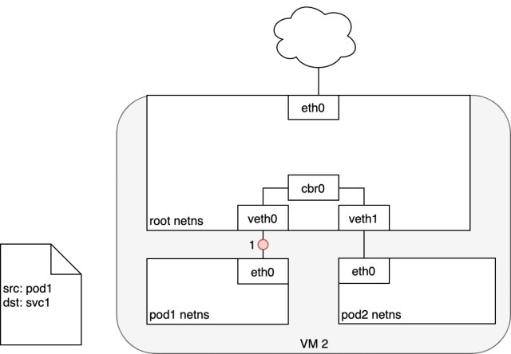 

* 如上图，当从一个 `Pod` 发送数据包到 `Service` 时候，数据包先从 `Pod1` 所在的虚拟设备 `eth0` 离开 `Pod1`, **并通过 `veth` 对的另外一端 `veth0` 传递给网桥 `cbr0`，网桥找不到 `Service` 对应 `IP` 的 `MAC` 地址，所以把包转发给默认路由，也就是 `root` 命名空间的 `eth0`；**
* 在 `root` 命名空间的设备 `eth0` 接受到数据包前，数据包会经过 `iptables` 进行过滤，`iptables` 接受数据包后会使用 `kube-proxy` 在 `Node` 上安装的规则来响应 `Service` 或 `Pod` 的事件，将数据包的目的地址从 `Service` 的 `IP` 重写为 `Service` 后端特定的 `Pod IP`（本例子中是 `Pod4`）；
* 现在数据包的目的 `IP` 就不再是 `Service` 的 `IP` 地址了，而是 `Pod4` 的 `IP` 地址；
* `iptables` 利用 `Linux` 内核的 `conntrack` 来记住所做的 `Pod` 选择，以便将来的流量路由到同一个 `Pod`（禁止任何扩展事件）。 从本质上讲，`iptables` 直接在 `Node` 上进行了集群内的负载均衡，然后流量使用我们已经检查过的 `Pod-to-Pod` 路由流到 `Pod`。

### `Service` 到 `Pod` 的一个包的流转  

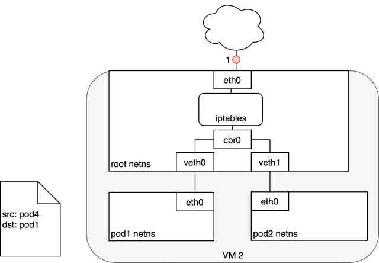 

* 到此数据包的 `Pod` 将会回发包到源 `Pod`，回包的源 `IP` 识别为自己的 `IP`（比如这里为 Pod4 的 IP），将目标 `IP` 设置为最初发送数据包的 Pod（这里为 Pod1 的 IP）。
* 数据包进入目标 `Pod`（这里为 Pod1）所在节点后，数据包流经 `iptables`，它使用 `conntrack ` 记住它之前做出的选择，并将数据包的源 `IP` 重写为 `Service IP`。 从这里开始，数据包通过网桥流向与 `Pod1` 的命名空间配对的虚拟以太网设备，并流向我们之前看到的 `Pod1` 的以太网设备。

## 4.Internet 与 Service 之间的网络

到目前为止，我们已经了解了如何在 `Kubernetes` 集群中路由流量。下面我们希望将服务暴露给外部使用（互联网）。 这需要强调两个相关的问题：

* 从 `Kubernetes` 的 `Service` 访问 `Internet`；
* 从 `Internet` 访问 `Kubernetes` 的 `Service`。

### `Kubernetes` 流量到 `Internet` 

从 Node 到公有 Internet 的路由流量是特定于网络的，实际上取决于网络配置。为了使本节更具体，下面使用 AWS VPC 讨论具体细节。

在 `AW`S 中，`Kubernetes` 集群在 `VPC` 内运行，其中每个 `Node` 都分配了一个可从 `Kubernetes` 集群内访问的私有 `I`P 地址。要使集群外部的流量可访问，需要将 `Internet` 网关连接到 `VPC` 中。 `Internet` 网关有两个目的：在 `VPC` 路由表中提供可以路由到 `Internet` 的流量目标，以及为已分配的公有 `IP` 地址的任何实例执行网络地址转换（NAT）。` NAT` 转换负责将集群专用的节点内部 IP 地址更改为公有 `Internet` 中可用的外部 IP 地址。

通过 `Internet` 网关，`Node` 可以将流量路由到 `Internet` 中。不幸的是，有一个小问题。 `Pod` 具有自己的 `IP` 地址，该 `IP` 地址与承载 `Pod` 的 `Node` 的 `IP` 地址不同，并且 `Internet` 网关上的 `NAT` 转换仅适用于 `Node` 的 `IP` 地址。因为它不知道` Node` 上正在运行哪些 `Pod`（Internet 网关不是容器感知的）。让我们再次看看 `Kubernetes` 如何使用 iptables 解决这个问题。

本质都是使用 NAT 来做！

### Node 到 Internet

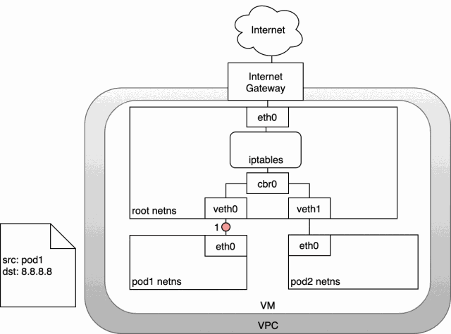 

如上图中，数据包源自 `Pod1` 的网络命名空间，并通过 `veth` 对连接到 `root` 命名空间：

* 一旦 `root` 命名空间，数据包就会从网桥 `cbr0` 传递到默认设备 `eth0` 上。因为数据包上的目的 `IP` 与连接到网桥的任何网段都不匹配，在到达 `root` 命名空间的以太网设备 `eth0` 之前，iptables 会修改数据包；

* 在这种情况下，数据包的源 `IP` 地址是 `Pod1` 的 `IP` 地址，如果我们将源保持为 `Pod1`，则 `Internet` 网关将拒绝它，因为网关 `NAT` 仅了解连接到 `VM` 的 `IP` 地址。解决方案是让 `iptables` 执行源 `NAT`，更改数据包源，以便数据包看起来来自 `VM` 而不是 `Pod`；

* 有了正确的源 `IP`，数据包现在可以离开 `VM`，并到达 `Internet` 网关。 `Internet` 网关将执行另一个 `NAT`，将源 `IP` 从 `VM` 内部 `IP` 重写为 `Internet IP`。最后，数据包将到达公有互联网。在回来数据包的路上，数据包遵循相同的路径，任何源 IP 都会与发送时候做相同的修改操作，以便系统的每一层都接收它理解的 IP 地址：`Node` 以及 `Pod` 命名空间中的 `Pod IP`。

###  Internet 到 Kubernetes  

 

让 Internet 流量进入 Kubernetes 集群，这特定于配置的网络，可以在网络堆栈的不同层来实现：

* `NodePort`；
* `Service LoadBalancer`；
* `Ingress` 控制器。

#### 第四层流量入口：`NodePort`

让外网访问 `Kubernetes` 内部的服务的第一个方法是创建一个 `NodePort` 类型的 `Service`，对于 `NodePort` 类型的 `Service`，`Kubernetes` 集群中的每个 `Node` 都会打开一个端口（所有 Node 上的端口相同），并将该端口上收到的流量重定向到具体的 `Service` 上。

对于 `NodePort` 类型的 `Service`，我们可以通过任何 `Node` 的 `IP` 和端口号来访问 `NodePort` 服务。

创建 `NodePort` 类型的服务：

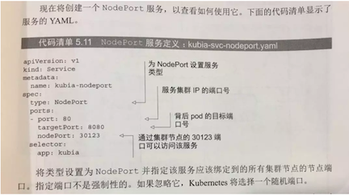 

如下图，服务暴露在两个节点的端口 `30123` 上，到达任何一个端口的链接会被重定向到一个随机选择的 `Pod`。

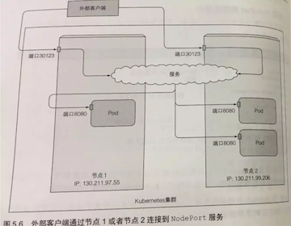 

如何做到的？

**`NodePort` 是靠 `kube-proxy` 服务通过 `iptables` 的 `NAT` 转换功能实现的，`kube-proxy` 会在运行过程中动态创建与 `Service` 相关的 `iptables` 规则。这些规则实现了 `NodePort` 的请求流量重定向到 `kube-proxy` 进程上对应的 `Service` 的代理端口上。**

`kube-proxy `接受到 `Service` 的请求访问后，会从 `Service` 对应的后端 `Pod` 中选择一个进行访问（RR）。

**但 `NodePort` 还没有完全解决外部访问 `Service` 的所有问题，比如负载均衡问题，假如我们的集群中有 `10` 个 `Node`，则此时最好有一个负载均衡器，外部的请求只需访问此负载均衡器的 `IP` 地址，由负载均衡器负责转发流量到后面某个 `Node` 的 `NodePort` 上。**

#### 第四层流量入口：`LoadBalancer`

该方式是 `NodePort` 方式的扩展，这使得 `Service` 可以通过一个专用的负载均衡器来访问，这个是由具体云服务提供商来提供的，负载均衡器会将流量重定向到所有节点的端口上。如果云提供商不支持负载均衡，则退化为 `NodePort` 类型。

创建 `Kubernetes Service` 时，可以选择指定 `LoadBalancer`。 `LoadBalancer` 的实现由云控制器提供，该控制器知道如何为你的 `Service` 创建负载均衡器。 创建 `Service` 后，它将公布负载均衡器的 IP 地址。 作为终端用户，你可以将流量定向到负载均衡器以开始与提供的 `Service `进行通信。

创建一个负载均衡服务：

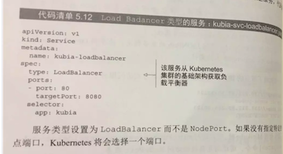 

借助 `AWS`，负载均衡器可以识别其目标组中的` Node`，并将平衡集群中所有节点的流量。 一旦流量到达 `Node`，之前在整个集群中为 `Service` 安装的 `iptables` 规则将确保流量到达感兴趣的 `Service` 的 `Pod` 上。

下面看下 `LoadBalancer` 到 `Service` 的一个数据包的流转过程：

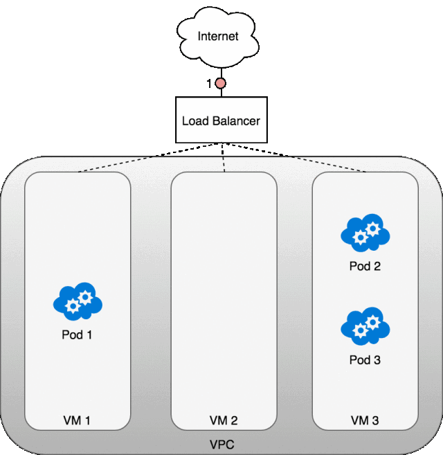 

**LoadBalancer 在实践中是如何运作的?**

* 部署 `Service` 后，正在使用的云提供商将会创建一个新的 `LoadBalancer`；
* 由于 `LoadBalancer` 不能识别容器，因此一旦流量到达 `LoadBalancer `后，它就会把数据包发送到在构成集群的某个 `Node` 中。每个 `Node` 上的 `iptables` 规则将来自 `LoadBalancer` 的传入流量重定向到正确的 Pod上；
* 这些 `iptables` 规则是在 `Service` 创建时候创建的。从 `Pod` 到请求方的响应将返回 `Pod `的 IP，但请求方需要具有 `LoadBalancer` 的 IP 地址。这就需要 `iptables` 和 `conntrack` 用于在返回路径上正确地重写 IP。

上图显示了承载 Pod 的三个 `Node` 前面的网络 `LoadBalancer`。首先流量被传到的 `Service` 的 `LoadBalancer（1）`。一旦 `LoadBalancer` 收到数据包`（2）`，它就会随机选择一个 `VM`。这里我们故意选择了没有 `Pod` 运行的` Node：Node 2`。在这里，`Node` 上运行的 `iptables` 规则将使用 `kube-proxy` 安装在集群中的内部负载均衡规则将数据包定向到正确的 `Node` 中的 `Pod`。 `iptables` 会执行正确的 `NAT` 并将数据包转发到正确的 `Pod（4）`中。

需要注意的是每个服务需要创建自己独有的 `LoadBalancer`，下面要讲解的一种方式所有服务只需要一个公开服务。

#### 第七层流量入口：Ingress Controller

这是一个与上面提到的两种方式完全不同的机制，通过一个公开的 `IP` 地址来公开多个服务，第 `7` 层网络流量入口是在网络堆栈的 `HTTP/HTTPS` 协议范围内运行，并建立在 `Service` 之上。

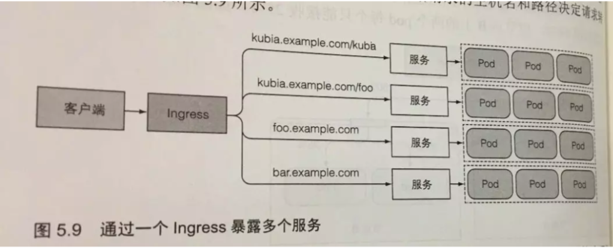 

如上图，不像负载均衡器每个服务需要一个公开 `IP`。`Ingress` 中的所有服务只需要一个公网 `IP`, 当客户端向 `Ingress` 发送 `HTTP` 请求时候，`Ingress` 会根据请求的主机名和路径决定请求转发到哪个服务中。

创建 Ingress 资源：

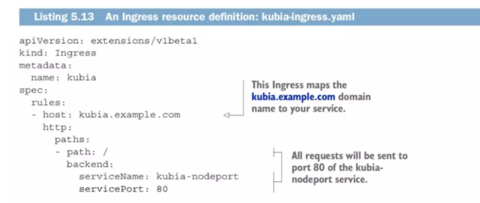 

如上定义了一个单一规则的 `Ingress`，请确保 `Ingress` 控制器接受的所有请求主机 `kubia.example.com` 的 `HTTP` 请求被发送到端口 `80` 上的 `kubia-nodeport` 服务。

工作原理：如下图，客户端首先对 `kubia.example.com` 执行 `DNS` 查找，`DNS` 服务器可以返回 `Ingress`控制器的 `IP`。客户端拿到 `IP` 后，向 `Ingress` 控制器发送 `HTTP` 请求，并在 `Host` 投中指定的 `kubia.example.com`。控制器接受到请求后会从 `Host` 头部就知道该访问哪个服务，通过与该 `Service` 关联的 `endpoint` 对象查询 `Pod IP`，并将请求转发到某一个 `Pod`。

这里 `Ingress` 并没把请求转发给 `Service`，而是自己选择一个一个 `Pod` 来访问。

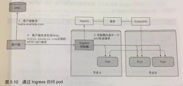 

第 `7` 层负载均衡器的一个好处是它们具有 `HTTP `感知能力，因此它们了解 `UR`L 和路径。 这允许你按` URL` 路径细分服务流量。 它们通常还在 `HTTP` 请求的 `X-Forwarded-For` 标头中提供原始客户端的 `IP` 地址。
