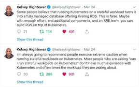
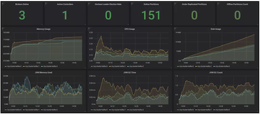

# 在 Kubernetes 上运行 Kafka 合适吗？

> 你应该将 kafka 运行在 kubernetes 之上吗？没有 Kubernetes，Kafka 会跑得更好吗？本文作者软件工程师 Johann Gyger 将指出 Kafka 和 Kubernetes 之间的互补性以及你可能遇到的陷阱。

Kubernetes 的设计初衷是运行无状态的工作负载。这些工作负载通常采用微服务架构的形式，属于轻量级，可水平扩展，遵循 12 要素的应用原则，可以处理环形断路和`Chaos Monkey`测试。

另一方面，`Kafka` 本质上是一个分布式数据库。这意味着你必须处理状态，它比微服务更重量级。`Kubernetes` 支持有状态的工作负载，但你必须谨慎对待它，正如谷歌云平台的开发引领者以及“Kubernetes Up and Running”的联合作者 `Kelsey Hightower` 之前两条推文中指出的那样：

你现在应该在 `Kubernetes` 上运行 `Kafka` 吗？

## 1.运行时

让我们先看一下一些基本的东西：运行时本身。

### 进程

`Kafka broker` 对 `CPU` 很友好。`TLS` 可能会引入一些开销。如果 `Kafka` 客户端进行加密处理，则需要更多 `CPU`，但这不会影响 `broker`。

### 内存

**`Kafka broker` 是内存消耗大户**。`JVM` 堆通常可以限制为 `4-5 GB`，但由于 `Kafka` 大量使用页面缓存，因此还需要足够的系统内存。在 `Kubernetes` 中，你可以相应地设置容器资源限制和请求。

### 存储

**容器中的存储是短暂的，重启后数据将丢失。**

你可以对 `Kafka` 数据使用 `emptyDir` 卷，这将产生相同的效果：**`broker` 的数据将在停机后丢失，但是你的消息在其他 `broker` 上作为副本还是可以使用的。因此，重新启动后，失败的 `broker` 必须得复制所有的数据，这可能是一个耗时过程。**

这也是你应该使用持久存储的原因。**使用 `XFS` 或 `ext4` 的非本地持久性块存储更合适。我警告你：不要使用 `NFS`。`NFS v3` 和 `v4 `都不会起作用。简而言之，`Kafka broker` 会因为 `NFS` “愚蠢重命名”问题而无法删除数据目录，自行终止**。

存储必须是非本地的，以便 `Kubernetes` 在重新启动或重新定位时可以更灵活地选择另一个节点。

### 网络

与大多数分布式系统一样，`Kafka` 性能在很大程度上取决于低网络延迟和高带宽。不要试图将所有代理放在同一节点上，因为这会降低可用性。如果 `Kubernetes` 节点出现故障，那么整个 `Kafka` 集群都会出现故障。不要跨数据中心扩展 `Kafka` 集群。这同样适用于 `Kubernetes` 集群。

## 2.配置

### 清单

[`Kubernetes` 网站包含一个非常好的教程](.https://kubernetes.io/docs/tutorials/stateful-application/zookeeper/)，介绍如何使用清单设置 `ZooKeeper`。由于 `ZooKeeper` 是 `Kafka` 的一部分，因此可以通过这个了解哪些 `Kubernetes` 概念被应用在这里。一旦理解，你也可以对 `Kafka` 集群使用相同的概念。

* `Pod`：`Pod` 是 `Kubernetes` 中最小的可部署单元。它包含你的工作负载，它代表集群中的一个进程。一个 `Pod` 包含一个或多个容器。整体中的每个 `ZooKeeper` 服务器和 `Kafka` 集群中的每个 `Kafka broker` 都将在一个单独的 `Pod` 中运行；

* `StatefulSet`：`StatefulSet` 是一个 `Kubernetes` 对象，**用于处理需要协调的多个有状态工作负载。** `StatefulSets` 保证 `Pod` 的有序性和唯一性；

* `Headless Services`：服务通过逻辑名称将 `Pod` 与客户端分离。`Kubernetes` 负责负载均衡。但是，对于 `ZooKeeper` 和 `Kafka` 等有状态工作负载来说，客户端必须与特定实例进行通信。这就是 `Headless Services`发挥作用的地方：作为客户端，你仍然可以获得逻辑名称，但不必直接访问 `Pod`；

* 持久卷：如上所述，你需要配置非本地持久块存储。

[https://github.com/Yolean/kubernetes-kafka](https://github.com/Yolean/kubernetes-kafka])

###  Helm charts 

`Helm` 是 `Kubernetes` 的包管理器，类似 `yum`、`apt`、`Homebrew` 或 `Chocolatey` 等 OS 包管理器。它允许你安装 `Helm charts` 中描述的预定义软件包。被精心设计过的 `Helm charts` 能简化所有参数正确配置的复杂任务，以便在 Kubernetes 上运行 Kafka。Kafka 有几张 chart 可供选择：一个是处于演进状态的[官方 `chart`](.https://github.com/helm/charts/tree/master/incubator/kafka)，一个来自 `Confluent`，另一个来自 `Bitnami`，仅举几例。

### Operators

由于 `Helm` 的一些限制，另一种工具变得非常流行：`Kubernetes Operators`。`Operators` 不仅可以为 `Kubernetes` 打包软件，还可以为 `Kubernetes` 部署和管理一个软件。

评价很高的 `Operators` 名单中提到的 `Kafka` 有两个，[其中一个是 `Strimzi`](https://strimzi.io/)，Strimzi 使得在几分钟内启动 `Kafka` 集群变得非常容易，几乎不需要任何配置，它增加了一些漂亮的功能，如集群间点对点 `TLS` 加密。`Confluent` 还宣布即将推出新的 `Operator`。

###  性能 

运行性能测试来测试 `Kafka` 的安装非常重要的。在你遇到麻烦之前，它会为你提供一些可能出现问题的地方。幸运的是，`Kafka` 已经提供了两个性能测试工具：`kafka-producer-perf-test.sh` 和 `kafka-consumer-perf-test.sh`。你要记得经常使用它们。

## 3.运维

### 监控 

可见性非常重要，否则你将不知道发生了什么。`Prometheus` 和 `Grafana` 是两种非常流行的监控工具。`Prometheus` 可以直接从 `JMX `导出器收集所有 `Java` 进程（`Kafka`、`ZooKeeper`、`Kafka` Connect）的指标，添加 `cAdvisor` 指标可为你提供有关 Kubernetes 资源使用情况的其他信息。

`Strimzi` 为 `Kafka` 提供了一个优雅的 `Grafana` 仪表板示例。它以非常直观的方式可视化关键指标，如未复制的和离线分区。它通过资源使用和性能以及稳定性指标来补充这些指标。因此，可以免费获得基本的 `Kafka` 集群监控！

[https://strimzi.io/docs/master/#kafka_dashboard](https://strimzi.io/docs/master/#kafka_dashboard)

你可以通过客户端监控（消费者和生产者指标），使用 Burrow 滞后监控，使用 [Kafka Monitor](https://github.com/linkedin/kafka-monitor) 进行端到端监控，来完成这个任务。

### 日志记录 

日志记录是另一个关键部分，它可以确保 `Kafka` 安装中的所有容器都记录到**标准输出（`stdout`）和标准错误输出（`stderr`）**，并确保 `Kubernetes` 集群将所有日志聚合到中央日志记录设施中（如 Elasticsearch 中）。

### 健康检查 

`Kubernetes` 使用活跃度和就绪探测器来确定 `Pod` 是否健康。如果活跃度探测失败，`Kubernetes` 将终止容器并在相应设置重启策略时自动重启。如果准备就绪探测失败，那么 Kubernetes 将通过服务从服务请求中删除该 Pod。这意味着在这种情况下不再需要人工干预，这是一大优点。

### 滚动更新 

`StatefulSets` 支持自动更新：滚动更新策略将一次更新一个 `Kafka Pod`。通过这种方式，可以实现零停机时间，这是 `Kubernetes` 带来的另一大优势。

### 扩展

扩展 `Kafka` 集群并非易事。但是，`Kubernetes` 可以很容易地将 `Pod` 缩放到一定数量的副本，这意味着你可以声明式地定义所需数量的 `Kafka brokers`。困难在于你需要在放大或缩小之前重新分配这部分。同样，Kubernetes 可以帮助你完成这项任务。

###  管理 

通过在 `Pod` 中打开 `shell`，你可以使用现有的 `shell` 脚本完成 `Kafka` 集群的管理任务，例如创建主题和重新分配分区。这并不是一个很好的解决方案。`Strimzi` 支持与另一个 `Operator` 管理主题（这还有改进的余地）。

### 备份和还原 

现在 Kafka 的可用性还取决于 `Kubernetes` 的可用性。如果 `Kubernetes` 集群出现故障，那么在最坏的情况下 `Kafka` 集群也会出现故障。墨菲定律告诉我们，这也会发生在你的身上，你会丢失数据。如果你想降低此风险，请确保你具有备份想法。

`MirrorMaker` 是一种可选方案，另一种可能是利用 `S3 `进行连接备份，[如 Zalando 的博客文章所述](https://jobs.zalando.com/tech/blog/backing-up-kafka-zookeeper/)。

## 总结

对于中小型 Kafka 集群，我肯定会选择 Kubernetes，因为它提供了更大的灵活性并简化了操作。如果你在延迟和吞吐量方面有非常高的非功能性要求，那么选择不同的部署选项可能更有益。

