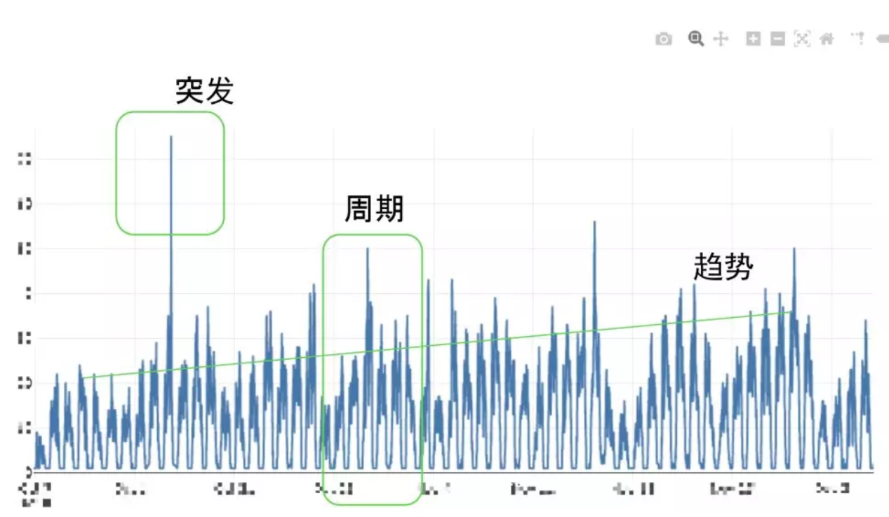
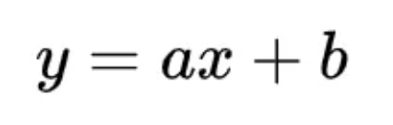
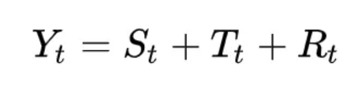
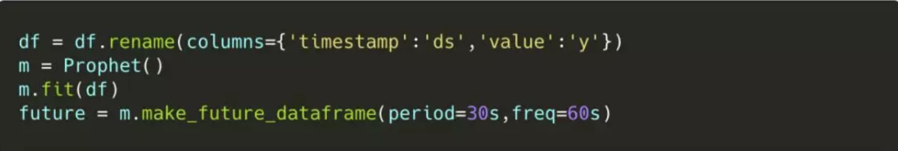
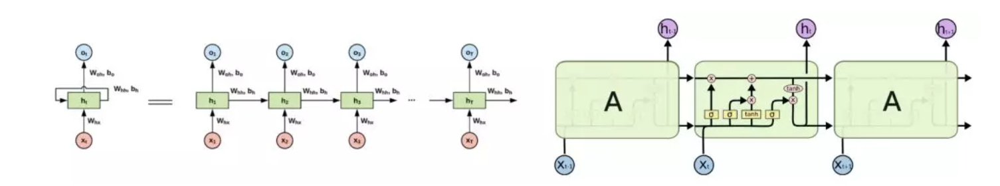

# Kubernetes 预测性集群伸缩

`Kubernetes` 本身有很多方面的 `scaling`，包括 Pod 的垂直扩展和集群物理节点的扩展等。今天我想介绍的是 `Cluster-Autoscaler` 用于物理节点的扩展。

**我会先从子项开始，然后介绍我们怎么做预测性扩展，谈谈在这个预测性扩展中我们尝试过的一些算法。**

## 1.CA：一个按需伸缩物理资源的组件

**`Cluster-Autoscaler（CA`）是一个在 Kubernetes 中做虚拟机节点扩展的组件，它可以帮你屏蔽掉资源的物理层需求。**

也就是说，当你申请的资源出现不足时，它会自动添加一个物理资源。 

这样的好处是不论你有多少台机器，你只需要关心自己用的 `Pod`，在容器层给用户提供数据分析的工具和平台。当然，这也意味着我们面临的用户用量波动会很大，这就是为什么我们需要这样一个组件来做支撑，而不是一种静态的技术。

`Cluster-Autoscaler` 主要由三个部分组成，

* 第一个部分是 `Predicate`，**主要负责确定一个 `Pod` 能否在某 `Node` 上调度**，它的依据是 `CPU`、`GPU` 或者 `memory`。比如创建 `Pod` 时，它所需要的 `GPU` 和内存会被作为它能不能跑到 `Node` 上的判断依据。
* **第二部分是` Priority`。** 完成上一步后，如果我们发现有一些 Node 能满足需求，那么我们就要考虑一个新问题：该选用哪个 Node？这时的考虑情况也很多，比如 `NodeSelector`，或者更进一步的 `NodeAffinity`，或者在这个 `Deployment` 当中，它会尽量分散到不同的 `Node` 上。 这就是 `Priority` 替我们考虑一些事情。
* **最后一部分 `Scheduler` 处理的就是当我们把 `Node` 排序以后，我们从中找出一个最合适的，然后把 Pod 放进去**。之前我们提到，在 `CA` 中，`Predicate` 的一个作用是验证是否需要新增新的机器，`Scheduler` 也有相似的作用。即便我们没找到合适的 `Node`，没有 `Priority`，`Scheduler `也可以发挥作用。

`CA` 基于 `Group` 的能力，它可以根据需求在云厂商上自动扩展物理节点，通过 `API` 获取 `Node Group` 原信息，并知道 `Node Group` 里机器的型号，以此构造一个虚拟的 `Node`，比如说一个 `4G` 或 `8G` 的机器。一旦有了这些 `Node` 模板，那么当我们手头有一些的 `Pending Pod` 时，我们就可以尝试用这些假的 `Node Template` 去配合一下，看它能不能调动上去。

下面我介绍一下 CA 的主体逻辑，**它的处理对象就是无法调度的 Pending Pod**，整个调度默认每 10 秒执行如下逻辑：

1. 检查集群中 `Node Group` 的健康状态；
2. 尝试解决集群现有的错误，**如果有节点长期没有加入到集群中，尝试删除并且重试**；
3. 找到无法调度的 `Pending Pod`，如果 `Pod` 是刚创建的也会暂时过滤；
4. 找到一个 `Node Group`，通过扩展一定数量的机器可以让 `Pending Pod` 运行，`Node` 的模板从公有云的 `API` 中获取，这也是为什么需要使用 `Scheduler` 的逻辑；
5. 在模拟状态下，确定选出的 `Node Group` 需要扩展的节点数量；
6. 决定最佳的扩展策略（`expander option`），最便宜/最小/最大，执行真正的扩展动作；
7. **查找低使用率（`<50%`，没有无法迁移的 `Pod`，没有无 `RelipcaSet` 的 `Pod`）的 `Node`；**
8. 删除长时间保持上述状态的 `Node`，默认 `10` 分钟。

## 2.如何实现预测性伸缩

**一是你可以看到资源用量有明显周期性，二是资源整体用量存在长期的增长趋势，三是资源用量存在激增的突发情况。** 

如下图所示，我画了一条合理的资源调动曲线。

理想情况下，如果我们调度的机器物理资源和实际用户用量是完全一致，那么我们就没有浪费一分钱；如果机器的用量在这条曲线下面，说明物理资源满足不了用户需求，用户在等或者用户根本用不了；如果在上面，那我们就是在浪费钱。

我们的策略是尽量浪费少一点，确保能满足用户需求，也就是尽量不要让机器用量在曲线下面。如果对这件事做抽象，计算资源无非就是 `Pod` 和 `Node`，如果我们是在公有云上跑，它其实就又多了一层，就是云厂商的物理节点。

**我们需要把公有云上物理节点加到 Kubernetes 集群当中，来满足用户的这些需求。**

为了实现这点，首先我们会设计统一的 `Interface`，使得预测模型只需要预测接下来会需要多少 `Pod`。预测算法需要统一接口，根据时间、当前 `Pod` 的资源用量，输出需要进行扩展的 `Pod`。这个问题可以归类到时序预测的范畴中，需要相关人员有相应的 `Kubernetes` 专业背景知识，同时也要有时序预测的统计学和机器学习相关的知识。

那么具体该怎么实现呢？我们需要构造 `Pod` 模板，对 `Pod` 进行粒度划分，虚拟 `Pending`。因为真实用户的 `Pod` 其实有很多种，它们可能是 `0.5` 和 `1.5` 的，也可能是 `4.5` 核的，它们的 `GPU` 资源也不统一，很难实现统一操控。如果我们对 `Pod` 做分级，按照 `Node Group` 这样一个抽象的概念，有个 `virtual Pod`，这个 `virtual Pod` 其实就是 `Pod` 的模板。

同时，为了避免虚拟 `Pod` 构造太大造成浪费和虚拟 `Pod` 构造太小无法触发扩展两种情况，我们在完成预测性推断之后，又在真实的 `Pending Pod` 之后追加 `Predictive Pod`。

用户走 `CA` 流程时只看到一批 `Pending Pod`，它们可能是真的也可能是假的，假的那部分是我们通过预测做出来的。

还有一个需要修改的地方就是社区的 CA，如果触发 Scale Up，它是不会 Scale Down 的。这个也很好理解，如果我们要加机器，为什么要减机器呢？但这很多时候不一定准确，你也不知道需不需要减机器。

**所以我们关闭了一些 `CA` 的优化逻辑，在有 `Pending Pod` 的情况下始终触发 `Scale Down` 检查，并且通过贪心和时间排序把虚拟 `Pod` 尽量占领相对固定的 `Node`。**

## 3.预测算法

我们先从一个简单的线性模型看起。我们根据当前用户资源的使用情况，乘上一定系数作为当前需要准备的资源用量。

**比如说我希望我们的 `Node`，不管有没有 `Pod`，我都有三台机器， 那 `b` 就是 `3`。我希望我的资源永远比现在的用户多一点，比如多 `30%`，那么我就把 `a` 设成 `1.3`。**

它的优点不用说，简单，不需要借助第三方的推断服务，在代码中实现静态的 `Interface`，更新参数重启即可。但它的缺点也很突出，就是不够灵活，我之前那张资源调动曲线图就是最好的证明。

**如果突发很多的话，假设这个值是 1 万，那么 1.3 就是就是 13000，相当于我为了开 1 万台机器，需要多开 3000 台机器，这个成本可想而知。这种线性模型不符合我们的实际期望，所以虽然简单但是不合理。**

**这是一种传统的统计学方法，只要把数据传进去，它就能自动做持续预测。**

* 它有三个值，其中 `S` 表示 `season`，也就是它的周期，周期模拟的方式等同于傅立叶级数，就是通过 `N` 个三角函数叠到一起，它就能模拟不同的周期函数。

* `T` 表示趋势，它是一个 `basis`，你可以把 `basis` 理解为假期，比如说公司临时放假一天，它在周末周期规划之外，但一天时间并不够你回老家，这时你可以把节假日都算进去，统一起来。

* 最后的 `R` 表示剩余项。

这种预测算法的调用方式也很简单，只需一行 `Python` 就可以做预测了。除此之外，对没有相关背景的人非常友好也是它的优点，任何人都能通过它得到非常好的效果。

但它也有缺点，就是它是一个 `Python `库，只能以 `Python Service` 的方式部署。同时，**由于只是一个基于时间的持续预测，它在面对突发情况时表现往往不是特别好**，

**因为它没有输入 `Pod`，它只与时间相关，所以虽然大部分情况下它的效果都不错，但在突发的那条高线上，它还是无法满足我们的需求**。

最后，我们再聊一聊 `LSTM`。`

`LSTM` 也叫长短期记忆网络，它是 `RNN` 的变种。RNN 把上一层的输出作为下一层的输入，从某种程度上说，它是一个无限长的多层感知机，而 `LSTM` 对 `RNN` 的优化在于它很“健忘”。

这个概念在文本任务中比较常见，比如说我们在做一个喜欢猫还是喜欢狗的预测，期间有条输入是“我喜欢金鱼”，它就可以被选择性遗忘。尽管最常见于文本任务，LSTM 在时间序列预测上的表现也很好，在我们的场景下，**它可以结合 Pod 的资源分配和时间进行动态预测，把突发情况也统一到模型当中，相对来说更灵活。算法也可以交由数据部门优化，后端无感。**

它的缺点是如果要构成一个独立的服务的话，可能是 PB 或者是 ONNX，因为它要用 tf 或 torch 去训练。其实这应该不算缺点，这是标准的，它可以通过 `tf-serving` 部署。所以如果我们把接口统一成 `PB` 的话，那预测模型就不需要修改，我们只要统一 `Model` 接口。

## 4.总结

* CA 是一个用于在公有云上进行集群自动伸缩的组件；
* 架构分层和专业分层要求接口的分层（后端工程师和算法工程师）；
* CA 按照公有云的虚拟机分级，构造虚拟 Pod；
* 介绍时序预测的方法：线性模型、fbprophet、LSTM。

